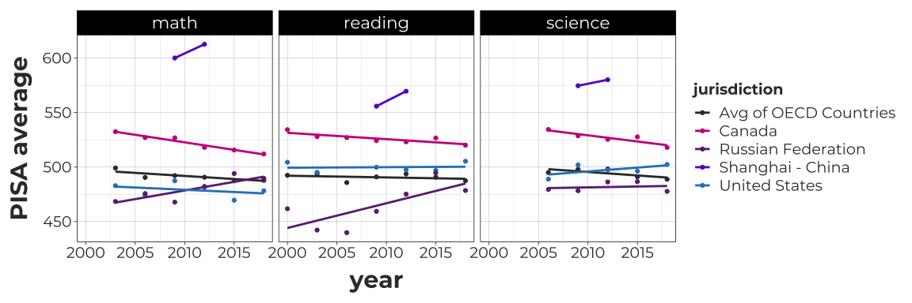
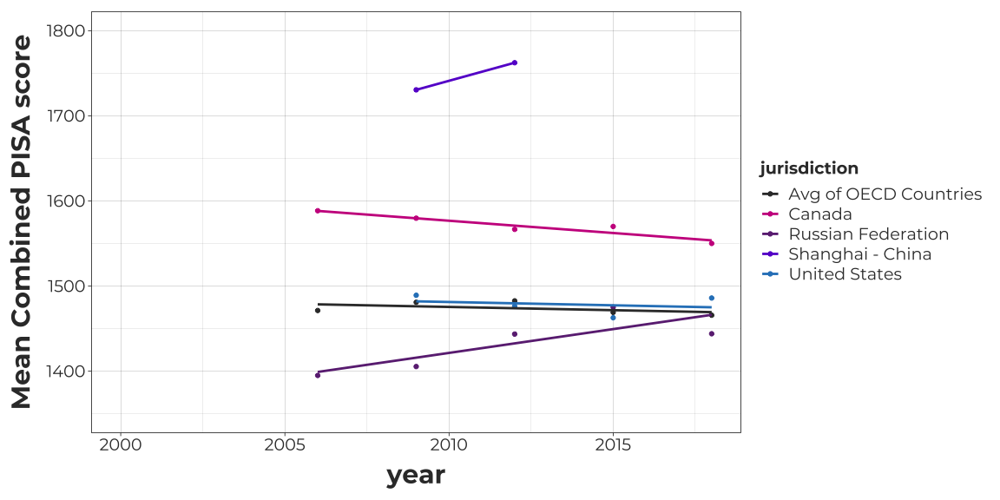
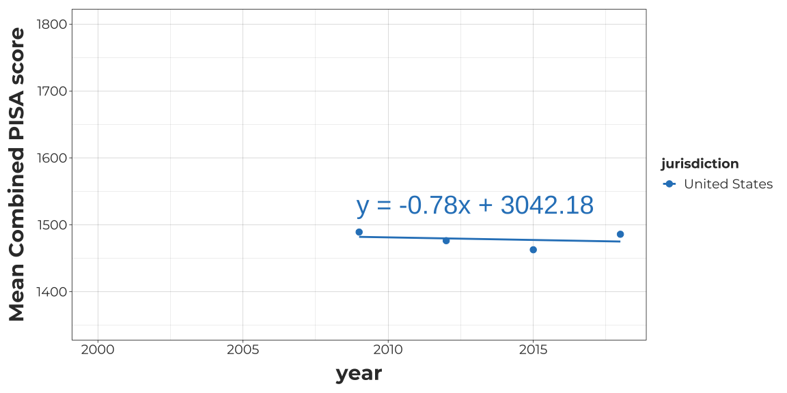

Analysis of US change in performance on the PISA assessment 2000-2018 as
an application of slope
================

> Analysis by [Matt Wilkins, PhD](https://www.mattwilkinsbio.com)  
> Data downloaded from the [National Center for Education
> Statistics](https://nces.ed.gov/surveys/pisa/idepisa/report.aspx?p=1%C3%81RMS%C3%811%C3%8120183%C3%8020153%C3%8020123%C3%8020093%C3%8020063%C3%8020033%C3%8020003%C3%81PVMATH%C3%81TOTAL%C3%81IN3%C3%80AUS%C3%80AUT%C3%80BEL%C3%80CAN%C3%80CHL%C3%80COL%C3%80CZE%C3%80DNK%C3%80EST%C3%80FIN%C3%80FRA%C3%80DEU%C3%80GRC%C3%80HUN%C3%80ISL%C3%80IRL%C3%80ISR%C3%80ITA%C3%80JPN%C3%80KOR%C3%80LVA%C3%80LUX%C3%80MEX%C3%80NLD%C3%80NZL%C3%80NOR%C3%80POL%C3%80PRT%C3%80SVK%C3%80SVN%C3%80ESP%C3%80SWE%C3%80CHE%C3%80TUR%C3%80GBR%C3%80USA%C3%80RUS%C3%80QCN%C3%80SGP%C3%80ARE%C3%80VNM%C3%81MN%C3%82MN%C3%81Y%C3%82J%C3%810%C3%810%C3%8137%C3%81N&Lang=1033)

##### Just a simple look at [PISA (Programme for International Student Assessment)](https://nces.ed.gov/surveys/pisa/index.asp) statistics for the US and a few other jurisdictions

1.  First, we’ll plot math, reading, and science scores for available
    PISA data from 2000-2018 for the US and a few “jurisdictions” of
    interest.

Below, I include the [R](https://www.r-project.org/) code to wrangle
data and generate figures.

<details>
<summary style="color: #7A7A7A">
Click for code
</summary>

``` r
require(remotes)
install_github("galacticpolymath/galacticPubs") #custom theme stuff
require(pacman)
p_load(ggplot2,readxl,dplyr,galacticPubs,reshape2,ggiraph)
d<-read_xlsx("data/pisa-data_2000-2018_tidy.xlsx")
#Rename Long name(s)
d$jurisdiction <- recode(d$jurisdiction,`International Average (OECD Countries)`="Avg of OECD Countries")
# Add ranks for each subject-year
d$sub_yr<-paste(d$subject,d$year)
d2<-lapply(unique(d$sub_yr),function(i) {
        d_i <- subset(d,sub_yr==i)
        d_i$rank<-rank(-d_i$average,na.last="keep",ties.method="average")
        d_i
      }) %>% bind_rows()
d2$year <- as.numeric(d2$year)

#define which jurisdictions to compare
for_comparison<-c("Avg of OECD Countries","United States","Canada","Shanghai - China","Russian Federation")

#plot score by year, grouped by subject
G<-d2 %>% subset(.,jurisdiction%in%for_comparison) %>% 
  ggplot(.,aes(x=year,y=average,col=jurisdiction))+
  geom_point()+geom_smooth(method="lm",se=F,formula='y~x')+
  facet_grid(~subject)+ggGalactic(font.cex =.8)+
  theme(strip.text=element_text(size=16))+
  scale_colour_manual(values=gpPal[[1]]$hex[c(6,5,2,4,1,3)])+
  scale_linetype_manual(values=c(3,1,1,1,2))+ylab("PISA average")
```

</details>

<!-- -->

##### US scores are about the same as the average for [the 38 OECD peer countries](https://en.wikipedia.org/wiki/OECD). Meanwhile, Shanghai, China is far above everyone else; our Northern neighbor, Canada, is consistently performing higher; and Russia has overtaken the US in math and is rapidly closing the gap in reading.

------------------------------------------------------------------------

2.  Let’s see what it looks like if we combine the subject scores into a
    single value.

<details>
<summary style="color: #7A7A7A">
Click for code
</summary>

``` r
  require(reshape2)
  # Sum all the scores for each country for each year
  d3 = melt(d2[,c("year","jurisdiction","average")],id=c("year","jurisdiction")) %>% dcast(.,formula=jurisdiction+year~variable,fun.aggregate=sum)
  names(d3)[3]<-"combined_average"
  
  #Now plot the result
  G2= d3 %>% subset(.,jurisdiction%in%for_comparison) %>% 
  ggplot(.,aes(x=year,y=combined_average,col=jurisdiction))+ylim(1350,1800)+
  geom_point()+geom_smooth(method="lm",se=F,formula='y~x')+
  ggGalactic(font.cex =.8)+
  theme(strip.text=element_text(size=16))+
  scale_colour_manual(values=gpPal[[1]]$hex[c(6,5,2,4,1,3)])+
  scale_linetype_manual(values=c(3,1,1,1,2))+ylab("Mean Combined PISA score")
```

</details>

<!-- -->

##### Because the science test wasn’t offered initially (or in the same years), this reduces the range of our data. But the combined US PISA scores are incredibly flat for the last decade.

------------------------------------------------------------------------

3.  Next, let’s zoom in on the US line and calculate the slope.

<details>
<summary style="color: #7A7A7A">
Click for code
</summary>

``` r
  us<-subset(d3,jurisdiction=="United States")
  us
  #fit a line (it's just 4 points, but hey, we're not testing for significance)
  mod<-lm(combined_average~year,data=us,na.rm=T)
  mod_form<-paste0("y = ",round(coef(mod)[2],2),"x + ",round(coef(mod)[1],2))
  #make graph and add formula to it
  G3 <- us %>%  ggplot(.,aes(x=year,y=combined_average,col=jurisdiction))+
  geom_point(size=3)+geom_smooth(method="lm",se=F,formula='y~x')+
  ggGalactic(font.cex =.8)+ylim(1350,1800)+
  theme(strip.text=element_text(size=16))+
  scale_colour_manual(values=gpPal[[1]]$hex[1])+
  ylab("Mean Combined PISA score")+annotate("text",label=mod_form,col=gpColors("hydro"),size=10,x=2013,y=1530)
```

</details>

    ##      jurisdiction year combined_average
    ## 281 United States 2000               NA
    ## 282 United States 2003               NA
    ## 283 United States 2006               NA
    ## 284 United States 2009         1489.226
    ## 285 United States 2012         1476.358
    ## 286 United States 2015         1462.806
    ## 287 United States 2018         1485.978

<!-- -->

##### US average combined PISA scores have declined by almost a point per year between 2009 and 2018. That is to say, the aggregate scores have not changed meaningfully, despite [numerous expensive, ongoing educational reforms across the country](https://time.com/5775795/education-reform-failed-america/).

------------------------------------------------------------------------

#### But maybe raw points are not very meaningful. How have ranks changed?

These are the subset of countries (+the OECD average) included in the
ranks:
<details>
<summary style="color: #7A7A7A">
Click for code & country/jurisdiction list
</summary>

``` r
#recalculate ranks based on combined PISA scores (all subject scores added together)
d4 <-  lapply(sort(unique(d3$year)),function(i) {
        d_i <- subset(d3,year==i)
        d_i$rank<-rank(-d_i$combined_average,na.last="keep",ties.method="average")
        d_i
      }) %>% bind_rows()
d4$jurisdiction %>% unique()
```

    ##  [1] "Australia"             "Austria"               "Avg of OECD Countries"
    ##  [4] "Belgium"               "Canada"                "Chile"                
    ##  [7] "Colombia"              "Czech Republic"        "Denmark"              
    ## [10] "Estonia"               "Finland"               "France"               
    ## [13] "Germany"               "Greece"                "Hungary"              
    ## [16] "Iceland"               "Ireland"               "Israel"               
    ## [19] "Italy"                 "Japan"                 "Korea, Republic of"   
    ## [22] "Latvia"                "Luxembourg"            "Mexico"               
    ## [25] "Netherlands"           "New Zealand"           "Norway"               
    ## [28] "Poland"                "Portugal"              "Russian Federation"   
    ## [31] "Shanghai - China"      "Singapore"             "Slovak Republic"      
    ## [34] "Slovenia"              "Spain"                 "Sweden"               
    ## [37] "Switzerland"           "Turkey"                "United Arab Emirates" 
    ## [40] "United Kingdom"        "United States"         "Vietnam"

</details>
And here is the plot of country ranks by combined PISA averages for
science, math, and reading.
<details>
<summary style="color: #7A7A7A">
Click for code
</summary>

``` r
  #get models for all countries & make hover text summary
  hoverText<-sapply(unique(d4$jurisdiction),function(x){
      d_x<-subset(d4,jurisdiction==x&complete.cases(rank))
      if(nrow(d_x)<3){mod_form=status= "Not enough data yet"
      }else{
        mod_x<-lm(-rank~year,data=d_x,na.rm=T)
        mod_form<-paste0("y = ",round(coef(mod_x)[2],2),"x + ",round(coef(mod_x)[1],2))
        #make status statement based on slope
        #Use slope of .25 as threshold (improving, declining or staying the same within 4 yrs)
        status<-{if(coef(mod_x)[2]>.25){"improving"
        }else if(coef(mod_x)[2]<(-.25)){"declining"
        }else if(coef(mod_x)[2]>-.25 & coef(mod_x)[2]<.25){"steady"}}
      }
      maxRank<-max(d_x$rank,na.rm=T)
      maxYear<-d_x$year[which.max(d_x$rank)]
      minRank<-min(d_x$rank,na.rm=T)
      minYear<-d_x$year[which.min(d_x$rank)]
      
      #switched max/min in the output due to interpretation of 1 as a higher rank
      return(assign(x,paste0(toupper(x),"\nStatus: ",status,"\n",mod_form,"\nHighest: ",minRank," (",minYear,")\nLowest: ",maxRank," (",maxYear,")")))
  }) 
#Add formulas to the data frame
d4$hoverText<-hoverText[match(d4$jurisdiction,names(hoverText))]

#Make certain countries stand out a little
  focal_jur<-c("United States","Canada","Avg of OECD Countries")
  d4$colCode<-0
  #change focal jurisdictions to number codes 1=US, 2=Canada, 3=avg oecd
  for(i in 1:length(focal_jur)){d4$colCode[which(d4$jurisdiction==focal_jur[i])]<-i}
  d4$colCode<-as.factor(ifelse(is.na(d4$rank),NA,d4$colCode))
  #make a literal vector of colors, as well. We'll still use colCode to style shapes,etc
  colVec<-ifelse(d4$colCode==0,"gray80","gray30") #make 0s light gray, and the highlighted countries darker gray
  #I seem to need yet another vector of just the country colors
  colVec_jur<-ifelse(d4$jurisdiction %>% unique()%in%focal_jur,"gray30","gray80")
  names(colVec_jur)<-d4$jurisdiction %>% unique()
  
  ######
  #make graph and add formula to it
  G4 <- d4 %>% subset(.,!jurisdiction%in%focal_jur) %>%  ggplot(.,aes(x=year,y=rank,group=jurisdiction),stroke=.5)+
  #First add nonfocal countries in a less obtrusive color
  geom_point_interactive(show.legend=F,size=1.5,color="gray80",shape=19,
                         aes(data_id=jurisdiction,tooltip=paste0(toupper(jurisdiction), "\nYear: ",year,"\nRank: ",rank)),
                         hover_css="stroke: #6812d1;fill: #6812d1;")+
  geom_smooth_interactive(show.legend=F,method="lm",se=F,size=.5,formula='y~x',color="gray80",size=.8,
                          aes(data_id=jurisdiction,tooltip=hoverText),
                          hover_css="stroke: #6812d1;")+
    #Add custom styling for Galactic Polymath
    ggGalactic(font.cex =.6)+
    #Scale axes
    scale_x_continuous(breaks=seq(2006,2018,3),limits=c(2006,2018))+scale_y_reverse(limits=c(44,-2),breaks=c(1,seq(45,1,-5)))+
    
    #Now add on your focal countries so they look distinct
  geom_point_interactive(inherit.aes=F, data=subset(d4,jurisdiction%in%focal_jur&complete.cases(rank)),
                           show.legend=T,size=1.85,color="gray30",
                         aes(shape=colCode,data_id=jurisdiction,x=year,y=rank,
                             tooltip=paste0(toupper(jurisdiction), "\nYear: ",year,"\nRank: ",rank)),
                         hover_css="stroke: #6812d1;fill: #6812d1;")+
  geom_smooth_interactive(inherit.aes=F, data=subset(d4,jurisdiction%in%focal_jur&complete.cases(rank)),
                          show.legend=T,method="lm",se=F,size=1,formula='y~x',size=.8,color="gray30",
                          aes(x=year,y=rank,data_id=jurisdiction,tooltip=hoverText,linetype=colCode),
                          hover_css="stroke: #6812d1;")+
    scale_shape_manual(name="Focal Jurisdictions:",values=c(24,22,23),labels=sort(focal_jur,decreasing = T))+
    scale_linetype_manual(name="Focal Jurisdictions:",values=1:3,labels=sort(focal_jur,decreasing = T))+
  ylab("Overall PISA Rank")+
    labs(title="Change in PISA scores for 41 countries and the OECD average",
         subtitle="Mouse over a trendline to get the line equation and other info")+
    theme(legend.position="bottom",legend.background = element_rect(fill="gray94",color="transparent" ),
          legend.key=element_rect("gray98"),legend.key.width=unit(22,"pt"), 
          legend.text=element_text(size=8),
          plot.title=element_text(size=11),plot.subtitle=element_text(size=9,color="#6812d1"),
          axis.title=element_text(size=10))+ xlab("")
```

</details>

``` r
# Data: combined average scores for the US
girafe(print(G4),width_svg=12,height_svg=6,options = list(
    opts_hover_inv(css = "opacity:0.5;"),
    opts_hover(css = "stroke-width:2;")
  ))
```

<div id="htmlwidget-f3021f97847098405565" style="width:1152px;height:576px;" class="girafe html-widget"></div>
<script type="application/json" data-for="htmlwidget-f3021f97847098405565">{"x":{"html":"<?xml version=\"1.0\" encoding=\"UTF-8\"?>\n<svg xmlns='http://www.w3.org/2000/svg' xmlns:xlink='http://www.w3.org/1999/xlink' id='svg_c04d3a13-ffa3-4827-85f7-6d15bdf64ae9' viewBox='0 0 864.00 432.00'>\n  <style><![CDATA[.hover_svg_c04d3a13-ffa3-4827-85f7-6d15bdf64ae9[data-id = \"United States\"] { stroke: #6812d1;fill: #6812d1; }.hover_svg_c04d3a13-ffa3-4827-85f7-6d15bdf64ae9[data-id = \"Canada\"] { stroke: #6812d1;fill: #6812d1; }.hover_svg_c04d3a13-ffa3-4827-85f7-6d15bdf64ae9[data-id = \"Vietnam\"] { stroke: #6812d1;fill: #6812d1; }.hover_svg_c04d3a13-ffa3-4827-85f7-6d15bdf64ae9[data-id = \"United Arab Emirates\"] { stroke: #6812d1;fill: #6812d1; }.hover_svg_c04d3a13-ffa3-4827-85f7-6d15bdf64ae9[data-id = \"Singapore\"] { stroke: #6812d1;fill: #6812d1; }.hover_svg_c04d3a13-ffa3-4827-85f7-6d15bdf64ae9[data-id = \"United Kingdom\"] { stroke: #6812d1;fill: #6812d1; }.hover_svg_c04d3a13-ffa3-4827-85f7-6d15bdf64ae9[data-id = \"Shanghai - China\"] { stroke: #6812d1;fill: #6812d1; }.hover_svg_c04d3a13-ffa3-4827-85f7-6d15bdf64ae9[data-id = \"Sweden\"] { stroke: #6812d1;fill: #6812d1; }.hover_svg_c04d3a13-ffa3-4827-85f7-6d15bdf64ae9[data-id = \"Spain\"] { stroke: #6812d1;fill: #6812d1; }.hover_svg_c04d3a13-ffa3-4827-85f7-6d15bdf64ae9[data-id = \"Portugal\"] { stroke: #6812d1;fill: #6812d1; }.hover_svg_c04d3a13-ffa3-4827-85f7-6d15bdf64ae9[data-id = \"Poland\"] { stroke: #6812d1;fill: #6812d1; }.hover_svg_c04d3a13-ffa3-4827-85f7-6d15bdf64ae9[data-id = \"New Zealand\"] { stroke: #6812d1;fill: #6812d1; }.hover_svg_c04d3a13-ffa3-4827-85f7-6d15bdf64ae9[data-id = \"Netherlands\"] { stroke: #6812d1;fill: #6812d1; }.hover_svg_c04d3a13-ffa3-4827-85f7-6d15bdf64ae9[data-id = \"Israel\"] { stroke: #6812d1;fill: #6812d1; }.hover_svg_c04d3a13-ffa3-4827-85f7-6d15bdf64ae9[data-id = \"France\"] { stroke: #6812d1;fill: #6812d1; }.hover_svg_c04d3a13-ffa3-4827-85f7-6d15bdf64ae9[data-id = \"Ireland\"] { stroke: #6812d1;fill: #6812d1; }.hover_svg_c04d3a13-ffa3-4827-85f7-6d15bdf64ae9[data-id = \"Iceland\"] { stroke: #6812d1;fill: #6812d1; }.hover_svg_c04d3a13-ffa3-4827-85f7-6d15bdf64ae9[data-id = \"Norway\"] { stroke: #6812d1;fill: #6812d1; }.hover_svg_c04d3a13-ffa3-4827-85f7-6d15bdf64ae9[data-id = \"Chile\"] { stroke: #6812d1;fill: #6812d1; }.hover_svg_c04d3a13-ffa3-4827-85f7-6d15bdf64ae9[data-id = \"Latvia\"] { stroke: #6812d1;fill: #6812d1; }.hover_svg_c04d3a13-ffa3-4827-85f7-6d15bdf64ae9[data-id = \"Italy\"] { stroke: #6812d1;fill: #6812d1; }.hover_svg_c04d3a13-ffa3-4827-85f7-6d15bdf64ae9[data-id = \"Hungary\"] { stroke: #6812d1;fill: #6812d1; }.hover_svg_c04d3a13-ffa3-4827-85f7-6d15bdf64ae9[data-id = \"Avg of OECD Countries\"] { stroke: #6812d1;fill: #6812d1; }.hover_svg_c04d3a13-ffa3-4827-85f7-6d15bdf64ae9[data-id = \"Korea, Republic of\"] { stroke: #6812d1;fill: #6812d1; }.hover_svg_c04d3a13-ffa3-4827-85f7-6d15bdf64ae9[data-id = \"Greece\"] { stroke: #6812d1;fill: #6812d1; }.hover_svg_c04d3a13-ffa3-4827-85f7-6d15bdf64ae9[data-id = \"Germany\"] { stroke: #6812d1;fill: #6812d1; }.hover_svg_c04d3a13-ffa3-4827-85f7-6d15bdf64ae9[data-id = \"Finland\"] { stroke: #6812d1;fill: #6812d1; }.hover_svg_c04d3a13-ffa3-4827-85f7-6d15bdf64ae9[data-id = \"Slovak Republic\"] { stroke: #6812d1;fill: #6812d1; }.hover_svg_c04d3a13-ffa3-4827-85f7-6d15bdf64ae9[data-id = \"Russian Federation\"] { stroke: #6812d1;fill: #6812d1; }.hover_svg_c04d3a13-ffa3-4827-85f7-6d15bdf64ae9[data-id = \"Austria\"] { stroke: #6812d1;fill: #6812d1; }.hover_svg_c04d3a13-ffa3-4827-85f7-6d15bdf64ae9[data-id = \"Mexico\"] { stroke: #6812d1;fill: #6812d1; }.hover_svg_c04d3a13-ffa3-4827-85f7-6d15bdf64ae9[data-id = \"Slovenia\"] { stroke: #6812d1;fill: #6812d1; }.hover_svg_c04d3a13-ffa3-4827-85f7-6d15bdf64ae9[data-id = \"Denmark\"] { stroke: #6812d1;fill: #6812d1; }.hover_svg_c04d3a13-ffa3-4827-85f7-6d15bdf64ae9[data-id = \"Japan\"] { stroke: #6812d1;fill: #6812d1; }.hover_svg_c04d3a13-ffa3-4827-85f7-6d15bdf64ae9[data-id = \"Turkey\"] { stroke: #6812d1;fill: #6812d1; }.hover_svg_c04d3a13-ffa3-4827-85f7-6d15bdf64ae9[data-id = \"Switzerland\"] { stroke: #6812d1;fill: #6812d1; }.hover_svg_c04d3a13-ffa3-4827-85f7-6d15bdf64ae9[data-id = \"Colombia\"] { stroke: #6812d1;fill: #6812d1; }.hover_svg_c04d3a13-ffa3-4827-85f7-6d15bdf64ae9[data-id = \"Luxembourg\"] { stroke: #6812d1;fill: #6812d1; }.hover_svg_c04d3a13-ffa3-4827-85f7-6d15bdf64ae9[data-id = \"Belgium\"] { stroke: #6812d1;fill: #6812d1; }.hover_svg_c04d3a13-ffa3-4827-85f7-6d15bdf64ae9[data-id = \"Estonia\"] { stroke: #6812d1;fill: #6812d1; }.hover_svg_c04d3a13-ffa3-4827-85f7-6d15bdf64ae9[data-id = \"Czech Republic\"] { stroke: #6812d1;fill: #6812d1; }.hover_svg_c04d3a13-ffa3-4827-85f7-6d15bdf64ae9[data-id = \"Australia\"] { stroke: #6812d1;fill: #6812d1; }]]><\/style>\n  <g>\n    <defs>\n      <clipPath id='svg_c04d3a13-ffa3-4827-85f7-6d15bdf64ae9_cl_1'>\n        <rect x='0.00' y='0.00' width='864.00' height='432.00'/>\n      <\/clipPath>\n    <\/defs>\n    <rect x='0.00' y='0.00' width='864.00' height='432.00' id='svg_c04d3a13-ffa3-4827-85f7-6d15bdf64ae9_el_1' clip-path='url(#svg_c04d3a13-ffa3-4827-85f7-6d15bdf64ae9_cl_1)' fill='#FFFFFF' fill-opacity='1' stroke='#FFFFFF' stroke-opacity='1' stroke-width='0.75' stroke-linejoin='round' stroke-linecap='round'/>\n    <defs>\n      <clipPath id='svg_c04d3a13-ffa3-4827-85f7-6d15bdf64ae9_cl_2'>\n        <rect x='0.00' y='0.00' width='864.00' height='432.00'/>\n      <\/clipPath>\n    <\/defs>\n    <rect x='-0.00' y='-0.00' width='864.00' height='432.00' id='svg_c04d3a13-ffa3-4827-85f7-6d15bdf64ae9_el_2' clip-path='url(#svg_c04d3a13-ffa3-4827-85f7-6d15bdf64ae9_cl_2)' fill='#FFFFFF' fill-opacity='1' stroke='#FFFFFF' stroke-opacity='1' stroke-width='1.07' stroke-linejoin='round' stroke-linecap='round'/>\n    <defs>\n      <clipPath id='svg_c04d3a13-ffa3-4827-85f7-6d15bdf64ae9_cl_3'>\n        <rect x='48.14' y='38.90' width='805.90' height='310.34'/>\n      <\/clipPath>\n    <\/defs>\n    <rect x='48.14' y='38.90' width='805.90' height='310.34' id='svg_c04d3a13-ffa3-4827-85f7-6d15bdf64ae9_el_3' clip-path='url(#svg_c04d3a13-ffa3-4827-85f7-6d15bdf64ae9_cl_3)' fill='#FFFFFF' fill-opacity='1' stroke='none'/>\n    <polyline points='48.14,206.34 854.04,206.34' id='svg_c04d3a13-ffa3-4827-85f7-6d15bdf64ae9_el_4' clip-path='url(#svg_c04d3a13-ffa3-4827-85f7-6d15bdf64ae9_cl_3)' fill='none' stroke='#000000' stroke-opacity='1' stroke-width='0.05' stroke-linejoin='round' stroke-linecap='butt'/>\n    <polyline points='48.14,325.94 854.04,325.94' id='svg_c04d3a13-ffa3-4827-85f7-6d15bdf64ae9_el_5' clip-path='url(#svg_c04d3a13-ffa3-4827-85f7-6d15bdf64ae9_cl_3)' fill='none' stroke='#000000' stroke-opacity='1' stroke-width='0.05' stroke-linejoin='round' stroke-linecap='butt'/>\n    <polyline points='48.14,295.27 854.04,295.27' id='svg_c04d3a13-ffa3-4827-85f7-6d15bdf64ae9_el_6' clip-path='url(#svg_c04d3a13-ffa3-4827-85f7-6d15bdf64ae9_cl_3)' fill='none' stroke='#000000' stroke-opacity='1' stroke-width='0.05' stroke-linejoin='round' stroke-linecap='butt'/>\n    <polyline points='48.14,264.61 854.04,264.61' id='svg_c04d3a13-ffa3-4827-85f7-6d15bdf64ae9_el_7' clip-path='url(#svg_c04d3a13-ffa3-4827-85f7-6d15bdf64ae9_cl_3)' fill='none' stroke='#000000' stroke-opacity='1' stroke-width='0.05' stroke-linejoin='round' stroke-linecap='butt'/>\n    <polyline points='48.14,233.94 854.04,233.94' id='svg_c04d3a13-ffa3-4827-85f7-6d15bdf64ae9_el_8' clip-path='url(#svg_c04d3a13-ffa3-4827-85f7-6d15bdf64ae9_cl_3)' fill='none' stroke='#000000' stroke-opacity='1' stroke-width='0.05' stroke-linejoin='round' stroke-linecap='butt'/>\n    <polyline points='48.14,203.27 854.04,203.27' id='svg_c04d3a13-ffa3-4827-85f7-6d15bdf64ae9_el_9' clip-path='url(#svg_c04d3a13-ffa3-4827-85f7-6d15bdf64ae9_cl_3)' fill='none' stroke='#000000' stroke-opacity='1' stroke-width='0.05' stroke-linejoin='round' stroke-linecap='butt'/>\n    <polyline points='48.14,172.61 854.04,172.61' id='svg_c04d3a13-ffa3-4827-85f7-6d15bdf64ae9_el_10' clip-path='url(#svg_c04d3a13-ffa3-4827-85f7-6d15bdf64ae9_cl_3)' fill='none' stroke='#000000' stroke-opacity='1' stroke-width='0.05' stroke-linejoin='round' stroke-linecap='butt'/>\n    <polyline points='48.14,141.94 854.04,141.94' id='svg_c04d3a13-ffa3-4827-85f7-6d15bdf64ae9_el_11' clip-path='url(#svg_c04d3a13-ffa3-4827-85f7-6d15bdf64ae9_cl_3)' fill='none' stroke='#000000' stroke-opacity='1' stroke-width='0.05' stroke-linejoin='round' stroke-linecap='butt'/>\n    <polyline points='48.14,111.27 854.04,111.27' id='svg_c04d3a13-ffa3-4827-85f7-6d15bdf64ae9_el_12' clip-path='url(#svg_c04d3a13-ffa3-4827-85f7-6d15bdf64ae9_cl_3)' fill='none' stroke='#000000' stroke-opacity='1' stroke-width='0.05' stroke-linejoin='round' stroke-linecap='butt'/>\n    <polyline points='48.14,230.87 854.04,230.87' id='svg_c04d3a13-ffa3-4827-85f7-6d15bdf64ae9_el_13' clip-path='url(#svg_c04d3a13-ffa3-4827-85f7-6d15bdf64ae9_cl_3)' fill='none' stroke='#000000' stroke-opacity='1' stroke-width='0.05' stroke-linejoin='round' stroke-linecap='butt'/>\n    <polyline points='176.35,349.25 176.35,38.90' id='svg_c04d3a13-ffa3-4827-85f7-6d15bdf64ae9_el_14' clip-path='url(#svg_c04d3a13-ffa3-4827-85f7-6d15bdf64ae9_cl_3)' fill='none' stroke='#000000' stroke-opacity='1' stroke-width='0.05' stroke-linejoin='round' stroke-linecap='butt'/>\n    <polyline points='359.51,349.25 359.51,38.90' id='svg_c04d3a13-ffa3-4827-85f7-6d15bdf64ae9_el_15' clip-path='url(#svg_c04d3a13-ffa3-4827-85f7-6d15bdf64ae9_cl_3)' fill='none' stroke='#000000' stroke-opacity='1' stroke-width='0.05' stroke-linejoin='round' stroke-linecap='butt'/>\n    <polyline points='542.67,349.25 542.67,38.90' id='svg_c04d3a13-ffa3-4827-85f7-6d15bdf64ae9_el_16' clip-path='url(#svg_c04d3a13-ffa3-4827-85f7-6d15bdf64ae9_cl_3)' fill='none' stroke='#000000' stroke-opacity='1' stroke-width='0.05' stroke-linejoin='round' stroke-linecap='butt'/>\n    <polyline points='725.83,349.25 725.83,38.90' id='svg_c04d3a13-ffa3-4827-85f7-6d15bdf64ae9_el_17' clip-path='url(#svg_c04d3a13-ffa3-4827-85f7-6d15bdf64ae9_cl_3)' fill='none' stroke='#000000' stroke-opacity='1' stroke-width='0.05' stroke-linejoin='round' stroke-linecap='butt'/>\n    <polyline points='48.14,71.41 854.04,71.41' id='svg_c04d3a13-ffa3-4827-85f7-6d15bdf64ae9_el_18' clip-path='url(#svg_c04d3a13-ffa3-4827-85f7-6d15bdf64ae9_cl_3)' fill='none' stroke='#000000' stroke-opacity='1' stroke-width='0.11' stroke-linejoin='round' stroke-linecap='butt'/>\n    <polyline points='48.14,341.27 854.04,341.27' id='svg_c04d3a13-ffa3-4827-85f7-6d15bdf64ae9_el_19' clip-path='url(#svg_c04d3a13-ffa3-4827-85f7-6d15bdf64ae9_cl_3)' fill='none' stroke='#000000' stroke-opacity='1' stroke-width='0.11' stroke-linejoin='round' stroke-linecap='butt'/>\n    <polyline points='48.14,310.61 854.04,310.61' id='svg_c04d3a13-ffa3-4827-85f7-6d15bdf64ae9_el_20' clip-path='url(#svg_c04d3a13-ffa3-4827-85f7-6d15bdf64ae9_cl_3)' fill='none' stroke='#000000' stroke-opacity='1' stroke-width='0.11' stroke-linejoin='round' stroke-linecap='butt'/>\n    <polyline points='48.14,279.94 854.04,279.94' id='svg_c04d3a13-ffa3-4827-85f7-6d15bdf64ae9_el_21' clip-path='url(#svg_c04d3a13-ffa3-4827-85f7-6d15bdf64ae9_cl_3)' fill='none' stroke='#000000' stroke-opacity='1' stroke-width='0.11' stroke-linejoin='round' stroke-linecap='butt'/>\n    <polyline points='48.14,249.27 854.04,249.27' id='svg_c04d3a13-ffa3-4827-85f7-6d15bdf64ae9_el_22' clip-path='url(#svg_c04d3a13-ffa3-4827-85f7-6d15bdf64ae9_cl_3)' fill='none' stroke='#000000' stroke-opacity='1' stroke-width='0.11' stroke-linejoin='round' stroke-linecap='butt'/>\n    <polyline points='48.14,218.61 854.04,218.61' id='svg_c04d3a13-ffa3-4827-85f7-6d15bdf64ae9_el_23' clip-path='url(#svg_c04d3a13-ffa3-4827-85f7-6d15bdf64ae9_cl_3)' fill='none' stroke='#000000' stroke-opacity='1' stroke-width='0.11' stroke-linejoin='round' stroke-linecap='butt'/>\n    <polyline points='48.14,187.94 854.04,187.94' id='svg_c04d3a13-ffa3-4827-85f7-6d15bdf64ae9_el_24' clip-path='url(#svg_c04d3a13-ffa3-4827-85f7-6d15bdf64ae9_cl_3)' fill='none' stroke='#000000' stroke-opacity='1' stroke-width='0.11' stroke-linejoin='round' stroke-linecap='butt'/>\n    <polyline points='48.14,157.27 854.04,157.27' id='svg_c04d3a13-ffa3-4827-85f7-6d15bdf64ae9_el_25' clip-path='url(#svg_c04d3a13-ffa3-4827-85f7-6d15bdf64ae9_cl_3)' fill='none' stroke='#000000' stroke-opacity='1' stroke-width='0.11' stroke-linejoin='round' stroke-linecap='butt'/>\n    <polyline points='48.14,126.61 854.04,126.61' id='svg_c04d3a13-ffa3-4827-85f7-6d15bdf64ae9_el_26' clip-path='url(#svg_c04d3a13-ffa3-4827-85f7-6d15bdf64ae9_cl_3)' fill='none' stroke='#000000' stroke-opacity='1' stroke-width='0.11' stroke-linejoin='round' stroke-linecap='butt'/>\n    <polyline points='48.14,95.94 854.04,95.94' id='svg_c04d3a13-ffa3-4827-85f7-6d15bdf64ae9_el_27' clip-path='url(#svg_c04d3a13-ffa3-4827-85f7-6d15bdf64ae9_cl_3)' fill='none' stroke='#000000' stroke-opacity='1' stroke-width='0.11' stroke-linejoin='round' stroke-linecap='butt'/>\n    <polyline points='84.77,349.25 84.77,38.90' id='svg_c04d3a13-ffa3-4827-85f7-6d15bdf64ae9_el_28' clip-path='url(#svg_c04d3a13-ffa3-4827-85f7-6d15bdf64ae9_cl_3)' fill='none' stroke='#000000' stroke-opacity='1' stroke-width='0.11' stroke-linejoin='round' stroke-linecap='butt'/>\n    <polyline points='267.93,349.25 267.93,38.90' id='svg_c04d3a13-ffa3-4827-85f7-6d15bdf64ae9_el_29' clip-path='url(#svg_c04d3a13-ffa3-4827-85f7-6d15bdf64ae9_cl_3)' fill='none' stroke='#000000' stroke-opacity='1' stroke-width='0.11' stroke-linejoin='round' stroke-linecap='butt'/>\n    <polyline points='451.09,349.25 451.09,38.90' id='svg_c04d3a13-ffa3-4827-85f7-6d15bdf64ae9_el_30' clip-path='url(#svg_c04d3a13-ffa3-4827-85f7-6d15bdf64ae9_cl_3)' fill='none' stroke='#000000' stroke-opacity='1' stroke-width='0.11' stroke-linejoin='round' stroke-linecap='butt'/>\n    <polyline points='634.25,349.25 634.25,38.90' id='svg_c04d3a13-ffa3-4827-85f7-6d15bdf64ae9_el_31' clip-path='url(#svg_c04d3a13-ffa3-4827-85f7-6d15bdf64ae9_cl_3)' fill='none' stroke='#000000' stroke-opacity='1' stroke-width='0.11' stroke-linejoin='round' stroke-linecap='butt'/>\n    <polyline points='817.41,349.25 817.41,38.90' id='svg_c04d3a13-ffa3-4827-85f7-6d15bdf64ae9_el_32' clip-path='url(#svg_c04d3a13-ffa3-4827-85f7-6d15bdf64ae9_cl_3)' fill='none' stroke='#000000' stroke-opacity='1' stroke-width='0.11' stroke-linejoin='round' stroke-linecap='butt'/>\n    <circle cx='84.77' cy='102.07' r='1.47pt' id='svg_c04d3a13-ffa3-4827-85f7-6d15bdf64ae9_el_33' clip-path='url(#svg_c04d3a13-ffa3-4827-85f7-6d15bdf64ae9_cl_3)' fill='#CCCCCC' fill-opacity='1' stroke='#CCCCCC' stroke-opacity='1' stroke-width='0.71' stroke-linejoin='round' stroke-linecap='round' data-id='Australia' title='AUSTRALIA&amp;lt;br/&amp;gt;Year: 2006&amp;lt;br/&amp;gt;Rank: 6'/>\n    <circle cx='84.77' cy='157.27' r='1.47pt' id='svg_c04d3a13-ffa3-4827-85f7-6d15bdf64ae9_el_34' clip-path='url(#svg_c04d3a13-ffa3-4827-85f7-6d15bdf64ae9_cl_3)' fill='#CCCCCC' fill-opacity='1' stroke='#CCCCCC' stroke-opacity='1' stroke-width='0.71' stroke-linejoin='round' stroke-linecap='round' data-id='Austria' title='AUSTRIA&amp;lt;br/&amp;gt;Year: 2006&amp;lt;br/&amp;gt;Rank: 15'/>\n    <circle cx='84.77' cy='126.61' r='1.47pt' id='svg_c04d3a13-ffa3-4827-85f7-6d15bdf64ae9_el_35' clip-path='url(#svg_c04d3a13-ffa3-4827-85f7-6d15bdf64ae9_cl_3)' fill='#CCCCCC' fill-opacity='1' stroke='#CCCCCC' stroke-opacity='1' stroke-width='0.71' stroke-linejoin='round' stroke-linecap='round' data-id='Belgium' title='BELGIUM&amp;lt;br/&amp;gt;Year: 2006&amp;lt;br/&amp;gt;Rank: 10'/>\n    <circle cx='84.77' cy='279.94' r='1.47pt' id='svg_c04d3a13-ffa3-4827-85f7-6d15bdf64ae9_el_36' clip-path='url(#svg_c04d3a13-ffa3-4827-85f7-6d15bdf64ae9_cl_3)' fill='#CCCCCC' fill-opacity='1' stroke='#CCCCCC' stroke-opacity='1' stroke-width='0.71' stroke-linejoin='round' stroke-linecap='round' data-id='Chile' title='CHILE&amp;lt;br/&amp;gt;Year: 2006&amp;lt;br/&amp;gt;Rank: 35'/>\n    <circle cx='84.77' cy='292.21' r='1.47pt' id='svg_c04d3a13-ffa3-4827-85f7-6d15bdf64ae9_el_37' clip-path='url(#svg_c04d3a13-ffa3-4827-85f7-6d15bdf64ae9_cl_3)' fill='#CCCCCC' fill-opacity='1' stroke='#CCCCCC' stroke-opacity='1' stroke-width='0.71' stroke-linejoin='round' stroke-linecap='round' data-id='Colombia' title='COLOMBIA&amp;lt;br/&amp;gt;Year: 2006&amp;lt;br/&amp;gt;Rank: 37'/>\n    <circle cx='84.77' cy='163.41' r='1.47pt' id='svg_c04d3a13-ffa3-4827-85f7-6d15bdf64ae9_el_38' clip-path='url(#svg_c04d3a13-ffa3-4827-85f7-6d15bdf64ae9_cl_3)' fill='#CCCCCC' fill-opacity='1' stroke='#CCCCCC' stroke-opacity='1' stroke-width='0.71' stroke-linejoin='round' stroke-linecap='round' data-id='Czech Republic' title='CZECH REPUBLIC&amp;lt;br/&amp;gt;Year: 2006&amp;lt;br/&amp;gt;Rank: 16'/>\n    <circle cx='84.77' cy='175.67' r='1.47pt' id='svg_c04d3a13-ffa3-4827-85f7-6d15bdf64ae9_el_39' clip-path='url(#svg_c04d3a13-ffa3-4827-85f7-6d15bdf64ae9_cl_3)' fill='#CCCCCC' fill-opacity='1' stroke='#CCCCCC' stroke-opacity='1' stroke-width='0.71' stroke-linejoin='round' stroke-linecap='round' data-id='Denmark' title='DENMARK&amp;lt;br/&amp;gt;Year: 2006&amp;lt;br/&amp;gt;Rank: 18'/>\n    <circle cx='84.77' cy='114.34' r='1.47pt' id='svg_c04d3a13-ffa3-4827-85f7-6d15bdf64ae9_el_40' clip-path='url(#svg_c04d3a13-ffa3-4827-85f7-6d15bdf64ae9_cl_3)' fill='#CCCCCC' fill-opacity='1' stroke='#CCCCCC' stroke-opacity='1' stroke-width='0.71' stroke-linejoin='round' stroke-linecap='round' data-id='Estonia' title='ESTONIA&amp;lt;br/&amp;gt;Year: 2006&amp;lt;br/&amp;gt;Rank: 8'/>\n    <circle cx='84.77' cy='71.41' r='1.47pt' id='svg_c04d3a13-ffa3-4827-85f7-6d15bdf64ae9_el_41' clip-path='url(#svg_c04d3a13-ffa3-4827-85f7-6d15bdf64ae9_cl_3)' fill='#CCCCCC' fill-opacity='1' stroke='#CCCCCC' stroke-opacity='1' stroke-width='0.71' stroke-linejoin='round' stroke-linecap='round' data-id='Finland' title='FINLAND&amp;lt;br/&amp;gt;Year: 2006&amp;lt;br/&amp;gt;Rank: 1'/>\n    <circle cx='84.77' cy='194.07' r='1.47pt' id='svg_c04d3a13-ffa3-4827-85f7-6d15bdf64ae9_el_42' clip-path='url(#svg_c04d3a13-ffa3-4827-85f7-6d15bdf64ae9_cl_3)' fill='#CCCCCC' fill-opacity='1' stroke='#CCCCCC' stroke-opacity='1' stroke-width='0.71' stroke-linejoin='round' stroke-linecap='round' data-id='France' title='FRANCE&amp;lt;br/&amp;gt;Year: 2006&amp;lt;br/&amp;gt;Rank: 21'/>\n    <circle cx='84.77' cy='145.01' r='1.47pt' id='svg_c04d3a13-ffa3-4827-85f7-6d15bdf64ae9_el_43' clip-path='url(#svg_c04d3a13-ffa3-4827-85f7-6d15bdf64ae9_cl_3)' fill='#CCCCCC' fill-opacity='1' stroke='#CCCCCC' stroke-opacity='1' stroke-width='0.71' stroke-linejoin='round' stroke-linecap='round' data-id='Germany' title='GERMANY&amp;lt;br/&amp;gt;Year: 2006&amp;lt;br/&amp;gt;Rank: 13'/>\n    <circle cx='84.77' cy='261.54' r='1.47pt' id='svg_c04d3a13-ffa3-4827-85f7-6d15bdf64ae9_el_44' clip-path='url(#svg_c04d3a13-ffa3-4827-85f7-6d15bdf64ae9_cl_3)' fill='#CCCCCC' fill-opacity='1' stroke='#CCCCCC' stroke-opacity='1' stroke-width='0.71' stroke-linejoin='round' stroke-linecap='round' data-id='Greece' title='GREECE&amp;lt;br/&amp;gt;Year: 2006&amp;lt;br/&amp;gt;Rank: 32'/>\n    <circle cx='84.77' cy='200.21' r='1.47pt' id='svg_c04d3a13-ffa3-4827-85f7-6d15bdf64ae9_el_45' clip-path='url(#svg_c04d3a13-ffa3-4827-85f7-6d15bdf64ae9_cl_3)' fill='#CCCCCC' fill-opacity='1' stroke='#CCCCCC' stroke-opacity='1' stroke-width='0.71' stroke-linejoin='round' stroke-linecap='round' data-id='Hungary' title='HUNGARY&amp;lt;br/&amp;gt;Year: 2006&amp;lt;br/&amp;gt;Rank: 22'/>\n    <circle cx='84.77' cy='187.94' r='1.47pt' id='svg_c04d3a13-ffa3-4827-85f7-6d15bdf64ae9_el_46' clip-path='url(#svg_c04d3a13-ffa3-4827-85f7-6d15bdf64ae9_cl_3)' fill='#CCCCCC' fill-opacity='1' stroke='#CCCCCC' stroke-opacity='1' stroke-width='0.71' stroke-linejoin='round' stroke-linecap='round' data-id='Iceland' title='ICELAND&amp;lt;br/&amp;gt;Year: 2006&amp;lt;br/&amp;gt;Rank: 20'/>\n    <circle cx='84.77' cy='132.74' r='1.47pt' id='svg_c04d3a13-ffa3-4827-85f7-6d15bdf64ae9_el_47' clip-path='url(#svg_c04d3a13-ffa3-4827-85f7-6d15bdf64ae9_cl_3)' fill='#CCCCCC' fill-opacity='1' stroke='#CCCCCC' stroke-opacity='1' stroke-width='0.71' stroke-linejoin='round' stroke-linecap='round' data-id='Ireland' title='IRELAND&amp;lt;br/&amp;gt;Year: 2006&amp;lt;br/&amp;gt;Rank: 11'/>\n    <circle cx='84.77' cy='267.67' r='1.47pt' id='svg_c04d3a13-ffa3-4827-85f7-6d15bdf64ae9_el_48' clip-path='url(#svg_c04d3a13-ffa3-4827-85f7-6d15bdf64ae9_cl_3)' fill='#CCCCCC' fill-opacity='1' stroke='#CCCCCC' stroke-opacity='1' stroke-width='0.71' stroke-linejoin='round' stroke-linecap='round' data-id='Israel' title='ISRAEL&amp;lt;br/&amp;gt;Year: 2006&amp;lt;br/&amp;gt;Rank: 33'/>\n    <circle cx='84.77' cy='249.27' r='1.47pt' id='svg_c04d3a13-ffa3-4827-85f7-6d15bdf64ae9_el_49' clip-path='url(#svg_c04d3a13-ffa3-4827-85f7-6d15bdf64ae9_cl_3)' fill='#CCCCCC' fill-opacity='1' stroke='#CCCCCC' stroke-opacity='1' stroke-width='0.71' stroke-linejoin='round' stroke-linecap='round' data-id='Italy' title='ITALY&amp;lt;br/&amp;gt;Year: 2006&amp;lt;br/&amp;gt;Rank: 30'/>\n    <circle cx='84.77' cy='108.21' r='1.47pt' id='svg_c04d3a13-ffa3-4827-85f7-6d15bdf64ae9_el_50' clip-path='url(#svg_c04d3a13-ffa3-4827-85f7-6d15bdf64ae9_cl_3)' fill='#CCCCCC' fill-opacity='1' stroke='#CCCCCC' stroke-opacity='1' stroke-width='0.71' stroke-linejoin='round' stroke-linecap='round' data-id='Japan' title='JAPAN&amp;lt;br/&amp;gt;Year: 2006&amp;lt;br/&amp;gt;Rank: 7'/>\n    <circle cx='84.77' cy='77.54' r='1.47pt' id='svg_c04d3a13-ffa3-4827-85f7-6d15bdf64ae9_el_51' clip-path='url(#svg_c04d3a13-ffa3-4827-85f7-6d15bdf64ae9_cl_3)' fill='#CCCCCC' fill-opacity='1' stroke='#CCCCCC' stroke-opacity='1' stroke-width='0.71' stroke-linejoin='round' stroke-linecap='round' data-id='Korea, Republic of' title='KOREA, REPUBLIC OF&amp;lt;br/&amp;gt;Year: 2006&amp;lt;br/&amp;gt;Rank: 2'/>\n    <circle cx='84.77' cy='224.74' r='1.47pt' id='svg_c04d3a13-ffa3-4827-85f7-6d15bdf64ae9_el_52' clip-path='url(#svg_c04d3a13-ffa3-4827-85f7-6d15bdf64ae9_cl_3)' fill='#CCCCCC' fill-opacity='1' stroke='#CCCCCC' stroke-opacity='1' stroke-width='0.71' stroke-linejoin='round' stroke-linecap='round' data-id='Latvia' title='LATVIA&amp;lt;br/&amp;gt;Year: 2006&amp;lt;br/&amp;gt;Rank: 26'/>\n    <circle cx='84.77' cy='218.61' r='1.47pt' id='svg_c04d3a13-ffa3-4827-85f7-6d15bdf64ae9_el_53' clip-path='url(#svg_c04d3a13-ffa3-4827-85f7-6d15bdf64ae9_cl_3)' fill='#CCCCCC' fill-opacity='1' stroke='#CCCCCC' stroke-opacity='1' stroke-width='0.71' stroke-linejoin='round' stroke-linecap='round' data-id='Luxembourg' title='LUXEMBOURG&amp;lt;br/&amp;gt;Year: 2006&amp;lt;br/&amp;gt;Rank: 25'/>\n    <circle cx='84.77' cy='286.07' r='1.47pt' id='svg_c04d3a13-ffa3-4827-85f7-6d15bdf64ae9_el_54' clip-path='url(#svg_c04d3a13-ffa3-4827-85f7-6d15bdf64ae9_cl_3)' fill='#CCCCCC' fill-opacity='1' stroke='#CCCCCC' stroke-opacity='1' stroke-width='0.71' stroke-linejoin='round' stroke-linecap='round' data-id='Mexico' title='MEXICO&amp;lt;br/&amp;gt;Year: 2006&amp;lt;br/&amp;gt;Rank: 36'/>\n    <circle cx='84.77' cy='95.94' r='1.47pt' id='svg_c04d3a13-ffa3-4827-85f7-6d15bdf64ae9_el_55' clip-path='url(#svg_c04d3a13-ffa3-4827-85f7-6d15bdf64ae9_cl_3)' fill='#CCCCCC' fill-opacity='1' stroke='#CCCCCC' stroke-opacity='1' stroke-width='0.71' stroke-linejoin='round' stroke-linecap='round' data-id='Netherlands' title='NETHERLANDS&amp;lt;br/&amp;gt;Year: 2006&amp;lt;br/&amp;gt;Rank: 5'/>\n    <circle cx='84.77' cy='89.81' r='1.47pt' id='svg_c04d3a13-ffa3-4827-85f7-6d15bdf64ae9_el_56' clip-path='url(#svg_c04d3a13-ffa3-4827-85f7-6d15bdf64ae9_cl_3)' fill='#CCCCCC' fill-opacity='1' stroke='#CCCCCC' stroke-opacity='1' stroke-width='0.71' stroke-linejoin='round' stroke-linecap='round' data-id='New Zealand' title='NEW ZEALAND&amp;lt;br/&amp;gt;Year: 2006&amp;lt;br/&amp;gt;Rank: 4'/>\n    <circle cx='84.77' cy='212.47' r='1.47pt' id='svg_c04d3a13-ffa3-4827-85f7-6d15bdf64ae9_el_57' clip-path='url(#svg_c04d3a13-ffa3-4827-85f7-6d15bdf64ae9_cl_3)' fill='#CCCCCC' fill-opacity='1' stroke='#CCCCCC' stroke-opacity='1' stroke-width='0.71' stroke-linejoin='round' stroke-linecap='round' data-id='Norway' title='NORWAY&amp;lt;br/&amp;gt;Year: 2006&amp;lt;br/&amp;gt;Rank: 24'/>\n    <circle cx='84.77' cy='181.81' r='1.47pt' id='svg_c04d3a13-ffa3-4827-85f7-6d15bdf64ae9_el_58' clip-path='url(#svg_c04d3a13-ffa3-4827-85f7-6d15bdf64ae9_cl_3)' fill='#CCCCCC' fill-opacity='1' stroke='#CCCCCC' stroke-opacity='1' stroke-width='0.71' stroke-linejoin='round' stroke-linecap='round' data-id='Poland' title='POLAND&amp;lt;br/&amp;gt;Year: 2006&amp;lt;br/&amp;gt;Rank: 19'/>\n    <circle cx='84.77' cy='243.14' r='1.47pt' id='svg_c04d3a13-ffa3-4827-85f7-6d15bdf64ae9_el_59' clip-path='url(#svg_c04d3a13-ffa3-4827-85f7-6d15bdf64ae9_cl_3)' fill='#CCCCCC' fill-opacity='1' stroke='#CCCCCC' stroke-opacity='1' stroke-width='0.71' stroke-linejoin='round' stroke-linecap='round' data-id='Portugal' title='PORTUGAL&amp;lt;br/&amp;gt;Year: 2006&amp;lt;br/&amp;gt;Rank: 29'/>\n    <circle cx='84.77' cy='255.41' r='1.47pt' id='svg_c04d3a13-ffa3-4827-85f7-6d15bdf64ae9_el_60' clip-path='url(#svg_c04d3a13-ffa3-4827-85f7-6d15bdf64ae9_cl_3)' fill='#CCCCCC' fill-opacity='1' stroke='#CCCCCC' stroke-opacity='1' stroke-width='0.71' stroke-linejoin='round' stroke-linecap='round' data-id='Russian Federation' title='RUSSIAN FEDERATION&amp;lt;br/&amp;gt;Year: 2006&amp;lt;br/&amp;gt;Rank: 31'/>\n    <circle cx='84.77' cy='230.87' r='1.47pt' id='svg_c04d3a13-ffa3-4827-85f7-6d15bdf64ae9_el_61' clip-path='url(#svg_c04d3a13-ffa3-4827-85f7-6d15bdf64ae9_cl_3)' fill='#CCCCCC' fill-opacity='1' stroke='#CCCCCC' stroke-opacity='1' stroke-width='0.71' stroke-linejoin='round' stroke-linecap='round' data-id='Slovak Republic' title='SLOVAK REPUBLIC&amp;lt;br/&amp;gt;Year: 2006&amp;lt;br/&amp;gt;Rank: 27'/>\n    <circle cx='84.77' cy='138.87' r='1.47pt' id='svg_c04d3a13-ffa3-4827-85f7-6d15bdf64ae9_el_62' clip-path='url(#svg_c04d3a13-ffa3-4827-85f7-6d15bdf64ae9_cl_3)' fill='#CCCCCC' fill-opacity='1' stroke='#CCCCCC' stroke-opacity='1' stroke-width='0.71' stroke-linejoin='round' stroke-linecap='round' data-id='Slovenia' title='SLOVENIA&amp;lt;br/&amp;gt;Year: 2006&amp;lt;br/&amp;gt;Rank: 12'/>\n    <circle cx='84.77' cy='237.01' r='1.47pt' id='svg_c04d3a13-ffa3-4827-85f7-6d15bdf64ae9_el_63' clip-path='url(#svg_c04d3a13-ffa3-4827-85f7-6d15bdf64ae9_cl_3)' fill='#CCCCCC' fill-opacity='1' stroke='#CCCCCC' stroke-opacity='1' stroke-width='0.71' stroke-linejoin='round' stroke-linecap='round' data-id='Spain' title='SPAIN&amp;lt;br/&amp;gt;Year: 2006&amp;lt;br/&amp;gt;Rank: 28'/>\n    <circle cx='84.77' cy='151.14' r='1.47pt' id='svg_c04d3a13-ffa3-4827-85f7-6d15bdf64ae9_el_64' clip-path='url(#svg_c04d3a13-ffa3-4827-85f7-6d15bdf64ae9_cl_3)' fill='#CCCCCC' fill-opacity='1' stroke='#CCCCCC' stroke-opacity='1' stroke-width='0.71' stroke-linejoin='round' stroke-linecap='round' data-id='Sweden' title='SWEDEN&amp;lt;br/&amp;gt;Year: 2006&amp;lt;br/&amp;gt;Rank: 14'/>\n    <circle cx='84.77' cy='120.47' r='1.47pt' id='svg_c04d3a13-ffa3-4827-85f7-6d15bdf64ae9_el_65' clip-path='url(#svg_c04d3a13-ffa3-4827-85f7-6d15bdf64ae9_cl_3)' fill='#CCCCCC' fill-opacity='1' stroke='#CCCCCC' stroke-opacity='1' stroke-width='0.71' stroke-linejoin='round' stroke-linecap='round' data-id='Switzerland' title='SWITZERLAND&amp;lt;br/&amp;gt;Year: 2006&amp;lt;br/&amp;gt;Rank: 9'/>\n    <circle cx='84.77' cy='273.81' r='1.47pt' id='svg_c04d3a13-ffa3-4827-85f7-6d15bdf64ae9_el_66' clip-path='url(#svg_c04d3a13-ffa3-4827-85f7-6d15bdf64ae9_cl_3)' fill='#CCCCCC' fill-opacity='1' stroke='#CCCCCC' stroke-opacity='1' stroke-width='0.71' stroke-linejoin='round' stroke-linecap='round' data-id='Turkey' title='TURKEY&amp;lt;br/&amp;gt;Year: 2006&amp;lt;br/&amp;gt;Rank: 34'/>\n    <circle cx='84.77' cy='169.54' r='1.47pt' id='svg_c04d3a13-ffa3-4827-85f7-6d15bdf64ae9_el_67' clip-path='url(#svg_c04d3a13-ffa3-4827-85f7-6d15bdf64ae9_cl_3)' fill='#CCCCCC' fill-opacity='1' stroke='#CCCCCC' stroke-opacity='1' stroke-width='0.71' stroke-linejoin='round' stroke-linecap='round' data-id='United Kingdom' title='UNITED KINGDOM&amp;lt;br/&amp;gt;Year: 2006&amp;lt;br/&amp;gt;Rank: 17'/>\n    <circle cx='267.93' cy='114.34' r='1.47pt' id='svg_c04d3a13-ffa3-4827-85f7-6d15bdf64ae9_el_68' clip-path='url(#svg_c04d3a13-ffa3-4827-85f7-6d15bdf64ae9_cl_3)' fill='#CCCCCC' fill-opacity='1' stroke='#CCCCCC' stroke-opacity='1' stroke-width='0.71' stroke-linejoin='round' stroke-linecap='round' data-id='Australia' title='AUSTRALIA&amp;lt;br/&amp;gt;Year: 2009&amp;lt;br/&amp;gt;Rank: 8'/>\n    <circle cx='267.93' cy='243.14' r='1.47pt' id='svg_c04d3a13-ffa3-4827-85f7-6d15bdf64ae9_el_69' clip-path='url(#svg_c04d3a13-ffa3-4827-85f7-6d15bdf64ae9_cl_3)' fill='#CCCCCC' fill-opacity='1' stroke='#CCCCCC' stroke-opacity='1' stroke-width='0.71' stroke-linejoin='round' stroke-linecap='round' data-id='Austria' title='AUSTRIA&amp;lt;br/&amp;gt;Year: 2009&amp;lt;br/&amp;gt;Rank: 29'/>\n    <circle cx='267.93' cy='145.01' r='1.47pt' id='svg_c04d3a13-ffa3-4827-85f7-6d15bdf64ae9_el_70' clip-path='url(#svg_c04d3a13-ffa3-4827-85f7-6d15bdf64ae9_cl_3)' fill='#CCCCCC' fill-opacity='1' stroke='#CCCCCC' stroke-opacity='1' stroke-width='0.71' stroke-linejoin='round' stroke-linecap='round' data-id='Belgium' title='BELGIUM&amp;lt;br/&amp;gt;Year: 2009&amp;lt;br/&amp;gt;Rank: 13'/>\n    <circle cx='267.93' cy='298.34' r='1.47pt' id='svg_c04d3a13-ffa3-4827-85f7-6d15bdf64ae9_el_71' clip-path='url(#svg_c04d3a13-ffa3-4827-85f7-6d15bdf64ae9_cl_3)' fill='#CCCCCC' fill-opacity='1' stroke='#CCCCCC' stroke-opacity='1' stroke-width='0.71' stroke-linejoin='round' stroke-linecap='round' data-id='Chile' title='CHILE&amp;lt;br/&amp;gt;Year: 2009&amp;lt;br/&amp;gt;Rank: 38'/>\n    <circle cx='267.93' cy='310.61' r='1.47pt' id='svg_c04d3a13-ffa3-4827-85f7-6d15bdf64ae9_el_72' clip-path='url(#svg_c04d3a13-ffa3-4827-85f7-6d15bdf64ae9_cl_3)' fill='#CCCCCC' fill-opacity='1' stroke='#CCCCCC' stroke-opacity='1' stroke-width='0.71' stroke-linejoin='round' stroke-linecap='round' data-id='Colombia' title='COLOMBIA&amp;lt;br/&amp;gt;Year: 2009&amp;lt;br/&amp;gt;Rank: 40'/>\n    <circle cx='267.93' cy='224.74' r='1.47pt' id='svg_c04d3a13-ffa3-4827-85f7-6d15bdf64ae9_el_73' clip-path='url(#svg_c04d3a13-ffa3-4827-85f7-6d15bdf64ae9_cl_3)' fill='#CCCCCC' fill-opacity='1' stroke='#CCCCCC' stroke-opacity='1' stroke-width='0.71' stroke-linejoin='round' stroke-linecap='round' data-id='Czech Republic' title='CZECH REPUBLIC&amp;lt;br/&amp;gt;Year: 2009&amp;lt;br/&amp;gt;Rank: 26'/>\n    <circle cx='267.93' cy='175.67' r='1.47pt' id='svg_c04d3a13-ffa3-4827-85f7-6d15bdf64ae9_el_74' clip-path='url(#svg_c04d3a13-ffa3-4827-85f7-6d15bdf64ae9_cl_3)' fill='#CCCCCC' fill-opacity='1' stroke='#CCCCCC' stroke-opacity='1' stroke-width='0.71' stroke-linejoin='round' stroke-linecap='round' data-id='Denmark' title='DENMARK&amp;lt;br/&amp;gt;Year: 2009&amp;lt;br/&amp;gt;Rank: 18'/>\n    <circle cx='267.93' cy='132.74' r='1.47pt' id='svg_c04d3a13-ffa3-4827-85f7-6d15bdf64ae9_el_75' clip-path='url(#svg_c04d3a13-ffa3-4827-85f7-6d15bdf64ae9_cl_3)' fill='#CCCCCC' fill-opacity='1' stroke='#CCCCCC' stroke-opacity='1' stroke-width='0.71' stroke-linejoin='round' stroke-linecap='round' data-id='Estonia' title='ESTONIA&amp;lt;br/&amp;gt;Year: 2009&amp;lt;br/&amp;gt;Rank: 11'/>\n    <circle cx='267.93' cy='77.54' r='1.47pt' id='svg_c04d3a13-ffa3-4827-85f7-6d15bdf64ae9_el_76' clip-path='url(#svg_c04d3a13-ffa3-4827-85f7-6d15bdf64ae9_cl_3)' fill='#CCCCCC' fill-opacity='1' stroke='#CCCCCC' stroke-opacity='1' stroke-width='0.71' stroke-linejoin='round' stroke-linecap='round' data-id='Finland' title='FINLAND&amp;lt;br/&amp;gt;Year: 2009&amp;lt;br/&amp;gt;Rank: 2'/>\n    <circle cx='267.93' cy='194.07' r='1.47pt' id='svg_c04d3a13-ffa3-4827-85f7-6d15bdf64ae9_el_77' clip-path='url(#svg_c04d3a13-ffa3-4827-85f7-6d15bdf64ae9_cl_3)' fill='#CCCCCC' fill-opacity='1' stroke='#CCCCCC' stroke-opacity='1' stroke-width='0.71' stroke-linejoin='round' stroke-linecap='round' data-id='France' title='FRANCE&amp;lt;br/&amp;gt;Year: 2009&amp;lt;br/&amp;gt;Rank: 21'/>\n    <circle cx='267.93' cy='138.87' r='1.47pt' id='svg_c04d3a13-ffa3-4827-85f7-6d15bdf64ae9_el_78' clip-path='url(#svg_c04d3a13-ffa3-4827-85f7-6d15bdf64ae9_cl_3)' fill='#CCCCCC' fill-opacity='1' stroke='#CCCCCC' stroke-opacity='1' stroke-width='0.71' stroke-linejoin='round' stroke-linecap='round' data-id='Germany' title='GERMANY&amp;lt;br/&amp;gt;Year: 2009&amp;lt;br/&amp;gt;Rank: 12'/>\n    <circle cx='267.93' cy='273.81' r='1.47pt' id='svg_c04d3a13-ffa3-4827-85f7-6d15bdf64ae9_el_79' clip-path='url(#svg_c04d3a13-ffa3-4827-85f7-6d15bdf64ae9_cl_3)' fill='#CCCCCC' fill-opacity='1' stroke='#CCCCCC' stroke-opacity='1' stroke-width='0.71' stroke-linejoin='round' stroke-linecap='round' data-id='Greece' title='GREECE&amp;lt;br/&amp;gt;Year: 2009&amp;lt;br/&amp;gt;Rank: 34'/>\n    <circle cx='267.93' cy='206.34' r='1.47pt' id='svg_c04d3a13-ffa3-4827-85f7-6d15bdf64ae9_el_80' clip-path='url(#svg_c04d3a13-ffa3-4827-85f7-6d15bdf64ae9_cl_3)' fill='#CCCCCC' fill-opacity='1' stroke='#CCCCCC' stroke-opacity='1' stroke-width='0.71' stroke-linejoin='round' stroke-linecap='round' data-id='Hungary' title='HUNGARY&amp;lt;br/&amp;gt;Year: 2009&amp;lt;br/&amp;gt;Rank: 23'/>\n    <circle cx='267.93' cy='157.27' r='1.47pt' id='svg_c04d3a13-ffa3-4827-85f7-6d15bdf64ae9_el_81' clip-path='url(#svg_c04d3a13-ffa3-4827-85f7-6d15bdf64ae9_cl_3)' fill='#CCCCCC' fill-opacity='1' stroke='#CCCCCC' stroke-opacity='1' stroke-width='0.71' stroke-linejoin='round' stroke-linecap='round' data-id='Iceland' title='ICELAND&amp;lt;br/&amp;gt;Year: 2009&amp;lt;br/&amp;gt;Rank: 15'/>\n    <circle cx='267.93' cy='187.94' r='1.47pt' id='svg_c04d3a13-ffa3-4827-85f7-6d15bdf64ae9_el_82' clip-path='url(#svg_c04d3a13-ffa3-4827-85f7-6d15bdf64ae9_cl_3)' fill='#CCCCCC' fill-opacity='1' stroke='#CCCCCC' stroke-opacity='1' stroke-width='0.71' stroke-linejoin='round' stroke-linecap='round' data-id='Ireland' title='IRELAND&amp;lt;br/&amp;gt;Year: 2009&amp;lt;br/&amp;gt;Rank: 20'/>\n    <circle cx='267.93' cy='286.07' r='1.47pt' id='svg_c04d3a13-ffa3-4827-85f7-6d15bdf64ae9_el_83' clip-path='url(#svg_c04d3a13-ffa3-4827-85f7-6d15bdf64ae9_cl_3)' fill='#CCCCCC' fill-opacity='1' stroke='#CCCCCC' stroke-opacity='1' stroke-width='0.71' stroke-linejoin='round' stroke-linecap='round' data-id='Israel' title='ISRAEL&amp;lt;br/&amp;gt;Year: 2009&amp;lt;br/&amp;gt;Rank: 36'/>\n    <circle cx='267.93' cy='255.41' r='1.47pt' id='svg_c04d3a13-ffa3-4827-85f7-6d15bdf64ae9_el_84' clip-path='url(#svg_c04d3a13-ffa3-4827-85f7-6d15bdf64ae9_cl_3)' fill='#CCCCCC' fill-opacity='1' stroke='#CCCCCC' stroke-opacity='1' stroke-width='0.71' stroke-linejoin='round' stroke-linecap='round' data-id='Italy' title='ITALY&amp;lt;br/&amp;gt;Year: 2009&amp;lt;br/&amp;gt;Rank: 31'/>\n    <circle cx='267.93' cy='95.94' r='1.47pt' id='svg_c04d3a13-ffa3-4827-85f7-6d15bdf64ae9_el_85' clip-path='url(#svg_c04d3a13-ffa3-4827-85f7-6d15bdf64ae9_cl_3)' fill='#CCCCCC' fill-opacity='1' stroke='#CCCCCC' stroke-opacity='1' stroke-width='0.71' stroke-linejoin='round' stroke-linecap='round' data-id='Japan' title='JAPAN&amp;lt;br/&amp;gt;Year: 2009&amp;lt;br/&amp;gt;Rank: 5'/>\n    <circle cx='267.93' cy='89.81' r='1.47pt' id='svg_c04d3a13-ffa3-4827-85f7-6d15bdf64ae9_el_86' clip-path='url(#svg_c04d3a13-ffa3-4827-85f7-6d15bdf64ae9_cl_3)' fill='#CCCCCC' fill-opacity='1' stroke='#CCCCCC' stroke-opacity='1' stroke-width='0.71' stroke-linejoin='round' stroke-linecap='round' data-id='Korea, Republic of' title='KOREA, REPUBLIC OF&amp;lt;br/&amp;gt;Year: 2009&amp;lt;br/&amp;gt;Rank: 4'/>\n    <circle cx='267.93' cy='249.27' r='1.47pt' id='svg_c04d3a13-ffa3-4827-85f7-6d15bdf64ae9_el_87' clip-path='url(#svg_c04d3a13-ffa3-4827-85f7-6d15bdf64ae9_cl_3)' fill='#CCCCCC' fill-opacity='1' stroke='#CCCCCC' stroke-opacity='1' stroke-width='0.71' stroke-linejoin='round' stroke-linecap='round' data-id='Latvia' title='LATVIA&amp;lt;br/&amp;gt;Year: 2009&amp;lt;br/&amp;gt;Rank: 30'/>\n    <circle cx='267.93' cy='267.67' r='1.47pt' id='svg_c04d3a13-ffa3-4827-85f7-6d15bdf64ae9_el_88' clip-path='url(#svg_c04d3a13-ffa3-4827-85f7-6d15bdf64ae9_cl_3)' fill='#CCCCCC' fill-opacity='1' stroke='#CCCCCC' stroke-opacity='1' stroke-width='0.71' stroke-linejoin='round' stroke-linecap='round' data-id='Luxembourg' title='LUXEMBOURG&amp;lt;br/&amp;gt;Year: 2009&amp;lt;br/&amp;gt;Rank: 33'/>\n    <circle cx='267.93' cy='304.47' r='1.47pt' id='svg_c04d3a13-ffa3-4827-85f7-6d15bdf64ae9_el_89' clip-path='url(#svg_c04d3a13-ffa3-4827-85f7-6d15bdf64ae9_cl_3)' fill='#CCCCCC' fill-opacity='1' stroke='#CCCCCC' stroke-opacity='1' stroke-width='0.71' stroke-linejoin='round' stroke-linecap='round' data-id='Mexico' title='MEXICO&amp;lt;br/&amp;gt;Year: 2009&amp;lt;br/&amp;gt;Rank: 39'/>\n    <circle cx='267.93' cy='120.47' r='1.47pt' id='svg_c04d3a13-ffa3-4827-85f7-6d15bdf64ae9_el_90' clip-path='url(#svg_c04d3a13-ffa3-4827-85f7-6d15bdf64ae9_cl_3)' fill='#CCCCCC' fill-opacity='1' stroke='#CCCCCC' stroke-opacity='1' stroke-width='0.71' stroke-linejoin='round' stroke-linecap='round' data-id='Netherlands' title='NETHERLANDS&amp;lt;br/&amp;gt;Year: 2009&amp;lt;br/&amp;gt;Rank: 9'/>\n    <circle cx='267.93' cy='108.21' r='1.47pt' id='svg_c04d3a13-ffa3-4827-85f7-6d15bdf64ae9_el_91' clip-path='url(#svg_c04d3a13-ffa3-4827-85f7-6d15bdf64ae9_cl_3)' fill='#CCCCCC' fill-opacity='1' stroke='#CCCCCC' stroke-opacity='1' stroke-width='0.71' stroke-linejoin='round' stroke-linecap='round' data-id='New Zealand' title='NEW ZEALAND&amp;lt;br/&amp;gt;Year: 2009&amp;lt;br/&amp;gt;Rank: 7'/>\n    <circle cx='267.93' cy='163.41' r='1.47pt' id='svg_c04d3a13-ffa3-4827-85f7-6d15bdf64ae9_el_92' clip-path='url(#svg_c04d3a13-ffa3-4827-85f7-6d15bdf64ae9_cl_3)' fill='#CCCCCC' fill-opacity='1' stroke='#CCCCCC' stroke-opacity='1' stroke-width='0.71' stroke-linejoin='round' stroke-linecap='round' data-id='Norway' title='NORWAY&amp;lt;br/&amp;gt;Year: 2009&amp;lt;br/&amp;gt;Rank: 16'/>\n    <circle cx='267.93' cy='151.14' r='1.47pt' id='svg_c04d3a13-ffa3-4827-85f7-6d15bdf64ae9_el_93' clip-path='url(#svg_c04d3a13-ffa3-4827-85f7-6d15bdf64ae9_cl_3)' fill='#CCCCCC' fill-opacity='1' stroke='#CCCCCC' stroke-opacity='1' stroke-width='0.71' stroke-linejoin='round' stroke-linecap='round' data-id='Poland' title='POLAND&amp;lt;br/&amp;gt;Year: 2009&amp;lt;br/&amp;gt;Rank: 14'/>\n    <circle cx='267.93' cy='230.87' r='1.47pt' id='svg_c04d3a13-ffa3-4827-85f7-6d15bdf64ae9_el_94' clip-path='url(#svg_c04d3a13-ffa3-4827-85f7-6d15bdf64ae9_cl_3)' fill='#CCCCCC' fill-opacity='1' stroke='#CCCCCC' stroke-opacity='1' stroke-width='0.71' stroke-linejoin='round' stroke-linecap='round' data-id='Portugal' title='PORTUGAL&amp;lt;br/&amp;gt;Year: 2009&amp;lt;br/&amp;gt;Rank: 27'/>\n    <circle cx='267.93' cy='279.94' r='1.47pt' id='svg_c04d3a13-ffa3-4827-85f7-6d15bdf64ae9_el_95' clip-path='url(#svg_c04d3a13-ffa3-4827-85f7-6d15bdf64ae9_cl_3)' fill='#CCCCCC' fill-opacity='1' stroke='#CCCCCC' stroke-opacity='1' stroke-width='0.71' stroke-linejoin='round' stroke-linecap='round' data-id='Russian Federation' title='RUSSIAN FEDERATION&amp;lt;br/&amp;gt;Year: 2009&amp;lt;br/&amp;gt;Rank: 35'/>\n    <circle cx='267.93' cy='71.41' r='1.47pt' id='svg_c04d3a13-ffa3-4827-85f7-6d15bdf64ae9_el_96' clip-path='url(#svg_c04d3a13-ffa3-4827-85f7-6d15bdf64ae9_cl_3)' fill='#CCCCCC' fill-opacity='1' stroke='#CCCCCC' stroke-opacity='1' stroke-width='0.71' stroke-linejoin='round' stroke-linecap='round' data-id='Shanghai - China' title='SHANGHAI - CHINA&amp;lt;br/&amp;gt;Year: 2009&amp;lt;br/&amp;gt;Rank: 1'/>\n    <circle cx='267.93' cy='83.67' r='1.47pt' id='svg_c04d3a13-ffa3-4827-85f7-6d15bdf64ae9_el_97' clip-path='url(#svg_c04d3a13-ffa3-4827-85f7-6d15bdf64ae9_cl_3)' fill='#CCCCCC' fill-opacity='1' stroke='#CCCCCC' stroke-opacity='1' stroke-width='0.71' stroke-linejoin='round' stroke-linecap='round' data-id='Singapore' title='SINGAPORE&amp;lt;br/&amp;gt;Year: 2009&amp;lt;br/&amp;gt;Rank: 3'/>\n    <circle cx='267.93' cy='237.01' r='1.47pt' id='svg_c04d3a13-ffa3-4827-85f7-6d15bdf64ae9_el_98' clip-path='url(#svg_c04d3a13-ffa3-4827-85f7-6d15bdf64ae9_cl_3)' fill='#CCCCCC' fill-opacity='1' stroke='#CCCCCC' stroke-opacity='1' stroke-width='0.71' stroke-linejoin='round' stroke-linecap='round' data-id='Slovak Republic' title='SLOVAK REPUBLIC&amp;lt;br/&amp;gt;Year: 2009&amp;lt;br/&amp;gt;Rank: 28'/>\n    <circle cx='267.93' cy='181.81' r='1.47pt' id='svg_c04d3a13-ffa3-4827-85f7-6d15bdf64ae9_el_99' clip-path='url(#svg_c04d3a13-ffa3-4827-85f7-6d15bdf64ae9_cl_3)' fill='#CCCCCC' fill-opacity='1' stroke='#CCCCCC' stroke-opacity='1' stroke-width='0.71' stroke-linejoin='round' stroke-linecap='round' data-id='Slovenia' title='SLOVENIA&amp;lt;br/&amp;gt;Year: 2009&amp;lt;br/&amp;gt;Rank: 19'/>\n    <circle cx='267.93' cy='261.54' r='1.47pt' id='svg_c04d3a13-ffa3-4827-85f7-6d15bdf64ae9_el_100' clip-path='url(#svg_c04d3a13-ffa3-4827-85f7-6d15bdf64ae9_cl_3)' fill='#CCCCCC' fill-opacity='1' stroke='#CCCCCC' stroke-opacity='1' stroke-width='0.71' stroke-linejoin='round' stroke-linecap='round' data-id='Spain' title='SPAIN&amp;lt;br/&amp;gt;Year: 2009&amp;lt;br/&amp;gt;Rank: 32'/>\n    <circle cx='267.93' cy='212.47' r='1.47pt' id='svg_c04d3a13-ffa3-4827-85f7-6d15bdf64ae9_el_101' clip-path='url(#svg_c04d3a13-ffa3-4827-85f7-6d15bdf64ae9_cl_3)' fill='#CCCCCC' fill-opacity='1' stroke='#CCCCCC' stroke-opacity='1' stroke-width='0.71' stroke-linejoin='round' stroke-linecap='round' data-id='Sweden' title='SWEDEN&amp;lt;br/&amp;gt;Year: 2009&amp;lt;br/&amp;gt;Rank: 24'/>\n    <circle cx='267.93' cy='126.61' r='1.47pt' id='svg_c04d3a13-ffa3-4827-85f7-6d15bdf64ae9_el_102' clip-path='url(#svg_c04d3a13-ffa3-4827-85f7-6d15bdf64ae9_cl_3)' fill='#CCCCCC' fill-opacity='1' stroke='#CCCCCC' stroke-opacity='1' stroke-width='0.71' stroke-linejoin='round' stroke-linecap='round' data-id='Switzerland' title='SWITZERLAND&amp;lt;br/&amp;gt;Year: 2009&amp;lt;br/&amp;gt;Rank: 10'/>\n    <circle cx='267.93' cy='292.21' r='1.47pt' id='svg_c04d3a13-ffa3-4827-85f7-6d15bdf64ae9_el_103' clip-path='url(#svg_c04d3a13-ffa3-4827-85f7-6d15bdf64ae9_cl_3)' fill='#CCCCCC' fill-opacity='1' stroke='#CCCCCC' stroke-opacity='1' stroke-width='0.71' stroke-linejoin='round' stroke-linecap='round' data-id='Turkey' title='TURKEY&amp;lt;br/&amp;gt;Year: 2009&amp;lt;br/&amp;gt;Rank: 37'/>\n    <circle cx='267.93' cy='169.54' r='1.47pt' id='svg_c04d3a13-ffa3-4827-85f7-6d15bdf64ae9_el_104' clip-path='url(#svg_c04d3a13-ffa3-4827-85f7-6d15bdf64ae9_cl_3)' fill='#CCCCCC' fill-opacity='1' stroke='#CCCCCC' stroke-opacity='1' stroke-width='0.71' stroke-linejoin='round' stroke-linecap='round' data-id='United Kingdom' title='UNITED KINGDOM&amp;lt;br/&amp;gt;Year: 2009&amp;lt;br/&amp;gt;Rank: 17'/>\n    <circle cx='451.09' cy='151.14' r='1.47pt' id='svg_c04d3a13-ffa3-4827-85f7-6d15bdf64ae9_el_105' clip-path='url(#svg_c04d3a13-ffa3-4827-85f7-6d15bdf64ae9_cl_3)' fill='#CCCCCC' fill-opacity='1' stroke='#CCCCCC' stroke-opacity='1' stroke-width='0.71' stroke-linejoin='round' stroke-linecap='round' data-id='Australia' title='AUSTRALIA&amp;lt;br/&amp;gt;Year: 2012&amp;lt;br/&amp;gt;Rank: 14'/>\n    <circle cx='451.09' cy='175.67' r='1.47pt' id='svg_c04d3a13-ffa3-4827-85f7-6d15bdf64ae9_el_106' clip-path='url(#svg_c04d3a13-ffa3-4827-85f7-6d15bdf64ae9_cl_3)' fill='#CCCCCC' fill-opacity='1' stroke='#CCCCCC' stroke-opacity='1' stroke-width='0.71' stroke-linejoin='round' stroke-linecap='round' data-id='Austria' title='AUSTRIA&amp;lt;br/&amp;gt;Year: 2012&amp;lt;br/&amp;gt;Rank: 18'/>\n    <circle cx='451.09' cy='157.27' r='1.47pt' id='svg_c04d3a13-ffa3-4827-85f7-6d15bdf64ae9_el_107' clip-path='url(#svg_c04d3a13-ffa3-4827-85f7-6d15bdf64ae9_cl_3)' fill='#CCCCCC' fill-opacity='1' stroke='#CCCCCC' stroke-opacity='1' stroke-width='0.71' stroke-linejoin='round' stroke-linecap='round' data-id='Belgium' title='BELGIUM&amp;lt;br/&amp;gt;Year: 2012&amp;lt;br/&amp;gt;Rank: 15'/>\n    <circle cx='451.09' cy='310.61' r='1.47pt' id='svg_c04d3a13-ffa3-4827-85f7-6d15bdf64ae9_el_108' clip-path='url(#svg_c04d3a13-ffa3-4827-85f7-6d15bdf64ae9_cl_3)' fill='#CCCCCC' fill-opacity='1' stroke='#CCCCCC' stroke-opacity='1' stroke-width='0.71' stroke-linejoin='round' stroke-linecap='round' data-id='Chile' title='CHILE&amp;lt;br/&amp;gt;Year: 2012&amp;lt;br/&amp;gt;Rank: 40'/>\n    <circle cx='451.09' cy='322.87' r='1.47pt' id='svg_c04d3a13-ffa3-4827-85f7-6d15bdf64ae9_el_109' clip-path='url(#svg_c04d3a13-ffa3-4827-85f7-6d15bdf64ae9_cl_3)' fill='#CCCCCC' fill-opacity='1' stroke='#CCCCCC' stroke-opacity='1' stroke-width='0.71' stroke-linejoin='round' stroke-linecap='round' data-id='Colombia' title='COLOMBIA&amp;lt;br/&amp;gt;Year: 2012&amp;lt;br/&amp;gt;Rank: 42'/>\n    <circle cx='451.09' cy='181.81' r='1.47pt' id='svg_c04d3a13-ffa3-4827-85f7-6d15bdf64ae9_el_110' clip-path='url(#svg_c04d3a13-ffa3-4827-85f7-6d15bdf64ae9_cl_3)' fill='#CCCCCC' fill-opacity='1' stroke='#CCCCCC' stroke-opacity='1' stroke-width='0.71' stroke-linejoin='round' stroke-linecap='round' data-id='Czech Republic' title='CZECH REPUBLIC&amp;lt;br/&amp;gt;Year: 2012&amp;lt;br/&amp;gt;Rank: 19'/>\n    <circle cx='451.09' cy='200.21' r='1.47pt' id='svg_c04d3a13-ffa3-4827-85f7-6d15bdf64ae9_el_111' clip-path='url(#svg_c04d3a13-ffa3-4827-85f7-6d15bdf64ae9_cl_3)' fill='#CCCCCC' fill-opacity='1' stroke='#CCCCCC' stroke-opacity='1' stroke-width='0.71' stroke-linejoin='round' stroke-linecap='round' data-id='Denmark' title='DENMARK&amp;lt;br/&amp;gt;Year: 2012&amp;lt;br/&amp;gt;Rank: 22'/>\n    <circle cx='451.09' cy='102.07' r='1.47pt' id='svg_c04d3a13-ffa3-4827-85f7-6d15bdf64ae9_el_112' clip-path='url(#svg_c04d3a13-ffa3-4827-85f7-6d15bdf64ae9_cl_3)' fill='#CCCCCC' fill-opacity='1' stroke='#CCCCCC' stroke-opacity='1' stroke-width='0.71' stroke-linejoin='round' stroke-linecap='round' data-id='Estonia' title='ESTONIA&amp;lt;br/&amp;gt;Year: 2012&amp;lt;br/&amp;gt;Rank: 6'/>\n    <circle cx='451.09' cy='95.94' r='1.47pt' id='svg_c04d3a13-ffa3-4827-85f7-6d15bdf64ae9_el_113' clip-path='url(#svg_c04d3a13-ffa3-4827-85f7-6d15bdf64ae9_cl_3)' fill='#CCCCCC' fill-opacity='1' stroke='#CCCCCC' stroke-opacity='1' stroke-width='0.71' stroke-linejoin='round' stroke-linecap='round' data-id='Finland' title='FINLAND&amp;lt;br/&amp;gt;Year: 2012&amp;lt;br/&amp;gt;Rank: 5'/>\n    <circle cx='451.09' cy='187.94' r='1.47pt' id='svg_c04d3a13-ffa3-4827-85f7-6d15bdf64ae9_el_114' clip-path='url(#svg_c04d3a13-ffa3-4827-85f7-6d15bdf64ae9_cl_3)' fill='#CCCCCC' fill-opacity='1' stroke='#CCCCCC' stroke-opacity='1' stroke-width='0.71' stroke-linejoin='round' stroke-linecap='round' data-id='France' title='FRANCE&amp;lt;br/&amp;gt;Year: 2012&amp;lt;br/&amp;gt;Rank: 20'/>\n    <circle cx='451.09' cy='145.01' r='1.47pt' id='svg_c04d3a13-ffa3-4827-85f7-6d15bdf64ae9_el_115' clip-path='url(#svg_c04d3a13-ffa3-4827-85f7-6d15bdf64ae9_cl_3)' fill='#CCCCCC' fill-opacity='1' stroke='#CCCCCC' stroke-opacity='1' stroke-width='0.71' stroke-linejoin='round' stroke-linecap='round' data-id='Germany' title='GERMANY&amp;lt;br/&amp;gt;Year: 2012&amp;lt;br/&amp;gt;Rank: 13'/>\n    <circle cx='451.09' cy='292.21' r='1.47pt' id='svg_c04d3a13-ffa3-4827-85f7-6d15bdf64ae9_el_116' clip-path='url(#svg_c04d3a13-ffa3-4827-85f7-6d15bdf64ae9_cl_3)' fill='#CCCCCC' fill-opacity='1' stroke='#CCCCCC' stroke-opacity='1' stroke-width='0.71' stroke-linejoin='round' stroke-linecap='round' data-id='Greece' title='GREECE&amp;lt;br/&amp;gt;Year: 2012&amp;lt;br/&amp;gt;Rank: 37'/>\n    <circle cx='451.09' cy='255.41' r='1.47pt' id='svg_c04d3a13-ffa3-4827-85f7-6d15bdf64ae9_el_117' clip-path='url(#svg_c04d3a13-ffa3-4827-85f7-6d15bdf64ae9_cl_3)' fill='#CCCCCC' fill-opacity='1' stroke='#CCCCCC' stroke-opacity='1' stroke-width='0.71' stroke-linejoin='round' stroke-linecap='round' data-id='Hungary' title='HUNGARY&amp;lt;br/&amp;gt;Year: 2012&amp;lt;br/&amp;gt;Rank: 31'/>\n    <circle cx='451.09' cy='261.54' r='1.47pt' id='svg_c04d3a13-ffa3-4827-85f7-6d15bdf64ae9_el_118' clip-path='url(#svg_c04d3a13-ffa3-4827-85f7-6d15bdf64ae9_cl_3)' fill='#CCCCCC' fill-opacity='1' stroke='#CCCCCC' stroke-opacity='1' stroke-width='0.71' stroke-linejoin='round' stroke-linecap='round' data-id='Iceland' title='ICELAND&amp;lt;br/&amp;gt;Year: 2012&amp;lt;br/&amp;gt;Rank: 32'/>\n    <circle cx='451.09' cy='138.87' r='1.47pt' id='svg_c04d3a13-ffa3-4827-85f7-6d15bdf64ae9_el_119' clip-path='url(#svg_c04d3a13-ffa3-4827-85f7-6d15bdf64ae9_cl_3)' fill='#CCCCCC' fill-opacity='1' stroke='#CCCCCC' stroke-opacity='1' stroke-width='0.71' stroke-linejoin='round' stroke-linecap='round' data-id='Ireland' title='IRELAND&amp;lt;br/&amp;gt;Year: 2012&amp;lt;br/&amp;gt;Rank: 12'/>\n    <circle cx='451.09' cy='279.94' r='1.47pt' id='svg_c04d3a13-ffa3-4827-85f7-6d15bdf64ae9_el_120' clip-path='url(#svg_c04d3a13-ffa3-4827-85f7-6d15bdf64ae9_cl_3)' fill='#CCCCCC' fill-opacity='1' stroke='#CCCCCC' stroke-opacity='1' stroke-width='0.71' stroke-linejoin='round' stroke-linecap='round' data-id='Israel' title='ISRAEL&amp;lt;br/&amp;gt;Year: 2012&amp;lt;br/&amp;gt;Rank: 35'/>\n    <circle cx='451.09' cy='243.14' r='1.47pt' id='svg_c04d3a13-ffa3-4827-85f7-6d15bdf64ae9_el_121' clip-path='url(#svg_c04d3a13-ffa3-4827-85f7-6d15bdf64ae9_cl_3)' fill='#CCCCCC' fill-opacity='1' stroke='#CCCCCC' stroke-opacity='1' stroke-width='0.71' stroke-linejoin='round' stroke-linecap='round' data-id='Italy' title='ITALY&amp;lt;br/&amp;gt;Year: 2012&amp;lt;br/&amp;gt;Rank: 29'/>\n    <circle cx='451.09' cy='89.81' r='1.47pt' id='svg_c04d3a13-ffa3-4827-85f7-6d15bdf64ae9_el_122' clip-path='url(#svg_c04d3a13-ffa3-4827-85f7-6d15bdf64ae9_cl_3)' fill='#CCCCCC' fill-opacity='1' stroke='#CCCCCC' stroke-opacity='1' stroke-width='0.71' stroke-linejoin='round' stroke-linecap='round' data-id='Japan' title='JAPAN&amp;lt;br/&amp;gt;Year: 2012&amp;lt;br/&amp;gt;Rank: 4'/>\n    <circle cx='451.09' cy='83.67' r='1.47pt' id='svg_c04d3a13-ffa3-4827-85f7-6d15bdf64ae9_el_123' clip-path='url(#svg_c04d3a13-ffa3-4827-85f7-6d15bdf64ae9_cl_3)' fill='#CCCCCC' fill-opacity='1' stroke='#CCCCCC' stroke-opacity='1' stroke-width='0.71' stroke-linejoin='round' stroke-linecap='round' data-id='Korea, Republic of' title='KOREA, REPUBLIC OF&amp;lt;br/&amp;gt;Year: 2012&amp;lt;br/&amp;gt;Rank: 3'/>\n    <circle cx='451.09' cy='218.61' r='1.47pt' id='svg_c04d3a13-ffa3-4827-85f7-6d15bdf64ae9_el_124' clip-path='url(#svg_c04d3a13-ffa3-4827-85f7-6d15bdf64ae9_cl_3)' fill='#CCCCCC' fill-opacity='1' stroke='#CCCCCC' stroke-opacity='1' stroke-width='0.71' stroke-linejoin='round' stroke-linecap='round' data-id='Latvia' title='LATVIA&amp;lt;br/&amp;gt;Year: 2012&amp;lt;br/&amp;gt;Rank: 25'/>\n    <circle cx='451.09' cy='230.87' r='1.47pt' id='svg_c04d3a13-ffa3-4827-85f7-6d15bdf64ae9_el_125' clip-path='url(#svg_c04d3a13-ffa3-4827-85f7-6d15bdf64ae9_cl_3)' fill='#CCCCCC' fill-opacity='1' stroke='#CCCCCC' stroke-opacity='1' stroke-width='0.71' stroke-linejoin='round' stroke-linecap='round' data-id='Luxembourg' title='LUXEMBOURG&amp;lt;br/&amp;gt;Year: 2012&amp;lt;br/&amp;gt;Rank: 27'/>\n    <circle cx='451.09' cy='316.74' r='1.47pt' id='svg_c04d3a13-ffa3-4827-85f7-6d15bdf64ae9_el_126' clip-path='url(#svg_c04d3a13-ffa3-4827-85f7-6d15bdf64ae9_cl_3)' fill='#CCCCCC' fill-opacity='1' stroke='#CCCCCC' stroke-opacity='1' stroke-width='0.71' stroke-linejoin='round' stroke-linecap='round' data-id='Mexico' title='MEXICO&amp;lt;br/&amp;gt;Year: 2012&amp;lt;br/&amp;gt;Rank: 41'/>\n    <circle cx='451.09' cy='120.47' r='1.47pt' id='svg_c04d3a13-ffa3-4827-85f7-6d15bdf64ae9_el_127' clip-path='url(#svg_c04d3a13-ffa3-4827-85f7-6d15bdf64ae9_cl_3)' fill='#CCCCCC' fill-opacity='1' stroke='#CCCCCC' stroke-opacity='1' stroke-width='0.71' stroke-linejoin='round' stroke-linecap='round' data-id='Netherlands' title='NETHERLANDS&amp;lt;br/&amp;gt;Year: 2012&amp;lt;br/&amp;gt;Rank: 9'/>\n    <circle cx='451.09' cy='163.41' r='1.47pt' id='svg_c04d3a13-ffa3-4827-85f7-6d15bdf64ae9_el_128' clip-path='url(#svg_c04d3a13-ffa3-4827-85f7-6d15bdf64ae9_cl_3)' fill='#CCCCCC' fill-opacity='1' stroke='#CCCCCC' stroke-opacity='1' stroke-width='0.71' stroke-linejoin='round' stroke-linecap='round' data-id='New Zealand' title='NEW ZEALAND&amp;lt;br/&amp;gt;Year: 2012&amp;lt;br/&amp;gt;Rank: 16'/>\n    <circle cx='451.09' cy='206.34' r='1.47pt' id='svg_c04d3a13-ffa3-4827-85f7-6d15bdf64ae9_el_129' clip-path='url(#svg_c04d3a13-ffa3-4827-85f7-6d15bdf64ae9_cl_3)' fill='#CCCCCC' fill-opacity='1' stroke='#CCCCCC' stroke-opacity='1' stroke-width='0.71' stroke-linejoin='round' stroke-linecap='round' data-id='Norway' title='NORWAY&amp;lt;br/&amp;gt;Year: 2012&amp;lt;br/&amp;gt;Rank: 23'/>\n    <circle cx='451.09' cy='114.34' r='1.47pt' id='svg_c04d3a13-ffa3-4827-85f7-6d15bdf64ae9_el_130' clip-path='url(#svg_c04d3a13-ffa3-4827-85f7-6d15bdf64ae9_cl_3)' fill='#CCCCCC' fill-opacity='1' stroke='#CCCCCC' stroke-opacity='1' stroke-width='0.71' stroke-linejoin='round' stroke-linecap='round' data-id='Poland' title='POLAND&amp;lt;br/&amp;gt;Year: 2012&amp;lt;br/&amp;gt;Rank: 8'/>\n    <circle cx='451.09' cy='249.27' r='1.47pt' id='svg_c04d3a13-ffa3-4827-85f7-6d15bdf64ae9_el_131' clip-path='url(#svg_c04d3a13-ffa3-4827-85f7-6d15bdf64ae9_cl_3)' fill='#CCCCCC' fill-opacity='1' stroke='#CCCCCC' stroke-opacity='1' stroke-width='0.71' stroke-linejoin='round' stroke-linecap='round' data-id='Portugal' title='PORTUGAL&amp;lt;br/&amp;gt;Year: 2012&amp;lt;br/&amp;gt;Rank: 30'/>\n    <circle cx='451.09' cy='273.81' r='1.47pt' id='svg_c04d3a13-ffa3-4827-85f7-6d15bdf64ae9_el_132' clip-path='url(#svg_c04d3a13-ffa3-4827-85f7-6d15bdf64ae9_cl_3)' fill='#CCCCCC' fill-opacity='1' stroke='#CCCCCC' stroke-opacity='1' stroke-width='0.71' stroke-linejoin='round' stroke-linecap='round' data-id='Russian Federation' title='RUSSIAN FEDERATION&amp;lt;br/&amp;gt;Year: 2012&amp;lt;br/&amp;gt;Rank: 34'/>\n    <circle cx='451.09' cy='71.41' r='1.47pt' id='svg_c04d3a13-ffa3-4827-85f7-6d15bdf64ae9_el_133' clip-path='url(#svg_c04d3a13-ffa3-4827-85f7-6d15bdf64ae9_cl_3)' fill='#CCCCCC' fill-opacity='1' stroke='#CCCCCC' stroke-opacity='1' stroke-width='0.71' stroke-linejoin='round' stroke-linecap='round' data-id='Shanghai - China' title='SHANGHAI - CHINA&amp;lt;br/&amp;gt;Year: 2012&amp;lt;br/&amp;gt;Rank: 1'/>\n    <circle cx='451.09' cy='77.54' r='1.47pt' id='svg_c04d3a13-ffa3-4827-85f7-6d15bdf64ae9_el_134' clip-path='url(#svg_c04d3a13-ffa3-4827-85f7-6d15bdf64ae9_cl_3)' fill='#CCCCCC' fill-opacity='1' stroke='#CCCCCC' stroke-opacity='1' stroke-width='0.71' stroke-linejoin='round' stroke-linecap='round' data-id='Singapore' title='SINGAPORE&amp;lt;br/&amp;gt;Year: 2012&amp;lt;br/&amp;gt;Rank: 2'/>\n    <circle cx='451.09' cy='286.07' r='1.47pt' id='svg_c04d3a13-ffa3-4827-85f7-6d15bdf64ae9_el_135' clip-path='url(#svg_c04d3a13-ffa3-4827-85f7-6d15bdf64ae9_cl_3)' fill='#CCCCCC' fill-opacity='1' stroke='#CCCCCC' stroke-opacity='1' stroke-width='0.71' stroke-linejoin='round' stroke-linecap='round' data-id='Slovak Republic' title='SLOVAK REPUBLIC&amp;lt;br/&amp;gt;Year: 2012&amp;lt;br/&amp;gt;Rank: 36'/>\n    <circle cx='451.09' cy='194.07' r='1.47pt' id='svg_c04d3a13-ffa3-4827-85f7-6d15bdf64ae9_el_136' clip-path='url(#svg_c04d3a13-ffa3-4827-85f7-6d15bdf64ae9_cl_3)' fill='#CCCCCC' fill-opacity='1' stroke='#CCCCCC' stroke-opacity='1' stroke-width='0.71' stroke-linejoin='round' stroke-linecap='round' data-id='Slovenia' title='SLOVENIA&amp;lt;br/&amp;gt;Year: 2012&amp;lt;br/&amp;gt;Rank: 21'/>\n    <circle cx='451.09' cy='237.01' r='1.47pt' id='svg_c04d3a13-ffa3-4827-85f7-6d15bdf64ae9_el_137' clip-path='url(#svg_c04d3a13-ffa3-4827-85f7-6d15bdf64ae9_cl_3)' fill='#CCCCCC' fill-opacity='1' stroke='#CCCCCC' stroke-opacity='1' stroke-width='0.71' stroke-linejoin='round' stroke-linecap='round' data-id='Spain' title='SPAIN&amp;lt;br/&amp;gt;Year: 2012&amp;lt;br/&amp;gt;Rank: 28'/>\n    <circle cx='451.09' cy='267.67' r='1.47pt' id='svg_c04d3a13-ffa3-4827-85f7-6d15bdf64ae9_el_138' clip-path='url(#svg_c04d3a13-ffa3-4827-85f7-6d15bdf64ae9_cl_3)' fill='#CCCCCC' fill-opacity='1' stroke='#CCCCCC' stroke-opacity='1' stroke-width='0.71' stroke-linejoin='round' stroke-linecap='round' data-id='Sweden' title='SWEDEN&amp;lt;br/&amp;gt;Year: 2012&amp;lt;br/&amp;gt;Rank: 33'/>\n    <circle cx='451.09' cy='126.61' r='1.47pt' id='svg_c04d3a13-ffa3-4827-85f7-6d15bdf64ae9_el_139' clip-path='url(#svg_c04d3a13-ffa3-4827-85f7-6d15bdf64ae9_cl_3)' fill='#CCCCCC' fill-opacity='1' stroke='#CCCCCC' stroke-opacity='1' stroke-width='0.71' stroke-linejoin='round' stroke-linecap='round' data-id='Switzerland' title='SWITZERLAND&amp;lt;br/&amp;gt;Year: 2012&amp;lt;br/&amp;gt;Rank: 10'/>\n    <circle cx='451.09' cy='298.34' r='1.47pt' id='svg_c04d3a13-ffa3-4827-85f7-6d15bdf64ae9_el_140' clip-path='url(#svg_c04d3a13-ffa3-4827-85f7-6d15bdf64ae9_cl_3)' fill='#CCCCCC' fill-opacity='1' stroke='#CCCCCC' stroke-opacity='1' stroke-width='0.71' stroke-linejoin='round' stroke-linecap='round' data-id='Turkey' title='TURKEY&amp;lt;br/&amp;gt;Year: 2012&amp;lt;br/&amp;gt;Rank: 38'/>\n    <circle cx='451.09' cy='304.47' r='1.47pt' id='svg_c04d3a13-ffa3-4827-85f7-6d15bdf64ae9_el_141' clip-path='url(#svg_c04d3a13-ffa3-4827-85f7-6d15bdf64ae9_cl_3)' fill='#CCCCCC' fill-opacity='1' stroke='#CCCCCC' stroke-opacity='1' stroke-width='0.71' stroke-linejoin='round' stroke-linecap='round' data-id='United Arab Emirates' title='UNITED ARAB EMIRATES&amp;lt;br/&amp;gt;Year: 2012&amp;lt;br/&amp;gt;Rank: 39'/>\n    <circle cx='451.09' cy='169.54' r='1.47pt' id='svg_c04d3a13-ffa3-4827-85f7-6d15bdf64ae9_el_142' clip-path='url(#svg_c04d3a13-ffa3-4827-85f7-6d15bdf64ae9_cl_3)' fill='#CCCCCC' fill-opacity='1' stroke='#CCCCCC' stroke-opacity='1' stroke-width='0.71' stroke-linejoin='round' stroke-linecap='round' data-id='United Kingdom' title='UNITED KINGDOM&amp;lt;br/&amp;gt;Year: 2012&amp;lt;br/&amp;gt;Rank: 17'/>\n    <circle cx='451.09' cy='132.74' r='1.47pt' id='svg_c04d3a13-ffa3-4827-85f7-6d15bdf64ae9_el_143' clip-path='url(#svg_c04d3a13-ffa3-4827-85f7-6d15bdf64ae9_cl_3)' fill='#CCCCCC' fill-opacity='1' stroke='#CCCCCC' stroke-opacity='1' stroke-width='0.71' stroke-linejoin='round' stroke-linecap='round' data-id='Vietnam' title='VIETNAM&amp;lt;br/&amp;gt;Year: 2012&amp;lt;br/&amp;gt;Rank: 11'/>\n    <circle cx='634.25' cy='169.54' r='1.47pt' id='svg_c04d3a13-ffa3-4827-85f7-6d15bdf64ae9_el_144' clip-path='url(#svg_c04d3a13-ffa3-4827-85f7-6d15bdf64ae9_cl_3)' fill='#CCCCCC' fill-opacity='1' stroke='#CCCCCC' stroke-opacity='1' stroke-width='0.71' stroke-linejoin='round' stroke-linecap='round' data-id='Australia' title='AUSTRALIA&amp;lt;br/&amp;gt;Year: 2015&amp;lt;br/&amp;gt;Rank: 17'/>\n    <circle cx='634.25' cy='206.34' r='1.47pt' id='svg_c04d3a13-ffa3-4827-85f7-6d15bdf64ae9_el_145' clip-path='url(#svg_c04d3a13-ffa3-4827-85f7-6d15bdf64ae9_cl_3)' fill='#CCCCCC' fill-opacity='1' stroke='#CCCCCC' stroke-opacity='1' stroke-width='0.71' stroke-linejoin='round' stroke-linecap='round' data-id='Austria' title='AUSTRIA&amp;lt;br/&amp;gt;Year: 2015&amp;lt;br/&amp;gt;Rank: 23'/>\n    <circle cx='634.25' cy='163.41' r='1.47pt' id='svg_c04d3a13-ffa3-4827-85f7-6d15bdf64ae9_el_146' clip-path='url(#svg_c04d3a13-ffa3-4827-85f7-6d15bdf64ae9_cl_3)' fill='#CCCCCC' fill-opacity='1' stroke='#CCCCCC' stroke-opacity='1' stroke-width='0.71' stroke-linejoin='round' stroke-linecap='round' data-id='Belgium' title='BELGIUM&amp;lt;br/&amp;gt;Year: 2015&amp;lt;br/&amp;gt;Rank: 16'/>\n    <circle cx='634.25' cy='292.21' r='1.47pt' id='svg_c04d3a13-ffa3-4827-85f7-6d15bdf64ae9_el_147' clip-path='url(#svg_c04d3a13-ffa3-4827-85f7-6d15bdf64ae9_cl_3)' fill='#CCCCCC' fill-opacity='1' stroke='#CCCCCC' stroke-opacity='1' stroke-width='0.71' stroke-linejoin='round' stroke-linecap='round' data-id='Chile' title='CHILE&amp;lt;br/&amp;gt;Year: 2015&amp;lt;br/&amp;gt;Rank: 37'/>\n    <circle cx='634.25' cy='316.74' r='1.47pt' id='svg_c04d3a13-ffa3-4827-85f7-6d15bdf64ae9_el_148' clip-path='url(#svg_c04d3a13-ffa3-4827-85f7-6d15bdf64ae9_cl_3)' fill='#CCCCCC' fill-opacity='1' stroke='#CCCCCC' stroke-opacity='1' stroke-width='0.71' stroke-linejoin='round' stroke-linecap='round' data-id='Colombia' title='COLOMBIA&amp;lt;br/&amp;gt;Year: 2015&amp;lt;br/&amp;gt;Rank: 41'/>\n    <circle cx='634.25' cy='224.74' r='1.47pt' id='svg_c04d3a13-ffa3-4827-85f7-6d15bdf64ae9_el_149' clip-path='url(#svg_c04d3a13-ffa3-4827-85f7-6d15bdf64ae9_cl_3)' fill='#CCCCCC' fill-opacity='1' stroke='#CCCCCC' stroke-opacity='1' stroke-width='0.71' stroke-linejoin='round' stroke-linecap='round' data-id='Czech Republic' title='CZECH REPUBLIC&amp;lt;br/&amp;gt;Year: 2015&amp;lt;br/&amp;gt;Rank: 26'/>\n    <circle cx='634.25' cy='151.14' r='1.47pt' id='svg_c04d3a13-ffa3-4827-85f7-6d15bdf64ae9_el_150' clip-path='url(#svg_c04d3a13-ffa3-4827-85f7-6d15bdf64ae9_cl_3)' fill='#CCCCCC' fill-opacity='1' stroke='#CCCCCC' stroke-opacity='1' stroke-width='0.71' stroke-linejoin='round' stroke-linecap='round' data-id='Denmark' title='DENMARK&amp;lt;br/&amp;gt;Year: 2015&amp;lt;br/&amp;gt;Rank: 14'/>\n    <circle cx='634.25' cy='83.67' r='1.47pt' id='svg_c04d3a13-ffa3-4827-85f7-6d15bdf64ae9_el_151' clip-path='url(#svg_c04d3a13-ffa3-4827-85f7-6d15bdf64ae9_cl_3)' fill='#CCCCCC' fill-opacity='1' stroke='#CCCCCC' stroke-opacity='1' stroke-width='0.71' stroke-linejoin='round' stroke-linecap='round' data-id='Estonia' title='ESTONIA&amp;lt;br/&amp;gt;Year: 2015&amp;lt;br/&amp;gt;Rank: 3'/>\n    <circle cx='634.25' cy='95.94' r='1.47pt' id='svg_c04d3a13-ffa3-4827-85f7-6d15bdf64ae9_el_152' clip-path='url(#svg_c04d3a13-ffa3-4827-85f7-6d15bdf64ae9_cl_3)' fill='#CCCCCC' fill-opacity='1' stroke='#CCCCCC' stroke-opacity='1' stroke-width='0.71' stroke-linejoin='round' stroke-linecap='round' data-id='Finland' title='FINLAND&amp;lt;br/&amp;gt;Year: 2015&amp;lt;br/&amp;gt;Rank: 5'/>\n    <circle cx='634.25' cy='200.21' r='1.47pt' id='svg_c04d3a13-ffa3-4827-85f7-6d15bdf64ae9_el_153' clip-path='url(#svg_c04d3a13-ffa3-4827-85f7-6d15bdf64ae9_cl_3)' fill='#CCCCCC' fill-opacity='1' stroke='#CCCCCC' stroke-opacity='1' stroke-width='0.71' stroke-linejoin='round' stroke-linecap='round' data-id='France' title='FRANCE&amp;lt;br/&amp;gt;Year: 2015&amp;lt;br/&amp;gt;Rank: 22'/>\n    <circle cx='634.25' cy='120.47' r='1.47pt' id='svg_c04d3a13-ffa3-4827-85f7-6d15bdf64ae9_el_154' clip-path='url(#svg_c04d3a13-ffa3-4827-85f7-6d15bdf64ae9_cl_3)' fill='#CCCCCC' fill-opacity='1' stroke='#CCCCCC' stroke-opacity='1' stroke-width='0.71' stroke-linejoin='round' stroke-linecap='round' data-id='Germany' title='GERMANY&amp;lt;br/&amp;gt;Year: 2015&amp;lt;br/&amp;gt;Rank: 9'/>\n    <circle cx='634.25' cy='286.07' r='1.47pt' id='svg_c04d3a13-ffa3-4827-85f7-6d15bdf64ae9_el_155' clip-path='url(#svg_c04d3a13-ffa3-4827-85f7-6d15bdf64ae9_cl_3)' fill='#CCCCCC' fill-opacity='1' stroke='#CCCCCC' stroke-opacity='1' stroke-width='0.71' stroke-linejoin='round' stroke-linecap='round' data-id='Greece' title='GREECE&amp;lt;br/&amp;gt;Year: 2015&amp;lt;br/&amp;gt;Rank: 36'/>\n    <circle cx='634.25' cy='267.67' r='1.47pt' id='svg_c04d3a13-ffa3-4827-85f7-6d15bdf64ae9_el_156' clip-path='url(#svg_c04d3a13-ffa3-4827-85f7-6d15bdf64ae9_cl_3)' fill='#CCCCCC' fill-opacity='1' stroke='#CCCCCC' stroke-opacity='1' stroke-width='0.71' stroke-linejoin='round' stroke-linecap='round' data-id='Hungary' title='HUNGARY&amp;lt;br/&amp;gt;Year: 2015&amp;lt;br/&amp;gt;Rank: 33'/>\n    <circle cx='634.25' cy='261.54' r='1.47pt' id='svg_c04d3a13-ffa3-4827-85f7-6d15bdf64ae9_el_157' clip-path='url(#svg_c04d3a13-ffa3-4827-85f7-6d15bdf64ae9_cl_3)' fill='#CCCCCC' fill-opacity='1' stroke='#CCCCCC' stroke-opacity='1' stroke-width='0.71' stroke-linejoin='round' stroke-linecap='round' data-id='Iceland' title='ICELAND&amp;lt;br/&amp;gt;Year: 2015&amp;lt;br/&amp;gt;Rank: 32'/>\n    <circle cx='634.25' cy='114.34' r='1.47pt' id='svg_c04d3a13-ffa3-4827-85f7-6d15bdf64ae9_el_158' clip-path='url(#svg_c04d3a13-ffa3-4827-85f7-6d15bdf64ae9_cl_3)' fill='#CCCCCC' fill-opacity='1' stroke='#CCCCCC' stroke-opacity='1' stroke-width='0.71' stroke-linejoin='round' stroke-linecap='round' data-id='Ireland' title='IRELAND&amp;lt;br/&amp;gt;Year: 2015&amp;lt;br/&amp;gt;Rank: 8'/>\n    <circle cx='634.25' cy='273.81' r='1.47pt' id='svg_c04d3a13-ffa3-4827-85f7-6d15bdf64ae9_el_159' clip-path='url(#svg_c04d3a13-ffa3-4827-85f7-6d15bdf64ae9_cl_3)' fill='#CCCCCC' fill-opacity='1' stroke='#CCCCCC' stroke-opacity='1' stroke-width='0.71' stroke-linejoin='round' stroke-linecap='round' data-id='Israel' title='ISRAEL&amp;lt;br/&amp;gt;Year: 2015&amp;lt;br/&amp;gt;Rank: 34'/>\n    <circle cx='634.25' cy='249.27' r='1.47pt' id='svg_c04d3a13-ffa3-4827-85f7-6d15bdf64ae9_el_160' clip-path='url(#svg_c04d3a13-ffa3-4827-85f7-6d15bdf64ae9_cl_3)' fill='#CCCCCC' fill-opacity='1' stroke='#CCCCCC' stroke-opacity='1' stroke-width='0.71' stroke-linejoin='round' stroke-linecap='round' data-id='Italy' title='ITALY&amp;lt;br/&amp;gt;Year: 2015&amp;lt;br/&amp;gt;Rank: 30'/>\n    <circle cx='634.25' cy='77.54' r='1.47pt' id='svg_c04d3a13-ffa3-4827-85f7-6d15bdf64ae9_el_161' clip-path='url(#svg_c04d3a13-ffa3-4827-85f7-6d15bdf64ae9_cl_3)' fill='#CCCCCC' fill-opacity='1' stroke='#CCCCCC' stroke-opacity='1' stroke-width='0.71' stroke-linejoin='round' stroke-linecap='round' data-id='Japan' title='JAPAN&amp;lt;br/&amp;gt;Year: 2015&amp;lt;br/&amp;gt;Rank: 2'/>\n    <circle cx='634.25' cy='102.07' r='1.47pt' id='svg_c04d3a13-ffa3-4827-85f7-6d15bdf64ae9_el_162' clip-path='url(#svg_c04d3a13-ffa3-4827-85f7-6d15bdf64ae9_cl_3)' fill='#CCCCCC' fill-opacity='1' stroke='#CCCCCC' stroke-opacity='1' stroke-width='0.71' stroke-linejoin='round' stroke-linecap='round' data-id='Korea, Republic of' title='KOREA, REPUBLIC OF&amp;lt;br/&amp;gt;Year: 2015&amp;lt;br/&amp;gt;Rank: 6'/>\n    <circle cx='634.25' cy='243.14' r='1.47pt' id='svg_c04d3a13-ffa3-4827-85f7-6d15bdf64ae9_el_163' clip-path='url(#svg_c04d3a13-ffa3-4827-85f7-6d15bdf64ae9_cl_3)' fill='#CCCCCC' fill-opacity='1' stroke='#CCCCCC' stroke-opacity='1' stroke-width='0.71' stroke-linejoin='round' stroke-linecap='round' data-id='Latvia' title='LATVIA&amp;lt;br/&amp;gt;Year: 2015&amp;lt;br/&amp;gt;Rank: 29'/>\n    <circle cx='634.25' cy='255.41' r='1.47pt' id='svg_c04d3a13-ffa3-4827-85f7-6d15bdf64ae9_el_164' clip-path='url(#svg_c04d3a13-ffa3-4827-85f7-6d15bdf64ae9_cl_3)' fill='#CCCCCC' fill-opacity='1' stroke='#CCCCCC' stroke-opacity='1' stroke-width='0.71' stroke-linejoin='round' stroke-linecap='round' data-id='Luxembourg' title='LUXEMBOURG&amp;lt;br/&amp;gt;Year: 2015&amp;lt;br/&amp;gt;Rank: 31'/>\n    <circle cx='634.25' cy='310.61' r='1.47pt' id='svg_c04d3a13-ffa3-4827-85f7-6d15bdf64ae9_el_165' clip-path='url(#svg_c04d3a13-ffa3-4827-85f7-6d15bdf64ae9_cl_3)' fill='#CCCCCC' fill-opacity='1' stroke='#CCCCCC' stroke-opacity='1' stroke-width='0.71' stroke-linejoin='round' stroke-linecap='round' data-id='Mexico' title='MEXICO&amp;lt;br/&amp;gt;Year: 2015&amp;lt;br/&amp;gt;Rank: 40'/>\n    <circle cx='634.25' cy='126.61' r='1.47pt' id='svg_c04d3a13-ffa3-4827-85f7-6d15bdf64ae9_el_166' clip-path='url(#svg_c04d3a13-ffa3-4827-85f7-6d15bdf64ae9_cl_3)' fill='#CCCCCC' fill-opacity='1' stroke='#CCCCCC' stroke-opacity='1' stroke-width='0.71' stroke-linejoin='round' stroke-linecap='round' data-id='Netherlands' title='NETHERLANDS&amp;lt;br/&amp;gt;Year: 2015&amp;lt;br/&amp;gt;Rank: 10'/>\n    <circle cx='634.25' cy='138.87' r='1.47pt' id='svg_c04d3a13-ffa3-4827-85f7-6d15bdf64ae9_el_167' clip-path='url(#svg_c04d3a13-ffa3-4827-85f7-6d15bdf64ae9_cl_3)' fill='#CCCCCC' fill-opacity='1' stroke='#CCCCCC' stroke-opacity='1' stroke-width='0.71' stroke-linejoin='round' stroke-linecap='round' data-id='New Zealand' title='NEW ZEALAND&amp;lt;br/&amp;gt;Year: 2015&amp;lt;br/&amp;gt;Rank: 12'/>\n    <circle cx='634.25' cy='145.01' r='1.47pt' id='svg_c04d3a13-ffa3-4827-85f7-6d15bdf64ae9_el_168' clip-path='url(#svg_c04d3a13-ffa3-4827-85f7-6d15bdf64ae9_cl_3)' fill='#CCCCCC' fill-opacity='1' stroke='#CCCCCC' stroke-opacity='1' stroke-width='0.71' stroke-linejoin='round' stroke-linecap='round' data-id='Norway' title='NORWAY&amp;lt;br/&amp;gt;Year: 2015&amp;lt;br/&amp;gt;Rank: 13'/>\n    <circle cx='634.25' cy='157.27' r='1.47pt' id='svg_c04d3a13-ffa3-4827-85f7-6d15bdf64ae9_el_169' clip-path='url(#svg_c04d3a13-ffa3-4827-85f7-6d15bdf64ae9_cl_3)' fill='#CCCCCC' fill-opacity='1' stroke='#CCCCCC' stroke-opacity='1' stroke-width='0.71' stroke-linejoin='round' stroke-linecap='round' data-id='Poland' title='POLAND&amp;lt;br/&amp;gt;Year: 2015&amp;lt;br/&amp;gt;Rank: 15'/>\n    <circle cx='634.25' cy='187.94' r='1.47pt' id='svg_c04d3a13-ffa3-4827-85f7-6d15bdf64ae9_el_170' clip-path='url(#svg_c04d3a13-ffa3-4827-85f7-6d15bdf64ae9_cl_3)' fill='#CCCCCC' fill-opacity='1' stroke='#CCCCCC' stroke-opacity='1' stroke-width='0.71' stroke-linejoin='round' stroke-linecap='round' data-id='Portugal' title='PORTUGAL&amp;lt;br/&amp;gt;Year: 2015&amp;lt;br/&amp;gt;Rank: 20'/>\n    <circle cx='634.25' cy='212.47' r='1.47pt' id='svg_c04d3a13-ffa3-4827-85f7-6d15bdf64ae9_el_171' clip-path='url(#svg_c04d3a13-ffa3-4827-85f7-6d15bdf64ae9_cl_3)' fill='#CCCCCC' fill-opacity='1' stroke='#CCCCCC' stroke-opacity='1' stroke-width='0.71' stroke-linejoin='round' stroke-linecap='round' data-id='Russian Federation' title='RUSSIAN FEDERATION&amp;lt;br/&amp;gt;Year: 2015&amp;lt;br/&amp;gt;Rank: 24'/>\n    <circle cx='634.25' cy='71.41' r='1.47pt' id='svg_c04d3a13-ffa3-4827-85f7-6d15bdf64ae9_el_172' clip-path='url(#svg_c04d3a13-ffa3-4827-85f7-6d15bdf64ae9_cl_3)' fill='#CCCCCC' fill-opacity='1' stroke='#CCCCCC' stroke-opacity='1' stroke-width='0.71' stroke-linejoin='round' stroke-linecap='round' data-id='Singapore' title='SINGAPORE&amp;lt;br/&amp;gt;Year: 2015&amp;lt;br/&amp;gt;Rank: 1'/>\n    <circle cx='634.25' cy='279.94' r='1.47pt' id='svg_c04d3a13-ffa3-4827-85f7-6d15bdf64ae9_el_173' clip-path='url(#svg_c04d3a13-ffa3-4827-85f7-6d15bdf64ae9_cl_3)' fill='#CCCCCC' fill-opacity='1' stroke='#CCCCCC' stroke-opacity='1' stroke-width='0.71' stroke-linejoin='round' stroke-linecap='round' data-id='Slovak Republic' title='SLOVAK REPUBLIC&amp;lt;br/&amp;gt;Year: 2015&amp;lt;br/&amp;gt;Rank: 35'/>\n    <circle cx='634.25' cy='108.21' r='1.47pt' id='svg_c04d3a13-ffa3-4827-85f7-6d15bdf64ae9_el_174' clip-path='url(#svg_c04d3a13-ffa3-4827-85f7-6d15bdf64ae9_cl_3)' fill='#CCCCCC' fill-opacity='1' stroke='#CCCCCC' stroke-opacity='1' stroke-width='0.71' stroke-linejoin='round' stroke-linecap='round' data-id='Slovenia' title='SLOVENIA&amp;lt;br/&amp;gt;Year: 2015&amp;lt;br/&amp;gt;Rank: 7'/>\n    <circle cx='634.25' cy='218.61' r='1.47pt' id='svg_c04d3a13-ffa3-4827-85f7-6d15bdf64ae9_el_175' clip-path='url(#svg_c04d3a13-ffa3-4827-85f7-6d15bdf64ae9_cl_3)' fill='#CCCCCC' fill-opacity='1' stroke='#CCCCCC' stroke-opacity='1' stroke-width='0.71' stroke-linejoin='round' stroke-linecap='round' data-id='Spain' title='SPAIN&amp;lt;br/&amp;gt;Year: 2015&amp;lt;br/&amp;gt;Rank: 25'/>\n    <circle cx='634.25' cy='194.07' r='1.47pt' id='svg_c04d3a13-ffa3-4827-85f7-6d15bdf64ae9_el_176' clip-path='url(#svg_c04d3a13-ffa3-4827-85f7-6d15bdf64ae9_cl_3)' fill='#CCCCCC' fill-opacity='1' stroke='#CCCCCC' stroke-opacity='1' stroke-width='0.71' stroke-linejoin='round' stroke-linecap='round' data-id='Sweden' title='SWEDEN&amp;lt;br/&amp;gt;Year: 2015&amp;lt;br/&amp;gt;Rank: 21'/>\n    <circle cx='634.25' cy='132.74' r='1.47pt' id='svg_c04d3a13-ffa3-4827-85f7-6d15bdf64ae9_el_177' clip-path='url(#svg_c04d3a13-ffa3-4827-85f7-6d15bdf64ae9_cl_3)' fill='#CCCCCC' fill-opacity='1' stroke='#CCCCCC' stroke-opacity='1' stroke-width='0.71' stroke-linejoin='round' stroke-linecap='round' data-id='Switzerland' title='SWITZERLAND&amp;lt;br/&amp;gt;Year: 2015&amp;lt;br/&amp;gt;Rank: 11'/>\n    <circle cx='634.25' cy='304.47' r='1.47pt' id='svg_c04d3a13-ffa3-4827-85f7-6d15bdf64ae9_el_178' clip-path='url(#svg_c04d3a13-ffa3-4827-85f7-6d15bdf64ae9_cl_3)' fill='#CCCCCC' fill-opacity='1' stroke='#CCCCCC' stroke-opacity='1' stroke-width='0.71' stroke-linejoin='round' stroke-linecap='round' data-id='Turkey' title='TURKEY&amp;lt;br/&amp;gt;Year: 2015&amp;lt;br/&amp;gt;Rank: 39'/>\n    <circle cx='634.25' cy='298.34' r='1.47pt' id='svg_c04d3a13-ffa3-4827-85f7-6d15bdf64ae9_el_179' clip-path='url(#svg_c04d3a13-ffa3-4827-85f7-6d15bdf64ae9_cl_3)' fill='#CCCCCC' fill-opacity='1' stroke='#CCCCCC' stroke-opacity='1' stroke-width='0.71' stroke-linejoin='round' stroke-linecap='round' data-id='United Arab Emirates' title='UNITED ARAB EMIRATES&amp;lt;br/&amp;gt;Year: 2015&amp;lt;br/&amp;gt;Rank: 38'/>\n    <circle cx='634.25' cy='181.81' r='1.47pt' id='svg_c04d3a13-ffa3-4827-85f7-6d15bdf64ae9_el_180' clip-path='url(#svg_c04d3a13-ffa3-4827-85f7-6d15bdf64ae9_cl_3)' fill='#CCCCCC' fill-opacity='1' stroke='#CCCCCC' stroke-opacity='1' stroke-width='0.71' stroke-linejoin='round' stroke-linecap='round' data-id='United Kingdom' title='UNITED KINGDOM&amp;lt;br/&amp;gt;Year: 2015&amp;lt;br/&amp;gt;Rank: 19'/>\n    <circle cx='634.25' cy='175.67' r='1.47pt' id='svg_c04d3a13-ffa3-4827-85f7-6d15bdf64ae9_el_181' clip-path='url(#svg_c04d3a13-ffa3-4827-85f7-6d15bdf64ae9_cl_3)' fill='#CCCCCC' fill-opacity='1' stroke='#CCCCCC' stroke-opacity='1' stroke-width='0.71' stroke-linejoin='round' stroke-linecap='round' data-id='Vietnam' title='VIETNAM&amp;lt;br/&amp;gt;Year: 2015&amp;lt;br/&amp;gt;Rank: 18'/>\n    <circle cx='817.41' cy='169.54' r='1.47pt' id='svg_c04d3a13-ffa3-4827-85f7-6d15bdf64ae9_el_182' clip-path='url(#svg_c04d3a13-ffa3-4827-85f7-6d15bdf64ae9_cl_3)' fill='#CCCCCC' fill-opacity='1' stroke='#CCCCCC' stroke-opacity='1' stroke-width='0.71' stroke-linejoin='round' stroke-linecap='round' data-id='Australia' title='AUSTRALIA&amp;lt;br/&amp;gt;Year: 2018&amp;lt;br/&amp;gt;Rank: 17'/>\n    <circle cx='817.41' cy='212.47' r='1.47pt' id='svg_c04d3a13-ffa3-4827-85f7-6d15bdf64ae9_el_183' clip-path='url(#svg_c04d3a13-ffa3-4827-85f7-6d15bdf64ae9_cl_3)' fill='#CCCCCC' fill-opacity='1' stroke='#CCCCCC' stroke-opacity='1' stroke-width='0.71' stroke-linejoin='round' stroke-linecap='round' data-id='Austria' title='AUSTRIA&amp;lt;br/&amp;gt;Year: 2018&amp;lt;br/&amp;gt;Rank: 24'/>\n    <circle cx='817.41' cy='163.41' r='1.47pt' id='svg_c04d3a13-ffa3-4827-85f7-6d15bdf64ae9_el_184' clip-path='url(#svg_c04d3a13-ffa3-4827-85f7-6d15bdf64ae9_cl_3)' fill='#CCCCCC' fill-opacity='1' stroke='#CCCCCC' stroke-opacity='1' stroke-width='0.71' stroke-linejoin='round' stroke-linecap='round' data-id='Belgium' title='BELGIUM&amp;lt;br/&amp;gt;Year: 2018&amp;lt;br/&amp;gt;Rank: 16'/>\n    <circle cx='817.41' cy='286.07' r='1.47pt' id='svg_c04d3a13-ffa3-4827-85f7-6d15bdf64ae9_el_185' clip-path='url(#svg_c04d3a13-ffa3-4827-85f7-6d15bdf64ae9_cl_3)' fill='#CCCCCC' fill-opacity='1' stroke='#CCCCCC' stroke-opacity='1' stroke-width='0.71' stroke-linejoin='round' stroke-linecap='round' data-id='Chile' title='CHILE&amp;lt;br/&amp;gt;Year: 2018&amp;lt;br/&amp;gt;Rank: 36'/>\n    <circle cx='817.41' cy='304.47' r='1.47pt' id='svg_c04d3a13-ffa3-4827-85f7-6d15bdf64ae9_el_186' clip-path='url(#svg_c04d3a13-ffa3-4827-85f7-6d15bdf64ae9_cl_3)' fill='#CCCCCC' fill-opacity='1' stroke='#CCCCCC' stroke-opacity='1' stroke-width='0.71' stroke-linejoin='round' stroke-linecap='round' data-id='Colombia' title='COLOMBIA&amp;lt;br/&amp;gt;Year: 2018&amp;lt;br/&amp;gt;Rank: 39'/>\n    <circle cx='817.41' cy='187.94' r='1.47pt' id='svg_c04d3a13-ffa3-4827-85f7-6d15bdf64ae9_el_187' clip-path='url(#svg_c04d3a13-ffa3-4827-85f7-6d15bdf64ae9_cl_3)' fill='#CCCCCC' fill-opacity='1' stroke='#CCCCCC' stroke-opacity='1' stroke-width='0.71' stroke-linejoin='round' stroke-linecap='round' data-id='Czech Republic' title='CZECH REPUBLIC&amp;lt;br/&amp;gt;Year: 2018&amp;lt;br/&amp;gt;Rank: 20'/>\n    <circle cx='817.41' cy='151.14' r='1.47pt' id='svg_c04d3a13-ffa3-4827-85f7-6d15bdf64ae9_el_188' clip-path='url(#svg_c04d3a13-ffa3-4827-85f7-6d15bdf64ae9_cl_3)' fill='#CCCCCC' fill-opacity='1' stroke='#CCCCCC' stroke-opacity='1' stroke-width='0.71' stroke-linejoin='round' stroke-linecap='round' data-id='Denmark' title='DENMARK&amp;lt;br/&amp;gt;Year: 2018&amp;lt;br/&amp;gt;Rank: 14'/>\n    <circle cx='817.41' cy='77.54' r='1.47pt' id='svg_c04d3a13-ffa3-4827-85f7-6d15bdf64ae9_el_189' clip-path='url(#svg_c04d3a13-ffa3-4827-85f7-6d15bdf64ae9_cl_3)' fill='#CCCCCC' fill-opacity='1' stroke='#CCCCCC' stroke-opacity='1' stroke-width='0.71' stroke-linejoin='round' stroke-linecap='round' data-id='Estonia' title='ESTONIA&amp;lt;br/&amp;gt;Year: 2018&amp;lt;br/&amp;gt;Rank: 2'/>\n    <circle cx='817.41' cy='102.07' r='1.47pt' id='svg_c04d3a13-ffa3-4827-85f7-6d15bdf64ae9_el_190' clip-path='url(#svg_c04d3a13-ffa3-4827-85f7-6d15bdf64ae9_cl_3)' fill='#CCCCCC' fill-opacity='1' stroke='#CCCCCC' stroke-opacity='1' stroke-width='0.71' stroke-linejoin='round' stroke-linecap='round' data-id='Finland' title='FINLAND&amp;lt;br/&amp;gt;Year: 2018&amp;lt;br/&amp;gt;Rank: 6'/>\n    <circle cx='817.41' cy='200.21' r='1.47pt' id='svg_c04d3a13-ffa3-4827-85f7-6d15bdf64ae9_el_191' clip-path='url(#svg_c04d3a13-ffa3-4827-85f7-6d15bdf64ae9_cl_3)' fill='#CCCCCC' fill-opacity='1' stroke='#CCCCCC' stroke-opacity='1' stroke-width='0.71' stroke-linejoin='round' stroke-linecap='round' data-id='France' title='FRANCE&amp;lt;br/&amp;gt;Year: 2018&amp;lt;br/&amp;gt;Rank: 22'/>\n    <circle cx='817.41' cy='157.27' r='1.47pt' id='svg_c04d3a13-ffa3-4827-85f7-6d15bdf64ae9_el_192' clip-path='url(#svg_c04d3a13-ffa3-4827-85f7-6d15bdf64ae9_cl_3)' fill='#CCCCCC' fill-opacity='1' stroke='#CCCCCC' stroke-opacity='1' stroke-width='0.71' stroke-linejoin='round' stroke-linecap='round' data-id='Germany' title='GERMANY&amp;lt;br/&amp;gt;Year: 2018&amp;lt;br/&amp;gt;Rank: 15'/>\n    <circle cx='817.41' cy='279.94' r='1.47pt' id='svg_c04d3a13-ffa3-4827-85f7-6d15bdf64ae9_el_193' clip-path='url(#svg_c04d3a13-ffa3-4827-85f7-6d15bdf64ae9_cl_3)' fill='#CCCCCC' fill-opacity='1' stroke='#CCCCCC' stroke-opacity='1' stroke-width='0.71' stroke-linejoin='round' stroke-linecap='round' data-id='Greece' title='GREECE&amp;lt;br/&amp;gt;Year: 2018&amp;lt;br/&amp;gt;Rank: 35'/>\n    <circle cx='817.41' cy='243.14' r='1.47pt' id='svg_c04d3a13-ffa3-4827-85f7-6d15bdf64ae9_el_194' clip-path='url(#svg_c04d3a13-ffa3-4827-85f7-6d15bdf64ae9_cl_3)' fill='#CCCCCC' fill-opacity='1' stroke='#CCCCCC' stroke-opacity='1' stroke-width='0.71' stroke-linejoin='round' stroke-linecap='round' data-id='Hungary' title='HUNGARY&amp;lt;br/&amp;gt;Year: 2018&amp;lt;br/&amp;gt;Rank: 29'/>\n    <circle cx='817.41' cy='230.87' r='1.47pt' id='svg_c04d3a13-ffa3-4827-85f7-6d15bdf64ae9_el_195' clip-path='url(#svg_c04d3a13-ffa3-4827-85f7-6d15bdf64ae9_cl_3)' fill='#CCCCCC' fill-opacity='1' stroke='#CCCCCC' stroke-opacity='1' stroke-width='0.71' stroke-linejoin='round' stroke-linecap='round' data-id='Iceland' title='ICELAND&amp;lt;br/&amp;gt;Year: 2018&amp;lt;br/&amp;gt;Rank: 27'/>\n    <circle cx='817.41' cy='114.34' r='1.47pt' id='svg_c04d3a13-ffa3-4827-85f7-6d15bdf64ae9_el_196' clip-path='url(#svg_c04d3a13-ffa3-4827-85f7-6d15bdf64ae9_cl_3)' fill='#CCCCCC' fill-opacity='1' stroke='#CCCCCC' stroke-opacity='1' stroke-width='0.71' stroke-linejoin='round' stroke-linecap='round' data-id='Ireland' title='IRELAND&amp;lt;br/&amp;gt;Year: 2018&amp;lt;br/&amp;gt;Rank: 8'/>\n    <circle cx='817.41' cy='267.67' r='1.47pt' id='svg_c04d3a13-ffa3-4827-85f7-6d15bdf64ae9_el_197' clip-path='url(#svg_c04d3a13-ffa3-4827-85f7-6d15bdf64ae9_cl_3)' fill='#CCCCCC' fill-opacity='1' stroke='#CCCCCC' stroke-opacity='1' stroke-width='0.71' stroke-linejoin='round' stroke-linecap='round' data-id='Israel' title='ISRAEL&amp;lt;br/&amp;gt;Year: 2018&amp;lt;br/&amp;gt;Rank: 33'/>\n    <circle cx='817.41' cy='249.27' r='1.47pt' id='svg_c04d3a13-ffa3-4827-85f7-6d15bdf64ae9_el_198' clip-path='url(#svg_c04d3a13-ffa3-4827-85f7-6d15bdf64ae9_cl_3)' fill='#CCCCCC' fill-opacity='1' stroke='#CCCCCC' stroke-opacity='1' stroke-width='0.71' stroke-linejoin='round' stroke-linecap='round' data-id='Italy' title='ITALY&amp;lt;br/&amp;gt;Year: 2018&amp;lt;br/&amp;gt;Rank: 30'/>\n    <circle cx='817.41' cy='83.67' r='1.47pt' id='svg_c04d3a13-ffa3-4827-85f7-6d15bdf64ae9_el_199' clip-path='url(#svg_c04d3a13-ffa3-4827-85f7-6d15bdf64ae9_cl_3)' fill='#CCCCCC' fill-opacity='1' stroke='#CCCCCC' stroke-opacity='1' stroke-width='0.71' stroke-linejoin='round' stroke-linecap='round' data-id='Japan' title='JAPAN&amp;lt;br/&amp;gt;Year: 2018&amp;lt;br/&amp;gt;Rank: 3'/>\n    <circle cx='817.41' cy='89.81' r='1.47pt' id='svg_c04d3a13-ffa3-4827-85f7-6d15bdf64ae9_el_200' clip-path='url(#svg_c04d3a13-ffa3-4827-85f7-6d15bdf64ae9_cl_3)' fill='#CCCCCC' fill-opacity='1' stroke='#CCCCCC' stroke-opacity='1' stroke-width='0.71' stroke-linejoin='round' stroke-linecap='round' data-id='Korea, Republic of' title='KOREA, REPUBLIC OF&amp;lt;br/&amp;gt;Year: 2018&amp;lt;br/&amp;gt;Rank: 4'/>\n    <circle cx='817.41' cy='224.74' r='1.47pt' id='svg_c04d3a13-ffa3-4827-85f7-6d15bdf64ae9_el_201' clip-path='url(#svg_c04d3a13-ffa3-4827-85f7-6d15bdf64ae9_cl_3)' fill='#CCCCCC' fill-opacity='1' stroke='#CCCCCC' stroke-opacity='1' stroke-width='0.71' stroke-linejoin='round' stroke-linecap='round' data-id='Latvia' title='LATVIA&amp;lt;br/&amp;gt;Year: 2018&amp;lt;br/&amp;gt;Rank: 26'/>\n    <circle cx='817.41' cy='255.41' r='1.47pt' id='svg_c04d3a13-ffa3-4827-85f7-6d15bdf64ae9_el_202' clip-path='url(#svg_c04d3a13-ffa3-4827-85f7-6d15bdf64ae9_cl_3)' fill='#CCCCCC' fill-opacity='1' stroke='#CCCCCC' stroke-opacity='1' stroke-width='0.71' stroke-linejoin='round' stroke-linecap='round' data-id='Luxembourg' title='LUXEMBOURG&amp;lt;br/&amp;gt;Year: 2018&amp;lt;br/&amp;gt;Rank: 31'/>\n    <circle cx='817.41' cy='298.34' r='1.47pt' id='svg_c04d3a13-ffa3-4827-85f7-6d15bdf64ae9_el_203' clip-path='url(#svg_c04d3a13-ffa3-4827-85f7-6d15bdf64ae9_cl_3)' fill='#CCCCCC' fill-opacity='1' stroke='#CCCCCC' stroke-opacity='1' stroke-width='0.71' stroke-linejoin='round' stroke-linecap='round' data-id='Mexico' title='MEXICO&amp;lt;br/&amp;gt;Year: 2018&amp;lt;br/&amp;gt;Rank: 38'/>\n    <circle cx='817.41' cy='145.01' r='1.47pt' id='svg_c04d3a13-ffa3-4827-85f7-6d15bdf64ae9_el_204' clip-path='url(#svg_c04d3a13-ffa3-4827-85f7-6d15bdf64ae9_cl_3)' fill='#CCCCCC' fill-opacity='1' stroke='#CCCCCC' stroke-opacity='1' stroke-width='0.71' stroke-linejoin='round' stroke-linecap='round' data-id='Netherlands' title='NETHERLANDS&amp;lt;br/&amp;gt;Year: 2018&amp;lt;br/&amp;gt;Rank: 13'/>\n    <circle cx='817.41' cy='132.74' r='1.47pt' id='svg_c04d3a13-ffa3-4827-85f7-6d15bdf64ae9_el_205' clip-path='url(#svg_c04d3a13-ffa3-4827-85f7-6d15bdf64ae9_cl_3)' fill='#CCCCCC' fill-opacity='1' stroke='#CCCCCC' stroke-opacity='1' stroke-width='0.71' stroke-linejoin='round' stroke-linecap='round' data-id='New Zealand' title='NEW ZEALAND&amp;lt;br/&amp;gt;Year: 2018&amp;lt;br/&amp;gt;Rank: 11'/>\n    <circle cx='817.41' cy='181.81' r='1.47pt' id='svg_c04d3a13-ffa3-4827-85f7-6d15bdf64ae9_el_206' clip-path='url(#svg_c04d3a13-ffa3-4827-85f7-6d15bdf64ae9_cl_3)' fill='#CCCCCC' fill-opacity='1' stroke='#CCCCCC' stroke-opacity='1' stroke-width='0.71' stroke-linejoin='round' stroke-linecap='round' data-id='Norway' title='NORWAY&amp;lt;br/&amp;gt;Year: 2018&amp;lt;br/&amp;gt;Rank: 19'/>\n    <circle cx='817.41' cy='108.21' r='1.47pt' id='svg_c04d3a13-ffa3-4827-85f7-6d15bdf64ae9_el_207' clip-path='url(#svg_c04d3a13-ffa3-4827-85f7-6d15bdf64ae9_cl_3)' fill='#CCCCCC' fill-opacity='1' stroke='#CCCCCC' stroke-opacity='1' stroke-width='0.71' stroke-linejoin='round' stroke-linecap='round' data-id='Poland' title='POLAND&amp;lt;br/&amp;gt;Year: 2018&amp;lt;br/&amp;gt;Rank: 7'/>\n    <circle cx='817.41' cy='206.34' r='1.47pt' id='svg_c04d3a13-ffa3-4827-85f7-6d15bdf64ae9_el_208' clip-path='url(#svg_c04d3a13-ffa3-4827-85f7-6d15bdf64ae9_cl_3)' fill='#CCCCCC' fill-opacity='1' stroke='#CCCCCC' stroke-opacity='1' stroke-width='0.71' stroke-linejoin='round' stroke-linecap='round' data-id='Portugal' title='PORTUGAL&amp;lt;br/&amp;gt;Year: 2018&amp;lt;br/&amp;gt;Rank: 23'/>\n    <circle cx='817.41' cy='237.01' r='1.47pt' id='svg_c04d3a13-ffa3-4827-85f7-6d15bdf64ae9_el_209' clip-path='url(#svg_c04d3a13-ffa3-4827-85f7-6d15bdf64ae9_cl_3)' fill='#CCCCCC' fill-opacity='1' stroke='#CCCCCC' stroke-opacity='1' stroke-width='0.71' stroke-linejoin='round' stroke-linecap='round' data-id='Russian Federation' title='RUSSIAN FEDERATION&amp;lt;br/&amp;gt;Year: 2018&amp;lt;br/&amp;gt;Rank: 28'/>\n    <circle cx='817.41' cy='71.41' r='1.47pt' id='svg_c04d3a13-ffa3-4827-85f7-6d15bdf64ae9_el_210' clip-path='url(#svg_c04d3a13-ffa3-4827-85f7-6d15bdf64ae9_cl_3)' fill='#CCCCCC' fill-opacity='1' stroke='#CCCCCC' stroke-opacity='1' stroke-width='0.71' stroke-linejoin='round' stroke-linecap='round' data-id='Singapore' title='SINGAPORE&amp;lt;br/&amp;gt;Year: 2018&amp;lt;br/&amp;gt;Rank: 1'/>\n    <circle cx='817.41' cy='261.54' r='1.47pt' id='svg_c04d3a13-ffa3-4827-85f7-6d15bdf64ae9_el_211' clip-path='url(#svg_c04d3a13-ffa3-4827-85f7-6d15bdf64ae9_cl_3)' fill='#CCCCCC' fill-opacity='1' stroke='#CCCCCC' stroke-opacity='1' stroke-width='0.71' stroke-linejoin='round' stroke-linecap='round' data-id='Slovak Republic' title='SLOVAK REPUBLIC&amp;lt;br/&amp;gt;Year: 2018&amp;lt;br/&amp;gt;Rank: 32'/>\n    <circle cx='817.41' cy='120.47' r='1.47pt' id='svg_c04d3a13-ffa3-4827-85f7-6d15bdf64ae9_el_212' clip-path='url(#svg_c04d3a13-ffa3-4827-85f7-6d15bdf64ae9_cl_3)' fill='#CCCCCC' fill-opacity='1' stroke='#CCCCCC' stroke-opacity='1' stroke-width='0.71' stroke-linejoin='round' stroke-linecap='round' data-id='Slovenia' title='SLOVENIA&amp;lt;br/&amp;gt;Year: 2018&amp;lt;br/&amp;gt;Rank: 9'/>\n    <circle cx='817.41' cy='138.87' r='1.47pt' id='svg_c04d3a13-ffa3-4827-85f7-6d15bdf64ae9_el_213' clip-path='url(#svg_c04d3a13-ffa3-4827-85f7-6d15bdf64ae9_cl_3)' fill='#CCCCCC' fill-opacity='1' stroke='#CCCCCC' stroke-opacity='1' stroke-width='0.71' stroke-linejoin='round' stroke-linecap='round' data-id='Sweden' title='SWEDEN&amp;lt;br/&amp;gt;Year: 2018&amp;lt;br/&amp;gt;Rank: 12'/>\n    <circle cx='817.41' cy='175.67' r='1.47pt' id='svg_c04d3a13-ffa3-4827-85f7-6d15bdf64ae9_el_214' clip-path='url(#svg_c04d3a13-ffa3-4827-85f7-6d15bdf64ae9_cl_3)' fill='#CCCCCC' fill-opacity='1' stroke='#CCCCCC' stroke-opacity='1' stroke-width='0.71' stroke-linejoin='round' stroke-linecap='round' data-id='Switzerland' title='SWITZERLAND&amp;lt;br/&amp;gt;Year: 2018&amp;lt;br/&amp;gt;Rank: 18'/>\n    <circle cx='817.41' cy='273.81' r='1.47pt' id='svg_c04d3a13-ffa3-4827-85f7-6d15bdf64ae9_el_215' clip-path='url(#svg_c04d3a13-ffa3-4827-85f7-6d15bdf64ae9_cl_3)' fill='#CCCCCC' fill-opacity='1' stroke='#CCCCCC' stroke-opacity='1' stroke-width='0.71' stroke-linejoin='round' stroke-linecap='round' data-id='Turkey' title='TURKEY&amp;lt;br/&amp;gt;Year: 2018&amp;lt;br/&amp;gt;Rank: 34'/>\n    <circle cx='817.41' cy='292.21' r='1.47pt' id='svg_c04d3a13-ffa3-4827-85f7-6d15bdf64ae9_el_216' clip-path='url(#svg_c04d3a13-ffa3-4827-85f7-6d15bdf64ae9_cl_3)' fill='#CCCCCC' fill-opacity='1' stroke='#CCCCCC' stroke-opacity='1' stroke-width='0.71' stroke-linejoin='round' stroke-linecap='round' data-id='United Arab Emirates' title='UNITED ARAB EMIRATES&amp;lt;br/&amp;gt;Year: 2018&amp;lt;br/&amp;gt;Rank: 37'/>\n    <circle cx='817.41' cy='126.61' r='1.47pt' id='svg_c04d3a13-ffa3-4827-85f7-6d15bdf64ae9_el_217' clip-path='url(#svg_c04d3a13-ffa3-4827-85f7-6d15bdf64ae9_cl_3)' fill='#CCCCCC' fill-opacity='1' stroke='#CCCCCC' stroke-opacity='1' stroke-width='0.71' stroke-linejoin='round' stroke-linecap='round' data-id='United Kingdom' title='UNITED KINGDOM&amp;lt;br/&amp;gt;Year: 2018&amp;lt;br/&amp;gt;Rank: 10'/>\n    <polyline points='84.77,103.30 94.04,104.26 103.31,105.23 112.59,106.19 121.86,107.15 131.14,108.11 140.41,109.08 149.68,110.04 158.96,111.00 168.23,111.97 177.51,112.93 186.78,113.89 196.05,114.85 205.33,115.82 214.60,116.78 223.88,117.74 233.15,118.70 242.42,119.67 251.70,120.63 260.97,121.59 270.25,122.56 279.52,123.52 288.79,124.48 298.07,125.44 307.34,126.41 316.61,127.37 325.89,128.33 335.16,129.29 344.44,130.26 353.71,131.22 362.98,132.18 372.26,133.14 381.53,134.11 390.81,135.07 400.08,136.03 409.35,137.00 418.63,137.96 427.90,138.92 437.18,139.88 446.45,140.85 455.72,141.81 465.00,142.77 474.27,143.73 483.54,144.70 492.82,145.66 502.09,146.62 511.37,147.59 520.64,148.55 529.91,149.51 539.19,150.47 548.46,151.44 557.74,152.40 567.01,153.36 576.28,154.32 585.56,155.29 594.83,156.25 604.11,157.21 613.38,158.17 622.65,159.14 631.93,160.10 641.20,161.06 650.48,162.03 659.75,162.99 669.02,163.95 678.30,164.91 687.57,165.88 696.84,166.84 706.12,167.80 715.39,168.76 724.67,169.73 733.94,170.69 743.21,171.65 752.49,172.62 761.76,173.58 771.04,174.54 780.31,175.50 789.58,176.47 798.86,177.43 808.13,178.39 817.41,179.35' id='svg_c04d3a13-ffa3-4827-85f7-6d15bdf64ae9_el_218' clip-path='url(#svg_c04d3a13-ffa3-4827-85f7-6d15bdf64ae9_cl_3)' fill='none' stroke='#CCCCCC' stroke-opacity='1' stroke-width='1.07' stroke-linejoin='round' stroke-linecap='butt' data-id='Australia' title='AUSTRALIA&amp;lt;br/&amp;gt;Status: declining&amp;lt;br/&amp;gt;y = -1.03x + 2066.67&amp;lt;br/&amp;gt;Highest: 6 (2006)&amp;lt;br/&amp;gt;Lowest: 17 (2015)'/>\n    <polyline points='84.77,184.26 94.04,184.63 103.31,185.01 112.59,185.38 121.86,185.75 131.14,186.12 140.41,186.50 149.68,186.87 158.96,187.24 168.23,187.61 177.51,187.99 186.78,188.36 196.05,188.73 205.33,189.11 214.60,189.48 223.88,189.85 233.15,190.22 242.42,190.60 251.70,190.97 260.97,191.34 270.25,191.71 279.52,192.09 288.79,192.46 298.07,192.83 307.34,193.20 316.61,193.58 325.89,193.95 335.16,194.32 344.44,194.69 353.71,195.07 362.98,195.44 372.26,195.81 381.53,196.19 390.81,196.56 400.08,196.93 409.35,197.30 418.63,197.68 427.90,198.05 437.18,198.42 446.45,198.79 455.72,199.17 465.00,199.54 474.27,199.91 483.54,200.28 492.82,200.66 502.09,201.03 511.37,201.40 520.64,201.78 529.91,202.15 539.19,202.52 548.46,202.89 557.74,203.27 567.01,203.64 576.28,204.01 585.56,204.38 594.83,204.76 604.11,205.13 613.38,205.50 622.65,205.87 631.93,206.25 641.20,206.62 650.48,206.99 659.75,207.37 669.02,207.74 678.30,208.11 687.57,208.48 696.84,208.86 706.12,209.23 715.39,209.60 724.67,209.97 733.94,210.35 743.21,210.72 752.49,211.09 761.76,211.46 771.04,211.84 780.31,212.21 789.58,212.58 798.86,212.96 808.13,213.33 817.41,213.70' id='svg_c04d3a13-ffa3-4827-85f7-6d15bdf64ae9_el_219' clip-path='url(#svg_c04d3a13-ffa3-4827-85f7-6d15bdf64ae9_cl_3)' fill='none' stroke='#CCCCCC' stroke-opacity='1' stroke-width='1.07' stroke-linejoin='round' stroke-linecap='butt' data-id='Austria' title='AUSTRIA&amp;lt;br/&amp;gt;Status: declining&amp;lt;br/&amp;gt;y = -0.4x + 783&amp;lt;br/&amp;gt;Highest: 15 (2006)&amp;lt;br/&amp;gt;Lowest: 29 (2009)'/>\n    <polyline points='84.77,132.74 94.04,133.21 103.31,133.67 112.59,134.14 121.86,134.60 131.14,135.07 140.41,135.54 149.68,136.00 158.96,136.47 168.23,136.93 177.51,137.40 186.78,137.86 196.05,138.33 205.33,138.80 214.60,139.26 223.88,139.73 233.15,140.19 242.42,140.66 251.70,141.13 260.97,141.59 270.25,142.06 279.52,142.52 288.79,142.99 298.07,143.45 307.34,143.92 316.61,144.39 325.89,144.85 335.16,145.32 344.44,145.78 353.71,146.25 362.98,146.72 372.26,147.18 381.53,147.65 390.81,148.11 400.08,148.58 409.35,149.04 418.63,149.51 427.90,149.98 437.18,150.44 446.45,150.91 455.72,151.37 465.00,151.84 474.27,152.31 483.54,152.77 492.82,153.24 502.09,153.70 511.37,154.17 520.64,154.63 529.91,155.10 539.19,155.57 548.46,156.03 557.74,156.50 567.01,156.96 576.28,157.43 585.56,157.90 594.83,158.36 604.11,158.83 613.38,159.29 622.65,159.76 631.93,160.22 641.20,160.69 650.48,161.16 659.75,161.62 669.02,162.09 678.30,162.55 687.57,163.02 696.84,163.49 706.12,163.95 715.39,164.42 724.67,164.88 733.94,165.35 743.21,165.81 752.49,166.28 761.76,166.75 771.04,167.21 780.31,167.68 789.58,168.14 798.86,168.61 808.13,169.07 817.41,169.54' id='svg_c04d3a13-ffa3-4827-85f7-6d15bdf64ae9_el_220' clip-path='url(#svg_c04d3a13-ffa3-4827-85f7-6d15bdf64ae9_cl_3)' fill='none' stroke='#CCCCCC' stroke-opacity='1' stroke-width='1.07' stroke-linejoin='round' stroke-linecap='butt' data-id='Belgium' title='BELGIUM&amp;lt;br/&amp;gt;Status: declining&amp;lt;br/&amp;gt;y = -0.5x + 992&amp;lt;br/&amp;gt;Highest: 10 (2006)&amp;lt;br/&amp;gt;Lowest: 16 (2015)'/>\n    <polyline points='84.77,292.21 94.04,292.24 103.31,292.27 112.59,292.30 121.86,292.33 131.14,292.36 140.41,292.39 149.68,292.42 158.96,292.46 168.23,292.49 177.51,292.52 186.78,292.55 196.05,292.58 205.33,292.61 214.60,292.64 223.88,292.67 233.15,292.70 242.42,292.73 251.70,292.77 260.97,292.80 270.25,292.83 279.52,292.86 288.79,292.89 298.07,292.92 307.34,292.95 316.61,292.98 325.89,293.01 335.16,293.05 344.44,293.08 353.71,293.11 362.98,293.14 372.26,293.17 381.53,293.20 390.81,293.23 400.08,293.26 409.35,293.29 418.63,293.32 427.90,293.36 437.18,293.39 446.45,293.42 455.72,293.45 465.00,293.48 474.27,293.51 483.54,293.54 492.82,293.57 502.09,293.60 511.37,293.64 520.64,293.67 529.91,293.70 539.19,293.73 548.46,293.76 557.74,293.79 567.01,293.82 576.28,293.85 585.56,293.88 594.83,293.91 604.11,293.95 613.38,293.98 622.65,294.01 631.93,294.04 641.20,294.07 650.48,294.10 659.75,294.13 669.02,294.16 678.30,294.19 687.57,294.23 696.84,294.26 706.12,294.29 715.39,294.32 724.67,294.35 733.94,294.38 743.21,294.41 752.49,294.44 761.76,294.47 771.04,294.50 780.31,294.54 789.58,294.57 798.86,294.60 808.13,294.63 817.41,294.66' id='svg_c04d3a13-ffa3-4827-85f7-6d15bdf64ae9_el_221' clip-path='url(#svg_c04d3a13-ffa3-4827-85f7-6d15bdf64ae9_cl_3)' fill='none' stroke='#CCCCCC' stroke-opacity='1' stroke-width='1.07' stroke-linejoin='round' stroke-linecap='butt' data-id='Chile' title='CHILE&amp;lt;br/&amp;gt;Status: steady&amp;lt;br/&amp;gt;y = -0.03x + 29.87&amp;lt;br/&amp;gt;Highest: 35 (2006)&amp;lt;br/&amp;gt;Lowest: 40 (2012)'/>\n    <polyline points='84.77,303.25 94.04,303.40 103.31,303.56 112.59,303.71 121.86,303.87 131.14,304.02 140.41,304.18 149.68,304.33 158.96,304.49 168.23,304.64 177.51,304.80 186.78,304.95 196.05,305.11 205.33,305.27 214.60,305.42 223.88,305.58 233.15,305.73 242.42,305.89 251.70,306.04 260.97,306.20 270.25,306.35 279.52,306.51 288.79,306.66 298.07,306.82 307.34,306.97 316.61,307.13 325.89,307.28 335.16,307.44 344.44,307.59 353.71,307.75 362.98,307.90 372.26,308.06 381.53,308.22 390.81,308.37 400.08,308.53 409.35,308.68 418.63,308.84 427.90,308.99 437.18,309.15 446.45,309.30 455.72,309.46 465.00,309.61 474.27,309.77 483.54,309.92 492.82,310.08 502.09,310.23 511.37,310.39 520.64,310.54 529.91,310.70 539.19,310.85 548.46,311.01 557.74,311.17 567.01,311.32 576.28,311.48 585.56,311.63 594.83,311.79 604.11,311.94 613.38,312.10 622.65,312.25 631.93,312.41 641.20,312.56 650.48,312.72 659.75,312.87 669.02,313.03 678.30,313.18 687.57,313.34 696.84,313.49 706.12,313.65 715.39,313.81 724.67,313.96 733.94,314.12 743.21,314.27 752.49,314.43 761.76,314.58 771.04,314.74 780.31,314.89 789.58,315.05 798.86,315.20 808.13,315.36 817.41,315.51' id='svg_c04d3a13-ffa3-4827-85f7-6d15bdf64ae9_el_222' clip-path='url(#svg_c04d3a13-ffa3-4827-85f7-6d15bdf64ae9_cl_3)' fill='none' stroke='#CCCCCC' stroke-opacity='1' stroke-width='1.07' stroke-linejoin='round' stroke-linecap='butt' data-id='Colombia' title='COLOMBIA&amp;lt;br/&amp;gt;Status: steady&amp;lt;br/&amp;gt;y = -0.17x + 295.53&amp;lt;br/&amp;gt;Highest: 37 (2006)&amp;lt;br/&amp;gt;Lowest: 42 (2012)'/>\n    <polyline points='84.77,186.71 94.04,186.96 103.31,187.21 112.59,187.46 121.86,187.71 131.14,187.96 140.41,188.20 149.68,188.45 158.96,188.70 168.23,188.95 177.51,189.20 186.78,189.45 196.05,189.70 205.33,189.94 214.60,190.19 223.88,190.44 233.15,190.69 242.42,190.94 251.70,191.19 260.97,191.43 270.25,191.68 279.52,191.93 288.79,192.18 298.07,192.43 307.34,192.68 316.61,192.92 325.89,193.17 335.16,193.42 344.44,193.67 353.71,193.92 362.98,194.17 372.26,194.42 381.53,194.66 390.81,194.91 400.08,195.16 409.35,195.41 418.63,195.66 427.90,195.91 437.18,196.15 446.45,196.40 455.72,196.65 465.00,196.90 474.27,197.15 483.54,197.40 492.82,197.65 502.09,197.89 511.37,198.14 520.64,198.39 529.91,198.64 539.19,198.89 548.46,199.14 557.74,199.38 567.01,199.63 576.28,199.88 585.56,200.13 594.83,200.38 604.11,200.63 613.38,200.87 622.65,201.12 631.93,201.37 641.20,201.62 650.48,201.87 659.75,202.12 669.02,202.37 678.30,202.61 687.57,202.86 696.84,203.11 706.12,203.36 715.39,203.61 724.67,203.86 733.94,204.10 743.21,204.35 752.49,204.60 761.76,204.85 771.04,205.10 780.31,205.35 789.58,205.60 798.86,205.84 808.13,206.09 817.41,206.34' id='svg_c04d3a13-ffa3-4827-85f7-6d15bdf64ae9_el_223' clip-path='url(#svg_c04d3a13-ffa3-4827-85f7-6d15bdf64ae9_cl_3)' fill='none' stroke='#CCCCCC' stroke-opacity='1' stroke-width='1.07' stroke-linejoin='round' stroke-linecap='butt' data-id='Czech Republic' title='CZECH REPUBLIC&amp;lt;br/&amp;gt;Status: declining&amp;lt;br/&amp;gt;y = -0.27x + 515.13&amp;lt;br/&amp;gt;Highest: 16 (2006)&amp;lt;br/&amp;gt;Lowest: 26 (2009)'/>\n    <polyline points='84.77,185.49 94.04,185.11 103.31,184.74 112.59,184.37 121.86,184.00 131.14,183.62 140.41,183.25 149.68,182.88 158.96,182.51 168.23,182.13 177.51,181.76 186.78,181.39 196.05,181.02 205.33,180.64 214.60,180.27 223.88,179.90 233.15,179.52 242.42,179.15 251.70,178.78 260.97,178.41 270.25,178.03 279.52,177.66 288.79,177.29 298.07,176.92 307.34,176.54 316.61,176.17 325.89,175.80 335.16,175.43 344.44,175.05 353.71,174.68 362.98,174.31 372.26,173.93 381.53,173.56 390.81,173.19 400.08,172.82 409.35,172.44 418.63,172.07 427.90,171.70 437.18,171.33 446.45,170.95 455.72,170.58 465.00,170.21 474.27,169.84 483.54,169.46 492.82,169.09 502.09,168.72 511.37,168.35 520.64,167.97 529.91,167.60 539.19,167.23 548.46,166.85 557.74,166.48 567.01,166.11 576.28,165.74 585.56,165.36 594.83,164.99 604.11,164.62 613.38,164.25 622.65,163.87 631.93,163.50 641.20,163.13 650.48,162.76 659.75,162.38 669.02,162.01 678.30,161.64 687.57,161.26 696.84,160.89 706.12,160.52 715.39,160.15 724.67,159.77 733.94,159.40 743.21,159.03 752.49,158.66 761.76,158.28 771.04,157.91 780.31,157.54 789.58,157.17 798.86,156.79 808.13,156.42 817.41,156.05' id='svg_c04d3a13-ffa3-4827-85f7-6d15bdf64ae9_el_224' clip-path='url(#svg_c04d3a13-ffa3-4827-85f7-6d15bdf64ae9_cl_3)' fill='none' stroke='#CCCCCC' stroke-opacity='1' stroke-width='1.07' stroke-linejoin='round' stroke-linecap='butt' data-id='Denmark' title='DENMARK&amp;lt;br/&amp;gt;Status: improving&amp;lt;br/&amp;gt;y = 0.4x + -822&amp;lt;br/&amp;gt;Highest: 14 (2015)&amp;lt;br/&amp;gt;Lowest: 22 (2012)'/>\n    <polyline points='84.77,126.61 94.04,125.99 103.31,125.37 112.59,124.74 121.86,124.12 131.14,123.50 140.41,122.88 149.68,122.26 158.96,121.64 168.23,121.02 177.51,120.40 186.78,119.78 196.05,119.15 205.33,118.53 214.60,117.91 223.88,117.29 233.15,116.67 242.42,116.05 251.70,115.43 260.97,114.81 270.25,114.19 279.52,113.56 288.79,112.94 298.07,112.32 307.34,111.70 316.61,111.08 325.89,110.46 335.16,109.84 344.44,109.22 353.71,108.60 362.98,107.97 372.26,107.35 381.53,106.73 390.81,106.11 400.08,105.49 409.35,104.87 418.63,104.25 427.90,103.63 437.18,103.01 446.45,102.39 455.72,101.76 465.00,101.14 474.27,100.52 483.54,99.90 492.82,99.28 502.09,98.66 511.37,98.04 520.64,97.42 529.91,96.80 539.19,96.17 548.46,95.55 557.74,94.93 567.01,94.31 576.28,93.69 585.56,93.07 594.83,92.45 604.11,91.83 613.38,91.21 622.65,90.58 631.93,89.96 641.20,89.34 650.48,88.72 659.75,88.10 669.02,87.48 678.30,86.86 687.57,86.24 696.84,85.62 706.12,84.99 715.39,84.37 724.67,83.75 733.94,83.13 743.21,82.51 752.49,81.89 761.76,81.27 771.04,80.65 780.31,80.03 789.58,79.40 798.86,78.78 808.13,78.16 817.41,77.54' id='svg_c04d3a13-ffa3-4827-85f7-6d15bdf64ae9_el_225' clip-path='url(#svg_c04d3a13-ffa3-4827-85f7-6d15bdf64ae9_cl_3)' fill='none' stroke='#CCCCCC' stroke-opacity='1' stroke-width='1.07' stroke-linejoin='round' stroke-linecap='butt' data-id='Estonia' title='ESTONIA&amp;lt;br/&amp;gt;Status: improving&amp;lt;br/&amp;gt;y = 0.67x + -1347.33&amp;lt;br/&amp;gt;Highest: 2 (2018)&amp;lt;br/&amp;gt;Lowest: 11 (2009)'/>\n    <polyline points='84.77,72.63 94.04,73.04 103.31,73.44 112.59,73.85 121.86,74.25 131.14,74.65 140.41,75.06 149.68,75.46 158.96,75.86 168.23,76.27 177.51,76.67 186.78,77.08 196.05,77.48 205.33,77.88 214.60,78.29 223.88,78.69 233.15,79.09 242.42,79.50 251.70,79.90 260.97,80.31 270.25,80.71 279.52,81.11 288.79,81.52 298.07,81.92 307.34,82.32 316.61,82.73 325.89,83.13 335.16,83.53 344.44,83.94 353.71,84.34 362.98,84.75 372.26,85.15 381.53,85.55 390.81,85.96 400.08,86.36 409.35,86.76 418.63,87.17 427.90,87.57 437.18,87.98 446.45,88.38 455.72,88.78 465.00,89.19 474.27,89.59 483.54,89.99 492.82,90.40 502.09,90.80 511.37,91.21 520.64,91.61 529.91,92.01 539.19,92.42 548.46,92.82 557.74,93.22 567.01,93.63 576.28,94.03 585.56,94.44 594.83,94.84 604.11,95.24 613.38,95.65 622.65,96.05 631.93,96.45 641.20,96.86 650.48,97.26 659.75,97.66 669.02,98.07 678.30,98.47 687.57,98.88 696.84,99.28 706.12,99.68 715.39,100.09 724.67,100.49 733.94,100.89 743.21,101.30 752.49,101.70 761.76,102.11 771.04,102.51 780.31,102.91 789.58,103.32 798.86,103.72 808.13,104.12 817.41,104.53' id='svg_c04d3a13-ffa3-4827-85f7-6d15bdf64ae9_el_226' clip-path='url(#svg_c04d3a13-ffa3-4827-85f7-6d15bdf64ae9_cl_3)' fill='none' stroke='#CCCCCC' stroke-opacity='1' stroke-width='1.07' stroke-linejoin='round' stroke-linecap='butt' data-id='Finland' title='FINLAND&amp;lt;br/&amp;gt;Status: declining&amp;lt;br/&amp;gt;y = -0.43x + 868.07&amp;lt;br/&amp;gt;Highest: 1 (2006)&amp;lt;br/&amp;gt;Lowest: 6 (2018)'/>\n    <polyline points='84.77,191.62 94.04,191.71 103.31,191.81 112.59,191.90 121.86,191.99 131.14,192.09 140.41,192.18 149.68,192.27 158.96,192.37 168.23,192.46 177.51,192.55 186.78,192.65 196.05,192.74 205.33,192.83 214.60,192.92 223.88,193.02 233.15,193.11 242.42,193.20 251.70,193.30 260.97,193.39 270.25,193.48 279.52,193.58 288.79,193.67 298.07,193.76 307.34,193.86 316.61,193.95 325.89,194.04 335.16,194.14 344.44,194.23 353.71,194.32 362.98,194.42 372.26,194.51 381.53,194.60 390.81,194.69 400.08,194.79 409.35,194.88 418.63,194.97 427.90,195.07 437.18,195.16 446.45,195.25 455.72,195.35 465.00,195.44 474.27,195.53 483.54,195.63 492.82,195.72 502.09,195.81 511.37,195.91 520.64,196.00 529.91,196.09 539.19,196.19 548.46,196.28 557.74,196.37 567.01,196.47 576.28,196.56 585.56,196.65 594.83,196.74 604.11,196.84 613.38,196.93 622.65,197.02 631.93,197.12 641.20,197.21 650.48,197.30 659.75,197.40 669.02,197.49 678.30,197.58 687.57,197.68 696.84,197.77 706.12,197.86 715.39,197.96 724.67,198.05 733.94,198.14 743.21,198.24 752.49,198.33 761.76,198.42 771.04,198.51 780.31,198.61 789.58,198.70 798.86,198.79 808.13,198.89 817.41,198.98' id='svg_c04d3a13-ffa3-4827-85f7-6d15bdf64ae9_el_227' clip-path='url(#svg_c04d3a13-ffa3-4827-85f7-6d15bdf64ae9_cl_3)' fill='none' stroke='#CCCCCC' stroke-opacity='1' stroke-width='1.07' stroke-linejoin='round' stroke-linecap='butt' data-id='France' title='FRANCE&amp;lt;br/&amp;gt;Status: steady&amp;lt;br/&amp;gt;y = -0.1x + 180&amp;lt;br/&amp;gt;Highest: 20 (2012)&amp;lt;br/&amp;gt;Lowest: 22 (2015)'/>\n    <polyline points='84.77,140.10 94.04,140.13 103.31,140.16 112.59,140.19 121.86,140.23 131.14,140.26 140.41,140.29 149.68,140.32 158.96,140.35 168.23,140.38 177.51,140.41 186.78,140.44 196.05,140.47 205.33,140.50 214.60,140.54 223.88,140.57 233.15,140.60 242.42,140.63 251.70,140.66 260.97,140.69 270.25,140.72 279.52,140.75 288.79,140.78 298.07,140.82 307.34,140.85 316.61,140.88 325.89,140.91 335.16,140.94 344.44,140.97 353.71,141.00 362.98,141.03 372.26,141.06 381.53,141.09 390.81,141.13 400.08,141.16 409.35,141.19 418.63,141.22 427.90,141.25 437.18,141.28 446.45,141.31 455.72,141.34 465.00,141.37 474.27,141.41 483.54,141.44 492.82,141.47 502.09,141.50 511.37,141.53 520.64,141.56 529.91,141.59 539.19,141.62 548.46,141.65 557.74,141.68 567.01,141.72 576.28,141.75 585.56,141.78 594.83,141.81 604.11,141.84 613.38,141.87 622.65,141.90 631.93,141.93 641.20,141.96 650.48,142.00 659.75,142.03 669.02,142.06 678.30,142.09 687.57,142.12 696.84,142.15 706.12,142.18 715.39,142.21 724.67,142.24 733.94,142.27 743.21,142.31 752.49,142.34 761.76,142.37 771.04,142.40 780.31,142.43 789.58,142.46 798.86,142.49 808.13,142.52 817.41,142.55' id='svg_c04d3a13-ffa3-4827-85f7-6d15bdf64ae9_el_228' clip-path='url(#svg_c04d3a13-ffa3-4827-85f7-6d15bdf64ae9_cl_3)' fill='none' stroke='#CCCCCC' stroke-opacity='1' stroke-width='1.07' stroke-linejoin='round' stroke-linecap='butt' data-id='Germany' title='GERMANY&amp;lt;br/&amp;gt;Status: steady&amp;lt;br/&amp;gt;y = -0.03x + 54.67&amp;lt;br/&amp;gt;Highest: 9 (2015)&amp;lt;br/&amp;gt;Lowest: 15 (2018)'/>\n    <polyline points='84.77,268.90 94.04,269.15 103.31,269.40 112.59,269.65 121.86,269.89 131.14,270.14 140.41,270.39 149.68,270.64 158.96,270.89 168.23,271.14 177.51,271.38 186.78,271.63 196.05,271.88 205.33,272.13 214.60,272.38 223.88,272.63 233.15,272.88 242.42,273.12 251.70,273.37 260.97,273.62 270.25,273.87 279.52,274.12 288.79,274.37 298.07,274.61 307.34,274.86 316.61,275.11 325.89,275.36 335.16,275.61 344.44,275.86 353.71,276.10 362.98,276.35 372.26,276.60 381.53,276.85 390.81,277.10 400.08,277.35 409.35,277.60 418.63,277.84 427.90,278.09 437.18,278.34 446.45,278.59 455.72,278.84 465.00,279.09 474.27,279.33 483.54,279.58 492.82,279.83 502.09,280.08 511.37,280.33 520.64,280.58 529.91,280.83 539.19,281.07 548.46,281.32 557.74,281.57 567.01,281.82 576.28,282.07 585.56,282.32 594.83,282.56 604.11,282.81 613.38,283.06 622.65,283.31 631.93,283.56 641.20,283.81 650.48,284.05 659.75,284.30 669.02,284.55 678.30,284.80 687.57,285.05 696.84,285.30 706.12,285.55 715.39,285.79 724.67,286.04 733.94,286.29 743.21,286.54 752.49,286.79 761.76,287.04 771.04,287.28 780.31,287.53 789.58,287.78 798.86,288.03 808.13,288.28 817.41,288.53' id='svg_c04d3a13-ffa3-4827-85f7-6d15bdf64ae9_el_229' clip-path='url(#svg_c04d3a13-ffa3-4827-85f7-6d15bdf64ae9_cl_3)' fill='none' stroke='#CCCCCC' stroke-opacity='1' stroke-width='1.07' stroke-linejoin='round' stroke-linecap='butt' data-id='Greece' title='GREECE&amp;lt;br/&amp;gt;Status: declining&amp;lt;br/&amp;gt;y = -0.27x + 501.73&amp;lt;br/&amp;gt;Highest: 32 (2006)&amp;lt;br/&amp;gt;Lowest: 37 (2012)'/>\n    <polyline points='84.77,205.11 94.04,205.86 103.31,206.60 112.59,207.35 121.86,208.10 131.14,208.84 140.41,209.59 149.68,210.33 158.96,211.08 168.23,211.82 177.51,212.57 186.78,213.31 196.05,214.06 205.33,214.80 214.60,215.55 223.88,216.29 233.15,217.04 242.42,217.78 251.70,218.53 260.97,219.27 270.25,220.02 279.52,220.77 288.79,221.51 298.07,222.26 307.34,223.00 316.61,223.75 325.89,224.49 335.16,225.24 344.44,225.98 353.71,226.73 362.98,227.47 372.26,228.22 381.53,228.96 390.81,229.71 400.08,230.45 409.35,231.20 418.63,231.95 427.90,232.69 437.18,233.44 446.45,234.18 455.72,234.93 465.00,235.67 474.27,236.42 483.54,237.16 492.82,237.91 502.09,238.65 511.37,239.40 520.64,240.14 529.91,240.89 539.19,241.63 548.46,242.38 557.74,243.12 567.01,243.87 576.28,244.62 585.56,245.36 594.83,246.11 604.11,246.85 613.38,247.60 622.65,248.34 631.93,249.09 641.20,249.83 650.48,250.58 659.75,251.32 669.02,252.07 678.30,252.81 687.57,253.56 696.84,254.30 706.12,255.05 715.39,255.79 724.67,256.54 733.94,257.29 743.21,258.03 752.49,258.78 761.76,259.52 771.04,260.27 780.31,261.01 789.58,261.76 798.86,262.50 808.13,263.25 817.41,263.99' id='svg_c04d3a13-ffa3-4827-85f7-6d15bdf64ae9_el_230' clip-path='url(#svg_c04d3a13-ffa3-4827-85f7-6d15bdf64ae9_cl_3)' fill='none' stroke='#CCCCCC' stroke-opacity='1' stroke-width='1.07' stroke-linejoin='round' stroke-linecap='butt' data-id='Hungary' title='HUNGARY&amp;lt;br/&amp;gt;Status: declining&amp;lt;br/&amp;gt;y = -0.8x + 1582&amp;lt;br/&amp;gt;Highest: 22 (2006)&amp;lt;br/&amp;gt;Lowest: 33 (2015)'/>\n    <polyline points='84.77,181.81 94.04,182.77 103.31,183.73 112.59,184.70 121.86,185.66 131.14,186.62 140.41,187.58 149.68,188.55 158.96,189.51 168.23,190.47 177.51,191.43 186.78,192.40 196.05,193.36 205.33,194.32 214.60,195.29 223.88,196.25 233.15,197.21 242.42,198.17 251.70,199.14 260.97,200.10 270.25,201.06 279.52,202.02 288.79,202.99 298.07,203.95 307.34,204.91 316.61,205.87 325.89,206.84 335.16,207.80 344.44,208.76 353.71,209.73 362.98,210.69 372.26,211.65 381.53,212.61 390.81,213.58 400.08,214.54 409.35,215.50 418.63,216.46 427.90,217.43 437.18,218.39 446.45,219.35 455.72,220.32 465.00,221.28 474.27,222.24 483.54,223.20 492.82,224.17 502.09,225.13 511.37,226.09 520.64,227.05 529.91,228.02 539.19,228.98 548.46,229.94 557.74,230.90 567.01,231.87 576.28,232.83 585.56,233.79 594.83,234.76 604.11,235.72 613.38,236.68 622.65,237.64 631.93,238.61 641.20,239.57 650.48,240.53 659.75,241.49 669.02,242.46 678.30,243.42 687.57,244.38 696.84,245.35 706.12,246.31 715.39,247.27 724.67,248.23 733.94,249.20 743.21,250.16 752.49,251.12 761.76,252.08 771.04,253.05 780.31,254.01 789.58,254.97 798.86,255.93 808.13,256.90 817.41,257.86' id='svg_c04d3a13-ffa3-4827-85f7-6d15bdf64ae9_el_231' clip-path='url(#svg_c04d3a13-ffa3-4827-85f7-6d15bdf64ae9_cl_3)' fill='none' stroke='#CCCCCC' stroke-opacity='1' stroke-width='1.07' stroke-linejoin='round' stroke-linecap='butt' data-id='Iceland' title='ICELAND&amp;lt;br/&amp;gt;Status: declining&amp;lt;br/&amp;gt;y = -1.03x + 2053.87&amp;lt;br/&amp;gt;Highest: 15 (2009)&amp;lt;br/&amp;gt;Lowest: 32 (2012)'/>\n    <polyline points='84.77,159.73 94.04,159.17 103.31,158.61 112.59,158.05 121.86,157.49 131.14,156.93 140.41,156.37 149.68,155.81 158.96,155.26 168.23,154.70 177.51,154.14 186.78,153.58 196.05,153.02 205.33,152.46 214.60,151.90 223.88,151.34 233.15,150.78 242.42,150.22 251.70,149.67 260.97,149.11 270.25,148.55 279.52,147.99 288.79,147.43 298.07,146.87 307.34,146.31 316.61,145.75 325.89,145.19 335.16,144.63 344.44,144.08 353.71,143.52 362.98,142.96 372.26,142.40 381.53,141.84 390.81,141.28 400.08,140.72 409.35,140.16 418.63,139.60 427.90,139.05 437.18,138.49 446.45,137.93 455.72,137.37 465.00,136.81 474.27,136.25 483.54,135.69 492.82,135.13 502.09,134.57 511.37,134.01 520.64,133.46 529.91,132.90 539.19,132.34 548.46,131.78 557.74,131.22 567.01,130.66 576.28,130.10 585.56,129.54 594.83,128.98 604.11,128.42 613.38,127.87 622.65,127.31 631.93,126.75 641.20,126.19 650.48,125.63 659.75,125.07 669.02,124.51 678.30,123.95 687.57,123.39 696.84,122.83 706.12,122.28 715.39,121.72 724.67,121.16 733.94,120.60 743.21,120.04 752.49,119.48 761.76,118.92 771.04,118.36 780.31,117.80 789.58,117.24 798.86,116.69 808.13,116.13 817.41,115.57' id='svg_c04d3a13-ffa3-4827-85f7-6d15bdf64ae9_el_232' clip-path='url(#svg_c04d3a13-ffa3-4827-85f7-6d15bdf64ae9_cl_3)' fill='none' stroke='#CCCCCC' stroke-opacity='1' stroke-width='1.07' stroke-linejoin='round' stroke-linecap='butt' data-id='Ireland' title='IRELAND&amp;lt;br/&amp;gt;Status: improving&amp;lt;br/&amp;gt;y = 0.6x + -1219&amp;lt;br/&amp;gt;Highest: 8 (2015)&amp;lt;br/&amp;gt;Lowest: 20 (2009)'/>\n    <polyline points='84.77,277.49 94.04,277.42 103.31,277.36 112.59,277.30 121.86,277.24 131.14,277.18 140.41,277.11 149.68,277.05 158.96,276.99 168.23,276.93 177.51,276.87 186.78,276.80 196.05,276.74 205.33,276.68 214.60,276.62 223.88,276.56 233.15,276.49 242.42,276.43 251.70,276.37 260.97,276.31 270.25,276.24 279.52,276.18 288.79,276.12 298.07,276.06 307.34,276.00 316.61,275.93 325.89,275.87 335.16,275.81 344.44,275.75 353.71,275.69 362.98,275.62 372.26,275.56 381.53,275.50 390.81,275.44 400.08,275.37 409.35,275.31 418.63,275.25 427.90,275.19 437.18,275.13 446.45,275.06 455.72,275.00 465.00,274.94 474.27,274.88 483.54,274.82 492.82,274.75 502.09,274.69 511.37,274.63 520.64,274.57 529.91,274.51 539.19,274.44 548.46,274.38 557.74,274.32 567.01,274.26 576.28,274.19 585.56,274.13 594.83,274.07 604.11,274.01 613.38,273.95 622.65,273.88 631.93,273.82 641.20,273.76 650.48,273.70 659.75,273.64 669.02,273.57 678.30,273.51 687.57,273.45 696.84,273.39 706.12,273.33 715.39,273.26 724.67,273.20 733.94,273.14 743.21,273.08 752.49,273.01 761.76,272.95 771.04,272.89 780.31,272.83 789.58,272.77 798.86,272.70 808.13,272.64 817.41,272.58' id='svg_c04d3a13-ffa3-4827-85f7-6d15bdf64ae9_el_233' clip-path='url(#svg_c04d3a13-ffa3-4827-85f7-6d15bdf64ae9_cl_3)' fill='none' stroke='#CCCCCC' stroke-opacity='1' stroke-width='1.07' stroke-linejoin='round' stroke-linecap='butt' data-id='Israel' title='ISRAEL&amp;lt;br/&amp;gt;Status: steady&amp;lt;br/&amp;gt;y = 0.07x + -168.33&amp;lt;br/&amp;gt;Highest: 33 (2006)&amp;lt;br/&amp;gt;Lowest: 36 (2009)'/>\n    <polyline points='84.77,250.50 94.04,250.47 103.31,250.44 112.59,250.41 121.86,250.38 131.14,250.34 140.41,250.31 149.68,250.28 158.96,250.25 168.23,250.22 177.51,250.19 186.78,250.16 196.05,250.13 205.33,250.10 214.60,250.07 223.88,250.03 233.15,250.00 242.42,249.97 251.70,249.94 260.97,249.91 270.25,249.88 279.52,249.85 288.79,249.82 298.07,249.79 307.34,249.75 316.61,249.72 325.89,249.69 335.16,249.66 344.44,249.63 353.71,249.60 362.98,249.57 372.26,249.54 381.53,249.51 390.81,249.48 400.08,249.44 409.35,249.41 418.63,249.38 427.90,249.35 437.18,249.32 446.45,249.29 455.72,249.26 465.00,249.23 474.27,249.20 483.54,249.16 492.82,249.13 502.09,249.10 511.37,249.07 520.64,249.04 529.91,249.01 539.19,248.98 548.46,248.95 557.74,248.92 567.01,248.89 576.28,248.85 585.56,248.82 594.83,248.79 604.11,248.76 613.38,248.73 622.65,248.70 631.93,248.67 641.20,248.64 650.48,248.61 659.75,248.57 669.02,248.54 678.30,248.51 687.57,248.48 696.84,248.45 706.12,248.42 715.39,248.39 724.67,248.36 733.94,248.33 743.21,248.30 752.49,248.26 761.76,248.23 771.04,248.20 780.31,248.17 789.58,248.14 798.86,248.11 808.13,248.08 817.41,248.05' id='svg_c04d3a13-ffa3-4827-85f7-6d15bdf64ae9_el_234' clip-path='url(#svg_c04d3a13-ffa3-4827-85f7-6d15bdf64ae9_cl_3)' fill='none' stroke='#CCCCCC' stroke-opacity='1' stroke-width='1.07' stroke-linejoin='round' stroke-linecap='butt' data-id='Italy' title='ITALY&amp;lt;br/&amp;gt;Status: steady&amp;lt;br/&amp;gt;y = 0.03x + -97.07&amp;lt;br/&amp;gt;Highest: 29 (2012)&amp;lt;br/&amp;gt;Lowest: 31 (2009)'/>\n    <polyline points='84.77,104.53 94.04,104.19 103.31,103.84 112.59,103.50 121.86,103.16 131.14,102.82 140.41,102.48 149.68,102.14 158.96,101.79 168.23,101.45 177.51,101.11 186.78,100.77 196.05,100.43 205.33,100.09 214.60,99.75 223.88,99.40 233.15,99.06 242.42,98.72 251.70,98.38 260.97,98.04 270.25,97.70 279.52,97.35 288.79,97.01 298.07,96.67 307.34,96.33 316.61,95.99 325.89,95.65 335.16,95.30 344.44,94.96 353.71,94.62 362.98,94.28 372.26,93.94 381.53,93.60 390.81,93.25 400.08,92.91 409.35,92.57 418.63,92.23 427.90,91.89 437.18,91.55 446.45,91.21 455.72,90.86 465.00,90.52 474.27,90.18 483.54,89.84 492.82,89.50 502.09,89.16 511.37,88.81 520.64,88.47 529.91,88.13 539.19,87.79 548.46,87.45 557.74,87.11 567.01,86.76 576.28,86.42 585.56,86.08 594.83,85.74 604.11,85.40 613.38,85.06 622.65,84.71 631.93,84.37 641.20,84.03 650.48,83.69 659.75,83.35 669.02,83.01 678.30,82.67 687.57,82.32 696.84,81.98 706.12,81.64 715.39,81.30 724.67,80.96 733.94,80.62 743.21,80.27 752.49,79.93 761.76,79.59 771.04,79.25 780.31,78.91 789.58,78.57 798.86,78.22 808.13,77.88 817.41,77.54' id='svg_c04d3a13-ffa3-4827-85f7-6d15bdf64ae9_el_235' clip-path='url(#svg_c04d3a13-ffa3-4827-85f7-6d15bdf64ae9_cl_3)' fill='none' stroke='#CCCCCC' stroke-opacity='1' stroke-width='1.07' stroke-linejoin='round' stroke-linecap='butt' data-id='Japan' title='JAPAN&amp;lt;br/&amp;gt;Status: improving&amp;lt;br/&amp;gt;y = 0.37x + -741.93&amp;lt;br/&amp;gt;Highest: 2 (2015)&amp;lt;br/&amp;gt;Lowest: 7 (2006)'/>\n    <polyline points='84.77,81.22 94.04,81.41 103.31,81.59 112.59,81.78 121.86,81.97 131.14,82.15 140.41,82.34 149.68,82.53 158.96,82.71 168.23,82.90 177.51,83.08 186.78,83.27 196.05,83.46 205.33,83.64 214.60,83.83 223.88,84.02 233.15,84.20 242.42,84.39 251.70,84.58 260.97,84.76 270.25,84.95 279.52,85.13 288.79,85.32 298.07,85.51 307.34,85.69 316.61,85.88 325.89,86.07 335.16,86.25 344.44,86.44 353.71,86.62 362.98,86.81 372.26,87.00 381.53,87.18 390.81,87.37 400.08,87.56 409.35,87.74 418.63,87.93 427.90,88.12 437.18,88.30 446.45,88.49 455.72,88.67 465.00,88.86 474.27,89.05 483.54,89.23 492.82,89.42 502.09,89.61 511.37,89.79 520.64,89.98 529.91,90.17 539.19,90.35 548.46,90.54 557.74,90.72 567.01,90.91 576.28,91.10 585.56,91.28 594.83,91.47 604.11,91.66 613.38,91.84 622.65,92.03 631.93,92.21 641.20,92.40 650.48,92.59 659.75,92.77 669.02,92.96 678.30,93.15 687.57,93.33 696.84,93.52 706.12,93.71 715.39,93.89 724.67,94.08 733.94,94.26 743.21,94.45 752.49,94.64 761.76,94.82 771.04,95.01 780.31,95.20 789.58,95.38 798.86,95.57 808.13,95.75 817.41,95.94' id='svg_c04d3a13-ffa3-4827-85f7-6d15bdf64ae9_el_236' clip-path='url(#svg_c04d3a13-ffa3-4827-85f7-6d15bdf64ae9_cl_3)' fill='none' stroke='#CCCCCC' stroke-opacity='1' stroke-width='1.07' stroke-linejoin='round' stroke-linecap='butt' data-id='Korea, Republic of' title='KOREA, REPUBLIC OF&amp;lt;br/&amp;gt;Status: steady&amp;lt;br/&amp;gt;y = -0.2x + 398.6&amp;lt;br/&amp;gt;Highest: 2 (2006)&amp;lt;br/&amp;gt;Lowest: 6 (2015)'/>\n    <polyline points='84.77,233.33 94.04,233.30 103.31,233.26 112.59,233.23 121.86,233.20 131.14,233.17 140.41,233.14 149.68,233.11 158.96,233.08 168.23,233.05 177.51,233.02 186.78,232.99 196.05,232.95 205.33,232.92 214.60,232.89 223.88,232.86 233.15,232.83 242.42,232.80 251.70,232.77 260.97,232.74 270.25,232.71 279.52,232.67 288.79,232.64 298.07,232.61 307.34,232.58 316.61,232.55 325.89,232.52 335.16,232.49 344.44,232.46 353.71,232.43 362.98,232.40 372.26,232.36 381.53,232.33 390.81,232.30 400.08,232.27 409.35,232.24 418.63,232.21 427.90,232.18 437.18,232.15 446.45,232.12 455.72,232.08 465.00,232.05 474.27,232.02 483.54,231.99 492.82,231.96 502.09,231.93 511.37,231.90 520.64,231.87 529.91,231.84 539.19,231.81 548.46,231.77 557.74,231.74 567.01,231.71 576.28,231.68 585.56,231.65 594.83,231.62 604.11,231.59 613.38,231.56 622.65,231.53 631.93,231.49 641.20,231.46 650.48,231.43 659.75,231.40 669.02,231.37 678.30,231.34 687.57,231.31 696.84,231.28 706.12,231.25 715.39,231.22 724.67,231.18 733.94,231.15 743.21,231.12 752.49,231.09 761.76,231.06 771.04,231.03 780.31,231.00 789.58,230.97 798.86,230.94 808.13,230.90 817.41,230.87' id='svg_c04d3a13-ffa3-4827-85f7-6d15bdf64ae9_el_237' clip-path='url(#svg_c04d3a13-ffa3-4827-85f7-6d15bdf64ae9_cl_3)' fill='none' stroke='#CCCCCC' stroke-opacity='1' stroke-width='1.07' stroke-linejoin='round' stroke-linecap='butt' data-id='Latvia' title='LATVIA&amp;lt;br/&amp;gt;Status: steady&amp;lt;br/&amp;gt;y = 0.03x + -94.27&amp;lt;br/&amp;gt;Highest: 25 (2012)&amp;lt;br/&amp;gt;Lowest: 30 (2009)'/>\n    <polyline points='84.77,233.33 94.04,233.64 103.31,233.95 112.59,234.26 121.86,234.57 131.14,234.88 140.41,235.19 149.68,235.50 158.96,235.81 168.23,236.12 177.51,236.43 186.78,236.74 196.05,237.05 205.33,237.36 214.60,237.67 223.88,237.99 233.15,238.30 242.42,238.61 251.70,238.92 260.97,239.23 270.25,239.54 279.52,239.85 288.79,240.16 298.07,240.47 307.34,240.78 316.61,241.09 325.89,241.40 335.16,241.71 344.44,242.02 353.71,242.33 362.98,242.64 372.26,242.95 381.53,243.26 390.81,243.57 400.08,243.89 409.35,244.20 418.63,244.51 427.90,244.82 437.18,245.13 446.45,245.44 455.72,245.75 465.00,246.06 474.27,246.37 483.54,246.68 492.82,246.99 502.09,247.30 511.37,247.61 520.64,247.92 529.91,248.23 539.19,248.54 548.46,248.85 557.74,249.16 567.01,249.48 576.28,249.79 585.56,250.10 594.83,250.41 604.11,250.72 613.38,251.03 622.65,251.34 631.93,251.65 641.20,251.96 650.48,252.27 659.75,252.58 669.02,252.89 678.30,253.20 687.57,253.51 696.84,253.82 706.12,254.13 715.39,254.44 724.67,254.75 733.94,255.07 743.21,255.38 752.49,255.69 761.76,256.00 771.04,256.31 780.31,256.62 789.58,256.93 798.86,257.24 808.13,257.55 817.41,257.86' id='svg_c04d3a13-ffa3-4827-85f7-6d15bdf64ae9_el_238' clip-path='url(#svg_c04d3a13-ffa3-4827-85f7-6d15bdf64ae9_cl_3)' fill='none' stroke='#CCCCCC' stroke-opacity='1' stroke-width='1.07' stroke-linejoin='round' stroke-linecap='butt' data-id='Luxembourg' title='LUXEMBOURG&amp;lt;br/&amp;gt;Status: declining&amp;lt;br/&amp;gt;y = -0.33x + 641.27&amp;lt;br/&amp;gt;Highest: 25 (2006)&amp;lt;br/&amp;gt;Lowest: 33 (2009)'/>\n    <polyline points='84.77,297.11 94.04,297.27 103.31,297.42 112.59,297.58 121.86,297.73 131.14,297.89 140.41,298.04 149.68,298.20 158.96,298.36 168.23,298.51 177.51,298.67 186.78,298.82 196.05,298.98 205.33,299.13 214.60,299.29 223.88,299.44 233.15,299.60 242.42,299.75 251.70,299.91 260.97,300.06 270.25,300.22 279.52,300.37 288.79,300.53 298.07,300.68 307.34,300.84 316.61,301.00 325.89,301.15 335.16,301.31 344.44,301.46 353.71,301.62 362.98,301.77 372.26,301.93 381.53,302.08 390.81,302.24 400.08,302.39 409.35,302.55 418.63,302.70 427.90,302.86 437.18,303.01 446.45,303.17 455.72,303.32 465.00,303.48 474.27,303.63 483.54,303.79 492.82,303.95 502.09,304.10 511.37,304.26 520.64,304.41 529.91,304.57 539.19,304.72 548.46,304.88 557.74,305.03 567.01,305.19 576.28,305.34 585.56,305.50 594.83,305.65 604.11,305.81 613.38,305.96 622.65,306.12 631.93,306.27 641.20,306.43 650.48,306.58 659.75,306.74 669.02,306.90 678.30,307.05 687.57,307.21 696.84,307.36 706.12,307.52 715.39,307.67 724.67,307.83 733.94,307.98 743.21,308.14 752.49,308.29 761.76,308.45 771.04,308.60 780.31,308.76 789.58,308.91 798.86,309.07 808.13,309.22 817.41,309.38' id='svg_c04d3a13-ffa3-4827-85f7-6d15bdf64ae9_el_239' clip-path='url(#svg_c04d3a13-ffa3-4827-85f7-6d15bdf64ae9_cl_3)' fill='none' stroke='#CCCCCC' stroke-opacity='1' stroke-width='1.07' stroke-linejoin='round' stroke-linecap='butt' data-id='Mexico' title='MEXICO&amp;lt;br/&amp;gt;Status: steady&amp;lt;br/&amp;gt;y = -0.17x + 296.53&amp;lt;br/&amp;gt;Highest: 36 (2006)&amp;lt;br/&amp;gt;Lowest: 41 (2012)'/>\n    <polyline points='84.77,100.85 94.04,101.38 103.31,101.90 112.59,102.43 121.86,102.96 131.14,103.49 140.41,104.02 149.68,104.54 158.96,105.07 168.23,105.60 177.51,106.13 186.78,106.66 196.05,107.18 205.33,107.71 214.60,108.24 223.88,108.77 233.15,109.29 242.42,109.82 251.70,110.35 260.97,110.88 270.25,111.41 279.52,111.93 288.79,112.46 298.07,112.99 307.34,113.52 316.61,114.05 325.89,114.57 335.16,115.10 344.44,115.63 353.71,116.16 362.98,116.69 372.26,117.21 381.53,117.74 390.81,118.27 400.08,118.80 409.35,119.33 418.63,119.85 427.90,120.38 437.18,120.91 446.45,121.44 455.72,121.96 465.00,122.49 474.27,123.02 483.54,123.55 492.82,124.08 502.09,124.60 511.37,125.13 520.64,125.66 529.91,126.19 539.19,126.72 548.46,127.24 557.74,127.77 567.01,128.30 576.28,128.83 585.56,129.36 594.83,129.88 604.11,130.41 613.38,130.94 622.65,131.47 631.93,132.00 641.20,132.52 650.48,133.05 659.75,133.58 669.02,134.11 678.30,134.64 687.57,135.16 696.84,135.69 706.12,136.22 715.39,136.75 724.67,137.27 733.94,137.80 743.21,138.33 752.49,138.86 761.76,139.39 771.04,139.91 780.31,140.44 789.58,140.97 798.86,141.50 808.13,142.03 817.41,142.55' id='svg_c04d3a13-ffa3-4827-85f7-6d15bdf64ae9_el_240' clip-path='url(#svg_c04d3a13-ffa3-4827-85f7-6d15bdf64ae9_cl_3)' fill='none' stroke='#CCCCCC' stroke-opacity='1' stroke-width='1.07' stroke-linejoin='round' stroke-linecap='butt' data-id='Netherlands' title='NETHERLANDS&amp;lt;br/&amp;gt;Status: declining&amp;lt;br/&amp;gt;y = -0.57x + 1130.93&amp;lt;br/&amp;gt;Highest: 5 (2006)&amp;lt;br/&amp;gt;Lowest: 13 (2018)'/>\n    <polyline points='84.77,103.30 94.04,103.89 103.31,104.48 112.59,105.07 121.86,105.66 131.14,106.25 140.41,106.84 149.68,107.43 158.96,108.02 168.23,108.61 177.51,109.20 186.78,109.79 196.05,110.38 205.33,110.97 214.60,111.56 223.88,112.15 233.15,112.74 242.42,113.33 251.70,113.92 260.97,114.51 270.25,115.10 279.52,115.69 288.79,116.28 298.07,116.87 307.34,117.46 316.61,118.05 325.89,118.64 335.16,119.23 344.44,119.82 353.71,120.41 362.98,121.00 372.26,121.59 381.53,122.18 390.81,122.77 400.08,123.36 409.35,123.95 418.63,124.54 427.90,125.13 437.18,125.72 446.45,126.31 455.72,126.90 465.00,127.49 474.27,128.08 483.54,128.67 492.82,129.26 502.09,129.85 511.37,130.44 520.64,131.03 529.91,131.62 539.19,132.21 548.46,132.80 557.74,133.39 567.01,133.98 576.28,134.57 585.56,135.16 594.83,135.75 604.11,136.34 613.38,136.93 622.65,137.52 631.93,138.11 641.20,138.70 650.48,139.29 659.75,139.88 669.02,140.47 678.30,141.06 687.57,141.65 696.84,142.24 706.12,142.83 715.39,143.42 724.67,144.01 733.94,144.60 743.21,145.19 752.49,145.78 761.76,146.37 771.04,146.96 780.31,147.55 789.58,148.14 798.86,148.73 808.13,149.32 817.41,149.91' id='svg_c04d3a13-ffa3-4827-85f7-6d15bdf64ae9_el_241' clip-path='url(#svg_c04d3a13-ffa3-4827-85f7-6d15bdf64ae9_cl_3)' fill='none' stroke='#CCCCCC' stroke-opacity='1' stroke-width='1.07' stroke-linejoin='round' stroke-linecap='butt' data-id='New Zealand' title='NEW ZEALAND&amp;lt;br/&amp;gt;Status: declining&amp;lt;br/&amp;gt;y = -0.63x + 1264.27&amp;lt;br/&amp;gt;Highest: 4 (2006)&amp;lt;br/&amp;gt;Lowest: 16 (2012)'/>\n    <polyline points='84.77,197.75 94.04,197.35 103.31,196.95 112.59,196.54 121.86,196.14 131.14,195.74 140.41,195.33 149.68,194.93 158.96,194.52 168.23,194.12 177.51,193.72 186.78,193.31 196.05,192.91 205.33,192.51 214.60,192.10 223.88,191.70 233.15,191.29 242.42,190.89 251.70,190.49 260.97,190.08 270.25,189.68 279.52,189.28 288.79,188.87 298.07,188.47 307.34,188.06 316.61,187.66 325.89,187.26 335.16,186.85 344.44,186.45 353.71,186.05 362.98,185.64 372.26,185.24 381.53,184.84 390.81,184.43 400.08,184.03 409.35,183.62 418.63,183.22 427.90,182.82 437.18,182.41 446.45,182.01 455.72,181.61 465.00,181.20 474.27,180.80 483.54,180.39 492.82,179.99 502.09,179.59 511.37,179.18 520.64,178.78 529.91,178.38 539.19,177.97 548.46,177.57 557.74,177.16 567.01,176.76 576.28,176.36 585.56,175.95 594.83,175.55 604.11,175.15 613.38,174.74 622.65,174.34 631.93,173.93 641.20,173.53 650.48,173.13 659.75,172.72 669.02,172.32 678.30,171.92 687.57,171.51 696.84,171.11 706.12,170.71 715.39,170.30 724.67,169.90 733.94,169.49 743.21,169.09 752.49,168.69 761.76,168.28 771.04,167.88 780.31,167.48 789.58,167.07 798.86,166.67 808.13,166.26 817.41,165.86' id='svg_c04d3a13-ffa3-4827-85f7-6d15bdf64ae9_el_242' clip-path='url(#svg_c04d3a13-ffa3-4827-85f7-6d15bdf64ae9_cl_3)' fill='none' stroke='#CCCCCC' stroke-opacity='1' stroke-width='1.07' stroke-linejoin='round' stroke-linecap='butt' data-id='Norway' title='NORWAY&amp;lt;br/&amp;gt;Status: improving&amp;lt;br/&amp;gt;y = 0.43x + -890.87&amp;lt;br/&amp;gt;Highest: 13 (2015)&amp;lt;br/&amp;gt;Lowest: 24 (2006)'/>\n    <polyline points='84.77,170.77 94.04,170.05 103.31,169.34 112.59,168.62 121.86,167.91 131.14,167.20 140.41,166.48 149.68,165.77 158.96,165.05 168.23,164.34 177.51,163.62 186.78,162.91 196.05,162.20 205.33,161.48 214.60,160.77 223.88,160.05 233.15,159.34 242.42,158.62 251.70,157.91 260.97,157.20 270.25,156.48 279.52,155.77 288.79,155.05 298.07,154.34 307.34,153.63 316.61,152.91 325.89,152.20 335.16,151.48 344.44,150.77 353.71,150.05 362.98,149.34 372.26,148.63 381.53,147.91 390.81,147.20 400.08,146.48 409.35,145.77 418.63,145.05 427.90,144.34 437.18,143.63 446.45,142.91 455.72,142.20 465.00,141.48 474.27,140.77 483.54,140.05 492.82,139.34 502.09,138.63 511.37,137.91 520.64,137.20 529.91,136.48 539.19,135.77 548.46,135.05 557.74,134.34 567.01,133.63 576.28,132.91 585.56,132.20 594.83,131.48 604.11,130.77 613.38,130.05 622.65,129.34 631.93,128.63 641.20,127.91 650.48,127.20 659.75,126.48 669.02,125.77 678.30,125.05 687.57,124.34 696.84,123.63 706.12,122.91 715.39,122.20 724.67,121.48 733.94,120.77 743.21,120.06 752.49,119.34 761.76,118.63 771.04,117.91 780.31,117.20 789.58,116.48 798.86,115.77 808.13,115.06 817.41,114.34' id='svg_c04d3a13-ffa3-4827-85f7-6d15bdf64ae9_el_243' clip-path='url(#svg_c04d3a13-ffa3-4827-85f7-6d15bdf64ae9_cl_3)' fill='none' stroke='#CCCCCC' stroke-opacity='1' stroke-width='1.07' stroke-linejoin='round' stroke-linecap='butt' data-id='Poland' title='POLAND&amp;lt;br/&amp;gt;Status: improving&amp;lt;br/&amp;gt;y = 0.77x + -1555.13&amp;lt;br/&amp;gt;Highest: 7 (2018)&amp;lt;br/&amp;gt;Lowest: 19 (2006)'/>\n    <polyline points='84.77,246.82 94.04,246.23 103.31,245.64 112.59,245.05 121.86,244.46 131.14,243.87 140.41,243.28 149.68,242.69 158.96,242.10 168.23,241.51 177.51,240.92 186.78,240.33 196.05,239.74 205.33,239.15 214.60,238.56 223.88,237.97 233.15,237.38 242.42,236.79 251.70,236.20 260.97,235.61 270.25,235.02 279.52,234.43 288.79,233.84 298.07,233.25 307.34,232.66 316.61,232.07 325.89,231.48 335.16,230.89 344.44,230.30 353.71,229.71 362.98,229.12 372.26,228.53 381.53,227.94 390.81,227.35 400.08,226.76 409.35,226.17 418.63,225.58 427.90,224.99 437.18,224.40 446.45,223.81 455.72,223.22 465.00,222.63 474.27,222.04 483.54,221.45 492.82,220.86 502.09,220.27 511.37,219.68 520.64,219.09 529.91,218.50 539.19,217.91 548.46,217.32 557.74,216.73 567.01,216.14 576.28,215.55 585.56,214.96 594.83,214.37 604.11,213.78 613.38,213.19 622.65,212.60 631.93,212.01 641.20,211.42 650.48,210.83 659.75,210.24 669.02,209.65 678.30,209.06 687.57,208.47 696.84,207.88 706.12,207.29 715.39,206.70 724.67,206.11 733.94,205.52 743.21,204.93 752.49,204.34 761.76,203.75 771.04,203.16 780.31,202.57 789.58,201.98 798.86,201.39 808.13,200.80 817.41,200.21' id='svg_c04d3a13-ffa3-4827-85f7-6d15bdf64ae9_el_244' clip-path='url(#svg_c04d3a13-ffa3-4827-85f7-6d15bdf64ae9_cl_3)' fill='none' stroke='#CCCCCC' stroke-opacity='1' stroke-width='1.07' stroke-linejoin='round' stroke-linecap='butt' data-id='Portugal' title='PORTUGAL&amp;lt;br/&amp;gt;Status: improving&amp;lt;br/&amp;gt;y = 0.63x + -1300.07&amp;lt;br/&amp;gt;Highest: 20 (2015)&amp;lt;br/&amp;gt;Lowest: 30 (2012)'/>\n    <polyline points='84.77,272.58 94.04,272.05 103.31,271.52 112.59,271.00 121.86,270.47 131.14,269.94 140.41,269.41 149.68,268.88 158.96,268.36 168.23,267.83 177.51,267.30 186.78,266.77 196.05,266.24 205.33,265.72 214.60,265.19 223.88,264.66 233.15,264.13 242.42,263.61 251.70,263.08 260.97,262.55 270.25,262.02 279.52,261.49 288.79,260.97 298.07,260.44 307.34,259.91 316.61,259.38 325.89,258.85 335.16,258.33 344.44,257.80 353.71,257.27 362.98,256.74 372.26,256.21 381.53,255.69 390.81,255.16 400.08,254.63 409.35,254.10 418.63,253.57 427.90,253.05 437.18,252.52 446.45,251.99 455.72,251.46 465.00,250.93 474.27,250.41 483.54,249.88 492.82,249.35 502.09,248.82 511.37,248.30 520.64,247.77 529.91,247.24 539.19,246.71 548.46,246.18 557.74,245.66 567.01,245.13 576.28,244.60 585.56,244.07 594.83,243.54 604.11,243.02 613.38,242.49 622.65,241.96 631.93,241.43 641.20,240.90 650.48,240.38 659.75,239.85 669.02,239.32 678.30,238.79 687.57,238.26 696.84,237.74 706.12,237.21 715.39,236.68 724.67,236.15 733.94,235.62 743.21,235.10 752.49,234.57 761.76,234.04 771.04,233.51 780.31,232.99 789.58,232.46 798.86,231.93 808.13,231.40 817.41,230.87' id='svg_c04d3a13-ffa3-4827-85f7-6d15bdf64ae9_el_245' clip-path='url(#svg_c04d3a13-ffa3-4827-85f7-6d15bdf64ae9_cl_3)' fill='none' stroke='#CCCCCC' stroke-opacity='1' stroke-width='1.07' stroke-linejoin='round' stroke-linecap='butt' data-id='Russian Federation' title='RUSSIAN FEDERATION&amp;lt;br/&amp;gt;Status: improving&amp;lt;br/&amp;gt;y = 0.57x + -1170.53&amp;lt;br/&amp;gt;Highest: 24 (2015)&amp;lt;br/&amp;gt;Lowest: 35 (2009)'/>\n    <polyline points='267.93,71.41 270.25,71.41 272.56,71.41 274.88,71.41 277.20,71.41 279.52,71.41 281.84,71.41 284.16,71.41 286.47,71.41 288.79,71.41 291.11,71.41 293.43,71.41 295.75,71.41 298.07,71.41 300.39,71.41 302.70,71.41 305.02,71.41 307.34,71.41 309.66,71.41 311.98,71.41 314.30,71.41 316.61,71.41 318.93,71.41 321.25,71.41 323.57,71.41 325.89,71.41 328.21,71.41 330.53,71.41 332.84,71.41 335.16,71.41 337.48,71.41 339.80,71.41 342.12,71.41 344.44,71.41 346.75,71.41 349.07,71.41 351.39,71.41 353.71,71.41 356.03,71.41 358.35,71.41 360.67,71.41 362.98,71.41 365.30,71.41 367.62,71.41 369.94,71.41 372.26,71.41 374.58,71.41 376.90,71.41 379.21,71.41 381.53,71.41 383.85,71.41 386.17,71.41 388.49,71.41 390.81,71.41 393.12,71.41 395.44,71.41 397.76,71.41 400.08,71.41 402.40,71.41 404.72,71.41 407.04,71.41 409.35,71.41 411.67,71.41 413.99,71.41 416.31,71.41 418.63,71.41 420.95,71.41 423.26,71.41 425.58,71.41 427.90,71.41 430.22,71.41 432.54,71.41 434.86,71.41 437.18,71.41 439.49,71.41 441.81,71.41 444.13,71.41 446.45,71.41 448.77,71.41 451.09,71.41' id='svg_c04d3a13-ffa3-4827-85f7-6d15bdf64ae9_el_246' clip-path='url(#svg_c04d3a13-ffa3-4827-85f7-6d15bdf64ae9_cl_3)' fill='none' stroke='#CCCCCC' stroke-opacity='1' stroke-width='1.07' stroke-linejoin='round' stroke-linecap='butt' data-id='Shanghai - China' title='SHANGHAI - CHINA&amp;lt;br/&amp;gt;Status: Not enough data yet&amp;lt;br/&amp;gt;Not enough data yet&amp;lt;br/&amp;gt;Highest: 1 (2009)&amp;lt;br/&amp;gt;Lowest: 1 (2009)'/>\n    <polyline points='267.93,82.45 274.88,82.28 281.84,82.12 288.79,81.96 295.75,81.80 302.70,81.63 309.66,81.47 316.61,81.31 323.57,81.14 330.53,80.98 337.48,80.82 344.44,80.65 351.39,80.49 358.35,80.33 365.30,80.17 372.26,80.00 379.21,79.84 386.17,79.68 393.12,79.51 400.08,79.35 407.04,79.19 413.99,79.02 420.95,78.86 427.90,78.70 434.86,78.54 441.81,78.37 448.77,78.21 455.72,78.05 462.68,77.88 469.63,77.72 476.59,77.56 483.54,77.39 490.50,77.23 497.46,77.07 504.41,76.90 511.37,76.74 518.32,76.58 525.28,76.42 532.23,76.25 539.19,76.09 546.14,75.93 553.10,75.76 560.05,75.60 567.01,75.44 573.97,75.27 580.92,75.11 587.88,74.95 594.83,74.79 601.79,74.62 608.74,74.46 615.70,74.30 622.65,74.13 629.61,73.97 636.56,73.81 643.52,73.64 650.48,73.48 657.43,73.32 664.39,73.15 671.34,72.99 678.30,72.83 685.25,72.67 692.21,72.50 699.16,72.34 706.12,72.18 713.07,72.01 720.03,71.85 726.98,71.69 733.94,71.52 740.90,71.36 747.85,71.20 754.81,71.04 761.76,70.87 768.72,70.71 775.67,70.55 782.63,70.38 789.58,70.22 796.54,70.06 803.49,69.89 810.45,69.73 817.41,69.57' id='svg_c04d3a13-ffa3-4827-85f7-6d15bdf64ae9_el_247' clip-path='url(#svg_c04d3a13-ffa3-4827-85f7-6d15bdf64ae9_cl_3)' fill='none' stroke='#CCCCCC' stroke-opacity='1' stroke-width='1.07' stroke-linejoin='round' stroke-linecap='butt' data-id='Singapore' title='SINGAPORE&amp;lt;br/&amp;gt;Status: steady&amp;lt;br/&amp;gt;y = 0.23x + -471.57&amp;lt;br/&amp;gt;Highest: 1 (2015)&amp;lt;br/&amp;gt;Lowest: 3 (2009)'/>\n    <polyline points='84.77,238.23 94.04,238.76 103.31,239.29 112.59,239.82 121.86,240.35 131.14,240.87 140.41,241.40 149.68,241.93 158.96,242.46 168.23,242.98 177.51,243.51 186.78,244.04 196.05,244.57 205.33,245.10 214.60,245.62 223.88,246.15 233.15,246.68 242.42,247.21 251.70,247.74 260.97,248.26 270.25,248.79 279.52,249.32 288.79,249.85 298.07,250.38 307.34,250.90 316.61,251.43 325.89,251.96 335.16,252.49 344.44,253.02 353.71,253.54 362.98,254.07 372.26,254.60 381.53,255.13 390.81,255.66 400.08,256.18 409.35,256.71 418.63,257.24 427.90,257.77 437.18,258.29 446.45,258.82 455.72,259.35 465.00,259.88 474.27,260.41 483.54,260.93 492.82,261.46 502.09,261.99 511.37,262.52 520.64,263.05 529.91,263.57 539.19,264.10 548.46,264.63 557.74,265.16 567.01,265.69 576.28,266.21 585.56,266.74 594.83,267.27 604.11,267.80 613.38,268.33 622.65,268.85 631.93,269.38 641.20,269.91 650.48,270.44 659.75,270.97 669.02,271.49 678.30,272.02 687.57,272.55 696.84,273.08 706.12,273.60 715.39,274.13 724.67,274.66 733.94,275.19 743.21,275.72 752.49,276.24 761.76,276.77 771.04,277.30 780.31,277.83 789.58,278.36 798.86,278.88 808.13,279.41 817.41,279.94' id='svg_c04d3a13-ffa3-4827-85f7-6d15bdf64ae9_el_248' clip-path='url(#svg_c04d3a13-ffa3-4827-85f7-6d15bdf64ae9_cl_3)' fill='none' stroke='#CCCCCC' stroke-opacity='1' stroke-width='1.07' stroke-linejoin='round' stroke-linecap='butt' data-id='Slovak Republic' title='SLOVAK REPUBLIC&amp;lt;br/&amp;gt;Status: declining&amp;lt;br/&amp;gt;y = -0.57x + 1108.53&amp;lt;br/&amp;gt;Highest: 27 (2006)&amp;lt;br/&amp;gt;Lowest: 36 (2012)'/>\n    <polyline points='84.77,170.77 94.04,170.21 103.31,169.65 112.59,169.09 121.86,168.53 131.14,167.97 140.41,167.41 149.68,166.85 158.96,166.30 168.23,165.74 177.51,165.18 186.78,164.62 196.05,164.06 205.33,163.50 214.60,162.94 223.88,162.38 233.15,161.82 242.42,161.26 251.70,160.71 260.97,160.15 270.25,159.59 279.52,159.03 288.79,158.47 298.07,157.91 307.34,157.35 316.61,156.79 325.89,156.23 335.16,155.67 344.44,155.12 353.71,154.56 362.98,154.00 372.26,153.44 381.53,152.88 390.81,152.32 400.08,151.76 409.35,151.20 418.63,150.64 427.90,150.08 437.18,149.53 446.45,148.97 455.72,148.41 465.00,147.85 474.27,147.29 483.54,146.73 492.82,146.17 502.09,145.61 511.37,145.05 520.64,144.50 529.91,143.94 539.19,143.38 548.46,142.82 557.74,142.26 567.01,141.70 576.28,141.14 585.56,140.58 594.83,140.02 604.11,139.46 613.38,138.91 622.65,138.35 631.93,137.79 641.20,137.23 650.48,136.67 659.75,136.11 669.02,135.55 678.30,134.99 687.57,134.43 696.84,133.87 706.12,133.32 715.39,132.76 724.67,132.20 733.94,131.64 743.21,131.08 752.49,130.52 761.76,129.96 771.04,129.40 780.31,128.84 789.58,128.28 798.86,127.73 808.13,127.17 817.41,126.61' id='svg_c04d3a13-ffa3-4827-85f7-6d15bdf64ae9_el_249' clip-path='url(#svg_c04d3a13-ffa3-4827-85f7-6d15bdf64ae9_cl_3)' fill='none' stroke='#CCCCCC' stroke-opacity='1' stroke-width='1.07' stroke-linejoin='round' stroke-linecap='butt' data-id='Slovenia' title='SLOVENIA&amp;lt;br/&amp;gt;Status: improving&amp;lt;br/&amp;gt;y = 0.6x + -1220.8&amp;lt;br/&amp;gt;Highest: 7 (2015)&amp;lt;br/&amp;gt;Lowest: 21 (2012)'/>\n    <polyline points='84.77,250.50 91.72,250.20 98.68,249.89 105.63,249.59 112.59,249.29 119.54,248.99 126.50,248.68 133.46,248.38 140.41,248.08 147.37,247.78 154.32,247.47 161.28,247.17 168.23,246.87 175.19,246.56 182.14,246.26 189.10,245.96 196.05,245.66 203.01,245.35 209.96,245.05 216.92,244.75 223.88,244.44 230.83,244.14 237.79,243.84 244.74,243.54 251.70,243.23 258.65,242.93 265.61,242.63 272.56,242.33 279.52,242.02 286.47,241.72 293.43,241.42 300.39,241.11 307.34,240.81 314.30,240.51 321.25,240.21 328.21,239.90 335.16,239.60 342.12,239.30 349.07,238.99 356.03,238.69 362.98,238.39 369.94,238.09 376.90,237.78 383.85,237.48 390.81,237.18 397.76,236.87 404.72,236.57 411.67,236.27 418.63,235.97 425.58,235.66 432.54,235.36 439.49,235.06 446.45,234.76 453.40,234.45 460.36,234.15 467.32,233.85 474.27,233.54 481.23,233.24 488.18,232.94 495.14,232.64 502.09,232.33 509.05,232.03 516.00,231.73 522.96,231.42 529.91,231.12 536.87,230.82 543.83,230.52 550.78,230.21 557.74,229.91 564.69,229.61 571.65,229.31 578.60,229.00 585.56,228.70 592.51,228.40 599.47,228.09 606.42,227.79 613.38,227.49 620.34,227.19 627.29,226.88 634.25,226.58' id='svg_c04d3a13-ffa3-4827-85f7-6d15bdf64ae9_el_250' clip-path='url(#svg_c04d3a13-ffa3-4827-85f7-6d15bdf64ae9_cl_3)' fill='none' stroke='#CCCCCC' stroke-opacity='1' stroke-width='1.07' stroke-linejoin='round' stroke-linecap='butt' data-id='Spain' title='SPAIN&amp;lt;br/&amp;gt;Status: improving&amp;lt;br/&amp;gt;y = 0.43x + -899.47&amp;lt;br/&amp;gt;Highest: 25 (2015)&amp;lt;br/&amp;gt;Lowest: 32 (2009)'/>\n    <polyline points='84.77,201.43 94.04,201.22 103.31,201.00 112.59,200.78 121.86,200.56 131.14,200.35 140.41,200.13 149.68,199.91 158.96,199.69 168.23,199.48 177.51,199.26 186.78,199.04 196.05,198.83 205.33,198.61 214.60,198.39 223.88,198.17 233.15,197.96 242.42,197.74 251.70,197.52 260.97,197.30 270.25,197.09 279.52,196.87 288.79,196.65 298.07,196.43 307.34,196.22 316.61,196.00 325.89,195.78 335.16,195.56 344.44,195.35 353.71,195.13 362.98,194.91 372.26,194.69 381.53,194.48 390.81,194.26 400.08,194.04 409.35,193.83 418.63,193.61 427.90,193.39 437.18,193.17 446.45,192.96 455.72,192.74 465.00,192.52 474.27,192.30 483.54,192.09 492.82,191.87 502.09,191.65 511.37,191.43 520.64,191.22 529.91,191.00 539.19,190.78 548.46,190.56 557.74,190.35 567.01,190.13 576.28,189.91 585.56,189.70 594.83,189.48 604.11,189.26 613.38,189.04 622.65,188.83 631.93,188.61 641.20,188.39 650.48,188.17 659.75,187.96 669.02,187.74 678.30,187.52 687.57,187.30 696.84,187.09 706.12,186.87 715.39,186.65 724.67,186.43 733.94,186.22 743.21,186.00 752.49,185.78 761.76,185.56 771.04,185.35 780.31,185.13 789.58,184.91 798.86,184.70 808.13,184.48 817.41,184.26' id='svg_c04d3a13-ffa3-4827-85f7-6d15bdf64ae9_el_251' clip-path='url(#svg_c04d3a13-ffa3-4827-85f7-6d15bdf64ae9_cl_3)' fill='none' stroke='#CCCCCC' stroke-opacity='1' stroke-width='1.07' stroke-linejoin='round' stroke-linecap='butt' data-id='Sweden' title='SWEDEN&amp;lt;br/&amp;gt;Status: steady&amp;lt;br/&amp;gt;y = 0.23x + -490.27&amp;lt;br/&amp;gt;Highest: 12 (2018)&amp;lt;br/&amp;gt;Lowest: 33 (2012)'/>\n    <polyline points='84.77,113.11 94.04,113.70 103.31,114.29 112.59,114.88 121.86,115.47 131.14,116.06 140.41,116.65 149.68,117.24 158.96,117.83 168.23,118.42 177.51,119.01 186.78,119.60 196.05,120.19 205.33,120.78 214.60,121.37 223.88,121.96 233.15,122.56 242.42,123.15 251.70,123.74 260.97,124.33 270.25,124.92 279.52,125.51 288.79,126.10 298.07,126.69 307.34,127.28 316.61,127.87 325.89,128.46 335.16,129.05 344.44,129.64 353.71,130.23 362.98,130.82 372.26,131.41 381.53,132.00 390.81,132.59 400.08,133.18 409.35,133.77 418.63,134.36 427.90,134.95 437.18,135.54 446.45,136.13 455.72,136.72 465.00,137.31 474.27,137.90 483.54,138.49 492.82,139.08 502.09,139.67 511.37,140.26 520.64,140.85 529.91,141.44 539.19,142.03 548.46,142.62 557.74,143.21 567.01,143.80 576.28,144.39 585.56,144.98 594.83,145.57 604.11,146.16 613.38,146.75 622.65,147.34 631.93,147.93 641.20,148.52 650.48,149.11 659.75,149.70 669.02,150.29 678.30,150.88 687.57,151.47 696.84,152.06 706.12,152.65 715.39,153.24 724.67,153.83 733.94,154.42 743.21,155.01 752.49,155.60 761.76,156.19 771.04,156.78 780.31,157.37 789.58,157.96 798.86,158.55 808.13,159.14 817.41,159.73' id='svg_c04d3a13-ffa3-4827-85f7-6d15bdf64ae9_el_252' clip-path='url(#svg_c04d3a13-ffa3-4827-85f7-6d15bdf64ae9_cl_3)' fill='none' stroke='#CCCCCC' stroke-opacity='1' stroke-width='1.07' stroke-linejoin='round' stroke-linecap='butt' data-id='Switzerland' title='SWITZERLAND&amp;lt;br/&amp;gt;Status: declining&amp;lt;br/&amp;gt;y = -0.63x + 1262.67&amp;lt;br/&amp;gt;Highest: 9 (2006)&amp;lt;br/&amp;gt;Lowest: 18 (2018)'/>\n    <polyline points='84.77,286.07 94.04,286.14 103.31,286.20 112.59,286.26 121.86,286.32 131.14,286.38 140.41,286.45 149.68,286.51 158.96,286.57 168.23,286.63 177.51,286.69 186.78,286.76 196.05,286.82 205.33,286.88 214.60,286.94 223.88,287.00 233.15,287.07 242.42,287.13 251.70,287.19 260.97,287.25 270.25,287.32 279.52,287.38 288.79,287.44 298.07,287.50 307.34,287.56 316.61,287.63 325.89,287.69 335.16,287.75 344.44,287.81 353.71,287.87 362.98,287.94 372.26,288.00 381.53,288.06 390.81,288.12 400.08,288.18 409.35,288.25 418.63,288.31 427.90,288.37 437.18,288.43 446.45,288.50 455.72,288.56 465.00,288.62 474.27,288.68 483.54,288.74 492.82,288.81 502.09,288.87 511.37,288.93 520.64,288.99 529.91,289.05 539.19,289.12 548.46,289.18 557.74,289.24 567.01,289.30 576.28,289.37 585.56,289.43 594.83,289.49 604.11,289.55 613.38,289.61 622.65,289.68 631.93,289.74 641.20,289.80 650.48,289.86 659.75,289.92 669.02,289.99 678.30,290.05 687.57,290.11 696.84,290.17 706.12,290.23 715.39,290.30 724.67,290.36 733.94,290.42 743.21,290.48 752.49,290.55 761.76,290.61 771.04,290.67 780.31,290.73 789.58,290.79 798.86,290.86 808.13,290.92 817.41,290.98' id='svg_c04d3a13-ffa3-4827-85f7-6d15bdf64ae9_el_253' clip-path='url(#svg_c04d3a13-ffa3-4827-85f7-6d15bdf64ae9_cl_3)' fill='none' stroke='#CCCCCC' stroke-opacity='1' stroke-width='1.07' stroke-linejoin='round' stroke-linecap='butt' data-id='Turkey' title='TURKEY&amp;lt;br/&amp;gt;Status: steady&amp;lt;br/&amp;gt;y = -0.07x + 97.73&amp;lt;br/&amp;gt;Highest: 34 (2006)&amp;lt;br/&amp;gt;Lowest: 39 (2015)'/>\n    <polyline points='451.09,304.47 455.72,304.32 460.36,304.16 465.00,304.01 469.63,303.85 474.27,303.70 478.91,303.54 483.54,303.39 488.18,303.23 492.82,303.08 497.46,302.92 502.09,302.77 506.73,302.61 511.37,302.45 516.00,302.30 520.64,302.14 525.28,301.99 529.91,301.83 534.55,301.68 539.19,301.52 543.83,301.37 548.46,301.21 553.10,301.06 557.74,300.90 562.37,300.75 567.01,300.59 571.65,300.44 576.28,300.28 580.92,300.13 585.56,299.97 590.19,299.81 594.83,299.66 599.47,299.50 604.11,299.35 608.74,299.19 613.38,299.04 618.02,298.88 622.65,298.73 627.29,298.57 631.93,298.42 636.56,298.26 641.20,298.11 645.84,297.95 650.48,297.80 655.11,297.64 659.75,297.49 664.39,297.33 669.02,297.18 673.66,297.02 678.30,296.86 682.93,296.71 687.57,296.55 692.21,296.40 696.84,296.24 701.48,296.09 706.12,295.93 710.76,295.78 715.39,295.62 720.03,295.47 724.67,295.31 729.30,295.16 733.94,295.00 738.58,294.85 743.21,294.69 747.85,294.54 752.49,294.38 757.13,294.23 761.76,294.07 766.40,293.91 771.04,293.76 775.67,293.60 780.31,293.45 784.95,293.29 789.58,293.14 794.22,292.98 798.86,292.83 803.49,292.67 808.13,292.52 812.77,292.36 817.41,292.21' id='svg_c04d3a13-ffa3-4827-85f7-6d15bdf64ae9_el_254' clip-path='url(#svg_c04d3a13-ffa3-4827-85f7-6d15bdf64ae9_cl_3)' fill='none' stroke='#CCCCCC' stroke-opacity='1' stroke-width='1.07' stroke-linejoin='round' stroke-linecap='butt' data-id='United Arab Emirates' title='UNITED ARAB EMIRATES&amp;lt;br/&amp;gt;Status: improving&amp;lt;br/&amp;gt;y = 0.33x + -709.67&amp;lt;br/&amp;gt;Highest: 37 (2018)&amp;lt;br/&amp;gt;Lowest: 39 (2012)'/>\n    <polyline points='84.77,178.13 94.04,177.75 103.31,177.38 112.59,177.01 121.86,176.64 131.14,176.26 140.41,175.89 149.68,175.52 158.96,175.15 168.23,174.77 177.51,174.40 186.78,174.03 196.05,173.66 205.33,173.28 214.60,172.91 223.88,172.54 233.15,172.16 242.42,171.79 251.70,171.42 260.97,171.05 270.25,170.67 279.52,170.30 288.79,169.93 298.07,169.56 307.34,169.18 316.61,168.81 325.89,168.44 335.16,168.07 344.44,167.69 353.71,167.32 362.98,166.95 372.26,166.57 381.53,166.20 390.81,165.83 400.08,165.46 409.35,165.08 418.63,164.71 427.90,164.34 437.18,163.97 446.45,163.59 455.72,163.22 465.00,162.85 474.27,162.48 483.54,162.10 492.82,161.73 502.09,161.36 511.37,160.99 520.64,160.61 529.91,160.24 539.19,159.87 548.46,159.49 557.74,159.12 567.01,158.75 576.28,158.38 585.56,158.00 594.83,157.63 604.11,157.26 613.38,156.89 622.65,156.51 631.93,156.14 641.20,155.77 650.48,155.40 659.75,155.02 669.02,154.65 678.30,154.28 687.57,153.90 696.84,153.53 706.12,153.16 715.39,152.79 724.67,152.41 733.94,152.04 743.21,151.67 752.49,151.30 761.76,150.92 771.04,150.55 780.31,150.18 789.58,149.81 798.86,149.43 808.13,149.06 817.41,148.69' id='svg_c04d3a13-ffa3-4827-85f7-6d15bdf64ae9_el_255' clip-path='url(#svg_c04d3a13-ffa3-4827-85f7-6d15bdf64ae9_cl_3)' fill='none' stroke='#CCCCCC' stroke-opacity='1' stroke-width='1.07' stroke-linejoin='round' stroke-linecap='butt' data-id='United Kingdom' title='UNITED KINGDOM&amp;lt;br/&amp;gt;Status: improving&amp;lt;br/&amp;gt;y = 0.4x + -820.8&amp;lt;br/&amp;gt;Highest: 10 (2018)&amp;lt;br/&amp;gt;Lowest: 19 (2015)'/>\n    <polyline points='451.09,132.74 453.40,133.28 455.72,133.83 458.04,134.37 460.36,134.91 462.68,135.46 465.00,136.00 467.32,136.55 469.63,137.09 471.95,137.63 474.27,138.18 476.59,138.72 478.91,139.26 481.23,139.81 483.54,140.35 485.86,140.89 488.18,141.44 490.50,141.98 492.82,142.52 495.14,143.07 497.46,143.61 499.77,144.15 502.09,144.70 504.41,145.24 506.73,145.78 509.05,146.33 511.37,146.87 513.69,147.41 516.00,147.96 518.32,148.50 520.64,149.04 522.96,149.59 525.28,150.13 527.60,150.67 529.91,151.22 532.23,151.76 534.55,152.31 536.87,152.85 539.19,153.39 541.51,153.94 543.83,154.48 546.14,155.02 548.46,155.57 550.78,156.11 553.10,156.65 555.42,157.20 557.74,157.74 560.05,158.28 562.37,158.83 564.69,159.37 567.01,159.91 569.33,160.46 571.65,161.00 573.97,161.54 576.28,162.09 578.60,162.63 580.92,163.17 583.24,163.72 585.56,164.26 587.88,164.80 590.19,165.35 592.51,165.89 594.83,166.44 597.15,166.98 599.47,167.52 601.79,168.07 604.11,168.61 606.42,169.15 608.74,169.70 611.06,170.24 613.38,170.78 615.70,171.33 618.02,171.87 620.34,172.41 622.65,172.96 624.97,173.50 627.29,174.04 629.61,174.59 631.93,175.13 634.25,175.67' id='svg_c04d3a13-ffa3-4827-85f7-6d15bdf64ae9_el_256' clip-path='url(#svg_c04d3a13-ffa3-4827-85f7-6d15bdf64ae9_cl_3)' fill='none' stroke='#CCCCCC' stroke-opacity='1' stroke-width='1.07' stroke-linejoin='round' stroke-linecap='butt' data-id='Vietnam' title='VIETNAM&amp;lt;br/&amp;gt;Status: Not enough data yet&amp;lt;br/&amp;gt;Not enough data yet&amp;lt;br/&amp;gt;Highest: 11 (2012)&amp;lt;br/&amp;gt;Lowest: 18 (2015)'/>\n    <polygon points='84.77,209.26 87.69,206.34 84.77,203.42 81.85,206.34' id='svg_c04d3a13-ffa3-4827-85f7-6d15bdf64ae9_el_257' clip-path='url(#svg_c04d3a13-ffa3-4827-85f7-6d15bdf64ae9_cl_3)' fill='none' stroke='#4D4D4D' stroke-opacity='1' stroke-width='0.71' stroke-linejoin='round' stroke-linecap='round' data-id='Avg of OECD Countries' title='AVG OF OECD COUNTRIES&amp;lt;br/&amp;gt;Year: 2006&amp;lt;br/&amp;gt;Rank: 23'/>\n    <rect x='82.70' y='81.61' width='4.13' height='4.13' id='svg_c04d3a13-ffa3-4827-85f7-6d15bdf64ae9_el_258' clip-path='url(#svg_c04d3a13-ffa3-4827-85f7-6d15bdf64ae9_cl_3)' fill='none' stroke='#4D4D4D' stroke-opacity='1' stroke-width='0.71' stroke-linejoin='round' stroke-linecap='round' data-id='Canada' title='CANADA&amp;lt;br/&amp;gt;Year: 2006&amp;lt;br/&amp;gt;Rank: 3'/>\n    <polygon points='267.93,221.53 270.84,218.61 267.93,215.69 265.01,218.61' id='svg_c04d3a13-ffa3-4827-85f7-6d15bdf64ae9_el_259' clip-path='url(#svg_c04d3a13-ffa3-4827-85f7-6d15bdf64ae9_cl_3)' fill='none' stroke='#4D4D4D' stroke-opacity='1' stroke-width='0.71' stroke-linejoin='round' stroke-linecap='round' data-id='Avg of OECD Countries' title='AVG OF OECD COUNTRIES&amp;lt;br/&amp;gt;Year: 2009&amp;lt;br/&amp;gt;Rank: 25'/>\n    <rect x='265.86' y='100.01' width='4.13' height='4.13' id='svg_c04d3a13-ffa3-4827-85f7-6d15bdf64ae9_el_260' clip-path='url(#svg_c04d3a13-ffa3-4827-85f7-6d15bdf64ae9_cl_3)' fill='none' stroke='#4D4D4D' stroke-opacity='1' stroke-width='0.71' stroke-linejoin='round' stroke-linecap='round' data-id='Canada' title='CANADA&amp;lt;br/&amp;gt;Year: 2009&amp;lt;br/&amp;gt;Rank: 6'/>\n    <polygon points='267.93,196.59 271.06,202.02 264.79,202.02' id='svg_c04d3a13-ffa3-4827-85f7-6d15bdf64ae9_el_261' clip-path='url(#svg_c04d3a13-ffa3-4827-85f7-6d15bdf64ae9_cl_3)' fill='none' stroke='#4D4D4D' stroke-opacity='1' stroke-width='0.71' stroke-linejoin='round' stroke-linecap='round' data-id='United States' title='UNITED STATES&amp;lt;br/&amp;gt;Year: 2009&amp;lt;br/&amp;gt;Rank: 22'/>\n    <polygon points='451.09,215.39 454.00,212.47 451.09,209.56 448.17,212.47' id='svg_c04d3a13-ffa3-4827-85f7-6d15bdf64ae9_el_262' clip-path='url(#svg_c04d3a13-ffa3-4827-85f7-6d15bdf64ae9_cl_3)' fill='none' stroke='#4D4D4D' stroke-opacity='1' stroke-width='0.71' stroke-linejoin='round' stroke-linecap='round' data-id='Avg of OECD Countries' title='AVG OF OECD COUNTRIES&amp;lt;br/&amp;gt;Year: 2012&amp;lt;br/&amp;gt;Rank: 24'/>\n    <rect x='449.02' y='106.14' width='4.13' height='4.13' id='svg_c04d3a13-ffa3-4827-85f7-6d15bdf64ae9_el_263' clip-path='url(#svg_c04d3a13-ffa3-4827-85f7-6d15bdf64ae9_cl_3)' fill='none' stroke='#4D4D4D' stroke-opacity='1' stroke-width='0.71' stroke-linejoin='round' stroke-linecap='round' data-id='Canada' title='CANADA&amp;lt;br/&amp;gt;Year: 2012&amp;lt;br/&amp;gt;Rank: 7'/>\n    <polygon points='451.09,221.12 454.22,226.55 447.95,226.55' id='svg_c04d3a13-ffa3-4827-85f7-6d15bdf64ae9_el_264' clip-path='url(#svg_c04d3a13-ffa3-4827-85f7-6d15bdf64ae9_cl_3)' fill='none' stroke='#4D4D4D' stroke-opacity='1' stroke-width='0.71' stroke-linejoin='round' stroke-linecap='round' data-id='United States' title='UNITED STATES&amp;lt;br/&amp;gt;Year: 2012&amp;lt;br/&amp;gt;Rank: 26'/>\n    <polygon points='634.25,233.79 637.16,230.87 634.25,227.96 631.33,230.87' id='svg_c04d3a13-ffa3-4827-85f7-6d15bdf64ae9_el_265' clip-path='url(#svg_c04d3a13-ffa3-4827-85f7-6d15bdf64ae9_cl_3)' fill='none' stroke='#4D4D4D' stroke-opacity='1' stroke-width='0.71' stroke-linejoin='round' stroke-linecap='round' data-id='Avg of OECD Countries' title='AVG OF OECD COUNTRIES&amp;lt;br/&amp;gt;Year: 2015&amp;lt;br/&amp;gt;Rank: 27'/>\n    <rect x='632.18' y='87.74' width='4.13' height='4.13' id='svg_c04d3a13-ffa3-4827-85f7-6d15bdf64ae9_el_266' clip-path='url(#svg_c04d3a13-ffa3-4827-85f7-6d15bdf64ae9_cl_3)' fill='none' stroke='#4D4D4D' stroke-opacity='1' stroke-width='0.71' stroke-linejoin='round' stroke-linecap='round' data-id='Canada' title='CANADA&amp;lt;br/&amp;gt;Year: 2015&amp;lt;br/&amp;gt;Rank: 4'/>\n    <polygon points='634.25,233.39 637.38,238.82 631.11,238.82' id='svg_c04d3a13-ffa3-4827-85f7-6d15bdf64ae9_el_267' clip-path='url(#svg_c04d3a13-ffa3-4827-85f7-6d15bdf64ae9_cl_3)' fill='none' stroke='#4D4D4D' stroke-opacity='1' stroke-width='0.71' stroke-linejoin='round' stroke-linecap='round' data-id='United States' title='UNITED STATES&amp;lt;br/&amp;gt;Year: 2015&amp;lt;br/&amp;gt;Rank: 28'/>\n    <polygon points='817.41,221.53 820.32,218.61 817.41,215.69 814.49,218.61' id='svg_c04d3a13-ffa3-4827-85f7-6d15bdf64ae9_el_268' clip-path='url(#svg_c04d3a13-ffa3-4827-85f7-6d15bdf64ae9_cl_3)' fill='none' stroke='#4D4D4D' stroke-opacity='1' stroke-width='0.71' stroke-linejoin='round' stroke-linecap='round' data-id='Avg of OECD Countries' title='AVG OF OECD COUNTRIES&amp;lt;br/&amp;gt;Year: 2018&amp;lt;br/&amp;gt;Rank: 25'/>\n    <rect x='815.34' y='93.88' width='4.13' height='4.13' id='svg_c04d3a13-ffa3-4827-85f7-6d15bdf64ae9_el_269' clip-path='url(#svg_c04d3a13-ffa3-4827-85f7-6d15bdf64ae9_cl_3)' fill='none' stroke='#4D4D4D' stroke-opacity='1' stroke-width='0.71' stroke-linejoin='round' stroke-linecap='round' data-id='Canada' title='CANADA&amp;lt;br/&amp;gt;Year: 2018&amp;lt;br/&amp;gt;Rank: 5'/>\n    <polygon points='817.41,190.45 820.54,195.88 814.27,195.88' id='svg_c04d3a13-ffa3-4827-85f7-6d15bdf64ae9_el_270' clip-path='url(#svg_c04d3a13-ffa3-4827-85f7-6d15bdf64ae9_cl_3)' fill='none' stroke='#4D4D4D' stroke-opacity='1' stroke-width='0.71' stroke-linejoin='round' stroke-linecap='round' data-id='United States' title='UNITED STATES&amp;lt;br/&amp;gt;Year: 2018&amp;lt;br/&amp;gt;Rank: 21'/>\n    <polyline points='267.93,214.93 274.88,214.90 281.84,214.88 288.79,214.86 295.75,214.83 302.70,214.81 309.66,214.79 316.61,214.76 323.57,214.74 330.53,214.72 337.48,214.69 344.44,214.67 351.39,214.65 358.35,214.62 365.30,214.60 372.26,214.58 379.21,214.55 386.17,214.53 393.12,214.51 400.08,214.48 407.04,214.46 413.99,214.44 420.95,214.41 427.90,214.39 434.86,214.37 441.81,214.34 448.77,214.32 455.72,214.30 462.68,214.27 469.63,214.25 476.59,214.23 483.54,214.21 490.50,214.18 497.46,214.16 504.41,214.14 511.37,214.11 518.32,214.09 525.28,214.07 532.23,214.04 539.19,214.02 546.14,214.00 553.10,213.97 560.05,213.95 567.01,213.93 573.97,213.90 580.92,213.88 587.88,213.86 594.83,213.83 601.79,213.81 608.74,213.79 615.70,213.76 622.65,213.74 629.61,213.72 636.56,213.69 643.52,213.67 650.48,213.65 657.43,213.62 664.39,213.60 671.34,213.58 678.30,213.55 685.25,213.53 692.21,213.51 699.16,213.48 706.12,213.46 713.07,213.44 720.03,213.41 726.98,213.39 733.94,213.37 740.90,213.34 747.85,213.32 754.81,213.30 761.76,213.27 768.72,213.25 775.67,213.23 782.63,213.20 789.58,213.18 796.54,213.16 803.49,213.13 810.45,213.11 817.41,213.09' id='svg_c04d3a13-ffa3-4827-85f7-6d15bdf64ae9_el_271' clip-path='url(#svg_c04d3a13-ffa3-4827-85f7-6d15bdf64ae9_cl_3)' fill='none' stroke='#4D4D4D' stroke-opacity='1' stroke-width='2.13' stroke-linejoin='round' stroke-linecap='butt' data-id='United States' title='UNITED STATES&amp;lt;br/&amp;gt;Status: steady&amp;lt;br/&amp;gt;y = 0.03x + -91.37&amp;lt;br/&amp;gt;Highest: 21 (2018)&amp;lt;br/&amp;gt;Lowest: 28 (2015)'/>\n    <polyline points='84.77,93.49 94.04,93.55 103.31,93.61 112.59,93.67 121.86,93.74 131.14,93.80 140.41,93.86 149.68,93.92 158.96,93.98 168.23,94.05 177.51,94.11 186.78,94.17 196.05,94.23 205.33,94.30 214.60,94.36 223.88,94.42 233.15,94.48 242.42,94.54 251.70,94.61 260.97,94.67 270.25,94.73 279.52,94.79 288.79,94.85 298.07,94.92 307.34,94.98 316.61,95.04 325.89,95.10 335.16,95.16 344.44,95.23 353.71,95.29 362.98,95.35 372.26,95.41 381.53,95.48 390.81,95.54 400.08,95.60 409.35,95.66 418.63,95.72 427.90,95.79 437.18,95.85 446.45,95.91 455.72,95.97 465.00,96.03 474.27,96.10 483.54,96.16 492.82,96.22 502.09,96.28 511.37,96.34 520.64,96.41 529.91,96.47 539.19,96.53 548.46,96.59 557.74,96.66 567.01,96.72 576.28,96.78 585.56,96.84 594.83,96.90 604.11,96.97 613.38,97.03 622.65,97.09 631.93,97.15 641.20,97.21 650.48,97.28 659.75,97.34 669.02,97.40 678.30,97.46 687.57,97.52 696.84,97.59 706.12,97.65 715.39,97.71 724.67,97.77 733.94,97.84 743.21,97.90 752.49,97.96 761.76,98.02 771.04,98.08 780.31,98.15 789.58,98.21 798.86,98.27 808.13,98.33 817.41,98.39' id='svg_c04d3a13-ffa3-4827-85f7-6d15bdf64ae9_el_272' clip-path='url(#svg_c04d3a13-ffa3-4827-85f7-6d15bdf64ae9_cl_3)' fill='none' stroke='#4D4D4D' stroke-opacity='1' stroke-width='2.13' stroke-dasharray='8,8' stroke-linejoin='round' stroke-linecap='butt' data-id='Canada' title='CANADA&amp;lt;br/&amp;gt;Status: steady&amp;lt;br/&amp;gt;y = -0.07x + 129.13&amp;lt;br/&amp;gt;Highest: 3 (2006)&amp;lt;br/&amp;gt;Lowest: 7 (2012)'/>\n    <polyline points='84.77,210.02 94.04,210.21 103.31,210.39 112.59,210.58 121.86,210.77 131.14,210.95 140.41,211.14 149.68,211.32 158.96,211.51 168.23,211.70 177.51,211.88 186.78,212.07 196.05,212.26 205.33,212.44 214.60,212.63 223.88,212.82 233.15,213.00 242.42,213.19 251.70,213.37 260.97,213.56 270.25,213.75 279.52,213.93 288.79,214.12 298.07,214.31 307.34,214.49 316.61,214.68 325.89,214.86 335.16,215.05 344.44,215.24 353.71,215.42 362.98,215.61 372.26,215.80 381.53,215.98 390.81,216.17 400.08,216.36 409.35,216.54 418.63,216.73 427.90,216.91 437.18,217.10 446.45,217.29 455.72,217.47 465.00,217.66 474.27,217.85 483.54,218.03 492.82,218.22 502.09,218.41 511.37,218.59 520.64,218.78 529.91,218.96 539.19,219.15 548.46,219.34 557.74,219.52 567.01,219.71 576.28,219.90 585.56,220.08 594.83,220.27 604.11,220.45 613.38,220.64 622.65,220.83 631.93,221.01 641.20,221.20 650.48,221.39 659.75,221.57 669.02,221.76 678.30,221.95 687.57,222.13 696.84,222.32 706.12,222.50 715.39,222.69 724.67,222.88 733.94,223.06 743.21,223.25 752.49,223.44 761.76,223.62 771.04,223.81 780.31,224.00 789.58,224.18 798.86,224.37 808.13,224.55 817.41,224.74' id='svg_c04d3a13-ffa3-4827-85f7-6d15bdf64ae9_el_273' clip-path='url(#svg_c04d3a13-ffa3-4827-85f7-6d15bdf64ae9_cl_3)' fill='none' stroke='#4D4D4D' stroke-opacity='1' stroke-width='2.13' stroke-dasharray='2,6' stroke-linejoin='round' stroke-linecap='butt' data-id='Avg of OECD Countries' title='AVG OF OECD COUNTRIES&amp;lt;br/&amp;gt;Status: steady&amp;lt;br/&amp;gt;y = -0.2x + 377.6&amp;lt;br/&amp;gt;Highest: 23 (2006)&amp;lt;br/&amp;gt;Lowest: 27 (2015)'/>\n    <rect x='48.14' y='38.90' width='805.90' height='310.34' id='svg_c04d3a13-ffa3-4827-85f7-6d15bdf64ae9_el_274' clip-path='url(#svg_c04d3a13-ffa3-4827-85f7-6d15bdf64ae9_cl_3)' fill='none' stroke='#000000' stroke-opacity='1' stroke-width='1.07' stroke-linejoin='round' stroke-linecap='round'/>\n    <defs>\n      <clipPath id='svg_c04d3a13-ffa3-4827-85f7-6d15bdf64ae9_cl_4'>\n        <rect x='0.00' y='0.00' width='864.00' height='432.00'/>\n      <\/clipPath>\n    <\/defs>\n    <path d='M 41.961680 67.628001 L 41.961680 75.188001 L 41.184080 75.188001 L 41.184080 68.319201 L 39.402080 68.319201 L 39.402080 67.628001 L 41.961680 67.628001 Z ' id='svg_c04d3a13-ffa3-4827-85f7-6d15bdf64ae9_el_275' clip-path='url(#svg_c04d3a13-ffa3-4827-85f7-6d15bdf64ae9_cl_4)' fill='#363636' fill-opacity='1' fill-rule='evenodd' stroke='none'/>\n    <path d='M 36.939680 343.065723 L 35.427680 343.065723 L 35.427680 345.052923 L 34.650080 345.052923 L 34.650080 343.065723 L 30.384080 343.065723 L 30.384080 342.504123 L 34.390880 337.492923 L 35.254880 337.492923 L 31.388480 342.374523 L 34.671680 342.374523 L 34.671680 340.624923 L 35.427680 340.624923 L 35.427680 342.374523 L 36.939680 342.374523 L 36.939680 343.065723 Z ' id='svg_c04d3a13-ffa3-4827-85f7-6d15bdf64ae9_el_276' clip-path='url(#svg_c04d3a13-ffa3-4827-85f7-6d15bdf64ae9_cl_4)' fill='#363636' fill-opacity='1' fill-rule='evenodd' stroke='none'/>\n    <path d='M 39.639680 340.592523 L 39.639680 340.592523 L 39.959036 340.598463 L 40.260464 340.616283 L 40.543964 340.645983 L 40.809536 340.687563 L 41.057180 340.741023 L 41.286896 340.806363 L 41.498684 340.883583 L 41.692544 340.972683 L 41.868476 341.073663 L 42.026480 341.186523 L 42.026480 341.186523 L 42.170120 341.307915 L 42.298640 341.438811 L 42.412040 341.579211 L 42.510320 341.729115 L 42.593480 341.888523 L 42.661520 342.057435 L 42.714440 342.235851 L 42.752240 342.423771 L 42.774920 342.621195 L 42.782480 342.828123 L 42.782480 342.828123 L 42.779348 342.958479 L 42.769952 343.086027 L 42.754292 343.210767 L 42.732368 343.332699 L 42.704180 343.451823 L 42.669728 343.568139 L 42.629012 343.681647 L 42.582032 343.792347 L 42.528788 343.900239 L 42.469280 344.005323 L 42.469280 344.005323 L 42.405668 344.106843 L 42.335792 344.204043 L 42.259652 344.296923 L 42.177248 344.385483 L 42.088580 344.469723 L 41.993648 344.549643 L 41.892452 344.625243 L 41.784992 344.696523 L 41.671268 344.763483 L 41.551280 344.826123 L 41.551280 344.826123 L 41.425352 344.881527 L 41.293808 344.931099 L 41.156648 344.974839 L 41.013872 345.012747 L 40.865480 345.044823 L 40.711472 345.071067 L 40.551848 345.091479 L 40.386608 345.106059 L 40.215752 345.114807 L 40.039280 345.117723 L 40.039280 345.117723 L 39.878036 345.115131 L 39.718304 345.107355 L 39.560084 345.094395 L 39.403376 345.076251 L 39.248180 345.052923 L 39.094496 345.024411 L 38.942324 344.990715 L 38.791664 344.951835 L 38.642516 344.907771 L 38.494880 344.858523 L 38.494880 344.858523 L 38.352968 344.802795 L 38.216672 344.743611 L 38.085992 344.680971 L 37.960928 344.614875 L 37.841480 344.545323 L 37.727648 344.472315 L 37.619432 344.395851 L 37.516832 344.315931 L 37.419848 344.232555 L 37.328480 344.145723 L 37.706480 343.530123 L 37.706480 343.530123 L 37.784456 343.606479 L 37.867184 343.680027 L 37.954664 343.750767 L 38.046896 343.818699 L 38.143880 343.883823 L 38.245616 343.946139 L 38.352104 344.005647 L 38.463344 344.062347 L 38.579336 344.116239 L 38.700080 344.167323 L 38.700080 344.167323 L 38.824172 344.212467 L 38.950208 344.252859 L 39.078188 344.288499 L 39.208112 344.319387 L 39.339980 344.345523 L 39.473792 344.366907 L 39.609548 344.383539 L 39.747248 344.395419 L 39.886892 344.402547 L 40.028480 344.404923 L 40.028480 344.404923 L 40.212080 344.400711 L 40.387040 344.388075 L 40.553360 344.367015 L 40.711040 344.337531 L 40.860080 344.299623 L 41.000480 344.253291 L 41.132240 344.198535 L 41.255360 344.135355 L 41.369840 344.063751 L 41.475680 343.983723 L 41.475680 343.983723 L 41.574176 343.896675 L 41.662304 343.804011 L 41.740064 343.705731 L 41.807456 343.601835 L 41.864480 343.492323 L 41.911136 343.377195 L 41.947424 343.256451 L 41.973344 343.130091 L 41.988896 342.998115 L 41.994080 342.860523 L 41.994080 342.860523 L 41.988248 342.708783 L 41.970752 342.564603 L 41.941592 342.427983 L 41.900768 342.298923 L 41.848280 342.177423 L 41.784128 342.063483 L 41.708312 341.957103 L 41.620832 341.858283 L 41.521688 341.767023 L 41.410880 341.683323 L 41.410880 341.683323 L 41.288408 341.607399 L 41.149952 341.539467 L 40.995512 341.479527 L 40.825088 341.427579 L 40.638680 341.383623 L 40.436288 341.347659 L 40.217912 341.319687 L 39.983552 341.299707 L 39.733208 341.287719 L 39.466880 341.283723 L 37.857680 341.283723 L 38.246480 337.492923 L 42.382880 337.492923 L 42.382880 338.184123 L 38.926880 338.184123 L 38.667680 340.592523 L 39.639680 340.592523 Z ' id='svg_c04d3a13-ffa3-4827-85f7-6d15bdf64ae9_el_277' clip-path='url(#svg_c04d3a13-ffa3-4827-85f7-6d15bdf64ae9_cl_4)' fill='#363636' fill-opacity='1' fill-rule='evenodd' stroke='none'/>\n    <path d='M 35.902880 312.399255 L 34.390880 312.399255 L 34.390880 314.386455 L 33.613280 314.386455 L 33.613280 312.399255 L 29.347280 312.399255 L 29.347280 311.837655 L 33.354080 306.826455 L 34.218080 306.826455 L 30.351680 311.708055 L 33.634880 311.708055 L 33.634880 309.958455 L 34.390880 309.958455 L 34.390880 311.708055 L 35.902880 311.708055 L 35.902880 312.399255 Z ' id='svg_c04d3a13-ffa3-4827-85f7-6d15bdf64ae9_el_278' clip-path='url(#svg_c04d3a13-ffa3-4827-85f7-6d15bdf64ae9_cl_4)' fill='#363636' fill-opacity='1' fill-rule='evenodd' stroke='none'/>\n    <path d='M 39.628880 314.451255 L 39.628880 314.451255 L 39.455756 314.446611 L 39.286304 314.432679 L 39.120524 314.409459 L 38.958416 314.376951 L 38.799980 314.335155 L 38.645216 314.284071 L 38.494124 314.223699 L 38.346704 314.154039 L 38.202956 314.075091 L 38.062880 313.986855 L 38.062880 313.986855 L 37.929716 313.889979 L 37.802384 313.785111 L 37.680884 313.672251 L 37.565216 313.551399 L 37.455380 313.422555 L 37.351376 313.285719 L 37.253204 313.140891 L 37.160864 312.988071 L 37.074356 312.827259 L 36.993680 312.658455 L 36.993680 312.658455 L 36.921860 312.480471 L 36.857600 312.296439 L 36.800900 312.106359 L 36.751760 311.910231 L 36.710180 311.708055 L 36.676160 311.499831 L 36.649700 311.285559 L 36.630800 311.065239 L 36.619460 310.838871 L 36.615680 310.606455 L 36.615680 310.606455 L 36.619460 310.374147 L 36.630800 310.148103 L 36.649700 309.928323 L 36.676160 309.714807 L 36.710180 309.507555 L 36.751760 309.306567 L 36.800900 309.111843 L 36.857600 308.923383 L 36.921860 308.741187 L 36.993680 308.565255 L 36.993680 308.565255 L 37.074356 308.394399 L 37.160864 308.231751 L 37.253204 308.077311 L 37.351376 307.931079 L 37.455380 307.793055 L 37.565216 307.663239 L 37.680884 307.541631 L 37.802384 307.428231 L 37.929716 307.323039 L 38.062880 307.226055 L 38.062880 307.226055 L 38.202956 307.137819 L 38.346704 307.058871 L 38.494124 306.989211 L 38.645216 306.928839 L 38.799980 306.877755 L 38.958416 306.835959 L 39.120524 306.803451 L 39.286304 306.780231 L 39.455756 306.766299 L 39.628880 306.761655 L 39.628880 306.761655 L 39.801896 306.766299 L 39.971024 306.780231 L 40.136264 306.803451 L 40.297616 306.835959 L 40.455080 306.877755 L 40.608656 306.928839 L 40.758344 306.989211 L 40.904144 307.058871 L 41.046056 307.137819 L 41.184080 307.226055 L 41.184080 307.226055 L 41.319296 307.323039 L 41.448464 307.428231 L 41.571584 307.541631 L 41.688656 307.663239 L 41.799680 307.793055 L 41.904656 307.931079 L 42.003584 308.077311 L 42.096464 308.231751 L 42.183296 308.394399 L 42.264080 308.565255 L 42.264080 308.565255 L 42.337952 308.741187 L 42.404048 308.923383 L 42.462368 309.111843 L 42.512912 309.306567 L 42.555680 309.507555 L 42.590672 309.714807 L 42.617888 309.928323 L 42.637328 310.148103 L 42.648992 310.374147 L 42.652880 310.606455 L 42.652880 310.606455 L 42.648992 310.838871 L 42.637328 311.065239 L 42.617888 311.285559 L 42.590672 311.499831 L 42.555680 311.708055 L 42.512912 311.910231 L 42.462368 312.106359 L 42.404048 312.296439 L 42.337952 312.480471 L 42.264080 312.658455 L 42.264080 312.658455 L 42.183296 312.827259 L 42.096464 312.988071 L 42.003584 313.140891 L 41.904656 313.285719 L 41.799680 313.422555 L 41.688656 313.551399 L 41.571584 313.672251 L 41.448464 313.785111 L 41.319296 313.889979 L 41.184080 313.986855 L 41.184080 313.986855 L 41.046056 314.075091 L 40.904144 314.154039 L 40.758344 314.223699 L 40.608656 314.284071 L 40.455080 314.335155 L 40.297616 314.376951 L 40.136264 314.409459 L 39.971024 314.432679 L 39.801896 314.446611 L 39.628880 314.451255 Z M 39.628880 313.738455 L 39.628880 313.738455 L 39.759020 313.734783 L 39.885920 313.723767 L 40.009580 313.705407 L 40.130000 313.679703 L 40.247180 313.646655 L 40.361120 313.606263 L 40.471820 313.558527 L 40.579280 313.503447 L 40.683500 313.441023 L 40.784480 313.371255 L 40.784480 313.371255 L 40.883732 313.294467 L 40.978448 313.210983 L 41.068628 313.120803 L 41.154272 313.023927 L 41.235380 312.920355 L 41.311952 312.810087 L 41.383988 312.693123 L 41.451488 312.569463 L 41.514452 312.439107 L 41.572880 312.302055 L 41.572880 312.302055 L 41.626232 312.158739 L 41.673968 312.009591 L 41.716088 311.854611 L 41.752592 311.693799 L 41.783480 311.527155 L 41.808752 311.354679 L 41.828408 311.176371 L 41.842448 310.992231 L 41.850872 310.802259 L 41.853680 310.606455 L 41.853680 310.606455 L 41.850872 310.410651 L 41.842448 310.220679 L 41.828408 310.036539 L 41.808752 309.858231 L 41.783480 309.685755 L 41.752592 309.519111 L 41.716088 309.358299 L 41.673968 309.203319 L 41.626232 309.054171 L 41.572880 308.910855 L 41.572880 308.910855 L 41.514452 308.773803 L 41.451488 308.643447 L 41.383988 308.519787 L 41.311952 308.402823 L 41.235380 308.292555 L 41.154272 308.188983 L 41.068628 308.092107 L 40.978448 308.001927 L 40.883732 307.918443 L 40.784480 307.841655 L 40.784480 307.841655 L 40.683500 307.771887 L 40.579280 307.709463 L 40.471820 307.654383 L 40.361120 307.606647 L 40.247180 307.566255 L 40.130000 307.533207 L 40.009580 307.507503 L 39.885920 307.489143 L 39.759020 307.478127 L 39.628880 307.474455 L 39.628880 307.474455 L 39.498632 307.478127 L 39.371408 307.489143 L 39.247208 307.507503 L 39.126032 307.533207 L 39.007880 307.566255 L 38.892752 307.606647 L 38.780648 307.654383 L 38.671568 307.709463 L 38.565512 307.771887 L 38.462480 307.841655 L 38.462480 307.841655 L 38.365280 307.918443 L 38.272400 308.001927 L 38.183840 308.092107 L 38.099600 308.188983 L 38.019680 308.292555 L 37.944080 308.402823 L 37.872800 308.519787 L 37.805840 308.643447 L 37.743200 308.773803 L 37.684880 308.910855 L 37.684880 308.910855 L 37.631528 309.054171 L 37.583792 309.203319 L 37.541672 309.358299 L 37.505168 309.519111 L 37.474280 309.685755 L 37.449008 309.858231 L 37.429352 310.036539 L 37.415312 310.220679 L 37.406888 310.410651 L 37.404080 310.606455 L 37.404080 310.606455 L 37.406888 310.802259 L 37.415312 310.992231 L 37.429352 311.176371 L 37.449008 311.354679 L 37.474280 311.527155 L 37.505168 311.693799 L 37.541672 311.854611 L 37.583792 312.009591 L 37.631528 312.158739 L 37.684880 312.302055 L 37.684880 312.302055 L 37.743200 312.439107 L 37.805840 312.569463 L 37.872800 312.693123 L 37.944080 312.810087 L 38.019680 312.920355 L 38.099600 313.023927 L 38.183840 313.120803 L 38.272400 313.210983 L 38.365280 313.294467 L 38.462480 313.371255 L 38.462480 313.371255 L 38.565512 313.441023 L 38.671568 313.503447 L 38.780648 313.558527 L 38.892752 313.606263 L 39.007880 313.646655 L 39.126032 313.679703 L 39.247208 313.705407 L 39.371408 313.723767 L 39.498632 313.734783 L 39.628880 313.738455 Z ' id='svg_c04d3a13-ffa3-4827-85f7-6d15bdf64ae9_el_279' clip-path='url(#svg_c04d3a13-ffa3-4827-85f7-6d15bdf64ae9_cl_4)' fill='#363636' fill-opacity='1' fill-rule='evenodd' stroke='none'/>\n    <path d='M 34.131680 279.399986 L 34.131680 279.399986 L 34.363556 279.418130 L 34.583984 279.446642 L 34.792964 279.485522 L 34.990496 279.534770 L 35.176580 279.594386 L 35.351216 279.664370 L 35.514404 279.744722 L 35.666144 279.835442 L 35.806436 279.936530 L 35.935280 280.047986 L 35.935280 280.047986 L 36.054296 280.166030 L 36.160784 280.291202 L 36.254744 280.423502 L 36.336176 280.562930 L 36.405080 280.709486 L 36.461456 280.863170 L 36.505304 281.023982 L 36.536624 281.191922 L 36.555416 281.366990 L 36.561680 281.549186 L 36.561680 281.549186 L 36.558548 281.677382 L 36.549152 281.802770 L 36.533492 281.925350 L 36.511568 282.045122 L 36.483380 282.162086 L 36.448928 282.276242 L 36.408212 282.387590 L 36.361232 282.496130 L 36.307988 282.601862 L 36.248480 282.704786 L 36.248480 282.704786 L 36.182816 282.802094 L 36.111104 282.895298 L 36.033344 282.984398 L 35.949536 283.069394 L 35.859680 283.150286 L 35.763776 283.227074 L 35.661824 283.299758 L 35.553824 283.368338 L 35.439776 283.432814 L 35.319680 283.493186 L 35.319680 283.493186 L 35.193860 283.548590 L 35.062640 283.598162 L 34.926020 283.641902 L 34.784000 283.679810 L 34.636580 283.711886 L 34.483760 283.738130 L 34.325540 283.758542 L 34.161920 283.773122 L 33.992900 283.781870 L 33.818480 283.784786 L 33.818480 283.784786 L 33.655184 283.782194 L 33.493616 283.774418 L 33.333776 283.761458 L 33.175664 283.743314 L 33.019280 283.719986 L 32.864624 283.691474 L 32.711696 283.657778 L 32.560496 283.618898 L 32.411024 283.574834 L 32.263280 283.525586 L 32.263280 283.525586 L 32.121368 283.469858 L 31.985072 283.410674 L 31.854392 283.348034 L 31.729328 283.281938 L 31.609880 283.212386 L 31.496048 283.139378 L 31.387832 283.062914 L 31.285232 282.982994 L 31.188248 282.899618 L 31.096880 282.812786 L 31.474880 282.197186 L 31.474880 282.197186 L 31.552964 282.273542 L 31.636016 282.347090 L 31.724036 282.417830 L 31.817024 282.485762 L 31.914980 282.550886 L 32.017904 282.613202 L 32.125796 282.672710 L 32.238656 282.729410 L 32.356484 282.783302 L 32.479280 282.834386 L 32.479280 282.834386 L 32.605424 282.879530 L 32.733296 282.919922 L 32.862896 282.955562 L 32.994224 282.986450 L 33.127280 283.012586 L 33.262064 283.033970 L 33.398576 283.050602 L 33.536816 283.062482 L 33.676784 283.069610 L 33.818480 283.071986 L 33.818480 283.071986 L 34.000028 283.067990 L 34.173152 283.056002 L 34.337852 283.036022 L 34.494128 283.008050 L 34.641980 282.972086 L 34.781408 282.928130 L 34.912412 282.876182 L 35.034992 282.816242 L 35.149148 282.748310 L 35.254880 282.672386 L 35.254880 282.672386 L 35.351324 282.587282 L 35.437616 282.496130 L 35.513756 282.398930 L 35.579744 282.295682 L 35.635580 282.186386 L 35.681264 282.071042 L 35.716796 281.949650 L 35.742176 281.822210 L 35.757404 281.688722 L 35.762480 281.549186 L 35.762480 281.549186 L 35.757404 281.411810 L 35.742176 281.280482 L 35.716796 281.155202 L 35.681264 281.035970 L 35.635580 280.922786 L 35.579744 280.815650 L 35.513756 280.714562 L 35.437616 280.619522 L 35.351324 280.530530 L 35.254880 280.447586 L 35.254880 280.447586 L 35.148176 280.371662 L 35.031104 280.303730 L 34.903664 280.243790 L 34.765856 280.191842 L 34.617680 280.147886 L 34.459136 280.111922 L 34.290224 280.083950 L 34.110944 280.063970 L 33.921296 280.051982 L 33.721280 280.047986 L 33.181280 280.047986 L 33.181280 279.475586 L 35.276480 276.851186 L 31.410080 276.851186 L 31.410080 276.159986 L 36.270080 276.159986 L 36.270080 276.710786 L 34.131680 279.399986 Z ' id='svg_c04d3a13-ffa3-4827-85f7-6d15bdf64ae9_el_280' clip-path='url(#svg_c04d3a13-ffa3-4827-85f7-6d15bdf64ae9_cl_4)' fill='#363636' fill-opacity='1' fill-rule='evenodd' stroke='none'/>\n    <path d='M 39.639680 279.259586 L 39.639680 279.259586 L 39.959036 279.265526 L 40.260464 279.283346 L 40.543964 279.313046 L 40.809536 279.354626 L 41.057180 279.408086 L 41.286896 279.473426 L 41.498684 279.550646 L 41.692544 279.639746 L 41.868476 279.740726 L 42.026480 279.853586 L 42.026480 279.853586 L 42.170120 279.974978 L 42.298640 280.105874 L 42.412040 280.246274 L 42.510320 280.396178 L 42.593480 280.555586 L 42.661520 280.724498 L 42.714440 280.902914 L 42.752240 281.090834 L 42.774920 281.288258 L 42.782480 281.495186 L 42.782480 281.495186 L 42.779348 281.625542 L 42.769952 281.753090 L 42.754292 281.877830 L 42.732368 281.999762 L 42.704180 282.118886 L 42.669728 282.235202 L 42.629012 282.348710 L 42.582032 282.459410 L 42.528788 282.567302 L 42.469280 282.672386 L 42.469280 282.672386 L 42.405668 282.773906 L 42.335792 282.871106 L 42.259652 282.963986 L 42.177248 283.052546 L 42.088580 283.136786 L 41.993648 283.216706 L 41.892452 283.292306 L 41.784992 283.363586 L 41.671268 283.430546 L 41.551280 283.493186 L 41.551280 283.493186 L 41.425352 283.548590 L 41.293808 283.598162 L 41.156648 283.641902 L 41.013872 283.679810 L 40.865480 283.711886 L 40.711472 283.738130 L 40.551848 283.758542 L 40.386608 283.773122 L 40.215752 283.781870 L 40.039280 283.784786 L 40.039280 283.784786 L 39.878036 283.782194 L 39.718304 283.774418 L 39.560084 283.761458 L 39.403376 283.743314 L 39.248180 283.719986 L 39.094496 283.691474 L 38.942324 283.657778 L 38.791664 283.618898 L 38.642516 283.574834 L 38.494880 283.525586 L 38.494880 283.525586 L 38.352968 283.469858 L 38.216672 283.410674 L 38.085992 283.348034 L 37.960928 283.281938 L 37.841480 283.212386 L 37.727648 283.139378 L 37.619432 283.062914 L 37.516832 282.982994 L 37.419848 282.899618 L 37.328480 282.812786 L 37.706480 282.197186 L 37.706480 282.197186 L 37.784456 282.273542 L 37.867184 282.347090 L 37.954664 282.417830 L 38.046896 282.485762 L 38.143880 282.550886 L 38.245616 282.613202 L 38.352104 282.672710 L 38.463344 282.729410 L 38.579336 282.783302 L 38.700080 282.834386 L 38.700080 282.834386 L 38.824172 282.879530 L 38.950208 282.919922 L 39.078188 282.955562 L 39.208112 282.986450 L 39.339980 283.012586 L 39.473792 283.033970 L 39.609548 283.050602 L 39.747248 283.062482 L 39.886892 283.069610 L 40.028480 283.071986 L 40.028480 283.071986 L 40.212080 283.067774 L 40.387040 283.055138 L 40.553360 283.034078 L 40.711040 283.004594 L 40.860080 282.966686 L 41.000480 282.920354 L 41.132240 282.865598 L 41.255360 282.802418 L 41.369840 282.730814 L 41.475680 282.650786 L 41.475680 282.650786 L 41.574176 282.563738 L 41.662304 282.471074 L 41.740064 282.372794 L 41.807456 282.268898 L 41.864480 282.159386 L 41.911136 282.044258 L 41.947424 281.923514 L 41.973344 281.797154 L 41.988896 281.665178 L 41.994080 281.527586 L 41.994080 281.527586 L 41.988248 281.375846 L 41.970752 281.231666 L 41.941592 281.095046 L 41.900768 280.965986 L 41.848280 280.844486 L 41.784128 280.730546 L 41.708312 280.624166 L 41.620832 280.525346 L 41.521688 280.434086 L 41.410880 280.350386 L 41.410880 280.350386 L 41.288408 280.274462 L 41.149952 280.206530 L 40.995512 280.146590 L 40.825088 280.094642 L 40.638680 280.050686 L 40.436288 280.014722 L 40.217912 279.986750 L 39.983552 279.966770 L 39.733208 279.954782 L 39.466880 279.950786 L 37.857680 279.950786 L 38.246480 276.159986 L 42.382880 276.159986 L 42.382880 276.851186 L 38.926880 276.851186 L 38.667680 279.259586 L 39.639680 279.259586 Z ' id='svg_c04d3a13-ffa3-4827-85f7-6d15bdf64ae9_el_281' clip-path='url(#svg_c04d3a13-ffa3-4827-85f7-6d15bdf64ae9_cl_4)' fill='#363636' fill-opacity='1' fill-rule='evenodd' stroke='none'/>\n    <path d='M 33.094880 248.733518 L 33.094880 248.733518 L 33.326756 248.751662 L 33.547184 248.780174 L 33.756164 248.819054 L 33.953696 248.868302 L 34.139780 248.927918 L 34.314416 248.997902 L 34.477604 249.078254 L 34.629344 249.168974 L 34.769636 249.270062 L 34.898480 249.381518 L 34.898480 249.381518 L 35.017496 249.499562 L 35.123984 249.624734 L 35.217944 249.757034 L 35.299376 249.896462 L 35.368280 250.043018 L 35.424656 250.196702 L 35.468504 250.357514 L 35.499824 250.525454 L 35.518616 250.700522 L 35.524880 250.882718 L 35.524880 250.882718 L 35.521748 251.010914 L 35.512352 251.136302 L 35.496692 251.258882 L 35.474768 251.378654 L 35.446580 251.495618 L 35.412128 251.609774 L 35.371412 251.721122 L 35.324432 251.829662 L 35.271188 251.935394 L 35.211680 252.038318 L 35.211680 252.038318 L 35.146016 252.135626 L 35.074304 252.228830 L 34.996544 252.317930 L 34.912736 252.402926 L 34.822880 252.483818 L 34.726976 252.560606 L 34.625024 252.633290 L 34.517024 252.701870 L 34.402976 252.766346 L 34.282880 252.826718 L 34.282880 252.826718 L 34.157060 252.882122 L 34.025840 252.931694 L 33.889220 252.975434 L 33.747200 253.013342 L 33.599780 253.045418 L 33.446960 253.071662 L 33.288740 253.092074 L 33.125120 253.106654 L 32.956100 253.115402 L 32.781680 253.118318 L 32.781680 253.118318 L 32.618384 253.115726 L 32.456816 253.107950 L 32.296976 253.094990 L 32.138864 253.076846 L 31.982480 253.053518 L 31.827824 253.025006 L 31.674896 252.991310 L 31.523696 252.952430 L 31.374224 252.908366 L 31.226480 252.859118 L 31.226480 252.859118 L 31.084568 252.803390 L 30.948272 252.744206 L 30.817592 252.681566 L 30.692528 252.615470 L 30.573080 252.545918 L 30.459248 252.472910 L 30.351032 252.396446 L 30.248432 252.316526 L 30.151448 252.233150 L 30.060080 252.146318 L 30.438080 251.530718 L 30.438080 251.530718 L 30.516164 251.607074 L 30.599216 251.680622 L 30.687236 251.751362 L 30.780224 251.819294 L 30.878180 251.884418 L 30.981104 251.946734 L 31.088996 252.006242 L 31.201856 252.062942 L 31.319684 252.116834 L 31.442480 252.167918 L 31.442480 252.167918 L 31.568624 252.213062 L 31.696496 252.253454 L 31.826096 252.289094 L 31.957424 252.319982 L 32.090480 252.346118 L 32.225264 252.367502 L 32.361776 252.384134 L 32.500016 252.396014 L 32.639984 252.403142 L 32.781680 252.405518 L 32.781680 252.405518 L 32.963228 252.401522 L 33.136352 252.389534 L 33.301052 252.369554 L 33.457328 252.341582 L 33.605180 252.305618 L 33.744608 252.261662 L 33.875612 252.209714 L 33.998192 252.149774 L 34.112348 252.081842 L 34.218080 252.005918 L 34.218080 252.005918 L 34.314524 251.920814 L 34.400816 251.829662 L 34.476956 251.732462 L 34.542944 251.629214 L 34.598780 251.519918 L 34.644464 251.404574 L 34.679996 251.283182 L 34.705376 251.155742 L 34.720604 251.022254 L 34.725680 250.882718 L 34.725680 250.882718 L 34.720604 250.745342 L 34.705376 250.614014 L 34.679996 250.488734 L 34.644464 250.369502 L 34.598780 250.256318 L 34.542944 250.149182 L 34.476956 250.048094 L 34.400816 249.953054 L 34.314524 249.864062 L 34.218080 249.781118 L 34.218080 249.781118 L 34.111376 249.705194 L 33.994304 249.637262 L 33.866864 249.577322 L 33.729056 249.525374 L 33.580880 249.481418 L 33.422336 249.445454 L 33.253424 249.417482 L 33.074144 249.397502 L 32.884496 249.385514 L 32.684480 249.381518 L 32.144480 249.381518 L 32.144480 248.809118 L 34.239680 246.184718 L 30.373280 246.184718 L 30.373280 245.493518 L 35.233280 245.493518 L 35.233280 246.044318 L 33.094880 248.733518 Z ' id='svg_c04d3a13-ffa3-4827-85f7-6d15bdf64ae9_el_282' clip-path='url(#svg_c04d3a13-ffa3-4827-85f7-6d15bdf64ae9_cl_4)' fill='#363636' fill-opacity='1' fill-rule='evenodd' stroke='none'/>\n    <path d='M 39.628880 253.118318 L 39.628880 253.118318 L 39.455756 253.113674 L 39.286304 253.099742 L 39.120524 253.076522 L 38.958416 253.044014 L 38.799980 253.002218 L 38.645216 252.951134 L 38.494124 252.890762 L 38.346704 252.821102 L 38.202956 252.742154 L 38.062880 252.653918 L 38.062880 252.653918 L 37.929716 252.557042 L 37.802384 252.452174 L 37.680884 252.339314 L 37.565216 252.218462 L 37.455380 252.089618 L 37.351376 251.952782 L 37.253204 251.807954 L 37.160864 251.655134 L 37.074356 251.494322 L 36.993680 251.325518 L 36.993680 251.325518 L 36.921860 251.147534 L 36.857600 250.963502 L 36.800900 250.773422 L 36.751760 250.577294 L 36.710180 250.375118 L 36.676160 250.166894 L 36.649700 249.952622 L 36.630800 249.732302 L 36.619460 249.505934 L 36.615680 249.273518 L 36.615680 249.273518 L 36.619460 249.041210 L 36.630800 248.815166 L 36.649700 248.595386 L 36.676160 248.381870 L 36.710180 248.174618 L 36.751760 247.973630 L 36.800900 247.778906 L 36.857600 247.590446 L 36.921860 247.408250 L 36.993680 247.232318 L 36.993680 247.232318 L 37.074356 247.061462 L 37.160864 246.898814 L 37.253204 246.744374 L 37.351376 246.598142 L 37.455380 246.460118 L 37.565216 246.330302 L 37.680884 246.208694 L 37.802384 246.095294 L 37.929716 245.990102 L 38.062880 245.893118 L 38.062880 245.893118 L 38.202956 245.804882 L 38.346704 245.725934 L 38.494124 245.656274 L 38.645216 245.595902 L 38.799980 245.544818 L 38.958416 245.503022 L 39.120524 245.470514 L 39.286304 245.447294 L 39.455756 245.433362 L 39.628880 245.428718 L 39.628880 245.428718 L 39.801896 245.433362 L 39.971024 245.447294 L 40.136264 245.470514 L 40.297616 245.503022 L 40.455080 245.544818 L 40.608656 245.595902 L 40.758344 245.656274 L 40.904144 245.725934 L 41.046056 245.804882 L 41.184080 245.893118 L 41.184080 245.893118 L 41.319296 245.990102 L 41.448464 246.095294 L 41.571584 246.208694 L 41.688656 246.330302 L 41.799680 246.460118 L 41.904656 246.598142 L 42.003584 246.744374 L 42.096464 246.898814 L 42.183296 247.061462 L 42.264080 247.232318 L 42.264080 247.232318 L 42.337952 247.408250 L 42.404048 247.590446 L 42.462368 247.778906 L 42.512912 247.973630 L 42.555680 248.174618 L 42.590672 248.381870 L 42.617888 248.595386 L 42.637328 248.815166 L 42.648992 249.041210 L 42.652880 249.273518 L 42.652880 249.273518 L 42.648992 249.505934 L 42.637328 249.732302 L 42.617888 249.952622 L 42.590672 250.166894 L 42.555680 250.375118 L 42.512912 250.577294 L 42.462368 250.773422 L 42.404048 250.963502 L 42.337952 251.147534 L 42.264080 251.325518 L 42.264080 251.325518 L 42.183296 251.494322 L 42.096464 251.655134 L 42.003584 251.807954 L 41.904656 251.952782 L 41.799680 252.089618 L 41.688656 252.218462 L 41.571584 252.339314 L 41.448464 252.452174 L 41.319296 252.557042 L 41.184080 252.653918 L 41.184080 252.653918 L 41.046056 252.742154 L 40.904144 252.821102 L 40.758344 252.890762 L 40.608656 252.951134 L 40.455080 253.002218 L 40.297616 253.044014 L 40.136264 253.076522 L 39.971024 253.099742 L 39.801896 253.113674 L 39.628880 253.118318 Z M 39.628880 252.405518 L 39.628880 252.405518 L 39.759020 252.401846 L 39.885920 252.390830 L 40.009580 252.372470 L 40.130000 252.346766 L 40.247180 252.313718 L 40.361120 252.273326 L 40.471820 252.225590 L 40.579280 252.170510 L 40.683500 252.108086 L 40.784480 252.038318 L 40.784480 252.038318 L 40.883732 251.961530 L 40.978448 251.878046 L 41.068628 251.787866 L 41.154272 251.690990 L 41.235380 251.587418 L 41.311952 251.477150 L 41.383988 251.360186 L 41.451488 251.236526 L 41.514452 251.106170 L 41.572880 250.969118 L 41.572880 250.969118 L 41.626232 250.825802 L 41.673968 250.676654 L 41.716088 250.521674 L 41.752592 250.360862 L 41.783480 250.194218 L 41.808752 250.021742 L 41.828408 249.843434 L 41.842448 249.659294 L 41.850872 249.469322 L 41.853680 249.273518 L 41.853680 249.273518 L 41.850872 249.077714 L 41.842448 248.887742 L 41.828408 248.703602 L 41.808752 248.525294 L 41.783480 248.352818 L 41.752592 248.186174 L 41.716088 248.025362 L 41.673968 247.870382 L 41.626232 247.721234 L 41.572880 247.577918 L 41.572880 247.577918 L 41.514452 247.440866 L 41.451488 247.310510 L 41.383988 247.186850 L 41.311952 247.069886 L 41.235380 246.959618 L 41.154272 246.856046 L 41.068628 246.759170 L 40.978448 246.668990 L 40.883732 246.585506 L 40.784480 246.508718 L 40.784480 246.508718 L 40.683500 246.438950 L 40.579280 246.376526 L 40.471820 246.321446 L 40.361120 246.273710 L 40.247180 246.233318 L 40.130000 246.200270 L 40.009580 246.174566 L 39.885920 246.156206 L 39.759020 246.145190 L 39.628880 246.141518 L 39.628880 246.141518 L 39.498632 246.145190 L 39.371408 246.156206 L 39.247208 246.174566 L 39.126032 246.200270 L 39.007880 246.233318 L 38.892752 246.273710 L 38.780648 246.321446 L 38.671568 246.376526 L 38.565512 246.438950 L 38.462480 246.508718 L 38.462480 246.508718 L 38.365280 246.585506 L 38.272400 246.668990 L 38.183840 246.759170 L 38.099600 246.856046 L 38.019680 246.959618 L 37.944080 247.069886 L 37.872800 247.186850 L 37.805840 247.310510 L 37.743200 247.440866 L 37.684880 247.577918 L 37.684880 247.577918 L 37.631528 247.721234 L 37.583792 247.870382 L 37.541672 248.025362 L 37.505168 248.186174 L 37.474280 248.352818 L 37.449008 248.525294 L 37.429352 248.703602 L 37.415312 248.887742 L 37.406888 249.077714 L 37.404080 249.273518 L 37.404080 249.273518 L 37.406888 249.469322 L 37.415312 249.659294 L 37.429352 249.843434 L 37.449008 250.021742 L 37.474280 250.194218 L 37.505168 250.360862 L 37.541672 250.521674 L 37.583792 250.676654 L 37.631528 250.825802 L 37.684880 250.969118 L 37.684880 250.969118 L 37.743200 251.106170 L 37.805840 251.236526 L 37.872800 251.360186 L 37.944080 251.477150 L 38.019680 251.587418 L 38.099600 251.690990 L 38.183840 251.787866 L 38.272400 251.878046 L 38.365280 251.961530 L 38.462480 252.038318 L 38.462480 252.038318 L 38.565512 252.108086 L 38.671568 252.170510 L 38.780648 252.225590 L 38.892752 252.273326 L 39.007880 252.313718 L 39.126032 252.346766 L 39.247208 252.372470 L 39.371408 252.390830 L 39.498632 252.401846 L 39.628880 252.405518 Z ' id='svg_c04d3a13-ffa3-4827-85f7-6d15bdf64ae9_el_283' clip-path='url(#svg_c04d3a13-ffa3-4827-85f7-6d15bdf64ae9_cl_4)' fill='#363636' fill-opacity='1' fill-rule='evenodd' stroke='none'/>\n    <path d='M 36.680480 221.695849 L 36.680480 222.387049 L 31.377680 222.387049 L 31.377680 221.836249 L 34.520480 218.758249 L 34.520480 218.758249 L 34.635392 218.643229 L 34.742528 218.531449 L 34.841888 218.422909 L 34.933472 218.317609 L 35.017280 218.215549 L 35.093312 218.116729 L 35.161568 218.021149 L 35.222048 217.928809 L 35.274752 217.839709 L 35.319680 217.753849 L 35.319680 217.753849 L 35.360720 217.667449 L 35.397440 217.581049 L 35.429840 217.494649 L 35.457920 217.408249 L 35.481680 217.321849 L 35.501120 217.235449 L 35.516240 217.149049 L 35.527040 217.062649 L 35.533520 216.976249 L 35.535680 216.889849 L 35.535680 216.889849 L 35.531036 216.758953 L 35.517104 216.634105 L 35.493884 216.515305 L 35.461376 216.402553 L 35.419580 216.295849 L 35.368496 216.195193 L 35.308124 216.100585 L 35.238464 216.012025 L 35.159516 215.929513 L 35.071280 215.853049 L 35.071280 215.853049 L 34.976564 215.781229 L 34.873856 215.716969 L 34.763156 215.660269 L 34.644464 215.611129 L 34.517780 215.569549 L 34.383104 215.535529 L 34.240436 215.509069 L 34.089776 215.490169 L 33.931124 215.478829 L 33.764480 215.475049 L 33.764480 215.475049 L 33.504740 215.483473 L 33.256880 215.508745 L 33.020900 215.550865 L 32.796800 215.609833 L 32.584580 215.685649 L 32.384240 215.778313 L 32.195780 215.887825 L 32.019200 216.014185 L 31.854500 216.157393 L 31.701680 216.317449 L 31.150880 215.842249 L 31.150880 215.842249 L 31.241816 215.740945 L 31.337504 215.644393 L 31.437944 215.552593 L 31.543136 215.465545 L 31.653080 215.383249 L 31.767776 215.305705 L 31.887224 215.232913 L 32.011424 215.164873 L 32.140376 215.101585 L 32.274080 215.043049 L 32.274080 215.043049 L 32.414048 214.989697 L 32.557472 214.941961 L 32.704352 214.899841 L 32.854688 214.863337 L 33.008480 214.832449 L 33.165728 214.807177 L 33.326432 214.787521 L 33.490592 214.773481 L 33.658208 214.765057 L 33.829280 214.762249 L 33.829280 214.762249 L 34.055540 214.767757 L 34.272080 214.784281 L 34.478900 214.811821 L 34.676000 214.850377 L 34.863380 214.899949 L 35.041040 214.960537 L 35.208980 215.032141 L 35.367200 215.114761 L 35.515700 215.208397 L 35.654480 215.313049 L 35.654480 215.313049 L 35.783756 215.425153 L 35.899424 215.545465 L 36.001484 215.673985 L 36.089936 215.810713 L 36.164780 215.955649 L 36.226016 216.108793 L 36.273644 216.270145 L 36.307664 216.439705 L 36.328076 216.617473 L 36.334880 216.803449 L 36.334880 216.803449 L 36.332288 216.919657 L 36.324512 217.035001 L 36.311552 217.149481 L 36.293408 217.263097 L 36.270080 217.375849 L 36.241568 217.487737 L 36.207872 217.598761 L 36.168992 217.708921 L 36.124928 217.818217 L 36.075680 217.926649 L 36.075680 217.926649 L 36.019196 218.036269 L 35.953424 218.149129 L 35.878364 218.265229 L 35.794016 218.384569 L 35.700380 218.507149 L 35.597456 218.632969 L 35.485244 218.762029 L 35.363744 218.894329 L 35.232956 219.029869 L 35.092880 219.168649 L 32.522480 221.695849 L 36.680480 221.695849 Z ' id='svg_c04d3a13-ffa3-4827-85f7-6d15bdf64ae9_el_284' clip-path='url(#svg_c04d3a13-ffa3-4827-85f7-6d15bdf64ae9_cl_4)' fill='#363636' fill-opacity='1' fill-rule='evenodd' stroke='none'/>\n    <path d='M 39.639680 217.926649 L 39.639680 217.926649 L 39.959036 217.932589 L 40.260464 217.950409 L 40.543964 217.980109 L 40.809536 218.021689 L 41.057180 218.075149 L 41.286896 218.140489 L 41.498684 218.217709 L 41.692544 218.306809 L 41.868476 218.407789 L 42.026480 218.520649 L 42.026480 218.520649 L 42.170120 218.642041 L 42.298640 218.772937 L 42.412040 218.913337 L 42.510320 219.063241 L 42.593480 219.222649 L 42.661520 219.391561 L 42.714440 219.569977 L 42.752240 219.757897 L 42.774920 219.955321 L 42.782480 220.162249 L 42.782480 220.162249 L 42.779348 220.292605 L 42.769952 220.420153 L 42.754292 220.544893 L 42.732368 220.666825 L 42.704180 220.785949 L 42.669728 220.902265 L 42.629012 221.015773 L 42.582032 221.126473 L 42.528788 221.234365 L 42.469280 221.339449 L 42.469280 221.339449 L 42.405668 221.440969 L 42.335792 221.538169 L 42.259652 221.631049 L 42.177248 221.719609 L 42.088580 221.803849 L 41.993648 221.883769 L 41.892452 221.959369 L 41.784992 222.030649 L 41.671268 222.097609 L 41.551280 222.160249 L 41.551280 222.160249 L 41.425352 222.215653 L 41.293808 222.265225 L 41.156648 222.308965 L 41.013872 222.346873 L 40.865480 222.378949 L 40.711472 222.405193 L 40.551848 222.425605 L 40.386608 222.440185 L 40.215752 222.448933 L 40.039280 222.451849 L 40.039280 222.451849 L 39.878036 222.449257 L 39.718304 222.441481 L 39.560084 222.428521 L 39.403376 222.410377 L 39.248180 222.387049 L 39.094496 222.358537 L 38.942324 222.324841 L 38.791664 222.285961 L 38.642516 222.241897 L 38.494880 222.192649 L 38.494880 222.192649 L 38.352968 222.136921 L 38.216672 222.077737 L 38.085992 222.015097 L 37.960928 221.949001 L 37.841480 221.879449 L 37.727648 221.806441 L 37.619432 221.729977 L 37.516832 221.650057 L 37.419848 221.566681 L 37.328480 221.479849 L 37.706480 220.864249 L 37.706480 220.864249 L 37.784456 220.940605 L 37.867184 221.014153 L 37.954664 221.084893 L 38.046896 221.152825 L 38.143880 221.217949 L 38.245616 221.280265 L 38.352104 221.339773 L 38.463344 221.396473 L 38.579336 221.450365 L 38.700080 221.501449 L 38.700080 221.501449 L 38.824172 221.546593 L 38.950208 221.586985 L 39.078188 221.622625 L 39.208112 221.653513 L 39.339980 221.679649 L 39.473792 221.701033 L 39.609548 221.717665 L 39.747248 221.729545 L 39.886892 221.736673 L 40.028480 221.739049 L 40.028480 221.739049 L 40.212080 221.734837 L 40.387040 221.722201 L 40.553360 221.701141 L 40.711040 221.671657 L 40.860080 221.633749 L 41.000480 221.587417 L 41.132240 221.532661 L 41.255360 221.469481 L 41.369840 221.397877 L 41.475680 221.317849 L 41.475680 221.317849 L 41.574176 221.230801 L 41.662304 221.138137 L 41.740064 221.039857 L 41.807456 220.935961 L 41.864480 220.826449 L 41.911136 220.711321 L 41.947424 220.590577 L 41.973344 220.464217 L 41.988896 220.332241 L 41.994080 220.194649 L 41.994080 220.194649 L 41.988248 220.042909 L 41.970752 219.898729 L 41.941592 219.762109 L 41.900768 219.633049 L 41.848280 219.511549 L 41.784128 219.397609 L 41.708312 219.291229 L 41.620832 219.192409 L 41.521688 219.101149 L 41.410880 219.017449 L 41.410880 219.017449 L 41.288408 218.941525 L 41.149952 218.873593 L 40.995512 218.813653 L 40.825088 218.761705 L 40.638680 218.717749 L 40.436288 218.681785 L 40.217912 218.653813 L 39.983552 218.633833 L 39.733208 218.621845 L 39.466880 218.617849 L 37.857680 218.617849 L 38.246480 214.827049 L 42.382880 214.827049 L 42.382880 215.518249 L 38.926880 215.518249 L 38.667680 217.926649 L 39.639680 217.926649 Z ' id='svg_c04d3a13-ffa3-4827-85f7-6d15bdf64ae9_el_285' clip-path='url(#svg_c04d3a13-ffa3-4827-85f7-6d15bdf64ae9_cl_4)' fill='#363636' fill-opacity='1' fill-rule='evenodd' stroke='none'/>\n    <path d='M 35.643680 191.029381 L 35.643680 191.720581 L 30.340880 191.720581 L 30.340880 191.169781 L 33.483680 188.091781 L 33.483680 188.091781 L 33.598592 187.976761 L 33.705728 187.864981 L 33.805088 187.756441 L 33.896672 187.651141 L 33.980480 187.549081 L 34.056512 187.450261 L 34.124768 187.354681 L 34.185248 187.262341 L 34.237952 187.173241 L 34.282880 187.087381 L 34.282880 187.087381 L 34.323920 187.000981 L 34.360640 186.914581 L 34.393040 186.828181 L 34.421120 186.741781 L 34.444880 186.655381 L 34.464320 186.568981 L 34.479440 186.482581 L 34.490240 186.396181 L 34.496720 186.309781 L 34.498880 186.223381 L 34.498880 186.223381 L 34.494236 186.092485 L 34.480304 185.967637 L 34.457084 185.848837 L 34.424576 185.736085 L 34.382780 185.629381 L 34.331696 185.528725 L 34.271324 185.434117 L 34.201664 185.345557 L 34.122716 185.263045 L 34.034480 185.186581 L 34.034480 185.186581 L 33.939764 185.114761 L 33.837056 185.050501 L 33.726356 184.993801 L 33.607664 184.944661 L 33.480980 184.903081 L 33.346304 184.869061 L 33.203636 184.842601 L 33.052976 184.823701 L 32.894324 184.812361 L 32.727680 184.808581 L 32.727680 184.808581 L 32.467940 184.817005 L 32.220080 184.842277 L 31.984100 184.884397 L 31.760000 184.943365 L 31.547780 185.019181 L 31.347440 185.111845 L 31.158980 185.221357 L 30.982400 185.347717 L 30.817700 185.490925 L 30.664880 185.650981 L 30.114080 185.175781 L 30.114080 185.175781 L 30.205016 185.074477 L 30.300704 184.977925 L 30.401144 184.886125 L 30.506336 184.799077 L 30.616280 184.716781 L 30.730976 184.639237 L 30.850424 184.566445 L 30.974624 184.498405 L 31.103576 184.435117 L 31.237280 184.376581 L 31.237280 184.376581 L 31.377248 184.323229 L 31.520672 184.275493 L 31.667552 184.233373 L 31.817888 184.196869 L 31.971680 184.165981 L 32.128928 184.140709 L 32.289632 184.121053 L 32.453792 184.107013 L 32.621408 184.098589 L 32.792480 184.095781 L 32.792480 184.095781 L 33.018740 184.101289 L 33.235280 184.117813 L 33.442100 184.145353 L 33.639200 184.183909 L 33.826580 184.233481 L 34.004240 184.294069 L 34.172180 184.365673 L 34.330400 184.448293 L 34.478900 184.541929 L 34.617680 184.646581 L 34.617680 184.646581 L 34.746956 184.758685 L 34.862624 184.878997 L 34.964684 185.007517 L 35.053136 185.144245 L 35.127980 185.289181 L 35.189216 185.442325 L 35.236844 185.603677 L 35.270864 185.773237 L 35.291276 185.951005 L 35.298080 186.136981 L 35.298080 186.136981 L 35.295488 186.253189 L 35.287712 186.368533 L 35.274752 186.483013 L 35.256608 186.596629 L 35.233280 186.709381 L 35.204768 186.821269 L 35.171072 186.932293 L 35.132192 187.042453 L 35.088128 187.151749 L 35.038880 187.260181 L 35.038880 187.260181 L 34.982396 187.369801 L 34.916624 187.482661 L 34.841564 187.598761 L 34.757216 187.718101 L 34.663580 187.840681 L 34.560656 187.966501 L 34.448444 188.095561 L 34.326944 188.227861 L 34.196156 188.363401 L 34.056080 188.502181 L 31.485680 191.029381 L 35.643680 191.029381 Z ' id='svg_c04d3a13-ffa3-4827-85f7-6d15bdf64ae9_el_286' clip-path='url(#svg_c04d3a13-ffa3-4827-85f7-6d15bdf64ae9_cl_4)' fill='#363636' fill-opacity='1' fill-rule='evenodd' stroke='none'/>\n    <path d='M 39.628880 191.785381 L 39.628880 191.785381 L 39.455756 191.780737 L 39.286304 191.766805 L 39.120524 191.743585 L 38.958416 191.711077 L 38.799980 191.669281 L 38.645216 191.618197 L 38.494124 191.557825 L 38.346704 191.488165 L 38.202956 191.409217 L 38.062880 191.320981 L 38.062880 191.320981 L 37.929716 191.224105 L 37.802384 191.119237 L 37.680884 191.006377 L 37.565216 190.885525 L 37.455380 190.756681 L 37.351376 190.619845 L 37.253204 190.475017 L 37.160864 190.322197 L 37.074356 190.161385 L 36.993680 189.992581 L 36.993680 189.992581 L 36.921860 189.814597 L 36.857600 189.630565 L 36.800900 189.440485 L 36.751760 189.244357 L 36.710180 189.042181 L 36.676160 188.833957 L 36.649700 188.619685 L 36.630800 188.399365 L 36.619460 188.172997 L 36.615680 187.940581 L 36.615680 187.940581 L 36.619460 187.708273 L 36.630800 187.482229 L 36.649700 187.262449 L 36.676160 187.048933 L 36.710180 186.841681 L 36.751760 186.640693 L 36.800900 186.445969 L 36.857600 186.257509 L 36.921860 186.075313 L 36.993680 185.899381 L 36.993680 185.899381 L 37.074356 185.728525 L 37.160864 185.565877 L 37.253204 185.411437 L 37.351376 185.265205 L 37.455380 185.127181 L 37.565216 184.997365 L 37.680884 184.875757 L 37.802384 184.762357 L 37.929716 184.657165 L 38.062880 184.560181 L 38.062880 184.560181 L 38.202956 184.471945 L 38.346704 184.392997 L 38.494124 184.323337 L 38.645216 184.262965 L 38.799980 184.211881 L 38.958416 184.170085 L 39.120524 184.137577 L 39.286304 184.114357 L 39.455756 184.100425 L 39.628880 184.095781 L 39.628880 184.095781 L 39.801896 184.100425 L 39.971024 184.114357 L 40.136264 184.137577 L 40.297616 184.170085 L 40.455080 184.211881 L 40.608656 184.262965 L 40.758344 184.323337 L 40.904144 184.392997 L 41.046056 184.471945 L 41.184080 184.560181 L 41.184080 184.560181 L 41.319296 184.657165 L 41.448464 184.762357 L 41.571584 184.875757 L 41.688656 184.997365 L 41.799680 185.127181 L 41.904656 185.265205 L 42.003584 185.411437 L 42.096464 185.565877 L 42.183296 185.728525 L 42.264080 185.899381 L 42.264080 185.899381 L 42.337952 186.075313 L 42.404048 186.257509 L 42.462368 186.445969 L 42.512912 186.640693 L 42.555680 186.841681 L 42.590672 187.048933 L 42.617888 187.262449 L 42.637328 187.482229 L 42.648992 187.708273 L 42.652880 187.940581 L 42.652880 187.940581 L 42.648992 188.172997 L 42.637328 188.399365 L 42.617888 188.619685 L 42.590672 188.833957 L 42.555680 189.042181 L 42.512912 189.244357 L 42.462368 189.440485 L 42.404048 189.630565 L 42.337952 189.814597 L 42.264080 189.992581 L 42.264080 189.992581 L 42.183296 190.161385 L 42.096464 190.322197 L 42.003584 190.475017 L 41.904656 190.619845 L 41.799680 190.756681 L 41.688656 190.885525 L 41.571584 191.006377 L 41.448464 191.119237 L 41.319296 191.224105 L 41.184080 191.320981 L 41.184080 191.320981 L 41.046056 191.409217 L 40.904144 191.488165 L 40.758344 191.557825 L 40.608656 191.618197 L 40.455080 191.669281 L 40.297616 191.711077 L 40.136264 191.743585 L 39.971024 191.766805 L 39.801896 191.780737 L 39.628880 191.785381 Z M 39.628880 191.072581 L 39.628880 191.072581 L 39.759020 191.068909 L 39.885920 191.057893 L 40.009580 191.039533 L 40.130000 191.013829 L 40.247180 190.980781 L 40.361120 190.940389 L 40.471820 190.892653 L 40.579280 190.837573 L 40.683500 190.775149 L 40.784480 190.705381 L 40.784480 190.705381 L 40.883732 190.628593 L 40.978448 190.545109 L 41.068628 190.454929 L 41.154272 190.358053 L 41.235380 190.254481 L 41.311952 190.144213 L 41.383988 190.027249 L 41.451488 189.903589 L 41.514452 189.773233 L 41.572880 189.636181 L 41.572880 189.636181 L 41.626232 189.492865 L 41.673968 189.343717 L 41.716088 189.188737 L 41.752592 189.027925 L 41.783480 188.861281 L 41.808752 188.688805 L 41.828408 188.510497 L 41.842448 188.326357 L 41.850872 188.136385 L 41.853680 187.940581 L 41.853680 187.940581 L 41.850872 187.744777 L 41.842448 187.554805 L 41.828408 187.370665 L 41.808752 187.192357 L 41.783480 187.019881 L 41.752592 186.853237 L 41.716088 186.692425 L 41.673968 186.537445 L 41.626232 186.388297 L 41.572880 186.244981 L 41.572880 186.244981 L 41.514452 186.107929 L 41.451488 185.977573 L 41.383988 185.853913 L 41.311952 185.736949 L 41.235380 185.626681 L 41.154272 185.523109 L 41.068628 185.426233 L 40.978448 185.336053 L 40.883732 185.252569 L 40.784480 185.175781 L 40.784480 185.175781 L 40.683500 185.106013 L 40.579280 185.043589 L 40.471820 184.988509 L 40.361120 184.940773 L 40.247180 184.900381 L 40.130000 184.867333 L 40.009580 184.841629 L 39.885920 184.823269 L 39.759020 184.812253 L 39.628880 184.808581 L 39.628880 184.808581 L 39.498632 184.812253 L 39.371408 184.823269 L 39.247208 184.841629 L 39.126032 184.867333 L 39.007880 184.900381 L 38.892752 184.940773 L 38.780648 184.988509 L 38.671568 185.043589 L 38.565512 185.106013 L 38.462480 185.175781 L 38.462480 185.175781 L 38.365280 185.252569 L 38.272400 185.336053 L 38.183840 185.426233 L 38.099600 185.523109 L 38.019680 185.626681 L 37.944080 185.736949 L 37.872800 185.853913 L 37.805840 185.977573 L 37.743200 186.107929 L 37.684880 186.244981 L 37.684880 186.244981 L 37.631528 186.388297 L 37.583792 186.537445 L 37.541672 186.692425 L 37.505168 186.853237 L 37.474280 187.019881 L 37.449008 187.192357 L 37.429352 187.370665 L 37.415312 187.554805 L 37.406888 187.744777 L 37.404080 187.940581 L 37.404080 187.940581 L 37.406888 188.136385 L 37.415312 188.326357 L 37.429352 188.510497 L 37.449008 188.688805 L 37.474280 188.861281 L 37.505168 189.027925 L 37.541672 189.188737 L 37.583792 189.343717 L 37.631528 189.492865 L 37.684880 189.636181 L 37.684880 189.636181 L 37.743200 189.773233 L 37.805840 189.903589 L 37.872800 190.027249 L 37.944080 190.144213 L 38.019680 190.254481 L 38.099600 190.358053 L 38.183840 190.454929 L 38.272400 190.545109 L 38.365280 190.628593 L 38.462480 190.705381 L 38.462480 190.705381 L 38.565512 190.775149 L 38.671568 190.837573 L 38.780648 190.892653 L 38.892752 190.940389 L 39.007880 190.980781 L 39.126032 191.013829 L 39.247208 191.039533 L 39.371408 191.057893 L 39.498632 191.068909 L 39.628880 191.072581 Z ' id='svg_c04d3a13-ffa3-4827-85f7-6d15bdf64ae9_el_287' clip-path='url(#svg_c04d3a13-ffa3-4827-85f7-6d15bdf64ae9_cl_4)' fill='#363636' fill-opacity='1' fill-rule='evenodd' stroke='none'/>\n    <path d='M 35.848880 153.494112 L 35.848880 161.054112 L 35.071280 161.054112 L 35.071280 154.185312 L 33.289280 154.185312 L 33.289280 153.494112 L 35.848880 153.494112 Z ' id='svg_c04d3a13-ffa3-4827-85f7-6d15bdf64ae9_el_288' clip-path='url(#svg_c04d3a13-ffa3-4827-85f7-6d15bdf64ae9_cl_4)' fill='#363636' fill-opacity='1' fill-rule='evenodd' stroke='none'/>\n    <path d='M 39.639680 156.593712 L 39.639680 156.593712 L 39.959036 156.599652 L 40.260464 156.617472 L 40.543964 156.647172 L 40.809536 156.688752 L 41.057180 156.742212 L 41.286896 156.807552 L 41.498684 156.884772 L 41.692544 156.973872 L 41.868476 157.074852 L 42.026480 157.187712 L 42.026480 157.187712 L 42.170120 157.309104 L 42.298640 157.440000 L 42.412040 157.580400 L 42.510320 157.730304 L 42.593480 157.889712 L 42.661520 158.058624 L 42.714440 158.237040 L 42.752240 158.424960 L 42.774920 158.622384 L 42.782480 158.829312 L 42.782480 158.829312 L 42.779348 158.959668 L 42.769952 159.087216 L 42.754292 159.211956 L 42.732368 159.333888 L 42.704180 159.453012 L 42.669728 159.569328 L 42.629012 159.682836 L 42.582032 159.793536 L 42.528788 159.901428 L 42.469280 160.006512 L 42.469280 160.006512 L 42.405668 160.108032 L 42.335792 160.205232 L 42.259652 160.298112 L 42.177248 160.386672 L 42.088580 160.470912 L 41.993648 160.550832 L 41.892452 160.626432 L 41.784992 160.697712 L 41.671268 160.764672 L 41.551280 160.827312 L 41.551280 160.827312 L 41.425352 160.882716 L 41.293808 160.932288 L 41.156648 160.976028 L 41.013872 161.013936 L 40.865480 161.046012 L 40.711472 161.072256 L 40.551848 161.092668 L 40.386608 161.107248 L 40.215752 161.115996 L 40.039280 161.118912 L 40.039280 161.118912 L 39.878036 161.116320 L 39.718304 161.108544 L 39.560084 161.095584 L 39.403376 161.077440 L 39.248180 161.054112 L 39.094496 161.025600 L 38.942324 160.991904 L 38.791664 160.953024 L 38.642516 160.908960 L 38.494880 160.859712 L 38.494880 160.859712 L 38.352968 160.803984 L 38.216672 160.744800 L 38.085992 160.682160 L 37.960928 160.616064 L 37.841480 160.546512 L 37.727648 160.473504 L 37.619432 160.397040 L 37.516832 160.317120 L 37.419848 160.233744 L 37.328480 160.146912 L 37.706480 159.531312 L 37.706480 159.531312 L 37.784456 159.607668 L 37.867184 159.681216 L 37.954664 159.751956 L 38.046896 159.819888 L 38.143880 159.885012 L 38.245616 159.947328 L 38.352104 160.006836 L 38.463344 160.063536 L 38.579336 160.117428 L 38.700080 160.168512 L 38.700080 160.168512 L 38.824172 160.213656 L 38.950208 160.254048 L 39.078188 160.289688 L 39.208112 160.320576 L 39.339980 160.346712 L 39.473792 160.368096 L 39.609548 160.384728 L 39.747248 160.396608 L 39.886892 160.403736 L 40.028480 160.406112 L 40.028480 160.406112 L 40.212080 160.401900 L 40.387040 160.389264 L 40.553360 160.368204 L 40.711040 160.338720 L 40.860080 160.300812 L 41.000480 160.254480 L 41.132240 160.199724 L 41.255360 160.136544 L 41.369840 160.064940 L 41.475680 159.984912 L 41.475680 159.984912 L 41.574176 159.897864 L 41.662304 159.805200 L 41.740064 159.706920 L 41.807456 159.603024 L 41.864480 159.493512 L 41.911136 159.378384 L 41.947424 159.257640 L 41.973344 159.131280 L 41.988896 158.999304 L 41.994080 158.861712 L 41.994080 158.861712 L 41.988248 158.709972 L 41.970752 158.565792 L 41.941592 158.429172 L 41.900768 158.300112 L 41.848280 158.178612 L 41.784128 158.064672 L 41.708312 157.958292 L 41.620832 157.859472 L 41.521688 157.768212 L 41.410880 157.684512 L 41.410880 157.684512 L 41.288408 157.608588 L 41.149952 157.540656 L 40.995512 157.480716 L 40.825088 157.428768 L 40.638680 157.384812 L 40.436288 157.348848 L 40.217912 157.320876 L 39.983552 157.300896 L 39.733208 157.288908 L 39.466880 157.284912 L 37.857680 157.284912 L 38.246480 153.494112 L 42.382880 153.494112 L 42.382880 154.185312 L 38.926880 154.185312 L 38.667680 156.593712 L 39.639680 156.593712 Z ' id='svg_c04d3a13-ffa3-4827-85f7-6d15bdf64ae9_el_289' clip-path='url(#svg_c04d3a13-ffa3-4827-85f7-6d15bdf64ae9_cl_4)' fill='#363636' fill-opacity='1' fill-rule='evenodd' stroke='none'/>\n    <path d='M 34.812080 122.827644 L 34.812080 130.387644 L 34.034480 130.387644 L 34.034480 123.518844 L 32.252480 123.518844 L 32.252480 122.827644 L 34.812080 122.827644 Z ' id='svg_c04d3a13-ffa3-4827-85f7-6d15bdf64ae9_el_290' clip-path='url(#svg_c04d3a13-ffa3-4827-85f7-6d15bdf64ae9_cl_4)' fill='#363636' fill-opacity='1' fill-rule='evenodd' stroke='none'/>\n    <path d='M 39.628880 130.452444 L 39.628880 130.452444 L 39.455756 130.447800 L 39.286304 130.433868 L 39.120524 130.410648 L 38.958416 130.378140 L 38.799980 130.336344 L 38.645216 130.285260 L 38.494124 130.224888 L 38.346704 130.155228 L 38.202956 130.076280 L 38.062880 129.988044 L 38.062880 129.988044 L 37.929716 129.891168 L 37.802384 129.786300 L 37.680884 129.673440 L 37.565216 129.552588 L 37.455380 129.423744 L 37.351376 129.286908 L 37.253204 129.142080 L 37.160864 128.989260 L 37.074356 128.828448 L 36.993680 128.659644 L 36.993680 128.659644 L 36.921860 128.481660 L 36.857600 128.297628 L 36.800900 128.107548 L 36.751760 127.911420 L 36.710180 127.709244 L 36.676160 127.501020 L 36.649700 127.286748 L 36.630800 127.066428 L 36.619460 126.840060 L 36.615680 126.607644 L 36.615680 126.607644 L 36.619460 126.375336 L 36.630800 126.149292 L 36.649700 125.929512 L 36.676160 125.715996 L 36.710180 125.508744 L 36.751760 125.307756 L 36.800900 125.113032 L 36.857600 124.924572 L 36.921860 124.742376 L 36.993680 124.566444 L 36.993680 124.566444 L 37.074356 124.395588 L 37.160864 124.232940 L 37.253204 124.078500 L 37.351376 123.932268 L 37.455380 123.794244 L 37.565216 123.664428 L 37.680884 123.542820 L 37.802384 123.429420 L 37.929716 123.324228 L 38.062880 123.227244 L 38.062880 123.227244 L 38.202956 123.139008 L 38.346704 123.060060 L 38.494124 122.990400 L 38.645216 122.930028 L 38.799980 122.878944 L 38.958416 122.837148 L 39.120524 122.804640 L 39.286304 122.781420 L 39.455756 122.767488 L 39.628880 122.762844 L 39.628880 122.762844 L 39.801896 122.767488 L 39.971024 122.781420 L 40.136264 122.804640 L 40.297616 122.837148 L 40.455080 122.878944 L 40.608656 122.930028 L 40.758344 122.990400 L 40.904144 123.060060 L 41.046056 123.139008 L 41.184080 123.227244 L 41.184080 123.227244 L 41.319296 123.324228 L 41.448464 123.429420 L 41.571584 123.542820 L 41.688656 123.664428 L 41.799680 123.794244 L 41.904656 123.932268 L 42.003584 124.078500 L 42.096464 124.232940 L 42.183296 124.395588 L 42.264080 124.566444 L 42.264080 124.566444 L 42.337952 124.742376 L 42.404048 124.924572 L 42.462368 125.113032 L 42.512912 125.307756 L 42.555680 125.508744 L 42.590672 125.715996 L 42.617888 125.929512 L 42.637328 126.149292 L 42.648992 126.375336 L 42.652880 126.607644 L 42.652880 126.607644 L 42.648992 126.840060 L 42.637328 127.066428 L 42.617888 127.286748 L 42.590672 127.501020 L 42.555680 127.709244 L 42.512912 127.911420 L 42.462368 128.107548 L 42.404048 128.297628 L 42.337952 128.481660 L 42.264080 128.659644 L 42.264080 128.659644 L 42.183296 128.828448 L 42.096464 128.989260 L 42.003584 129.142080 L 41.904656 129.286908 L 41.799680 129.423744 L 41.688656 129.552588 L 41.571584 129.673440 L 41.448464 129.786300 L 41.319296 129.891168 L 41.184080 129.988044 L 41.184080 129.988044 L 41.046056 130.076280 L 40.904144 130.155228 L 40.758344 130.224888 L 40.608656 130.285260 L 40.455080 130.336344 L 40.297616 130.378140 L 40.136264 130.410648 L 39.971024 130.433868 L 39.801896 130.447800 L 39.628880 130.452444 Z M 39.628880 129.739644 L 39.628880 129.739644 L 39.759020 129.735972 L 39.885920 129.724956 L 40.009580 129.706596 L 40.130000 129.680892 L 40.247180 129.647844 L 40.361120 129.607452 L 40.471820 129.559716 L 40.579280 129.504636 L 40.683500 129.442212 L 40.784480 129.372444 L 40.784480 129.372444 L 40.883732 129.295656 L 40.978448 129.212172 L 41.068628 129.121992 L 41.154272 129.025116 L 41.235380 128.921544 L 41.311952 128.811276 L 41.383988 128.694312 L 41.451488 128.570652 L 41.514452 128.440296 L 41.572880 128.303244 L 41.572880 128.303244 L 41.626232 128.159928 L 41.673968 128.010780 L 41.716088 127.855800 L 41.752592 127.694988 L 41.783480 127.528344 L 41.808752 127.355868 L 41.828408 127.177560 L 41.842448 126.993420 L 41.850872 126.803448 L 41.853680 126.607644 L 41.853680 126.607644 L 41.850872 126.411840 L 41.842448 126.221868 L 41.828408 126.037728 L 41.808752 125.859420 L 41.783480 125.686944 L 41.752592 125.520300 L 41.716088 125.359488 L 41.673968 125.204508 L 41.626232 125.055360 L 41.572880 124.912044 L 41.572880 124.912044 L 41.514452 124.774992 L 41.451488 124.644636 L 41.383988 124.520976 L 41.311952 124.404012 L 41.235380 124.293744 L 41.154272 124.190172 L 41.068628 124.093296 L 40.978448 124.003116 L 40.883732 123.919632 L 40.784480 123.842844 L 40.784480 123.842844 L 40.683500 123.773076 L 40.579280 123.710652 L 40.471820 123.655572 L 40.361120 123.607836 L 40.247180 123.567444 L 40.130000 123.534396 L 40.009580 123.508692 L 39.885920 123.490332 L 39.759020 123.479316 L 39.628880 123.475644 L 39.628880 123.475644 L 39.498632 123.479316 L 39.371408 123.490332 L 39.247208 123.508692 L 39.126032 123.534396 L 39.007880 123.567444 L 38.892752 123.607836 L 38.780648 123.655572 L 38.671568 123.710652 L 38.565512 123.773076 L 38.462480 123.842844 L 38.462480 123.842844 L 38.365280 123.919632 L 38.272400 124.003116 L 38.183840 124.093296 L 38.099600 124.190172 L 38.019680 124.293744 L 37.944080 124.404012 L 37.872800 124.520976 L 37.805840 124.644636 L 37.743200 124.774992 L 37.684880 124.912044 L 37.684880 124.912044 L 37.631528 125.055360 L 37.583792 125.204508 L 37.541672 125.359488 L 37.505168 125.520300 L 37.474280 125.686944 L 37.449008 125.859420 L 37.429352 126.037728 L 37.415312 126.221868 L 37.406888 126.411840 L 37.404080 126.607644 L 37.404080 126.607644 L 37.406888 126.803448 L 37.415312 126.993420 L 37.429352 127.177560 L 37.449008 127.355868 L 37.474280 127.528344 L 37.505168 127.694988 L 37.541672 127.855800 L 37.583792 128.010780 L 37.631528 128.159928 L 37.684880 128.303244 L 37.684880 128.303244 L 37.743200 128.440296 L 37.805840 128.570652 L 37.872800 128.694312 L 37.944080 128.811276 L 38.019680 128.921544 L 38.099600 129.025116 L 38.183840 129.121992 L 38.272400 129.212172 L 38.365280 129.295656 L 38.462480 129.372444 L 38.462480 129.372444 L 38.565512 129.442212 L 38.671568 129.504636 L 38.780648 129.559716 L 38.892752 129.607452 L 39.007880 129.647844 L 39.126032 129.680892 L 39.247208 129.706596 L 39.371408 129.724956 L 39.498632 129.735972 L 39.628880 129.739644 Z ' id='svg_c04d3a13-ffa3-4827-85f7-6d15bdf64ae9_el_291' clip-path='url(#svg_c04d3a13-ffa3-4827-85f7-6d15bdf64ae9_cl_4)' fill='#363636' fill-opacity='1' fill-rule='evenodd' stroke='none'/>\n    <path d='M 39.639680 95.260775 L 39.639680 95.260775 L 39.959036 95.266715 L 40.260464 95.284535 L 40.543964 95.314235 L 40.809536 95.355815 L 41.057180 95.409275 L 41.286896 95.474615 L 41.498684 95.551835 L 41.692544 95.640935 L 41.868476 95.741915 L 42.026480 95.854775 L 42.026480 95.854775 L 42.170120 95.976167 L 42.298640 96.107063 L 42.412040 96.247463 L 42.510320 96.397367 L 42.593480 96.556775 L 42.661520 96.725687 L 42.714440 96.904103 L 42.752240 97.092023 L 42.774920 97.289447 L 42.782480 97.496375 L 42.782480 97.496375 L 42.779348 97.626731 L 42.769952 97.754279 L 42.754292 97.879019 L 42.732368 98.000951 L 42.704180 98.120075 L 42.669728 98.236391 L 42.629012 98.349899 L 42.582032 98.460599 L 42.528788 98.568491 L 42.469280 98.673575 L 42.469280 98.673575 L 42.405668 98.775095 L 42.335792 98.872295 L 42.259652 98.965175 L 42.177248 99.053735 L 42.088580 99.137975 L 41.993648 99.217895 L 41.892452 99.293495 L 41.784992 99.364775 L 41.671268 99.431735 L 41.551280 99.494375 L 41.551280 99.494375 L 41.425352 99.549779 L 41.293808 99.599351 L 41.156648 99.643091 L 41.013872 99.680999 L 40.865480 99.713075 L 40.711472 99.739319 L 40.551848 99.759731 L 40.386608 99.774311 L 40.215752 99.783059 L 40.039280 99.785975 L 40.039280 99.785975 L 39.878036 99.783383 L 39.718304 99.775607 L 39.560084 99.762647 L 39.403376 99.744503 L 39.248180 99.721175 L 39.094496 99.692663 L 38.942324 99.658967 L 38.791664 99.620087 L 38.642516 99.576023 L 38.494880 99.526775 L 38.494880 99.526775 L 38.352968 99.471047 L 38.216672 99.411863 L 38.085992 99.349223 L 37.960928 99.283127 L 37.841480 99.213575 L 37.727648 99.140567 L 37.619432 99.064103 L 37.516832 98.984183 L 37.419848 98.900807 L 37.328480 98.813975 L 37.706480 98.198375 L 37.706480 98.198375 L 37.784456 98.274731 L 37.867184 98.348279 L 37.954664 98.419019 L 38.046896 98.486951 L 38.143880 98.552075 L 38.245616 98.614391 L 38.352104 98.673899 L 38.463344 98.730599 L 38.579336 98.784491 L 38.700080 98.835575 L 38.700080 98.835575 L 38.824172 98.880719 L 38.950208 98.921111 L 39.078188 98.956751 L 39.208112 98.987639 L 39.339980 99.013775 L 39.473792 99.035159 L 39.609548 99.051791 L 39.747248 99.063671 L 39.886892 99.070799 L 40.028480 99.073175 L 40.028480 99.073175 L 40.212080 99.068963 L 40.387040 99.056327 L 40.553360 99.035267 L 40.711040 99.005783 L 40.860080 98.967875 L 41.000480 98.921543 L 41.132240 98.866787 L 41.255360 98.803607 L 41.369840 98.732003 L 41.475680 98.651975 L 41.475680 98.651975 L 41.574176 98.564927 L 41.662304 98.472263 L 41.740064 98.373983 L 41.807456 98.270087 L 41.864480 98.160575 L 41.911136 98.045447 L 41.947424 97.924703 L 41.973344 97.798343 L 41.988896 97.666367 L 41.994080 97.528775 L 41.994080 97.528775 L 41.988248 97.377035 L 41.970752 97.232855 L 41.941592 97.096235 L 41.900768 96.967175 L 41.848280 96.845675 L 41.784128 96.731735 L 41.708312 96.625355 L 41.620832 96.526535 L 41.521688 96.435275 L 41.410880 96.351575 L 41.410880 96.351575 L 41.288408 96.275651 L 41.149952 96.207719 L 40.995512 96.147779 L 40.825088 96.095831 L 40.638680 96.051875 L 40.436288 96.015911 L 40.217912 95.987939 L 39.983552 95.967959 L 39.733208 95.955971 L 39.466880 95.951975 L 37.857680 95.951975 L 38.246480 92.161175 L 42.382880 92.161175 L 42.382880 92.852375 L 38.926880 92.852375 L 38.667680 95.260775 L 39.639680 95.260775 Z ' id='svg_c04d3a13-ffa3-4827-85f7-6d15bdf64ae9_el_292' clip-path='url(#svg_c04d3a13-ffa3-4827-85f7-6d15bdf64ae9_cl_4)' fill='#363636' fill-opacity='1' fill-rule='evenodd' stroke='none'/>\n    <polyline points='45.40,71.41 48.14,71.41' id='svg_c04d3a13-ffa3-4827-85f7-6d15bdf64ae9_el_293' clip-path='url(#svg_c04d3a13-ffa3-4827-85f7-6d15bdf64ae9_cl_4)' fill='none' stroke='#000000' stroke-opacity='1' stroke-width='0.53' stroke-linejoin='round' stroke-linecap='butt'/>\n    <polyline points='45.40,341.27 48.14,341.27' id='svg_c04d3a13-ffa3-4827-85f7-6d15bdf64ae9_el_294' clip-path='url(#svg_c04d3a13-ffa3-4827-85f7-6d15bdf64ae9_cl_4)' fill='none' stroke='#000000' stroke-opacity='1' stroke-width='0.53' stroke-linejoin='round' stroke-linecap='butt'/>\n    <polyline points='45.40,310.61 48.14,310.61' id='svg_c04d3a13-ffa3-4827-85f7-6d15bdf64ae9_el_295' clip-path='url(#svg_c04d3a13-ffa3-4827-85f7-6d15bdf64ae9_cl_4)' fill='none' stroke='#000000' stroke-opacity='1' stroke-width='0.53' stroke-linejoin='round' stroke-linecap='butt'/>\n    <polyline points='45.40,279.94 48.14,279.94' id='svg_c04d3a13-ffa3-4827-85f7-6d15bdf64ae9_el_296' clip-path='url(#svg_c04d3a13-ffa3-4827-85f7-6d15bdf64ae9_cl_4)' fill='none' stroke='#000000' stroke-opacity='1' stroke-width='0.53' stroke-linejoin='round' stroke-linecap='butt'/>\n    <polyline points='45.40,249.27 48.14,249.27' id='svg_c04d3a13-ffa3-4827-85f7-6d15bdf64ae9_el_297' clip-path='url(#svg_c04d3a13-ffa3-4827-85f7-6d15bdf64ae9_cl_4)' fill='none' stroke='#000000' stroke-opacity='1' stroke-width='0.53' stroke-linejoin='round' stroke-linecap='butt'/>\n    <polyline points='45.40,218.61 48.14,218.61' id='svg_c04d3a13-ffa3-4827-85f7-6d15bdf64ae9_el_298' clip-path='url(#svg_c04d3a13-ffa3-4827-85f7-6d15bdf64ae9_cl_4)' fill='none' stroke='#000000' stroke-opacity='1' stroke-width='0.53' stroke-linejoin='round' stroke-linecap='butt'/>\n    <polyline points='45.40,187.94 48.14,187.94' id='svg_c04d3a13-ffa3-4827-85f7-6d15bdf64ae9_el_299' clip-path='url(#svg_c04d3a13-ffa3-4827-85f7-6d15bdf64ae9_cl_4)' fill='none' stroke='#000000' stroke-opacity='1' stroke-width='0.53' stroke-linejoin='round' stroke-linecap='butt'/>\n    <polyline points='45.40,157.27 48.14,157.27' id='svg_c04d3a13-ffa3-4827-85f7-6d15bdf64ae9_el_300' clip-path='url(#svg_c04d3a13-ffa3-4827-85f7-6d15bdf64ae9_cl_4)' fill='none' stroke='#000000' stroke-opacity='1' stroke-width='0.53' stroke-linejoin='round' stroke-linecap='butt'/>\n    <polyline points='45.40,126.61 48.14,126.61' id='svg_c04d3a13-ffa3-4827-85f7-6d15bdf64ae9_el_301' clip-path='url(#svg_c04d3a13-ffa3-4827-85f7-6d15bdf64ae9_cl_4)' fill='none' stroke='#000000' stroke-opacity='1' stroke-width='0.53' stroke-linejoin='round' stroke-linecap='butt'/>\n    <polyline points='45.40,95.94 48.14,95.94' id='svg_c04d3a13-ffa3-4827-85f7-6d15bdf64ae9_el_302' clip-path='url(#svg_c04d3a13-ffa3-4827-85f7-6d15bdf64ae9_cl_4)' fill='none' stroke='#000000' stroke-opacity='1' stroke-width='0.53' stroke-linejoin='round' stroke-linecap='butt'/>\n    <polyline points='84.77,351.99 84.77,349.25' id='svg_c04d3a13-ffa3-4827-85f7-6d15bdf64ae9_el_303' clip-path='url(#svg_c04d3a13-ffa3-4827-85f7-6d15bdf64ae9_cl_4)' fill='none' stroke='#000000' stroke-opacity='1' stroke-width='0.53' stroke-linejoin='round' stroke-linecap='butt'/>\n    <polyline points='267.93,351.99 267.93,349.25' id='svg_c04d3a13-ffa3-4827-85f7-6d15bdf64ae9_el_304' clip-path='url(#svg_c04d3a13-ffa3-4827-85f7-6d15bdf64ae9_cl_4)' fill='none' stroke='#000000' stroke-opacity='1' stroke-width='0.53' stroke-linejoin='round' stroke-linecap='butt'/>\n    <polyline points='451.09,351.99 451.09,349.25' id='svg_c04d3a13-ffa3-4827-85f7-6d15bdf64ae9_el_305' clip-path='url(#svg_c04d3a13-ffa3-4827-85f7-6d15bdf64ae9_cl_4)' fill='none' stroke='#000000' stroke-opacity='1' stroke-width='0.53' stroke-linejoin='round' stroke-linecap='butt'/>\n    <polyline points='634.25,351.99 634.25,349.25' id='svg_c04d3a13-ffa3-4827-85f7-6d15bdf64ae9_el_306' clip-path='url(#svg_c04d3a13-ffa3-4827-85f7-6d15bdf64ae9_cl_4)' fill='none' stroke='#000000' stroke-opacity='1' stroke-width='0.53' stroke-linejoin='round' stroke-linecap='butt'/>\n    <polyline points='817.41,351.99 817.41,349.25' id='svg_c04d3a13-ffa3-4827-85f7-6d15bdf64ae9_el_307' clip-path='url(#svg_c04d3a13-ffa3-4827-85f7-6d15bdf64ae9_cl_4)' fill='none' stroke='#000000' stroke-opacity='1' stroke-width='0.53' stroke-linejoin='round' stroke-linecap='butt'/>\n    <path d='M 76.985704 361.046512 L 76.985704 361.737712 L 71.682904 361.737712 L 71.682904 361.186912 L 74.825704 358.108912 L 74.825704 358.108912 L 74.940616 357.993892 L 75.047752 357.882112 L 75.147112 357.773572 L 75.238696 357.668272 L 75.322504 357.566212 L 75.398536 357.467392 L 75.466792 357.371812 L 75.527272 357.279472 L 75.579976 357.190372 L 75.624904 357.104512 L 75.624904 357.104512 L 75.665944 357.018112 L 75.702664 356.931712 L 75.735064 356.845312 L 75.763144 356.758912 L 75.786904 356.672512 L 75.806344 356.586112 L 75.821464 356.499712 L 75.832264 356.413312 L 75.838744 356.326912 L 75.840904 356.240512 L 75.840904 356.240512 L 75.836260 356.109616 L 75.822328 355.984768 L 75.799108 355.865968 L 75.766600 355.753216 L 75.724804 355.646512 L 75.673720 355.545856 L 75.613348 355.451248 L 75.543688 355.362688 L 75.464740 355.280176 L 75.376504 355.203712 L 75.376504 355.203712 L 75.281788 355.131892 L 75.179080 355.067632 L 75.068380 355.010932 L 74.949688 354.961792 L 74.823004 354.920212 L 74.688328 354.886192 L 74.545660 354.859732 L 74.395000 354.840832 L 74.236348 354.829492 L 74.069704 354.825712 L 74.069704 354.825712 L 73.809964 354.834136 L 73.562104 354.859408 L 73.326124 354.901528 L 73.102024 354.960496 L 72.889804 355.036312 L 72.689464 355.128976 L 72.501004 355.238488 L 72.324424 355.364848 L 72.159724 355.508056 L 72.006904 355.668112 L 71.456104 355.192912 L 71.456104 355.192912 L 71.547040 355.091608 L 71.642728 354.995056 L 71.743168 354.903256 L 71.848360 354.816208 L 71.958304 354.733912 L 72.073000 354.656368 L 72.192448 354.583576 L 72.316648 354.515536 L 72.445600 354.452248 L 72.579304 354.393712 L 72.579304 354.393712 L 72.719272 354.340360 L 72.862696 354.292624 L 73.009576 354.250504 L 73.159912 354.214000 L 73.313704 354.183112 L 73.470952 354.157840 L 73.631656 354.138184 L 73.795816 354.124144 L 73.963432 354.115720 L 74.134504 354.112912 L 74.134504 354.112912 L 74.360764 354.118420 L 74.577304 354.134944 L 74.784124 354.162484 L 74.981224 354.201040 L 75.168604 354.250612 L 75.346264 354.311200 L 75.514204 354.382804 L 75.672424 354.465424 L 75.820924 354.559060 L 75.959704 354.663712 L 75.959704 354.663712 L 76.088980 354.775816 L 76.204648 354.896128 L 76.306708 355.024648 L 76.395160 355.161376 L 76.470004 355.306312 L 76.531240 355.459456 L 76.578868 355.620808 L 76.612888 355.790368 L 76.633300 355.968136 L 76.640104 356.154112 L 76.640104 356.154112 L 76.637512 356.270320 L 76.629736 356.385664 L 76.616776 356.500144 L 76.598632 356.613760 L 76.575304 356.726512 L 76.546792 356.838400 L 76.513096 356.949424 L 76.474216 357.059584 L 76.430152 357.168880 L 76.380904 357.277312 L 76.380904 357.277312 L 76.324420 357.386932 L 76.258648 357.499792 L 76.183588 357.615892 L 76.099240 357.735232 L 76.005604 357.857812 L 75.902680 357.983632 L 75.790468 358.112692 L 75.668968 358.244992 L 75.538180 358.380532 L 75.398104 358.519312 L 72.827704 361.046512 L 76.985704 361.046512 Z ' id='svg_c04d3a13-ffa3-4827-85f7-6d15bdf64ae9_el_308' clip-path='url(#svg_c04d3a13-ffa3-4827-85f7-6d15bdf64ae9_cl_4)' fill='#363636' fill-opacity='1' fill-rule='evenodd' stroke='none'/>\n    <path d='M 80.970904 361.802512 L 80.970904 361.802512 L 80.797780 361.797868 L 80.628328 361.783936 L 80.462548 361.760716 L 80.300440 361.728208 L 80.142004 361.686412 L 79.987240 361.635328 L 79.836148 361.574956 L 79.688728 361.505296 L 79.544980 361.426348 L 79.404904 361.338112 L 79.404904 361.338112 L 79.271740 361.241236 L 79.144408 361.136368 L 79.022908 361.023508 L 78.907240 360.902656 L 78.797404 360.773812 L 78.693400 360.636976 L 78.595228 360.492148 L 78.502888 360.339328 L 78.416380 360.178516 L 78.335704 360.009712 L 78.335704 360.009712 L 78.263884 359.831728 L 78.199624 359.647696 L 78.142924 359.457616 L 78.093784 359.261488 L 78.052204 359.059312 L 78.018184 358.851088 L 77.991724 358.636816 L 77.972824 358.416496 L 77.961484 358.190128 L 77.957704 357.957712 L 77.957704 357.957712 L 77.961484 357.725404 L 77.972824 357.499360 L 77.991724 357.279580 L 78.018184 357.066064 L 78.052204 356.858812 L 78.093784 356.657824 L 78.142924 356.463100 L 78.199624 356.274640 L 78.263884 356.092444 L 78.335704 355.916512 L 78.335704 355.916512 L 78.416380 355.745656 L 78.502888 355.583008 L 78.595228 355.428568 L 78.693400 355.282336 L 78.797404 355.144312 L 78.907240 355.014496 L 79.022908 354.892888 L 79.144408 354.779488 L 79.271740 354.674296 L 79.404904 354.577312 L 79.404904 354.577312 L 79.544980 354.489076 L 79.688728 354.410128 L 79.836148 354.340468 L 79.987240 354.280096 L 80.142004 354.229012 L 80.300440 354.187216 L 80.462548 354.154708 L 80.628328 354.131488 L 80.797780 354.117556 L 80.970904 354.112912 L 80.970904 354.112912 L 81.143920 354.117556 L 81.313048 354.131488 L 81.478288 354.154708 L 81.639640 354.187216 L 81.797104 354.229012 L 81.950680 354.280096 L 82.100368 354.340468 L 82.246168 354.410128 L 82.388080 354.489076 L 82.526104 354.577312 L 82.526104 354.577312 L 82.661320 354.674296 L 82.790488 354.779488 L 82.913608 354.892888 L 83.030680 355.014496 L 83.141704 355.144312 L 83.246680 355.282336 L 83.345608 355.428568 L 83.438488 355.583008 L 83.525320 355.745656 L 83.606104 355.916512 L 83.606104 355.916512 L 83.679976 356.092444 L 83.746072 356.274640 L 83.804392 356.463100 L 83.854936 356.657824 L 83.897704 356.858812 L 83.932696 357.066064 L 83.959912 357.279580 L 83.979352 357.499360 L 83.991016 357.725404 L 83.994904 357.957712 L 83.994904 357.957712 L 83.991016 358.190128 L 83.979352 358.416496 L 83.959912 358.636816 L 83.932696 358.851088 L 83.897704 359.059312 L 83.854936 359.261488 L 83.804392 359.457616 L 83.746072 359.647696 L 83.679976 359.831728 L 83.606104 360.009712 L 83.606104 360.009712 L 83.525320 360.178516 L 83.438488 360.339328 L 83.345608 360.492148 L 83.246680 360.636976 L 83.141704 360.773812 L 83.030680 360.902656 L 82.913608 361.023508 L 82.790488 361.136368 L 82.661320 361.241236 L 82.526104 361.338112 L 82.526104 361.338112 L 82.388080 361.426348 L 82.246168 361.505296 L 82.100368 361.574956 L 81.950680 361.635328 L 81.797104 361.686412 L 81.639640 361.728208 L 81.478288 361.760716 L 81.313048 361.783936 L 81.143920 361.797868 L 80.970904 361.802512 Z M 80.970904 361.089712 L 80.970904 361.089712 L 81.101044 361.086040 L 81.227944 361.075024 L 81.351604 361.056664 L 81.472024 361.030960 L 81.589204 360.997912 L 81.703144 360.957520 L 81.813844 360.909784 L 81.921304 360.854704 L 82.025524 360.792280 L 82.126504 360.722512 L 82.126504 360.722512 L 82.225756 360.645724 L 82.320472 360.562240 L 82.410652 360.472060 L 82.496296 360.375184 L 82.577404 360.271612 L 82.653976 360.161344 L 82.726012 360.044380 L 82.793512 359.920720 L 82.856476 359.790364 L 82.914904 359.653312 L 82.914904 359.653312 L 82.968256 359.509996 L 83.015992 359.360848 L 83.058112 359.205868 L 83.094616 359.045056 L 83.125504 358.878412 L 83.150776 358.705936 L 83.170432 358.527628 L 83.184472 358.343488 L 83.192896 358.153516 L 83.195704 357.957712 L 83.195704 357.957712 L 83.192896 357.761908 L 83.184472 357.571936 L 83.170432 357.387796 L 83.150776 357.209488 L 83.125504 357.037012 L 83.094616 356.870368 L 83.058112 356.709556 L 83.015992 356.554576 L 82.968256 356.405428 L 82.914904 356.262112 L 82.914904 356.262112 L 82.856476 356.125060 L 82.793512 355.994704 L 82.726012 355.871044 L 82.653976 355.754080 L 82.577404 355.643812 L 82.496296 355.540240 L 82.410652 355.443364 L 82.320472 355.353184 L 82.225756 355.269700 L 82.126504 355.192912 L 82.126504 355.192912 L 82.025524 355.123144 L 81.921304 355.060720 L 81.813844 355.005640 L 81.703144 354.957904 L 81.589204 354.917512 L 81.472024 354.884464 L 81.351604 354.858760 L 81.227944 354.840400 L 81.101044 354.829384 L 80.970904 354.825712 L 80.970904 354.825712 L 80.840656 354.829384 L 80.713432 354.840400 L 80.589232 354.858760 L 80.468056 354.884464 L 80.349904 354.917512 L 80.234776 354.957904 L 80.122672 355.005640 L 80.013592 355.060720 L 79.907536 355.123144 L 79.804504 355.192912 L 79.804504 355.192912 L 79.707304 355.269700 L 79.614424 355.353184 L 79.525864 355.443364 L 79.441624 355.540240 L 79.361704 355.643812 L 79.286104 355.754080 L 79.214824 355.871044 L 79.147864 355.994704 L 79.085224 356.125060 L 79.026904 356.262112 L 79.026904 356.262112 L 78.973552 356.405428 L 78.925816 356.554576 L 78.883696 356.709556 L 78.847192 356.870368 L 78.816304 357.037012 L 78.791032 357.209488 L 78.771376 357.387796 L 78.757336 357.571936 L 78.748912 357.761908 L 78.746104 357.957712 L 78.746104 357.957712 L 78.748912 358.153516 L 78.757336 358.343488 L 78.771376 358.527628 L 78.791032 358.705936 L 78.816304 358.878412 L 78.847192 359.045056 L 78.883696 359.205868 L 78.925816 359.360848 L 78.973552 359.509996 L 79.026904 359.653312 L 79.026904 359.653312 L 79.085224 359.790364 L 79.147864 359.920720 L 79.214824 360.044380 L 79.286104 360.161344 L 79.361704 360.271612 L 79.441624 360.375184 L 79.525864 360.472060 L 79.614424 360.562240 L 79.707304 360.645724 L 79.804504 360.722512 L 79.804504 360.722512 L 79.907536 360.792280 L 80.013592 360.854704 L 80.122672 360.909784 L 80.234776 360.957520 L 80.349904 360.997912 L 80.468056 361.030960 L 80.589232 361.056664 L 80.713432 361.075024 L 80.840656 361.086040 L 80.970904 361.089712 Z ' id='svg_c04d3a13-ffa3-4827-85f7-6d15bdf64ae9_el_309' clip-path='url(#svg_c04d3a13-ffa3-4827-85f7-6d15bdf64ae9_cl_4)' fill='#363636' fill-opacity='1' fill-rule='evenodd' stroke='none'/>\n    <path d='M 88.120504 361.802512 L 88.120504 361.802512 L 87.947380 361.797868 L 87.777928 361.783936 L 87.612148 361.760716 L 87.450040 361.728208 L 87.291604 361.686412 L 87.136840 361.635328 L 86.985748 361.574956 L 86.838328 361.505296 L 86.694580 361.426348 L 86.554504 361.338112 L 86.554504 361.338112 L 86.421340 361.241236 L 86.294008 361.136368 L 86.172508 361.023508 L 86.056840 360.902656 L 85.947004 360.773812 L 85.843000 360.636976 L 85.744828 360.492148 L 85.652488 360.339328 L 85.565980 360.178516 L 85.485304 360.009712 L 85.485304 360.009712 L 85.413484 359.831728 L 85.349224 359.647696 L 85.292524 359.457616 L 85.243384 359.261488 L 85.201804 359.059312 L 85.167784 358.851088 L 85.141324 358.636816 L 85.122424 358.416496 L 85.111084 358.190128 L 85.107304 357.957712 L 85.107304 357.957712 L 85.111084 357.725404 L 85.122424 357.499360 L 85.141324 357.279580 L 85.167784 357.066064 L 85.201804 356.858812 L 85.243384 356.657824 L 85.292524 356.463100 L 85.349224 356.274640 L 85.413484 356.092444 L 85.485304 355.916512 L 85.485304 355.916512 L 85.565980 355.745656 L 85.652488 355.583008 L 85.744828 355.428568 L 85.843000 355.282336 L 85.947004 355.144312 L 86.056840 355.014496 L 86.172508 354.892888 L 86.294008 354.779488 L 86.421340 354.674296 L 86.554504 354.577312 L 86.554504 354.577312 L 86.694580 354.489076 L 86.838328 354.410128 L 86.985748 354.340468 L 87.136840 354.280096 L 87.291604 354.229012 L 87.450040 354.187216 L 87.612148 354.154708 L 87.777928 354.131488 L 87.947380 354.117556 L 88.120504 354.112912 L 88.120504 354.112912 L 88.293520 354.117556 L 88.462648 354.131488 L 88.627888 354.154708 L 88.789240 354.187216 L 88.946704 354.229012 L 89.100280 354.280096 L 89.249968 354.340468 L 89.395768 354.410128 L 89.537680 354.489076 L 89.675704 354.577312 L 89.675704 354.577312 L 89.810920 354.674296 L 89.940088 354.779488 L 90.063208 354.892888 L 90.180280 355.014496 L 90.291304 355.144312 L 90.396280 355.282336 L 90.495208 355.428568 L 90.588088 355.583008 L 90.674920 355.745656 L 90.755704 355.916512 L 90.755704 355.916512 L 90.829576 356.092444 L 90.895672 356.274640 L 90.953992 356.463100 L 91.004536 356.657824 L 91.047304 356.858812 L 91.082296 357.066064 L 91.109512 357.279580 L 91.128952 357.499360 L 91.140616 357.725404 L 91.144504 357.957712 L 91.144504 357.957712 L 91.140616 358.190128 L 91.128952 358.416496 L 91.109512 358.636816 L 91.082296 358.851088 L 91.047304 359.059312 L 91.004536 359.261488 L 90.953992 359.457616 L 90.895672 359.647696 L 90.829576 359.831728 L 90.755704 360.009712 L 90.755704 360.009712 L 90.674920 360.178516 L 90.588088 360.339328 L 90.495208 360.492148 L 90.396280 360.636976 L 90.291304 360.773812 L 90.180280 360.902656 L 90.063208 361.023508 L 89.940088 361.136368 L 89.810920 361.241236 L 89.675704 361.338112 L 89.675704 361.338112 L 89.537680 361.426348 L 89.395768 361.505296 L 89.249968 361.574956 L 89.100280 361.635328 L 88.946704 361.686412 L 88.789240 361.728208 L 88.627888 361.760716 L 88.462648 361.783936 L 88.293520 361.797868 L 88.120504 361.802512 Z M 88.120504 361.089712 L 88.120504 361.089712 L 88.250644 361.086040 L 88.377544 361.075024 L 88.501204 361.056664 L 88.621624 361.030960 L 88.738804 360.997912 L 88.852744 360.957520 L 88.963444 360.909784 L 89.070904 360.854704 L 89.175124 360.792280 L 89.276104 360.722512 L 89.276104 360.722512 L 89.375356 360.645724 L 89.470072 360.562240 L 89.560252 360.472060 L 89.645896 360.375184 L 89.727004 360.271612 L 89.803576 360.161344 L 89.875612 360.044380 L 89.943112 359.920720 L 90.006076 359.790364 L 90.064504 359.653312 L 90.064504 359.653312 L 90.117856 359.509996 L 90.165592 359.360848 L 90.207712 359.205868 L 90.244216 359.045056 L 90.275104 358.878412 L 90.300376 358.705936 L 90.320032 358.527628 L 90.334072 358.343488 L 90.342496 358.153516 L 90.345304 357.957712 L 90.345304 357.957712 L 90.342496 357.761908 L 90.334072 357.571936 L 90.320032 357.387796 L 90.300376 357.209488 L 90.275104 357.037012 L 90.244216 356.870368 L 90.207712 356.709556 L 90.165592 356.554576 L 90.117856 356.405428 L 90.064504 356.262112 L 90.064504 356.262112 L 90.006076 356.125060 L 89.943112 355.994704 L 89.875612 355.871044 L 89.803576 355.754080 L 89.727004 355.643812 L 89.645896 355.540240 L 89.560252 355.443364 L 89.470072 355.353184 L 89.375356 355.269700 L 89.276104 355.192912 L 89.276104 355.192912 L 89.175124 355.123144 L 89.070904 355.060720 L 88.963444 355.005640 L 88.852744 354.957904 L 88.738804 354.917512 L 88.621624 354.884464 L 88.501204 354.858760 L 88.377544 354.840400 L 88.250644 354.829384 L 88.120504 354.825712 L 88.120504 354.825712 L 87.990256 354.829384 L 87.863032 354.840400 L 87.738832 354.858760 L 87.617656 354.884464 L 87.499504 354.917512 L 87.384376 354.957904 L 87.272272 355.005640 L 87.163192 355.060720 L 87.057136 355.123144 L 86.954104 355.192912 L 86.954104 355.192912 L 86.856904 355.269700 L 86.764024 355.353184 L 86.675464 355.443364 L 86.591224 355.540240 L 86.511304 355.643812 L 86.435704 355.754080 L 86.364424 355.871044 L 86.297464 355.994704 L 86.234824 356.125060 L 86.176504 356.262112 L 86.176504 356.262112 L 86.123152 356.405428 L 86.075416 356.554576 L 86.033296 356.709556 L 85.996792 356.870368 L 85.965904 357.037012 L 85.940632 357.209488 L 85.920976 357.387796 L 85.906936 357.571936 L 85.898512 357.761908 L 85.895704 357.957712 L 85.895704 357.957712 L 85.898512 358.153516 L 85.906936 358.343488 L 85.920976 358.527628 L 85.940632 358.705936 L 85.965904 358.878412 L 85.996792 359.045056 L 86.033296 359.205868 L 86.075416 359.360848 L 86.123152 359.509996 L 86.176504 359.653312 L 86.176504 359.653312 L 86.234824 359.790364 L 86.297464 359.920720 L 86.364424 360.044380 L 86.435704 360.161344 L 86.511304 360.271612 L 86.591224 360.375184 L 86.675464 360.472060 L 86.764024 360.562240 L 86.856904 360.645724 L 86.954104 360.722512 L 86.954104 360.722512 L 87.057136 360.792280 L 87.163192 360.854704 L 87.272272 360.909784 L 87.384376 360.957520 L 87.499504 360.997912 L 87.617656 361.030960 L 87.738832 361.056664 L 87.863032 361.075024 L 87.990256 361.086040 L 88.120504 361.089712 Z ' id='svg_c04d3a13-ffa3-4827-85f7-6d15bdf64ae9_el_310' clip-path='url(#svg_c04d3a13-ffa3-4827-85f7-6d15bdf64ae9_cl_4)' fill='#363636' fill-opacity='1' fill-rule='evenodd' stroke='none'/>\n    <path d='M 95.388904 357.212512 L 95.388904 357.212512 L 95.536216 357.215320 L 95.680072 357.223744 L 95.820472 357.237784 L 95.957416 357.257440 L 96.090904 357.282712 L 96.220936 357.313600 L 96.347512 357.350104 L 96.470632 357.392224 L 96.590296 357.439960 L 96.706504 357.493312 L 96.706504 357.493312 L 96.820552 357.551848 L 96.929416 357.615136 L 97.033096 357.683176 L 97.131592 357.755968 L 97.224904 357.833512 L 97.313032 357.915808 L 97.395976 358.002856 L 97.473736 358.094656 L 97.546312 358.191208 L 97.613704 358.292512 L 97.613704 358.292512 L 97.675264 358.395760 L 97.730344 358.502464 L 97.778944 358.612624 L 97.821064 358.726240 L 97.856704 358.843312 L 97.885864 358.963840 L 97.908544 359.087824 L 97.924744 359.215264 L 97.934464 359.346160 L 97.937704 359.480512 L 97.937704 359.480512 L 97.934356 359.617132 L 97.924312 359.750512 L 97.907572 359.880652 L 97.884136 360.007552 L 97.854004 360.131212 L 97.817176 360.251632 L 97.773652 360.368812 L 97.723432 360.482752 L 97.666516 360.593452 L 97.602904 360.700912 L 97.602904 360.700912 L 97.533352 360.804376 L 97.458616 360.903088 L 97.378696 360.997048 L 97.293592 361.086256 L 97.203304 361.170712 L 97.107832 361.250416 L 97.007176 361.325368 L 96.901336 361.395568 L 96.790312 361.461016 L 96.674104 361.521712 L 96.674104 361.521712 L 96.555952 361.575064 L 96.434776 361.622800 L 96.310576 361.664920 L 96.183352 361.701424 L 96.053104 361.732312 L 95.919832 361.757584 L 95.783536 361.777240 L 95.644216 361.791280 L 95.501872 361.799704 L 95.356504 361.802512 L 95.356504 361.802512 L 95.063284 361.792684 L 94.784104 361.763200 L 94.518964 361.714060 L 94.267864 361.645264 L 94.030804 361.556812 L 93.807784 361.448704 L 93.598804 361.320940 L 93.403864 361.173520 L 93.222964 361.006444 L 93.056104 360.819712 L 93.056104 360.819712 L 92.904256 360.612892 L 92.768392 360.389872 L 92.648512 360.150652 L 92.544616 359.895232 L 92.456704 359.623612 L 92.384776 359.335792 L 92.328832 359.031772 L 92.288872 358.711552 L 92.264896 358.375132 L 92.256904 358.022512 L 92.256904 358.022512 L 92.261224 357.773680 L 92.274184 357.532624 L 92.295784 357.299344 L 92.326024 357.073840 L 92.364904 356.856112 L 92.412424 356.646160 L 92.468584 356.443984 L 92.533384 356.249584 L 92.606824 356.062960 L 92.688904 355.884112 L 92.688904 355.884112 L 92.778760 355.713472 L 92.875528 355.551472 L 92.979208 355.398112 L 93.089800 355.253392 L 93.207304 355.117312 L 93.331720 354.989872 L 93.463048 354.871072 L 93.601288 354.760912 L 93.746440 354.659392 L 93.898504 354.566512 L 93.898504 354.566512 L 94.056616 354.480328 L 94.219912 354.403216 L 94.388392 354.335176 L 94.562056 354.276208 L 94.740904 354.226312 L 94.924936 354.185488 L 95.114152 354.153736 L 95.308552 354.131056 L 95.508136 354.117448 L 95.712904 354.112912 L 95.712904 354.112912 L 95.933008 354.117016 L 96.144040 354.129328 L 96.346000 354.149848 L 96.538888 354.178576 L 96.722704 354.215512 L 96.897448 354.260656 L 97.063120 354.314008 L 97.219720 354.375568 L 97.367248 354.445336 L 97.505704 354.523312 L 97.192504 355.149712 L 97.192504 355.149712 L 97.080616 355.081996 L 96.960952 355.021408 L 96.833512 354.967948 L 96.698296 354.921616 L 96.555304 354.882412 L 96.404536 354.850336 L 96.245992 354.825388 L 96.079672 354.807568 L 95.905576 354.796876 L 95.723704 354.793312 L 95.723704 354.793312 L 95.478544 354.801304 L 95.244184 354.825280 L 95.020624 354.865240 L 94.807864 354.921184 L 94.605904 354.993112 L 94.414744 355.081024 L 94.234384 355.184920 L 94.064824 355.304800 L 93.906064 355.440664 L 93.758104 355.592512 L 93.758104 355.592512 L 93.622672 355.757428 L 93.501496 355.936816 L 93.394576 356.130676 L 93.301912 356.339008 L 93.223504 356.561812 L 93.159352 356.799088 L 93.109456 357.050836 L 93.073816 357.317056 L 93.052432 357.597748 L 93.045304 357.892912 L 93.045304 357.892912 L 93.045628 357.947668 L 93.046600 358.003936 L 93.048220 358.061716 L 93.050488 358.121008 L 93.053404 358.181812 L 93.056968 358.244128 L 93.061180 358.307956 L 93.066040 358.373296 L 93.071548 358.440148 L 93.077704 358.508512 L 93.077704 358.508512 L 93.137212 358.388200 L 93.203416 358.273504 L 93.276316 358.164424 L 93.355912 358.060960 L 93.442204 357.963112 L 93.535192 357.870880 L 93.634876 357.784264 L 93.741256 357.703264 L 93.854332 357.627880 L 93.974104 357.558112 L 93.974104 357.558112 L 94.099060 357.492448 L 94.227688 357.433696 L 94.359988 357.381856 L 94.495960 357.336928 L 94.635604 357.298912 L 94.778920 357.267808 L 94.925908 357.243616 L 95.076568 357.226336 L 95.230900 357.215968 L 95.388904 357.212512 Z M 95.324104 361.143712 L 95.324104 361.143712 L 95.485132 361.139284 L 95.639896 361.126000 L 95.788396 361.103860 L 95.930632 361.072864 L 96.066604 361.033012 L 96.196312 360.984304 L 96.319756 360.926740 L 96.436936 360.860320 L 96.547852 360.785044 L 96.652504 360.700912 L 96.652504 360.700912 L 96.751000 360.607276 L 96.839128 360.507808 L 96.916888 360.402508 L 96.984280 360.291376 L 97.041304 360.174412 L 97.087960 360.051616 L 97.124248 359.922988 L 97.150168 359.788528 L 97.165720 359.648236 L 97.170904 359.502112 L 97.170904 359.502112 L 97.165720 359.356096 L 97.150168 359.216128 L 97.124248 359.082208 L 97.087960 358.954336 L 97.041304 358.832512 L 96.984280 358.716736 L 96.916888 358.607008 L 96.839128 358.503328 L 96.751000 358.405696 L 96.652504 358.314112 L 96.652504 358.314112 L 96.547312 358.229980 L 96.434776 358.154704 L 96.314896 358.088284 L 96.187672 358.030720 L 96.053104 357.982012 L 95.911192 357.942160 L 95.761936 357.911164 L 95.605336 357.889024 L 95.441392 357.875740 L 95.270104 357.871312 L 95.270104 357.871312 L 95.156920 357.873472 L 95.046328 357.879952 L 94.938328 357.890752 L 94.832920 357.905872 L 94.730104 357.925312 L 94.629880 357.949072 L 94.532248 357.977152 L 94.437208 358.009552 L 94.344760 358.046272 L 94.254904 358.087312 L 94.254904 358.087312 L 94.170340 358.132132 L 94.089448 358.180192 L 94.012228 358.231492 L 93.938680 358.286032 L 93.868804 358.343812 L 93.802600 358.404832 L 93.740068 358.469092 L 93.681208 358.536592 L 93.626020 358.607332 L 93.574504 358.681312 L 93.574504 358.681312 L 93.527308 358.757776 L 93.485080 358.835968 L 93.447820 358.915888 L 93.415528 358.997536 L 93.388204 359.080912 L 93.365848 359.166016 L 93.348460 359.252848 L 93.336040 359.341408 L 93.328588 359.431696 L 93.326104 359.523712 L 93.326104 359.523712 L 93.328372 359.609464 L 93.335176 359.693920 L 93.346516 359.777080 L 93.362392 359.858944 L 93.382804 359.939512 L 93.407752 360.018784 L 93.437236 360.096760 L 93.471256 360.173440 L 93.509812 360.248824 L 93.552904 360.322912 L 93.552904 360.322912 L 93.602584 360.394948 L 93.656584 360.464176 L 93.714904 360.530596 L 93.777544 360.594208 L 93.844504 360.655012 L 93.915784 360.713008 L 93.991384 360.768196 L 94.071304 360.820576 L 94.155544 360.870148 L 94.244104 360.916912 L 94.244104 360.916912 L 94.336552 360.960004 L 94.432456 360.998560 L 94.531816 361.032580 L 94.634632 361.062064 L 94.740904 361.087012 L 94.850632 361.107424 L 94.963816 361.123300 L 95.080456 361.134640 L 95.200552 361.141444 L 95.324104 361.143712 Z ' id='svg_c04d3a13-ffa3-4827-85f7-6d15bdf64ae9_el_311' clip-path='url(#svg_c04d3a13-ffa3-4827-85f7-6d15bdf64ae9_cl_4)' fill='#363636' fill-opacity='1' fill-rule='evenodd' stroke='none'/>\n    <path d='M 260.145289 361.046512 L 260.145289 361.737712 L 254.842489 361.737712 L 254.842489 361.186912 L 257.985289 358.108912 L 257.985289 358.108912 L 258.100201 357.993892 L 258.207337 357.882112 L 258.306697 357.773572 L 258.398281 357.668272 L 258.482089 357.566212 L 258.558121 357.467392 L 258.626377 357.371812 L 258.686857 357.279472 L 258.739561 357.190372 L 258.784489 357.104512 L 258.784489 357.104512 L 258.825529 357.018112 L 258.862249 356.931712 L 258.894649 356.845312 L 258.922729 356.758912 L 258.946489 356.672512 L 258.965929 356.586112 L 258.981049 356.499712 L 258.991849 356.413312 L 258.998329 356.326912 L 259.000489 356.240512 L 259.000489 356.240512 L 258.995845 356.109616 L 258.981913 355.984768 L 258.958693 355.865968 L 258.926185 355.753216 L 258.884389 355.646512 L 258.833305 355.545856 L 258.772933 355.451248 L 258.703273 355.362688 L 258.624325 355.280176 L 258.536089 355.203712 L 258.536089 355.203712 L 258.441373 355.131892 L 258.338665 355.067632 L 258.227965 355.010932 L 258.109273 354.961792 L 257.982589 354.920212 L 257.847913 354.886192 L 257.705245 354.859732 L 257.554585 354.840832 L 257.395933 354.829492 L 257.229289 354.825712 L 257.229289 354.825712 L 256.969549 354.834136 L 256.721689 354.859408 L 256.485709 354.901528 L 256.261609 354.960496 L 256.049389 355.036312 L 255.849049 355.128976 L 255.660589 355.238488 L 255.484009 355.364848 L 255.319309 355.508056 L 255.166489 355.668112 L 254.615689 355.192912 L 254.615689 355.192912 L 254.706625 355.091608 L 254.802313 354.995056 L 254.902753 354.903256 L 255.007945 354.816208 L 255.117889 354.733912 L 255.232585 354.656368 L 255.352033 354.583576 L 255.476233 354.515536 L 255.605185 354.452248 L 255.738889 354.393712 L 255.738889 354.393712 L 255.878857 354.340360 L 256.022281 354.292624 L 256.169161 354.250504 L 256.319497 354.214000 L 256.473289 354.183112 L 256.630537 354.157840 L 256.791241 354.138184 L 256.955401 354.124144 L 257.123017 354.115720 L 257.294089 354.112912 L 257.294089 354.112912 L 257.520349 354.118420 L 257.736889 354.134944 L 257.943709 354.162484 L 258.140809 354.201040 L 258.328189 354.250612 L 258.505849 354.311200 L 258.673789 354.382804 L 258.832009 354.465424 L 258.980509 354.559060 L 259.119289 354.663712 L 259.119289 354.663712 L 259.248565 354.775816 L 259.364233 354.896128 L 259.466293 355.024648 L 259.554745 355.161376 L 259.629589 355.306312 L 259.690825 355.459456 L 259.738453 355.620808 L 259.772473 355.790368 L 259.792885 355.968136 L 259.799689 356.154112 L 259.799689 356.154112 L 259.797097 356.270320 L 259.789321 356.385664 L 259.776361 356.500144 L 259.758217 356.613760 L 259.734889 356.726512 L 259.706377 356.838400 L 259.672681 356.949424 L 259.633801 357.059584 L 259.589737 357.168880 L 259.540489 357.277312 L 259.540489 357.277312 L 259.484005 357.386932 L 259.418233 357.499792 L 259.343173 357.615892 L 259.258825 357.735232 L 259.165189 357.857812 L 259.062265 357.983632 L 258.950053 358.112692 L 258.828553 358.244992 L 258.697765 358.380532 L 258.557689 358.519312 L 255.987289 361.046512 L 260.145289 361.046512 Z ' id='svg_c04d3a13-ffa3-4827-85f7-6d15bdf64ae9_el_312' clip-path='url(#svg_c04d3a13-ffa3-4827-85f7-6d15bdf64ae9_cl_4)' fill='#363636' fill-opacity='1' fill-rule='evenodd' stroke='none'/>\n    <path d='M 264.130489 361.802512 L 264.130489 361.802512 L 263.957365 361.797868 L 263.787913 361.783936 L 263.622133 361.760716 L 263.460025 361.728208 L 263.301589 361.686412 L 263.146825 361.635328 L 262.995733 361.574956 L 262.848313 361.505296 L 262.704565 361.426348 L 262.564489 361.338112 L 262.564489 361.338112 L 262.431325 361.241236 L 262.303993 361.136368 L 262.182493 361.023508 L 262.066825 360.902656 L 261.956989 360.773812 L 261.852985 360.636976 L 261.754813 360.492148 L 261.662473 360.339328 L 261.575965 360.178516 L 261.495289 360.009712 L 261.495289 360.009712 L 261.423469 359.831728 L 261.359209 359.647696 L 261.302509 359.457616 L 261.253369 359.261488 L 261.211789 359.059312 L 261.177769 358.851088 L 261.151309 358.636816 L 261.132409 358.416496 L 261.121069 358.190128 L 261.117289 357.957712 L 261.117289 357.957712 L 261.121069 357.725404 L 261.132409 357.499360 L 261.151309 357.279580 L 261.177769 357.066064 L 261.211789 356.858812 L 261.253369 356.657824 L 261.302509 356.463100 L 261.359209 356.274640 L 261.423469 356.092444 L 261.495289 355.916512 L 261.495289 355.916512 L 261.575965 355.745656 L 261.662473 355.583008 L 261.754813 355.428568 L 261.852985 355.282336 L 261.956989 355.144312 L 262.066825 355.014496 L 262.182493 354.892888 L 262.303993 354.779488 L 262.431325 354.674296 L 262.564489 354.577312 L 262.564489 354.577312 L 262.704565 354.489076 L 262.848313 354.410128 L 262.995733 354.340468 L 263.146825 354.280096 L 263.301589 354.229012 L 263.460025 354.187216 L 263.622133 354.154708 L 263.787913 354.131488 L 263.957365 354.117556 L 264.130489 354.112912 L 264.130489 354.112912 L 264.303505 354.117556 L 264.472633 354.131488 L 264.637873 354.154708 L 264.799225 354.187216 L 264.956689 354.229012 L 265.110265 354.280096 L 265.259953 354.340468 L 265.405753 354.410128 L 265.547665 354.489076 L 265.685689 354.577312 L 265.685689 354.577312 L 265.820905 354.674296 L 265.950073 354.779488 L 266.073193 354.892888 L 266.190265 355.014496 L 266.301289 355.144312 L 266.406265 355.282336 L 266.505193 355.428568 L 266.598073 355.583008 L 266.684905 355.745656 L 266.765689 355.916512 L 266.765689 355.916512 L 266.839561 356.092444 L 266.905657 356.274640 L 266.963977 356.463100 L 267.014521 356.657824 L 267.057289 356.858812 L 267.092281 357.066064 L 267.119497 357.279580 L 267.138937 357.499360 L 267.150601 357.725404 L 267.154489 357.957712 L 267.154489 357.957712 L 267.150601 358.190128 L 267.138937 358.416496 L 267.119497 358.636816 L 267.092281 358.851088 L 267.057289 359.059312 L 267.014521 359.261488 L 266.963977 359.457616 L 266.905657 359.647696 L 266.839561 359.831728 L 266.765689 360.009712 L 266.765689 360.009712 L 266.684905 360.178516 L 266.598073 360.339328 L 266.505193 360.492148 L 266.406265 360.636976 L 266.301289 360.773812 L 266.190265 360.902656 L 266.073193 361.023508 L 265.950073 361.136368 L 265.820905 361.241236 L 265.685689 361.338112 L 265.685689 361.338112 L 265.547665 361.426348 L 265.405753 361.505296 L 265.259953 361.574956 L 265.110265 361.635328 L 264.956689 361.686412 L 264.799225 361.728208 L 264.637873 361.760716 L 264.472633 361.783936 L 264.303505 361.797868 L 264.130489 361.802512 Z M 264.130489 361.089712 L 264.130489 361.089712 L 264.260629 361.086040 L 264.387529 361.075024 L 264.511189 361.056664 L 264.631609 361.030960 L 264.748789 360.997912 L 264.862729 360.957520 L 264.973429 360.909784 L 265.080889 360.854704 L 265.185109 360.792280 L 265.286089 360.722512 L 265.286089 360.722512 L 265.385341 360.645724 L 265.480057 360.562240 L 265.570237 360.472060 L 265.655881 360.375184 L 265.736989 360.271612 L 265.813561 360.161344 L 265.885597 360.044380 L 265.953097 359.920720 L 266.016061 359.790364 L 266.074489 359.653312 L 266.074489 359.653312 L 266.127841 359.509996 L 266.175577 359.360848 L 266.217697 359.205868 L 266.254201 359.045056 L 266.285089 358.878412 L 266.310361 358.705936 L 266.330017 358.527628 L 266.344057 358.343488 L 266.352481 358.153516 L 266.355289 357.957712 L 266.355289 357.957712 L 266.352481 357.761908 L 266.344057 357.571936 L 266.330017 357.387796 L 266.310361 357.209488 L 266.285089 357.037012 L 266.254201 356.870368 L 266.217697 356.709556 L 266.175577 356.554576 L 266.127841 356.405428 L 266.074489 356.262112 L 266.074489 356.262112 L 266.016061 356.125060 L 265.953097 355.994704 L 265.885597 355.871044 L 265.813561 355.754080 L 265.736989 355.643812 L 265.655881 355.540240 L 265.570237 355.443364 L 265.480057 355.353184 L 265.385341 355.269700 L 265.286089 355.192912 L 265.286089 355.192912 L 265.185109 355.123144 L 265.080889 355.060720 L 264.973429 355.005640 L 264.862729 354.957904 L 264.748789 354.917512 L 264.631609 354.884464 L 264.511189 354.858760 L 264.387529 354.840400 L 264.260629 354.829384 L 264.130489 354.825712 L 264.130489 354.825712 L 264.000241 354.829384 L 263.873017 354.840400 L 263.748817 354.858760 L 263.627641 354.884464 L 263.509489 354.917512 L 263.394361 354.957904 L 263.282257 355.005640 L 263.173177 355.060720 L 263.067121 355.123144 L 262.964089 355.192912 L 262.964089 355.192912 L 262.866889 355.269700 L 262.774009 355.353184 L 262.685449 355.443364 L 262.601209 355.540240 L 262.521289 355.643812 L 262.445689 355.754080 L 262.374409 355.871044 L 262.307449 355.994704 L 262.244809 356.125060 L 262.186489 356.262112 L 262.186489 356.262112 L 262.133137 356.405428 L 262.085401 356.554576 L 262.043281 356.709556 L 262.006777 356.870368 L 261.975889 357.037012 L 261.950617 357.209488 L 261.930961 357.387796 L 261.916921 357.571936 L 261.908497 357.761908 L 261.905689 357.957712 L 261.905689 357.957712 L 261.908497 358.153516 L 261.916921 358.343488 L 261.930961 358.527628 L 261.950617 358.705936 L 261.975889 358.878412 L 262.006777 359.045056 L 262.043281 359.205868 L 262.085401 359.360848 L 262.133137 359.509996 L 262.186489 359.653312 L 262.186489 359.653312 L 262.244809 359.790364 L 262.307449 359.920720 L 262.374409 360.044380 L 262.445689 360.161344 L 262.521289 360.271612 L 262.601209 360.375184 L 262.685449 360.472060 L 262.774009 360.562240 L 262.866889 360.645724 L 262.964089 360.722512 L 262.964089 360.722512 L 263.067121 360.792280 L 263.173177 360.854704 L 263.282257 360.909784 L 263.394361 360.957520 L 263.509489 360.997912 L 263.627641 361.030960 L 263.748817 361.056664 L 263.873017 361.075024 L 264.000241 361.086040 L 264.130489 361.089712 Z ' id='svg_c04d3a13-ffa3-4827-85f7-6d15bdf64ae9_el_313' clip-path='url(#svg_c04d3a13-ffa3-4827-85f7-6d15bdf64ae9_cl_4)' fill='#363636' fill-opacity='1' fill-rule='evenodd' stroke='none'/>\n    <path d='M 271.280089 361.802512 L 271.280089 361.802512 L 271.106965 361.797868 L 270.937513 361.783936 L 270.771733 361.760716 L 270.609625 361.728208 L 270.451189 361.686412 L 270.296425 361.635328 L 270.145333 361.574956 L 269.997913 361.505296 L 269.854165 361.426348 L 269.714089 361.338112 L 269.714089 361.338112 L 269.580925 361.241236 L 269.453593 361.136368 L 269.332093 361.023508 L 269.216425 360.902656 L 269.106589 360.773812 L 269.002585 360.636976 L 268.904413 360.492148 L 268.812073 360.339328 L 268.725565 360.178516 L 268.644889 360.009712 L 268.644889 360.009712 L 268.573069 359.831728 L 268.508809 359.647696 L 268.452109 359.457616 L 268.402969 359.261488 L 268.361389 359.059312 L 268.327369 358.851088 L 268.300909 358.636816 L 268.282009 358.416496 L 268.270669 358.190128 L 268.266889 357.957712 L 268.266889 357.957712 L 268.270669 357.725404 L 268.282009 357.499360 L 268.300909 357.279580 L 268.327369 357.066064 L 268.361389 356.858812 L 268.402969 356.657824 L 268.452109 356.463100 L 268.508809 356.274640 L 268.573069 356.092444 L 268.644889 355.916512 L 268.644889 355.916512 L 268.725565 355.745656 L 268.812073 355.583008 L 268.904413 355.428568 L 269.002585 355.282336 L 269.106589 355.144312 L 269.216425 355.014496 L 269.332093 354.892888 L 269.453593 354.779488 L 269.580925 354.674296 L 269.714089 354.577312 L 269.714089 354.577312 L 269.854165 354.489076 L 269.997913 354.410128 L 270.145333 354.340468 L 270.296425 354.280096 L 270.451189 354.229012 L 270.609625 354.187216 L 270.771733 354.154708 L 270.937513 354.131488 L 271.106965 354.117556 L 271.280089 354.112912 L 271.280089 354.112912 L 271.453105 354.117556 L 271.622233 354.131488 L 271.787473 354.154708 L 271.948825 354.187216 L 272.106289 354.229012 L 272.259865 354.280096 L 272.409553 354.340468 L 272.555353 354.410128 L 272.697265 354.489076 L 272.835289 354.577312 L 272.835289 354.577312 L 272.970505 354.674296 L 273.099673 354.779488 L 273.222793 354.892888 L 273.339865 355.014496 L 273.450889 355.144312 L 273.555865 355.282336 L 273.654793 355.428568 L 273.747673 355.583008 L 273.834505 355.745656 L 273.915289 355.916512 L 273.915289 355.916512 L 273.989161 356.092444 L 274.055257 356.274640 L 274.113577 356.463100 L 274.164121 356.657824 L 274.206889 356.858812 L 274.241881 357.066064 L 274.269097 357.279580 L 274.288537 357.499360 L 274.300201 357.725404 L 274.304089 357.957712 L 274.304089 357.957712 L 274.300201 358.190128 L 274.288537 358.416496 L 274.269097 358.636816 L 274.241881 358.851088 L 274.206889 359.059312 L 274.164121 359.261488 L 274.113577 359.457616 L 274.055257 359.647696 L 273.989161 359.831728 L 273.915289 360.009712 L 273.915289 360.009712 L 273.834505 360.178516 L 273.747673 360.339328 L 273.654793 360.492148 L 273.555865 360.636976 L 273.450889 360.773812 L 273.339865 360.902656 L 273.222793 361.023508 L 273.099673 361.136368 L 272.970505 361.241236 L 272.835289 361.338112 L 272.835289 361.338112 L 272.697265 361.426348 L 272.555353 361.505296 L 272.409553 361.574956 L 272.259865 361.635328 L 272.106289 361.686412 L 271.948825 361.728208 L 271.787473 361.760716 L 271.622233 361.783936 L 271.453105 361.797868 L 271.280089 361.802512 Z M 271.280089 361.089712 L 271.280089 361.089712 L 271.410229 361.086040 L 271.537129 361.075024 L 271.660789 361.056664 L 271.781209 361.030960 L 271.898389 360.997912 L 272.012329 360.957520 L 272.123029 360.909784 L 272.230489 360.854704 L 272.334709 360.792280 L 272.435689 360.722512 L 272.435689 360.722512 L 272.534941 360.645724 L 272.629657 360.562240 L 272.719837 360.472060 L 272.805481 360.375184 L 272.886589 360.271612 L 272.963161 360.161344 L 273.035197 360.044380 L 273.102697 359.920720 L 273.165661 359.790364 L 273.224089 359.653312 L 273.224089 359.653312 L 273.277441 359.509996 L 273.325177 359.360848 L 273.367297 359.205868 L 273.403801 359.045056 L 273.434689 358.878412 L 273.459961 358.705936 L 273.479617 358.527628 L 273.493657 358.343488 L 273.502081 358.153516 L 273.504889 357.957712 L 273.504889 357.957712 L 273.502081 357.761908 L 273.493657 357.571936 L 273.479617 357.387796 L 273.459961 357.209488 L 273.434689 357.037012 L 273.403801 356.870368 L 273.367297 356.709556 L 273.325177 356.554576 L 273.277441 356.405428 L 273.224089 356.262112 L 273.224089 356.262112 L 273.165661 356.125060 L 273.102697 355.994704 L 273.035197 355.871044 L 272.963161 355.754080 L 272.886589 355.643812 L 272.805481 355.540240 L 272.719837 355.443364 L 272.629657 355.353184 L 272.534941 355.269700 L 272.435689 355.192912 L 272.435689 355.192912 L 272.334709 355.123144 L 272.230489 355.060720 L 272.123029 355.005640 L 272.012329 354.957904 L 271.898389 354.917512 L 271.781209 354.884464 L 271.660789 354.858760 L 271.537129 354.840400 L 271.410229 354.829384 L 271.280089 354.825712 L 271.280089 354.825712 L 271.149841 354.829384 L 271.022617 354.840400 L 270.898417 354.858760 L 270.777241 354.884464 L 270.659089 354.917512 L 270.543961 354.957904 L 270.431857 355.005640 L 270.322777 355.060720 L 270.216721 355.123144 L 270.113689 355.192912 L 270.113689 355.192912 L 270.016489 355.269700 L 269.923609 355.353184 L 269.835049 355.443364 L 269.750809 355.540240 L 269.670889 355.643812 L 269.595289 355.754080 L 269.524009 355.871044 L 269.457049 355.994704 L 269.394409 356.125060 L 269.336089 356.262112 L 269.336089 356.262112 L 269.282737 356.405428 L 269.235001 356.554576 L 269.192881 356.709556 L 269.156377 356.870368 L 269.125489 357.037012 L 269.100217 357.209488 L 269.080561 357.387796 L 269.066521 357.571936 L 269.058097 357.761908 L 269.055289 357.957712 L 269.055289 357.957712 L 269.058097 358.153516 L 269.066521 358.343488 L 269.080561 358.527628 L 269.100217 358.705936 L 269.125489 358.878412 L 269.156377 359.045056 L 269.192881 359.205868 L 269.235001 359.360848 L 269.282737 359.509996 L 269.336089 359.653312 L 269.336089 359.653312 L 269.394409 359.790364 L 269.457049 359.920720 L 269.524009 360.044380 L 269.595289 360.161344 L 269.670889 360.271612 L 269.750809 360.375184 L 269.835049 360.472060 L 269.923609 360.562240 L 270.016489 360.645724 L 270.113689 360.722512 L 270.113689 360.722512 L 270.216721 360.792280 L 270.322777 360.854704 L 270.431857 360.909784 L 270.543961 360.957520 L 270.659089 360.997912 L 270.777241 361.030960 L 270.898417 361.056664 L 271.022617 361.075024 L 271.149841 361.086040 L 271.280089 361.089712 Z ' id='svg_c04d3a13-ffa3-4827-85f7-6d15bdf64ae9_el_314' clip-path='url(#svg_c04d3a13-ffa3-4827-85f7-6d15bdf64ae9_cl_4)' fill='#363636' fill-opacity='1' fill-rule='evenodd' stroke='none'/>\n    <path d='M 277.770889 354.112912 L 277.770889 354.112912 L 278.064109 354.122848 L 278.343289 354.152656 L 278.608429 354.202336 L 278.859529 354.271888 L 279.096589 354.361312 L 279.319609 354.470608 L 279.528589 354.599776 L 279.723529 354.748816 L 279.904429 354.917728 L 280.071289 355.106512 L 280.071289 355.106512 L 280.223137 355.311280 L 280.359001 355.532464 L 280.478881 355.770064 L 280.582777 356.024080 L 280.670689 356.294512 L 280.742617 356.581360 L 280.798561 356.884624 L 280.838521 357.204304 L 280.862497 357.540400 L 280.870489 357.892912 L 280.870489 357.892912 L 280.866169 358.141744 L 280.853209 358.382800 L 280.831609 358.616080 L 280.801369 358.841584 L 280.762489 359.059312 L 280.714969 359.269264 L 280.658809 359.471440 L 280.594009 359.665840 L 280.520569 359.852464 L 280.438489 360.031312 L 280.438489 360.031312 L 280.348633 360.202060 L 280.251865 360.364384 L 280.148185 360.518284 L 280.037593 360.663760 L 279.920089 360.800812 L 279.795673 360.929440 L 279.664345 361.049644 L 279.526105 361.161424 L 279.380953 361.264780 L 279.228889 361.359712 L 279.228889 361.359712 L 279.070777 361.443844 L 278.907481 361.519120 L 278.739001 361.585540 L 278.565337 361.643104 L 278.386489 361.691812 L 278.202457 361.731664 L 278.013241 361.762660 L 277.818841 361.784800 L 277.619257 361.798084 L 277.414489 361.802512 L 277.414489 361.802512 L 277.194385 361.798408 L 276.983353 361.786096 L 276.781393 361.765576 L 276.588505 361.736848 L 276.404689 361.699912 L 276.229945 361.654768 L 276.064273 361.601416 L 275.907673 361.539856 L 275.760145 361.470088 L 275.621689 361.392112 L 275.934889 360.765712 L 275.934889 360.765712 L 276.046777 360.833428 L 276.166441 360.894016 L 276.293881 360.947476 L 276.429097 360.993808 L 276.572089 361.033012 L 276.722857 361.065088 L 276.881401 361.090036 L 277.047721 361.107856 L 277.221817 361.118548 L 277.403689 361.122112 L 277.403689 361.122112 L 277.648849 361.114228 L 277.883209 361.090576 L 278.106769 361.051156 L 278.319529 360.995968 L 278.521489 360.925012 L 278.712649 360.838288 L 278.893009 360.735796 L 279.062569 360.617536 L 279.221329 360.483508 L 279.369289 360.333712 L 279.369289 360.333712 L 279.504721 360.166744 L 279.625897 359.985520 L 279.732817 359.790040 L 279.825481 359.580304 L 279.903889 359.356312 L 279.968041 359.118064 L 280.017937 358.865560 L 280.053577 358.598800 L 280.074961 358.317784 L 280.082089 358.022512 L 280.082089 358.022512 L 280.081765 357.965812 L 280.080793 357.908032 L 280.079173 357.849172 L 280.076905 357.789232 L 280.073989 357.728212 L 280.070425 357.666112 L 280.066213 357.602932 L 280.061353 357.538672 L 280.055845 357.473332 L 280.049689 357.406912 L 280.049689 357.406912 L 279.990181 357.527332 L 279.923977 357.642352 L 279.851077 357.751972 L 279.771481 357.856192 L 279.685189 357.955012 L 279.592201 358.048432 L 279.492517 358.136452 L 279.386137 358.219072 L 279.273061 358.296292 L 279.153289 358.368112 L 279.153289 358.368112 L 279.028333 358.431724 L 278.899705 358.488640 L 278.767405 358.538860 L 278.631433 358.582384 L 278.491789 358.619212 L 278.348473 358.649344 L 278.201485 358.672780 L 278.050825 358.689520 L 277.896493 358.699564 L 277.738489 358.702912 L 277.738489 358.702912 L 277.591069 358.700104 L 277.446889 358.691680 L 277.305949 358.677640 L 277.168249 358.657984 L 277.033789 358.632712 L 276.902569 358.601824 L 276.774589 358.565320 L 276.649849 358.523200 L 276.528349 358.475464 L 276.410089 358.422112 L 276.410089 358.422112 L 276.298093 358.363684 L 276.191065 358.300720 L 276.089005 358.233220 L 275.991913 358.161184 L 275.899789 358.084612 L 275.812633 358.003504 L 275.730445 357.917860 L 275.653225 357.827680 L 275.580973 357.732964 L 275.513689 357.633712 L 275.513689 357.633712 L 275.452129 357.528412 L 275.397049 357.419872 L 275.348449 357.308092 L 275.306329 357.193072 L 275.270689 357.074812 L 275.241529 356.953312 L 275.218849 356.828572 L 275.202649 356.700592 L 275.192929 356.569372 L 275.189689 356.434912 L 275.189689 356.434912 L 275.193037 356.298292 L 275.203081 356.164912 L 275.219821 356.034772 L 275.243257 355.907872 L 275.273389 355.784212 L 275.310217 355.663792 L 275.353741 355.546612 L 275.403961 355.432672 L 275.460877 355.321972 L 275.524489 355.214512 L 275.524489 355.214512 L 275.593933 355.111156 L 275.668345 355.012768 L 275.747725 354.919348 L 275.832073 354.830896 L 275.921389 354.747412 L 276.015673 354.668896 L 276.114925 354.595348 L 276.219145 354.526768 L 276.328333 354.463156 L 276.442489 354.404512 L 276.442489 354.404512 L 276.562693 354.349108 L 276.685705 354.299536 L 276.811525 354.255796 L 276.940153 354.217888 L 277.071589 354.185812 L 277.205833 354.159568 L 277.342885 354.139156 L 277.482745 354.124576 L 277.625413 354.115828 L 277.770889 354.112912 Z M 277.857289 358.044112 L 277.857289 358.044112 L 277.970365 358.041952 L 278.080633 358.035472 L 278.188093 358.024672 L 278.292745 358.009552 L 278.394589 357.990112 L 278.493625 357.966352 L 278.589853 357.938272 L 278.683273 357.905872 L 278.773885 357.869152 L 278.861689 357.828112 L 278.861689 357.828112 L 278.948305 357.783292 L 279.031033 357.735232 L 279.109873 357.683932 L 279.184825 357.629392 L 279.255889 357.571612 L 279.323065 357.510592 L 279.386353 357.446332 L 279.445753 357.378832 L 279.501265 357.308092 L 279.552889 357.234112 L 279.552889 357.234112 L 279.600085 357.157648 L 279.642313 357.079456 L 279.679573 356.999536 L 279.711865 356.917888 L 279.739189 356.834512 L 279.761545 356.749408 L 279.778933 356.662576 L 279.791353 356.574016 L 279.798805 356.483728 L 279.801289 356.391712 L 279.801289 356.391712 L 279.798913 356.305960 L 279.791785 356.221504 L 279.779905 356.138344 L 279.763273 356.056480 L 279.741889 355.975912 L 279.715753 355.896640 L 279.684865 355.818664 L 279.649225 355.741984 L 279.608833 355.666600 L 279.563689 355.592512 L 279.563689 355.592512 L 279.516061 355.520476 L 279.463897 355.451248 L 279.407197 355.384828 L 279.345961 355.321216 L 279.280189 355.260412 L 279.209881 355.202416 L 279.135037 355.147228 L 279.055657 355.094848 L 278.971741 355.045276 L 278.883289 354.998512 L 278.883289 354.998512 L 278.790841 354.955420 L 278.694937 354.916864 L 278.595577 354.882844 L 278.492761 354.853360 L 278.386489 354.828412 L 278.276761 354.808000 L 278.163577 354.792124 L 278.046937 354.780784 L 277.926841 354.773980 L 277.803289 354.771712 L 277.803289 354.771712 L 277.642153 354.776248 L 277.487065 354.789856 L 277.338025 354.812536 L 277.195033 354.844288 L 277.058089 354.885112 L 276.927193 354.935008 L 276.802345 354.993976 L 276.683545 355.062016 L 276.570793 355.139128 L 276.464089 355.225312 L 276.464089 355.225312 L 276.367645 355.316896 L 276.281353 355.414528 L 276.205213 355.518208 L 276.139225 355.627936 L 276.083389 355.743712 L 276.037705 355.865536 L 276.002173 355.993408 L 275.976793 356.127328 L 275.961565 356.267296 L 275.956489 356.413312 L 275.956489 356.413312 L 275.961565 356.559328 L 275.976793 356.699296 L 276.002173 356.833216 L 276.037705 356.961088 L 276.083389 357.082912 L 276.139225 357.198688 L 276.205213 357.308416 L 276.281353 357.412096 L 276.367645 357.509728 L 276.464089 357.601312 L 276.464089 357.601312 L 276.571333 357.685444 L 276.685705 357.760720 L 276.807205 357.827140 L 276.935833 357.884704 L 277.071589 357.933412 L 277.214473 357.973264 L 277.364485 358.004260 L 277.521625 358.026400 L 277.685893 358.039684 L 277.857289 358.044112 Z ' id='svg_c04d3a13-ffa3-4827-85f7-6d15bdf64ae9_el_315' clip-path='url(#svg_c04d3a13-ffa3-4827-85f7-6d15bdf64ae9_cl_4)' fill='#363636' fill-opacity='1' fill-rule='evenodd' stroke='none'/>\n    <path d='M 445.151673 361.046512 L 445.151673 361.737712 L 439.848873 361.737712 L 439.848873 361.186912 L 442.991673 358.108912 L 442.991673 358.108912 L 443.106585 357.993892 L 443.213721 357.882112 L 443.313081 357.773572 L 443.404665 357.668272 L 443.488473 357.566212 L 443.564505 357.467392 L 443.632761 357.371812 L 443.693241 357.279472 L 443.745945 357.190372 L 443.790873 357.104512 L 443.790873 357.104512 L 443.831913 357.018112 L 443.868633 356.931712 L 443.901033 356.845312 L 443.929113 356.758912 L 443.952873 356.672512 L 443.972313 356.586112 L 443.987433 356.499712 L 443.998233 356.413312 L 444.004713 356.326912 L 444.006873 356.240512 L 444.006873 356.240512 L 444.002229 356.109616 L 443.988297 355.984768 L 443.965077 355.865968 L 443.932569 355.753216 L 443.890773 355.646512 L 443.839689 355.545856 L 443.779317 355.451248 L 443.709657 355.362688 L 443.630709 355.280176 L 443.542473 355.203712 L 443.542473 355.203712 L 443.447757 355.131892 L 443.345049 355.067632 L 443.234349 355.010932 L 443.115657 354.961792 L 442.988973 354.920212 L 442.854297 354.886192 L 442.711629 354.859732 L 442.560969 354.840832 L 442.402317 354.829492 L 442.235673 354.825712 L 442.235673 354.825712 L 441.975933 354.834136 L 441.728073 354.859408 L 441.492093 354.901528 L 441.267993 354.960496 L 441.055773 355.036312 L 440.855433 355.128976 L 440.666973 355.238488 L 440.490393 355.364848 L 440.325693 355.508056 L 440.172873 355.668112 L 439.622073 355.192912 L 439.622073 355.192912 L 439.713009 355.091608 L 439.808697 354.995056 L 439.909137 354.903256 L 440.014329 354.816208 L 440.124273 354.733912 L 440.238969 354.656368 L 440.358417 354.583576 L 440.482617 354.515536 L 440.611569 354.452248 L 440.745273 354.393712 L 440.745273 354.393712 L 440.885241 354.340360 L 441.028665 354.292624 L 441.175545 354.250504 L 441.325881 354.214000 L 441.479673 354.183112 L 441.636921 354.157840 L 441.797625 354.138184 L 441.961785 354.124144 L 442.129401 354.115720 L 442.300473 354.112912 L 442.300473 354.112912 L 442.526733 354.118420 L 442.743273 354.134944 L 442.950093 354.162484 L 443.147193 354.201040 L 443.334573 354.250612 L 443.512233 354.311200 L 443.680173 354.382804 L 443.838393 354.465424 L 443.986893 354.559060 L 444.125673 354.663712 L 444.125673 354.663712 L 444.254949 354.775816 L 444.370617 354.896128 L 444.472677 355.024648 L 444.561129 355.161376 L 444.635973 355.306312 L 444.697209 355.459456 L 444.744837 355.620808 L 444.778857 355.790368 L 444.799269 355.968136 L 444.806073 356.154112 L 444.806073 356.154112 L 444.803481 356.270320 L 444.795705 356.385664 L 444.782745 356.500144 L 444.764601 356.613760 L 444.741273 356.726512 L 444.712761 356.838400 L 444.679065 356.949424 L 444.640185 357.059584 L 444.596121 357.168880 L 444.546873 357.277312 L 444.546873 357.277312 L 444.490389 357.386932 L 444.424617 357.499792 L 444.349557 357.615892 L 444.265209 357.735232 L 444.171573 357.857812 L 444.068649 357.983632 L 443.956437 358.112692 L 443.834937 358.244992 L 443.704149 358.380532 L 443.564073 358.519312 L 440.993673 361.046512 L 445.151673 361.046512 Z ' id='svg_c04d3a13-ffa3-4827-85f7-6d15bdf64ae9_el_316' clip-path='url(#svg_c04d3a13-ffa3-4827-85f7-6d15bdf64ae9_cl_4)' fill='#363636' fill-opacity='1' fill-rule='evenodd' stroke='none'/>\n    <path d='M 449.136873 361.802512 L 449.136873 361.802512 L 448.963749 361.797868 L 448.794297 361.783936 L 448.628517 361.760716 L 448.466409 361.728208 L 448.307973 361.686412 L 448.153209 361.635328 L 448.002117 361.574956 L 447.854697 361.505296 L 447.710949 361.426348 L 447.570873 361.338112 L 447.570873 361.338112 L 447.437709 361.241236 L 447.310377 361.136368 L 447.188877 361.023508 L 447.073209 360.902656 L 446.963373 360.773812 L 446.859369 360.636976 L 446.761197 360.492148 L 446.668857 360.339328 L 446.582349 360.178516 L 446.501673 360.009712 L 446.501673 360.009712 L 446.429853 359.831728 L 446.365593 359.647696 L 446.308893 359.457616 L 446.259753 359.261488 L 446.218173 359.059312 L 446.184153 358.851088 L 446.157693 358.636816 L 446.138793 358.416496 L 446.127453 358.190128 L 446.123673 357.957712 L 446.123673 357.957712 L 446.127453 357.725404 L 446.138793 357.499360 L 446.157693 357.279580 L 446.184153 357.066064 L 446.218173 356.858812 L 446.259753 356.657824 L 446.308893 356.463100 L 446.365593 356.274640 L 446.429853 356.092444 L 446.501673 355.916512 L 446.501673 355.916512 L 446.582349 355.745656 L 446.668857 355.583008 L 446.761197 355.428568 L 446.859369 355.282336 L 446.963373 355.144312 L 447.073209 355.014496 L 447.188877 354.892888 L 447.310377 354.779488 L 447.437709 354.674296 L 447.570873 354.577312 L 447.570873 354.577312 L 447.710949 354.489076 L 447.854697 354.410128 L 448.002117 354.340468 L 448.153209 354.280096 L 448.307973 354.229012 L 448.466409 354.187216 L 448.628517 354.154708 L 448.794297 354.131488 L 448.963749 354.117556 L 449.136873 354.112912 L 449.136873 354.112912 L 449.309889 354.117556 L 449.479017 354.131488 L 449.644257 354.154708 L 449.805609 354.187216 L 449.963073 354.229012 L 450.116649 354.280096 L 450.266337 354.340468 L 450.412137 354.410128 L 450.554049 354.489076 L 450.692073 354.577312 L 450.692073 354.577312 L 450.827289 354.674296 L 450.956457 354.779488 L 451.079577 354.892888 L 451.196649 355.014496 L 451.307673 355.144312 L 451.412649 355.282336 L 451.511577 355.428568 L 451.604457 355.583008 L 451.691289 355.745656 L 451.772073 355.916512 L 451.772073 355.916512 L 451.845945 356.092444 L 451.912041 356.274640 L 451.970361 356.463100 L 452.020905 356.657824 L 452.063673 356.858812 L 452.098665 357.066064 L 452.125881 357.279580 L 452.145321 357.499360 L 452.156985 357.725404 L 452.160873 357.957712 L 452.160873 357.957712 L 452.156985 358.190128 L 452.145321 358.416496 L 452.125881 358.636816 L 452.098665 358.851088 L 452.063673 359.059312 L 452.020905 359.261488 L 451.970361 359.457616 L 451.912041 359.647696 L 451.845945 359.831728 L 451.772073 360.009712 L 451.772073 360.009712 L 451.691289 360.178516 L 451.604457 360.339328 L 451.511577 360.492148 L 451.412649 360.636976 L 451.307673 360.773812 L 451.196649 360.902656 L 451.079577 361.023508 L 450.956457 361.136368 L 450.827289 361.241236 L 450.692073 361.338112 L 450.692073 361.338112 L 450.554049 361.426348 L 450.412137 361.505296 L 450.266337 361.574956 L 450.116649 361.635328 L 449.963073 361.686412 L 449.805609 361.728208 L 449.644257 361.760716 L 449.479017 361.783936 L 449.309889 361.797868 L 449.136873 361.802512 Z M 449.136873 361.089712 L 449.136873 361.089712 L 449.267013 361.086040 L 449.393913 361.075024 L 449.517573 361.056664 L 449.637993 361.030960 L 449.755173 360.997912 L 449.869113 360.957520 L 449.979813 360.909784 L 450.087273 360.854704 L 450.191493 360.792280 L 450.292473 360.722512 L 450.292473 360.722512 L 450.391725 360.645724 L 450.486441 360.562240 L 450.576621 360.472060 L 450.662265 360.375184 L 450.743373 360.271612 L 450.819945 360.161344 L 450.891981 360.044380 L 450.959481 359.920720 L 451.022445 359.790364 L 451.080873 359.653312 L 451.080873 359.653312 L 451.134225 359.509996 L 451.181961 359.360848 L 451.224081 359.205868 L 451.260585 359.045056 L 451.291473 358.878412 L 451.316745 358.705936 L 451.336401 358.527628 L 451.350441 358.343488 L 451.358865 358.153516 L 451.361673 357.957712 L 451.361673 357.957712 L 451.358865 357.761908 L 451.350441 357.571936 L 451.336401 357.387796 L 451.316745 357.209488 L 451.291473 357.037012 L 451.260585 356.870368 L 451.224081 356.709556 L 451.181961 356.554576 L 451.134225 356.405428 L 451.080873 356.262112 L 451.080873 356.262112 L 451.022445 356.125060 L 450.959481 355.994704 L 450.891981 355.871044 L 450.819945 355.754080 L 450.743373 355.643812 L 450.662265 355.540240 L 450.576621 355.443364 L 450.486441 355.353184 L 450.391725 355.269700 L 450.292473 355.192912 L 450.292473 355.192912 L 450.191493 355.123144 L 450.087273 355.060720 L 449.979813 355.005640 L 449.869113 354.957904 L 449.755173 354.917512 L 449.637993 354.884464 L 449.517573 354.858760 L 449.393913 354.840400 L 449.267013 354.829384 L 449.136873 354.825712 L 449.136873 354.825712 L 449.006625 354.829384 L 448.879401 354.840400 L 448.755201 354.858760 L 448.634025 354.884464 L 448.515873 354.917512 L 448.400745 354.957904 L 448.288641 355.005640 L 448.179561 355.060720 L 448.073505 355.123144 L 447.970473 355.192912 L 447.970473 355.192912 L 447.873273 355.269700 L 447.780393 355.353184 L 447.691833 355.443364 L 447.607593 355.540240 L 447.527673 355.643812 L 447.452073 355.754080 L 447.380793 355.871044 L 447.313833 355.994704 L 447.251193 356.125060 L 447.192873 356.262112 L 447.192873 356.262112 L 447.139521 356.405428 L 447.091785 356.554576 L 447.049665 356.709556 L 447.013161 356.870368 L 446.982273 357.037012 L 446.957001 357.209488 L 446.937345 357.387796 L 446.923305 357.571936 L 446.914881 357.761908 L 446.912073 357.957712 L 446.912073 357.957712 L 446.914881 358.153516 L 446.923305 358.343488 L 446.937345 358.527628 L 446.957001 358.705936 L 446.982273 358.878412 L 447.013161 359.045056 L 447.049665 359.205868 L 447.091785 359.360848 L 447.139521 359.509996 L 447.192873 359.653312 L 447.192873 359.653312 L 447.251193 359.790364 L 447.313833 359.920720 L 447.380793 360.044380 L 447.452073 360.161344 L 447.527673 360.271612 L 447.607593 360.375184 L 447.691833 360.472060 L 447.780393 360.562240 L 447.873273 360.645724 L 447.970473 360.722512 L 447.970473 360.722512 L 448.073505 360.792280 L 448.179561 360.854704 L 448.288641 360.909784 L 448.400745 360.957520 L 448.515873 360.997912 L 448.634025 361.030960 L 448.755201 361.056664 L 448.879401 361.075024 L 449.006625 361.086040 L 449.136873 361.089712 Z ' id='svg_c04d3a13-ffa3-4827-85f7-6d15bdf64ae9_el_317' clip-path='url(#svg_c04d3a13-ffa3-4827-85f7-6d15bdf64ae9_cl_4)' fill='#363636' fill-opacity='1' fill-rule='evenodd' stroke='none'/>\n    <path d='M 455.368473 354.177712 L 455.368473 361.737712 L 454.590873 361.737712 L 454.590873 354.868912 L 452.808873 354.868912 L 452.808873 354.177712 L 455.368473 354.177712 Z ' id='svg_c04d3a13-ffa3-4827-85f7-6d15bdf64ae9_el_318' clip-path='url(#svg_c04d3a13-ffa3-4827-85f7-6d15bdf64ae9_cl_4)' fill='#363636' fill-opacity='1' fill-rule='evenodd' stroke='none'/>\n    <path d='M 462.334473 361.046512 L 462.334473 361.737712 L 457.031673 361.737712 L 457.031673 361.186912 L 460.174473 358.108912 L 460.174473 358.108912 L 460.289385 357.993892 L 460.396521 357.882112 L 460.495881 357.773572 L 460.587465 357.668272 L 460.671273 357.566212 L 460.747305 357.467392 L 460.815561 357.371812 L 460.876041 357.279472 L 460.928745 357.190372 L 460.973673 357.104512 L 460.973673 357.104512 L 461.014713 357.018112 L 461.051433 356.931712 L 461.083833 356.845312 L 461.111913 356.758912 L 461.135673 356.672512 L 461.155113 356.586112 L 461.170233 356.499712 L 461.181033 356.413312 L 461.187513 356.326912 L 461.189673 356.240512 L 461.189673 356.240512 L 461.185029 356.109616 L 461.171097 355.984768 L 461.147877 355.865968 L 461.115369 355.753216 L 461.073573 355.646512 L 461.022489 355.545856 L 460.962117 355.451248 L 460.892457 355.362688 L 460.813509 355.280176 L 460.725273 355.203712 L 460.725273 355.203712 L 460.630557 355.131892 L 460.527849 355.067632 L 460.417149 355.010932 L 460.298457 354.961792 L 460.171773 354.920212 L 460.037097 354.886192 L 459.894429 354.859732 L 459.743769 354.840832 L 459.585117 354.829492 L 459.418473 354.825712 L 459.418473 354.825712 L 459.158733 354.834136 L 458.910873 354.859408 L 458.674893 354.901528 L 458.450793 354.960496 L 458.238573 355.036312 L 458.038233 355.128976 L 457.849773 355.238488 L 457.673193 355.364848 L 457.508493 355.508056 L 457.355673 355.668112 L 456.804873 355.192912 L 456.804873 355.192912 L 456.895809 355.091608 L 456.991497 354.995056 L 457.091937 354.903256 L 457.197129 354.816208 L 457.307073 354.733912 L 457.421769 354.656368 L 457.541217 354.583576 L 457.665417 354.515536 L 457.794369 354.452248 L 457.928073 354.393712 L 457.928073 354.393712 L 458.068041 354.340360 L 458.211465 354.292624 L 458.358345 354.250504 L 458.508681 354.214000 L 458.662473 354.183112 L 458.819721 354.157840 L 458.980425 354.138184 L 459.144585 354.124144 L 459.312201 354.115720 L 459.483273 354.112912 L 459.483273 354.112912 L 459.709533 354.118420 L 459.926073 354.134944 L 460.132893 354.162484 L 460.329993 354.201040 L 460.517373 354.250612 L 460.695033 354.311200 L 460.862973 354.382804 L 461.021193 354.465424 L 461.169693 354.559060 L 461.308473 354.663712 L 461.308473 354.663712 L 461.437749 354.775816 L 461.553417 354.896128 L 461.655477 355.024648 L 461.743929 355.161376 L 461.818773 355.306312 L 461.880009 355.459456 L 461.927637 355.620808 L 461.961657 355.790368 L 461.982069 355.968136 L 461.988873 356.154112 L 461.988873 356.154112 L 461.986281 356.270320 L 461.978505 356.385664 L 461.965545 356.500144 L 461.947401 356.613760 L 461.924073 356.726512 L 461.895561 356.838400 L 461.861865 356.949424 L 461.822985 357.059584 L 461.778921 357.168880 L 461.729673 357.277312 L 461.729673 357.277312 L 461.673189 357.386932 L 461.607417 357.499792 L 461.532357 357.615892 L 461.448009 357.735232 L 461.354373 357.857812 L 461.251449 357.983632 L 461.139237 358.112692 L 461.017737 358.244992 L 460.886949 358.380532 L 460.746873 358.519312 L 458.176473 361.046512 L 462.334473 361.046512 Z ' id='svg_c04d3a13-ffa3-4827-85f7-6d15bdf64ae9_el_319' clip-path='url(#svg_c04d3a13-ffa3-4827-85f7-6d15bdf64ae9_cl_4)' fill='#363636' fill-opacity='1' fill-rule='evenodd' stroke='none'/>\n    <path d='M 628.322058 361.046512 L 628.322058 361.737712 L 623.019258 361.737712 L 623.019258 361.186912 L 626.162058 358.108912 L 626.162058 358.108912 L 626.276970 357.993892 L 626.384106 357.882112 L 626.483466 357.773572 L 626.575050 357.668272 L 626.658858 357.566212 L 626.734890 357.467392 L 626.803146 357.371812 L 626.863626 357.279472 L 626.916330 357.190372 L 626.961258 357.104512 L 626.961258 357.104512 L 627.002298 357.018112 L 627.039018 356.931712 L 627.071418 356.845312 L 627.099498 356.758912 L 627.123258 356.672512 L 627.142698 356.586112 L 627.157818 356.499712 L 627.168618 356.413312 L 627.175098 356.326912 L 627.177258 356.240512 L 627.177258 356.240512 L 627.172614 356.109616 L 627.158682 355.984768 L 627.135462 355.865968 L 627.102954 355.753216 L 627.061158 355.646512 L 627.010074 355.545856 L 626.949702 355.451248 L 626.880042 355.362688 L 626.801094 355.280176 L 626.712858 355.203712 L 626.712858 355.203712 L 626.618142 355.131892 L 626.515434 355.067632 L 626.404734 355.010932 L 626.286042 354.961792 L 626.159358 354.920212 L 626.024682 354.886192 L 625.882014 354.859732 L 625.731354 354.840832 L 625.572702 354.829492 L 625.406058 354.825712 L 625.406058 354.825712 L 625.146318 354.834136 L 624.898458 354.859408 L 624.662478 354.901528 L 624.438378 354.960496 L 624.226158 355.036312 L 624.025818 355.128976 L 623.837358 355.238488 L 623.660778 355.364848 L 623.496078 355.508056 L 623.343258 355.668112 L 622.792458 355.192912 L 622.792458 355.192912 L 622.883394 355.091608 L 622.979082 354.995056 L 623.079522 354.903256 L 623.184714 354.816208 L 623.294658 354.733912 L 623.409354 354.656368 L 623.528802 354.583576 L 623.653002 354.515536 L 623.781954 354.452248 L 623.915658 354.393712 L 623.915658 354.393712 L 624.055626 354.340360 L 624.199050 354.292624 L 624.345930 354.250504 L 624.496266 354.214000 L 624.650058 354.183112 L 624.807306 354.157840 L 624.968010 354.138184 L 625.132170 354.124144 L 625.299786 354.115720 L 625.470858 354.112912 L 625.470858 354.112912 L 625.697118 354.118420 L 625.913658 354.134944 L 626.120478 354.162484 L 626.317578 354.201040 L 626.504958 354.250612 L 626.682618 354.311200 L 626.850558 354.382804 L 627.008778 354.465424 L 627.157278 354.559060 L 627.296058 354.663712 L 627.296058 354.663712 L 627.425334 354.775816 L 627.541002 354.896128 L 627.643062 355.024648 L 627.731514 355.161376 L 627.806358 355.306312 L 627.867594 355.459456 L 627.915222 355.620808 L 627.949242 355.790368 L 627.969654 355.968136 L 627.976458 356.154112 L 627.976458 356.154112 L 627.973866 356.270320 L 627.966090 356.385664 L 627.953130 356.500144 L 627.934986 356.613760 L 627.911658 356.726512 L 627.883146 356.838400 L 627.849450 356.949424 L 627.810570 357.059584 L 627.766506 357.168880 L 627.717258 357.277312 L 627.717258 357.277312 L 627.660774 357.386932 L 627.595002 357.499792 L 627.519942 357.615892 L 627.435594 357.735232 L 627.341958 357.857812 L 627.239034 357.983632 L 627.126822 358.112692 L 627.005322 358.244992 L 626.874534 358.380532 L 626.734458 358.519312 L 624.164058 361.046512 L 628.322058 361.046512 Z ' id='svg_c04d3a13-ffa3-4827-85f7-6d15bdf64ae9_el_320' clip-path='url(#svg_c04d3a13-ffa3-4827-85f7-6d15bdf64ae9_cl_4)' fill='#363636' fill-opacity='1' fill-rule='evenodd' stroke='none'/>\n    <path d='M 632.307258 361.802512 L 632.307258 361.802512 L 632.134134 361.797868 L 631.964682 361.783936 L 631.798902 361.760716 L 631.636794 361.728208 L 631.478358 361.686412 L 631.323594 361.635328 L 631.172502 361.574956 L 631.025082 361.505296 L 630.881334 361.426348 L 630.741258 361.338112 L 630.741258 361.338112 L 630.608094 361.241236 L 630.480762 361.136368 L 630.359262 361.023508 L 630.243594 360.902656 L 630.133758 360.773812 L 630.029754 360.636976 L 629.931582 360.492148 L 629.839242 360.339328 L 629.752734 360.178516 L 629.672058 360.009712 L 629.672058 360.009712 L 629.600238 359.831728 L 629.535978 359.647696 L 629.479278 359.457616 L 629.430138 359.261488 L 629.388558 359.059312 L 629.354538 358.851088 L 629.328078 358.636816 L 629.309178 358.416496 L 629.297838 358.190128 L 629.294058 357.957712 L 629.294058 357.957712 L 629.297838 357.725404 L 629.309178 357.499360 L 629.328078 357.279580 L 629.354538 357.066064 L 629.388558 356.858812 L 629.430138 356.657824 L 629.479278 356.463100 L 629.535978 356.274640 L 629.600238 356.092444 L 629.672058 355.916512 L 629.672058 355.916512 L 629.752734 355.745656 L 629.839242 355.583008 L 629.931582 355.428568 L 630.029754 355.282336 L 630.133758 355.144312 L 630.243594 355.014496 L 630.359262 354.892888 L 630.480762 354.779488 L 630.608094 354.674296 L 630.741258 354.577312 L 630.741258 354.577312 L 630.881334 354.489076 L 631.025082 354.410128 L 631.172502 354.340468 L 631.323594 354.280096 L 631.478358 354.229012 L 631.636794 354.187216 L 631.798902 354.154708 L 631.964682 354.131488 L 632.134134 354.117556 L 632.307258 354.112912 L 632.307258 354.112912 L 632.480274 354.117556 L 632.649402 354.131488 L 632.814642 354.154708 L 632.975994 354.187216 L 633.133458 354.229012 L 633.287034 354.280096 L 633.436722 354.340468 L 633.582522 354.410128 L 633.724434 354.489076 L 633.862458 354.577312 L 633.862458 354.577312 L 633.997674 354.674296 L 634.126842 354.779488 L 634.249962 354.892888 L 634.367034 355.014496 L 634.478058 355.144312 L 634.583034 355.282336 L 634.681962 355.428568 L 634.774842 355.583008 L 634.861674 355.745656 L 634.942458 355.916512 L 634.942458 355.916512 L 635.016330 356.092444 L 635.082426 356.274640 L 635.140746 356.463100 L 635.191290 356.657824 L 635.234058 356.858812 L 635.269050 357.066064 L 635.296266 357.279580 L 635.315706 357.499360 L 635.327370 357.725404 L 635.331258 357.957712 L 635.331258 357.957712 L 635.327370 358.190128 L 635.315706 358.416496 L 635.296266 358.636816 L 635.269050 358.851088 L 635.234058 359.059312 L 635.191290 359.261488 L 635.140746 359.457616 L 635.082426 359.647696 L 635.016330 359.831728 L 634.942458 360.009712 L 634.942458 360.009712 L 634.861674 360.178516 L 634.774842 360.339328 L 634.681962 360.492148 L 634.583034 360.636976 L 634.478058 360.773812 L 634.367034 360.902656 L 634.249962 361.023508 L 634.126842 361.136368 L 633.997674 361.241236 L 633.862458 361.338112 L 633.862458 361.338112 L 633.724434 361.426348 L 633.582522 361.505296 L 633.436722 361.574956 L 633.287034 361.635328 L 633.133458 361.686412 L 632.975994 361.728208 L 632.814642 361.760716 L 632.649402 361.783936 L 632.480274 361.797868 L 632.307258 361.802512 Z M 632.307258 361.089712 L 632.307258 361.089712 L 632.437398 361.086040 L 632.564298 361.075024 L 632.687958 361.056664 L 632.808378 361.030960 L 632.925558 360.997912 L 633.039498 360.957520 L 633.150198 360.909784 L 633.257658 360.854704 L 633.361878 360.792280 L 633.462858 360.722512 L 633.462858 360.722512 L 633.562110 360.645724 L 633.656826 360.562240 L 633.747006 360.472060 L 633.832650 360.375184 L 633.913758 360.271612 L 633.990330 360.161344 L 634.062366 360.044380 L 634.129866 359.920720 L 634.192830 359.790364 L 634.251258 359.653312 L 634.251258 359.653312 L 634.304610 359.509996 L 634.352346 359.360848 L 634.394466 359.205868 L 634.430970 359.045056 L 634.461858 358.878412 L 634.487130 358.705936 L 634.506786 358.527628 L 634.520826 358.343488 L 634.529250 358.153516 L 634.532058 357.957712 L 634.532058 357.957712 L 634.529250 357.761908 L 634.520826 357.571936 L 634.506786 357.387796 L 634.487130 357.209488 L 634.461858 357.037012 L 634.430970 356.870368 L 634.394466 356.709556 L 634.352346 356.554576 L 634.304610 356.405428 L 634.251258 356.262112 L 634.251258 356.262112 L 634.192830 356.125060 L 634.129866 355.994704 L 634.062366 355.871044 L 633.990330 355.754080 L 633.913758 355.643812 L 633.832650 355.540240 L 633.747006 355.443364 L 633.656826 355.353184 L 633.562110 355.269700 L 633.462858 355.192912 L 633.462858 355.192912 L 633.361878 355.123144 L 633.257658 355.060720 L 633.150198 355.005640 L 633.039498 354.957904 L 632.925558 354.917512 L 632.808378 354.884464 L 632.687958 354.858760 L 632.564298 354.840400 L 632.437398 354.829384 L 632.307258 354.825712 L 632.307258 354.825712 L 632.177010 354.829384 L 632.049786 354.840400 L 631.925586 354.858760 L 631.804410 354.884464 L 631.686258 354.917512 L 631.571130 354.957904 L 631.459026 355.005640 L 631.349946 355.060720 L 631.243890 355.123144 L 631.140858 355.192912 L 631.140858 355.192912 L 631.043658 355.269700 L 630.950778 355.353184 L 630.862218 355.443364 L 630.777978 355.540240 L 630.698058 355.643812 L 630.622458 355.754080 L 630.551178 355.871044 L 630.484218 355.994704 L 630.421578 356.125060 L 630.363258 356.262112 L 630.363258 356.262112 L 630.309906 356.405428 L 630.262170 356.554576 L 630.220050 356.709556 L 630.183546 356.870368 L 630.152658 357.037012 L 630.127386 357.209488 L 630.107730 357.387796 L 630.093690 357.571936 L 630.085266 357.761908 L 630.082458 357.957712 L 630.082458 357.957712 L 630.085266 358.153516 L 630.093690 358.343488 L 630.107730 358.527628 L 630.127386 358.705936 L 630.152658 358.878412 L 630.183546 359.045056 L 630.220050 359.205868 L 630.262170 359.360848 L 630.309906 359.509996 L 630.363258 359.653312 L 630.363258 359.653312 L 630.421578 359.790364 L 630.484218 359.920720 L 630.551178 360.044380 L 630.622458 360.161344 L 630.698058 360.271612 L 630.777978 360.375184 L 630.862218 360.472060 L 630.950778 360.562240 L 631.043658 360.645724 L 631.140858 360.722512 L 631.140858 360.722512 L 631.243890 360.792280 L 631.349946 360.854704 L 631.459026 360.909784 L 631.571130 360.957520 L 631.686258 360.997912 L 631.804410 361.030960 L 631.925586 361.056664 L 632.049786 361.075024 L 632.177010 361.086040 L 632.307258 361.089712 Z ' id='svg_c04d3a13-ffa3-4827-85f7-6d15bdf64ae9_el_321' clip-path='url(#svg_c04d3a13-ffa3-4827-85f7-6d15bdf64ae9_cl_4)' fill='#363636' fill-opacity='1' fill-rule='evenodd' stroke='none'/>\n    <path d='M 638.538858 354.177712 L 638.538858 361.737712 L 637.761258 361.737712 L 637.761258 354.868912 L 635.979258 354.868912 L 635.979258 354.177712 L 638.538858 354.177712 Z ' id='svg_c04d3a13-ffa3-4827-85f7-6d15bdf64ae9_el_322' clip-path='url(#svg_c04d3a13-ffa3-4827-85f7-6d15bdf64ae9_cl_4)' fill='#363636' fill-opacity='1' fill-rule='evenodd' stroke='none'/>\n    <path d='M 642.329658 357.277312 L 642.329658 357.277312 L 642.649014 357.283252 L 642.950442 357.301072 L 643.233942 357.330772 L 643.499514 357.372352 L 643.747158 357.425812 L 643.976874 357.491152 L 644.188662 357.568372 L 644.382522 357.657472 L 644.558454 357.758452 L 644.716458 357.871312 L 644.716458 357.871312 L 644.860098 357.992704 L 644.988618 358.123600 L 645.102018 358.264000 L 645.200298 358.413904 L 645.283458 358.573312 L 645.351498 358.742224 L 645.404418 358.920640 L 645.442218 359.108560 L 645.464898 359.305984 L 645.472458 359.512912 L 645.472458 359.512912 L 645.469326 359.643268 L 645.459930 359.770816 L 645.444270 359.895556 L 645.422346 360.017488 L 645.394158 360.136612 L 645.359706 360.252928 L 645.318990 360.366436 L 645.272010 360.477136 L 645.218766 360.585028 L 645.159258 360.690112 L 645.159258 360.690112 L 645.095646 360.791632 L 645.025770 360.888832 L 644.949630 360.981712 L 644.867226 361.070272 L 644.778558 361.154512 L 644.683626 361.234432 L 644.582430 361.310032 L 644.474970 361.381312 L 644.361246 361.448272 L 644.241258 361.510912 L 644.241258 361.510912 L 644.115330 361.566316 L 643.983786 361.615888 L 643.846626 361.659628 L 643.703850 361.697536 L 643.555458 361.729612 L 643.401450 361.755856 L 643.241826 361.776268 L 643.076586 361.790848 L 642.905730 361.799596 L 642.729258 361.802512 L 642.729258 361.802512 L 642.568014 361.799920 L 642.408282 361.792144 L 642.250062 361.779184 L 642.093354 361.761040 L 641.938158 361.737712 L 641.784474 361.709200 L 641.632302 361.675504 L 641.481642 361.636624 L 641.332494 361.592560 L 641.184858 361.543312 L 641.184858 361.543312 L 641.042946 361.487584 L 640.906650 361.428400 L 640.775970 361.365760 L 640.650906 361.299664 L 640.531458 361.230112 L 640.417626 361.157104 L 640.309410 361.080640 L 640.206810 361.000720 L 640.109826 360.917344 L 640.018458 360.830512 L 640.396458 360.214912 L 640.396458 360.214912 L 640.474434 360.291268 L 640.557162 360.364816 L 640.644642 360.435556 L 640.736874 360.503488 L 640.833858 360.568612 L 640.935594 360.630928 L 641.042082 360.690436 L 641.153322 360.747136 L 641.269314 360.801028 L 641.390058 360.852112 L 641.390058 360.852112 L 641.514150 360.897256 L 641.640186 360.937648 L 641.768166 360.973288 L 641.898090 361.004176 L 642.029958 361.030312 L 642.163770 361.051696 L 642.299526 361.068328 L 642.437226 361.080208 L 642.576870 361.087336 L 642.718458 361.089712 L 642.718458 361.089712 L 642.902058 361.085500 L 643.077018 361.072864 L 643.243338 361.051804 L 643.401018 361.022320 L 643.550058 360.984412 L 643.690458 360.938080 L 643.822218 360.883324 L 643.945338 360.820144 L 644.059818 360.748540 L 644.165658 360.668512 L 644.165658 360.668512 L 644.264154 360.581464 L 644.352282 360.488800 L 644.430042 360.390520 L 644.497434 360.286624 L 644.554458 360.177112 L 644.601114 360.061984 L 644.637402 359.941240 L 644.663322 359.814880 L 644.678874 359.682904 L 644.684058 359.545312 L 644.684058 359.545312 L 644.678226 359.393572 L 644.660730 359.249392 L 644.631570 359.112772 L 644.590746 358.983712 L 644.538258 358.862212 L 644.474106 358.748272 L 644.398290 358.641892 L 644.310810 358.543072 L 644.211666 358.451812 L 644.100858 358.368112 L 644.100858 358.368112 L 643.978386 358.292188 L 643.839930 358.224256 L 643.685490 358.164316 L 643.515066 358.112368 L 643.328658 358.068412 L 643.126266 358.032448 L 642.907890 358.004476 L 642.673530 357.984496 L 642.423186 357.972508 L 642.156858 357.968512 L 640.547658 357.968512 L 640.936458 354.177712 L 645.072858 354.177712 L 645.072858 354.868912 L 641.616858 354.868912 L 641.357658 357.277312 L 642.329658 357.277312 Z ' id='svg_c04d3a13-ffa3-4827-85f7-6d15bdf64ae9_el_323' clip-path='url(#svg_c04d3a13-ffa3-4827-85f7-6d15bdf64ae9_cl_4)' fill='#363636' fill-opacity='1' fill-rule='evenodd' stroke='none'/>\n    <path d='M 811.092843 361.046512 L 811.092843 361.737712 L 805.790043 361.737712 L 805.790043 361.186912 L 808.932843 358.108912 L 808.932843 358.108912 L 809.047755 357.993892 L 809.154891 357.882112 L 809.254251 357.773572 L 809.345835 357.668272 L 809.429643 357.566212 L 809.505675 357.467392 L 809.573931 357.371812 L 809.634411 357.279472 L 809.687115 357.190372 L 809.732043 357.104512 L 809.732043 357.104512 L 809.773083 357.018112 L 809.809803 356.931712 L 809.842203 356.845312 L 809.870283 356.758912 L 809.894043 356.672512 L 809.913483 356.586112 L 809.928603 356.499712 L 809.939403 356.413312 L 809.945883 356.326912 L 809.948043 356.240512 L 809.948043 356.240512 L 809.943399 356.109616 L 809.929467 355.984768 L 809.906247 355.865968 L 809.873739 355.753216 L 809.831943 355.646512 L 809.780859 355.545856 L 809.720487 355.451248 L 809.650827 355.362688 L 809.571879 355.280176 L 809.483643 355.203712 L 809.483643 355.203712 L 809.388927 355.131892 L 809.286219 355.067632 L 809.175519 355.010932 L 809.056827 354.961792 L 808.930143 354.920212 L 808.795467 354.886192 L 808.652799 354.859732 L 808.502139 354.840832 L 808.343487 354.829492 L 808.176843 354.825712 L 808.176843 354.825712 L 807.917103 354.834136 L 807.669243 354.859408 L 807.433263 354.901528 L 807.209163 354.960496 L 806.996943 355.036312 L 806.796603 355.128976 L 806.608143 355.238488 L 806.431563 355.364848 L 806.266863 355.508056 L 806.114043 355.668112 L 805.563243 355.192912 L 805.563243 355.192912 L 805.654179 355.091608 L 805.749867 354.995056 L 805.850307 354.903256 L 805.955499 354.816208 L 806.065443 354.733912 L 806.180139 354.656368 L 806.299587 354.583576 L 806.423787 354.515536 L 806.552739 354.452248 L 806.686443 354.393712 L 806.686443 354.393712 L 806.826411 354.340360 L 806.969835 354.292624 L 807.116715 354.250504 L 807.267051 354.214000 L 807.420843 354.183112 L 807.578091 354.157840 L 807.738795 354.138184 L 807.902955 354.124144 L 808.070571 354.115720 L 808.241643 354.112912 L 808.241643 354.112912 L 808.467903 354.118420 L 808.684443 354.134944 L 808.891263 354.162484 L 809.088363 354.201040 L 809.275743 354.250612 L 809.453403 354.311200 L 809.621343 354.382804 L 809.779563 354.465424 L 809.928063 354.559060 L 810.066843 354.663712 L 810.066843 354.663712 L 810.196119 354.775816 L 810.311787 354.896128 L 810.413847 355.024648 L 810.502299 355.161376 L 810.577143 355.306312 L 810.638379 355.459456 L 810.686007 355.620808 L 810.720027 355.790368 L 810.740439 355.968136 L 810.747243 356.154112 L 810.747243 356.154112 L 810.744651 356.270320 L 810.736875 356.385664 L 810.723915 356.500144 L 810.705771 356.613760 L 810.682443 356.726512 L 810.653931 356.838400 L 810.620235 356.949424 L 810.581355 357.059584 L 810.537291 357.168880 L 810.488043 357.277312 L 810.488043 357.277312 L 810.431559 357.386932 L 810.365787 357.499792 L 810.290727 357.615892 L 810.206379 357.735232 L 810.112743 357.857812 L 810.009819 357.983632 L 809.897607 358.112692 L 809.776107 358.244992 L 809.645319 358.380532 L 809.505243 358.519312 L 806.934843 361.046512 L 811.092843 361.046512 Z ' id='svg_c04d3a13-ffa3-4827-85f7-6d15bdf64ae9_el_324' clip-path='url(#svg_c04d3a13-ffa3-4827-85f7-6d15bdf64ae9_cl_4)' fill='#363636' fill-opacity='1' fill-rule='evenodd' stroke='none'/>\n    <path d='M 815.078043 361.802512 L 815.078043 361.802512 L 814.904919 361.797868 L 814.735467 361.783936 L 814.569687 361.760716 L 814.407579 361.728208 L 814.249143 361.686412 L 814.094379 361.635328 L 813.943287 361.574956 L 813.795867 361.505296 L 813.652119 361.426348 L 813.512043 361.338112 L 813.512043 361.338112 L 813.378879 361.241236 L 813.251547 361.136368 L 813.130047 361.023508 L 813.014379 360.902656 L 812.904543 360.773812 L 812.800539 360.636976 L 812.702367 360.492148 L 812.610027 360.339328 L 812.523519 360.178516 L 812.442843 360.009712 L 812.442843 360.009712 L 812.371023 359.831728 L 812.306763 359.647696 L 812.250063 359.457616 L 812.200923 359.261488 L 812.159343 359.059312 L 812.125323 358.851088 L 812.098863 358.636816 L 812.079963 358.416496 L 812.068623 358.190128 L 812.064843 357.957712 L 812.064843 357.957712 L 812.068623 357.725404 L 812.079963 357.499360 L 812.098863 357.279580 L 812.125323 357.066064 L 812.159343 356.858812 L 812.200923 356.657824 L 812.250063 356.463100 L 812.306763 356.274640 L 812.371023 356.092444 L 812.442843 355.916512 L 812.442843 355.916512 L 812.523519 355.745656 L 812.610027 355.583008 L 812.702367 355.428568 L 812.800539 355.282336 L 812.904543 355.144312 L 813.014379 355.014496 L 813.130047 354.892888 L 813.251547 354.779488 L 813.378879 354.674296 L 813.512043 354.577312 L 813.512043 354.577312 L 813.652119 354.489076 L 813.795867 354.410128 L 813.943287 354.340468 L 814.094379 354.280096 L 814.249143 354.229012 L 814.407579 354.187216 L 814.569687 354.154708 L 814.735467 354.131488 L 814.904919 354.117556 L 815.078043 354.112912 L 815.078043 354.112912 L 815.251059 354.117556 L 815.420187 354.131488 L 815.585427 354.154708 L 815.746779 354.187216 L 815.904243 354.229012 L 816.057819 354.280096 L 816.207507 354.340468 L 816.353307 354.410128 L 816.495219 354.489076 L 816.633243 354.577312 L 816.633243 354.577312 L 816.768459 354.674296 L 816.897627 354.779488 L 817.020747 354.892888 L 817.137819 355.014496 L 817.248843 355.144312 L 817.353819 355.282336 L 817.452747 355.428568 L 817.545627 355.583008 L 817.632459 355.745656 L 817.713243 355.916512 L 817.713243 355.916512 L 817.787115 356.092444 L 817.853211 356.274640 L 817.911531 356.463100 L 817.962075 356.657824 L 818.004843 356.858812 L 818.039835 357.066064 L 818.067051 357.279580 L 818.086491 357.499360 L 818.098155 357.725404 L 818.102043 357.957712 L 818.102043 357.957712 L 818.098155 358.190128 L 818.086491 358.416496 L 818.067051 358.636816 L 818.039835 358.851088 L 818.004843 359.059312 L 817.962075 359.261488 L 817.911531 359.457616 L 817.853211 359.647696 L 817.787115 359.831728 L 817.713243 360.009712 L 817.713243 360.009712 L 817.632459 360.178516 L 817.545627 360.339328 L 817.452747 360.492148 L 817.353819 360.636976 L 817.248843 360.773812 L 817.137819 360.902656 L 817.020747 361.023508 L 816.897627 361.136368 L 816.768459 361.241236 L 816.633243 361.338112 L 816.633243 361.338112 L 816.495219 361.426348 L 816.353307 361.505296 L 816.207507 361.574956 L 816.057819 361.635328 L 815.904243 361.686412 L 815.746779 361.728208 L 815.585427 361.760716 L 815.420187 361.783936 L 815.251059 361.797868 L 815.078043 361.802512 Z M 815.078043 361.089712 L 815.078043 361.089712 L 815.208183 361.086040 L 815.335083 361.075024 L 815.458743 361.056664 L 815.579163 361.030960 L 815.696343 360.997912 L 815.810283 360.957520 L 815.920983 360.909784 L 816.028443 360.854704 L 816.132663 360.792280 L 816.233643 360.722512 L 816.233643 360.722512 L 816.332895 360.645724 L 816.427611 360.562240 L 816.517791 360.472060 L 816.603435 360.375184 L 816.684543 360.271612 L 816.761115 360.161344 L 816.833151 360.044380 L 816.900651 359.920720 L 816.963615 359.790364 L 817.022043 359.653312 L 817.022043 359.653312 L 817.075395 359.509996 L 817.123131 359.360848 L 817.165251 359.205868 L 817.201755 359.045056 L 817.232643 358.878412 L 817.257915 358.705936 L 817.277571 358.527628 L 817.291611 358.343488 L 817.300035 358.153516 L 817.302843 357.957712 L 817.302843 357.957712 L 817.300035 357.761908 L 817.291611 357.571936 L 817.277571 357.387796 L 817.257915 357.209488 L 817.232643 357.037012 L 817.201755 356.870368 L 817.165251 356.709556 L 817.123131 356.554576 L 817.075395 356.405428 L 817.022043 356.262112 L 817.022043 356.262112 L 816.963615 356.125060 L 816.900651 355.994704 L 816.833151 355.871044 L 816.761115 355.754080 L 816.684543 355.643812 L 816.603435 355.540240 L 816.517791 355.443364 L 816.427611 355.353184 L 816.332895 355.269700 L 816.233643 355.192912 L 816.233643 355.192912 L 816.132663 355.123144 L 816.028443 355.060720 L 815.920983 355.005640 L 815.810283 354.957904 L 815.696343 354.917512 L 815.579163 354.884464 L 815.458743 354.858760 L 815.335083 354.840400 L 815.208183 354.829384 L 815.078043 354.825712 L 815.078043 354.825712 L 814.947795 354.829384 L 814.820571 354.840400 L 814.696371 354.858760 L 814.575195 354.884464 L 814.457043 354.917512 L 814.341915 354.957904 L 814.229811 355.005640 L 814.120731 355.060720 L 814.014675 355.123144 L 813.911643 355.192912 L 813.911643 355.192912 L 813.814443 355.269700 L 813.721563 355.353184 L 813.633003 355.443364 L 813.548763 355.540240 L 813.468843 355.643812 L 813.393243 355.754080 L 813.321963 355.871044 L 813.255003 355.994704 L 813.192363 356.125060 L 813.134043 356.262112 L 813.134043 356.262112 L 813.080691 356.405428 L 813.032955 356.554576 L 812.990835 356.709556 L 812.954331 356.870368 L 812.923443 357.037012 L 812.898171 357.209488 L 812.878515 357.387796 L 812.864475 357.571936 L 812.856051 357.761908 L 812.853243 357.957712 L 812.853243 357.957712 L 812.856051 358.153516 L 812.864475 358.343488 L 812.878515 358.527628 L 812.898171 358.705936 L 812.923443 358.878412 L 812.954331 359.045056 L 812.990835 359.205868 L 813.032955 359.360848 L 813.080691 359.509996 L 813.134043 359.653312 L 813.134043 359.653312 L 813.192363 359.790364 L 813.255003 359.920720 L 813.321963 360.044380 L 813.393243 360.161344 L 813.468843 360.271612 L 813.548763 360.375184 L 813.633003 360.472060 L 813.721563 360.562240 L 813.814443 360.645724 L 813.911643 360.722512 L 813.911643 360.722512 L 814.014675 360.792280 L 814.120731 360.854704 L 814.229811 360.909784 L 814.341915 360.957520 L 814.457043 360.997912 L 814.575195 361.030960 L 814.696371 361.056664 L 814.820571 361.075024 L 814.947795 361.086040 L 815.078043 361.089712 Z ' id='svg_c04d3a13-ffa3-4827-85f7-6d15bdf64ae9_el_325' clip-path='url(#svg_c04d3a13-ffa3-4827-85f7-6d15bdf64ae9_cl_4)' fill='#363636' fill-opacity='1' fill-rule='evenodd' stroke='none'/>\n    <path d='M 821.309643 354.177712 L 821.309643 361.737712 L 820.532043 361.737712 L 820.532043 354.868912 L 818.750043 354.868912 L 818.750043 354.177712 L 821.309643 354.177712 Z ' id='svg_c04d3a13-ffa3-4827-85f7-6d15bdf64ae9_el_326' clip-path='url(#svg_c04d3a13-ffa3-4827-85f7-6d15bdf64ae9_cl_4)' fill='#363636' fill-opacity='1' fill-rule='evenodd' stroke='none'/>\n    <path d='M 827.444043 357.774112 L 827.444043 357.774112 L 827.583255 357.824008 L 827.715771 357.878656 L 827.841591 357.938056 L 827.960715 358.002208 L 828.073143 358.071112 L 828.178875 358.144768 L 828.277911 358.223176 L 828.370251 358.306336 L 828.455895 358.394248 L 828.534843 358.486912 L 828.534843 358.486912 L 828.608715 358.583896 L 828.674811 358.684768 L 828.733131 358.789528 L 828.783675 358.898176 L 828.826443 359.010712 L 828.861435 359.127136 L 828.888651 359.247448 L 828.908091 359.371648 L 828.919755 359.499736 L 828.923643 359.631712 L 828.923643 359.631712 L 828.920079 359.761852 L 828.909387 359.888752 L 828.891567 360.012412 L 828.866619 360.132832 L 828.834543 360.250012 L 828.795339 360.363952 L 828.749007 360.474652 L 828.695547 360.582112 L 828.634959 360.686332 L 828.567243 360.787312 L 828.567243 360.787312 L 828.492831 360.882352 L 828.412155 360.973072 L 828.325215 361.059472 L 828.232011 361.141552 L 828.132543 361.219312 L 828.026811 361.292752 L 827.914815 361.361872 L 827.796555 361.426672 L 827.672031 361.487152 L 827.541243 361.543312 L 827.541243 361.543312 L 827.407107 361.592560 L 827.268219 361.636624 L 827.124579 361.675504 L 826.976187 361.709200 L 826.823043 361.737712 L 826.665147 361.761040 L 826.502499 361.779184 L 826.335099 361.792144 L 826.162947 361.799920 L 825.986043 361.802512 L 825.986043 361.802512 L 825.719715 361.796680 L 825.465051 361.779184 L 825.222051 361.750024 L 824.990715 361.709200 L 824.771043 361.656712 L 824.563035 361.592560 L 824.366691 361.516744 L 824.182011 361.429264 L 824.008995 361.330120 L 823.847643 361.219312 L 823.847643 361.219312 L 823.699899 361.098460 L 823.567707 360.969184 L 823.451067 360.831484 L 823.349979 360.685360 L 823.264443 360.530812 L 823.194459 360.367840 L 823.140027 360.196444 L 823.101147 360.016624 L 823.077819 359.828380 L 823.070043 359.631712 L 823.070043 359.631712 L 823.073715 359.497792 L 823.084731 359.368192 L 823.103091 359.242912 L 823.128795 359.121952 L 823.161843 359.005312 L 823.202235 358.892992 L 823.249971 358.784992 L 823.305051 358.681312 L 823.367475 358.581952 L 823.437243 358.486912 L 823.437243 358.486912 L 823.516191 358.394248 L 823.601835 358.306336 L 823.694175 358.223176 L 823.793211 358.144768 L 823.898943 358.071112 L 824.011371 358.002208 L 824.130495 357.938056 L 824.256315 357.878656 L 824.388831 357.824008 L 824.528043 357.774112 L 824.528043 357.774112 L 824.414211 357.726808 L 824.305995 357.675616 L 824.203395 357.620536 L 824.106411 357.561568 L 824.015043 357.498712 L 823.929291 357.431968 L 823.849155 357.361336 L 823.774635 357.286816 L 823.705731 357.208408 L 823.642443 357.126112 L 823.642443 357.126112 L 823.584987 357.038200 L 823.533579 356.947264 L 823.488219 356.853304 L 823.448907 356.756320 L 823.415643 356.656312 L 823.388427 356.553280 L 823.367259 356.447224 L 823.352139 356.338144 L 823.343067 356.226040 L 823.340043 356.110912 L 823.340043 356.110912 L 823.347171 355.931092 L 823.368555 355.758832 L 823.404195 355.594132 L 823.454091 355.436992 L 823.518243 355.287412 L 823.596651 355.145392 L 823.689315 355.010932 L 823.796235 354.884032 L 823.917411 354.764692 L 824.052843 354.652912 L 824.052843 354.652912 L 824.202423 354.550312 L 824.361723 354.458512 L 824.530743 354.377512 L 824.709483 354.307312 L 824.897943 354.247912 L 825.096123 354.199312 L 825.304023 354.161512 L 825.521643 354.134512 L 825.748983 354.118312 L 825.986043 354.112912 L 825.986043 354.112912 L 826.143831 354.115396 L 826.297515 354.122848 L 826.447095 354.135268 L 826.592571 354.152656 L 826.733943 354.175012 L 826.871211 354.202336 L 827.004375 354.234628 L 827.133435 354.271888 L 827.258391 354.314116 L 827.379243 354.361312 L 827.379243 354.361312 L 827.497503 354.410992 L 827.610363 354.464992 L 827.717823 354.523312 L 827.819883 354.585952 L 827.916543 354.652912 L 828.007803 354.724192 L 828.093663 354.799792 L 828.174123 354.879712 L 828.249183 354.963952 L 828.318843 355.052512 L 828.318843 355.052512 L 828.382455 355.144744 L 828.439371 355.240000 L 828.489591 355.338280 L 828.533115 355.439584 L 828.569943 355.543912 L 828.600075 355.651264 L 828.623511 355.761640 L 828.640251 355.875040 L 828.650295 355.991464 L 828.653643 356.110912 L 828.653643 356.110912 L 828.650511 356.226040 L 828.641115 356.338144 L 828.625455 356.447224 L 828.603531 356.553280 L 828.575343 356.656312 L 828.540891 356.756320 L 828.500175 356.853304 L 828.453195 356.947264 L 828.399951 357.038200 L 828.340443 357.126112 L 828.340443 357.126112 L 828.275103 357.208408 L 828.204363 357.286816 L 828.128223 357.361336 L 828.046683 357.431968 L 827.959743 357.498712 L 827.867403 357.561568 L 827.769663 357.620536 L 827.666523 357.675616 L 827.557983 357.726808 L 827.444043 357.774112 Z M 824.117643 356.132512 L 824.117643 356.132512 L 824.122611 356.255200 L 824.137515 356.372704 L 824.162355 356.485024 L 824.197131 356.592160 L 824.241843 356.694112 L 824.296491 356.790880 L 824.361075 356.882464 L 824.435595 356.968864 L 824.520051 357.050080 L 824.614443 357.126112 L 824.614443 357.126112 L 824.717583 357.195880 L 824.828283 357.258304 L 824.946543 357.313384 L 825.072363 357.361120 L 825.205743 357.401512 L 825.346683 357.434560 L 825.495183 357.460264 L 825.651243 357.478624 L 825.814863 357.489640 L 825.986043 357.493312 L 825.986043 357.493312 L 826.157223 357.489640 L 826.320843 357.478624 L 826.476903 357.460264 L 826.625403 357.434560 L 826.766343 357.401512 L 826.899723 357.361120 L 827.025543 357.313384 L 827.143803 357.258304 L 827.254503 357.195880 L 827.357643 357.126112 L 827.357643 357.126112 L 827.454087 357.050188 L 827.540379 356.969296 L 827.616519 356.883436 L 827.682507 356.792608 L 827.738343 356.696812 L 827.784027 356.596048 L 827.819559 356.490316 L 827.844939 356.379616 L 827.860167 356.263948 L 827.865243 356.143312 L 827.865243 356.143312 L 827.860059 356.018572 L 827.844507 355.899232 L 827.818587 355.785292 L 827.782299 355.676752 L 827.735643 355.573612 L 827.678619 355.475872 L 827.611227 355.383532 L 827.533467 355.296592 L 827.445339 355.215052 L 827.346843 355.138912 L 827.346843 355.138912 L 827.241867 355.069144 L 827.129979 355.006720 L 827.011179 354.951640 L 826.885467 354.903904 L 826.752843 354.863512 L 826.613307 354.830464 L 826.466859 354.804760 L 826.313499 354.786400 L 826.153227 354.775384 L 825.986043 354.771712 L 825.986043 354.771712 L 825.816807 354.775384 L 825.654699 354.786400 L 825.499719 354.804760 L 825.351867 354.830464 L 825.211143 354.863512 L 825.077547 354.903904 L 824.951079 354.951640 L 824.831739 355.006720 L 824.719527 355.069144 L 824.614443 355.138912 L 824.614443 355.138912 L 824.520051 355.214944 L 824.435595 355.296160 L 824.361075 355.382560 L 824.296491 355.474144 L 824.241843 355.570912 L 824.197131 355.672864 L 824.162355 355.780000 L 824.137515 355.892320 L 824.122611 356.009824 L 824.117643 356.132512 Z M 825.986043 361.143712 L 825.986043 361.143712 L 826.182495 361.139608 L 826.370091 361.127296 L 826.548831 361.106776 L 826.718715 361.078048 L 826.879743 361.041112 L 827.031915 360.995968 L 827.175231 360.942616 L 827.309691 360.881056 L 827.435295 360.811288 L 827.552043 360.733312 L 827.552043 360.733312 L 827.660799 360.648316 L 827.758107 360.557488 L 827.843967 360.460828 L 827.918379 360.358336 L 827.981343 360.250012 L 828.032859 360.135856 L 828.072927 360.015868 L 828.101547 359.890048 L 828.118719 359.758396 L 828.124443 359.620912 L 828.124443 359.620912 L 828.118719 359.483536 L 828.101547 359.352208 L 828.072927 359.226928 L 828.032859 359.107696 L 827.981343 358.994512 L 827.918379 358.887376 L 827.843967 358.786288 L 827.758107 358.691248 L 827.660799 358.602256 L 827.552043 358.519312 L 827.552043 358.519312 L 827.435295 358.441336 L 827.309691 358.371568 L 827.175231 358.310008 L 827.031915 358.256656 L 826.879743 358.211512 L 826.718715 358.174576 L 826.548831 358.145848 L 826.370091 358.125328 L 826.182495 358.113016 L 825.986043 358.108912 L 825.986043 358.108912 L 825.791535 358.113016 L 825.605451 358.125328 L 825.427791 358.145848 L 825.258555 358.174576 L 825.097743 358.211512 L 824.945355 358.256656 L 824.801391 358.310008 L 824.665851 358.371568 L 824.538735 358.441336 L 824.420043 358.519312 L 824.420043 358.519312 L 824.313339 358.602256 L 824.217867 358.691248 L 824.133627 358.786288 L 824.060619 358.887376 L 823.998843 358.994512 L 823.948299 359.107696 L 823.908987 359.226928 L 823.880907 359.352208 L 823.864059 359.483536 L 823.858443 359.620912 L 823.858443 359.620912 L 823.864059 359.760448 L 823.880907 359.893936 L 823.908987 360.021376 L 823.948299 360.142768 L 823.998843 360.258112 L 824.060619 360.367408 L 824.133627 360.470656 L 824.217867 360.567856 L 824.313339 360.659008 L 824.420043 360.744112 L 824.420043 360.744112 L 824.536791 360.820036 L 824.662395 360.887968 L 824.796855 360.947908 L 824.940171 360.999856 L 825.092343 361.043812 L 825.253371 361.079776 L 825.423255 361.107748 L 825.601995 361.127728 L 825.789591 361.139716 L 825.986043 361.143712 Z ' id='svg_c04d3a13-ffa3-4827-85f7-6d15bdf64ae9_el_327' clip-path='url(#svg_c04d3a13-ffa3-4827-85f7-6d15bdf64ae9_cl_4)' fill='#363636' fill-opacity='1' fill-rule='evenodd' stroke='none'/>\n    <path d='M 17.082640 237.133874 L 17.082640 237.133874 L 17.077940 237.349774 L 17.063840 237.561474 L 17.040340 237.768974 L 17.007440 237.972274 L 16.965140 238.171374 L 16.913440 238.366274 L 16.852340 238.556974 L 16.781840 238.743474 L 16.701940 238.925774 L 16.612640 239.103874 L 16.612640 239.103874 L 16.515140 239.274174 L 16.410640 239.437074 L 16.299140 239.592574 L 16.180640 239.740674 L 16.055140 239.881374 L 15.922640 240.014674 L 15.783140 240.140574 L 15.636640 240.259074 L 15.483140 240.370174 L 15.322640 240.473874 L 15.322640 240.473874 L 15.154640 240.566974 L 14.982640 240.650274 L 14.806640 240.723774 L 14.626640 240.787474 L 14.442640 240.841374 L 14.254640 240.885474 L 14.062640 240.919774 L 13.866640 240.944274 L 13.666640 240.958974 L 13.462640 240.963874 L 13.462640 240.963874 L 13.258740 240.958974 L 13.059040 240.944274 L 12.863540 240.919774 L 12.672240 240.885474 L 12.485140 240.841374 L 12.302240 240.787474 L 12.123540 240.723774 L 11.949040 240.650274 L 11.778740 240.566974 L 11.612640 240.473874 L 11.612640 240.473874 L 11.450240 240.370174 L 11.295040 240.259074 L 11.147040 240.140574 L 11.006240 240.014674 L 10.872640 239.881374 L 10.746240 239.740674 L 10.627040 239.592574 L 10.515040 239.437074 L 10.410240 239.274174 L 10.312640 239.103874 L 10.312640 239.103874 L 10.223340 238.925774 L 10.143440 238.743474 L 10.072940 238.556974 L 10.011840 238.366274 L 9.960140 238.171374 L 9.917840 237.972274 L 9.884940 237.768974 L 9.861440 237.561474 L 9.847340 237.349774 L 9.842640 237.133874 L 9.842640 237.133874 L 9.847340 236.918074 L 9.861440 236.706674 L 9.884940 236.499674 L 9.917840 236.297074 L 9.960140 236.098874 L 10.011840 235.905074 L 10.072940 235.715674 L 10.143440 235.530674 L 10.223340 235.350074 L 10.312640 235.173874 L 10.312640 235.173874 L 10.410240 235.003574 L 10.515040 234.840674 L 10.627040 234.685174 L 10.746240 234.537074 L 10.872640 234.396374 L 11.006240 234.263074 L 11.147040 234.137174 L 11.295040 234.018674 L 11.450240 233.907574 L 11.612640 233.803874 L 11.612640 233.803874 L 11.778740 233.708874 L 11.949040 233.623874 L 12.123540 233.548874 L 12.302240 233.483874 L 12.485140 233.428874 L 12.672240 233.383874 L 12.863540 233.348874 L 13.059040 233.323874 L 13.258740 233.308874 L 13.462640 233.303874 L 13.462640 233.303874 L 13.666640 233.308874 L 13.866640 233.323874 L 14.062640 233.348874 L 14.254640 233.383874 L 14.442640 233.428874 L 14.626640 233.483874 L 14.806640 233.548874 L 14.982640 233.623874 L 15.154640 233.708874 L 15.322640 233.803874 L 15.322640 233.803874 L 15.483140 233.907574 L 15.636640 234.018674 L 15.783140 234.137174 L 15.922640 234.263074 L 16.055140 234.396374 L 16.180640 234.537074 L 16.299140 234.685174 L 16.410640 234.840674 L 16.515140 235.003574 L 16.612640 235.173874 L 16.612640 235.173874 L 16.701940 235.350074 L 16.781840 235.530674 L 16.852340 235.715674 L 16.913440 235.905074 L 16.965140 236.098874 L 17.007440 236.297074 L 17.040340 236.499674 L 17.063840 236.706674 L 17.077940 236.918074 L 17.082640 237.133874 Z M 15.702640 237.133874 L 15.702640 237.133874 L 15.699840 237.011074 L 15.691440 236.890674 L 15.677440 236.772674 L 15.657840 236.657074 L 15.632640 236.543874 L 15.601840 236.433074 L 15.565440 236.324674 L 15.523440 236.218674 L 15.475840 236.115074 L 15.422640 236.013874 L 15.422640 236.013874 L 15.362440 235.916074 L 15.297840 235.822674 L 15.228840 235.733674 L 15.155440 235.649074 L 15.077640 235.568874 L 14.995440 235.493074 L 14.908840 235.421674 L 14.817840 235.354674 L 14.722440 235.292074 L 14.622640 235.233874 L 14.622640 235.233874 L 14.519240 235.178774 L 14.413040 235.129474 L 14.304040 235.085974 L 14.192240 235.048274 L 14.077640 235.016374 L 13.960240 234.990274 L 13.840040 234.969974 L 13.717040 234.955474 L 13.591240 234.946774 L 13.462640 234.943874 L 13.462640 234.943874 L 13.334040 234.946774 L 13.208240 234.955474 L 13.085240 234.969974 L 12.965040 234.990274 L 12.847640 235.016374 L 12.733040 235.048274 L 12.621240 235.085974 L 12.512240 235.129474 L 12.406040 235.178774 L 12.302640 235.233874 L 12.302640 235.233874 L 12.202940 235.292074 L 12.107840 235.354674 L 12.017340 235.421674 L 11.931440 235.493074 L 11.850140 235.568874 L 11.773440 235.649074 L 11.701340 235.733674 L 11.633840 235.822674 L 11.570940 235.916074 L 11.512640 236.013874 L 11.512640 236.013874 L 11.457540 236.115074 L 11.408240 236.218674 L 11.364740 236.324674 L 11.327040 236.433074 L 11.295140 236.543874 L 11.269040 236.657074 L 11.248740 236.772674 L 11.234240 236.890674 L 11.225540 237.011074 L 11.222640 237.133874 L 11.222640 237.133874 L 11.225540 237.256674 L 11.234240 237.377074 L 11.248740 237.495074 L 11.269040 237.610674 L 11.295140 237.723874 L 11.327040 237.834674 L 11.364740 237.943074 L 11.408240 238.049074 L 11.457540 238.152674 L 11.512640 238.253874 L 11.512640 238.253874 L 11.570940 238.351774 L 11.633840 238.445474 L 11.701340 238.534974 L 11.773440 238.620274 L 11.850140 238.701374 L 11.931440 238.778274 L 12.017340 238.850974 L 12.107840 238.919474 L 12.202940 238.983774 L 12.302640 239.043874 L 12.302640 239.043874 L 12.406040 239.097074 L 12.512240 239.144674 L 12.621240 239.186674 L 12.733040 239.223074 L 12.847640 239.253874 L 12.965040 239.279074 L 13.085240 239.298674 L 13.208240 239.312674 L 13.334040 239.321074 L 13.462640 239.323874 L 13.462640 239.323874 L 13.591240 239.321074 L 13.717040 239.312674 L 13.840040 239.298674 L 13.960240 239.279074 L 14.077640 239.253874 L 14.192240 239.223074 L 14.304040 239.186674 L 14.413040 239.144674 L 14.519240 239.097074 L 14.622640 239.043874 L 14.622640 239.043874 L 14.722440 238.983774 L 14.817840 238.919474 L 14.908840 238.850974 L 14.995440 238.778274 L 15.077640 238.701374 L 15.155440 238.620274 L 15.228840 238.534974 L 15.297840 238.445474 L 15.362440 238.351774 L 15.422640 238.253874 L 15.422640 238.253874 L 15.475840 238.152674 L 15.523440 238.049074 L 15.565440 237.943074 L 15.601840 237.834674 L 15.632640 237.723874 L 15.657840 237.610674 L 15.677440 237.495074 L 15.691440 237.377074 L 15.699840 237.256674 L 15.702640 237.133874 Z ' id='svg_c04d3a13-ffa3-4827-85f7-6d15bdf64ae9_el_328' clip-path='url(#svg_c04d3a13-ffa3-4827-85f7-6d15bdf64ae9_cl_4)' fill='#363636' fill-opacity='1' fill-rule='evenodd' stroke='none'/>\n    <path d='M 11.582640 226.853874 L 16.962640 229.123874 L 16.962640 230.733874 L 11.582640 232.993874 L 11.582640 231.383874 L 15.242640 229.893874 L 11.582640 228.353874 L 11.582640 226.853874 Z ' id='svg_c04d3a13-ffa3-4827-85f7-6d15bdf64ae9_el_329' clip-path='url(#svg_c04d3a13-ffa3-4827-85f7-6d15bdf64ae9_cl_4)' fill='#363636' fill-opacity='1' fill-rule='evenodd' stroke='none'/>\n    <path d='M 14.292640 220.943874 L 14.292640 220.943874 L 14.302240 220.944174 L 14.319040 220.945074 L 14.343040 220.946574 L 14.374240 220.948674 L 14.412640 220.951374 L 14.458240 220.954674 L 14.511040 220.958574 L 14.571040 220.963074 L 14.638240 220.968174 L 14.712640 220.973874 L 14.712640 225.043874 L 14.712640 225.043874 L 14.810540 225.018874 L 14.904240 224.987874 L 14.993740 224.950874 L 15.079040 224.907874 L 15.160140 224.858874 L 15.237040 224.803874 L 15.309740 224.742874 L 15.378240 224.675874 L 15.442540 224.602874 L 15.502640 224.523874 L 15.502640 224.523874 L 15.557740 224.439874 L 15.607040 224.351874 L 15.650540 224.259874 L 15.688240 224.163874 L 15.720140 224.063874 L 15.746240 223.959874 L 15.766540 223.851874 L 15.781040 223.739874 L 15.789740 223.623874 L 15.792640 223.503874 L 15.792640 223.503874 L 15.791440 223.420874 L 15.787840 223.339874 L 15.781840 223.260874 L 15.773440 223.183874 L 15.762640 223.108874 L 15.749440 223.035874 L 15.733840 222.964874 L 15.715840 222.895874 L 15.695440 222.828874 L 15.672640 222.763874 L 15.672640 222.763874 L 15.645240 222.698374 L 15.615040 222.633874 L 15.582040 222.570374 L 15.546240 222.507874 L 15.507640 222.446374 L 15.466240 222.385874 L 15.422040 222.326374 L 15.375040 222.267874 L 15.325240 222.210374 L 15.272640 222.153874 L 16.172640 221.323874 L 16.172640 221.323874 L 16.337940 221.482874 L 16.485840 221.655874 L 16.616340 221.842874 L 16.729440 222.043874 L 16.825140 222.258874 L 16.903440 222.487874 L 16.964340 222.730874 L 17.007840 222.987874 L 17.033940 223.258874 L 17.042640 223.543874 L 17.042640 223.543874 L 17.039140 223.723774 L 17.028640 223.899474 L 17.011140 224.070974 L 16.986640 224.238274 L 16.955140 224.401374 L 16.916640 224.560274 L 16.871140 224.714974 L 16.818640 224.865474 L 16.759140 225.011774 L 16.692640 225.153874 L 16.692640 225.153874 L 16.617940 225.290674 L 16.537840 225.421074 L 16.452340 225.545074 L 16.361440 225.662674 L 16.265140 225.773874 L 16.163440 225.878674 L 16.056340 225.977074 L 15.943840 226.069074 L 15.825940 226.154674 L 15.702640 226.233874 L 15.702640 226.233874 L 15.574940 226.306074 L 15.443840 226.370674 L 15.309340 226.427674 L 15.171440 226.477074 L 15.030140 226.518874 L 14.885440 226.553074 L 14.737340 226.579674 L 14.585840 226.598674 L 14.430940 226.610074 L 14.272640 226.613874 L 14.272640 226.613874 L 14.116240 226.610174 L 13.963040 226.599074 L 13.813040 226.580574 L 13.666240 226.554674 L 13.522640 226.521374 L 13.382240 226.480674 L 13.245040 226.432574 L 13.111040 226.377074 L 12.980240 226.314174 L 12.852640 226.243874 L 12.852640 226.243874 L 12.727540 226.165174 L 12.608240 226.081074 L 12.494740 225.991574 L 12.387040 225.896674 L 12.285140 225.796374 L 12.189040 225.690674 L 12.098740 225.579574 L 12.014240 225.463074 L 11.935540 225.341174 L 11.862640 225.213874 L 11.862640 225.213874 L 11.794240 225.080374 L 11.733040 224.943874 L 11.679040 224.804374 L 11.632240 224.661874 L 11.592640 224.516374 L 11.560240 224.367874 L 11.535040 224.216374 L 11.517040 224.061874 L 11.506240 223.904374 L 11.502640 223.743874 L 11.502640 223.743874 L 11.506040 223.587374 L 11.516240 223.433874 L 11.533240 223.283374 L 11.557040 223.135874 L 11.587640 222.991374 L 11.625040 222.849874 L 11.669240 222.711374 L 11.720240 222.575874 L 11.778040 222.443374 L 11.842640 222.313874 L 11.842640 222.313874 L 11.913640 222.188674 L 11.990640 222.069074 L 12.073640 221.955074 L 12.162640 221.846674 L 12.257640 221.743874 L 12.358640 221.646674 L 12.465640 221.555074 L 12.578640 221.469074 L 12.697640 221.388674 L 12.822640 221.313874 L 12.822640 221.313874 L 12.950740 221.243574 L 13.083040 221.180674 L 13.219540 221.125174 L 13.360240 221.077074 L 13.505140 221.036374 L 13.654240 221.003074 L 13.807540 220.977174 L 13.965040 220.958674 L 14.126740 220.947574 L 14.292640 220.943874 Z M 12.682640 223.733874 L 12.682640 223.733874 L 12.685640 223.838174 L 12.694640 223.939074 L 12.709640 224.036574 L 12.730640 224.130674 L 12.757640 224.221374 L 12.790640 224.308674 L 12.829640 224.392574 L 12.874640 224.473074 L 12.925640 224.550174 L 12.982640 224.623874 L 12.982640 224.623874 L 13.044840 224.693074 L 13.111440 224.756674 L 13.182440 224.814674 L 13.257840 224.867074 L 13.337640 224.913874 L 13.421840 224.955074 L 13.510440 224.990674 L 13.603440 225.020674 L 13.700840 225.045074 L 13.802640 225.063874 L 13.802640 222.413874 L 13.802640 222.413874 L 13.702740 222.432674 L 13.607040 222.457074 L 13.515540 222.487074 L 13.428240 222.522674 L 13.345140 222.563874 L 13.266240 222.610674 L 13.191540 222.663074 L 13.121040 222.721074 L 13.054740 222.784674 L 12.992640 222.853874 L 12.992640 222.853874 L 12.933740 222.927474 L 12.881040 223.004274 L 12.834540 223.084274 L 12.794240 223.167474 L 12.760140 223.253874 L 12.732240 223.343474 L 12.710540 223.436274 L 12.695040 223.532274 L 12.685740 223.631474 L 12.682640 223.733874 Z ' id='svg_c04d3a13-ffa3-4827-85f7-6d15bdf64ae9_el_330' clip-path='url(#svg_c04d3a13-ffa3-4827-85f7-6d15bdf64ae9_cl_4)' fill='#363636' fill-opacity='1' fill-rule='evenodd' stroke='none'/>\n    <path d='M 12.292640 218.413874 L 12.292640 218.413874 L 12.216540 218.355974 L 12.144240 218.294274 L 12.075740 218.228774 L 12.011040 218.159474 L 11.950140 218.086374 L 11.893040 218.009474 L 11.839740 217.928774 L 11.790240 217.844274 L 11.744540 217.755974 L 11.702640 217.663874 L 11.702640 217.663874 L 11.664640 217.566474 L 11.630640 217.466274 L 11.600640 217.363274 L 11.574640 217.257474 L 11.552640 217.148874 L 11.534640 217.037474 L 11.520640 216.923274 L 11.510640 216.806274 L 11.504640 216.686474 L 11.502640 216.563874 L 12.942640 216.563874 L 12.942640 216.563874 L 12.938840 216.614174 L 12.935440 216.661074 L 12.932440 216.704574 L 12.929840 216.744674 L 12.927640 216.781374 L 12.925840 216.814674 L 12.924440 216.844574 L 12.923440 216.871074 L 12.922840 216.894174 L 12.922640 216.913874 L 12.922640 216.913874 L 12.926440 217.044974 L 12.937840 217.170274 L 12.956840 217.289774 L 12.983440 217.403474 L 13.017640 217.511374 L 13.059440 217.613474 L 13.108840 217.709774 L 13.165840 217.800274 L 13.230440 217.884974 L 13.302640 217.963874 L 13.302640 217.963874 L 13.380440 218.036074 L 13.465840 218.100674 L 13.558840 218.157674 L 13.659440 218.207074 L 13.767640 218.248874 L 13.883440 218.283074 L 14.006840 218.309674 L 14.137840 218.328674 L 14.276440 218.340074 L 14.422640 218.343874 L 16.962640 218.343874 L 16.962640 219.903874 L 11.582640 219.903874 L 11.582640 218.413874 L 12.292640 218.413874 Z ' id='svg_c04d3a13-ffa3-4827-85f7-6d15bdf64ae9_el_331' clip-path='url(#svg_c04d3a13-ffa3-4827-85f7-6d15bdf64ae9_cl_4)' fill='#363636' fill-opacity='1' fill-rule='evenodd' stroke='none'/>\n    <path d='M 11.502640 213.423874 L 11.502640 213.423874 L 11.508640 213.179674 L 11.526640 212.947074 L 11.556640 212.726074 L 11.598640 212.516674 L 11.652640 212.318874 L 11.718640 212.132674 L 11.796640 211.958074 L 11.886640 211.795074 L 11.988640 211.643674 L 12.102640 211.503874 L 12.102640 211.503874 L 12.226740 211.376574 L 12.363040 211.262674 L 12.511540 211.162174 L 12.672240 211.075074 L 12.845140 211.001374 L 13.030240 210.941074 L 13.227540 210.894174 L 13.437040 210.860674 L 13.658740 210.840574 L 13.892640 210.833874 L 16.962640 210.833874 L 16.962640 212.293874 L 16.292640 212.293874 L 16.292640 212.293874 L 16.435140 212.389474 L 16.562640 212.500274 L 16.675140 212.626274 L 16.772640 212.767474 L 16.855140 212.923874 L 16.922640 213.095474 L 16.975140 213.282274 L 17.012640 213.484274 L 17.035140 213.701474 L 17.042640 213.933874 L 17.042640 213.933874 L 17.040540 214.056274 L 17.034240 214.175474 L 17.023740 214.291474 L 17.009040 214.404274 L 16.990140 214.513874 L 16.967040 214.620274 L 16.939740 214.723474 L 16.908240 214.823474 L 16.872540 214.920274 L 16.832640 215.013874 L 16.832640 215.013874 L 16.789040 215.101774 L 16.742240 215.185474 L 16.692240 215.264974 L 16.639040 215.340274 L 16.582640 215.411374 L 16.523040 215.478274 L 16.460240 215.540974 L 16.394240 215.599474 L 16.325040 215.653774 L 16.252640 215.703874 L 16.252640 215.703874 L 16.177640 215.749474 L 16.100640 215.790274 L 16.021640 215.826274 L 15.940640 215.857474 L 15.857640 215.883874 L 15.772640 215.905474 L 15.685640 215.922274 L 15.596640 215.934274 L 15.505640 215.941474 L 15.412640 215.943874 L 15.412640 215.943874 L 15.265840 215.938274 L 15.125440 215.921474 L 14.991440 215.893474 L 14.863840 215.854274 L 14.742640 215.803874 L 14.627840 215.742274 L 14.519440 215.669474 L 14.417440 215.585474 L 14.321840 215.490274 L 14.232640 215.383874 L 14.232640 215.383874 L 14.150940 215.263774 L 14.077840 215.131474 L 14.013340 214.986974 L 13.957440 214.830274 L 13.910140 214.661374 L 13.871440 214.480274 L 13.841340 214.286974 L 13.819840 214.081474 L 13.806940 213.863774 L 13.802640 213.633874 L 13.802640 212.393874 L 13.802640 212.393874 L 13.703040 212.396974 L 13.608240 212.406274 L 13.518240 212.421774 L 13.433040 212.443474 L 13.352640 212.471374 L 13.277040 212.505474 L 13.206240 212.545774 L 13.140240 212.592274 L 13.079040 212.644974 L 13.022640 212.703874 L 13.022640 212.703874 L 12.969440 212.768974 L 12.921840 212.840274 L 12.879840 212.917774 L 12.843440 213.001474 L 12.812640 213.091374 L 12.787440 213.187474 L 12.767840 213.289774 L 12.753840 213.398274 L 12.745440 213.512974 L 12.742640 213.633874 L 12.742640 213.633874 L 12.744040 213.719774 L 12.748240 213.805474 L 12.755240 213.890974 L 12.765040 213.976274 L 12.777640 214.061374 L 12.793040 214.146274 L 12.811240 214.230974 L 12.832240 214.315474 L 12.856040 214.399774 L 12.882640 214.483874 L 12.882640 214.483874 L 12.909640 214.564674 L 12.938640 214.643074 L 12.969640 214.719074 L 13.002640 214.792674 L 13.037640 214.863874 L 13.074640 214.932674 L 13.113640 214.999074 L 13.154640 215.063074 L 13.197640 215.124674 L 13.242640 215.183874 L 12.152640 215.743874 L 12.152640 215.743874 L 12.092040 215.654174 L 12.034240 215.561074 L 11.979240 215.464574 L 11.927040 215.364674 L 11.877640 215.261374 L 11.831040 215.154674 L 11.787240 215.044574 L 11.746240 214.931074 L 11.708040 214.814174 L 11.672640 214.693874 L 11.672640 214.693874 L 11.640340 214.569574 L 11.611440 214.444674 L 11.585940 214.319174 L 11.563840 214.193074 L 11.545140 214.066374 L 11.529840 213.939074 L 11.517940 213.811174 L 11.509440 213.682674 L 11.504340 213.553574 L 11.502640 213.423874 Z M 15.992640 213.543874 L 15.992640 213.543874 L 15.990840 213.464774 L 15.985440 213.387474 L 15.976440 213.311974 L 15.963840 213.238274 L 15.947640 213.166374 L 15.927840 213.096274 L 15.904440 213.027974 L 15.877440 212.961474 L 15.846840 212.896774 L 15.812640 212.833874 L 15.812640 212.833874 L 15.772940 212.773674 L 15.729840 212.717074 L 15.683340 212.664074 L 15.633440 212.614674 L 15.580140 212.568874 L 15.523440 212.526674 L 15.463340 212.488074 L 15.399840 212.453074 L 15.332940 212.421674 L 15.262640 212.393874 L 14.712640 212.393874 L 14.712640 213.463874 L 14.712640 213.463874 L 14.718940 213.646274 L 14.737840 213.809474 L 14.769340 213.953474 L 14.813440 214.078274 L 14.870140 214.183874 L 14.939440 214.270274 L 15.021340 214.337474 L 15.115840 214.385474 L 15.222940 214.414274 L 15.342640 214.423874 L 15.342640 214.423874 L 15.401440 214.421574 L 15.457840 214.414674 L 15.511840 214.403174 L 15.563440 214.387074 L 15.612640 214.366374 L 15.659440 214.341074 L 15.703840 214.311174 L 15.745840 214.276674 L 15.785440 214.237574 L 15.822640 214.193874 L 15.822640 214.193874 L 15.854940 214.144174 L 15.883840 214.091074 L 15.909340 214.034574 L 15.931440 213.974674 L 15.950140 213.911374 L 15.965440 213.844674 L 15.977340 213.774574 L 15.985840 213.701074 L 15.990940 213.624174 L 15.992640 213.543874 Z ' id='svg_c04d3a13-ffa3-4827-85f7-6d15bdf64ae9_el_332' clip-path='url(#svg_c04d3a13-ffa3-4827-85f7-6d15bdf64ae9_cl_4)' fill='#363636' fill-opacity='1' fill-rule='evenodd' stroke='none'/>\n    <path d='M 9.542640 209.423874 L 9.542640 207.863874 L 16.962640 207.863874 L 16.962640 209.423874 L 9.542640 209.423874 Z ' id='svg_c04d3a13-ffa3-4827-85f7-6d15bdf64ae9_el_333' clip-path='url(#svg_c04d3a13-ffa3-4827-85f7-6d15bdf64ae9_cl_4)' fill='#363636' fill-opacity='1' fill-rule='evenodd' stroke='none'/>\n    <path d='M 9.542640 206.413874 L 9.542640 204.853874 L 16.962640 204.853874 L 16.962640 206.413874 L 9.542640 206.413874 Z ' id='svg_c04d3a13-ffa3-4827-85f7-6d15bdf64ae9_el_334' clip-path='url(#svg_c04d3a13-ffa3-4827-85f7-6d15bdf64ae9_cl_4)' fill='#363636' fill-opacity='1' fill-rule='evenodd' stroke='none'/>\n    <path d='M 9.962640 197.433874 L 9.962640 197.433874 L 9.965740 197.250374 L 9.975040 197.071874 L 9.990540 196.898374 L 10.012240 196.729874 L 10.040140 196.566374 L 10.074240 196.407874 L 10.114540 196.254374 L 10.161040 196.105874 L 10.213740 195.962374 L 10.272640 195.823874 L 10.272640 195.823874 L 10.337240 195.689074 L 10.407040 195.560674 L 10.482040 195.438674 L 10.562240 195.323074 L 10.647640 195.213874 L 10.738240 195.111074 L 10.834040 195.014674 L 10.935040 194.924674 L 11.041240 194.841074 L 11.152640 194.763874 L 11.152640 194.763874 L 11.268740 194.693574 L 11.389040 194.630674 L 11.513540 194.575174 L 11.642240 194.527074 L 11.775140 194.486374 L 11.912240 194.453074 L 12.053540 194.427174 L 12.199040 194.408674 L 12.348740 194.397574 L 12.502640 194.393874 L 12.502640 194.393874 L 12.654740 194.397574 L 12.803040 194.408674 L 12.947540 194.427174 L 13.088240 194.453074 L 13.225140 194.486374 L 13.358240 194.527074 L 13.487540 194.575174 L 13.613040 194.630674 L 13.734740 194.693574 L 13.852640 194.763874 L 13.852640 194.763874 L 13.964040 194.841074 L 14.070240 194.924674 L 14.171240 195.014674 L 14.267040 195.111074 L 14.357640 195.213874 L 14.443040 195.323074 L 14.523240 195.438674 L 14.598240 195.560674 L 14.668040 195.689074 L 14.732640 195.823874 L 14.732640 195.823874 L 14.789640 195.962374 L 14.840640 196.105874 L 14.885640 196.254374 L 14.924640 196.407874 L 14.957640 196.566374 L 14.984640 196.729874 L 15.005640 196.898374 L 15.020640 197.071874 L 15.029640 197.250374 L 15.032640 197.433874 L 15.032640 198.843874 L 16.962640 198.843874 L 16.962640 200.463874 L 9.962640 200.463874 L 9.962640 197.433874 Z M 13.712640 197.523874 L 13.712640 197.523874 L 13.709540 197.381374 L 13.700240 197.245874 L 13.684740 197.117374 L 13.663040 196.995874 L 13.635140 196.881374 L 13.601040 196.773874 L 13.560740 196.673374 L 13.514240 196.579874 L 13.461540 196.493374 L 13.402640 196.413874 L 13.402640 196.413874 L 13.336040 196.341674 L 13.264240 196.277074 L 13.187240 196.220074 L 13.105040 196.170674 L 13.017640 196.128874 L 12.925040 196.094674 L 12.827240 196.068074 L 12.724240 196.049074 L 12.616040 196.037674 L 12.502640 196.033874 L 12.502640 196.033874 L 12.387440 196.037674 L 12.277840 196.049074 L 12.173840 196.068074 L 12.075440 196.094674 L 11.982640 196.128874 L 11.895440 196.170674 L 11.813840 196.220074 L 11.737840 196.277074 L 11.667440 196.341674 L 11.602640 196.413874 L 11.602640 196.413874 L 11.541840 196.493374 L 11.487440 196.579874 L 11.439440 196.673374 L 11.397840 196.773874 L 11.362640 196.881374 L 11.333840 196.995874 L 11.311440 197.117374 L 11.295440 197.245874 L 11.285840 197.381374 L 11.282640 197.523874 L 11.282640 198.843874 L 13.712640 198.843874 L 13.712640 197.523874 Z ' id='svg_c04d3a13-ffa3-4827-85f7-6d15bdf64ae9_el_335' clip-path='url(#svg_c04d3a13-ffa3-4827-85f7-6d15bdf64ae9_cl_4)' fill='#363636' fill-opacity='1' fill-rule='evenodd' stroke='none'/>\n    <path d='M 9.962640 193.143874 L 9.962640 191.523874 L 16.962640 191.523874 L 16.962640 193.143874 L 9.962640 193.143874 Z ' id='svg_c04d3a13-ffa3-4827-85f7-6d15bdf64ae9_el_336' clip-path='url(#svg_c04d3a13-ffa3-4827-85f7-6d15bdf64ae9_cl_4)' fill='#363636' fill-opacity='1' fill-rule='evenodd' stroke='none'/>\n    <path d='M 17.082640 187.563874 L 17.082640 187.563874 L 17.080440 187.729374 L 17.073840 187.893874 L 17.062840 188.057374 L 17.047440 188.219874 L 17.027640 188.381374 L 17.003440 188.541874 L 16.974840 188.701374 L 16.941840 188.859874 L 16.904440 189.017374 L 16.862640 189.173874 L 16.862640 189.173874 L 16.815340 189.324874 L 16.765440 189.469874 L 16.712940 189.608874 L 16.657840 189.741874 L 16.600140 189.868874 L 16.539840 189.989874 L 16.476940 190.104874 L 16.411440 190.213874 L 16.343340 190.316874 L 16.272640 190.413874 L 15.052640 189.863874 L 15.052640 189.863874 L 15.117340 189.772174 L 15.179440 189.677074 L 15.238940 189.578574 L 15.295840 189.476674 L 15.350140 189.371374 L 15.401840 189.262674 L 15.450940 189.150574 L 15.497440 189.035074 L 15.541340 188.916174 L 15.582640 188.793874 L 15.582640 188.793874 L 15.620640 188.669874 L 15.654640 188.545874 L 15.684640 188.421874 L 15.710640 188.297874 L 15.732640 188.173874 L 15.750640 188.049874 L 15.764640 187.925874 L 15.774640 187.801874 L 15.780640 187.677874 L 15.782640 187.553874 L 15.782640 187.553874 L 15.780640 187.419474 L 15.774640 187.292274 L 15.764640 187.172274 L 15.750640 187.059474 L 15.732640 186.953874 L 15.710640 186.855474 L 15.684640 186.764274 L 15.654640 186.680274 L 15.620640 186.603474 L 15.582640 186.533874 L 15.582640 186.533874 L 15.539340 186.471174 L 15.493440 186.415074 L 15.444940 186.365574 L 15.393840 186.322674 L 15.340140 186.286374 L 15.283840 186.256674 L 15.224940 186.233574 L 15.163440 186.217074 L 15.099340 186.207174 L 15.032640 186.203874 L 15.032640 186.203874 L 14.983540 186.205874 L 14.936240 186.211874 L 14.890740 186.221874 L 14.847040 186.235874 L 14.805140 186.253874 L 14.765040 186.275874 L 14.726740 186.301874 L 14.690240 186.331874 L 14.655540 186.365874 L 14.622640 186.403874 L 14.622640 186.403874 L 14.589340 186.443074 L 14.557440 186.484674 L 14.526940 186.528674 L 14.497840 186.575074 L 14.470140 186.623874 L 14.443840 186.675074 L 14.418940 186.728674 L 14.395440 186.784674 L 14.373340 186.843074 L 14.352640 186.903874 L 14.352640 186.903874 L 14.332440 186.966074 L 14.311840 187.032674 L 14.290840 187.103674 L 14.269440 187.179074 L 14.247640 187.258874 L 14.225440 187.343074 L 14.202840 187.431674 L 14.179840 187.524674 L 14.156440 187.622074 L 14.132640 187.723874 L 14.132640 187.723874 L 14.094640 187.880974 L 14.056640 188.032274 L 14.018640 188.177774 L 13.980640 188.317474 L 13.942640 188.451374 L 13.904640 188.579474 L 13.866640 188.701774 L 13.828640 188.818274 L 13.790640 188.928974 L 13.752640 189.033874 L 13.752640 189.033874 L 13.712340 189.134474 L 13.667440 189.232274 L 13.617940 189.327274 L 13.563840 189.419474 L 13.505140 189.508874 L 13.441840 189.595474 L 13.373940 189.679274 L 13.301440 189.760274 L 13.224340 189.838474 L 13.142640 189.913874 L 13.142640 189.913874 L 13.055840 189.982274 L 12.963440 190.043474 L 12.865440 190.097474 L 12.761840 190.144274 L 12.652640 190.183874 L 12.537840 190.216274 L 12.417440 190.241474 L 12.291440 190.259474 L 12.159840 190.270274 L 12.022640 190.273874 L 12.022640 190.273874 L 11.901840 190.270574 L 11.783440 190.260674 L 11.667440 190.244174 L 11.553840 190.221074 L 11.442640 190.191374 L 11.333840 190.155074 L 11.227440 190.112174 L 11.123440 190.062674 L 11.021840 190.006574 L 10.922640 189.943874 L 10.922640 189.943874 L 10.824740 189.874574 L 10.731040 189.798674 L 10.641540 189.716174 L 10.556240 189.627074 L 10.475140 189.531374 L 10.398240 189.429074 L 10.325540 189.320174 L 10.257040 189.204674 L 10.192740 189.082574 L 10.132640 188.953874 L 10.132640 188.953874 L 10.077540 188.816974 L 10.028240 188.674274 L 9.984740 188.525774 L 9.947040 188.371474 L 9.915140 188.211374 L 9.889040 188.045474 L 9.868740 187.873774 L 9.854240 187.696274 L 9.845540 187.512974 L 9.842640 187.323874 L 9.842640 187.323874 L 9.844240 187.190174 L 9.849040 187.057074 L 9.857040 186.924574 L 9.868240 186.792674 L 9.882640 186.661374 L 9.900240 186.530674 L 9.921040 186.400574 L 9.945040 186.271074 L 9.972240 186.142174 L 10.002640 186.013874 L 10.002640 186.013874 L 10.036040 185.887474 L 10.072240 185.764274 L 10.111240 185.644274 L 10.153040 185.527474 L 10.197640 185.413874 L 10.245040 185.303474 L 10.295240 185.196274 L 10.348240 185.092274 L 10.404040 184.991474 L 10.462640 184.893874 L 11.692640 185.393874 L 11.692640 185.393874 L 11.588140 185.587874 L 11.494640 185.781874 L 11.412140 185.975874 L 11.340640 186.169874 L 11.280140 186.363874 L 11.230640 186.557874 L 11.192140 186.751874 L 11.164640 186.945874 L 11.148140 187.139874 L 11.142640 187.333874 L 11.142640 187.333874 L 11.144840 187.466374 L 11.151440 187.591874 L 11.162440 187.710374 L 11.177840 187.821874 L 11.197640 187.926374 L 11.221840 188.023874 L 11.250440 188.114374 L 11.283440 188.197874 L 11.320840 188.274374 L 11.362640 188.343874 L 11.362640 188.343874 L 11.408040 188.404674 L 11.456240 188.459074 L 11.507240 188.507074 L 11.561040 188.548674 L 11.617640 188.583874 L 11.677040 188.612674 L 11.739240 188.635074 L 11.804240 188.651074 L 11.872040 188.660674 L 11.942640 188.663874 L 11.942640 188.663874 L 12.012840 188.660174 L 12.079440 188.649074 L 12.142440 188.630574 L 12.201840 188.604674 L 12.257640 188.571374 L 12.309840 188.530674 L 12.358440 188.482574 L 12.403440 188.427074 L 12.444840 188.364174 L 12.482640 188.293874 L 12.482640 188.293874 L 12.516640 188.213974 L 12.550640 188.126274 L 12.584640 188.030774 L 12.618640 187.927474 L 12.652640 187.816374 L 12.686640 187.697474 L 12.720640 187.570774 L 12.754640 187.436274 L 12.788640 187.293974 L 12.822640 187.143874 L 12.822640 187.143874 L 12.860640 186.986774 L 12.898640 186.835474 L 12.936640 186.689974 L 12.974640 186.550274 L 13.012640 186.416374 L 13.050640 186.288274 L 13.088640 186.165974 L 13.126640 186.049474 L 13.164640 185.938774 L 13.202640 185.833874 L 13.202640 185.833874 L 13.242840 185.733374 L 13.287440 185.635874 L 13.336440 185.541374 L 13.389840 185.449874 L 13.447640 185.361374 L 13.509840 185.275874 L 13.576440 185.193374 L 13.647440 185.113874 L 13.722840 185.037374 L 13.802640 184.963874 L 13.802640 184.963874 L 13.887540 184.893574 L 13.978240 184.830674 L 14.074740 184.775174 L 14.177040 184.727074 L 14.285140 184.686374 L 14.399040 184.653074 L 14.518740 184.627174 L 14.644240 184.608674 L 14.775540 184.597574 L 14.912640 184.593874 L 14.912640 184.593874 L 15.031640 184.597274 L 15.148640 184.607474 L 15.263640 184.624474 L 15.376640 184.648274 L 15.487640 184.678874 L 15.596640 184.716274 L 15.703640 184.760474 L 15.808640 184.811474 L 15.911640 184.869274 L 16.012640 184.933874 L 16.012640 184.933874 L 16.108640 185.003274 L 16.200640 185.079474 L 16.288640 185.162474 L 16.372640 185.252274 L 16.452640 185.348874 L 16.528640 185.452274 L 16.600640 185.562474 L 16.668640 185.679474 L 16.732640 185.803274 L 16.792640 185.933874 L 16.792640 185.933874 L 16.847740 186.070774 L 16.897040 186.213474 L 16.940540 186.361974 L 16.978240 186.516274 L 17.010140 186.676374 L 17.036240 186.842274 L 17.056540 187.013974 L 17.071040 187.191474 L 17.079740 187.374774 L 17.082640 187.563874 Z ' id='svg_c04d3a13-ffa3-4827-85f7-6d15bdf64ae9_el_337' clip-path='url(#svg_c04d3a13-ffa3-4827-85f7-6d15bdf64ae9_cl_4)' fill='#363636' fill-opacity='1' fill-rule='evenodd' stroke='none'/>\n    <path d='M 15.462640 178.873874 L 15.462640 182.123874 L 16.962640 182.743874 L 16.962640 184.403874 L 9.962640 181.283874 L 9.962640 179.683874 L 16.962640 176.553874 L 16.962640 178.253874 L 15.462640 178.873874 Z M 14.232640 179.383874 L 11.552640 180.493874 L 14.232640 181.603874 L 14.232640 179.383874 Z ' id='svg_c04d3a13-ffa3-4827-85f7-6d15bdf64ae9_el_338' clip-path='url(#svg_c04d3a13-ffa3-4827-85f7-6d15bdf64ae9_cl_4)' fill='#363636' fill-opacity='1' fill-rule='evenodd' stroke='none'/>\n    <path d='M 16.962640 168.533874 L 15.012640 169.883874 L 15.012640 169.963874 L 15.012640 171.373874 L 16.962640 171.373874 L 16.962640 172.993874 L 9.962640 172.993874 L 9.962640 169.963874 L 9.962640 169.963874 L 9.965740 169.780374 L 9.975040 169.601874 L 9.990540 169.428374 L 10.012240 169.259874 L 10.040140 169.096374 L 10.074240 168.937874 L 10.114540 168.784374 L 10.161040 168.635874 L 10.213740 168.492374 L 10.272640 168.353874 L 10.272640 168.353874 L 10.337240 168.219074 L 10.407040 168.090674 L 10.482040 167.968674 L 10.562240 167.853074 L 10.647640 167.743874 L 10.738240 167.641074 L 10.834040 167.544674 L 10.935040 167.454674 L 11.041240 167.371074 L 11.152640 167.293874 L 11.152640 167.293874 L 11.268740 167.223574 L 11.389040 167.160674 L 11.513540 167.105174 L 11.642240 167.057074 L 11.775140 167.016374 L 11.912240 166.983074 L 12.053540 166.957174 L 12.199040 166.938674 L 12.348740 166.927574 L 12.502640 166.923874 L 12.502640 166.923874 L 12.656540 166.927674 L 12.806240 166.939074 L 12.951740 166.958074 L 13.093040 166.984674 L 13.230140 167.018874 L 13.363040 167.060674 L 13.491740 167.110074 L 13.616240 167.167074 L 13.736540 167.231674 L 13.852640 167.303874 L 13.852640 167.303874 L 13.962040 167.381074 L 14.066240 167.464674 L 14.165240 167.554674 L 14.259040 167.651074 L 14.347640 167.753874 L 14.431040 167.863074 L 14.509240 167.978674 L 14.582240 168.100674 L 14.650040 168.229074 L 14.712640 168.363874 L 16.962640 166.793874 L 16.962640 168.533874 Z M 12.502640 168.563874 L 12.502640 168.563874 L 12.387440 168.567674 L 12.277840 168.579074 L 12.173840 168.598074 L 12.075440 168.624674 L 11.982640 168.658874 L 11.895440 168.700674 L 11.813840 168.750074 L 11.737840 168.807074 L 11.667440 168.871674 L 11.602640 168.943874 L 11.602640 168.943874 L 11.541840 169.023374 L 11.487440 169.109874 L 11.439440 169.203374 L 11.397840 169.303874 L 11.362640 169.411374 L 11.333840 169.525874 L 11.311440 169.647374 L 11.295440 169.775874 L 11.285840 169.911374 L 11.282640 170.053874 L 11.282640 171.373874 L 13.722640 171.373874 L 13.722640 170.053874 L 13.722640 170.053874 L 13.719440 169.911374 L 13.709840 169.775874 L 13.693840 169.647374 L 13.671440 169.525874 L 13.642640 169.411374 L 13.607440 169.303874 L 13.565840 169.203374 L 13.517840 169.109874 L 13.463440 169.023374 L 13.402640 168.943874 L 13.402640 168.943874 L 13.336040 168.871674 L 13.264240 168.807074 L 13.187240 168.750074 L 13.105040 168.700674 L 13.017640 168.658874 L 12.925040 168.624674 L 12.827240 168.598074 L 12.724240 168.579074 L 12.616040 168.567674 L 12.502640 168.563874 Z ' id='svg_c04d3a13-ffa3-4827-85f7-6d15bdf64ae9_el_339' clip-path='url(#svg_c04d3a13-ffa3-4827-85f7-6d15bdf64ae9_cl_4)' fill='#363636' fill-opacity='1' fill-rule='evenodd' stroke='none'/>\n    <path d='M 11.502640 163.583874 L 11.502640 163.583874 L 11.508640 163.339674 L 11.526640 163.107074 L 11.556640 162.886074 L 11.598640 162.676674 L 11.652640 162.478874 L 11.718640 162.292674 L 11.796640 162.118074 L 11.886640 161.955074 L 11.988640 161.803674 L 12.102640 161.663874 L 12.102640 161.663874 L 12.226740 161.536574 L 12.363040 161.422674 L 12.511540 161.322174 L 12.672240 161.235074 L 12.845140 161.161374 L 13.030240 161.101074 L 13.227540 161.054174 L 13.437040 161.020674 L 13.658740 161.000574 L 13.892640 160.993874 L 16.962640 160.993874 L 16.962640 162.453874 L 16.292640 162.453874 L 16.292640 162.453874 L 16.435140 162.549474 L 16.562640 162.660274 L 16.675140 162.786274 L 16.772640 162.927474 L 16.855140 163.083874 L 16.922640 163.255474 L 16.975140 163.442274 L 17.012640 163.644274 L 17.035140 163.861474 L 17.042640 164.093874 L 17.042640 164.093874 L 17.040540 164.216274 L 17.034240 164.335474 L 17.023740 164.451474 L 17.009040 164.564274 L 16.990140 164.673874 L 16.967040 164.780274 L 16.939740 164.883474 L 16.908240 164.983474 L 16.872540 165.080274 L 16.832640 165.173874 L 16.832640 165.173874 L 16.789040 165.261774 L 16.742240 165.345474 L 16.692240 165.424974 L 16.639040 165.500274 L 16.582640 165.571374 L 16.523040 165.638274 L 16.460240 165.700974 L 16.394240 165.759474 L 16.325040 165.813774 L 16.252640 165.863874 L 16.252640 165.863874 L 16.177640 165.909474 L 16.100640 165.950274 L 16.021640 165.986274 L 15.940640 166.017474 L 15.857640 166.043874 L 15.772640 166.065474 L 15.685640 166.082274 L 15.596640 166.094274 L 15.505640 166.101474 L 15.412640 166.103874 L 15.412640 166.103874 L 15.265840 166.098274 L 15.125440 166.081474 L 14.991440 166.053474 L 14.863840 166.014274 L 14.742640 165.963874 L 14.627840 165.902274 L 14.519440 165.829474 L 14.417440 165.745474 L 14.321840 165.650274 L 14.232640 165.543874 L 14.232640 165.543874 L 14.150940 165.423774 L 14.077840 165.291474 L 14.013340 165.146974 L 13.957440 164.990274 L 13.910140 164.821374 L 13.871440 164.640274 L 13.841340 164.446974 L 13.819840 164.241474 L 13.806940 164.023774 L 13.802640 163.793874 L 13.802640 162.553874 L 13.802640 162.553874 L 13.703040 162.556974 L 13.608240 162.566274 L 13.518240 162.581774 L 13.433040 162.603474 L 13.352640 162.631374 L 13.277040 162.665474 L 13.206240 162.705774 L 13.140240 162.752274 L 13.079040 162.804974 L 13.022640 162.863874 L 13.022640 162.863874 L 12.969440 162.928974 L 12.921840 163.000274 L 12.879840 163.077774 L 12.843440 163.161474 L 12.812640 163.251374 L 12.787440 163.347474 L 12.767840 163.449774 L 12.753840 163.558274 L 12.745440 163.672974 L 12.742640 163.793874 L 12.742640 163.793874 L 12.744040 163.879774 L 12.748240 163.965474 L 12.755240 164.050974 L 12.765040 164.136274 L 12.777640 164.221374 L 12.793040 164.306274 L 12.811240 164.390974 L 12.832240 164.475474 L 12.856040 164.559774 L 12.882640 164.643874 L 12.882640 164.643874 L 12.909640 164.724674 L 12.938640 164.803074 L 12.969640 164.879074 L 13.002640 164.952674 L 13.037640 165.023874 L 13.074640 165.092674 L 13.113640 165.159074 L 13.154640 165.223074 L 13.197640 165.284674 L 13.242640 165.343874 L 12.152640 165.903874 L 12.152640 165.903874 L 12.092040 165.814174 L 12.034240 165.721074 L 11.979240 165.624574 L 11.927040 165.524674 L 11.877640 165.421374 L 11.831040 165.314674 L 11.787240 165.204574 L 11.746240 165.091074 L 11.708040 164.974174 L 11.672640 164.853874 L 11.672640 164.853874 L 11.640340 164.729574 L 11.611440 164.604674 L 11.585940 164.479174 L 11.563840 164.353074 L 11.545140 164.226374 L 11.529840 164.099074 L 11.517940 163.971174 L 11.509440 163.842674 L 11.504340 163.713574 L 11.502640 163.583874 Z M 15.992640 163.703874 L 15.992640 163.703874 L 15.990840 163.624774 L 15.985440 163.547474 L 15.976440 163.471974 L 15.963840 163.398274 L 15.947640 163.326374 L 15.927840 163.256274 L 15.904440 163.187974 L 15.877440 163.121474 L 15.846840 163.056774 L 15.812640 162.993874 L 15.812640 162.993874 L 15.772940 162.933674 L 15.729840 162.877074 L 15.683340 162.824074 L 15.633440 162.774674 L 15.580140 162.728874 L 15.523440 162.686674 L 15.463340 162.648074 L 15.399840 162.613074 L 15.332940 162.581674 L 15.262640 162.553874 L 14.712640 162.553874 L 14.712640 163.623874 L 14.712640 163.623874 L 14.718940 163.806274 L 14.737840 163.969474 L 14.769340 164.113474 L 14.813440 164.238274 L 14.870140 164.343874 L 14.939440 164.430274 L 15.021340 164.497474 L 15.115840 164.545474 L 15.222940 164.574274 L 15.342640 164.583874 L 15.342640 164.583874 L 15.401440 164.581574 L 15.457840 164.574674 L 15.511840 164.563174 L 15.563440 164.547074 L 15.612640 164.526374 L 15.659440 164.501074 L 15.703840 164.471174 L 15.745840 164.436674 L 15.785440 164.397574 L 15.822640 164.353874 L 15.822640 164.353874 L 15.854940 164.304174 L 15.883840 164.251074 L 15.909340 164.194574 L 15.931440 164.134674 L 15.950140 164.071374 L 15.965440 164.004674 L 15.977340 163.934574 L 15.985840 163.861074 L 15.990940 163.784174 L 15.992640 163.703874 Z ' id='svg_c04d3a13-ffa3-4827-85f7-6d15bdf64ae9_el_340' clip-path='url(#svg_c04d3a13-ffa3-4827-85f7-6d15bdf64ae9_cl_4)' fill='#363636' fill-opacity='1' fill-rule='evenodd' stroke='none'/>\n    <path d='M 11.502640 156.313874 L 11.502640 156.313874 L 11.508640 156.117774 L 11.526640 155.929474 L 11.556640 155.748974 L 11.598640 155.576274 L 11.652640 155.411374 L 11.718640 155.254274 L 11.796640 155.104974 L 11.886640 154.963474 L 11.988640 154.829774 L 12.102640 154.703874 L 12.102640 154.703874 L 12.228440 154.586074 L 12.365840 154.480674 L 12.514840 154.387674 L 12.675440 154.307074 L 12.847640 154.238874 L 13.031440 154.183074 L 13.226840 154.139674 L 13.433840 154.108674 L 13.652440 154.090074 L 13.882640 154.083874 L 16.962640 154.083874 L 16.962640 155.643874 L 14.122640 155.643874 L 14.122640 155.643874 L 13.997940 155.646674 L 13.879840 155.655074 L 13.768340 155.669074 L 13.663440 155.688674 L 13.565140 155.713874 L 13.473440 155.744674 L 13.388340 155.781074 L 13.309840 155.823074 L 13.237940 155.870674 L 13.172640 155.923874 L 13.172640 155.923874 L 13.111840 155.982374 L 13.057440 156.045874 L 13.009440 156.114374 L 12.967840 156.187874 L 12.932640 156.266374 L 12.903840 156.349874 L 12.881440 156.438374 L 12.865440 156.531874 L 12.855840 156.630374 L 12.852640 156.733874 L 12.852640 156.733874 L 12.856340 156.849474 L 12.867440 156.960274 L 12.885940 157.066274 L 12.911840 157.167474 L 12.945140 157.263874 L 12.985840 157.355474 L 13.033940 157.442274 L 13.089440 157.524274 L 13.152340 157.601474 L 13.222640 157.673874 L 13.222640 157.673874 L 13.298240 157.740374 L 13.381040 157.799874 L 13.471040 157.852374 L 13.568240 157.897874 L 13.672640 157.936374 L 13.784240 157.967874 L 13.903040 157.992374 L 14.029040 158.009874 L 14.162240 158.020374 L 14.302640 158.023874 L 16.962640 158.023874 L 16.962640 159.583874 L 11.582640 159.583874 L 11.582640 158.093874 L 12.212640 158.093874 L 12.212640 158.093874 L 12.146240 158.030374 L 12.083040 157.963874 L 12.023040 157.894374 L 11.966240 157.821874 L 11.912640 157.746374 L 11.862240 157.667874 L 11.815040 157.586374 L 11.771040 157.501874 L 11.730240 157.414374 L 11.692640 157.323874 L 11.692640 157.323874 L 11.656540 157.230974 L 11.624240 157.136274 L 11.595740 157.039774 L 11.571040 156.941474 L 11.550140 156.841374 L 11.533040 156.739474 L 11.519740 156.635774 L 11.510240 156.530274 L 11.504540 156.422974 L 11.502640 156.313874 Z ' id='svg_c04d3a13-ffa3-4827-85f7-6d15bdf64ae9_el_341' clip-path='url(#svg_c04d3a13-ffa3-4827-85f7-6d15bdf64ae9_cl_4)' fill='#363636' fill-opacity='1' fill-rule='evenodd' stroke='none'/>\n    <path d='M 14.852640 150.363874 L 15.592640 151.113874 L 16.962640 151.113874 L 16.962640 152.673874 L 9.542640 152.673874 L 9.542640 151.113874 L 13.742640 151.113874 L 11.582640 148.833874 L 11.582640 146.973874 L 13.862640 149.213874 L 16.962640 146.773874 L 16.962640 148.663874 L 14.852640 150.363874 Z ' id='svg_c04d3a13-ffa3-4827-85f7-6d15bdf64ae9_el_342' clip-path='url(#svg_c04d3a13-ffa3-4827-85f7-6d15bdf64ae9_cl_4)' fill='#363636' fill-opacity='1' fill-rule='evenodd' stroke='none'/>\n    <rect x='253.37' y='393.80' width='395.44' height='28.24' id='svg_c04d3a13-ffa3-4827-85f7-6d15bdf64ae9_el_343' clip-path='url(#svg_c04d3a13-ffa3-4827-85f7-6d15bdf64ae9_cl_4)' fill='#F0F0F0' fill-opacity='1' stroke='none'/>\n    <path d='M 261.493684 405.541908 L 261.493684 407.539908 L 264.992884 407.539908 L 264.992884 408.943908 L 261.493684 408.943908 L 261.493684 411.697908 L 259.744084 411.697908 L 259.744084 404.137908 L 265.457284 404.137908 L 265.457284 405.541908 L 261.493684 405.541908 Z ' id='svg_c04d3a13-ffa3-4827-85f7-6d15bdf64ae9_el_344' clip-path='url(#svg_c04d3a13-ffa3-4827-85f7-6d15bdf64ae9_cl_4)' fill='#363636' fill-opacity='1' fill-rule='evenodd' stroke='none'/>\n    <path d='M 269.291284 411.784308 L 269.291284 411.784308 L 269.109520 411.780528 L 268.931428 411.769188 L 268.757008 411.750288 L 268.586260 411.723828 L 268.419184 411.689808 L 268.255780 411.648228 L 268.096048 411.599088 L 267.939988 411.542388 L 267.787600 411.478128 L 267.638884 411.406308 L 267.638884 411.406308 L 267.497296 411.325632 L 267.361972 411.239124 L 267.232912 411.146784 L 267.110116 411.048612 L 266.993584 410.944608 L 266.883316 410.834772 L 266.779312 410.719104 L 266.681572 410.597604 L 266.590096 410.470272 L 266.504884 410.337108 L 266.504884 410.337108 L 266.426908 410.199192 L 266.357140 410.057604 L 266.295580 409.912344 L 266.242228 409.763412 L 266.197084 409.610808 L 266.160148 409.454532 L 266.131420 409.294584 L 266.110900 409.130964 L 266.098588 408.963672 L 266.094484 408.792708 L 266.094484 408.792708 L 266.098588 408.621744 L 266.110900 408.454452 L 266.131420 408.290832 L 266.160148 408.130884 L 266.197084 407.974608 L 266.242228 407.822004 L 266.295580 407.673072 L 266.357140 407.527812 L 266.426908 407.386224 L 266.504884 407.248308 L 266.504884 407.248308 L 266.590096 407.115252 L 266.681572 406.988244 L 266.779312 406.867284 L 266.883316 406.752372 L 266.993584 406.643508 L 267.110116 406.540692 L 267.232912 406.443924 L 267.361972 406.353204 L 267.497296 406.268532 L 267.638884 406.189908 L 267.638884 406.189908 L 267.787600 406.116036 L 267.939988 406.049940 L 268.096048 405.991620 L 268.255780 405.941076 L 268.419184 405.898308 L 268.586260 405.863316 L 268.757008 405.836100 L 268.931428 405.816660 L 269.109520 405.804996 L 269.291284 405.801108 L 269.291284 405.801108 L 269.472940 405.804996 L 269.650708 405.816660 L 269.824588 405.836100 L 269.994580 405.863316 L 270.160684 405.898308 L 270.322900 405.941076 L 270.481228 405.991620 L 270.635668 406.049940 L 270.786220 406.116036 L 270.932884 406.189908 L 270.932884 406.189908 L 271.074472 406.268532 L 271.209796 406.353204 L 271.338856 406.443924 L 271.461652 406.540692 L 271.578184 406.643508 L 271.688452 406.752372 L 271.792456 406.867284 L 271.890196 406.988244 L 271.981672 407.115252 L 272.066884 407.248308 L 272.066884 407.248308 L 272.144860 407.386224 L 272.214628 407.527812 L 272.276188 407.673072 L 272.329540 407.822004 L 272.374684 407.974608 L 272.411620 408.130884 L 272.440348 408.290832 L 272.460868 408.454452 L 272.473180 408.621744 L 272.477284 408.792708 L 272.477284 408.792708 L 272.473180 408.963672 L 272.460868 409.130964 L 272.440348 409.294584 L 272.411620 409.454532 L 272.374684 409.610808 L 272.329540 409.763412 L 272.276188 409.912344 L 272.214628 410.057604 L 272.144860 410.199192 L 272.066884 410.337108 L 272.066884 410.337108 L 271.981672 410.470272 L 271.890196 410.597604 L 271.792456 410.719104 L 271.688452 410.834772 L 271.578184 410.944608 L 271.461652 411.048612 L 271.338856 411.146784 L 271.209796 411.239124 L 271.074472 411.325632 L 270.932884 411.406308 L 270.932884 411.406308 L 270.786220 411.478128 L 270.635668 411.542388 L 270.481228 411.599088 L 270.322900 411.648228 L 270.160684 411.689808 L 269.994580 411.723828 L 269.824588 411.750288 L 269.650708 411.769188 L 269.472940 411.780528 L 269.291284 411.784308 Z M 269.291284 410.401908 L 269.291284 410.401908 L 269.418508 410.397588 L 269.540980 410.384628 L 269.658700 410.363028 L 269.771668 410.332788 L 269.879884 410.293908 L 269.983348 410.246388 L 270.082060 410.190228 L 270.176020 410.125428 L 270.265228 410.051988 L 270.349684 409.969908 L 270.349684 409.969908 L 270.429712 409.878432 L 270.501316 409.781124 L 270.564496 409.677984 L 270.619252 409.569012 L 270.665584 409.454208 L 270.703492 409.333572 L 270.732976 409.207104 L 270.754036 409.074804 L 270.766672 408.936672 L 270.770884 408.792708 L 270.770884 408.792708 L 270.766672 408.648852 L 270.754036 408.511044 L 270.732976 408.379284 L 270.703492 408.253572 L 270.665584 408.133908 L 270.619252 408.020292 L 270.564496 407.912724 L 270.501316 407.811204 L 270.429712 407.715732 L 270.349684 407.626308 L 270.349684 407.626308 L 270.265228 407.542176 L 270.176020 407.466900 L 270.082060 407.400480 L 269.983348 407.342916 L 269.879884 407.294208 L 269.771668 407.254356 L 269.658700 407.223360 L 269.540980 407.201220 L 269.418508 407.187936 L 269.291284 407.183508 L 269.291284 407.183508 L 269.163952 407.187936 L 269.041156 407.201220 L 268.922896 407.223360 L 268.809172 407.254356 L 268.699984 407.294208 L 268.595332 407.342916 L 268.495216 407.400480 L 268.399636 407.466900 L 268.308592 407.542176 L 268.222084 407.626308 L 268.222084 407.626308 L 268.142056 407.715732 L 268.070452 407.811204 L 268.007272 407.912724 L 267.952516 408.020292 L 267.906184 408.133908 L 267.868276 408.253572 L 267.838792 408.379284 L 267.817732 408.511044 L 267.805096 408.648852 L 267.800884 408.792708 L 267.800884 408.792708 L 267.805096 408.936672 L 267.817732 409.074804 L 267.838792 409.207104 L 267.868276 409.333572 L 267.906184 409.454208 L 267.952516 409.569012 L 268.007272 409.677984 L 268.070452 409.781124 L 268.142056 409.878432 L 268.222084 409.969908 L 268.222084 409.969908 L 268.308592 410.051988 L 268.399636 410.125428 L 268.495216 410.190228 L 268.595332 410.246388 L 268.699984 410.293908 L 268.809172 410.332788 L 268.922896 410.363028 L 269.041156 410.384628 L 269.163952 410.397588 L 269.291284 410.401908 Z ' id='svg_c04d3a13-ffa3-4827-85f7-6d15bdf64ae9_el_345' clip-path='url(#svg_c04d3a13-ffa3-4827-85f7-6d15bdf64ae9_cl_4)' fill='#363636' fill-opacity='1' fill-rule='evenodd' stroke='none'/>\n    <path d='M 276.408484 411.784308 L 276.408484 411.784308 L 276.224560 411.780528 L 276.044308 411.769188 L 275.867728 411.750288 L 275.694820 411.723828 L 275.525584 411.689808 L 275.360020 411.648228 L 275.198128 411.599088 L 275.039908 411.542388 L 274.885360 411.478128 L 274.734484 411.406308 L 274.734484 411.406308 L 274.590736 411.325632 L 274.453252 411.239124 L 274.322032 411.146784 L 274.197076 411.048612 L 274.078384 410.944608 L 273.965956 410.834772 L 273.859792 410.719104 L 273.759892 410.597604 L 273.666256 410.470272 L 273.578884 410.337108 L 273.578884 410.337108 L 273.500908 410.199192 L 273.431140 410.057604 L 273.369580 409.912344 L 273.316228 409.763412 L 273.271084 409.610808 L 273.234148 409.454532 L 273.205420 409.294584 L 273.184900 409.130964 L 273.172588 408.963672 L 273.168484 408.792708 L 273.168484 408.792708 L 273.172588 408.621744 L 273.184900 408.454452 L 273.205420 408.290832 L 273.234148 408.130884 L 273.271084 407.974608 L 273.316228 407.822004 L 273.369580 407.673072 L 273.431140 407.527812 L 273.500908 407.386224 L 273.578884 407.248308 L 273.578884 407.248308 L 273.666256 407.115252 L 273.759892 406.988244 L 273.859792 406.867284 L 273.965956 406.752372 L 274.078384 406.643508 L 274.197076 406.540692 L 274.322032 406.443924 L 274.453252 406.353204 L 274.590736 406.268532 L 274.734484 406.189908 L 274.734484 406.189908 L 274.885360 406.116036 L 275.039908 406.049940 L 275.198128 405.991620 L 275.360020 405.941076 L 275.525584 405.898308 L 275.694820 405.863316 L 275.867728 405.836100 L 276.044308 405.816660 L 276.224560 405.804996 L 276.408484 405.801108 L 276.408484 405.801108 L 276.589708 405.804996 L 276.766180 405.816660 L 276.937900 405.836100 L 277.104868 405.863316 L 277.267084 405.898308 L 277.424548 405.941076 L 277.577260 405.991620 L 277.725220 406.049940 L 277.868428 406.116036 L 278.006884 406.189908 L 278.006884 406.189908 L 278.141344 406.268856 L 278.268244 406.354500 L 278.387584 406.446840 L 278.499364 406.545876 L 278.603584 406.651608 L 278.700244 406.764036 L 278.789344 406.883160 L 278.870884 407.008980 L 278.944864 407.141496 L 279.011284 407.280708 L 277.704484 407.982708 L 277.704484 407.982708 L 277.609768 407.830860 L 277.507060 407.694996 L 277.396360 407.575116 L 277.277668 407.471220 L 277.150984 407.383308 L 277.016308 407.311380 L 276.873640 407.255436 L 276.722980 407.215476 L 276.564328 407.191500 L 276.397684 407.183508 L 276.397684 407.183508 L 276.268192 407.187828 L 276.143236 407.200788 L 276.022816 407.222388 L 275.906932 407.252628 L 275.795584 407.291508 L 275.688772 407.339028 L 275.586496 407.395188 L 275.488756 407.459988 L 275.395552 407.533428 L 275.306884 407.615508 L 275.306884 407.615508 L 275.224804 407.705040 L 275.151364 407.800836 L 275.086564 407.902896 L 275.030404 408.011220 L 274.982884 408.125808 L 274.944004 408.246660 L 274.913764 408.373776 L 274.892164 408.507156 L 274.879204 408.646800 L 274.874884 408.792708 L 274.874884 408.792708 L 274.879204 408.938616 L 274.892164 409.078260 L 274.913764 409.211640 L 274.944004 409.338756 L 274.982884 409.459608 L 275.030404 409.574196 L 275.086564 409.682520 L 275.151364 409.784580 L 275.224804 409.880376 L 275.306884 409.969908 L 275.306884 409.969908 L 275.395552 410.051988 L 275.488756 410.125428 L 275.586496 410.190228 L 275.688772 410.246388 L 275.795584 410.293908 L 275.906932 410.332788 L 276.022816 410.363028 L 276.143236 410.384628 L 276.268192 410.397588 L 276.397684 410.401908 L 276.397684 410.401908 L 276.566272 410.393916 L 276.726436 410.369940 L 276.878176 410.329980 L 277.021492 410.274036 L 277.156384 410.202108 L 277.282852 410.114196 L 277.400896 410.010300 L 277.510516 409.890420 L 277.611712 409.754556 L 277.704484 409.602708 L 279.011284 410.315508 L 279.011284 410.315508 L 278.944864 410.450724 L 278.870884 410.579892 L 278.789344 410.703012 L 278.700244 410.820084 L 278.603584 410.931108 L 278.499364 411.036084 L 278.387584 411.135012 L 278.268244 411.227892 L 278.141344 411.314724 L 278.006884 411.395508 L 278.006884 411.395508 L 277.868428 411.469380 L 277.725220 411.535476 L 277.577260 411.593796 L 277.424548 411.644340 L 277.267084 411.687108 L 277.104868 411.722100 L 276.937900 411.749316 L 276.766180 411.768756 L 276.589708 411.780420 L 276.408484 411.784308 Z ' id='svg_c04d3a13-ffa3-4827-85f7-6d15bdf64ae9_el_346' clip-path='url(#svg_c04d3a13-ffa3-4827-85f7-6d15bdf64ae9_cl_4)' fill='#363636' fill-opacity='1' fill-rule='evenodd' stroke='none'/>\n    <path d='M 282.326884 405.801108 L 282.326884 405.801108 L 282.590620 405.807588 L 282.841828 405.827028 L 283.080508 405.859428 L 283.306660 405.904788 L 283.520284 405.963108 L 283.721380 406.034388 L 283.909948 406.118628 L 284.085988 406.215828 L 284.249500 406.325988 L 284.400484 406.449108 L 284.400484 406.449108 L 284.537968 406.583136 L 284.660980 406.730340 L 284.769520 406.890720 L 284.863588 407.064276 L 284.943184 407.251008 L 285.008308 407.450916 L 285.058960 407.664000 L 285.095140 407.890260 L 285.116848 408.129696 L 285.124084 408.382308 L 285.124084 411.697908 L 283.547284 411.697908 L 283.547284 410.974308 L 283.547284 410.974308 L 283.444036 411.128208 L 283.324372 411.265908 L 283.188292 411.387408 L 283.035796 411.492708 L 282.866884 411.581808 L 282.681556 411.654708 L 282.479812 411.711408 L 282.261652 411.751908 L 282.027076 411.776208 L 281.776084 411.784308 L 281.776084 411.784308 L 281.643892 411.782040 L 281.515156 411.775236 L 281.389876 411.763896 L 281.268052 411.748020 L 281.149684 411.727608 L 281.034772 411.702660 L 280.923316 411.673176 L 280.815316 411.639156 L 280.710772 411.600600 L 280.609684 411.557508 L 280.609684 411.557508 L 280.514752 411.510420 L 280.424356 411.459876 L 280.338496 411.405876 L 280.257172 411.348420 L 280.180384 411.287508 L 280.108132 411.223140 L 280.040416 411.155316 L 279.977236 411.084036 L 279.918592 411.009300 L 279.864484 410.931108 L 279.864484 410.931108 L 279.815236 410.850108 L 279.771172 410.766948 L 279.732292 410.681628 L 279.698596 410.594148 L 279.670084 410.504508 L 279.646756 410.412708 L 279.628612 410.318748 L 279.615652 410.222628 L 279.607876 410.124348 L 279.605284 410.023908 L 279.605284 410.023908 L 279.611332 409.865364 L 279.629476 409.713732 L 279.659716 409.569012 L 279.702052 409.431204 L 279.756484 409.300308 L 279.823012 409.176324 L 279.901636 409.059252 L 279.992356 408.949092 L 280.095172 408.845844 L 280.210084 408.749508 L 280.210084 408.749508 L 280.339792 408.661272 L 280.482676 408.582324 L 280.638736 408.512664 L 280.807972 408.452292 L 280.990384 408.401208 L 281.185972 408.359412 L 281.394736 408.326904 L 281.616676 408.303684 L 281.851792 408.289752 L 282.100084 408.285108 L 283.439284 408.285108 L 283.439284 408.285108 L 283.435936 408.177540 L 283.425892 408.075156 L 283.409152 407.977956 L 283.385716 407.885940 L 283.355584 407.799108 L 283.318756 407.717460 L 283.275232 407.640996 L 283.225012 407.569716 L 283.168096 407.503620 L 283.104484 407.442708 L 283.104484 407.442708 L 283.034176 407.385252 L 282.957172 407.333844 L 282.873472 407.288484 L 282.783076 407.249172 L 282.685984 407.215908 L 282.582196 407.188692 L 282.471712 407.167524 L 282.354532 407.152404 L 282.230656 407.143332 L 282.100084 407.140308 L 282.100084 407.140308 L 282.007312 407.141820 L 281.914756 407.146356 L 281.822416 407.153916 L 281.730292 407.164500 L 281.638384 407.178108 L 281.546692 407.194740 L 281.455216 407.214396 L 281.363956 407.237076 L 281.272912 407.262780 L 281.182084 407.291508 L 281.182084 407.291508 L 281.094820 407.320668 L 281.010148 407.351988 L 280.928068 407.385468 L 280.848580 407.421108 L 280.771684 407.458908 L 280.697380 407.498868 L 280.625668 407.540988 L 280.556548 407.585268 L 280.490020 407.631708 L 280.426084 407.680308 L 279.821284 406.503108 L 279.821284 406.503108 L 279.918160 406.437660 L 280.018708 406.375236 L 280.122928 406.315836 L 280.230820 406.259460 L 280.342384 406.206108 L 280.457620 406.155780 L 280.576528 406.108476 L 280.699108 406.064196 L 280.825360 406.022940 L 280.955284 405.984708 L 280.955284 405.984708 L 281.089528 405.949824 L 281.224420 405.918612 L 281.359960 405.891072 L 281.496148 405.867204 L 281.632984 405.847008 L 281.770468 405.830484 L 281.908600 405.817632 L 282.047380 405.808452 L 282.186808 405.802944 L 282.326884 405.801108 Z M 282.197284 410.650308 L 282.197284 410.650308 L 282.282712 410.648364 L 282.366196 410.642532 L 282.447736 410.632812 L 282.527332 410.619204 L 282.604984 410.601708 L 282.680692 410.580324 L 282.754456 410.555052 L 282.826276 410.525892 L 282.896152 410.492844 L 282.964084 410.455908 L 282.964084 410.455908 L 283.029100 410.413032 L 283.090228 410.366484 L 283.147468 410.316264 L 283.200820 410.262372 L 283.250284 410.204808 L 283.295860 410.143572 L 283.337548 410.078664 L 283.375348 410.010084 L 283.409260 409.937832 L 283.439284 409.861908 L 283.439284 409.267908 L 282.283684 409.267908 L 282.283684 409.267908 L 282.086692 409.274712 L 281.910436 409.295124 L 281.754916 409.329144 L 281.620132 409.376772 L 281.506084 409.438008 L 281.412772 409.512852 L 281.340196 409.601304 L 281.288356 409.703364 L 281.257252 409.819032 L 281.246884 409.948308 L 281.246884 409.948308 L 281.249368 410.011812 L 281.256820 410.072724 L 281.269240 410.131044 L 281.286628 410.186772 L 281.308984 410.239908 L 281.336308 410.290452 L 281.368600 410.338404 L 281.405860 410.383764 L 281.448088 410.426532 L 281.495284 410.466708 L 281.495284 410.466708 L 281.548960 410.501592 L 281.606308 410.532804 L 281.667328 410.560344 L 281.732020 410.584212 L 281.800384 410.604408 L 281.872420 410.620932 L 281.948128 410.633784 L 282.027508 410.642964 L 282.110560 410.648472 L 282.197284 410.650308 Z ' id='svg_c04d3a13-ffa3-4827-85f7-6d15bdf64ae9_el_347' clip-path='url(#svg_c04d3a13-ffa3-4827-85f7-6d15bdf64ae9_cl_4)' fill='#363636' fill-opacity='1' fill-rule='evenodd' stroke='none'/>\n    <path d='M 286.646884 403.684308 L 288.331684 403.684308 L 288.331684 411.697908 L 286.646884 411.697908 L 286.646884 403.684308 Z ' id='svg_c04d3a13-ffa3-4827-85f7-6d15bdf64ae9_el_348' clip-path='url(#svg_c04d3a13-ffa3-4827-85f7-6d15bdf64ae9_cl_4)' fill='#363636' fill-opacity='1' fill-rule='evenodd' stroke='none'/>\n    <path d='M 294.466084 411.827508 L 294.466084 411.827508 L 294.313912 411.824700 L 294.164116 411.816276 L 294.016696 411.802236 L 293.871652 411.782580 L 293.728984 411.757308 L 293.588692 411.726420 L 293.450776 411.689916 L 293.315236 411.647796 L 293.182072 411.600060 L 293.051284 411.546708 L 293.051284 411.546708 L 292.926112 411.486012 L 292.805476 411.420564 L 292.689376 411.350364 L 292.577812 411.275412 L 292.470784 411.195708 L 292.368292 411.111252 L 292.270336 411.022044 L 292.176916 410.928084 L 292.088032 410.829372 L 292.003684 410.725908 L 292.975684 409.559508 L 292.975684 409.559508 L 293.100532 409.717512 L 293.228836 409.858884 L 293.360596 409.983624 L 293.495812 410.091732 L 293.634484 410.183208 L 293.776612 410.258052 L 293.922196 410.316264 L 294.071236 410.357844 L 294.223732 410.382792 L 294.379684 410.391108 L 294.379684 410.391108 L 294.582832 410.378580 L 294.764596 410.340996 L 294.924976 410.278356 L 295.063972 410.190660 L 295.181584 410.077908 L 295.277812 409.940100 L 295.352656 409.777236 L 295.406116 409.589316 L 295.438192 409.376340 L 295.448884 409.138308 L 295.448884 405.541908 L 292.792084 405.541908 L 292.792084 404.137908 L 297.187684 404.137908 L 297.187684 409.041108 L 297.187684 409.041108 L 297.180772 409.312836 L 297.160036 409.570740 L 297.125476 409.814820 L 297.077092 410.045076 L 297.014884 410.261508 L 296.938852 410.464116 L 296.848996 410.652900 L 296.745316 410.827860 L 296.627812 410.988996 L 296.496484 411.136308 L 296.496484 411.136308 L 296.351764 411.267636 L 296.194084 411.385140 L 296.023444 411.488820 L 295.839844 411.578676 L 295.643284 411.654708 L 295.433764 411.716916 L 295.211284 411.765300 L 294.975844 411.799860 L 294.727444 411.820596 L 294.466084 411.827508 Z ' id='svg_c04d3a13-ffa3-4827-85f7-6d15bdf64ae9_el_349' clip-path='url(#svg_c04d3a13-ffa3-4827-85f7-6d15bdf64ae9_cl_4)' fill='#363636' fill-opacity='1' fill-rule='evenodd' stroke='none'/>\n    <path d='M 304.650484 405.887508 L 304.650484 411.697908 L 303.052084 411.697908 L 303.052084 411.006708 L 303.052084 411.006708 L 302.983828 411.080580 L 302.912980 411.150996 L 302.839540 411.217956 L 302.763508 411.281460 L 302.684884 411.341508 L 302.603668 411.398100 L 302.519860 411.451236 L 302.433460 411.500916 L 302.344468 411.547140 L 302.252884 411.589908 L 302.252884 411.589908 L 302.159248 411.626844 L 302.064100 411.659892 L 301.967440 411.689052 L 301.869268 411.714324 L 301.769584 411.735708 L 301.668388 411.753204 L 301.565680 411.766812 L 301.461460 411.776532 L 301.355728 411.782364 L 301.248484 411.784308 L 301.248484 411.784308 L 301.024276 411.777720 L 300.809572 411.757956 L 300.604372 411.725016 L 300.408676 411.678900 L 300.222484 411.619608 L 300.045796 411.547140 L 299.878612 411.461496 L 299.720932 411.362676 L 299.572756 411.250680 L 299.434084 411.125508 L 299.434084 411.125508 L 299.306860 410.987376 L 299.193028 410.836500 L 299.092588 410.672880 L 299.005540 410.496516 L 298.931884 410.307408 L 298.871620 410.105556 L 298.824748 409.890960 L 298.791268 409.663620 L 298.771180 409.423536 L 298.764484 409.170708 L 298.764484 405.887508 L 300.449284 405.887508 L 300.449284 408.922308 L 300.449284 408.922308 L 300.461056 409.189068 L 300.496372 409.427748 L 300.555232 409.638348 L 300.637636 409.820868 L 300.743584 409.975308 L 300.873076 410.101668 L 301.026112 410.199948 L 301.202692 410.270148 L 301.402816 410.312268 L 301.626484 410.326308 L 301.626484 410.326308 L 301.745068 410.322420 L 301.858900 410.310756 L 301.967980 410.291316 L 302.072308 410.264100 L 302.171884 410.229108 L 302.266708 410.186340 L 302.356780 410.135796 L 302.442100 410.077476 L 302.522668 410.011380 L 302.598484 409.937508 L 302.598484 409.937508 L 302.668252 409.853808 L 302.730676 409.762548 L 302.785756 409.663728 L 302.833492 409.557348 L 302.873884 409.443408 L 302.906932 409.321908 L 302.932636 409.192848 L 302.950996 409.056228 L 302.962012 408.912048 L 302.965684 408.760308 L 302.965684 405.887508 L 304.650484 405.887508 Z ' id='svg_c04d3a13-ffa3-4827-85f7-6d15bdf64ae9_el_350' clip-path='url(#svg_c04d3a13-ffa3-4827-85f7-6d15bdf64ae9_cl_4)' fill='#363636' fill-opacity='1' fill-rule='evenodd' stroke='none'/>\n    <path d='M 307.825684 406.654308 L 307.825684 406.654308 L 307.888216 406.572120 L 307.954852 406.494036 L 308.025592 406.420056 L 308.100436 406.350180 L 308.179384 406.284408 L 308.262436 406.222740 L 308.349592 406.165176 L 308.440852 406.111716 L 308.536216 406.062360 L 308.635684 406.017108 L 308.635684 406.017108 L 308.740876 405.976068 L 308.849092 405.939348 L 308.960332 405.906948 L 309.074596 405.878868 L 309.191884 405.855108 L 309.312196 405.835668 L 309.435532 405.820548 L 309.561892 405.809748 L 309.691276 405.803268 L 309.823684 405.801108 L 309.823684 407.356308 L 309.823684 407.356308 L 309.769360 407.352204 L 309.718708 407.348532 L 309.671728 407.345292 L 309.628420 407.342484 L 309.588784 407.340108 L 309.552820 407.338164 L 309.520528 407.336652 L 309.491908 407.335572 L 309.466960 407.334924 L 309.445684 407.334708 L 309.445684 407.334708 L 309.304096 407.338812 L 309.168772 407.351124 L 309.039712 407.371644 L 308.916916 407.400372 L 308.800384 407.437308 L 308.690116 407.482452 L 308.586112 407.535804 L 308.488372 407.597364 L 308.396896 407.667132 L 308.311684 407.745108 L 308.311684 407.745108 L 308.233708 407.829132 L 308.163940 407.921364 L 308.102380 408.021804 L 308.049028 408.130452 L 308.003884 408.247308 L 307.966948 408.372372 L 307.938220 408.505644 L 307.917700 408.647124 L 307.905388 408.796812 L 307.901284 408.954708 L 307.901284 411.697908 L 306.216484 411.697908 L 306.216484 405.887508 L 307.825684 405.887508 L 307.825684 406.654308 Z ' id='svg_c04d3a13-ffa3-4827-85f7-6d15bdf64ae9_el_351' clip-path='url(#svg_c04d3a13-ffa3-4827-85f7-6d15bdf64ae9_cl_4)' fill='#363636' fill-opacity='1' fill-rule='evenodd' stroke='none'/>\n    <path d='M 310.871284 405.887508 L 312.556084 405.887508 L 312.556084 411.697908 L 310.871284 411.697908 L 310.871284 405.887508 Z M 311.713684 405.077508 L 311.713684 405.077508 L 311.622532 405.074808 L 311.534836 405.066708 L 311.450596 405.053208 L 311.369812 405.034308 L 311.292484 405.010008 L 311.218612 404.980308 L 311.148196 404.945208 L 311.081236 404.904708 L 311.017732 404.858808 L 310.957684 404.807508 L 310.957684 404.807508 L 310.902280 404.752212 L 310.852708 404.694324 L 310.808968 404.633844 L 310.771060 404.570772 L 310.738984 404.505108 L 310.712740 404.436852 L 310.692328 404.366004 L 310.677748 404.292564 L 310.669000 404.216532 L 310.666084 404.137908 L 310.666084 404.137908 L 310.669000 404.059284 L 310.677748 403.983252 L 310.692328 403.909812 L 310.712740 403.838964 L 310.738984 403.770708 L 310.771060 403.705044 L 310.808968 403.641972 L 310.852708 403.581492 L 310.902280 403.523604 L 310.957684 403.468308 L 310.957684 403.468308 L 311.017732 403.417008 L 311.081236 403.371108 L 311.148196 403.330608 L 311.218612 403.295508 L 311.292484 403.265808 L 311.369812 403.241508 L 311.450596 403.222608 L 311.534836 403.209108 L 311.622532 403.201008 L 311.713684 403.198308 L 311.713684 403.198308 L 311.804836 403.200900 L 311.892532 403.208676 L 311.976772 403.221636 L 312.057556 403.239780 L 312.134884 403.263108 L 312.208756 403.291620 L 312.279172 403.325316 L 312.346132 403.364196 L 312.409636 403.408260 L 312.469684 403.457508 L 312.469684 403.457508 L 312.525088 403.510644 L 312.574660 403.566372 L 312.618400 403.624692 L 312.656308 403.685604 L 312.688384 403.749108 L 312.714628 403.815204 L 312.735040 403.883892 L 312.749620 403.955172 L 312.758368 404.029044 L 312.761284 404.105508 L 312.761284 404.105508 L 312.758368 404.188344 L 312.749620 404.268372 L 312.735040 404.345592 L 312.714628 404.420004 L 312.688384 404.491608 L 312.656308 404.560404 L 312.618400 404.626392 L 312.574660 404.689572 L 312.525088 404.749944 L 312.469684 404.807508 L 312.469684 404.807508 L 312.409636 404.858808 L 312.346132 404.904708 L 312.279172 404.945208 L 312.208756 404.980308 L 312.134884 405.010008 L 312.057556 405.034308 L 311.976772 405.053208 L 311.892532 405.066708 L 311.804836 405.074808 L 311.713684 405.077508 Z ' id='svg_c04d3a13-ffa3-4827-85f7-6d15bdf64ae9_el_352' clip-path='url(#svg_c04d3a13-ffa3-4827-85f7-6d15bdf64ae9_cl_4)' fill='#363636' fill-opacity='1' fill-rule='evenodd' stroke='none'/>\n    <path d='M 316.076884 411.784308 L 316.076884 411.784308 L 315.932488 411.782580 L 315.788740 411.777396 L 315.645640 411.768756 L 315.503188 411.756660 L 315.361384 411.741108 L 315.220228 411.722100 L 315.079720 411.699636 L 314.939860 411.673716 L 314.800648 411.644340 L 314.662084 411.611508 L 314.662084 411.611508 L 314.526652 411.573924 L 314.396836 411.534612 L 314.272636 411.493572 L 314.154052 411.450804 L 314.041084 411.406308 L 313.933732 411.360084 L 313.831996 411.312132 L 313.735876 411.262452 L 313.645372 411.211044 L 313.560484 411.157908 L 314.122084 409.948308 L 314.122084 409.948308 L 314.201464 409.997124 L 314.284084 410.044212 L 314.369944 410.089572 L 314.459044 410.133204 L 314.551384 410.175108 L 314.646964 410.215284 L 314.745784 410.253732 L 314.847844 410.290452 L 314.953144 410.325444 L 315.061684 410.358708 L 315.061684 410.358708 L 315.171628 410.387436 L 315.281140 410.413140 L 315.390220 410.435820 L 315.498868 410.455476 L 315.607084 410.472108 L 315.714868 410.485716 L 315.822220 410.496300 L 315.929140 410.503860 L 316.035628 410.508396 L 316.141684 410.509908 L 316.141684 410.509908 L 316.344832 410.504616 L 316.526596 410.488740 L 316.686976 410.462280 L 316.825972 410.425236 L 316.943584 410.377608 L 317.039812 410.319396 L 317.114656 410.250600 L 317.168116 410.171220 L 317.200192 410.081256 L 317.210884 409.980708 L 317.210884 409.980708 L 317.207968 409.932432 L 317.199220 409.886964 L 317.184640 409.844304 L 317.164228 409.804452 L 317.137984 409.767408 L 317.105908 409.733172 L 317.068000 409.701744 L 317.024260 409.673124 L 316.974688 409.647312 L 316.919284 409.624308 L 316.919284 409.624308 L 316.857832 409.603032 L 316.790116 409.582404 L 316.716136 409.562424 L 316.635892 409.543092 L 316.549384 409.524408 L 316.456612 409.506372 L 316.357576 409.488984 L 316.252276 409.472244 L 316.140712 409.456152 L 316.022884 409.440708 L 316.022884 409.440708 L 315.882808 409.418784 L 315.747700 409.396212 L 315.617560 409.372992 L 315.492388 409.349124 L 315.372184 409.324608 L 315.256948 409.299444 L 315.146680 409.273632 L 315.041380 409.247172 L 314.941048 409.220064 L 314.845684 409.192308 L 314.845684 409.192308 L 314.753992 409.162068 L 314.664676 409.127508 L 314.577736 409.088628 L 314.493172 409.045428 L 314.410984 408.997908 L 314.331172 408.946068 L 314.253736 408.889908 L 314.178676 408.829428 L 314.105992 408.764628 L 314.035684 408.695508 L 314.035684 408.695508 L 313.972072 408.621204 L 313.915156 408.540852 L 313.864936 408.454452 L 313.821412 408.362004 L 313.784584 408.263508 L 313.754452 408.158964 L 313.731016 408.048372 L 313.714276 407.931732 L 313.704232 407.809044 L 313.700884 407.680308 L 313.700884 407.680308 L 313.704016 407.571444 L 313.713412 407.465172 L 313.729072 407.361492 L 313.750996 407.260404 L 313.779184 407.161908 L 313.813636 407.066004 L 313.854352 406.972692 L 313.901332 406.881972 L 313.954576 406.793844 L 314.014084 406.708308 L 314.014084 406.708308 L 314.081692 406.623852 L 314.154916 406.543284 L 314.233756 406.466604 L 314.318212 406.393812 L 314.408284 406.324908 L 314.503972 406.259892 L 314.605276 406.198764 L 314.712196 406.141524 L 314.824732 406.088172 L 314.942884 406.038708 L 314.942884 406.038708 L 315.068164 405.993564 L 315.197764 405.953172 L 315.331684 405.917532 L 315.469924 405.886644 L 315.612484 405.860508 L 315.759364 405.839124 L 315.910564 405.822492 L 316.066084 405.810612 L 316.225924 405.803484 L 316.390084 405.801108 L 316.390084 405.801108 L 316.513096 405.802512 L 316.635892 405.806724 L 316.758472 405.813744 L 316.880836 405.823572 L 317.002984 405.836208 L 317.124916 405.851652 L 317.246632 405.869904 L 317.368132 405.890964 L 317.489416 405.914832 L 317.610484 405.941508 L 317.610484 405.941508 L 317.731444 405.968508 L 317.848084 405.997668 L 317.960404 406.028988 L 318.068404 406.062468 L 318.172084 406.098108 L 318.271444 406.135908 L 318.366484 406.175868 L 318.457204 406.217988 L 318.543604 406.262268 L 318.625684 406.308708 L 318.064084 407.507508 L 318.064084 407.507508 L 317.909320 407.425428 L 317.751748 407.351988 L 317.591368 407.287188 L 317.428180 407.231028 L 317.262184 407.183508 L 317.093380 407.144628 L 316.921768 407.114388 L 316.747348 407.092788 L 316.570120 407.079828 L 316.390084 407.075508 L 316.390084 407.075508 L 316.284784 407.077020 L 316.184884 407.081556 L 316.090384 407.089116 L 316.001284 407.099700 L 315.917584 407.113308 L 315.839284 407.129940 L 315.766384 407.149596 L 315.698884 407.172276 L 315.636784 407.197980 L 315.580084 407.226708 L 315.580084 407.226708 L 315.528784 407.257812 L 315.482884 407.290644 L 315.442384 407.325204 L 315.407284 407.361492 L 315.377584 407.399508 L 315.353284 407.439252 L 315.334384 407.480724 L 315.320884 407.523924 L 315.312784 407.568852 L 315.310084 407.615508 L 315.310084 407.615508 L 315.313000 407.667888 L 315.321748 407.717028 L 315.336328 407.762928 L 315.356740 407.805588 L 315.382984 407.845008 L 315.415060 407.881188 L 315.452968 407.914128 L 315.496708 407.943828 L 315.546280 407.970288 L 315.601684 407.993508 L 315.601684 407.993508 L 315.663460 408.015000 L 315.732148 408.036276 L 315.807748 408.057336 L 315.890260 408.078180 L 315.979684 408.098808 L 316.076020 408.119220 L 316.179268 408.139416 L 316.289428 408.159396 L 316.406500 408.179160 L 316.530484 408.198708 L 316.530484 408.198708 L 316.670452 408.222684 L 316.805236 408.247092 L 316.934836 408.271932 L 317.059252 408.297204 L 317.178484 408.322908 L 317.292532 408.349044 L 317.401396 408.375612 L 317.505076 408.402612 L 317.603572 408.430044 L 317.696884 408.457908 L 317.696884 408.457908 L 317.786416 408.486096 L 317.873572 408.518820 L 317.958352 408.556080 L 318.040756 408.597876 L 318.120784 408.644208 L 318.198436 408.695076 L 318.273712 408.750480 L 318.346612 408.810420 L 318.417136 408.874896 L 318.485284 408.943908 L 318.485284 408.943908 L 318.548896 409.017996 L 318.605812 409.097700 L 318.656032 409.183020 L 318.699556 409.273956 L 318.736384 409.370508 L 318.766516 409.472676 L 318.789952 409.580460 L 318.806692 409.693860 L 318.816736 409.812876 L 318.820084 409.937508 L 318.820084 409.937508 L 318.816844 410.044320 L 318.807124 410.148756 L 318.790924 410.250816 L 318.768244 410.350500 L 318.739084 410.447808 L 318.703444 410.542740 L 318.661324 410.635296 L 318.612724 410.725476 L 318.557644 410.813280 L 318.496084 410.898708 L 318.496084 410.898708 L 318.428260 410.981112 L 318.354388 411.059844 L 318.274468 411.134904 L 318.188500 411.206292 L 318.096484 411.274008 L 317.998420 411.338052 L 317.894308 411.398424 L 317.784148 411.455124 L 317.667940 411.508152 L 317.545684 411.557508 L 317.545684 411.557508 L 317.420188 411.600600 L 317.289940 411.639156 L 317.154940 411.673176 L 317.015188 411.702660 L 316.870684 411.727608 L 316.721428 411.748020 L 316.567420 411.763896 L 316.408660 411.775236 L 316.245148 411.782040 L 316.076884 411.784308 Z ' id='svg_c04d3a13-ffa3-4827-85f7-6d15bdf64ae9_el_353' clip-path='url(#svg_c04d3a13-ffa3-4827-85f7-6d15bdf64ae9_cl_4)' fill='#363636' fill-opacity='1' fill-rule='evenodd' stroke='none'/>\n    <path d='M 325.775284 403.684308 L 325.775284 411.697908 L 324.166084 411.697908 L 324.166084 411.028308 L 324.166084 411.028308 L 324.035188 411.171948 L 323.893060 411.300468 L 323.739700 411.413868 L 323.575108 411.512148 L 323.399284 411.595308 L 323.212228 411.663348 L 323.013940 411.716268 L 322.804420 411.754068 L 322.583668 411.776748 L 322.351684 411.784308 L 322.351684 411.784308 L 322.189036 411.780636 L 322.029412 411.769620 L 321.872812 411.751260 L 321.719236 411.725556 L 321.568684 411.692508 L 321.421156 411.652116 L 321.276652 411.604380 L 321.135172 411.549300 L 320.996716 411.486876 L 320.861284 411.417108 L 320.861284 411.417108 L 320.732332 411.340536 L 320.608996 411.257700 L 320.491276 411.168600 L 320.379172 411.073236 L 320.272684 410.971608 L 320.171812 410.863716 L 320.076556 410.749560 L 319.986916 410.629140 L 319.902892 410.502456 L 319.824484 410.369508 L 319.824484 410.369508 L 319.752664 410.231268 L 319.688404 410.088708 L 319.631704 409.941828 L 319.582564 409.790628 L 319.540984 409.635108 L 319.506964 409.475268 L 319.480504 409.311108 L 319.461604 409.142628 L 319.450264 408.969828 L 319.446484 408.792708 L 319.446484 408.792708 L 319.450264 408.615588 L 319.461604 408.442788 L 319.480504 408.274308 L 319.506964 408.110148 L 319.540984 407.950308 L 319.582564 407.794788 L 319.631704 407.643588 L 319.688404 407.496708 L 319.752664 407.354148 L 319.824484 407.215908 L 319.824484 407.215908 L 319.902892 407.082960 L 319.986916 406.956276 L 320.076556 406.835856 L 320.171812 406.721700 L 320.272684 406.613808 L 320.379172 406.512180 L 320.491276 406.416816 L 320.608996 406.327716 L 320.732332 406.244880 L 320.861284 406.168308 L 320.861284 406.168308 L 320.996716 406.098540 L 321.135172 406.036116 L 321.276652 405.981036 L 321.421156 405.933300 L 321.568684 405.892908 L 321.719236 405.859860 L 321.872812 405.834156 L 322.029412 405.815796 L 322.189036 405.804780 L 322.351684 405.801108 L 322.351684 405.801108 L 322.569304 405.808128 L 322.777204 405.829188 L 322.975384 405.864288 L 323.163844 405.913428 L 323.342584 405.976608 L 323.511604 406.053828 L 323.670904 406.145088 L 323.820484 406.250388 L 323.960344 406.369728 L 324.090484 406.503108 L 324.090484 403.684308 L 325.775284 403.684308 Z M 322.643284 410.401908 L 322.643284 410.401908 L 322.768564 410.397588 L 322.889524 410.384628 L 323.006164 410.363028 L 323.118484 410.332788 L 323.226484 410.293908 L 323.330164 410.246388 L 323.429524 410.190228 L 323.524564 410.125428 L 323.615284 410.051988 L 323.701684 409.969908 L 323.701684 409.969908 L 323.781712 409.878432 L 323.853316 409.781124 L 323.916496 409.677984 L 323.971252 409.569012 L 324.017584 409.454208 L 324.055492 409.333572 L 324.084976 409.207104 L 324.106036 409.074804 L 324.118672 408.936672 L 324.122884 408.792708 L 324.122884 408.792708 L 324.118672 408.648852 L 324.106036 408.511044 L 324.084976 408.379284 L 324.055492 408.253572 L 324.017584 408.133908 L 323.971252 408.020292 L 323.916496 407.912724 L 323.853316 407.811204 L 323.781712 407.715732 L 323.701684 407.626308 L 323.701684 407.626308 L 323.615284 407.542176 L 323.524564 407.466900 L 323.429524 407.400480 L 323.330164 407.342916 L 323.226484 407.294208 L 323.118484 407.254356 L 323.006164 407.223360 L 322.889524 407.201220 L 322.768564 407.187936 L 322.643284 407.183508 L 322.643284 407.183508 L 322.515952 407.187936 L 322.393156 407.201220 L 322.274896 407.223360 L 322.161172 407.254356 L 322.051984 407.294208 L 321.947332 407.342916 L 321.847216 407.400480 L 321.751636 407.466900 L 321.660592 407.542176 L 321.574084 407.626308 L 321.574084 407.626308 L 321.494056 407.715732 L 321.422452 407.811204 L 321.359272 407.912724 L 321.304516 408.020292 L 321.258184 408.133908 L 321.220276 408.253572 L 321.190792 408.379284 L 321.169732 408.511044 L 321.157096 408.648852 L 321.152884 408.792708 L 321.152884 408.792708 L 321.157096 408.936672 L 321.169732 409.074804 L 321.190792 409.207104 L 321.220276 409.333572 L 321.258184 409.454208 L 321.304516 409.569012 L 321.359272 409.677984 L 321.422452 409.781124 L 321.494056 409.878432 L 321.574084 409.969908 L 321.574084 409.969908 L 321.660592 410.051988 L 321.751636 410.125428 L 321.847216 410.190228 L 321.947332 410.246388 L 322.051984 410.293908 L 322.161172 410.332788 L 322.274896 410.363028 L 322.393156 410.384628 L 322.515952 410.397588 L 322.643284 410.401908 Z ' id='svg_c04d3a13-ffa3-4827-85f7-6d15bdf64ae9_el_354' clip-path='url(#svg_c04d3a13-ffa3-4827-85f7-6d15bdf64ae9_cl_4)' fill='#363636' fill-opacity='1' fill-rule='evenodd' stroke='none'/>\n    <path d='M 327.330484 405.887508 L 329.015284 405.887508 L 329.015284 411.697908 L 327.330484 411.697908 L 327.330484 405.887508 Z M 328.172884 405.077508 L 328.172884 405.077508 L 328.081732 405.074808 L 327.994036 405.066708 L 327.909796 405.053208 L 327.829012 405.034308 L 327.751684 405.010008 L 327.677812 404.980308 L 327.607396 404.945208 L 327.540436 404.904708 L 327.476932 404.858808 L 327.416884 404.807508 L 327.416884 404.807508 L 327.361480 404.752212 L 327.311908 404.694324 L 327.268168 404.633844 L 327.230260 404.570772 L 327.198184 404.505108 L 327.171940 404.436852 L 327.151528 404.366004 L 327.136948 404.292564 L 327.128200 404.216532 L 327.125284 404.137908 L 327.125284 404.137908 L 327.128200 404.059284 L 327.136948 403.983252 L 327.151528 403.909812 L 327.171940 403.838964 L 327.198184 403.770708 L 327.230260 403.705044 L 327.268168 403.641972 L 327.311908 403.581492 L 327.361480 403.523604 L 327.416884 403.468308 L 327.416884 403.468308 L 327.476932 403.417008 L 327.540436 403.371108 L 327.607396 403.330608 L 327.677812 403.295508 L 327.751684 403.265808 L 327.829012 403.241508 L 327.909796 403.222608 L 327.994036 403.209108 L 328.081732 403.201008 L 328.172884 403.198308 L 328.172884 403.198308 L 328.264036 403.200900 L 328.351732 403.208676 L 328.435972 403.221636 L 328.516756 403.239780 L 328.594084 403.263108 L 328.667956 403.291620 L 328.738372 403.325316 L 328.805332 403.364196 L 328.868836 403.408260 L 328.928884 403.457508 L 328.928884 403.457508 L 328.984288 403.510644 L 329.033860 403.566372 L 329.077600 403.624692 L 329.115508 403.685604 L 329.147584 403.749108 L 329.173828 403.815204 L 329.194240 403.883892 L 329.208820 403.955172 L 329.217568 404.029044 L 329.220484 404.105508 L 329.220484 404.105508 L 329.217568 404.188344 L 329.208820 404.268372 L 329.194240 404.345592 L 329.173828 404.420004 L 329.147584 404.491608 L 329.115508 404.560404 L 329.077600 404.626392 L 329.033860 404.689572 L 328.984288 404.749944 L 328.928884 404.807508 L 328.928884 404.807508 L 328.868836 404.858808 L 328.805332 404.904708 L 328.738372 404.945208 L 328.667956 404.980308 L 328.594084 405.010008 L 328.516756 405.034308 L 328.435972 405.053208 L 328.351732 405.066708 L 328.264036 405.074808 L 328.172884 405.077508 Z ' id='svg_c04d3a13-ffa3-4827-85f7-6d15bdf64ae9_el_355' clip-path='url(#svg_c04d3a13-ffa3-4827-85f7-6d15bdf64ae9_cl_4)' fill='#363636' fill-opacity='1' fill-rule='evenodd' stroke='none'/>\n    <path d='M 333.389284 411.784308 L 333.389284 411.784308 L 333.205360 411.780528 L 333.025108 411.769188 L 332.848528 411.750288 L 332.675620 411.723828 L 332.506384 411.689808 L 332.340820 411.648228 L 332.178928 411.599088 L 332.020708 411.542388 L 331.866160 411.478128 L 331.715284 411.406308 L 331.715284 411.406308 L 331.571536 411.325632 L 331.434052 411.239124 L 331.302832 411.146784 L 331.177876 411.048612 L 331.059184 410.944608 L 330.946756 410.834772 L 330.840592 410.719104 L 330.740692 410.597604 L 330.647056 410.470272 L 330.559684 410.337108 L 330.559684 410.337108 L 330.481708 410.199192 L 330.411940 410.057604 L 330.350380 409.912344 L 330.297028 409.763412 L 330.251884 409.610808 L 330.214948 409.454532 L 330.186220 409.294584 L 330.165700 409.130964 L 330.153388 408.963672 L 330.149284 408.792708 L 330.149284 408.792708 L 330.153388 408.621744 L 330.165700 408.454452 L 330.186220 408.290832 L 330.214948 408.130884 L 330.251884 407.974608 L 330.297028 407.822004 L 330.350380 407.673072 L 330.411940 407.527812 L 330.481708 407.386224 L 330.559684 407.248308 L 330.559684 407.248308 L 330.647056 407.115252 L 330.740692 406.988244 L 330.840592 406.867284 L 330.946756 406.752372 L 331.059184 406.643508 L 331.177876 406.540692 L 331.302832 406.443924 L 331.434052 406.353204 L 331.571536 406.268532 L 331.715284 406.189908 L 331.715284 406.189908 L 331.866160 406.116036 L 332.020708 406.049940 L 332.178928 405.991620 L 332.340820 405.941076 L 332.506384 405.898308 L 332.675620 405.863316 L 332.848528 405.836100 L 333.025108 405.816660 L 333.205360 405.804996 L 333.389284 405.801108 L 333.389284 405.801108 L 333.570508 405.804996 L 333.746980 405.816660 L 333.918700 405.836100 L 334.085668 405.863316 L 334.247884 405.898308 L 334.405348 405.941076 L 334.558060 405.991620 L 334.706020 406.049940 L 334.849228 406.116036 L 334.987684 406.189908 L 334.987684 406.189908 L 335.122144 406.268856 L 335.249044 406.354500 L 335.368384 406.446840 L 335.480164 406.545876 L 335.584384 406.651608 L 335.681044 406.764036 L 335.770144 406.883160 L 335.851684 407.008980 L 335.925664 407.141496 L 335.992084 407.280708 L 334.685284 407.982708 L 334.685284 407.982708 L 334.590568 407.830860 L 334.487860 407.694996 L 334.377160 407.575116 L 334.258468 407.471220 L 334.131784 407.383308 L 333.997108 407.311380 L 333.854440 407.255436 L 333.703780 407.215476 L 333.545128 407.191500 L 333.378484 407.183508 L 333.378484 407.183508 L 333.248992 407.187828 L 333.124036 407.200788 L 333.003616 407.222388 L 332.887732 407.252628 L 332.776384 407.291508 L 332.669572 407.339028 L 332.567296 407.395188 L 332.469556 407.459988 L 332.376352 407.533428 L 332.287684 407.615508 L 332.287684 407.615508 L 332.205604 407.705040 L 332.132164 407.800836 L 332.067364 407.902896 L 332.011204 408.011220 L 331.963684 408.125808 L 331.924804 408.246660 L 331.894564 408.373776 L 331.872964 408.507156 L 331.860004 408.646800 L 331.855684 408.792708 L 331.855684 408.792708 L 331.860004 408.938616 L 331.872964 409.078260 L 331.894564 409.211640 L 331.924804 409.338756 L 331.963684 409.459608 L 332.011204 409.574196 L 332.067364 409.682520 L 332.132164 409.784580 L 332.205604 409.880376 L 332.287684 409.969908 L 332.287684 409.969908 L 332.376352 410.051988 L 332.469556 410.125428 L 332.567296 410.190228 L 332.669572 410.246388 L 332.776384 410.293908 L 332.887732 410.332788 L 333.003616 410.363028 L 333.124036 410.384628 L 333.248992 410.397588 L 333.378484 410.401908 L 333.378484 410.401908 L 333.547072 410.393916 L 333.707236 410.369940 L 333.858976 410.329980 L 334.002292 410.274036 L 334.137184 410.202108 L 334.263652 410.114196 L 334.381696 410.010300 L 334.491316 409.890420 L 334.592512 409.754556 L 334.685284 409.602708 L 335.992084 410.315508 L 335.992084 410.315508 L 335.925664 410.450724 L 335.851684 410.579892 L 335.770144 410.703012 L 335.681044 410.820084 L 335.584384 410.931108 L 335.480164 411.036084 L 335.368384 411.135012 L 335.249044 411.227892 L 335.122144 411.314724 L 334.987684 411.395508 L 334.987684 411.395508 L 334.849228 411.469380 L 334.706020 411.535476 L 334.558060 411.593796 L 334.405348 411.644340 L 334.247884 411.687108 L 334.085668 411.722100 L 333.918700 411.749316 L 333.746980 411.768756 L 333.570508 411.780420 L 333.389284 411.784308 Z ' id='svg_c04d3a13-ffa3-4827-85f7-6d15bdf64ae9_el_356' clip-path='url(#svg_c04d3a13-ffa3-4827-85f7-6d15bdf64ae9_cl_4)' fill='#363636' fill-opacity='1' fill-rule='evenodd' stroke='none'/>\n    <path d='M 340.711684 411.417108 L 340.711684 411.417108 L 340.660816 411.452964 L 340.607572 411.487092 L 340.551952 411.519492 L 340.493956 411.550164 L 340.433584 411.579108 L 340.370836 411.606324 L 340.305712 411.631812 L 340.238212 411.655572 L 340.168336 411.677604 L 340.096084 411.697908 L 340.096084 411.697908 L 340.024372 411.714324 L 339.951796 411.729012 L 339.878356 411.741972 L 339.804052 411.753204 L 339.728884 411.762708 L 339.652852 411.770484 L 339.575956 411.776532 L 339.498196 411.780852 L 339.419572 411.783444 L 339.340084 411.784308 L 339.340084 411.784308 L 339.137368 411.779016 L 338.943940 411.763140 L 338.759800 411.736680 L 338.584948 411.699636 L 338.419384 411.652008 L 338.263108 411.593796 L 338.116120 411.525000 L 337.978420 411.445620 L 337.850008 411.355656 L 337.730884 411.255108 L 337.730884 411.255108 L 337.624180 411.144300 L 337.528708 411.023556 L 337.444468 410.892876 L 337.371460 410.752260 L 337.309684 410.601708 L 337.259140 410.441220 L 337.219828 410.270796 L 337.191748 410.090436 L 337.174900 409.900140 L 337.169284 409.699908 L 337.169284 407.313108 L 336.272884 407.313108 L 336.272884 406.017108 L 337.169284 406.017108 L 337.169284 404.602308 L 338.854084 404.602308 L 338.854084 406.017108 L 340.301284 406.017108 L 340.301284 407.313108 L 338.854084 407.313108 L 338.854084 409.678308 L 338.854084 409.678308 L 338.855920 409.750128 L 338.861428 409.818708 L 338.870608 409.884048 L 338.883460 409.946148 L 338.899984 410.005008 L 338.920180 410.060628 L 338.944048 410.113008 L 338.971588 410.162148 L 339.002800 410.208048 L 339.037684 410.250708 L 339.037684 410.250708 L 339.078076 410.287644 L 339.121492 410.320692 L 339.167932 410.349852 L 339.217396 410.375124 L 339.269884 410.396508 L 339.325396 410.414004 L 339.383932 410.427612 L 339.445492 410.437332 L 339.510076 410.443164 L 339.577684 410.445108 L 339.577684 410.445108 L 339.656416 410.442948 L 339.732772 410.436468 L 339.806752 410.425668 L 339.878356 410.410548 L 339.947584 410.391108 L 340.014436 410.367348 L 340.078912 410.339268 L 340.141012 410.306868 L 340.200736 410.270148 L 340.258084 410.229108 L 340.711684 411.417108 Z ' id='svg_c04d3a13-ffa3-4827-85f7-6d15bdf64ae9_el_357' clip-path='url(#svg_c04d3a13-ffa3-4827-85f7-6d15bdf64ae9_cl_4)' fill='#363636' fill-opacity='1' fill-rule='evenodd' stroke='none'/>\n    <path d='M 341.662084 405.887508 L 343.346884 405.887508 L 343.346884 411.697908 L 341.662084 411.697908 L 341.662084 405.887508 Z M 342.504484 405.077508 L 342.504484 405.077508 L 342.413332 405.074808 L 342.325636 405.066708 L 342.241396 405.053208 L 342.160612 405.034308 L 342.083284 405.010008 L 342.009412 404.980308 L 341.938996 404.945208 L 341.872036 404.904708 L 341.808532 404.858808 L 341.748484 404.807508 L 341.748484 404.807508 L 341.693080 404.752212 L 341.643508 404.694324 L 341.599768 404.633844 L 341.561860 404.570772 L 341.529784 404.505108 L 341.503540 404.436852 L 341.483128 404.366004 L 341.468548 404.292564 L 341.459800 404.216532 L 341.456884 404.137908 L 341.456884 404.137908 L 341.459800 404.059284 L 341.468548 403.983252 L 341.483128 403.909812 L 341.503540 403.838964 L 341.529784 403.770708 L 341.561860 403.705044 L 341.599768 403.641972 L 341.643508 403.581492 L 341.693080 403.523604 L 341.748484 403.468308 L 341.748484 403.468308 L 341.808532 403.417008 L 341.872036 403.371108 L 341.938996 403.330608 L 342.009412 403.295508 L 342.083284 403.265808 L 342.160612 403.241508 L 342.241396 403.222608 L 342.325636 403.209108 L 342.413332 403.201008 L 342.504484 403.198308 L 342.504484 403.198308 L 342.595636 403.200900 L 342.683332 403.208676 L 342.767572 403.221636 L 342.848356 403.239780 L 342.925684 403.263108 L 342.999556 403.291620 L 343.069972 403.325316 L 343.136932 403.364196 L 343.200436 403.408260 L 343.260484 403.457508 L 343.260484 403.457508 L 343.315888 403.510644 L 343.365460 403.566372 L 343.409200 403.624692 L 343.447108 403.685604 L 343.479184 403.749108 L 343.505428 403.815204 L 343.525840 403.883892 L 343.540420 403.955172 L 343.549168 404.029044 L 343.552084 404.105508 L 343.552084 404.105508 L 343.549168 404.188344 L 343.540420 404.268372 L 343.525840 404.345592 L 343.505428 404.420004 L 343.479184 404.491608 L 343.447108 404.560404 L 343.409200 404.626392 L 343.365460 404.689572 L 343.315888 404.749944 L 343.260484 404.807508 L 343.260484 404.807508 L 343.200436 404.858808 L 343.136932 404.904708 L 343.069972 404.945208 L 342.999556 404.980308 L 342.925684 405.010008 L 342.848356 405.034308 L 342.767572 405.053208 L 342.683332 405.066708 L 342.595636 405.074808 L 342.504484 405.077508 Z ' id='svg_c04d3a13-ffa3-4827-85f7-6d15bdf64ae9_el_358' clip-path='url(#svg_c04d3a13-ffa3-4827-85f7-6d15bdf64ae9_cl_4)' fill='#363636' fill-opacity='1' fill-rule='evenodd' stroke='none'/>\n    <path d='M 347.677684 411.784308 L 347.677684 411.784308 L 347.495920 411.780528 L 347.317828 411.769188 L 347.143408 411.750288 L 346.972660 411.723828 L 346.805584 411.689808 L 346.642180 411.648228 L 346.482448 411.599088 L 346.326388 411.542388 L 346.174000 411.478128 L 346.025284 411.406308 L 346.025284 411.406308 L 345.883696 411.325632 L 345.748372 411.239124 L 345.619312 411.146784 L 345.496516 411.048612 L 345.379984 410.944608 L 345.269716 410.834772 L 345.165712 410.719104 L 345.067972 410.597604 L 344.976496 410.470272 L 344.891284 410.337108 L 344.891284 410.337108 L 344.813308 410.199192 L 344.743540 410.057604 L 344.681980 409.912344 L 344.628628 409.763412 L 344.583484 409.610808 L 344.546548 409.454532 L 344.517820 409.294584 L 344.497300 409.130964 L 344.484988 408.963672 L 344.480884 408.792708 L 344.480884 408.792708 L 344.484988 408.621744 L 344.497300 408.454452 L 344.517820 408.290832 L 344.546548 408.130884 L 344.583484 407.974608 L 344.628628 407.822004 L 344.681980 407.673072 L 344.743540 407.527812 L 344.813308 407.386224 L 344.891284 407.248308 L 344.891284 407.248308 L 344.976496 407.115252 L 345.067972 406.988244 L 345.165712 406.867284 L 345.269716 406.752372 L 345.379984 406.643508 L 345.496516 406.540692 L 345.619312 406.443924 L 345.748372 406.353204 L 345.883696 406.268532 L 346.025284 406.189908 L 346.025284 406.189908 L 346.174000 406.116036 L 346.326388 406.049940 L 346.482448 405.991620 L 346.642180 405.941076 L 346.805584 405.898308 L 346.972660 405.863316 L 347.143408 405.836100 L 347.317828 405.816660 L 347.495920 405.804996 L 347.677684 405.801108 L 347.677684 405.801108 L 347.859340 405.804996 L 348.037108 405.816660 L 348.210988 405.836100 L 348.380980 405.863316 L 348.547084 405.898308 L 348.709300 405.941076 L 348.867628 405.991620 L 349.022068 406.049940 L 349.172620 406.116036 L 349.319284 406.189908 L 349.319284 406.189908 L 349.460872 406.268532 L 349.596196 406.353204 L 349.725256 406.443924 L 349.848052 406.540692 L 349.964584 406.643508 L 350.074852 406.752372 L 350.178856 406.867284 L 350.276596 406.988244 L 350.368072 407.115252 L 350.453284 407.248308 L 350.453284 407.248308 L 350.531260 407.386224 L 350.601028 407.527812 L 350.662588 407.673072 L 350.715940 407.822004 L 350.761084 407.974608 L 350.798020 408.130884 L 350.826748 408.290832 L 350.847268 408.454452 L 350.859580 408.621744 L 350.863684 408.792708 L 350.863684 408.792708 L 350.859580 408.963672 L 350.847268 409.130964 L 350.826748 409.294584 L 350.798020 409.454532 L 350.761084 409.610808 L 350.715940 409.763412 L 350.662588 409.912344 L 350.601028 410.057604 L 350.531260 410.199192 L 350.453284 410.337108 L 350.453284 410.337108 L 350.368072 410.470272 L 350.276596 410.597604 L 350.178856 410.719104 L 350.074852 410.834772 L 349.964584 410.944608 L 349.848052 411.048612 L 349.725256 411.146784 L 349.596196 411.239124 L 349.460872 411.325632 L 349.319284 411.406308 L 349.319284 411.406308 L 349.172620 411.478128 L 349.022068 411.542388 L 348.867628 411.599088 L 348.709300 411.648228 L 348.547084 411.689808 L 348.380980 411.723828 L 348.210988 411.750288 L 348.037108 411.769188 L 347.859340 411.780528 L 347.677684 411.784308 Z M 347.677684 410.401908 L 347.677684 410.401908 L 347.804908 410.397588 L 347.927380 410.384628 L 348.045100 410.363028 L 348.158068 410.332788 L 348.266284 410.293908 L 348.369748 410.246388 L 348.468460 410.190228 L 348.562420 410.125428 L 348.651628 410.051988 L 348.736084 409.969908 L 348.736084 409.969908 L 348.816112 409.878432 L 348.887716 409.781124 L 348.950896 409.677984 L 349.005652 409.569012 L 349.051984 409.454208 L 349.089892 409.333572 L 349.119376 409.207104 L 349.140436 409.074804 L 349.153072 408.936672 L 349.157284 408.792708 L 349.157284 408.792708 L 349.153072 408.648852 L 349.140436 408.511044 L 349.119376 408.379284 L 349.089892 408.253572 L 349.051984 408.133908 L 349.005652 408.020292 L 348.950896 407.912724 L 348.887716 407.811204 L 348.816112 407.715732 L 348.736084 407.626308 L 348.736084 407.626308 L 348.651628 407.542176 L 348.562420 407.466900 L 348.468460 407.400480 L 348.369748 407.342916 L 348.266284 407.294208 L 348.158068 407.254356 L 348.045100 407.223360 L 347.927380 407.201220 L 347.804908 407.187936 L 347.677684 407.183508 L 347.677684 407.183508 L 347.550352 407.187936 L 347.427556 407.201220 L 347.309296 407.223360 L 347.195572 407.254356 L 347.086384 407.294208 L 346.981732 407.342916 L 346.881616 407.400480 L 346.786036 407.466900 L 346.694992 407.542176 L 346.608484 407.626308 L 346.608484 407.626308 L 346.528456 407.715732 L 346.456852 407.811204 L 346.393672 407.912724 L 346.338916 408.020292 L 346.292584 408.133908 L 346.254676 408.253572 L 346.225192 408.379284 L 346.204132 408.511044 L 346.191496 408.648852 L 346.187284 408.792708 L 346.187284 408.792708 L 346.191496 408.936672 L 346.204132 409.074804 L 346.225192 409.207104 L 346.254676 409.333572 L 346.292584 409.454208 L 346.338916 409.569012 L 346.393672 409.677984 L 346.456852 409.781124 L 346.528456 409.878432 L 346.608484 409.969908 L 346.608484 409.969908 L 346.694992 410.051988 L 346.786036 410.125428 L 346.881616 410.190228 L 346.981732 410.246388 L 347.086384 410.293908 L 347.195572 410.332788 L 347.309296 410.363028 L 347.427556 410.384628 L 347.550352 410.397588 L 347.677684 410.401908 Z ' id='svg_c04d3a13-ffa3-4827-85f7-6d15bdf64ae9_el_359' clip-path='url(#svg_c04d3a13-ffa3-4827-85f7-6d15bdf64ae9_cl_4)' fill='#363636' fill-opacity='1' fill-rule='evenodd' stroke='none'/>\n    <path d='M 355.518484 405.801108 L 355.518484 405.801108 L 355.730272 405.807588 L 355.933636 405.827028 L 356.128576 405.859428 L 356.315092 405.904788 L 356.493184 405.963108 L 356.662852 406.034388 L 356.824096 406.118628 L 356.976916 406.215828 L 357.121312 406.325988 L 357.257284 406.449108 L 357.257284 406.449108 L 357.384508 406.584972 L 357.498340 406.733364 L 357.598780 406.894284 L 357.685828 407.067732 L 357.759484 407.253708 L 357.819748 407.452212 L 357.866620 407.663244 L 357.900100 407.886804 L 357.920188 408.122892 L 357.926884 408.371508 L 357.926884 411.697908 L 356.242084 411.697908 L 356.242084 408.630708 L 356.242084 408.630708 L 356.239060 408.496032 L 356.229988 408.368484 L 356.214868 408.248064 L 356.193700 408.134772 L 356.166484 408.028608 L 356.133220 407.929572 L 356.093908 407.837664 L 356.048548 407.752884 L 355.997140 407.675232 L 355.939684 407.604708 L 355.939684 407.604708 L 355.876504 407.539044 L 355.807924 407.480292 L 355.733944 407.428452 L 355.654564 407.383524 L 355.569784 407.345508 L 355.479604 407.314404 L 355.384024 407.290212 L 355.283044 407.272932 L 355.176664 407.262564 L 355.064884 407.259108 L 355.064884 407.259108 L 354.940036 407.263104 L 354.820372 407.275092 L 354.705892 407.295072 L 354.596596 407.323044 L 354.492484 407.359008 L 354.393556 407.402964 L 354.299812 407.454912 L 354.211252 407.514852 L 354.127876 407.582784 L 354.049684 407.658708 L 354.049684 407.658708 L 353.977864 407.740356 L 353.913604 407.829780 L 353.856904 407.926980 L 353.807764 408.031956 L 353.766184 408.144708 L 353.732164 408.265236 L 353.705704 408.393540 L 353.686804 408.529620 L 353.675464 408.673476 L 353.671684 408.825108 L 353.671684 411.697908 L 351.986884 411.697908 L 351.986884 405.887508 L 353.596084 405.887508 L 353.596084 406.567908 L 353.596084 406.567908 L 353.664664 406.496196 L 353.736484 406.427940 L 353.811544 406.363140 L 353.889844 406.301796 L 353.971384 406.243908 L 354.056164 406.189476 L 354.144184 406.138500 L 354.235444 406.090980 L 354.329944 406.046916 L 354.427684 406.006308 L 354.427684 406.006308 L 354.528016 405.967320 L 354.630292 405.932436 L 354.734512 405.901656 L 354.840676 405.874980 L 354.948784 405.852408 L 355.058836 405.833940 L 355.170832 405.819576 L 355.284772 405.809316 L 355.400656 405.803160 L 355.518484 405.801108 Z ' id='svg_c04d3a13-ffa3-4827-85f7-6d15bdf64ae9_el_360' clip-path='url(#svg_c04d3a13-ffa3-4827-85f7-6d15bdf64ae9_cl_4)' fill='#363636' fill-opacity='1' fill-rule='evenodd' stroke='none'/>\n    <path d='M 361.404484 411.784308 L 361.404484 411.784308 L 361.260088 411.782580 L 361.116340 411.777396 L 360.973240 411.768756 L 360.830788 411.756660 L 360.688984 411.741108 L 360.547828 411.722100 L 360.407320 411.699636 L 360.267460 411.673716 L 360.128248 411.644340 L 359.989684 411.611508 L 359.989684 411.611508 L 359.854252 411.573924 L 359.724436 411.534612 L 359.600236 411.493572 L 359.481652 411.450804 L 359.368684 411.406308 L 359.261332 411.360084 L 359.159596 411.312132 L 359.063476 411.262452 L 358.972972 411.211044 L 358.888084 411.157908 L 359.449684 409.948308 L 359.449684 409.948308 L 359.529064 409.997124 L 359.611684 410.044212 L 359.697544 410.089572 L 359.786644 410.133204 L 359.878984 410.175108 L 359.974564 410.215284 L 360.073384 410.253732 L 360.175444 410.290452 L 360.280744 410.325444 L 360.389284 410.358708 L 360.389284 410.358708 L 360.499228 410.387436 L 360.608740 410.413140 L 360.717820 410.435820 L 360.826468 410.455476 L 360.934684 410.472108 L 361.042468 410.485716 L 361.149820 410.496300 L 361.256740 410.503860 L 361.363228 410.508396 L 361.469284 410.509908 L 361.469284 410.509908 L 361.672432 410.504616 L 361.854196 410.488740 L 362.014576 410.462280 L 362.153572 410.425236 L 362.271184 410.377608 L 362.367412 410.319396 L 362.442256 410.250600 L 362.495716 410.171220 L 362.527792 410.081256 L 362.538484 409.980708 L 362.538484 409.980708 L 362.535568 409.932432 L 362.526820 409.886964 L 362.512240 409.844304 L 362.491828 409.804452 L 362.465584 409.767408 L 362.433508 409.733172 L 362.395600 409.701744 L 362.351860 409.673124 L 362.302288 409.647312 L 362.246884 409.624308 L 362.246884 409.624308 L 362.185432 409.603032 L 362.117716 409.582404 L 362.043736 409.562424 L 361.963492 409.543092 L 361.876984 409.524408 L 361.784212 409.506372 L 361.685176 409.488984 L 361.579876 409.472244 L 361.468312 409.456152 L 361.350484 409.440708 L 361.350484 409.440708 L 361.210408 409.418784 L 361.075300 409.396212 L 360.945160 409.372992 L 360.819988 409.349124 L 360.699784 409.324608 L 360.584548 409.299444 L 360.474280 409.273632 L 360.368980 409.247172 L 360.268648 409.220064 L 360.173284 409.192308 L 360.173284 409.192308 L 360.081592 409.162068 L 359.992276 409.127508 L 359.905336 409.088628 L 359.820772 409.045428 L 359.738584 408.997908 L 359.658772 408.946068 L 359.581336 408.889908 L 359.506276 408.829428 L 359.433592 408.764628 L 359.363284 408.695508 L 359.363284 408.695508 L 359.299672 408.621204 L 359.242756 408.540852 L 359.192536 408.454452 L 359.149012 408.362004 L 359.112184 408.263508 L 359.082052 408.158964 L 359.058616 408.048372 L 359.041876 407.931732 L 359.031832 407.809044 L 359.028484 407.680308 L 359.028484 407.680308 L 359.031616 407.571444 L 359.041012 407.465172 L 359.056672 407.361492 L 359.078596 407.260404 L 359.106784 407.161908 L 359.141236 407.066004 L 359.181952 406.972692 L 359.228932 406.881972 L 359.282176 406.793844 L 359.341684 406.708308 L 359.341684 406.708308 L 359.409292 406.623852 L 359.482516 406.543284 L 359.561356 406.466604 L 359.645812 406.393812 L 359.735884 406.324908 L 359.831572 406.259892 L 359.932876 406.198764 L 360.039796 406.141524 L 360.152332 406.088172 L 360.270484 406.038708 L 360.270484 406.038708 L 360.395764 405.993564 L 360.525364 405.953172 L 360.659284 405.917532 L 360.797524 405.886644 L 360.940084 405.860508 L 361.086964 405.839124 L 361.238164 405.822492 L 361.393684 405.810612 L 361.553524 405.803484 L 361.717684 405.801108 L 361.717684 405.801108 L 361.840696 405.802512 L 361.963492 405.806724 L 362.086072 405.813744 L 362.208436 405.823572 L 362.330584 405.836208 L 362.452516 405.851652 L 362.574232 405.869904 L 362.695732 405.890964 L 362.817016 405.914832 L 362.938084 405.941508 L 362.938084 405.941508 L 363.059044 405.968508 L 363.175684 405.997668 L 363.288004 406.028988 L 363.396004 406.062468 L 363.499684 406.098108 L 363.599044 406.135908 L 363.694084 406.175868 L 363.784804 406.217988 L 363.871204 406.262268 L 363.953284 406.308708 L 363.391684 407.507508 L 363.391684 407.507508 L 363.236920 407.425428 L 363.079348 407.351988 L 362.918968 407.287188 L 362.755780 407.231028 L 362.589784 407.183508 L 362.420980 407.144628 L 362.249368 407.114388 L 362.074948 407.092788 L 361.897720 407.079828 L 361.717684 407.075508 L 361.717684 407.075508 L 361.612384 407.077020 L 361.512484 407.081556 L 361.417984 407.089116 L 361.328884 407.099700 L 361.245184 407.113308 L 361.166884 407.129940 L 361.093984 407.149596 L 361.026484 407.172276 L 360.964384 407.197980 L 360.907684 407.226708 L 360.907684 407.226708 L 360.856384 407.257812 L 360.810484 407.290644 L 360.769984 407.325204 L 360.734884 407.361492 L 360.705184 407.399508 L 360.680884 407.439252 L 360.661984 407.480724 L 360.648484 407.523924 L 360.640384 407.568852 L 360.637684 407.615508 L 360.637684 407.615508 L 360.640600 407.667888 L 360.649348 407.717028 L 360.663928 407.762928 L 360.684340 407.805588 L 360.710584 407.845008 L 360.742660 407.881188 L 360.780568 407.914128 L 360.824308 407.943828 L 360.873880 407.970288 L 360.929284 407.993508 L 360.929284 407.993508 L 360.991060 408.015000 L 361.059748 408.036276 L 361.135348 408.057336 L 361.217860 408.078180 L 361.307284 408.098808 L 361.403620 408.119220 L 361.506868 408.139416 L 361.617028 408.159396 L 361.734100 408.179160 L 361.858084 408.198708 L 361.858084 408.198708 L 361.998052 408.222684 L 362.132836 408.247092 L 362.262436 408.271932 L 362.386852 408.297204 L 362.506084 408.322908 L 362.620132 408.349044 L 362.728996 408.375612 L 362.832676 408.402612 L 362.931172 408.430044 L 363.024484 408.457908 L 363.024484 408.457908 L 363.114016 408.486096 L 363.201172 408.518820 L 363.285952 408.556080 L 363.368356 408.597876 L 363.448384 408.644208 L 363.526036 408.695076 L 363.601312 408.750480 L 363.674212 408.810420 L 363.744736 408.874896 L 363.812884 408.943908 L 363.812884 408.943908 L 363.876496 409.017996 L 363.933412 409.097700 L 363.983632 409.183020 L 364.027156 409.273956 L 364.063984 409.370508 L 364.094116 409.472676 L 364.117552 409.580460 L 364.134292 409.693860 L 364.144336 409.812876 L 364.147684 409.937508 L 364.147684 409.937508 L 364.144444 410.044320 L 364.134724 410.148756 L 364.118524 410.250816 L 364.095844 410.350500 L 364.066684 410.447808 L 364.031044 410.542740 L 363.988924 410.635296 L 363.940324 410.725476 L 363.885244 410.813280 L 363.823684 410.898708 L 363.823684 410.898708 L 363.755860 410.981112 L 363.681988 411.059844 L 363.602068 411.134904 L 363.516100 411.206292 L 363.424084 411.274008 L 363.326020 411.338052 L 363.221908 411.398424 L 363.111748 411.455124 L 362.995540 411.508152 L 362.873284 411.557508 L 362.873284 411.557508 L 362.747788 411.600600 L 362.617540 411.639156 L 362.482540 411.673176 L 362.342788 411.702660 L 362.198284 411.727608 L 362.049028 411.748020 L 361.895020 411.763896 L 361.736260 411.775236 L 361.572748 411.782040 L 361.404484 411.784308 Z ' id='svg_c04d3a13-ffa3-4827-85f7-6d15bdf64ae9_el_361' clip-path='url(#svg_c04d3a13-ffa3-4827-85f7-6d15bdf64ae9_cl_4)' fill='#363636' fill-opacity='1' fill-rule='evenodd' stroke='none'/>\n    <path d='M 365.821684 407.907108 L 365.821684 407.907108 L 365.734528 407.904084 L 365.650180 407.895012 L 365.568640 407.879892 L 365.489908 407.858724 L 365.413984 407.831508 L 365.340868 407.798244 L 365.270560 407.758932 L 365.203060 407.713572 L 365.138368 407.662164 L 365.076484 407.604708 L 365.076484 407.604708 L 365.019028 407.542716 L 364.967620 407.477700 L 364.922260 407.409660 L 364.882948 407.338596 L 364.849684 407.264508 L 364.822468 407.187396 L 364.801300 407.107260 L 364.786180 407.024100 L 364.777108 406.937916 L 364.774084 406.848708 L 364.774084 406.848708 L 364.777108 406.757664 L 364.786180 406.670292 L 364.801300 406.586592 L 364.822468 406.506564 L 364.849684 406.430208 L 364.882948 406.357524 L 364.922260 406.288512 L 364.967620 406.223172 L 365.019028 406.161504 L 365.076484 406.103508 L 365.076484 406.103508 L 365.138368 406.048104 L 365.203060 405.998532 L 365.270560 405.954792 L 365.340868 405.916884 L 365.413984 405.884808 L 365.489908 405.858564 L 365.568640 405.838152 L 365.650180 405.823572 L 365.734528 405.814824 L 365.821684 405.811908 L 365.821684 405.811908 L 365.908840 405.814824 L 365.993188 405.823572 L 366.074728 405.838152 L 366.153460 405.858564 L 366.229384 405.884808 L 366.302500 405.916884 L 366.372808 405.954792 L 366.440308 405.998532 L 366.505000 406.048104 L 366.566884 406.103508 L 366.566884 406.103508 L 366.624340 406.161504 L 366.675748 406.223172 L 366.721108 406.288512 L 366.760420 406.357524 L 366.793684 406.430208 L 366.820900 406.506564 L 366.842068 406.586592 L 366.857188 406.670292 L 366.866260 406.757664 L 366.869284 406.848708 L 366.869284 406.848708 L 366.866260 406.937916 L 366.857188 407.024100 L 366.842068 407.107260 L 366.820900 407.187396 L 366.793684 407.264508 L 366.760420 407.338596 L 366.721108 407.409660 L 366.675748 407.477700 L 366.624340 407.542716 L 366.566884 407.604708 L 366.566884 407.604708 L 366.505000 407.662164 L 366.440308 407.713572 L 366.372808 407.758932 L 366.302500 407.798244 L 366.229384 407.831508 L 366.153460 407.858724 L 366.074728 407.879892 L 365.993188 407.895012 L 365.908840 407.904084 L 365.821684 407.907108 Z M 365.821684 411.784308 L 365.821684 411.784308 L 365.734528 411.781284 L 365.650180 411.772212 L 365.568640 411.757092 L 365.489908 411.735924 L 365.413984 411.708708 L 365.340868 411.675444 L 365.270560 411.636132 L 365.203060 411.590772 L 365.138368 411.539364 L 365.076484 411.481908 L 365.076484 411.481908 L 365.019028 411.419916 L 364.967620 411.354900 L 364.922260 411.286860 L 364.882948 411.215796 L 364.849684 411.141708 L 364.822468 411.064596 L 364.801300 410.984460 L 364.786180 410.901300 L 364.777108 410.815116 L 364.774084 410.725908 L 364.774084 410.725908 L 364.777108 410.634864 L 364.786180 410.547492 L 364.801300 410.463792 L 364.822468 410.383764 L 364.849684 410.307408 L 364.882948 410.234724 L 364.922260 410.165712 L 364.967620 410.100372 L 365.019028 410.038704 L 365.076484 409.980708 L 365.076484 409.980708 L 365.138368 409.925304 L 365.203060 409.875732 L 365.270560 409.831992 L 365.340868 409.794084 L 365.413984 409.762008 L 365.489908 409.735764 L 365.568640 409.715352 L 365.650180 409.700772 L 365.734528 409.692024 L 365.821684 409.689108 L 365.821684 409.689108 L 365.908840 409.692024 L 365.993188 409.700772 L 366.074728 409.715352 L 366.153460 409.735764 L 366.229384 409.762008 L 366.302500 409.794084 L 366.372808 409.831992 L 366.440308 409.875732 L 366.505000 409.925304 L 366.566884 409.980708 L 366.566884 409.980708 L 366.624340 410.038704 L 366.675748 410.100372 L 366.721108 410.165712 L 366.760420 410.234724 L 366.793684 410.307408 L 366.820900 410.383764 L 366.842068 410.463792 L 366.857188 410.547492 L 366.866260 410.634864 L 366.869284 410.725908 L 366.869284 410.725908 L 366.866260 410.815116 L 366.857188 410.901300 L 366.842068 410.984460 L 366.820900 411.064596 L 366.793684 411.141708 L 366.760420 411.215796 L 366.721108 411.286860 L 366.675748 411.354900 L 366.624340 411.419916 L 366.566884 411.481908 L 366.566884 411.481908 L 366.505000 411.539364 L 366.440308 411.590772 L 366.372808 411.636132 L 366.302500 411.675444 L 366.229384 411.708708 L 366.153460 411.735924 L 366.074728 411.757092 L 365.993188 411.772212 L 365.908840 411.781284 L 365.821684 411.784308 Z ' id='svg_c04d3a13-ffa3-4827-85f7-6d15bdf64ae9_el_362' clip-path='url(#svg_c04d3a13-ffa3-4827-85f7-6d15bdf64ae9_cl_4)' fill='#363636' fill-opacity='1' fill-rule='evenodd' stroke='none'/>\n    <rect x='372.62' y='399.28' width='21.92' height='17.28' id='svg_c04d3a13-ffa3-4827-85f7-6d15bdf64ae9_el_363' clip-path='url(#svg_c04d3a13-ffa3-4827-85f7-6d15bdf64ae9_cl_4)' fill='#FAFAFA' fill-opacity='1' stroke='none'/>\n    <polygon points='383.58,404.30 386.71,409.73 380.44,409.73' id='svg_c04d3a13-ffa3-4827-85f7-6d15bdf64ae9_el_364' clip-path='url(#svg_c04d3a13-ffa3-4827-85f7-6d15bdf64ae9_cl_4)' fill='none' stroke='#4D4D4D' stroke-opacity='1' stroke-width='0.71' stroke-linejoin='round' stroke-linecap='round'/>\n    <line x1='374.81' y1='407.92' x2='392.34' y2='407.92' id='svg_c04d3a13-ffa3-4827-85f7-6d15bdf64ae9_el_365' clip-path='url(#svg_c04d3a13-ffa3-4827-85f7-6d15bdf64ae9_cl_4)' stroke='#4D4D4D' stroke-opacity='1' stroke-width='2.13' stroke-linejoin='round' stroke-linecap='butt' fill='#4D4D4D' fill-opacity='1'/>\n    <rect x='459.68' y='399.28' width='21.92' height='17.28' id='svg_c04d3a13-ffa3-4827-85f7-6d15bdf64ae9_el_366' clip-path='url(#svg_c04d3a13-ffa3-4827-85f7-6d15bdf64ae9_cl_4)' fill='#FAFAFA' fill-opacity='1' stroke='none'/>\n    <rect x='468.57' y='405.85' width='4.13' height='4.13' id='svg_c04d3a13-ffa3-4827-85f7-6d15bdf64ae9_el_367' clip-path='url(#svg_c04d3a13-ffa3-4827-85f7-6d15bdf64ae9_cl_4)' fill='none' stroke='#4D4D4D' stroke-opacity='1' stroke-width='0.71' stroke-linejoin='round' stroke-linecap='round'/>\n    <line x1='461.87' y1='407.92' x2='479.40' y2='407.92' id='svg_c04d3a13-ffa3-4827-85f7-6d15bdf64ae9_el_368' clip-path='url(#svg_c04d3a13-ffa3-4827-85f7-6d15bdf64ae9_cl_4)' stroke='#4D4D4D' stroke-opacity='1' stroke-width='2.13' stroke-dasharray='8,8' stroke-linejoin='round' stroke-linecap='butt' fill='#4D4D4D' fill-opacity='1'/>\n    <rect x='523.11' y='399.28' width='21.92' height='17.28' id='svg_c04d3a13-ffa3-4827-85f7-6d15bdf64ae9_el_369' clip-path='url(#svg_c04d3a13-ffa3-4827-85f7-6d15bdf64ae9_cl_4)' fill='#FAFAFA' fill-opacity='1' stroke='none'/>\n    <polygon points='534.07,410.84 536.98,407.92 534.07,405.00 531.15,407.92' id='svg_c04d3a13-ffa3-4827-85f7-6d15bdf64ae9_el_370' clip-path='url(#svg_c04d3a13-ffa3-4827-85f7-6d15bdf64ae9_cl_4)' fill='none' stroke='#4D4D4D' stroke-opacity='1' stroke-width='0.71' stroke-linejoin='round' stroke-linecap='round'/>\n    <line x1='525.30' y1='407.92' x2='542.83' y2='407.92' id='svg_c04d3a13-ffa3-4827-85f7-6d15bdf64ae9_el_371' clip-path='url(#svg_c04d3a13-ffa3-4827-85f7-6d15bdf64ae9_cl_4)' stroke='#4D4D4D' stroke-opacity='1' stroke-width='2.13' stroke-dasharray='2,6' stroke-linejoin='round' stroke-linecap='butt' fill='#4D4D4D' fill-opacity='1'/>\n    <path d='M 403.081944 410.765908 L 403.081944 410.765908 L 402.869144 410.759668 L 402.665944 410.740948 L 402.472344 410.709748 L 402.288344 410.666068 L 402.113944 410.609908 L 401.949144 410.541268 L 401.793944 410.460148 L 401.648344 410.366548 L 401.512344 410.260468 L 401.385944 410.141908 L 401.385944 410.141908 L 401.270424 410.011428 L 401.167064 409.869588 L 401.075864 409.716388 L 400.996824 409.551828 L 400.929944 409.375908 L 400.875224 409.188628 L 400.832664 408.989988 L 400.802264 408.779988 L 400.784024 408.558628 L 400.777944 408.325908 L 400.777944 405.117908 L 401.369944 405.117908 L 401.369944 408.301908 L 401.369944 408.301908 L 401.374344 408.492148 L 401.387544 408.672468 L 401.409544 408.842868 L 401.440344 409.003348 L 401.479944 409.153908 L 401.528344 409.294548 L 401.585544 409.425268 L 401.651544 409.546068 L 401.726344 409.656948 L 401.809944 409.757908 L 401.809944 409.757908 L 401.901864 409.849108 L 402.001624 409.930708 L 402.109224 410.002708 L 402.224664 410.065108 L 402.347944 410.117908 L 402.479064 410.161108 L 402.618024 410.194708 L 402.764824 410.218708 L 402.919464 410.233108 L 403.081944 410.237908 L 403.081944 410.237908 L 403.245944 410.233108 L 403.401944 410.218708 L 403.549944 410.194708 L 403.689944 410.161108 L 403.821944 410.117908 L 403.945944 410.065108 L 404.061944 410.002708 L 404.169944 409.930708 L 404.269944 409.849108 L 404.361944 409.757908 L 404.361944 409.757908 L 404.445544 409.656948 L 404.520344 409.546068 L 404.586344 409.425268 L 404.643544 409.294548 L 404.691944 409.153908 L 404.731544 409.003348 L 404.762344 408.842868 L 404.784344 408.672468 L 404.797544 408.492148 L 404.801944 408.301908 L 404.801944 405.117908 L 405.377944 405.117908 L 405.377944 408.325908 L 405.377944 408.325908 L 405.371864 408.558628 L 405.353624 408.779988 L 405.323224 408.989988 L 405.280664 409.188628 L 405.225944 409.375908 L 405.159064 409.551828 L 405.080024 409.716388 L 404.988824 409.869588 L 404.885464 410.011428 L 404.769944 410.141908 L 404.769944 410.141908 L 404.645064 410.260468 L 404.510424 410.366548 L 404.366024 410.460148 L 404.211864 410.541268 L 404.047944 410.609908 L 403.874264 410.666068 L 403.690824 410.709748 L 403.497624 410.740948 L 403.294664 410.759668 L 403.081944 410.765908 Z ' id='svg_c04d3a13-ffa3-4827-85f7-6d15bdf64ae9_el_372' clip-path='url(#svg_c04d3a13-ffa3-4827-85f7-6d15bdf64ae9_cl_4)' fill='#363636' fill-opacity='1' fill-rule='evenodd' stroke='none'/>\n    <path d='M 409.185944 406.477908 L 409.185944 406.477908 L 409.341064 406.482548 L 409.489624 406.496468 L 409.631624 406.519668 L 409.767064 406.552148 L 409.895944 406.593908 L 410.018264 406.644948 L 410.134024 406.705268 L 410.243224 406.774868 L 410.345864 406.853748 L 410.441944 406.941908 L 410.441944 406.941908 L 410.531624 407.037348 L 410.611864 407.141268 L 410.682664 407.253668 L 410.744024 407.374548 L 410.795944 407.503908 L 410.838424 407.641748 L 410.871464 407.788068 L 410.895064 407.942868 L 410.909224 408.106148 L 410.913944 408.277908 L 410.913944 410.717908 L 410.345944 410.717908 L 410.345944 408.333908 L 410.345944 408.333908 L 410.342664 408.205828 L 410.332824 408.083988 L 410.316424 407.968388 L 410.293464 407.859028 L 410.263944 407.755908 L 410.227864 407.659028 L 410.185224 407.568388 L 410.136024 407.483988 L 410.080264 407.405828 L 410.017944 407.333908 L 410.017944 407.333908 L 409.949544 407.268548 L 409.875544 407.210068 L 409.795944 407.158468 L 409.710744 407.113748 L 409.619944 407.075908 L 409.523544 407.044948 L 409.421544 407.020868 L 409.313944 407.003668 L 409.200744 406.993348 L 409.081944 406.989908 L 409.081944 406.989908 L 408.948744 406.993988 L 408.821144 407.006228 L 408.699144 407.026628 L 408.582744 407.055188 L 408.471944 407.091908 L 408.366744 407.136788 L 408.267144 407.189828 L 408.173144 407.251028 L 408.084744 407.320388 L 408.001944 407.397908 L 408.001944 407.397908 L 407.927464 407.481028 L 407.860824 407.570388 L 407.802024 407.665988 L 407.751064 407.767828 L 407.707944 407.875908 L 407.672664 407.990228 L 407.645224 408.110788 L 407.625624 408.237588 L 407.613864 408.370628 L 407.609944 408.509908 L 407.609944 410.717908 L 407.041944 410.717908 L 407.041944 406.509908 L 407.585944 406.509908 L 407.585944 407.285908 L 407.585944 407.285908 L 407.634104 407.210868 L 407.685784 407.139348 L 407.740984 407.071348 L 407.799704 407.006868 L 407.861944 406.945908 L 407.927704 406.888468 L 407.996984 406.834548 L 408.069784 406.784148 L 408.146104 406.737268 L 408.225944 406.693908 L 408.225944 406.693908 L 408.310424 406.652868 L 408.397464 406.616148 L 408.487064 406.583748 L 408.579224 406.555668 L 408.673944 406.531908 L 408.771224 406.512468 L 408.871064 406.497348 L 408.973464 406.486548 L 409.078424 406.480068 L 409.185944 406.477908 Z ' id='svg_c04d3a13-ffa3-4827-85f7-6d15bdf64ae9_el_373' clip-path='url(#svg_c04d3a13-ffa3-4827-85f7-6d15bdf64ae9_cl_4)' fill='#363636' fill-opacity='1' fill-rule='evenodd' stroke='none'/>\n    <path d='M 412.457944 406.509908 L 413.025944 406.509908 L 413.025944 410.717908 L 412.457944 410.717908 L 412.457944 406.509908 Z M 412.745944 405.589908 L 412.745944 405.589908 L 412.711304 405.588708 L 412.677784 405.585108 L 412.645384 405.579108 L 412.614104 405.570708 L 412.583944 405.559908 L 412.554904 405.546708 L 412.526984 405.531108 L 412.500184 405.513108 L 412.474504 405.492708 L 412.449944 405.469908 L 412.449944 405.469908 L 412.427144 405.445428 L 412.406744 405.419988 L 412.388744 405.393588 L 412.373144 405.366228 L 412.359944 405.337908 L 412.349144 405.308628 L 412.340744 405.278388 L 412.334744 405.247188 L 412.331144 405.215028 L 412.329944 405.181908 L 412.329944 405.181908 L 412.331144 405.150308 L 412.334744 405.119508 L 412.340744 405.089508 L 412.349144 405.060308 L 412.359944 405.031908 L 412.373144 405.004308 L 412.388744 404.977508 L 412.406744 404.951508 L 412.427144 404.926308 L 412.449944 404.901908 L 412.449944 404.901908 L 412.474504 404.879108 L 412.500184 404.858708 L 412.526984 404.840708 L 412.554904 404.825108 L 412.583944 404.811908 L 412.614104 404.801108 L 412.645384 404.792708 L 412.677784 404.786708 L 412.711304 404.783108 L 412.745944 404.781908 L 412.745944 404.781908 L 412.780584 404.783108 L 412.814104 404.786708 L 412.846504 404.792708 L 412.877784 404.801108 L 412.907944 404.811908 L 412.936984 404.825108 L 412.964904 404.840708 L 412.991704 404.858708 L 413.017384 404.879108 L 413.041944 404.901908 L 413.041944 404.901908 L 413.064744 404.924788 L 413.085144 404.948628 L 413.103144 404.973428 L 413.118744 404.999188 L 413.131944 405.025908 L 413.142744 405.053588 L 413.151144 405.082228 L 413.157144 405.111828 L 413.160744 405.142388 L 413.161944 405.173908 L 413.161944 405.173908 L 413.160744 405.208548 L 413.157144 405.242068 L 413.151144 405.274468 L 413.142744 405.305748 L 413.131944 405.335908 L 413.118744 405.364948 L 413.103144 405.392868 L 413.085144 405.419668 L 413.064744 405.445348 L 413.041944 405.469908 L 413.041944 405.469908 L 413.017384 405.492708 L 412.991704 405.513108 L 412.964904 405.531108 L 412.936984 405.546708 L 412.907944 405.559908 L 412.877784 405.570708 L 412.846504 405.579108 L 412.814104 405.585108 L 412.780584 405.588708 L 412.745944 405.589908 Z ' id='svg_c04d3a13-ffa3-4827-85f7-6d15bdf64ae9_el_374' clip-path='url(#svg_c04d3a13-ffa3-4827-85f7-6d15bdf64ae9_cl_4)' fill='#363636' fill-opacity='1' fill-rule='evenodd' stroke='none'/>\n    <path d='M 416.825944 410.461908 L 416.825944 410.461908 L 416.793144 410.490068 L 416.758744 410.516948 L 416.722744 410.542548 L 416.685144 410.566868 L 416.645944 410.589908 L 416.605144 410.611668 L 416.562744 410.632148 L 416.518744 410.651348 L 416.473144 410.669268 L 416.425944 410.685908 L 416.425944 410.685908 L 416.379304 410.699588 L 416.332184 410.711828 L 416.284584 410.722628 L 416.236504 410.731988 L 416.187944 410.739908 L 416.138904 410.746388 L 416.089384 410.751428 L 416.039384 410.755028 L 415.988904 410.757188 L 415.937944 410.757908 L 415.937944 410.757908 L 415.822264 410.754708 L 415.712024 410.745108 L 415.607224 410.729108 L 415.507864 410.706708 L 415.413944 410.677908 L 415.325464 410.642708 L 415.242424 410.601108 L 415.164824 410.553108 L 415.092664 410.498708 L 415.025944 410.437908 L 415.025944 410.437908 L 414.965144 410.371268 L 414.910744 410.299348 L 414.862744 410.222148 L 414.821144 410.139668 L 414.785944 410.051908 L 414.757144 409.958868 L 414.734744 409.860548 L 414.718744 409.756948 L 414.709144 409.648068 L 414.705944 409.533908 L 414.705944 406.989908 L 413.953944 406.989908 L 413.953944 406.509908 L 414.705944 406.509908 L 414.705944 405.589908 L 415.273944 405.589908 L 415.273944 406.509908 L 416.553944 406.509908 L 416.553944 406.989908 L 415.273944 406.989908 L 415.273944 409.501908 L 415.273944 409.501908 L 415.275784 409.575348 L 415.281304 409.645268 L 415.290504 409.711668 L 415.303384 409.774548 L 415.319944 409.833908 L 415.340184 409.889748 L 415.364104 409.942068 L 415.391704 409.990868 L 415.422984 410.036148 L 415.457944 410.077908 L 415.457944 410.077908 L 415.497944 410.114388 L 415.541144 410.147028 L 415.587544 410.175828 L 415.637144 410.200788 L 415.689944 410.221908 L 415.745944 410.239188 L 415.805144 410.252628 L 415.867544 410.262228 L 415.933144 410.267988 L 416.001944 410.269908 L 416.001944 410.269908 L 416.036984 410.269348 L 416.071704 410.267668 L 416.106104 410.264868 L 416.140184 410.260948 L 416.173944 410.255908 L 416.207384 410.249748 L 416.240504 410.242468 L 416.273304 410.234068 L 416.305784 410.224548 L 416.337944 410.213908 L 416.337944 410.213908 L 416.371064 410.202228 L 416.403224 410.189588 L 416.434424 410.175988 L 416.464664 410.161428 L 416.493944 410.145908 L 416.522264 410.129428 L 416.549624 410.111988 L 416.576024 410.093588 L 416.601464 410.074228 L 416.625944 410.053908 L 416.825944 410.461908 Z ' id='svg_c04d3a13-ffa3-4827-85f7-6d15bdf64ae9_el_375' clip-path='url(#svg_c04d3a13-ffa3-4827-85f7-6d15bdf64ae9_cl_4)' fill='#363636' fill-opacity='1' fill-rule='evenodd' stroke='none'/>\n    <path d='M 421.521944 408.789908 L 418.001944 408.789908 L 418.001944 408.789908 L 418.015624 408.918628 L 418.037464 409.042388 L 418.067464 409.161188 L 418.105624 409.275028 L 418.151944 409.383908 L 418.206424 409.487828 L 418.269064 409.586788 L 418.339864 409.680788 L 418.418824 409.769828 L 418.505944 409.853908 L 418.505944 409.853908 L 418.599544 409.929908 L 418.697944 409.997908 L 418.801144 410.057908 L 418.909144 410.109908 L 419.021944 410.153908 L 419.139544 410.189908 L 419.261944 410.217908 L 419.389144 410.237908 L 419.521144 410.249908 L 419.657944 410.253908 L 419.657944 410.253908 L 419.735704 410.252548 L 419.812184 410.248468 L 419.887384 410.241668 L 419.961304 410.232148 L 420.033944 410.219908 L 420.105304 410.204948 L 420.175384 410.187268 L 420.244184 410.166868 L 420.311704 410.143748 L 420.377944 410.117908 L 420.377944 410.117908 L 420.442664 410.087828 L 420.505624 410.055188 L 420.566824 410.019988 L 420.626264 409.982228 L 420.683944 409.941908 L 420.739864 409.899028 L 420.794024 409.853588 L 420.846424 409.805588 L 420.897064 409.755028 L 420.945944 409.701908 L 421.265944 410.069908 L 421.265944 410.069908 L 421.208504 410.135508 L 421.148184 410.197908 L 421.084984 410.257108 L 421.018904 410.313108 L 420.949944 410.365908 L 420.878104 410.415508 L 420.803384 410.461908 L 420.725784 410.505108 L 420.645304 410.545108 L 420.561944 410.581908 L 420.561944 410.581908 L 420.477864 410.615348 L 420.392024 410.645268 L 420.304424 410.671668 L 420.215064 410.694548 L 420.123944 410.713908 L 420.031064 410.729748 L 419.936424 410.742068 L 419.840024 410.750868 L 419.741864 410.756148 L 419.641944 410.757908 L 419.641944 410.757908 L 419.513784 410.755188 L 419.388504 410.747028 L 419.266104 410.733428 L 419.146584 410.714388 L 419.029944 410.689908 L 418.916184 410.659988 L 418.805304 410.624628 L 418.697304 410.583828 L 418.592184 410.537588 L 418.489944 410.485908 L 418.489944 410.485908 L 418.392904 410.427828 L 418.300184 410.365588 L 418.211784 410.299188 L 418.127704 410.228628 L 418.047944 410.153908 L 417.972504 410.075028 L 417.901384 409.991988 L 417.834584 409.904788 L 417.772104 409.813428 L 417.713944 409.717908 L 417.713944 409.717908 L 417.660744 409.619028 L 417.613144 409.517588 L 417.571144 409.413588 L 417.534744 409.307028 L 417.503944 409.197908 L 417.478744 409.086228 L 417.459144 408.971988 L 417.445144 408.855188 L 417.436744 408.735828 L 417.433944 408.613908 L 417.433944 408.613908 L 417.436584 408.491988 L 417.444504 408.372628 L 417.457704 408.255828 L 417.476184 408.141588 L 417.499944 408.029908 L 417.528984 407.920788 L 417.563304 407.814228 L 417.602904 407.710228 L 417.647784 407.608788 L 417.697944 407.509908 L 417.697944 407.509908 L 417.754264 407.414468 L 417.814424 407.323348 L 417.878424 407.236548 L 417.946264 407.154068 L 418.017944 407.075908 L 418.093464 407.002068 L 418.172824 406.932548 L 418.256024 406.867348 L 418.343064 406.806468 L 418.433944 406.749908 L 418.433944 406.749908 L 418.529464 406.698228 L 418.627224 406.651988 L 418.727224 406.611188 L 418.829464 406.575828 L 418.933944 406.545908 L 419.040664 406.521428 L 419.149624 406.502388 L 419.260824 406.488788 L 419.374264 406.480628 L 419.489944 406.477908 L 419.489944 406.477908 L 419.605544 406.480628 L 419.718744 406.488788 L 419.829544 406.502388 L 419.937944 406.521428 L 420.043944 406.545908 L 420.147544 406.575828 L 420.248744 406.611188 L 420.347544 406.651988 L 420.443944 406.698228 L 420.537944 406.749908 L 420.537944 406.749908 L 420.628744 406.806468 L 420.715544 406.867348 L 420.798344 406.932548 L 420.877144 407.002068 L 420.951944 407.075908 L 421.022744 407.154068 L 421.089544 407.236548 L 421.152344 407.323348 L 421.211144 407.414468 L 421.265944 407.509908 L 421.265944 407.509908 L 421.316104 407.607348 L 421.360984 407.707668 L 421.400584 407.810868 L 421.434904 407.916948 L 421.463944 408.025908 L 421.487704 408.137748 L 421.506184 408.252468 L 421.519384 408.370068 L 421.527304 408.490548 L 421.529944 408.613908 L 421.521944 408.789908 Z M 419.489944 406.965908 L 419.489944 406.965908 L 419.370264 406.969828 L 419.254424 406.981588 L 419.142424 407.001188 L 419.034264 407.028628 L 418.929944 407.063908 L 418.829464 407.107028 L 418.732824 407.157988 L 418.640024 407.216788 L 418.551064 407.283428 L 418.465944 407.357908 L 418.465944 407.357908 L 418.387864 407.437108 L 418.316824 407.521108 L 418.252824 407.609908 L 418.195864 407.703508 L 418.145944 407.801908 L 418.103064 407.905108 L 418.067224 408.013108 L 418.038424 408.125908 L 418.016664 408.243508 L 418.001944 408.365908 L 420.985944 408.365908 L 420.985944 408.365908 L 420.971144 408.243508 L 420.949144 408.125908 L 420.919944 408.013108 L 420.883544 407.905108 L 420.839944 407.801908 L 420.789144 407.703508 L 420.731144 407.609908 L 420.665944 407.521108 L 420.593544 407.437108 L 420.513944 407.357908 L 420.513944 407.357908 L 420.430264 407.283428 L 420.342424 407.216788 L 420.250424 407.157988 L 420.154264 407.107028 L 420.053944 407.063908 L 419.949464 407.028628 L 419.840824 407.001188 L 419.728024 406.981588 L 419.611064 406.969828 L 419.489944 406.965908 Z ' id='svg_c04d3a13-ffa3-4827-85f7-6d15bdf64ae9_el_376' clip-path='url(#svg_c04d3a13-ffa3-4827-85f7-6d15bdf64ae9_cl_4)' fill='#363636' fill-opacity='1' fill-rule='evenodd' stroke='none'/>\n    <path d='M 426.529944 404.781908 L 426.529944 410.717908 L 425.985944 410.717908 L 425.985944 409.885908 L 425.985944 409.885908 L 425.933064 409.968708 L 425.876824 410.047508 L 425.817224 410.122308 L 425.754264 410.193108 L 425.687944 410.259908 L 425.618264 410.322708 L 425.545224 410.381508 L 425.468824 410.436308 L 425.389064 410.487108 L 425.305944 410.533908 L 425.305944 410.533908 L 425.221624 410.576468 L 425.135064 410.614548 L 425.046264 410.648148 L 424.955224 410.677268 L 424.861944 410.701908 L 424.766424 410.722068 L 424.668664 410.737748 L 424.568664 410.748948 L 424.466424 410.755668 L 424.361944 410.757908 L 424.361944 410.757908 L 424.244664 410.755188 L 424.129624 410.747028 L 424.016824 410.733428 L 423.906264 410.714388 L 423.797944 410.689908 L 423.691864 410.659988 L 423.588024 410.624628 L 423.486424 410.583828 L 423.387064 410.537588 L 423.289944 410.485908 L 423.289944 410.485908 L 423.196024 410.429348 L 423.106264 410.368468 L 423.020664 410.303268 L 422.939224 410.233748 L 422.861944 410.159908 L 422.788824 410.081748 L 422.719864 409.999268 L 422.655064 409.912468 L 422.594424 409.821348 L 422.537944 409.725908 L 422.537944 409.725908 L 422.486264 409.626948 L 422.440024 409.525268 L 422.399224 409.420868 L 422.363864 409.313748 L 422.333944 409.203908 L 422.309464 409.091348 L 422.290424 408.976068 L 422.276824 408.858068 L 422.268664 408.737348 L 422.265944 408.613908 L 422.265944 408.613908 L 422.268664 408.490468 L 422.276824 408.369748 L 422.290424 408.251748 L 422.309464 408.136468 L 422.333944 408.023908 L 422.363864 407.914068 L 422.399224 407.806948 L 422.440024 407.702548 L 422.486264 407.600868 L 422.537944 407.501908 L 422.537944 407.501908 L 422.594424 407.406548 L 422.655064 407.315668 L 422.719864 407.229268 L 422.788824 407.147348 L 422.861944 407.069908 L 422.939224 406.996948 L 423.020664 406.928468 L 423.106264 406.864468 L 423.196024 406.804948 L 423.289944 406.749908 L 423.289944 406.749908 L 423.387064 406.698228 L 423.486424 406.651988 L 423.588024 406.611188 L 423.691864 406.575828 L 423.797944 406.545908 L 423.906264 406.521428 L 424.016824 406.502388 L 424.129624 406.488788 L 424.244664 406.480628 L 424.361944 406.477908 L 424.361944 406.477908 L 424.463304 406.480068 L 424.562584 406.486548 L 424.659784 406.497348 L 424.754904 406.512468 L 424.847944 406.531908 L 424.938904 406.555668 L 425.027784 406.583748 L 425.114584 406.616148 L 425.199304 406.652868 L 425.281944 406.693908 L 425.281944 406.693908 L 425.363624 406.737508 L 425.442264 406.785108 L 425.517864 406.836708 L 425.590424 406.892308 L 425.659944 406.951908 L 425.726424 407.015508 L 425.789864 407.083108 L 425.850264 407.154708 L 425.907624 407.230308 L 425.961944 407.309908 L 425.961944 404.781908 L 426.529944 404.781908 Z M 424.409944 410.253908 L 424.409944 410.253908 L 424.497064 410.251908 L 424.582424 410.245908 L 424.666024 410.235908 L 424.747864 410.221908 L 424.827944 410.203908 L 424.906264 410.181908 L 424.982824 410.155908 L 425.057624 410.125908 L 425.130664 410.091908 L 425.201944 410.053908 L 425.201944 410.053908 L 425.272344 410.010628 L 425.339544 409.963988 L 425.403544 409.913988 L 425.464344 409.860628 L 425.521944 409.803908 L 425.576344 409.743828 L 425.627544 409.680388 L 425.675544 409.613588 L 425.720344 409.543428 L 425.761944 409.469908 L 425.761944 409.469908 L 425.801464 409.393668 L 425.836824 409.315348 L 425.868024 409.234948 L 425.895064 409.152468 L 425.917944 409.067908 L 425.936664 408.981268 L 425.951224 408.892548 L 425.961624 408.801748 L 425.967864 408.708868 L 425.969944 408.613908 L 425.969944 408.613908 L 425.967864 408.518948 L 425.961624 408.426068 L 425.951224 408.335268 L 425.936664 408.246548 L 425.917944 408.159908 L 425.895064 408.075348 L 425.868024 407.992868 L 425.836824 407.912468 L 425.801464 407.834148 L 425.761944 407.757908 L 425.761944 407.757908 L 425.720344 407.684468 L 425.675544 407.614548 L 425.627544 407.548148 L 425.576344 407.485268 L 425.521944 407.425908 L 425.464344 407.370068 L 425.403544 407.317748 L 425.339544 407.268948 L 425.272344 407.223668 L 425.201944 407.181908 L 425.201944 407.181908 L 425.130664 407.142388 L 425.057624 407.107028 L 424.982824 407.075828 L 424.906264 407.048788 L 424.827944 407.025908 L 424.747864 407.007188 L 424.666024 406.992628 L 424.582424 406.982228 L 424.497064 406.975988 L 424.409944 406.973908 L 424.409944 406.973908 L 424.321224 406.975988 L 424.234264 406.982228 L 424.149064 406.992628 L 424.065624 407.007188 L 423.983944 407.025908 L 423.904024 407.048788 L 423.825864 407.075828 L 423.749464 407.107028 L 423.674824 407.142388 L 423.601944 407.181908 L 423.601944 407.181908 L 423.532984 407.223668 L 423.466904 407.268948 L 423.403704 407.317748 L 423.343384 407.370068 L 423.285944 407.425908 L 423.231384 407.485268 L 423.179704 407.548148 L 423.130904 407.614548 L 423.084984 407.684468 L 423.041944 407.757908 L 423.041944 407.757908 L 423.003944 407.834148 L 422.969944 407.912468 L 422.939944 407.992868 L 422.913944 408.075348 L 422.891944 408.159908 L 422.873944 408.246548 L 422.859944 408.335268 L 422.849944 408.426068 L 422.843944 408.518948 L 422.841944 408.613908 L 422.841944 408.613908 L 422.843944 408.708868 L 422.849944 408.801748 L 422.859944 408.892548 L 422.873944 408.981268 L 422.891944 409.067908 L 422.913944 409.152468 L 422.939944 409.234948 L 422.969944 409.315348 L 423.003944 409.393668 L 423.041944 409.469908 L 423.041944 409.469908 L 423.084984 409.543428 L 423.130904 409.613588 L 423.179704 409.680388 L 423.231384 409.743828 L 423.285944 409.803908 L 423.343384 409.860628 L 423.403704 409.913988 L 423.466904 409.963988 L 423.532984 410.010628 L 423.601944 410.053908 L 423.601944 410.053908 L 423.674824 410.091908 L 423.749464 410.125908 L 423.825864 410.155908 L 423.904024 410.181908 L 423.983944 410.203908 L 424.065624 410.221908 L 424.149064 410.235908 L 424.234264 410.245908 L 424.321224 410.251908 L 424.409944 410.253908 Z ' id='svg_c04d3a13-ffa3-4827-85f7-6d15bdf64ae9_el_377' clip-path='url(#svg_c04d3a13-ffa3-4827-85f7-6d15bdf64ae9_cl_4)' fill='#363636' fill-opacity='1' fill-rule='evenodd' stroke='none'/>\n    <path d='M 431.873944 410.765908 L 431.873944 410.765908 L 431.749624 410.763908 L 431.626264 410.757908 L 431.503864 410.747908 L 431.382424 410.733908 L 431.261944 410.715908 L 431.142424 410.693908 L 431.023864 410.667908 L 430.906264 410.637908 L 430.789624 410.603908 L 430.673944 410.565908 L 430.673944 410.565908 L 430.562904 410.524628 L 430.456984 410.480788 L 430.356184 410.434388 L 430.260504 410.385428 L 430.169944 410.333908 L 430.084504 410.279828 L 430.004184 410.223188 L 429.928984 410.163988 L 429.858904 410.102228 L 429.793944 410.037908 L 430.025944 409.581908 L 430.025944 409.581908 L 430.088744 409.641588 L 430.155544 409.699028 L 430.226344 409.754228 L 430.301144 409.807188 L 430.379944 409.857908 L 430.462744 409.906388 L 430.549544 409.952628 L 430.640344 409.996628 L 430.735144 410.038388 L 430.833944 410.077908 L 430.833944 410.077908 L 430.935064 410.112868 L 431.036824 410.144148 L 431.139224 410.171748 L 431.242264 410.195668 L 431.345944 410.215908 L 431.450264 410.232468 L 431.555224 410.245348 L 431.660824 410.254548 L 431.767064 410.260068 L 431.873944 410.261908 L 431.873944 410.261908 L 432.020584 410.259188 L 432.159704 410.251028 L 432.291304 410.237428 L 432.415384 410.218388 L 432.531944 410.193908 L 432.640984 410.163988 L 432.742504 410.128628 L 432.836504 410.087828 L 432.922984 410.041588 L 433.001944 409.989908 L 433.001944 409.989908 L 433.073384 409.932308 L 433.137304 409.871508 L 433.193704 409.807508 L 433.242584 409.740308 L 433.283944 409.669908 L 433.317784 409.596308 L 433.344104 409.519508 L 433.362904 409.439508 L 433.374184 409.356308 L 433.377944 409.269908 L 433.377944 409.269908 L 433.375864 409.204068 L 433.369624 409.140948 L 433.359224 409.080548 L 433.344664 409.022868 L 433.325944 408.967908 L 433.303064 408.915668 L 433.276024 408.866148 L 433.244824 408.819348 L 433.209464 408.775268 L 433.169944 408.733908 L 433.169944 408.733908 L 433.128984 408.694868 L 433.086104 408.657748 L 433.041304 408.622548 L 432.994584 408.589268 L 432.945944 408.557908 L 432.895384 408.528468 L 432.842904 408.500948 L 432.788504 408.475348 L 432.732184 408.451668 L 432.673944 408.429908 L 432.673944 408.429908 L 432.612424 408.407348 L 432.546264 408.384468 L 432.475464 408.361268 L 432.400024 408.337748 L 432.319944 408.313908 L 432.235224 408.289748 L 432.145864 408.265268 L 432.051864 408.240468 L 431.953224 408.215348 L 431.849944 408.189908 L 431.849944 408.189908 L 431.726104 408.158068 L 431.607384 408.126548 L 431.493784 408.095348 L 431.385304 408.064468 L 431.281944 408.033908 L 431.183704 408.003668 L 431.090584 407.973748 L 431.002584 407.944148 L 430.919704 407.914868 L 430.841944 407.885908 L 430.841944 407.885908 L 430.767784 407.853988 L 430.695704 407.819028 L 430.625704 407.781028 L 430.557784 407.739988 L 430.491944 407.695908 L 430.428184 407.648788 L 430.366504 407.598628 L 430.306904 407.545428 L 430.249384 407.489188 L 430.193944 407.429908 L 430.193944 407.429908 L 430.143784 407.366948 L 430.098904 407.299668 L 430.059304 407.228068 L 430.024984 407.152148 L 429.995944 407.071908 L 429.972184 406.987348 L 429.953704 406.898468 L 429.940504 406.805268 L 429.932584 406.707748 L 429.929944 406.605908 L 429.929944 406.605908 L 429.932184 406.521908 L 429.938904 406.439508 L 429.950104 406.358708 L 429.965784 406.279508 L 429.985944 406.201908 L 430.010584 406.125908 L 430.039704 406.051508 L 430.073304 405.978708 L 430.111384 405.907508 L 430.153944 405.837908 L 430.153944 405.837908 L 430.201144 405.768948 L 430.253144 405.702868 L 430.309944 405.639668 L 430.371544 405.579348 L 430.437944 405.521908 L 430.509144 405.467348 L 430.585144 405.415668 L 430.665944 405.366868 L 430.751544 405.320948 L 430.841944 405.277908 L 430.841944 405.277908 L 430.936984 405.238388 L 431.036504 405.203028 L 431.140504 405.171828 L 431.248984 405.144788 L 431.361944 405.121908 L 431.479384 405.103188 L 431.601304 405.088628 L 431.727704 405.078228 L 431.858584 405.071988 L 431.993944 405.069908 L 431.993944 405.069908 L 432.089704 405.071268 L 432.184984 405.075348 L 432.279784 405.082148 L 432.374104 405.091668 L 432.467944 405.103908 L 432.561304 405.118868 L 432.654184 405.136548 L 432.746584 405.156948 L 432.838504 405.180068 L 432.929944 405.205908 L 432.929944 405.205908 L 433.021464 405.232548 L 433.110424 405.261268 L 433.196824 405.292068 L 433.280664 405.324948 L 433.361944 405.359908 L 433.440664 405.396948 L 433.516824 405.436068 L 433.590424 405.477268 L 433.661464 405.520548 L 433.729944 405.565908 L 433.529944 406.037908 L 433.529944 406.037908 L 433.459064 405.992708 L 433.387224 405.949908 L 433.314424 405.909508 L 433.240664 405.871508 L 433.165944 405.835908 L 433.090264 405.802708 L 433.013624 405.771908 L 432.936024 405.743508 L 432.857464 405.717508 L 432.777944 405.693908 L 432.777944 405.693908 L 432.698104 405.671108 L 432.618584 405.650708 L 432.539384 405.632708 L 432.460504 405.617108 L 432.381944 405.603908 L 432.303704 405.593108 L 432.225784 405.584708 L 432.148184 405.578708 L 432.070904 405.575108 L 431.993944 405.573908 L 431.993944 405.573908 L 431.850344 405.576788 L 431.713944 405.585428 L 431.584744 405.599828 L 431.462744 405.619988 L 431.347944 405.645908 L 431.240344 405.677588 L 431.139944 405.715028 L 431.046744 405.758228 L 430.960744 405.807188 L 430.881944 405.861908 L 430.881944 405.861908 L 430.812024 405.919588 L 430.749464 405.980628 L 430.694264 406.045028 L 430.646424 406.112788 L 430.605944 406.183908 L 430.572824 406.258388 L 430.547064 406.336228 L 430.528664 406.417428 L 430.517624 406.501988 L 430.513944 406.589908 L 430.513944 406.589908 L 430.515944 406.655828 L 430.521944 406.719188 L 430.531944 406.779988 L 430.545944 406.838228 L 430.563944 406.893908 L 430.585944 406.947028 L 430.611944 406.997588 L 430.641944 407.045588 L 430.675944 407.091028 L 430.713944 407.133908 L 430.713944 407.133908 L 430.756504 407.173028 L 430.800984 407.210388 L 430.847384 407.245988 L 430.895704 407.279828 L 430.945944 407.311908 L 430.998104 407.342228 L 431.052184 407.370788 L 431.108184 407.397588 L 431.166104 407.422628 L 431.225944 407.445908 L 431.225944 407.445908 L 431.290424 407.466948 L 431.359064 407.488468 L 431.431864 407.510468 L 431.508824 407.532948 L 431.589944 407.555908 L 431.675224 407.579348 L 431.764664 407.603268 L 431.858264 407.627668 L 431.956024 407.652548 L 432.057944 407.677908 L 432.057944 407.677908 L 432.178744 407.708308 L 432.294744 407.738708 L 432.405944 407.769108 L 432.512344 407.799508 L 432.613944 407.829908 L 432.710744 407.860308 L 432.802744 407.890708 L 432.889944 407.921108 L 432.972344 407.951508 L 433.049944 407.981908 L 433.049944 407.981908 L 433.125544 408.012308 L 433.198744 408.045908 L 433.269544 408.082708 L 433.337944 408.122708 L 433.403944 408.165908 L 433.467544 408.212308 L 433.528744 408.261908 L 433.587544 408.314708 L 433.643944 408.370708 L 433.697944 408.429908 L 433.697944 408.429908 L 433.748104 408.491268 L 433.792984 408.556948 L 433.832584 408.626948 L 433.866904 408.701268 L 433.895944 408.779908 L 433.919704 408.862868 L 433.938184 408.950148 L 433.951384 409.041748 L 433.959304 409.137668 L 433.961944 409.237908 L 433.961944 409.237908 L 433.959624 409.321988 L 433.952664 409.404628 L 433.941064 409.485828 L 433.924824 409.565588 L 433.903944 409.643908 L 433.878424 409.720788 L 433.848264 409.796228 L 433.813464 409.870228 L 433.774024 409.942788 L 433.729944 410.013908 L 433.729944 410.013908 L 433.682664 410.081348 L 433.630424 410.146068 L 433.573224 410.208068 L 433.511064 410.267348 L 433.443944 410.323908 L 433.371864 410.377748 L 433.294824 410.428868 L 433.212824 410.477268 L 433.125864 410.522948 L 433.033944 410.565908 L 433.033944 410.565908 L 432.937384 410.603908 L 432.836504 410.637908 L 432.731304 410.667908 L 432.621784 410.693908 L 432.507944 410.715908 L 432.389784 410.733908 L 432.267304 410.747908 L 432.140504 410.757908 L 432.009384 410.763908 L 431.873944 410.765908 Z ' id='svg_c04d3a13-ffa3-4827-85f7-6d15bdf64ae9_el_378' clip-path='url(#svg_c04d3a13-ffa3-4827-85f7-6d15bdf64ae9_cl_4)' fill='#363636' fill-opacity='1' fill-rule='evenodd' stroke='none'/>\n    <path d='M 437.345944 410.461908 L 437.345944 410.461908 L 437.313144 410.490068 L 437.278744 410.516948 L 437.242744 410.542548 L 437.205144 410.566868 L 437.165944 410.589908 L 437.125144 410.611668 L 437.082744 410.632148 L 437.038744 410.651348 L 436.993144 410.669268 L 436.945944 410.685908 L 436.945944 410.685908 L 436.899304 410.699588 L 436.852184 410.711828 L 436.804584 410.722628 L 436.756504 410.731988 L 436.707944 410.739908 L 436.658904 410.746388 L 436.609384 410.751428 L 436.559384 410.755028 L 436.508904 410.757188 L 436.457944 410.757908 L 436.457944 410.757908 L 436.342264 410.754708 L 436.232024 410.745108 L 436.127224 410.729108 L 436.027864 410.706708 L 435.933944 410.677908 L 435.845464 410.642708 L 435.762424 410.601108 L 435.684824 410.553108 L 435.612664 410.498708 L 435.545944 410.437908 L 435.545944 410.437908 L 435.485144 410.371268 L 435.430744 410.299348 L 435.382744 410.222148 L 435.341144 410.139668 L 435.305944 410.051908 L 435.277144 409.958868 L 435.254744 409.860548 L 435.238744 409.756948 L 435.229144 409.648068 L 435.225944 409.533908 L 435.225944 406.989908 L 434.473944 406.989908 L 434.473944 406.509908 L 435.225944 406.509908 L 435.225944 405.589908 L 435.793944 405.589908 L 435.793944 406.509908 L 437.073944 406.509908 L 437.073944 406.989908 L 435.793944 406.989908 L 435.793944 409.501908 L 435.793944 409.501908 L 435.795784 409.575348 L 435.801304 409.645268 L 435.810504 409.711668 L 435.823384 409.774548 L 435.839944 409.833908 L 435.860184 409.889748 L 435.884104 409.942068 L 435.911704 409.990868 L 435.942984 410.036148 L 435.977944 410.077908 L 435.977944 410.077908 L 436.017944 410.114388 L 436.061144 410.147028 L 436.107544 410.175828 L 436.157144 410.200788 L 436.209944 410.221908 L 436.265944 410.239188 L 436.325144 410.252628 L 436.387544 410.262228 L 436.453144 410.267988 L 436.521944 410.269908 L 436.521944 410.269908 L 436.556984 410.269348 L 436.591704 410.267668 L 436.626104 410.264868 L 436.660184 410.260948 L 436.693944 410.255908 L 436.727384 410.249748 L 436.760504 410.242468 L 436.793304 410.234068 L 436.825784 410.224548 L 436.857944 410.213908 L 436.857944 410.213908 L 436.891064 410.202228 L 436.923224 410.189588 L 436.954424 410.175988 L 436.984664 410.161428 L 437.013944 410.145908 L 437.042264 410.129428 L 437.069624 410.111988 L 437.096024 410.093588 L 437.121464 410.074228 L 437.145944 410.053908 L 437.345944 410.461908 Z ' id='svg_c04d3a13-ffa3-4827-85f7-6d15bdf64ae9_el_379' clip-path='url(#svg_c04d3a13-ffa3-4827-85f7-6d15bdf64ae9_cl_4)' fill='#363636' fill-opacity='1' fill-rule='evenodd' stroke='none'/>\n    <path d='M 439.849944 406.477908 L 439.849944 406.477908 L 440.010904 406.482068 L 440.164184 406.494548 L 440.309784 406.515348 L 440.447704 406.544468 L 440.577944 406.581908 L 440.700504 406.627668 L 440.815384 406.681748 L 440.922584 406.744148 L 441.022104 406.814868 L 441.113944 406.893908 L 441.113944 406.893908 L 441.197544 406.979508 L 441.272344 407.073108 L 441.338344 407.174708 L 441.395544 407.284308 L 441.443944 407.401908 L 441.483544 407.527508 L 441.514344 407.661108 L 441.536344 407.802708 L 441.549544 407.952308 L 441.553944 408.109908 L 441.553944 410.717908 L 441.009944 410.717908 L 441.009944 410.061908 L 441.009944 410.061908 L 440.969704 410.126068 L 440.925784 410.187348 L 440.878184 410.245748 L 440.826904 410.301268 L 440.771944 410.353908 L 440.713304 410.403668 L 440.650984 410.450548 L 440.584984 410.494548 L 440.515304 410.535668 L 440.441944 410.573908 L 440.441944 410.573908 L 440.366904 410.608868 L 440.288984 410.640148 L 440.208184 410.667748 L 440.124504 410.691668 L 440.037944 410.711908 L 439.948504 410.728468 L 439.856184 410.741348 L 439.760984 410.750548 L 439.662904 410.756068 L 439.561944 410.757908 L 439.561944 410.757908 L 439.424024 410.754548 L 439.291864 410.744468 L 439.165464 410.727668 L 439.044824 410.704148 L 438.929944 410.673908 L 438.820824 410.636948 L 438.717464 410.593268 L 438.619864 410.542868 L 438.528024 410.485748 L 438.441944 410.421908 L 438.441944 410.421908 L 438.362904 410.352548 L 438.292184 410.278868 L 438.229784 410.200868 L 438.175704 410.118548 L 438.129944 410.031908 L 438.092504 409.940948 L 438.063384 409.845668 L 438.042584 409.746068 L 438.030104 409.642148 L 438.025944 409.533908 L 438.025944 409.533908 L 438.029784 409.428788 L 438.041304 409.327828 L 438.060504 409.231028 L 438.087384 409.138388 L 438.121944 409.049908 L 438.164184 408.965588 L 438.214104 408.885428 L 438.271704 408.809428 L 438.336984 408.737588 L 438.409944 408.669908 L 438.409944 408.669908 L 438.492904 408.607588 L 438.584984 408.551828 L 438.686184 408.502628 L 438.796504 408.459988 L 438.915944 408.423908 L 439.044504 408.394388 L 439.182184 408.371428 L 439.328984 408.355028 L 439.484904 408.345188 L 439.649944 408.341908 L 440.985944 408.341908 L 440.985944 408.085908 L 440.985944 408.085908 L 440.982904 407.979748 L 440.973784 407.878868 L 440.958584 407.783268 L 440.937304 407.692948 L 440.909944 407.607908 L 440.876504 407.528148 L 440.836984 407.453668 L 440.791384 407.384468 L 440.739704 407.320548 L 440.681944 407.261908 L 440.681944 407.261908 L 440.618344 407.207188 L 440.549144 407.158228 L 440.474344 407.115028 L 440.393944 407.077588 L 440.307944 407.045908 L 440.216344 407.019988 L 440.119144 406.999828 L 440.016344 406.985428 L 439.907944 406.976788 L 439.793944 406.973908 L 439.793944 406.973908 L 439.714264 406.975268 L 439.635224 406.979348 L 439.556824 406.986148 L 439.479064 406.995668 L 439.401944 407.007908 L 439.325464 407.022868 L 439.249624 407.040548 L 439.174424 407.060948 L 439.099864 407.084068 L 439.025944 407.109908 L 439.025944 407.109908 L 438.953384 407.136548 L 438.882904 407.165268 L 438.814504 407.196068 L 438.748184 407.228948 L 438.683944 407.263908 L 438.621784 407.300948 L 438.561704 407.340068 L 438.503704 407.381268 L 438.447784 407.424548 L 438.393944 407.469908 L 438.137944 407.045908 L 438.137944 407.045908 L 438.203224 406.992788 L 438.271064 406.942228 L 438.341464 406.894228 L 438.414424 406.848788 L 438.489944 406.805908 L 438.568024 406.765588 L 438.648664 406.727828 L 438.731864 406.692628 L 438.817624 406.659988 L 438.905944 406.629908 L 438.905944 406.629908 L 438.996024 406.601028 L 439.087064 406.575188 L 439.179064 406.552388 L 439.272024 406.532628 L 439.365944 406.515908 L 439.460824 406.502228 L 439.556664 406.491588 L 439.653464 406.483988 L 439.751224 406.479428 L 439.849944 406.477908 Z M 439.649944 410.309908 L 439.649944 410.309908 L 439.744584 410.307748 L 439.836504 410.301268 L 439.925704 410.290468 L 440.012184 410.275348 L 440.095944 410.255908 L 440.176984 410.232148 L 440.255304 410.204068 L 440.330904 410.171668 L 440.403784 410.134948 L 440.473944 410.093908 L 440.473944 410.093908 L 440.540984 410.047188 L 440.604504 409.996628 L 440.664504 409.942228 L 440.720984 409.883988 L 440.773944 409.821908 L 440.823384 409.755988 L 440.869304 409.686228 L 440.911704 409.612628 L 440.950584 409.535188 L 440.985944 409.453908 L 440.985944 408.765908 L 439.665944 408.765908 L 439.665944 408.765908 L 439.460744 408.773428 L 439.277144 408.795988 L 439.115144 408.833588 L 438.974744 408.886228 L 438.855944 408.953908 L 438.758744 409.036628 L 438.683144 409.134388 L 438.629144 409.247188 L 438.596744 409.375028 L 438.585944 409.517908 L 438.585944 409.517908 L 438.588744 409.589988 L 438.597144 409.659028 L 438.611144 409.725028 L 438.630744 409.787988 L 438.655944 409.847908 L 438.686744 409.904788 L 438.723144 409.958628 L 438.765144 410.009428 L 438.812744 410.057188 L 438.865944 410.101908 L 438.865944 410.101908 L 438.924184 410.141428 L 438.986904 410.176788 L 439.054104 410.207988 L 439.125784 410.235028 L 439.201944 410.257908 L 439.282584 410.276628 L 439.367704 410.291188 L 439.457304 410.301588 L 439.551384 410.307828 L 439.649944 410.309908 Z ' id='svg_c04d3a13-ffa3-4827-85f7-6d15bdf64ae9_el_380' clip-path='url(#svg_c04d3a13-ffa3-4827-85f7-6d15bdf64ae9_cl_4)' fill='#363636' fill-opacity='1' fill-rule='evenodd' stroke='none'/>\n    <path d='M 445.313944 410.461908 L 445.313944 410.461908 L 445.281144 410.490068 L 445.246744 410.516948 L 445.210744 410.542548 L 445.173144 410.566868 L 445.133944 410.589908 L 445.093144 410.611668 L 445.050744 410.632148 L 445.006744 410.651348 L 444.961144 410.669268 L 444.913944 410.685908 L 444.913944 410.685908 L 444.867304 410.699588 L 444.820184 410.711828 L 444.772584 410.722628 L 444.724504 410.731988 L 444.675944 410.739908 L 444.626904 410.746388 L 444.577384 410.751428 L 444.527384 410.755028 L 444.476904 410.757188 L 444.425944 410.757908 L 444.425944 410.757908 L 444.310264 410.754708 L 444.200024 410.745108 L 444.095224 410.729108 L 443.995864 410.706708 L 443.901944 410.677908 L 443.813464 410.642708 L 443.730424 410.601108 L 443.652824 410.553108 L 443.580664 410.498708 L 443.513944 410.437908 L 443.513944 410.437908 L 443.453144 410.371268 L 443.398744 410.299348 L 443.350744 410.222148 L 443.309144 410.139668 L 443.273944 410.051908 L 443.245144 409.958868 L 443.222744 409.860548 L 443.206744 409.756948 L 443.197144 409.648068 L 443.193944 409.533908 L 443.193944 406.989908 L 442.441944 406.989908 L 442.441944 406.509908 L 443.193944 406.509908 L 443.193944 405.589908 L 443.761944 405.589908 L 443.761944 406.509908 L 445.041944 406.509908 L 445.041944 406.989908 L 443.761944 406.989908 L 443.761944 409.501908 L 443.761944 409.501908 L 443.763784 409.575348 L 443.769304 409.645268 L 443.778504 409.711668 L 443.791384 409.774548 L 443.807944 409.833908 L 443.828184 409.889748 L 443.852104 409.942068 L 443.879704 409.990868 L 443.910984 410.036148 L 443.945944 410.077908 L 443.945944 410.077908 L 443.985944 410.114388 L 444.029144 410.147028 L 444.075544 410.175828 L 444.125144 410.200788 L 444.177944 410.221908 L 444.233944 410.239188 L 444.293144 410.252628 L 444.355544 410.262228 L 444.421144 410.267988 L 444.489944 410.269908 L 444.489944 410.269908 L 444.524984 410.269348 L 444.559704 410.267668 L 444.594104 410.264868 L 444.628184 410.260948 L 444.661944 410.255908 L 444.695384 410.249748 L 444.728504 410.242468 L 444.761304 410.234068 L 444.793784 410.224548 L 444.825944 410.213908 L 444.825944 410.213908 L 444.859064 410.202228 L 444.891224 410.189588 L 444.922424 410.175988 L 444.952664 410.161428 L 444.981944 410.145908 L 445.010264 410.129428 L 445.037624 410.111988 L 445.064024 410.093588 L 445.089464 410.074228 L 445.113944 410.053908 L 445.313944 410.461908 Z ' id='svg_c04d3a13-ffa3-4827-85f7-6d15bdf64ae9_el_381' clip-path='url(#svg_c04d3a13-ffa3-4827-85f7-6d15bdf64ae9_cl_4)' fill='#363636' fill-opacity='1' fill-rule='evenodd' stroke='none'/>\n    <path d='M 450.009944 408.789908 L 446.489944 408.789908 L 446.489944 408.789908 L 446.503624 408.918628 L 446.525464 409.042388 L 446.555464 409.161188 L 446.593624 409.275028 L 446.639944 409.383908 L 446.694424 409.487828 L 446.757064 409.586788 L 446.827864 409.680788 L 446.906824 409.769828 L 446.993944 409.853908 L 446.993944 409.853908 L 447.087544 409.929908 L 447.185944 409.997908 L 447.289144 410.057908 L 447.397144 410.109908 L 447.509944 410.153908 L 447.627544 410.189908 L 447.749944 410.217908 L 447.877144 410.237908 L 448.009144 410.249908 L 448.145944 410.253908 L 448.145944 410.253908 L 448.223704 410.252548 L 448.300184 410.248468 L 448.375384 410.241668 L 448.449304 410.232148 L 448.521944 410.219908 L 448.593304 410.204948 L 448.663384 410.187268 L 448.732184 410.166868 L 448.799704 410.143748 L 448.865944 410.117908 L 448.865944 410.117908 L 448.930664 410.087828 L 448.993624 410.055188 L 449.054824 410.019988 L 449.114264 409.982228 L 449.171944 409.941908 L 449.227864 409.899028 L 449.282024 409.853588 L 449.334424 409.805588 L 449.385064 409.755028 L 449.433944 409.701908 L 449.753944 410.069908 L 449.753944 410.069908 L 449.696504 410.135508 L 449.636184 410.197908 L 449.572984 410.257108 L 449.506904 410.313108 L 449.437944 410.365908 L 449.366104 410.415508 L 449.291384 410.461908 L 449.213784 410.505108 L 449.133304 410.545108 L 449.049944 410.581908 L 449.049944 410.581908 L 448.965864 410.615348 L 448.880024 410.645268 L 448.792424 410.671668 L 448.703064 410.694548 L 448.611944 410.713908 L 448.519064 410.729748 L 448.424424 410.742068 L 448.328024 410.750868 L 448.229864 410.756148 L 448.129944 410.757908 L 448.129944 410.757908 L 448.001784 410.755188 L 447.876504 410.747028 L 447.754104 410.733428 L 447.634584 410.714388 L 447.517944 410.689908 L 447.404184 410.659988 L 447.293304 410.624628 L 447.185304 410.583828 L 447.080184 410.537588 L 446.977944 410.485908 L 446.977944 410.485908 L 446.880904 410.427828 L 446.788184 410.365588 L 446.699784 410.299188 L 446.615704 410.228628 L 446.535944 410.153908 L 446.460504 410.075028 L 446.389384 409.991988 L 446.322584 409.904788 L 446.260104 409.813428 L 446.201944 409.717908 L 446.201944 409.717908 L 446.148744 409.619028 L 446.101144 409.517588 L 446.059144 409.413588 L 446.022744 409.307028 L 445.991944 409.197908 L 445.966744 409.086228 L 445.947144 408.971988 L 445.933144 408.855188 L 445.924744 408.735828 L 445.921944 408.613908 L 445.921944 408.613908 L 445.924584 408.491988 L 445.932504 408.372628 L 445.945704 408.255828 L 445.964184 408.141588 L 445.987944 408.029908 L 446.016984 407.920788 L 446.051304 407.814228 L 446.090904 407.710228 L 446.135784 407.608788 L 446.185944 407.509908 L 446.185944 407.509908 L 446.242264 407.414468 L 446.302424 407.323348 L 446.366424 407.236548 L 446.434264 407.154068 L 446.505944 407.075908 L 446.581464 407.002068 L 446.660824 406.932548 L 446.744024 406.867348 L 446.831064 406.806468 L 446.921944 406.749908 L 446.921944 406.749908 L 447.017464 406.698228 L 447.115224 406.651988 L 447.215224 406.611188 L 447.317464 406.575828 L 447.421944 406.545908 L 447.528664 406.521428 L 447.637624 406.502388 L 447.748824 406.488788 L 447.862264 406.480628 L 447.977944 406.477908 L 447.977944 406.477908 L 448.093544 406.480628 L 448.206744 406.488788 L 448.317544 406.502388 L 448.425944 406.521428 L 448.531944 406.545908 L 448.635544 406.575828 L 448.736744 406.611188 L 448.835544 406.651988 L 448.931944 406.698228 L 449.025944 406.749908 L 449.025944 406.749908 L 449.116744 406.806468 L 449.203544 406.867348 L 449.286344 406.932548 L 449.365144 407.002068 L 449.439944 407.075908 L 449.510744 407.154068 L 449.577544 407.236548 L 449.640344 407.323348 L 449.699144 407.414468 L 449.753944 407.509908 L 449.753944 407.509908 L 449.804104 407.607348 L 449.848984 407.707668 L 449.888584 407.810868 L 449.922904 407.916948 L 449.951944 408.025908 L 449.975704 408.137748 L 449.994184 408.252468 L 450.007384 408.370068 L 450.015304 408.490548 L 450.017944 408.613908 L 450.009944 408.789908 Z M 447.977944 406.965908 L 447.977944 406.965908 L 447.858264 406.969828 L 447.742424 406.981588 L 447.630424 407.001188 L 447.522264 407.028628 L 447.417944 407.063908 L 447.317464 407.107028 L 447.220824 407.157988 L 447.128024 407.216788 L 447.039064 407.283428 L 446.953944 407.357908 L 446.953944 407.357908 L 446.875864 407.437108 L 446.804824 407.521108 L 446.740824 407.609908 L 446.683864 407.703508 L 446.633944 407.801908 L 446.591064 407.905108 L 446.555224 408.013108 L 446.526424 408.125908 L 446.504664 408.243508 L 446.489944 408.365908 L 449.473944 408.365908 L 449.473944 408.365908 L 449.459144 408.243508 L 449.437144 408.125908 L 449.407944 408.013108 L 449.371544 407.905108 L 449.327944 407.801908 L 449.277144 407.703508 L 449.219144 407.609908 L 449.153944 407.521108 L 449.081544 407.437108 L 449.001944 407.357908 L 449.001944 407.357908 L 448.918264 407.283428 L 448.830424 407.216788 L 448.738424 407.157988 L 448.642264 407.107028 L 448.541944 407.063908 L 448.437464 407.028628 L 448.328824 407.001188 L 448.216024 406.981588 L 448.099064 406.969828 L 447.977944 406.965908 Z ' id='svg_c04d3a13-ffa3-4827-85f7-6d15bdf64ae9_el_382' clip-path='url(#svg_c04d3a13-ffa3-4827-85f7-6d15bdf64ae9_cl_4)' fill='#363636' fill-opacity='1' fill-rule='evenodd' stroke='none'/>\n    <path d='M 452.305944 410.757908 L 452.305944 410.757908 L 452.203944 410.756468 L 452.102744 410.752148 L 452.002344 410.744948 L 451.902744 410.734868 L 451.803944 410.721908 L 451.705944 410.706068 L 451.608744 410.687348 L 451.512344 410.665748 L 451.416744 410.641268 L 451.321944 410.613908 L 451.321944 410.613908 L 451.231144 410.582788 L 451.144344 410.550228 L 451.061544 410.516228 L 450.982744 410.480788 L 450.907944 410.443908 L 450.837144 410.405588 L 450.770344 410.365828 L 450.707544 410.324628 L 450.648744 410.281988 L 450.593944 410.237908 L 450.849944 409.789908 L 450.849944 409.789908 L 450.904104 409.830788 L 450.960984 409.870228 L 451.020584 409.908228 L 451.082904 409.944788 L 451.147944 409.979908 L 451.215704 410.013588 L 451.286184 410.045828 L 451.359384 410.076628 L 451.435304 410.105988 L 451.513944 410.133908 L 451.513944 410.133908 L 451.594264 410.158228 L 451.675224 410.179988 L 451.756824 410.199188 L 451.839064 410.215828 L 451.921944 410.229908 L 452.005464 410.241428 L 452.089624 410.250388 L 452.174424 410.256788 L 452.259864 410.260628 L 452.345944 410.261908 L 452.345944 410.261908 L 452.458104 410.260148 L 452.564184 410.254868 L 452.664184 410.246068 L 452.758104 410.233748 L 452.845944 410.217908 L 452.927704 410.198548 L 453.003384 410.175668 L 453.072984 410.149268 L 453.136504 410.119348 L 453.193944 410.085908 L 453.193944 410.085908 L 453.247144 410.047668 L 453.294744 410.006548 L 453.336744 409.962548 L 453.373144 409.915668 L 453.403944 409.865908 L 453.429144 409.813268 L 453.448744 409.757748 L 453.462744 409.699348 L 453.471144 409.638068 L 453.473944 409.573908 L 453.473944 409.573908 L 453.472424 409.528548 L 453.467864 409.485268 L 453.460264 409.444068 L 453.449624 409.404948 L 453.435944 409.367908 L 453.419224 409.332948 L 453.399464 409.300068 L 453.376664 409.269268 L 453.350824 409.240548 L 453.321944 409.213908 L 453.321944 409.213908 L 453.290744 409.187428 L 453.257944 409.162388 L 453.223544 409.138788 L 453.187544 409.116628 L 453.149944 409.095908 L 453.110744 409.076628 L 453.069944 409.058788 L 453.027544 409.042388 L 452.983544 409.027428 L 452.937944 409.013908 L 452.937944 409.013908 L 452.890024 408.999588 L 452.839064 408.985428 L 452.785064 408.971428 L 452.728024 408.957588 L 452.667944 408.943908 L 452.604824 408.930388 L 452.538664 408.917028 L 452.469464 408.903828 L 452.397224 408.890788 L 452.321944 408.877908 L 452.321944 408.877908 L 452.221544 408.858708 L 452.125144 408.839508 L 452.032744 408.820308 L 451.944344 408.801108 L 451.859944 408.781908 L 451.779544 408.762708 L 451.703144 408.743508 L 451.630744 408.724308 L 451.562344 408.705108 L 451.497944 408.685908 L 451.497944 408.685908 L 451.436424 408.663748 L 451.376664 408.638868 L 451.318664 408.611268 L 451.262424 408.580948 L 451.207944 408.547908 L 451.155224 408.512148 L 451.104264 408.473668 L 451.055064 408.432468 L 451.007624 408.388548 L 450.961944 408.341908 L 450.961944 408.341908 L 450.920904 408.292068 L 450.884184 408.238548 L 450.851784 408.181348 L 450.823704 408.120468 L 450.799944 408.055908 L 450.780504 407.987668 L 450.765384 407.915748 L 450.754584 407.840148 L 450.748104 407.760868 L 450.745944 407.677908 L 450.745944 407.677908 L 450.750344 407.574228 L 450.763544 407.474388 L 450.785544 407.378388 L 450.816344 407.286228 L 450.855944 407.197908 L 450.904344 407.113428 L 450.961544 407.032788 L 451.027544 406.955988 L 451.102344 406.883028 L 451.185944 406.813908 L 451.185944 406.813908 L 451.277384 406.750068 L 451.375704 406.692948 L 451.480904 406.642548 L 451.592984 406.598868 L 451.711944 406.561908 L 451.837784 406.531668 L 451.970504 406.508148 L 452.110104 406.491348 L 452.256584 406.481268 L 452.409944 406.477908 L 452.409944 406.477908 L 452.491544 406.479028 L 452.573144 406.482388 L 452.654744 406.487988 L 452.736344 406.495828 L 452.817944 406.505908 L 452.899544 406.518228 L 452.981144 406.532788 L 453.062744 406.549588 L 453.144344 406.568628 L 453.225944 406.589908 L 453.225944 406.589908 L 453.306104 406.611428 L 453.383384 406.634388 L 453.457784 406.658788 L 453.529304 406.684628 L 453.597944 406.711908 L 453.663704 406.740628 L 453.726584 406.770788 L 453.786584 406.802388 L 453.843704 406.835428 L 453.897944 406.869908 L 453.649944 407.325908 L 453.649944 407.325908 L 453.543944 407.257508 L 453.433944 407.196308 L 453.319944 407.142308 L 453.201944 407.095508 L 453.079944 407.055908 L 452.953944 407.023508 L 452.823944 406.998308 L 452.689944 406.980308 L 452.551944 406.969508 L 452.409944 406.965908 L 452.409944 406.965908 L 452.303784 406.967828 L 452.202904 406.973588 L 452.107304 406.983188 L 452.016984 406.996628 L 451.931944 407.013908 L 451.852184 407.035028 L 451.777704 407.059988 L 451.708504 407.088788 L 451.644584 407.121428 L 451.585944 407.157908 L 451.585944 407.157908 L 451.534264 407.197508 L 451.488024 407.239508 L 451.447224 407.283908 L 451.411864 407.330708 L 451.381944 407.379908 L 451.357464 407.431508 L 451.338424 407.485508 L 451.324824 407.541908 L 451.316664 407.600708 L 451.313944 407.661908 L 451.313944 407.661908 L 451.315464 407.708948 L 451.320024 407.754068 L 451.327624 407.797268 L 451.338264 407.838548 L 451.351944 407.877908 L 451.368664 407.915348 L 451.388424 407.950868 L 451.411224 407.984468 L 451.437064 408.016148 L 451.465944 408.045908 L 451.465944 408.045908 L 451.498664 408.073988 L 451.532824 408.100628 L 451.568424 408.125828 L 451.605464 408.149588 L 451.643944 408.171908 L 451.683864 408.192788 L 451.725224 408.212228 L 451.768024 408.230228 L 451.812264 408.246788 L 451.857944 408.261908 L 451.857944 408.261908 L 451.906104 408.274788 L 451.957784 408.287828 L 452.012984 408.301028 L 452.071704 408.314388 L 452.133944 408.327908 L 452.199704 408.341588 L 452.268984 408.355428 L 452.341784 408.369428 L 452.418104 408.383588 L 452.497944 408.397908 L 452.497944 408.397908 L 452.596744 408.417108 L 452.691544 408.436308 L 452.782344 408.455508 L 452.869144 408.474708 L 452.951944 408.493908 L 453.030744 408.513108 L 453.105544 408.532308 L 453.176344 408.551508 L 453.243144 408.570708 L 453.305944 408.589908 L 453.305944 408.589908 L 453.365864 408.610468 L 453.424024 408.633748 L 453.480424 408.659748 L 453.535064 408.688468 L 453.587944 408.719908 L 453.639064 408.754068 L 453.688424 408.790948 L 453.736024 408.830548 L 453.781864 408.872868 L 453.825944 408.917908 L 453.825944 408.917908 L 453.866984 408.966068 L 453.903704 409.017748 L 453.936104 409.072948 L 453.964184 409.131668 L 453.987944 409.193908 L 454.007384 409.259668 L 454.022504 409.328948 L 454.033304 409.401748 L 454.039784 409.478068 L 454.041944 409.557908 L 454.041944 409.557908 L 454.037304 409.666068 L 454.023384 409.769748 L 454.000184 409.868948 L 453.967704 409.963668 L 453.925944 410.053908 L 453.874904 410.139668 L 453.814584 410.220948 L 453.744984 410.297748 L 453.666104 410.370068 L 453.577944 410.437908 L 453.577944 410.437908 L 453.483144 410.498708 L 453.381144 410.553108 L 453.271944 410.601108 L 453.155544 410.642708 L 453.031944 410.677908 L 452.901144 410.706708 L 452.763144 410.729108 L 452.617944 410.745108 L 452.465544 410.754708 L 452.305944 410.757908 Z ' id='svg_c04d3a13-ffa3-4827-85f7-6d15bdf64ae9_el_383' clip-path='url(#svg_c04d3a13-ffa3-4827-85f7-6d15bdf64ae9_cl_4)' fill='#363636' fill-opacity='1' fill-rule='evenodd' stroke='none'/>\n    <path d='M 490.319403 410.765908 L 490.319403 410.765908 L 490.154603 410.762228 L 489.993003 410.751188 L 489.834603 410.732788 L 489.679403 410.707028 L 489.527403 410.673908 L 489.378603 410.633428 L 489.233003 410.585588 L 489.090603 410.530388 L 488.951403 410.467828 L 488.815403 410.397908 L 488.815403 410.397908 L 488.685403 410.321508 L 488.561003 410.239508 L 488.442203 410.151908 L 488.329003 410.058708 L 488.221403 409.959908 L 488.119403 409.855508 L 488.023003 409.745508 L 487.932203 409.629908 L 487.847003 409.508708 L 487.767403 409.381908 L 487.767403 409.381908 L 487.695963 409.249188 L 487.632043 409.113428 L 487.575643 408.974628 L 487.526763 408.832788 L 487.485403 408.687908 L 487.451563 408.539988 L 487.425243 408.389028 L 487.406443 408.235028 L 487.395163 408.077988 L 487.391403 407.917908 L 487.391403 407.917908 L 487.395163 407.757908 L 487.406443 407.601108 L 487.425243 407.447508 L 487.451563 407.297108 L 487.485403 407.149908 L 487.526763 407.005908 L 487.575643 406.865108 L 487.632043 406.727508 L 487.695963 406.593108 L 487.767403 406.461908 L 487.767403 406.461908 L 487.847083 406.333588 L 487.932523 406.211028 L 488.023723 406.094228 L 488.120683 405.983188 L 488.223403 405.877908 L 488.331883 405.778388 L 488.446123 405.684628 L 488.566123 405.596628 L 488.691883 405.514388 L 488.823403 405.437908 L 488.823403 405.437908 L 488.959403 405.367988 L 489.098603 405.305428 L 489.241003 405.250228 L 489.386603 405.202388 L 489.535403 405.161908 L 489.687403 405.128788 L 489.842603 405.103028 L 490.001003 405.084628 L 490.162603 405.073588 L 490.327403 405.069908 L 490.327403 405.069908 L 490.451243 405.071988 L 490.573163 405.078228 L 490.693163 405.088628 L 490.811243 405.103188 L 490.927403 405.121908 L 491.041643 405.144788 L 491.153963 405.171828 L 491.264363 405.203028 L 491.372843 405.238388 L 491.479403 405.277908 L 491.479403 405.277908 L 491.583403 405.321428 L 491.684203 405.368788 L 491.781803 405.419988 L 491.876203 405.475028 L 491.967403 405.533908 L 492.055403 405.596628 L 492.140203 405.663188 L 492.221803 405.733588 L 492.300203 405.807828 L 492.375403 405.885908 L 491.999403 406.261908 L 491.999403 406.261908 L 491.864763 406.135748 L 491.723243 406.022868 L 491.574843 405.923268 L 491.419563 405.836948 L 491.257403 405.763908 L 491.088363 405.704148 L 490.912443 405.657668 L 490.729643 405.624468 L 490.539963 405.604548 L 490.343403 405.597908 L 490.343403 405.597908 L 490.211803 405.600948 L 490.082603 405.610068 L 489.955803 405.625268 L 489.831403 405.646548 L 489.709403 405.673908 L 489.589803 405.707348 L 489.472603 405.746868 L 489.357803 405.792468 L 489.245403 405.844148 L 489.135403 405.901908 L 489.135403 405.901908 L 489.028923 405.964948 L 488.927083 406.032468 L 488.829883 406.104468 L 488.737323 406.180948 L 488.649403 406.261908 L 488.566123 406.347348 L 488.487483 406.437268 L 488.413483 406.531668 L 488.344123 406.630548 L 488.279403 406.733908 L 488.279403 406.733908 L 488.221643 406.840788 L 488.169963 406.950228 L 488.124363 407.062228 L 488.084843 407.176788 L 488.051403 407.293908 L 488.024043 407.413588 L 488.002763 407.535828 L 487.987563 407.660628 L 487.978443 407.787988 L 487.975403 407.917908 L 487.975403 407.917908 L 487.978443 408.047828 L 487.987563 408.175188 L 488.002763 408.299988 L 488.024043 408.422228 L 488.051403 408.541908 L 488.084843 408.659028 L 488.124363 408.773588 L 488.169963 408.885588 L 488.221643 408.995028 L 488.279403 409.101908 L 488.279403 409.101908 L 488.344123 409.205268 L 488.413483 409.304148 L 488.487483 409.398548 L 488.566123 409.488468 L 488.649403 409.573908 L 488.737323 409.654868 L 488.829883 409.731348 L 488.927083 409.803348 L 489.028923 409.870868 L 489.135403 409.933908 L 489.135403 409.933908 L 489.245403 409.991668 L 489.357803 410.043348 L 489.472603 410.088948 L 489.589803 410.128468 L 489.709403 410.161908 L 489.831403 410.189268 L 489.955803 410.210548 L 490.082603 410.225748 L 490.211803 410.234868 L 490.343403 410.237908 L 490.343403 410.237908 L 490.541403 410.231188 L 490.732203 410.211028 L 490.915803 410.177428 L 491.092203 410.130388 L 491.261403 410.069908 L 491.423403 409.995988 L 491.578203 409.908628 L 491.725803 409.807828 L 491.866203 409.693588 L 491.999403 409.565908 L 492.375403 409.941908 L 492.375403 409.941908 L 492.300123 410.020068 L 492.221483 410.094548 L 492.139483 410.165348 L 492.054123 410.232468 L 491.965403 410.295908 L 491.873323 410.355668 L 491.777883 410.411748 L 491.679083 410.464148 L 491.576923 410.512868 L 491.471403 410.557908 L 491.471403 410.557908 L 491.364843 410.597428 L 491.256363 410.632788 L 491.145963 410.663988 L 491.033643 410.691028 L 490.919403 410.713908 L 490.803243 410.732628 L 490.685163 410.747188 L 490.565163 410.757588 L 490.443243 410.763828 L 490.319403 410.765908 Z ' id='svg_c04d3a13-ffa3-4827-85f7-6d15bdf64ae9_el_384' clip-path='url(#svg_c04d3a13-ffa3-4827-85f7-6d15bdf64ae9_cl_4)' fill='#363636' fill-opacity='1' fill-rule='evenodd' stroke='none'/>\n    <path d='M 494.991403 406.477908 L 494.991403 406.477908 L 495.152363 406.482068 L 495.305643 406.494548 L 495.451243 406.515348 L 495.589163 406.544468 L 495.719403 406.581908 L 495.841963 406.627668 L 495.956843 406.681748 L 496.064043 406.744148 L 496.163563 406.814868 L 496.255403 406.893908 L 496.255403 406.893908 L 496.339003 406.979508 L 496.413803 407.073108 L 496.479803 407.174708 L 496.537003 407.284308 L 496.585403 407.401908 L 496.625003 407.527508 L 496.655803 407.661108 L 496.677803 407.802708 L 496.691003 407.952308 L 496.695403 408.109908 L 496.695403 410.717908 L 496.151403 410.717908 L 496.151403 410.061908 L 496.151403 410.061908 L 496.111163 410.126068 L 496.067243 410.187348 L 496.019643 410.245748 L 495.968363 410.301268 L 495.913403 410.353908 L 495.854763 410.403668 L 495.792443 410.450548 L 495.726443 410.494548 L 495.656763 410.535668 L 495.583403 410.573908 L 495.583403 410.573908 L 495.508363 410.608868 L 495.430443 410.640148 L 495.349643 410.667748 L 495.265963 410.691668 L 495.179403 410.711908 L 495.089963 410.728468 L 494.997643 410.741348 L 494.902443 410.750548 L 494.804363 410.756068 L 494.703403 410.757908 L 494.703403 410.757908 L 494.565483 410.754548 L 494.433323 410.744468 L 494.306923 410.727668 L 494.186283 410.704148 L 494.071403 410.673908 L 493.962283 410.636948 L 493.858923 410.593268 L 493.761323 410.542868 L 493.669483 410.485748 L 493.583403 410.421908 L 493.583403 410.421908 L 493.504363 410.352548 L 493.433643 410.278868 L 493.371243 410.200868 L 493.317163 410.118548 L 493.271403 410.031908 L 493.233963 409.940948 L 493.204843 409.845668 L 493.184043 409.746068 L 493.171563 409.642148 L 493.167403 409.533908 L 493.167403 409.533908 L 493.171243 409.428788 L 493.182763 409.327828 L 493.201963 409.231028 L 493.228843 409.138388 L 493.263403 409.049908 L 493.305643 408.965588 L 493.355563 408.885428 L 493.413163 408.809428 L 493.478443 408.737588 L 493.551403 408.669908 L 493.551403 408.669908 L 493.634363 408.607588 L 493.726443 408.551828 L 493.827643 408.502628 L 493.937963 408.459988 L 494.057403 408.423908 L 494.185963 408.394388 L 494.323643 408.371428 L 494.470443 408.355028 L 494.626363 408.345188 L 494.791403 408.341908 L 496.127403 408.341908 L 496.127403 408.085908 L 496.127403 408.085908 L 496.124363 407.979748 L 496.115243 407.878868 L 496.100043 407.783268 L 496.078763 407.692948 L 496.051403 407.607908 L 496.017963 407.528148 L 495.978443 407.453668 L 495.932843 407.384468 L 495.881163 407.320548 L 495.823403 407.261908 L 495.823403 407.261908 L 495.759803 407.207188 L 495.690603 407.158228 L 495.615803 407.115028 L 495.535403 407.077588 L 495.449403 407.045908 L 495.357803 407.019988 L 495.260603 406.999828 L 495.157803 406.985428 L 495.049403 406.976788 L 494.935403 406.973908 L 494.935403 406.973908 L 494.855723 406.975268 L 494.776683 406.979348 L 494.698283 406.986148 L 494.620523 406.995668 L 494.543403 407.007908 L 494.466923 407.022868 L 494.391083 407.040548 L 494.315883 407.060948 L 494.241323 407.084068 L 494.167403 407.109908 L 494.167403 407.109908 L 494.094843 407.136548 L 494.024363 407.165268 L 493.955963 407.196068 L 493.889643 407.228948 L 493.825403 407.263908 L 493.763243 407.300948 L 493.703163 407.340068 L 493.645163 407.381268 L 493.589243 407.424548 L 493.535403 407.469908 L 493.279403 407.045908 L 493.279403 407.045908 L 493.344683 406.992788 L 493.412523 406.942228 L 493.482923 406.894228 L 493.555883 406.848788 L 493.631403 406.805908 L 493.709483 406.765588 L 493.790123 406.727828 L 493.873323 406.692628 L 493.959083 406.659988 L 494.047403 406.629908 L 494.047403 406.629908 L 494.137483 406.601028 L 494.228523 406.575188 L 494.320523 406.552388 L 494.413483 406.532628 L 494.507403 406.515908 L 494.602283 406.502228 L 494.698123 406.491588 L 494.794923 406.483988 L 494.892683 406.479428 L 494.991403 406.477908 Z M 494.791403 410.309908 L 494.791403 410.309908 L 494.886043 410.307748 L 494.977963 410.301268 L 495.067163 410.290468 L 495.153643 410.275348 L 495.237403 410.255908 L 495.318443 410.232148 L 495.396763 410.204068 L 495.472363 410.171668 L 495.545243 410.134948 L 495.615403 410.093908 L 495.615403 410.093908 L 495.682443 410.047188 L 495.745963 409.996628 L 495.805963 409.942228 L 495.862443 409.883988 L 495.915403 409.821908 L 495.964843 409.755988 L 496.010763 409.686228 L 496.053163 409.612628 L 496.092043 409.535188 L 496.127403 409.453908 L 496.127403 408.765908 L 494.807403 408.765908 L 494.807403 408.765908 L 494.602203 408.773428 L 494.418603 408.795988 L 494.256603 408.833588 L 494.116203 408.886228 L 493.997403 408.953908 L 493.900203 409.036628 L 493.824603 409.134388 L 493.770603 409.247188 L 493.738203 409.375028 L 493.727403 409.517908 L 493.727403 409.517908 L 493.730203 409.589988 L 493.738603 409.659028 L 493.752603 409.725028 L 493.772203 409.787988 L 493.797403 409.847908 L 493.828203 409.904788 L 493.864603 409.958628 L 493.906603 410.009428 L 493.954203 410.057188 L 494.007403 410.101908 L 494.007403 410.101908 L 494.065643 410.141428 L 494.128363 410.176788 L 494.195563 410.207988 L 494.267243 410.235028 L 494.343403 410.257908 L 494.424043 410.276628 L 494.509163 410.291188 L 494.598763 410.301588 L 494.692843 410.307828 L 494.791403 410.309908 Z ' id='svg_c04d3a13-ffa3-4827-85f7-6d15bdf64ae9_el_385' clip-path='url(#svg_c04d3a13-ffa3-4827-85f7-6d15bdf64ae9_cl_4)' fill='#363636' fill-opacity='1' fill-rule='evenodd' stroke='none'/>\n    <path d='M 500.383403 406.477908 L 500.383403 406.477908 L 500.538523 406.482548 L 500.687083 406.496468 L 500.829083 406.519668 L 500.964523 406.552148 L 501.093403 406.593908 L 501.215723 406.644948 L 501.331483 406.705268 L 501.440683 406.774868 L 501.543323 406.853748 L 501.639403 406.941908 L 501.639403 406.941908 L 501.729083 407.037348 L 501.809323 407.141268 L 501.880123 407.253668 L 501.941483 407.374548 L 501.993403 407.503908 L 502.035883 407.641748 L 502.068923 407.788068 L 502.092523 407.942868 L 502.106683 408.106148 L 502.111403 408.277908 L 502.111403 410.717908 L 501.543403 410.717908 L 501.543403 408.333908 L 501.543403 408.333908 L 501.540123 408.205828 L 501.530283 408.083988 L 501.513883 407.968388 L 501.490923 407.859028 L 501.461403 407.755908 L 501.425323 407.659028 L 501.382683 407.568388 L 501.333483 407.483988 L 501.277723 407.405828 L 501.215403 407.333908 L 501.215403 407.333908 L 501.147003 407.268548 L 501.073003 407.210068 L 500.993403 407.158468 L 500.908203 407.113748 L 500.817403 407.075908 L 500.721003 407.044948 L 500.619003 407.020868 L 500.511403 407.003668 L 500.398203 406.993348 L 500.279403 406.989908 L 500.279403 406.989908 L 500.146203 406.993988 L 500.018603 407.006228 L 499.896603 407.026628 L 499.780203 407.055188 L 499.669403 407.091908 L 499.564203 407.136788 L 499.464603 407.189828 L 499.370603 407.251028 L 499.282203 407.320388 L 499.199403 407.397908 L 499.199403 407.397908 L 499.124923 407.481028 L 499.058283 407.570388 L 498.999483 407.665988 L 498.948523 407.767828 L 498.905403 407.875908 L 498.870123 407.990228 L 498.842683 408.110788 L 498.823083 408.237588 L 498.811323 408.370628 L 498.807403 408.509908 L 498.807403 410.717908 L 498.239403 410.717908 L 498.239403 406.509908 L 498.783403 406.509908 L 498.783403 407.285908 L 498.783403 407.285908 L 498.831563 407.210868 L 498.883243 407.139348 L 498.938443 407.071348 L 498.997163 407.006868 L 499.059403 406.945908 L 499.125163 406.888468 L 499.194443 406.834548 L 499.267243 406.784148 L 499.343563 406.737268 L 499.423403 406.693908 L 499.423403 406.693908 L 499.507883 406.652868 L 499.594923 406.616148 L 499.684523 406.583748 L 499.776683 406.555668 L 499.871403 406.531908 L 499.968683 406.512468 L 500.068523 406.497348 L 500.170923 406.486548 L 500.275883 406.480068 L 500.383403 406.477908 Z ' id='svg_c04d3a13-ffa3-4827-85f7-6d15bdf64ae9_el_386' clip-path='url(#svg_c04d3a13-ffa3-4827-85f7-6d15bdf64ae9_cl_4)' fill='#363636' fill-opacity='1' fill-rule='evenodd' stroke='none'/>\n    <path d='M 505.127403 406.477908 L 505.127403 406.477908 L 505.288363 406.482068 L 505.441643 406.494548 L 505.587243 406.515348 L 505.725163 406.544468 L 505.855403 406.581908 L 505.977963 406.627668 L 506.092843 406.681748 L 506.200043 406.744148 L 506.299563 406.814868 L 506.391403 406.893908 L 506.391403 406.893908 L 506.475003 406.979508 L 506.549803 407.073108 L 506.615803 407.174708 L 506.673003 407.284308 L 506.721403 407.401908 L 506.761003 407.527508 L 506.791803 407.661108 L 506.813803 407.802708 L 506.827003 407.952308 L 506.831403 408.109908 L 506.831403 410.717908 L 506.287403 410.717908 L 506.287403 410.061908 L 506.287403 410.061908 L 506.247163 410.126068 L 506.203243 410.187348 L 506.155643 410.245748 L 506.104363 410.301268 L 506.049403 410.353908 L 505.990763 410.403668 L 505.928443 410.450548 L 505.862443 410.494548 L 505.792763 410.535668 L 505.719403 410.573908 L 505.719403 410.573908 L 505.644363 410.608868 L 505.566443 410.640148 L 505.485643 410.667748 L 505.401963 410.691668 L 505.315403 410.711908 L 505.225963 410.728468 L 505.133643 410.741348 L 505.038443 410.750548 L 504.940363 410.756068 L 504.839403 410.757908 L 504.839403 410.757908 L 504.701483 410.754548 L 504.569323 410.744468 L 504.442923 410.727668 L 504.322283 410.704148 L 504.207403 410.673908 L 504.098283 410.636948 L 503.994923 410.593268 L 503.897323 410.542868 L 503.805483 410.485748 L 503.719403 410.421908 L 503.719403 410.421908 L 503.640363 410.352548 L 503.569643 410.278868 L 503.507243 410.200868 L 503.453163 410.118548 L 503.407403 410.031908 L 503.369963 409.940948 L 503.340843 409.845668 L 503.320043 409.746068 L 503.307563 409.642148 L 503.303403 409.533908 L 503.303403 409.533908 L 503.307243 409.428788 L 503.318763 409.327828 L 503.337963 409.231028 L 503.364843 409.138388 L 503.399403 409.049908 L 503.441643 408.965588 L 503.491563 408.885428 L 503.549163 408.809428 L 503.614443 408.737588 L 503.687403 408.669908 L 503.687403 408.669908 L 503.770363 408.607588 L 503.862443 408.551828 L 503.963643 408.502628 L 504.073963 408.459988 L 504.193403 408.423908 L 504.321963 408.394388 L 504.459643 408.371428 L 504.606443 408.355028 L 504.762363 408.345188 L 504.927403 408.341908 L 506.263403 408.341908 L 506.263403 408.085908 L 506.263403 408.085908 L 506.260363 407.979748 L 506.251243 407.878868 L 506.236043 407.783268 L 506.214763 407.692948 L 506.187403 407.607908 L 506.153963 407.528148 L 506.114443 407.453668 L 506.068843 407.384468 L 506.017163 407.320548 L 505.959403 407.261908 L 505.959403 407.261908 L 505.895803 407.207188 L 505.826603 407.158228 L 505.751803 407.115028 L 505.671403 407.077588 L 505.585403 407.045908 L 505.493803 407.019988 L 505.396603 406.999828 L 505.293803 406.985428 L 505.185403 406.976788 L 505.071403 406.973908 L 505.071403 406.973908 L 504.991723 406.975268 L 504.912683 406.979348 L 504.834283 406.986148 L 504.756523 406.995668 L 504.679403 407.007908 L 504.602923 407.022868 L 504.527083 407.040548 L 504.451883 407.060948 L 504.377323 407.084068 L 504.303403 407.109908 L 504.303403 407.109908 L 504.230843 407.136548 L 504.160363 407.165268 L 504.091963 407.196068 L 504.025643 407.228948 L 503.961403 407.263908 L 503.899243 407.300948 L 503.839163 407.340068 L 503.781163 407.381268 L 503.725243 407.424548 L 503.671403 407.469908 L 503.415403 407.045908 L 503.415403 407.045908 L 503.480683 406.992788 L 503.548523 406.942228 L 503.618923 406.894228 L 503.691883 406.848788 L 503.767403 406.805908 L 503.845483 406.765588 L 503.926123 406.727828 L 504.009323 406.692628 L 504.095083 406.659988 L 504.183403 406.629908 L 504.183403 406.629908 L 504.273483 406.601028 L 504.364523 406.575188 L 504.456523 406.552388 L 504.549483 406.532628 L 504.643403 406.515908 L 504.738283 406.502228 L 504.834123 406.491588 L 504.930923 406.483988 L 505.028683 406.479428 L 505.127403 406.477908 Z M 504.927403 410.309908 L 504.927403 410.309908 L 505.022043 410.307748 L 505.113963 410.301268 L 505.203163 410.290468 L 505.289643 410.275348 L 505.373403 410.255908 L 505.454443 410.232148 L 505.532763 410.204068 L 505.608363 410.171668 L 505.681243 410.134948 L 505.751403 410.093908 L 505.751403 410.093908 L 505.818443 410.047188 L 505.881963 409.996628 L 505.941963 409.942228 L 505.998443 409.883988 L 506.051403 409.821908 L 506.100843 409.755988 L 506.146763 409.686228 L 506.189163 409.612628 L 506.228043 409.535188 L 506.263403 409.453908 L 506.263403 408.765908 L 504.943403 408.765908 L 504.943403 408.765908 L 504.738203 408.773428 L 504.554603 408.795988 L 504.392603 408.833588 L 504.252203 408.886228 L 504.133403 408.953908 L 504.036203 409.036628 L 503.960603 409.134388 L 503.906603 409.247188 L 503.874203 409.375028 L 503.863403 409.517908 L 503.863403 409.517908 L 503.866203 409.589988 L 503.874603 409.659028 L 503.888603 409.725028 L 503.908203 409.787988 L 503.933403 409.847908 L 503.964203 409.904788 L 504.000603 409.958628 L 504.042603 410.009428 L 504.090203 410.057188 L 504.143403 410.101908 L 504.143403 410.101908 L 504.201643 410.141428 L 504.264363 410.176788 L 504.331563 410.207988 L 504.403243 410.235028 L 504.479403 410.257908 L 504.560043 410.276628 L 504.645163 410.291188 L 504.734763 410.301588 L 504.828843 410.307828 L 504.927403 410.309908 Z ' id='svg_c04d3a13-ffa3-4827-85f7-6d15bdf64ae9_el_387' clip-path='url(#svg_c04d3a13-ffa3-4827-85f7-6d15bdf64ae9_cl_4)' fill='#363636' fill-opacity='1' fill-rule='evenodd' stroke='none'/>\n    <path d='M 512.215403 404.781908 L 512.215403 410.717908 L 511.671403 410.717908 L 511.671403 409.885908 L 511.671403 409.885908 L 511.618523 409.968708 L 511.562283 410.047508 L 511.502683 410.122308 L 511.439723 410.193108 L 511.373403 410.259908 L 511.303723 410.322708 L 511.230683 410.381508 L 511.154283 410.436308 L 511.074523 410.487108 L 510.991403 410.533908 L 510.991403 410.533908 L 510.907083 410.576468 L 510.820523 410.614548 L 510.731723 410.648148 L 510.640683 410.677268 L 510.547403 410.701908 L 510.451883 410.722068 L 510.354123 410.737748 L 510.254123 410.748948 L 510.151883 410.755668 L 510.047403 410.757908 L 510.047403 410.757908 L 509.930123 410.755188 L 509.815083 410.747028 L 509.702283 410.733428 L 509.591723 410.714388 L 509.483403 410.689908 L 509.377323 410.659988 L 509.273483 410.624628 L 509.171883 410.583828 L 509.072523 410.537588 L 508.975403 410.485908 L 508.975403 410.485908 L 508.881483 410.429348 L 508.791723 410.368468 L 508.706123 410.303268 L 508.624683 410.233748 L 508.547403 410.159908 L 508.474283 410.081748 L 508.405323 409.999268 L 508.340523 409.912468 L 508.279883 409.821348 L 508.223403 409.725908 L 508.223403 409.725908 L 508.171723 409.626948 L 508.125483 409.525268 L 508.084683 409.420868 L 508.049323 409.313748 L 508.019403 409.203908 L 507.994923 409.091348 L 507.975883 408.976068 L 507.962283 408.858068 L 507.954123 408.737348 L 507.951403 408.613908 L 507.951403 408.613908 L 507.954123 408.490468 L 507.962283 408.369748 L 507.975883 408.251748 L 507.994923 408.136468 L 508.019403 408.023908 L 508.049323 407.914068 L 508.084683 407.806948 L 508.125483 407.702548 L 508.171723 407.600868 L 508.223403 407.501908 L 508.223403 407.501908 L 508.279883 407.406548 L 508.340523 407.315668 L 508.405323 407.229268 L 508.474283 407.147348 L 508.547403 407.069908 L 508.624683 406.996948 L 508.706123 406.928468 L 508.791723 406.864468 L 508.881483 406.804948 L 508.975403 406.749908 L 508.975403 406.749908 L 509.072523 406.698228 L 509.171883 406.651988 L 509.273483 406.611188 L 509.377323 406.575828 L 509.483403 406.545908 L 509.591723 406.521428 L 509.702283 406.502388 L 509.815083 406.488788 L 509.930123 406.480628 L 510.047403 406.477908 L 510.047403 406.477908 L 510.148763 406.480068 L 510.248043 406.486548 L 510.345243 406.497348 L 510.440363 406.512468 L 510.533403 406.531908 L 510.624363 406.555668 L 510.713243 406.583748 L 510.800043 406.616148 L 510.884763 406.652868 L 510.967403 406.693908 L 510.967403 406.693908 L 511.049083 406.737508 L 511.127723 406.785108 L 511.203323 406.836708 L 511.275883 406.892308 L 511.345403 406.951908 L 511.411883 407.015508 L 511.475323 407.083108 L 511.535723 407.154708 L 511.593083 407.230308 L 511.647403 407.309908 L 511.647403 404.781908 L 512.215403 404.781908 Z M 510.095403 410.253908 L 510.095403 410.253908 L 510.182523 410.251908 L 510.267883 410.245908 L 510.351483 410.235908 L 510.433323 410.221908 L 510.513403 410.203908 L 510.591723 410.181908 L 510.668283 410.155908 L 510.743083 410.125908 L 510.816123 410.091908 L 510.887403 410.053908 L 510.887403 410.053908 L 510.957803 410.010628 L 511.025003 409.963988 L 511.089003 409.913988 L 511.149803 409.860628 L 511.207403 409.803908 L 511.261803 409.743828 L 511.313003 409.680388 L 511.361003 409.613588 L 511.405803 409.543428 L 511.447403 409.469908 L 511.447403 409.469908 L 511.486923 409.393668 L 511.522283 409.315348 L 511.553483 409.234948 L 511.580523 409.152468 L 511.603403 409.067908 L 511.622123 408.981268 L 511.636683 408.892548 L 511.647083 408.801748 L 511.653323 408.708868 L 511.655403 408.613908 L 511.655403 408.613908 L 511.653323 408.518948 L 511.647083 408.426068 L 511.636683 408.335268 L 511.622123 408.246548 L 511.603403 408.159908 L 511.580523 408.075348 L 511.553483 407.992868 L 511.522283 407.912468 L 511.486923 407.834148 L 511.447403 407.757908 L 511.447403 407.757908 L 511.405803 407.684468 L 511.361003 407.614548 L 511.313003 407.548148 L 511.261803 407.485268 L 511.207403 407.425908 L 511.149803 407.370068 L 511.089003 407.317748 L 511.025003 407.268948 L 510.957803 407.223668 L 510.887403 407.181908 L 510.887403 407.181908 L 510.816123 407.142388 L 510.743083 407.107028 L 510.668283 407.075828 L 510.591723 407.048788 L 510.513403 407.025908 L 510.433323 407.007188 L 510.351483 406.992628 L 510.267883 406.982228 L 510.182523 406.975988 L 510.095403 406.973908 L 510.095403 406.973908 L 510.006683 406.975988 L 509.919723 406.982228 L 509.834523 406.992628 L 509.751083 407.007188 L 509.669403 407.025908 L 509.589483 407.048788 L 509.511323 407.075828 L 509.434923 407.107028 L 509.360283 407.142388 L 509.287403 407.181908 L 509.287403 407.181908 L 509.218443 407.223668 L 509.152363 407.268948 L 509.089163 407.317748 L 509.028843 407.370068 L 508.971403 407.425908 L 508.916843 407.485268 L 508.865163 407.548148 L 508.816363 407.614548 L 508.770443 407.684468 L 508.727403 407.757908 L 508.727403 407.757908 L 508.689403 407.834148 L 508.655403 407.912468 L 508.625403 407.992868 L 508.599403 408.075348 L 508.577403 408.159908 L 508.559403 408.246548 L 508.545403 408.335268 L 508.535403 408.426068 L 508.529403 408.518948 L 508.527403 408.613908 L 508.527403 408.613908 L 508.529403 408.708868 L 508.535403 408.801748 L 508.545403 408.892548 L 508.559403 408.981268 L 508.577403 409.067908 L 508.599403 409.152468 L 508.625403 409.234948 L 508.655403 409.315348 L 508.689403 409.393668 L 508.727403 409.469908 L 508.727403 409.469908 L 508.770443 409.543428 L 508.816363 409.613588 L 508.865163 409.680388 L 508.916843 409.743828 L 508.971403 409.803908 L 509.028843 409.860628 L 509.089163 409.913988 L 509.152363 409.963988 L 509.218443 410.010628 L 509.287403 410.053908 L 509.287403 410.053908 L 509.360283 410.091908 L 509.434923 410.125908 L 509.511323 410.155908 L 509.589483 410.181908 L 509.669403 410.203908 L 509.751083 410.221908 L 509.834523 410.235908 L 509.919723 410.245908 L 510.006683 410.251908 L 510.095403 410.253908 Z ' id='svg_c04d3a13-ffa3-4827-85f7-6d15bdf64ae9_el_388' clip-path='url(#svg_c04d3a13-ffa3-4827-85f7-6d15bdf64ae9_cl_4)' fill='#363636' fill-opacity='1' fill-rule='evenodd' stroke='none'/>\n    <path d='M 515.271403 406.477908 L 515.271403 406.477908 L 515.432363 406.482068 L 515.585643 406.494548 L 515.731243 406.515348 L 515.869163 406.544468 L 515.999403 406.581908 L 516.121963 406.627668 L 516.236843 406.681748 L 516.344043 406.744148 L 516.443563 406.814868 L 516.535403 406.893908 L 516.535403 406.893908 L 516.619003 406.979508 L 516.693803 407.073108 L 516.759803 407.174708 L 516.817003 407.284308 L 516.865403 407.401908 L 516.905003 407.527508 L 516.935803 407.661108 L 516.957803 407.802708 L 516.971003 407.952308 L 516.975403 408.109908 L 516.975403 410.717908 L 516.431403 410.717908 L 516.431403 410.061908 L 516.431403 410.061908 L 516.391163 410.126068 L 516.347243 410.187348 L 516.299643 410.245748 L 516.248363 410.301268 L 516.193403 410.353908 L 516.134763 410.403668 L 516.072443 410.450548 L 516.006443 410.494548 L 515.936763 410.535668 L 515.863403 410.573908 L 515.863403 410.573908 L 515.788363 410.608868 L 515.710443 410.640148 L 515.629643 410.667748 L 515.545963 410.691668 L 515.459403 410.711908 L 515.369963 410.728468 L 515.277643 410.741348 L 515.182443 410.750548 L 515.084363 410.756068 L 514.983403 410.757908 L 514.983403 410.757908 L 514.845483 410.754548 L 514.713323 410.744468 L 514.586923 410.727668 L 514.466283 410.704148 L 514.351403 410.673908 L 514.242283 410.636948 L 514.138923 410.593268 L 514.041323 410.542868 L 513.949483 410.485748 L 513.863403 410.421908 L 513.863403 410.421908 L 513.784363 410.352548 L 513.713643 410.278868 L 513.651243 410.200868 L 513.597163 410.118548 L 513.551403 410.031908 L 513.513963 409.940948 L 513.484843 409.845668 L 513.464043 409.746068 L 513.451563 409.642148 L 513.447403 409.533908 L 513.447403 409.533908 L 513.451243 409.428788 L 513.462763 409.327828 L 513.481963 409.231028 L 513.508843 409.138388 L 513.543403 409.049908 L 513.585643 408.965588 L 513.635563 408.885428 L 513.693163 408.809428 L 513.758443 408.737588 L 513.831403 408.669908 L 513.831403 408.669908 L 513.914363 408.607588 L 514.006443 408.551828 L 514.107643 408.502628 L 514.217963 408.459988 L 514.337403 408.423908 L 514.465963 408.394388 L 514.603643 408.371428 L 514.750443 408.355028 L 514.906363 408.345188 L 515.071403 408.341908 L 516.407403 408.341908 L 516.407403 408.085908 L 516.407403 408.085908 L 516.404363 407.979748 L 516.395243 407.878868 L 516.380043 407.783268 L 516.358763 407.692948 L 516.331403 407.607908 L 516.297963 407.528148 L 516.258443 407.453668 L 516.212843 407.384468 L 516.161163 407.320548 L 516.103403 407.261908 L 516.103403 407.261908 L 516.039803 407.207188 L 515.970603 407.158228 L 515.895803 407.115028 L 515.815403 407.077588 L 515.729403 407.045908 L 515.637803 407.019988 L 515.540603 406.999828 L 515.437803 406.985428 L 515.329403 406.976788 L 515.215403 406.973908 L 515.215403 406.973908 L 515.135723 406.975268 L 515.056683 406.979348 L 514.978283 406.986148 L 514.900523 406.995668 L 514.823403 407.007908 L 514.746923 407.022868 L 514.671083 407.040548 L 514.595883 407.060948 L 514.521323 407.084068 L 514.447403 407.109908 L 514.447403 407.109908 L 514.374843 407.136548 L 514.304363 407.165268 L 514.235963 407.196068 L 514.169643 407.228948 L 514.105403 407.263908 L 514.043243 407.300948 L 513.983163 407.340068 L 513.925163 407.381268 L 513.869243 407.424548 L 513.815403 407.469908 L 513.559403 407.045908 L 513.559403 407.045908 L 513.624683 406.992788 L 513.692523 406.942228 L 513.762923 406.894228 L 513.835883 406.848788 L 513.911403 406.805908 L 513.989483 406.765588 L 514.070123 406.727828 L 514.153323 406.692628 L 514.239083 406.659988 L 514.327403 406.629908 L 514.327403 406.629908 L 514.417483 406.601028 L 514.508523 406.575188 L 514.600523 406.552388 L 514.693483 406.532628 L 514.787403 406.515908 L 514.882283 406.502228 L 514.978123 406.491588 L 515.074923 406.483988 L 515.172683 406.479428 L 515.271403 406.477908 Z M 515.071403 410.309908 L 515.071403 410.309908 L 515.166043 410.307748 L 515.257963 410.301268 L 515.347163 410.290468 L 515.433643 410.275348 L 515.517403 410.255908 L 515.598443 410.232148 L 515.676763 410.204068 L 515.752363 410.171668 L 515.825243 410.134948 L 515.895403 410.093908 L 515.895403 410.093908 L 515.962443 410.047188 L 516.025963 409.996628 L 516.085963 409.942228 L 516.142443 409.883988 L 516.195403 409.821908 L 516.244843 409.755988 L 516.290763 409.686228 L 516.333163 409.612628 L 516.372043 409.535188 L 516.407403 409.453908 L 516.407403 408.765908 L 515.087403 408.765908 L 515.087403 408.765908 L 514.882203 408.773428 L 514.698603 408.795988 L 514.536603 408.833588 L 514.396203 408.886228 L 514.277403 408.953908 L 514.180203 409.036628 L 514.104603 409.134388 L 514.050603 409.247188 L 514.018203 409.375028 L 514.007403 409.517908 L 514.007403 409.517908 L 514.010203 409.589988 L 514.018603 409.659028 L 514.032603 409.725028 L 514.052203 409.787988 L 514.077403 409.847908 L 514.108203 409.904788 L 514.144603 409.958628 L 514.186603 410.009428 L 514.234203 410.057188 L 514.287403 410.101908 L 514.287403 410.101908 L 514.345643 410.141428 L 514.408363 410.176788 L 514.475563 410.207988 L 514.547243 410.235028 L 514.623403 410.257908 L 514.704043 410.276628 L 514.789163 410.291188 L 514.878763 410.301588 L 514.972843 410.307828 L 515.071403 410.309908 Z ' id='svg_c04d3a13-ffa3-4827-85f7-6d15bdf64ae9_el_389' clip-path='url(#svg_c04d3a13-ffa3-4827-85f7-6d15bdf64ae9_cl_4)' fill='#363636' fill-opacity='1' fill-rule='evenodd' stroke='none'/>\n    <path d='M 554.828863 409.221908 L 551.708863 409.221908 L 551.036863 410.717908 L 550.420863 410.717908 L 552.980863 405.117908 L 553.564863 405.117908 L 556.124863 410.717908 L 555.500863 410.717908 L 554.828863 409.221908 Z M 554.612863 408.741908 L 553.268863 405.733908 L 551.924863 408.741908 L 554.612863 408.741908 Z ' id='svg_c04d3a13-ffa3-4827-85f7-6d15bdf64ae9_el_390' clip-path='url(#svg_c04d3a13-ffa3-4827-85f7-6d15bdf64ae9_cl_4)' fill='#363636' fill-opacity='1' fill-rule='evenodd' stroke='none'/>\n    <path d='M 560.468863 406.509908 L 558.596863 410.717908 L 558.012863 410.717908 L 556.148863 406.509908 L 556.740863 406.509908 L 558.316863 410.093908 L 559.908863 406.509908 L 560.468863 406.509908 Z ' id='svg_c04d3a13-ffa3-4827-85f7-6d15bdf64ae9_el_391' clip-path='url(#svg_c04d3a13-ffa3-4827-85f7-6d15bdf64ae9_cl_4)' fill='#363636' fill-opacity='1' fill-rule='evenodd' stroke='none'/>\n    <path d='M 565.164863 406.509908 L 565.164863 410.205908 L 565.164863 410.205908 L 565.159583 410.414708 L 565.143743 410.612308 L 565.117343 410.798708 L 565.080383 410.973908 L 565.032863 411.137908 L 564.974783 411.290708 L 564.906143 411.432308 L 564.826943 411.562708 L 564.737183 411.681908 L 564.636863 411.789908 L 564.636863 411.789908 L 564.527503 411.888708 L 564.407423 411.977108 L 564.276623 412.055108 L 564.135103 412.122708 L 563.982863 412.179908 L 563.819903 412.226708 L 563.646223 412.263108 L 563.461823 412.289108 L 563.266703 412.304708 L 563.060863 412.309908 L 563.060863 412.309908 L 562.944623 412.308148 L 562.829503 412.302868 L 562.715503 412.294068 L 562.602623 412.281748 L 562.490863 412.265908 L 562.380223 412.246548 L 562.270703 412.223668 L 562.162303 412.197268 L 562.055023 412.167348 L 561.948863 412.133908 L 561.948863 412.133908 L 561.846783 412.098948 L 561.748543 412.061268 L 561.654143 412.020868 L 561.563583 411.977748 L 561.476863 411.931908 L 561.393983 411.883348 L 561.314943 411.832068 L 561.239743 411.778068 L 561.168383 411.721348 L 561.100863 411.661908 L 561.388863 411.229908 L 561.388863 411.229908 L 561.450943 411.283108 L 561.515583 411.333908 L 561.582783 411.382308 L 561.652543 411.428308 L 561.724863 411.471908 L 561.799743 411.513108 L 561.877183 411.551908 L 561.957183 411.588308 L 562.039743 411.622308 L 562.124863 411.653908 L 562.124863 411.653908 L 562.213263 411.682788 L 562.302463 411.708628 L 562.392463 411.731428 L 562.483263 411.751188 L 562.574863 411.767908 L 562.667263 411.781588 L 562.760463 411.792228 L 562.854463 411.799828 L 562.949263 411.804388 L 563.044863 411.805908 L 563.044863 411.805908 L 563.200623 411.802148 L 563.347903 411.790868 L 563.486703 411.772068 L 563.617023 411.745748 L 563.738863 411.711908 L 563.852223 411.670548 L 563.957103 411.621668 L 564.053503 411.565268 L 564.141423 411.501348 L 564.220863 411.429908 L 564.220863 411.429908 L 564.292303 411.352148 L 564.356223 411.266068 L 564.412623 411.171668 L 564.461503 411.068948 L 564.502863 410.957908 L 564.536703 410.838548 L 564.563023 410.710868 L 564.581823 410.574868 L 564.593103 410.430548 L 564.596863 410.277908 L 564.596863 409.741908 L 564.596863 409.741908 L 564.542383 409.819988 L 564.484543 409.894228 L 564.423343 409.964628 L 564.358783 410.031188 L 564.290863 410.093908 L 564.219583 410.152788 L 564.144943 410.207828 L 564.066943 410.259028 L 563.985583 410.306388 L 563.900863 410.349908 L 563.900863 410.349908 L 563.815103 410.389428 L 563.727423 410.424788 L 563.637823 410.455988 L 563.546303 410.483028 L 563.452863 410.505908 L 563.357503 410.524628 L 563.260223 410.539188 L 563.161023 410.549588 L 563.059903 410.555828 L 562.956863 410.557908 L 562.956863 410.557908 L 562.839503 410.555348 L 562.724223 410.547668 L 562.611023 410.534868 L 562.499903 410.516948 L 562.390863 410.493908 L 562.283903 410.465748 L 562.179023 410.432468 L 562.076223 410.394068 L 561.975503 410.350548 L 561.876863 410.301908 L 561.876863 410.301908 L 561.782863 410.247108 L 561.692863 410.188308 L 561.606863 410.125508 L 561.524863 410.058708 L 561.446863 409.987908 L 561.372863 409.913108 L 561.302863 409.834308 L 561.236863 409.751508 L 561.174863 409.664708 L 561.116863 409.573908 L 561.116863 409.573908 L 561.065183 409.478308 L 561.018943 409.380308 L 560.978143 409.279908 L 560.942783 409.177108 L 560.912863 409.071908 L 560.888383 408.964308 L 560.869343 408.854308 L 560.855743 408.741908 L 560.847583 408.627108 L 560.844863 408.509908 L 560.844863 408.509908 L 560.847583 408.392788 L 560.855743 408.278228 L 560.869343 408.166228 L 560.888383 408.056788 L 560.912863 407.949908 L 560.942783 407.845588 L 560.978143 407.743828 L 561.018943 407.644628 L 561.065183 407.547988 L 561.116863 407.453908 L 561.116863 407.453908 L 561.174863 407.363188 L 561.236863 407.276628 L 561.302863 407.194228 L 561.372863 407.115988 L 561.446863 407.041908 L 561.524863 406.971988 L 561.606863 406.906228 L 561.692863 406.844628 L 561.782863 406.787188 L 561.876863 406.733908 L 561.876863 406.733908 L 561.974063 406.685268 L 562.073663 406.641748 L 562.175663 406.603348 L 562.280063 406.570068 L 562.386863 406.541908 L 562.496063 406.518868 L 562.607663 406.500948 L 562.721663 406.488148 L 562.838063 406.480468 L 562.956863 406.477908 L 562.956863 406.477908 L 563.063023 406.480068 L 563.167103 406.486548 L 563.269103 406.497348 L 563.369023 406.512468 L 563.466863 406.531908 L 563.562623 406.555668 L 563.656303 406.583748 L 563.747903 406.616148 L 563.837423 406.652868 L 563.924863 406.693908 L 563.924863 406.693908 L 564.009583 406.739028 L 564.090943 406.787988 L 564.168943 406.840788 L 564.243583 406.897428 L 564.314863 406.957908 L 564.382783 407.022228 L 564.447343 407.090388 L 564.508543 407.162388 L 564.566383 407.238228 L 564.620863 407.317908 L 564.620863 406.509908 L 565.164863 406.509908 Z M 563.012863 410.053908 L 563.012863 410.053908 L 563.103183 410.051988 L 563.191743 410.046228 L 563.278543 410.036628 L 563.363583 410.023188 L 563.446863 410.005908 L 563.528383 409.984788 L 563.608143 409.959828 L 563.686143 409.931028 L 563.762383 409.898388 L 563.836863 409.861908 L 563.836863 409.861908 L 563.908783 409.820388 L 563.977343 409.775828 L 564.042543 409.728228 L 564.104383 409.677588 L 564.162863 409.623908 L 564.217983 409.567188 L 564.269743 409.507428 L 564.318143 409.444628 L 564.363183 409.378788 L 564.404863 409.309908 L 564.404863 409.309908 L 564.444383 409.238548 L 564.479743 409.165268 L 564.510943 409.090068 L 564.537983 409.012948 L 564.560863 408.933908 L 564.579583 408.852948 L 564.594143 408.770068 L 564.604543 408.685268 L 564.610783 408.598548 L 564.612863 408.509908 L 564.612863 408.509908 L 564.610783 408.421348 L 564.604543 408.334868 L 564.594143 408.250468 L 564.579583 408.168148 L 564.560863 408.087908 L 564.537983 408.009748 L 564.510943 407.933668 L 564.479743 407.859668 L 564.444383 407.787748 L 564.404863 407.717908 L 564.404863 407.717908 L 564.363183 407.649108 L 564.318143 407.583508 L 564.269743 407.521108 L 564.217983 407.461908 L 564.162863 407.405908 L 564.104383 407.353108 L 564.042543 407.303508 L 563.977343 407.257108 L 563.908783 407.213908 L 563.836863 407.173908 L 563.836863 407.173908 L 563.763823 407.135908 L 563.688703 407.101908 L 563.611503 407.071908 L 563.532223 407.045908 L 563.450863 407.023908 L 563.367423 407.005908 L 563.281903 406.991908 L 563.194303 406.981908 L 563.104623 406.975908 L 563.012863 406.973908 L 563.012863 406.973908 L 562.922543 406.975828 L 562.833983 406.981588 L 562.747183 406.991188 L 562.662143 407.004628 L 562.578863 407.021908 L 562.497343 407.043028 L 562.417583 407.067988 L 562.339583 407.096788 L 562.263343 407.129428 L 562.188863 407.165908 L 562.188863 407.165908 L 562.118383 407.205908 L 562.050943 407.249108 L 561.986543 407.295508 L 561.925183 407.345108 L 561.866863 407.397908 L 561.811583 407.453908 L 561.759343 407.513108 L 561.710143 407.575508 L 561.663983 407.641108 L 561.620863 407.709908 L 561.620863 407.709908 L 561.582863 407.781268 L 561.548863 407.854548 L 561.518863 407.929748 L 561.492863 408.006868 L 561.470863 408.085908 L 561.452863 408.166868 L 561.438863 408.249748 L 561.428863 408.334548 L 561.422863 408.421268 L 561.420863 408.509908 L 561.420863 408.509908 L 561.422863 408.598548 L 561.428863 408.685268 L 561.438863 408.770068 L 561.452863 408.852948 L 561.470863 408.933908 L 561.492863 409.012948 L 561.518863 409.090068 L 561.548863 409.165268 L 561.582863 409.238548 L 561.620863 409.309908 L 561.620863 409.309908 L 561.663983 409.378788 L 561.710143 409.444628 L 561.759343 409.507428 L 561.811583 409.567188 L 561.866863 409.623908 L 561.925183 409.677588 L 561.986543 409.728228 L 562.050943 409.775828 L 562.118383 409.820388 L 562.188863 409.861908 L 562.188863 409.861908 L 562.263343 409.898388 L 562.339583 409.931028 L 562.417583 409.959828 L 562.497343 409.984788 L 562.578863 410.005908 L 562.662143 410.023188 L 562.747183 410.036628 L 562.833983 410.046228 L 562.922543 410.051988 L 563.012863 410.053908 Z ' id='svg_c04d3a13-ffa3-4827-85f7-6d15bdf64ae9_el_392' clip-path='url(#svg_c04d3a13-ffa3-4827-85f7-6d15bdf64ae9_cl_4)' fill='#363636' fill-opacity='1' fill-rule='evenodd' stroke='none'/>\n    <path d='M 570.572863 410.757908 L 570.572863 410.757908 L 570.452463 410.755188 L 570.334463 410.747028 L 570.218863 410.733428 L 570.105663 410.714388 L 569.994863 410.689908 L 569.886463 410.659988 L 569.780463 410.624628 L 569.676863 410.583828 L 569.575663 410.537588 L 569.476863 410.485908 L 569.476863 410.485908 L 569.381343 410.427828 L 569.289983 410.365588 L 569.202783 410.299188 L 569.119743 410.228628 L 569.040863 410.153908 L 568.966143 410.075028 L 568.895583 409.991988 L 568.829183 409.904788 L 568.766943 409.813428 L 568.708863 409.717908 L 568.708863 409.717908 L 568.655663 409.619028 L 568.608063 409.517588 L 568.566063 409.413588 L 568.529663 409.307028 L 568.498863 409.197908 L 568.473663 409.086228 L 568.454063 408.971988 L 568.440063 408.855188 L 568.431663 408.735828 L 568.428863 408.613908 L 568.428863 408.613908 L 568.431663 408.491988 L 568.440063 408.372628 L 568.454063 408.255828 L 568.473663 408.141588 L 568.498863 408.029908 L 568.529663 407.920788 L 568.566063 407.814228 L 568.608063 407.710228 L 568.655663 407.608788 L 568.708863 407.509908 L 568.708863 407.509908 L 568.766943 407.414468 L 568.829183 407.323348 L 568.895583 407.236548 L 568.966143 407.154068 L 569.040863 407.075908 L 569.119743 407.002068 L 569.202783 406.932548 L 569.289983 406.867348 L 569.381343 406.806468 L 569.476863 406.749908 L 569.476863 406.749908 L 569.575663 406.698228 L 569.676863 406.651988 L 569.780463 406.611188 L 569.886463 406.575828 L 569.994863 406.545908 L 570.105663 406.521428 L 570.218863 406.502388 L 570.334463 406.488788 L 570.452463 406.480628 L 570.572863 406.477908 L 570.572863 406.477908 L 570.693263 406.480628 L 570.811263 406.488788 L 570.926863 406.502388 L 571.040063 406.521428 L 571.150863 406.545908 L 571.259263 406.575828 L 571.365263 406.611188 L 571.468863 406.651988 L 571.570063 406.698228 L 571.668863 406.749908 L 571.668863 406.749908 L 571.764303 406.806468 L 571.855423 406.867348 L 571.942223 406.932548 L 572.024703 407.002068 L 572.102863 407.075908 L 572.176703 407.154068 L 572.246223 407.236548 L 572.311423 407.323348 L 572.372303 407.414468 L 572.428863 407.509908 L 572.428863 407.509908 L 572.482063 407.608788 L 572.529663 407.710228 L 572.571663 407.814228 L 572.608063 407.920788 L 572.638863 408.029908 L 572.664063 408.141588 L 572.683663 408.255828 L 572.697663 408.372628 L 572.706063 408.491988 L 572.708863 408.613908 L 572.708863 408.613908 L 572.706063 408.735828 L 572.697663 408.855188 L 572.683663 408.971988 L 572.664063 409.086228 L 572.638863 409.197908 L 572.608063 409.307028 L 572.571663 409.413588 L 572.529663 409.517588 L 572.482063 409.619028 L 572.428863 409.717908 L 572.428863 409.717908 L 572.372303 409.813428 L 572.311423 409.904788 L 572.246223 409.991988 L 572.176703 410.075028 L 572.102863 410.153908 L 572.024703 410.228628 L 571.942223 410.299188 L 571.855423 410.365588 L 571.764303 410.427828 L 571.668863 410.485908 L 571.668863 410.485908 L 571.570063 410.537588 L 571.468863 410.583828 L 571.365263 410.624628 L 571.259263 410.659988 L 571.150863 410.689908 L 571.040063 410.714388 L 570.926863 410.733428 L 570.811263 410.747028 L 570.693263 410.755188 L 570.572863 410.757908 Z M 570.572863 410.253908 L 570.572863 410.253908 L 570.661503 410.251908 L 570.748223 410.245908 L 570.833023 410.235908 L 570.915903 410.221908 L 570.996863 410.203908 L 571.075903 410.181908 L 571.153023 410.155908 L 571.228223 410.125908 L 571.301503 410.091908 L 571.372863 410.053908 L 571.372863 410.053908 L 571.443263 410.010628 L 571.510463 409.963988 L 571.574463 409.913988 L 571.635263 409.860628 L 571.692863 409.803908 L 571.747263 409.743828 L 571.798463 409.680388 L 571.846463 409.613588 L 571.891263 409.543428 L 571.932863 409.469908 L 571.932863 409.469908 L 571.970863 409.393668 L 572.004863 409.315348 L 572.034863 409.234948 L 572.060863 409.152468 L 572.082863 409.067908 L 572.100863 408.981268 L 572.114863 408.892548 L 572.124863 408.801748 L 572.130863 408.708868 L 572.132863 408.613908 L 572.132863 408.613908 L 572.130863 408.518948 L 572.124863 408.426068 L 572.114863 408.335268 L 572.100863 408.246548 L 572.082863 408.159908 L 572.060863 408.075348 L 572.034863 407.992868 L 572.004863 407.912468 L 571.970863 407.834148 L 571.932863 407.757908 L 571.932863 407.757908 L 571.891263 407.684468 L 571.846463 407.614548 L 571.798463 407.548148 L 571.747263 407.485268 L 571.692863 407.425908 L 571.635263 407.370068 L 571.574463 407.317748 L 571.510463 407.268948 L 571.443263 407.223668 L 571.372863 407.181908 L 571.372863 407.181908 L 571.301503 407.142388 L 571.228223 407.107028 L 571.153023 407.075828 L 571.075903 407.048788 L 570.996863 407.025908 L 570.915903 407.007188 L 570.833023 406.992628 L 570.748223 406.982228 L 570.661503 406.975988 L 570.572863 406.973908 L 570.572863 406.973908 L 570.484143 406.975988 L 570.397183 406.982228 L 570.311983 406.992628 L 570.228543 407.007188 L 570.146863 407.025908 L 570.066943 407.048788 L 569.988783 407.075828 L 569.912383 407.107028 L 569.837743 407.142388 L 569.764863 407.181908 L 569.764863 407.181908 L 569.695903 407.223668 L 569.629823 407.268948 L 569.566623 407.317748 L 569.506303 407.370068 L 569.448863 407.425908 L 569.394303 407.485268 L 569.342623 407.548148 L 569.293823 407.614548 L 569.247903 407.684468 L 569.204863 407.757908 L 569.204863 407.757908 L 569.166863 407.834148 L 569.132863 407.912468 L 569.102863 407.992868 L 569.076863 408.075348 L 569.054863 408.159908 L 569.036863 408.246548 L 569.022863 408.335268 L 569.012863 408.426068 L 569.006863 408.518948 L 569.004863 408.613908 L 569.004863 408.613908 L 569.006863 408.708868 L 569.012863 408.801748 L 569.022863 408.892548 L 569.036863 408.981268 L 569.054863 409.067908 L 569.076863 409.152468 L 569.102863 409.234948 L 569.132863 409.315348 L 569.166863 409.393668 L 569.204863 409.469908 L 569.204863 409.469908 L 569.247903 409.543428 L 569.293823 409.613588 L 569.342623 409.680388 L 569.394303 409.743828 L 569.448863 409.803908 L 569.506303 409.860628 L 569.566623 409.913988 L 569.629823 409.963988 L 569.695903 410.010628 L 569.764863 410.053908 L 569.764863 410.053908 L 569.837743 410.091908 L 569.912383 410.125908 L 569.988783 410.155908 L 570.066943 410.181908 L 570.146863 410.203908 L 570.228543 410.221908 L 570.311983 410.235908 L 570.397183 410.245908 L 570.484143 410.251908 L 570.572863 410.253908 Z ' id='svg_c04d3a13-ffa3-4827-85f7-6d15bdf64ae9_el_393' clip-path='url(#svg_c04d3a13-ffa3-4827-85f7-6d15bdf64ae9_cl_4)' fill='#363636' fill-opacity='1' fill-rule='evenodd' stroke='none'/>\n    <path d='M 575.260863 405.221908 L 575.260863 405.221908 L 575.189023 405.223908 L 575.120703 405.229908 L 575.055903 405.239908 L 574.994623 405.253908 L 574.936863 405.271908 L 574.882623 405.293908 L 574.831903 405.319908 L 574.784703 405.349908 L 574.741023 405.383908 L 574.700863 405.421908 L 574.700863 405.421908 L 574.665903 405.463828 L 574.634623 405.509588 L 574.607023 405.559188 L 574.583103 405.612628 L 574.562863 405.669908 L 574.546303 405.731028 L 574.533423 405.795988 L 574.524223 405.864788 L 574.518703 405.937428 L 574.516863 406.013908 L 574.516863 406.509908 L 575.812863 406.509908 L 575.812863 406.989908 L 574.532863 406.989908 L 574.532863 410.717908 L 573.964863 410.717908 L 573.964863 406.989908 L 573.212863 406.989908 L 573.212863 406.509908 L 573.964863 406.509908 L 573.964863 405.989908 L 573.964863 405.989908 L 573.968143 405.877108 L 573.977983 405.769108 L 573.994383 405.665908 L 574.017343 405.567508 L 574.046863 405.473908 L 574.082943 405.385108 L 574.125583 405.301108 L 574.174783 405.221908 L 574.230543 405.147508 L 574.292863 405.077908 L 574.292863 405.077908 L 574.362783 405.014068 L 574.438143 404.956948 L 574.518943 404.906548 L 574.605183 404.862868 L 574.696863 404.825908 L 574.793983 404.795668 L 574.896543 404.772148 L 575.004543 404.755348 L 575.117983 404.745268 L 575.236863 404.741908 L 575.236863 404.741908 L 575.284703 404.742628 L 575.332223 404.744788 L 575.379423 404.748388 L 575.426303 404.753428 L 575.472863 404.759908 L 575.519103 404.767828 L 575.565023 404.777188 L 575.610623 404.787988 L 575.655903 404.800228 L 575.700863 404.813908 L 575.700863 404.813908 L 575.744943 404.827348 L 575.787583 404.842068 L 575.828783 404.858068 L 575.868543 404.875348 L 575.906863 404.893908 L 575.943743 404.913748 L 575.979183 404.934868 L 576.013183 404.957268 L 576.045743 404.980948 L 576.076863 405.005908 L 575.884863 405.429908 L 575.884863 405.429908 L 575.833983 405.390388 L 575.780543 405.355028 L 575.724543 405.323828 L 575.665983 405.296788 L 575.604863 405.273908 L 575.541183 405.255188 L 575.474943 405.240628 L 575.406143 405.230228 L 575.334783 405.223988 L 575.260863 405.221908 Z ' id='svg_c04d3a13-ffa3-4827-85f7-6d15bdf64ae9_el_394' clip-path='url(#svg_c04d3a13-ffa3-4827-85f7-6d15bdf64ae9_cl_4)' fill='#363636' fill-opacity='1' fill-rule='evenodd' stroke='none'/>\n    <path d='M 581.244863 410.765908 L 581.244863 410.765908 L 581.079983 410.762228 L 580.918143 410.751188 L 580.759343 410.732788 L 580.603583 410.707028 L 580.450863 410.673908 L 580.301183 410.633428 L 580.154543 410.585588 L 580.010943 410.530388 L 579.870383 410.467828 L 579.732863 410.397908 L 579.732863 410.397908 L 579.601343 410.319988 L 579.475583 410.236628 L 579.355583 410.147828 L 579.241343 410.053588 L 579.132863 409.953908 L 579.030143 409.848788 L 578.933183 409.738228 L 578.841983 409.622228 L 578.756543 409.500788 L 578.676863 409.373908 L 578.676863 409.373908 L 578.605423 409.242708 L 578.541503 409.108308 L 578.485103 408.970708 L 578.436223 408.829908 L 578.394863 408.685908 L 578.361023 408.538708 L 578.334703 408.388308 L 578.315903 408.234708 L 578.304623 408.077908 L 578.300863 407.917908 L 578.300863 407.917908 L 578.304623 407.757908 L 578.315903 407.601108 L 578.334703 407.447508 L 578.361023 407.297108 L 578.394863 407.149908 L 578.436223 407.005908 L 578.485103 406.865108 L 578.541503 406.727508 L 578.605423 406.593108 L 578.676863 406.461908 L 578.676863 406.461908 L 578.756543 406.335108 L 578.841983 406.213908 L 578.933183 406.098308 L 579.030143 405.988308 L 579.132863 405.883908 L 579.241343 405.785108 L 579.355583 405.691908 L 579.475583 405.604308 L 579.601343 405.522308 L 579.732863 405.445908 L 579.732863 405.445908 L 579.870383 405.374468 L 580.010943 405.310548 L 580.154543 405.254148 L 580.301183 405.205268 L 580.450863 405.163908 L 580.603583 405.130068 L 580.759343 405.103748 L 580.918143 405.084948 L 581.079983 405.073668 L 581.244863 405.069908 L 581.244863 405.069908 L 581.409583 405.073588 L 581.570943 405.084628 L 581.728943 405.103028 L 581.883583 405.128788 L 582.034863 405.161908 L 582.182783 405.202388 L 582.327343 405.250228 L 582.468543 405.305428 L 582.606383 405.367988 L 582.740863 405.437908 L 582.740863 405.437908 L 582.872383 405.514388 L 582.998143 405.596628 L 583.118143 405.684628 L 583.232383 405.778388 L 583.340863 405.877908 L 583.443583 405.983188 L 583.540543 406.094228 L 583.631743 406.211028 L 583.717183 406.333588 L 583.796863 406.461908 L 583.796863 406.461908 L 583.869823 406.593108 L 583.935103 406.727508 L 583.992703 406.865108 L 584.042623 407.005908 L 584.084863 407.149908 L 584.119423 407.297108 L 584.146303 407.447508 L 584.165503 407.601108 L 584.177023 407.757908 L 584.180863 407.917908 L 584.180863 407.917908 L 584.177023 408.077988 L 584.165503 408.235028 L 584.146303 408.389028 L 584.119423 408.539988 L 584.084863 408.687908 L 584.042623 408.832788 L 583.992703 408.974628 L 583.935103 409.113428 L 583.869823 409.249188 L 583.796863 409.381908 L 583.796863 409.381908 L 583.717183 409.508708 L 583.631743 409.629908 L 583.540543 409.745508 L 583.443583 409.855508 L 583.340863 409.959908 L 583.232383 410.058708 L 583.118143 410.151908 L 582.998143 410.239508 L 582.872383 410.321508 L 582.740863 410.397908 L 582.740863 410.397908 L 582.606383 410.467828 L 582.468543 410.530388 L 582.327343 410.585588 L 582.182783 410.633428 L 582.034863 410.673908 L 581.883583 410.707028 L 581.728943 410.732788 L 581.570943 410.751188 L 581.409583 410.762228 L 581.244863 410.765908 Z M 581.244863 410.237908 L 581.244863 410.237908 L 581.376383 410.234948 L 581.505343 410.226068 L 581.631743 410.211268 L 581.755583 410.190548 L 581.876863 410.163908 L 581.995583 410.131348 L 582.111743 410.092868 L 582.225343 410.048468 L 582.336383 409.998148 L 582.444863 409.941908 L 582.444863 409.941908 L 582.549743 409.878868 L 582.649983 409.811348 L 582.745583 409.739348 L 582.836543 409.662868 L 582.922863 409.581908 L 583.004543 409.496468 L 583.081583 409.406548 L 583.153983 409.312148 L 583.221743 409.213268 L 583.284863 409.109908 L 583.284863 409.109908 L 583.342623 409.001508 L 583.394303 408.890708 L 583.439903 408.777508 L 583.479423 408.661908 L 583.512863 408.543908 L 583.540223 408.423508 L 583.561503 408.300708 L 583.576703 408.175508 L 583.585823 408.047908 L 583.588863 407.917908 L 583.588863 407.917908 L 583.585823 407.787988 L 583.576703 407.660628 L 583.561503 407.535828 L 583.540223 407.413588 L 583.512863 407.293908 L 583.479423 407.176788 L 583.439903 407.062228 L 583.394303 406.950228 L 583.342623 406.840788 L 583.284863 406.733908 L 583.284863 406.733908 L 583.221743 406.629108 L 583.153983 406.529108 L 583.081583 406.433908 L 583.004543 406.343508 L 582.922863 406.257908 L 582.836543 406.177108 L 582.745583 406.101108 L 582.649983 406.029908 L 582.549743 405.963508 L 582.444863 405.901908 L 582.444863 405.901908 L 582.336383 405.844148 L 582.225343 405.792468 L 582.111743 405.746868 L 581.995583 405.707348 L 581.876863 405.673908 L 581.755583 405.646548 L 581.631743 405.625268 L 581.505343 405.610068 L 581.376383 405.600948 L 581.244863 405.597908 L 581.244863 405.597908 L 581.113263 405.600948 L 580.984063 405.610068 L 580.857263 405.625268 L 580.732863 405.646548 L 580.610863 405.673908 L 580.491263 405.707348 L 580.374063 405.746868 L 580.259263 405.792468 L 580.146863 405.844148 L 580.036863 405.901908 L 580.036863 405.901908 L 579.931903 405.963508 L 579.831423 406.029908 L 579.735423 406.101108 L 579.643903 406.177108 L 579.556863 406.257908 L 579.474303 406.343508 L 579.396223 406.433908 L 579.322623 406.529108 L 579.253503 406.629108 L 579.188863 406.733908 L 579.188863 406.733908 L 579.131103 406.840788 L 579.079423 406.950228 L 579.033823 407.062228 L 578.994303 407.176788 L 578.960863 407.293908 L 578.933503 407.413588 L 578.912223 407.535828 L 578.897023 407.660628 L 578.887903 407.787988 L 578.884863 407.917908 L 578.884863 407.917908 L 578.887903 408.047908 L 578.897023 408.175508 L 578.912223 408.300708 L 578.933503 408.423508 L 578.960863 408.543908 L 578.994303 408.661908 L 579.033823 408.777508 L 579.079423 408.890708 L 579.131103 409.001508 L 579.188863 409.109908 L 579.188863 409.109908 L 579.253503 409.213268 L 579.322623 409.312148 L 579.396223 409.406548 L 579.474303 409.496468 L 579.556863 409.581908 L 579.643903 409.662868 L 579.735423 409.739348 L 579.831423 409.811348 L 579.931903 409.878868 L 580.036863 409.941908 L 580.036863 409.941908 L 580.146863 409.998148 L 580.259263 410.048468 L 580.374063 410.092868 L 580.491263 410.131348 L 580.610863 410.163908 L 580.732863 410.190548 L 580.857263 410.211268 L 580.984063 410.226068 L 581.113263 410.234948 L 581.244863 410.237908 Z ' id='svg_c04d3a13-ffa3-4827-85f7-6d15bdf64ae9_el_395' clip-path='url(#svg_c04d3a13-ffa3-4827-85f7-6d15bdf64ae9_cl_4)' fill='#363636' fill-opacity='1' fill-rule='evenodd' stroke='none'/>\n    <path d='M 589.468863 410.205908 L 589.468863 410.717908 L 585.508863 410.717908 L 585.508863 405.117908 L 589.348863 405.117908 L 589.348863 405.629908 L 586.100863 405.629908 L 586.100863 407.621908 L 588.996863 407.621908 L 588.996863 408.125908 L 586.100863 408.125908 L 586.100863 410.205908 L 589.468863 410.205908 Z ' id='svg_c04d3a13-ffa3-4827-85f7-6d15bdf64ae9_el_396' clip-path='url(#svg_c04d3a13-ffa3-4827-85f7-6d15bdf64ae9_cl_4)' fill='#363636' fill-opacity='1' fill-rule='evenodd' stroke='none'/>\n    <path d='M 593.292863 410.765908 L 593.292863 410.765908 L 593.128063 410.762228 L 592.966463 410.751188 L 592.808063 410.732788 L 592.652863 410.707028 L 592.500863 410.673908 L 592.352063 410.633428 L 592.206463 410.585588 L 592.064063 410.530388 L 591.924863 410.467828 L 591.788863 410.397908 L 591.788863 410.397908 L 591.658863 410.321508 L 591.534463 410.239508 L 591.415663 410.151908 L 591.302463 410.058708 L 591.194863 409.959908 L 591.092863 409.855508 L 590.996463 409.745508 L 590.905663 409.629908 L 590.820463 409.508708 L 590.740863 409.381908 L 590.740863 409.381908 L 590.669423 409.249188 L 590.605503 409.113428 L 590.549103 408.974628 L 590.500223 408.832788 L 590.458863 408.687908 L 590.425023 408.539988 L 590.398703 408.389028 L 590.379903 408.235028 L 590.368623 408.077988 L 590.364863 407.917908 L 590.364863 407.917908 L 590.368623 407.757908 L 590.379903 407.601108 L 590.398703 407.447508 L 590.425023 407.297108 L 590.458863 407.149908 L 590.500223 407.005908 L 590.549103 406.865108 L 590.605503 406.727508 L 590.669423 406.593108 L 590.740863 406.461908 L 590.740863 406.461908 L 590.820543 406.333588 L 590.905983 406.211028 L 590.997183 406.094228 L 591.094143 405.983188 L 591.196863 405.877908 L 591.305343 405.778388 L 591.419583 405.684628 L 591.539583 405.596628 L 591.665343 405.514388 L 591.796863 405.437908 L 591.796863 405.437908 L 591.932863 405.367988 L 592.072063 405.305428 L 592.214463 405.250228 L 592.360063 405.202388 L 592.508863 405.161908 L 592.660863 405.128788 L 592.816063 405.103028 L 592.974463 405.084628 L 593.136063 405.073588 L 593.300863 405.069908 L 593.300863 405.069908 L 593.424703 405.071988 L 593.546623 405.078228 L 593.666623 405.088628 L 593.784703 405.103188 L 593.900863 405.121908 L 594.015103 405.144788 L 594.127423 405.171828 L 594.237823 405.203028 L 594.346303 405.238388 L 594.452863 405.277908 L 594.452863 405.277908 L 594.556863 405.321428 L 594.657663 405.368788 L 594.755263 405.419988 L 594.849663 405.475028 L 594.940863 405.533908 L 595.028863 405.596628 L 595.113663 405.663188 L 595.195263 405.733588 L 595.273663 405.807828 L 595.348863 405.885908 L 594.972863 406.261908 L 594.972863 406.261908 L 594.838223 406.135748 L 594.696703 406.022868 L 594.548303 405.923268 L 594.393023 405.836948 L 594.230863 405.763908 L 594.061823 405.704148 L 593.885903 405.657668 L 593.703103 405.624468 L 593.513423 405.604548 L 593.316863 405.597908 L 593.316863 405.597908 L 593.185263 405.600948 L 593.056063 405.610068 L 592.929263 405.625268 L 592.804863 405.646548 L 592.682863 405.673908 L 592.563263 405.707348 L 592.446063 405.746868 L 592.331263 405.792468 L 592.218863 405.844148 L 592.108863 405.901908 L 592.108863 405.901908 L 592.002383 405.964948 L 591.900543 406.032468 L 591.803343 406.104468 L 591.710783 406.180948 L 591.622863 406.261908 L 591.539583 406.347348 L 591.460943 406.437268 L 591.386943 406.531668 L 591.317583 406.630548 L 591.252863 406.733908 L 591.252863 406.733908 L 591.195103 406.840788 L 591.143423 406.950228 L 591.097823 407.062228 L 591.058303 407.176788 L 591.024863 407.293908 L 590.997503 407.413588 L 590.976223 407.535828 L 590.961023 407.660628 L 590.951903 407.787988 L 590.948863 407.917908 L 590.948863 407.917908 L 590.951903 408.047828 L 590.961023 408.175188 L 590.976223 408.299988 L 590.997503 408.422228 L 591.024863 408.541908 L 591.058303 408.659028 L 591.097823 408.773588 L 591.143423 408.885588 L 591.195103 408.995028 L 591.252863 409.101908 L 591.252863 409.101908 L 591.317583 409.205268 L 591.386943 409.304148 L 591.460943 409.398548 L 591.539583 409.488468 L 591.622863 409.573908 L 591.710783 409.654868 L 591.803343 409.731348 L 591.900543 409.803348 L 592.002383 409.870868 L 592.108863 409.933908 L 592.108863 409.933908 L 592.218863 409.991668 L 592.331263 410.043348 L 592.446063 410.088948 L 592.563263 410.128468 L 592.682863 410.161908 L 592.804863 410.189268 L 592.929263 410.210548 L 593.056063 410.225748 L 593.185263 410.234868 L 593.316863 410.237908 L 593.316863 410.237908 L 593.514863 410.231188 L 593.705663 410.211028 L 593.889263 410.177428 L 594.065663 410.130388 L 594.234863 410.069908 L 594.396863 409.995988 L 594.551663 409.908628 L 594.699263 409.807828 L 594.839663 409.693588 L 594.972863 409.565908 L 595.348863 409.941908 L 595.348863 409.941908 L 595.273583 410.020068 L 595.194943 410.094548 L 595.112943 410.165348 L 595.027583 410.232468 L 594.938863 410.295908 L 594.846783 410.355668 L 594.751343 410.411748 L 594.652543 410.464148 L 594.550383 410.512868 L 594.444863 410.557908 L 594.444863 410.557908 L 594.338303 410.597428 L 594.229823 410.632788 L 594.119423 410.663988 L 594.007103 410.691028 L 593.892863 410.713908 L 593.776703 410.732628 L 593.658623 410.747188 L 593.538623 410.757588 L 593.416703 410.763828 L 593.292863 410.765908 Z ' id='svg_c04d3a13-ffa3-4827-85f7-6d15bdf64ae9_el_397' clip-path='url(#svg_c04d3a13-ffa3-4827-85f7-6d15bdf64ae9_cl_4)' fill='#363636' fill-opacity='1' fill-rule='evenodd' stroke='none'/>\n    <path d='M 596.612863 405.117908 L 598.892863 405.117908 L 598.892863 405.117908 L 599.068383 405.121508 L 599.239743 405.132308 L 599.406943 405.150308 L 599.569983 405.175508 L 599.728863 405.207908 L 599.883583 405.247508 L 600.034143 405.294308 L 600.180543 405.348308 L 600.322783 405.409508 L 600.460863 405.477908 L 600.460863 405.477908 L 600.593823 405.551188 L 600.720703 405.630228 L 600.841503 405.715028 L 600.956223 405.805588 L 601.064863 405.901908 L 601.167423 406.003988 L 601.263903 406.111828 L 601.354303 406.225428 L 601.438623 406.344788 L 601.516863 406.469908 L 601.516863 406.469908 L 601.588303 406.598148 L 601.652223 406.730068 L 601.708623 406.865668 L 601.757503 407.004948 L 601.798863 407.147908 L 601.832703 407.294548 L 601.859023 407.444868 L 601.877823 407.598868 L 601.889103 407.756548 L 601.892863 407.917908 L 601.892863 407.917908 L 601.889103 408.079348 L 601.877823 408.237268 L 601.859023 408.391668 L 601.832703 408.542548 L 601.798863 408.689908 L 601.757503 408.833748 L 601.708623 408.974068 L 601.652223 409.110868 L 601.588303 409.244148 L 601.516863 409.373908 L 601.516863 409.373908 L 601.438623 409.497588 L 601.354303 409.615828 L 601.263903 409.728628 L 601.167423 409.835988 L 601.064863 409.937908 L 600.956223 410.034388 L 600.841503 410.125428 L 600.720703 410.211028 L 600.593823 410.291188 L 600.460863 410.365908 L 600.460863 410.365908 L 600.322783 410.432788 L 600.180543 410.492628 L 600.034143 410.545428 L 599.883583 410.591188 L 599.728863 410.629908 L 599.569983 410.661588 L 599.406943 410.686228 L 599.239743 410.703828 L 599.068383 410.714388 L 598.892863 410.717908 L 596.612863 410.717908 L 596.612863 405.117908 Z M 598.860863 410.205908 L 598.860863 410.205908 L 599.006223 410.203028 L 599.147903 410.194388 L 599.285903 410.179988 L 599.420223 410.159828 L 599.550863 410.133908 L 599.677823 410.102228 L 599.801103 410.064788 L 599.920703 410.021588 L 600.036623 409.972628 L 600.148863 409.917908 L 600.148863 409.917908 L 600.256783 409.856548 L 600.359743 409.790868 L 600.457743 409.720868 L 600.550783 409.646548 L 600.638863 409.567908 L 600.721983 409.484948 L 600.800143 409.397668 L 600.873343 409.306068 L 600.941583 409.210148 L 601.004863 409.109908 L 601.004863 409.109908 L 601.062623 409.004388 L 601.114303 408.895828 L 601.159903 408.784228 L 601.199423 408.669588 L 601.232863 408.551908 L 601.260223 408.431188 L 601.281503 408.307428 L 601.296703 408.180628 L 601.305823 408.050788 L 601.308863 407.917908 L 601.308863 407.917908 L 601.305823 407.785108 L 601.296703 407.655508 L 601.281503 407.529108 L 601.260223 407.405908 L 601.232863 407.285908 L 601.199423 407.169108 L 601.159903 407.055508 L 601.114303 406.945108 L 601.062623 406.837908 L 601.004863 406.733908 L 601.004863 406.733908 L 600.941583 406.632228 L 600.873343 406.535188 L 600.800143 406.442788 L 600.721983 406.355028 L 600.638863 406.271908 L 600.550783 406.193428 L 600.457743 406.119588 L 600.359743 406.050388 L 600.256783 405.985828 L 600.148863 405.925908 L 600.148863 405.925908 L 600.036623 405.869668 L 599.920703 405.819348 L 599.801103 405.774948 L 599.677823 405.736468 L 599.550863 405.703908 L 599.420223 405.677268 L 599.285903 405.656548 L 599.147903 405.641748 L 599.006223 405.632868 L 598.860863 405.629908 L 597.204863 405.629908 L 597.204863 410.205908 L 598.860863 410.205908 Z ' id='svg_c04d3a13-ffa3-4827-85f7-6d15bdf64ae9_el_398' clip-path='url(#svg_c04d3a13-ffa3-4827-85f7-6d15bdf64ae9_cl_4)' fill='#363636' fill-opacity='1' fill-rule='evenodd' stroke='none'/>\n    <path d='M 607.748863 410.765908 L 607.748863 410.765908 L 607.584063 410.762228 L 607.422463 410.751188 L 607.264063 410.732788 L 607.108863 410.707028 L 606.956863 410.673908 L 606.808063 410.633428 L 606.662463 410.585588 L 606.520063 410.530388 L 606.380863 410.467828 L 606.244863 410.397908 L 606.244863 410.397908 L 606.114863 410.321508 L 605.990463 410.239508 L 605.871663 410.151908 L 605.758463 410.058708 L 605.650863 409.959908 L 605.548863 409.855508 L 605.452463 409.745508 L 605.361663 409.629908 L 605.276463 409.508708 L 605.196863 409.381908 L 605.196863 409.381908 L 605.125423 409.249188 L 605.061503 409.113428 L 605.005103 408.974628 L 604.956223 408.832788 L 604.914863 408.687908 L 604.881023 408.539988 L 604.854703 408.389028 L 604.835903 408.235028 L 604.824623 408.077988 L 604.820863 407.917908 L 604.820863 407.917908 L 604.824623 407.757908 L 604.835903 407.601108 L 604.854703 407.447508 L 604.881023 407.297108 L 604.914863 407.149908 L 604.956223 407.005908 L 605.005103 406.865108 L 605.061503 406.727508 L 605.125423 406.593108 L 605.196863 406.461908 L 605.196863 406.461908 L 605.276543 406.333588 L 605.361983 406.211028 L 605.453183 406.094228 L 605.550143 405.983188 L 605.652863 405.877908 L 605.761343 405.778388 L 605.875583 405.684628 L 605.995583 405.596628 L 606.121343 405.514388 L 606.252863 405.437908 L 606.252863 405.437908 L 606.388863 405.367988 L 606.528063 405.305428 L 606.670463 405.250228 L 606.816063 405.202388 L 606.964863 405.161908 L 607.116863 405.128788 L 607.272063 405.103028 L 607.430463 405.084628 L 607.592063 405.073588 L 607.756863 405.069908 L 607.756863 405.069908 L 607.880703 405.071988 L 608.002623 405.078228 L 608.122623 405.088628 L 608.240703 405.103188 L 608.356863 405.121908 L 608.471103 405.144788 L 608.583423 405.171828 L 608.693823 405.203028 L 608.802303 405.238388 L 608.908863 405.277908 L 608.908863 405.277908 L 609.012863 405.321428 L 609.113663 405.368788 L 609.211263 405.419988 L 609.305663 405.475028 L 609.396863 405.533908 L 609.484863 405.596628 L 609.569663 405.663188 L 609.651263 405.733588 L 609.729663 405.807828 L 609.804863 405.885908 L 609.428863 406.261908 L 609.428863 406.261908 L 609.294223 406.135748 L 609.152703 406.022868 L 609.004303 405.923268 L 608.849023 405.836948 L 608.686863 405.763908 L 608.517823 405.704148 L 608.341903 405.657668 L 608.159103 405.624468 L 607.969423 405.604548 L 607.772863 405.597908 L 607.772863 405.597908 L 607.641263 405.600948 L 607.512063 405.610068 L 607.385263 405.625268 L 607.260863 405.646548 L 607.138863 405.673908 L 607.019263 405.707348 L 606.902063 405.746868 L 606.787263 405.792468 L 606.674863 405.844148 L 606.564863 405.901908 L 606.564863 405.901908 L 606.458383 405.964948 L 606.356543 406.032468 L 606.259343 406.104468 L 606.166783 406.180948 L 606.078863 406.261908 L 605.995583 406.347348 L 605.916943 406.437268 L 605.842943 406.531668 L 605.773583 406.630548 L 605.708863 406.733908 L 605.708863 406.733908 L 605.651103 406.840788 L 605.599423 406.950228 L 605.553823 407.062228 L 605.514303 407.176788 L 605.480863 407.293908 L 605.453503 407.413588 L 605.432223 407.535828 L 605.417023 407.660628 L 605.407903 407.787988 L 605.404863 407.917908 L 605.404863 407.917908 L 605.407903 408.047828 L 605.417023 408.175188 L 605.432223 408.299988 L 605.453503 408.422228 L 605.480863 408.541908 L 605.514303 408.659028 L 605.553823 408.773588 L 605.599423 408.885588 L 605.651103 408.995028 L 605.708863 409.101908 L 605.708863 409.101908 L 605.773583 409.205268 L 605.842943 409.304148 L 605.916943 409.398548 L 605.995583 409.488468 L 606.078863 409.573908 L 606.166783 409.654868 L 606.259343 409.731348 L 606.356543 409.803348 L 606.458383 409.870868 L 606.564863 409.933908 L 606.564863 409.933908 L 606.674863 409.991668 L 606.787263 410.043348 L 606.902063 410.088948 L 607.019263 410.128468 L 607.138863 410.161908 L 607.260863 410.189268 L 607.385263 410.210548 L 607.512063 410.225748 L 607.641263 410.234868 L 607.772863 410.237908 L 607.772863 410.237908 L 607.970863 410.231188 L 608.161663 410.211028 L 608.345263 410.177428 L 608.521663 410.130388 L 608.690863 410.069908 L 608.852863 409.995988 L 609.007663 409.908628 L 609.155263 409.807828 L 609.295663 409.693588 L 609.428863 409.565908 L 609.804863 409.941908 L 609.804863 409.941908 L 609.729583 410.020068 L 609.650943 410.094548 L 609.568943 410.165348 L 609.483583 410.232468 L 609.394863 410.295908 L 609.302783 410.355668 L 609.207343 410.411748 L 609.108543 410.464148 L 609.006383 410.512868 L 608.900863 410.557908 L 608.900863 410.557908 L 608.794303 410.597428 L 608.685823 410.632788 L 608.575423 410.663988 L 608.463103 410.691028 L 608.348863 410.713908 L 608.232703 410.732628 L 608.114623 410.747188 L 607.994623 410.757588 L 607.872703 410.763828 L 607.748863 410.765908 Z ' id='svg_c04d3a13-ffa3-4827-85f7-6d15bdf64ae9_el_399' clip-path='url(#svg_c04d3a13-ffa3-4827-85f7-6d15bdf64ae9_cl_4)' fill='#363636' fill-opacity='1' fill-rule='evenodd' stroke='none'/>\n    <path d='M 612.668863 410.757908 L 612.668863 410.757908 L 612.548463 410.755188 L 612.430463 410.747028 L 612.314863 410.733428 L 612.201663 410.714388 L 612.090863 410.689908 L 611.982463 410.659988 L 611.876463 410.624628 L 611.772863 410.583828 L 611.671663 410.537588 L 611.572863 410.485908 L 611.572863 410.485908 L 611.477343 410.427828 L 611.385983 410.365588 L 611.298783 410.299188 L 611.215743 410.228628 L 611.136863 410.153908 L 611.062143 410.075028 L 610.991583 409.991988 L 610.925183 409.904788 L 610.862943 409.813428 L 610.804863 409.717908 L 610.804863 409.717908 L 610.751663 409.619028 L 610.704063 409.517588 L 610.662063 409.413588 L 610.625663 409.307028 L 610.594863 409.197908 L 610.569663 409.086228 L 610.550063 408.971988 L 610.536063 408.855188 L 610.527663 408.735828 L 610.524863 408.613908 L 610.524863 408.613908 L 610.527663 408.491988 L 610.536063 408.372628 L 610.550063 408.255828 L 610.569663 408.141588 L 610.594863 408.029908 L 610.625663 407.920788 L 610.662063 407.814228 L 610.704063 407.710228 L 610.751663 407.608788 L 610.804863 407.509908 L 610.804863 407.509908 L 610.862943 407.414468 L 610.925183 407.323348 L 610.991583 407.236548 L 611.062143 407.154068 L 611.136863 407.075908 L 611.215743 407.002068 L 611.298783 406.932548 L 611.385983 406.867348 L 611.477343 406.806468 L 611.572863 406.749908 L 611.572863 406.749908 L 611.671663 406.698228 L 611.772863 406.651988 L 611.876463 406.611188 L 611.982463 406.575828 L 612.090863 406.545908 L 612.201663 406.521428 L 612.314863 406.502388 L 612.430463 406.488788 L 612.548463 406.480628 L 612.668863 406.477908 L 612.668863 406.477908 L 612.789263 406.480628 L 612.907263 406.488788 L 613.022863 406.502388 L 613.136063 406.521428 L 613.246863 406.545908 L 613.355263 406.575828 L 613.461263 406.611188 L 613.564863 406.651988 L 613.666063 406.698228 L 613.764863 406.749908 L 613.764863 406.749908 L 613.860303 406.806468 L 613.951423 406.867348 L 614.038223 406.932548 L 614.120703 407.002068 L 614.198863 407.075908 L 614.272703 407.154068 L 614.342223 407.236548 L 614.407423 407.323348 L 614.468303 407.414468 L 614.524863 407.509908 L 614.524863 407.509908 L 614.578063 407.608788 L 614.625663 407.710228 L 614.667663 407.814228 L 614.704063 407.920788 L 614.734863 408.029908 L 614.760063 408.141588 L 614.779663 408.255828 L 614.793663 408.372628 L 614.802063 408.491988 L 614.804863 408.613908 L 614.804863 408.613908 L 614.802063 408.735828 L 614.793663 408.855188 L 614.779663 408.971988 L 614.760063 409.086228 L 614.734863 409.197908 L 614.704063 409.307028 L 614.667663 409.413588 L 614.625663 409.517588 L 614.578063 409.619028 L 614.524863 409.717908 L 614.524863 409.717908 L 614.468303 409.813428 L 614.407423 409.904788 L 614.342223 409.991988 L 614.272703 410.075028 L 614.198863 410.153908 L 614.120703 410.228628 L 614.038223 410.299188 L 613.951423 410.365588 L 613.860303 410.427828 L 613.764863 410.485908 L 613.764863 410.485908 L 613.666063 410.537588 L 613.564863 410.583828 L 613.461263 410.624628 L 613.355263 410.659988 L 613.246863 410.689908 L 613.136063 410.714388 L 613.022863 410.733428 L 612.907263 410.747028 L 612.789263 410.755188 L 612.668863 410.757908 Z M 612.668863 410.253908 L 612.668863 410.253908 L 612.757503 410.251908 L 612.844223 410.245908 L 612.929023 410.235908 L 613.011903 410.221908 L 613.092863 410.203908 L 613.171903 410.181908 L 613.249023 410.155908 L 613.324223 410.125908 L 613.397503 410.091908 L 613.468863 410.053908 L 613.468863 410.053908 L 613.539263 410.010628 L 613.606463 409.963988 L 613.670463 409.913988 L 613.731263 409.860628 L 613.788863 409.803908 L 613.843263 409.743828 L 613.894463 409.680388 L 613.942463 409.613588 L 613.987263 409.543428 L 614.028863 409.469908 L 614.028863 409.469908 L 614.066863 409.393668 L 614.100863 409.315348 L 614.130863 409.234948 L 614.156863 409.152468 L 614.178863 409.067908 L 614.196863 408.981268 L 614.210863 408.892548 L 614.220863 408.801748 L 614.226863 408.708868 L 614.228863 408.613908 L 614.228863 408.613908 L 614.226863 408.518948 L 614.220863 408.426068 L 614.210863 408.335268 L 614.196863 408.246548 L 614.178863 408.159908 L 614.156863 408.075348 L 614.130863 407.992868 L 614.100863 407.912468 L 614.066863 407.834148 L 614.028863 407.757908 L 614.028863 407.757908 L 613.987263 407.684468 L 613.942463 407.614548 L 613.894463 407.548148 L 613.843263 407.485268 L 613.788863 407.425908 L 613.731263 407.370068 L 613.670463 407.317748 L 613.606463 407.268948 L 613.539263 407.223668 L 613.468863 407.181908 L 613.468863 407.181908 L 613.397503 407.142388 L 613.324223 407.107028 L 613.249023 407.075828 L 613.171903 407.048788 L 613.092863 407.025908 L 613.011903 407.007188 L 612.929023 406.992628 L 612.844223 406.982228 L 612.757503 406.975988 L 612.668863 406.973908 L 612.668863 406.973908 L 612.580143 406.975988 L 612.493183 406.982228 L 612.407983 406.992628 L 612.324543 407.007188 L 612.242863 407.025908 L 612.162943 407.048788 L 612.084783 407.075828 L 612.008383 407.107028 L 611.933743 407.142388 L 611.860863 407.181908 L 611.860863 407.181908 L 611.791903 407.223668 L 611.725823 407.268948 L 611.662623 407.317748 L 611.602303 407.370068 L 611.544863 407.425908 L 611.490303 407.485268 L 611.438623 407.548148 L 611.389823 407.614548 L 611.343903 407.684468 L 611.300863 407.757908 L 611.300863 407.757908 L 611.262863 407.834148 L 611.228863 407.912468 L 611.198863 407.992868 L 611.172863 408.075348 L 611.150863 408.159908 L 611.132863 408.246548 L 611.118863 408.335268 L 611.108863 408.426068 L 611.102863 408.518948 L 611.100863 408.613908 L 611.100863 408.613908 L 611.102863 408.708868 L 611.108863 408.801748 L 611.118863 408.892548 L 611.132863 408.981268 L 611.150863 409.067908 L 611.172863 409.152468 L 611.198863 409.234948 L 611.228863 409.315348 L 611.262863 409.393668 L 611.300863 409.469908 L 611.300863 409.469908 L 611.343903 409.543428 L 611.389823 409.613588 L 611.438623 409.680388 L 611.490303 409.743828 L 611.544863 409.803908 L 611.602303 409.860628 L 611.662623 409.913988 L 611.725823 409.963988 L 611.791903 410.010628 L 611.860863 410.053908 L 611.860863 410.053908 L 611.933743 410.091908 L 612.008383 410.125908 L 612.084783 410.155908 L 612.162943 410.181908 L 612.242863 410.203908 L 612.324543 410.221908 L 612.407983 410.235908 L 612.493183 410.245908 L 612.580143 410.251908 L 612.668863 410.253908 Z ' id='svg_c04d3a13-ffa3-4827-85f7-6d15bdf64ae9_el_400' clip-path='url(#svg_c04d3a13-ffa3-4827-85f7-6d15bdf64ae9_cl_4)' fill='#363636' fill-opacity='1' fill-rule='evenodd' stroke='none'/>\n    <path d='M 619.756863 406.509908 L 619.756863 410.717908 L 619.212863 410.717908 L 619.212863 409.949908 L 619.212863 409.949908 L 619.166383 410.025028 L 619.116543 410.096788 L 619.063343 410.165188 L 619.006783 410.230228 L 618.946863 410.291908 L 618.883583 410.350228 L 618.816943 410.405188 L 618.746943 410.456788 L 618.673583 410.505028 L 618.596863 410.549908 L 618.596863 410.549908 L 618.517343 410.589428 L 618.435583 410.624788 L 618.351583 410.655988 L 618.265343 410.683028 L 618.176863 410.705908 L 618.086143 410.724628 L 617.993183 410.739188 L 617.897983 410.749588 L 617.800543 410.755828 L 617.700863 410.757908 L 617.700863 410.757908 L 617.539503 410.753348 L 617.385023 410.739668 L 617.237423 410.716868 L 617.096703 410.684948 L 616.962863 410.643908 L 616.835903 410.593748 L 616.715823 410.534468 L 616.602623 410.466068 L 616.496303 410.388548 L 616.396863 410.301908 L 616.396863 410.301908 L 616.307183 410.204868 L 616.226943 410.099348 L 616.156143 409.985348 L 616.094783 409.862868 L 616.042863 409.731908 L 616.000383 409.592468 L 615.967343 409.444548 L 615.943743 409.288148 L 615.929583 409.123268 L 615.924863 408.949908 L 615.924863 406.509908 L 616.492863 406.509908 L 616.492863 408.893908 L 616.492863 408.893908 L 616.496143 409.023508 L 616.505983 409.146708 L 616.522383 409.263508 L 616.545343 409.373908 L 616.574863 409.477908 L 616.610943 409.575508 L 616.653583 409.666708 L 616.702783 409.751508 L 616.758543 409.829908 L 616.820863 409.901908 L 616.820863 409.901908 L 616.889263 409.967268 L 616.963263 410.025748 L 617.042863 410.077348 L 617.128063 410.122068 L 617.218863 410.159908 L 617.315263 410.190868 L 617.417263 410.214948 L 617.524863 410.232148 L 617.638063 410.242468 L 617.756863 410.245908 L 617.756863 410.245908 L 617.886863 410.241908 L 618.011263 410.229908 L 618.130063 410.209908 L 618.243263 410.181908 L 618.350863 410.145908 L 618.452863 410.101908 L 618.549263 410.049908 L 618.640063 409.989908 L 618.725263 409.921908 L 618.804863 409.845908 L 618.804863 409.845908 L 618.877823 409.761188 L 618.943103 409.670228 L 619.000703 409.573028 L 619.050623 409.469588 L 619.092863 409.359908 L 619.127423 409.243988 L 619.154303 409.121828 L 619.173503 408.993428 L 619.185023 408.858788 L 619.188863 408.717908 L 619.188863 406.509908 L 619.756863 406.509908 Z ' id='svg_c04d3a13-ffa3-4827-85f7-6d15bdf64ae9_el_401' clip-path='url(#svg_c04d3a13-ffa3-4827-85f7-6d15bdf64ae9_cl_4)' fill='#363636' fill-opacity='1' fill-rule='evenodd' stroke='none'/>\n    <path d='M 623.492863 406.477908 L 623.492863 406.477908 L 623.647983 406.482548 L 623.796543 406.496468 L 623.938543 406.519668 L 624.073983 406.552148 L 624.202863 406.593908 L 624.325183 406.644948 L 624.440943 406.705268 L 624.550143 406.774868 L 624.652783 406.853748 L 624.748863 406.941908 L 624.748863 406.941908 L 624.838543 407.037348 L 624.918783 407.141268 L 624.989583 407.253668 L 625.050943 407.374548 L 625.102863 407.503908 L 625.145343 407.641748 L 625.178383 407.788068 L 625.201983 407.942868 L 625.216143 408.106148 L 625.220863 408.277908 L 625.220863 410.717908 L 624.652863 410.717908 L 624.652863 408.333908 L 624.652863 408.333908 L 624.649583 408.205828 L 624.639743 408.083988 L 624.623343 407.968388 L 624.600383 407.859028 L 624.570863 407.755908 L 624.534783 407.659028 L 624.492143 407.568388 L 624.442943 407.483988 L 624.387183 407.405828 L 624.324863 407.333908 L 624.324863 407.333908 L 624.256463 407.268548 L 624.182463 407.210068 L 624.102863 407.158468 L 624.017663 407.113748 L 623.926863 407.075908 L 623.830463 407.044948 L 623.728463 407.020868 L 623.620863 407.003668 L 623.507663 406.993348 L 623.388863 406.989908 L 623.388863 406.989908 L 623.255663 406.993988 L 623.128063 407.006228 L 623.006063 407.026628 L 622.889663 407.055188 L 622.778863 407.091908 L 622.673663 407.136788 L 622.574063 407.189828 L 622.480063 407.251028 L 622.391663 407.320388 L 622.308863 407.397908 L 622.308863 407.397908 L 622.234383 407.481028 L 622.167743 407.570388 L 622.108943 407.665988 L 622.057983 407.767828 L 622.014863 407.875908 L 621.979583 407.990228 L 621.952143 408.110788 L 621.932543 408.237588 L 621.920783 408.370628 L 621.916863 408.509908 L 621.916863 410.717908 L 621.348863 410.717908 L 621.348863 406.509908 L 621.892863 406.509908 L 621.892863 407.285908 L 621.892863 407.285908 L 621.941023 407.210868 L 621.992703 407.139348 L 622.047903 407.071348 L 622.106623 407.006868 L 622.168863 406.945908 L 622.234623 406.888468 L 622.303903 406.834548 L 622.376703 406.784148 L 622.453023 406.737268 L 622.532863 406.693908 L 622.532863 406.693908 L 622.617343 406.652868 L 622.704383 406.616148 L 622.793983 406.583748 L 622.886143 406.555668 L 622.980863 406.531908 L 623.078143 406.512468 L 623.177983 406.497348 L 623.280383 406.486548 L 623.385343 406.480068 L 623.492863 406.477908 Z ' id='svg_c04d3a13-ffa3-4827-85f7-6d15bdf64ae9_el_402' clip-path='url(#svg_c04d3a13-ffa3-4827-85f7-6d15bdf64ae9_cl_4)' fill='#363636' fill-opacity='1' fill-rule='evenodd' stroke='none'/>\n    <path d='M 628.980863 410.461908 L 628.980863 410.461908 L 628.948063 410.490068 L 628.913663 410.516948 L 628.877663 410.542548 L 628.840063 410.566868 L 628.800863 410.589908 L 628.760063 410.611668 L 628.717663 410.632148 L 628.673663 410.651348 L 628.628063 410.669268 L 628.580863 410.685908 L 628.580863 410.685908 L 628.534223 410.699588 L 628.487103 410.711828 L 628.439503 410.722628 L 628.391423 410.731988 L 628.342863 410.739908 L 628.293823 410.746388 L 628.244303 410.751428 L 628.194303 410.755028 L 628.143823 410.757188 L 628.092863 410.757908 L 628.092863 410.757908 L 627.977183 410.754708 L 627.866943 410.745108 L 627.762143 410.729108 L 627.662783 410.706708 L 627.568863 410.677908 L 627.480383 410.642708 L 627.397343 410.601108 L 627.319743 410.553108 L 627.247583 410.498708 L 627.180863 410.437908 L 627.180863 410.437908 L 627.120063 410.371268 L 627.065663 410.299348 L 627.017663 410.222148 L 626.976063 410.139668 L 626.940863 410.051908 L 626.912063 409.958868 L 626.889663 409.860548 L 626.873663 409.756948 L 626.864063 409.648068 L 626.860863 409.533908 L 626.860863 406.989908 L 626.108863 406.989908 L 626.108863 406.509908 L 626.860863 406.509908 L 626.860863 405.589908 L 627.428863 405.589908 L 627.428863 406.509908 L 628.708863 406.509908 L 628.708863 406.989908 L 627.428863 406.989908 L 627.428863 409.501908 L 627.428863 409.501908 L 627.430703 409.575348 L 627.436223 409.645268 L 627.445423 409.711668 L 627.458303 409.774548 L 627.474863 409.833908 L 627.495103 409.889748 L 627.519023 409.942068 L 627.546623 409.990868 L 627.577903 410.036148 L 627.612863 410.077908 L 627.612863 410.077908 L 627.652863 410.114388 L 627.696063 410.147028 L 627.742463 410.175828 L 627.792063 410.200788 L 627.844863 410.221908 L 627.900863 410.239188 L 627.960063 410.252628 L 628.022463 410.262228 L 628.088063 410.267988 L 628.156863 410.269908 L 628.156863 410.269908 L 628.191903 410.269348 L 628.226623 410.267668 L 628.261023 410.264868 L 628.295103 410.260948 L 628.328863 410.255908 L 628.362303 410.249748 L 628.395423 410.242468 L 628.428223 410.234068 L 628.460703 410.224548 L 628.492863 410.213908 L 628.492863 410.213908 L 628.525983 410.202228 L 628.558143 410.189588 L 628.589343 410.175988 L 628.619583 410.161428 L 628.648863 410.145908 L 628.677183 410.129428 L 628.704543 410.111988 L 628.730943 410.093588 L 628.756383 410.074228 L 628.780863 410.053908 L 628.980863 410.461908 Z ' id='svg_c04d3a13-ffa3-4827-85f7-6d15bdf64ae9_el_403' clip-path='url(#svg_c04d3a13-ffa3-4827-85f7-6d15bdf64ae9_cl_4)' fill='#363636' fill-opacity='1' fill-rule='evenodd' stroke='none'/>\n    <path d='M 630.556863 407.333908 L 630.556863 407.333908 L 630.598783 407.251188 L 630.644543 407.172628 L 630.694143 407.098228 L 630.747583 407.027988 L 630.804863 406.961908 L 630.865983 406.899988 L 630.930943 406.842228 L 630.999743 406.788628 L 631.072383 406.739188 L 631.148863 406.693908 L 631.148863 406.693908 L 631.230703 406.652868 L 631.316223 406.616148 L 631.405423 406.583748 L 631.498303 406.555668 L 631.594863 406.531908 L 631.695103 406.512468 L 631.799023 406.497348 L 631.906623 406.486548 L 632.017903 406.480068 L 632.132863 406.477908 L 632.132863 407.029908 L 631.996863 407.021908 L 631.996863 407.021908 L 631.866943 407.025988 L 631.742783 407.038228 L 631.624383 407.058628 L 631.511743 407.087188 L 631.404863 407.123908 L 631.303743 407.168788 L 631.208383 407.221828 L 631.118783 407.283028 L 631.034943 407.352388 L 630.956863 407.429908 L 630.956863 407.429908 L 630.885423 407.514788 L 630.821503 407.606228 L 630.765103 407.704228 L 630.716223 407.808788 L 630.674863 407.919908 L 630.641023 408.037588 L 630.614703 408.161828 L 630.595903 408.292628 L 630.584623 408.429988 L 630.580863 408.573908 L 630.580863 410.717908 L 630.012863 410.717908 L 630.012863 406.509908 L 630.556863 406.509908 L 630.556863 407.333908 Z ' id='svg_c04d3a13-ffa3-4827-85f7-6d15bdf64ae9_el_404' clip-path='url(#svg_c04d3a13-ffa3-4827-85f7-6d15bdf64ae9_cl_4)' fill='#363636' fill-opacity='1' fill-rule='evenodd' stroke='none'/>\n    <path d='M 633.220863 406.509908 L 633.788863 406.509908 L 633.788863 410.717908 L 633.220863 410.717908 L 633.220863 406.509908 Z M 633.508863 405.589908 L 633.508863 405.589908 L 633.474223 405.588708 L 633.440703 405.585108 L 633.408303 405.579108 L 633.377023 405.570708 L 633.346863 405.559908 L 633.317823 405.546708 L 633.289903 405.531108 L 633.263103 405.513108 L 633.237423 405.492708 L 633.212863 405.469908 L 633.212863 405.469908 L 633.190063 405.445428 L 633.169663 405.419988 L 633.151663 405.393588 L 633.136063 405.366228 L 633.122863 405.337908 L 633.112063 405.308628 L 633.103663 405.278388 L 633.097663 405.247188 L 633.094063 405.215028 L 633.092863 405.181908 L 633.092863 405.181908 L 633.094063 405.150308 L 633.097663 405.119508 L 633.103663 405.089508 L 633.112063 405.060308 L 633.122863 405.031908 L 633.136063 405.004308 L 633.151663 404.977508 L 633.169663 404.951508 L 633.190063 404.926308 L 633.212863 404.901908 L 633.212863 404.901908 L 633.237423 404.879108 L 633.263103 404.858708 L 633.289903 404.840708 L 633.317823 404.825108 L 633.346863 404.811908 L 633.377023 404.801108 L 633.408303 404.792708 L 633.440703 404.786708 L 633.474223 404.783108 L 633.508863 404.781908 L 633.508863 404.781908 L 633.543503 404.783108 L 633.577023 404.786708 L 633.609423 404.792708 L 633.640703 404.801108 L 633.670863 404.811908 L 633.699903 404.825108 L 633.727823 404.840708 L 633.754623 404.858708 L 633.780303 404.879108 L 633.804863 404.901908 L 633.804863 404.901908 L 633.827663 404.924788 L 633.848063 404.948628 L 633.866063 404.973428 L 633.881663 404.999188 L 633.894863 405.025908 L 633.905663 405.053588 L 633.914063 405.082228 L 633.920063 405.111828 L 633.923663 405.142388 L 633.924863 405.173908 L 633.924863 405.173908 L 633.923663 405.208548 L 633.920063 405.242068 L 633.914063 405.274468 L 633.905663 405.305748 L 633.894863 405.335908 L 633.881663 405.364948 L 633.866063 405.392868 L 633.848063 405.419668 L 633.827663 405.445348 L 633.804863 405.469908 L 633.804863 405.469908 L 633.780303 405.492708 L 633.754623 405.513108 L 633.727823 405.531108 L 633.699903 405.546708 L 633.670863 405.559908 L 633.640703 405.570708 L 633.609423 405.579108 L 633.577023 405.585108 L 633.543503 405.588708 L 633.508863 405.589908 Z ' id='svg_c04d3a13-ffa3-4827-85f7-6d15bdf64ae9_el_405' clip-path='url(#svg_c04d3a13-ffa3-4827-85f7-6d15bdf64ae9_cl_4)' fill='#363636' fill-opacity='1' fill-rule='evenodd' stroke='none'/>\n    <path d='M 639.036863 408.789908 L 635.516863 408.789908 L 635.516863 408.789908 L 635.530543 408.918628 L 635.552383 409.042388 L 635.582383 409.161188 L 635.620543 409.275028 L 635.666863 409.383908 L 635.721343 409.487828 L 635.783983 409.586788 L 635.854783 409.680788 L 635.933743 409.769828 L 636.020863 409.853908 L 636.020863 409.853908 L 636.114463 409.929908 L 636.212863 409.997908 L 636.316063 410.057908 L 636.424063 410.109908 L 636.536863 410.153908 L 636.654463 410.189908 L 636.776863 410.217908 L 636.904063 410.237908 L 637.036063 410.249908 L 637.172863 410.253908 L 637.172863 410.253908 L 637.250623 410.252548 L 637.327103 410.248468 L 637.402303 410.241668 L 637.476223 410.232148 L 637.548863 410.219908 L 637.620223 410.204948 L 637.690303 410.187268 L 637.759103 410.166868 L 637.826623 410.143748 L 637.892863 410.117908 L 637.892863 410.117908 L 637.957583 410.087828 L 638.020543 410.055188 L 638.081743 410.019988 L 638.141183 409.982228 L 638.198863 409.941908 L 638.254783 409.899028 L 638.308943 409.853588 L 638.361343 409.805588 L 638.411983 409.755028 L 638.460863 409.701908 L 638.780863 410.069908 L 638.780863 410.069908 L 638.723423 410.135508 L 638.663103 410.197908 L 638.599903 410.257108 L 638.533823 410.313108 L 638.464863 410.365908 L 638.393023 410.415508 L 638.318303 410.461908 L 638.240703 410.505108 L 638.160223 410.545108 L 638.076863 410.581908 L 638.076863 410.581908 L 637.992783 410.615348 L 637.906943 410.645268 L 637.819343 410.671668 L 637.729983 410.694548 L 637.638863 410.713908 L 637.545983 410.729748 L 637.451343 410.742068 L 637.354943 410.750868 L 637.256783 410.756148 L 637.156863 410.757908 L 637.156863 410.757908 L 637.028703 410.755188 L 636.903423 410.747028 L 636.781023 410.733428 L 636.661503 410.714388 L 636.544863 410.689908 L 636.431103 410.659988 L 636.320223 410.624628 L 636.212223 410.583828 L 636.107103 410.537588 L 636.004863 410.485908 L 636.004863 410.485908 L 635.907823 410.427828 L 635.815103 410.365588 L 635.726703 410.299188 L 635.642623 410.228628 L 635.562863 410.153908 L 635.487423 410.075028 L 635.416303 409.991988 L 635.349503 409.904788 L 635.287023 409.813428 L 635.228863 409.717908 L 635.228863 409.717908 L 635.175663 409.619028 L 635.128063 409.517588 L 635.086063 409.413588 L 635.049663 409.307028 L 635.018863 409.197908 L 634.993663 409.086228 L 634.974063 408.971988 L 634.960063 408.855188 L 634.951663 408.735828 L 634.948863 408.613908 L 634.948863 408.613908 L 634.951503 408.491988 L 634.959423 408.372628 L 634.972623 408.255828 L 634.991103 408.141588 L 635.014863 408.029908 L 635.043903 407.920788 L 635.078223 407.814228 L 635.117823 407.710228 L 635.162703 407.608788 L 635.212863 407.509908 L 635.212863 407.509908 L 635.269183 407.414468 L 635.329343 407.323348 L 635.393343 407.236548 L 635.461183 407.154068 L 635.532863 407.075908 L 635.608383 407.002068 L 635.687743 406.932548 L 635.770943 406.867348 L 635.857983 406.806468 L 635.948863 406.749908 L 635.948863 406.749908 L 636.044383 406.698228 L 636.142143 406.651988 L 636.242143 406.611188 L 636.344383 406.575828 L 636.448863 406.545908 L 636.555583 406.521428 L 636.664543 406.502388 L 636.775743 406.488788 L 636.889183 406.480628 L 637.004863 406.477908 L 637.004863 406.477908 L 637.120463 406.480628 L 637.233663 406.488788 L 637.344463 406.502388 L 637.452863 406.521428 L 637.558863 406.545908 L 637.662463 406.575828 L 637.763663 406.611188 L 637.862463 406.651988 L 637.958863 406.698228 L 638.052863 406.749908 L 638.052863 406.749908 L 638.143663 406.806468 L 638.230463 406.867348 L 638.313263 406.932548 L 638.392063 407.002068 L 638.466863 407.075908 L 638.537663 407.154068 L 638.604463 407.236548 L 638.667263 407.323348 L 638.726063 407.414468 L 638.780863 407.509908 L 638.780863 407.509908 L 638.831023 407.607348 L 638.875903 407.707668 L 638.915503 407.810868 L 638.949823 407.916948 L 638.978863 408.025908 L 639.002623 408.137748 L 639.021103 408.252468 L 639.034303 408.370068 L 639.042223 408.490548 L 639.044863 408.613908 L 639.036863 408.789908 Z M 637.004863 406.965908 L 637.004863 406.965908 L 636.885183 406.969828 L 636.769343 406.981588 L 636.657343 407.001188 L 636.549183 407.028628 L 636.444863 407.063908 L 636.344383 407.107028 L 636.247743 407.157988 L 636.154943 407.216788 L 636.065983 407.283428 L 635.980863 407.357908 L 635.980863 407.357908 L 635.902783 407.437108 L 635.831743 407.521108 L 635.767743 407.609908 L 635.710783 407.703508 L 635.660863 407.801908 L 635.617983 407.905108 L 635.582143 408.013108 L 635.553343 408.125908 L 635.531583 408.243508 L 635.516863 408.365908 L 638.500863 408.365908 L 638.500863 408.365908 L 638.486063 408.243508 L 638.464063 408.125908 L 638.434863 408.013108 L 638.398463 407.905108 L 638.354863 407.801908 L 638.304063 407.703508 L 638.246063 407.609908 L 638.180863 407.521108 L 638.108463 407.437108 L 638.028863 407.357908 L 638.028863 407.357908 L 637.945183 407.283428 L 637.857343 407.216788 L 637.765343 407.157988 L 637.669183 407.107028 L 637.568863 407.063908 L 637.464383 407.028628 L 637.355743 407.001188 L 637.242943 406.981588 L 637.125983 406.969828 L 637.004863 406.965908 Z ' id='svg_c04d3a13-ffa3-4827-85f7-6d15bdf64ae9_el_406' clip-path='url(#svg_c04d3a13-ffa3-4827-85f7-6d15bdf64ae9_cl_4)' fill='#363636' fill-opacity='1' fill-rule='evenodd' stroke='none'/>\n    <path d='M 641.332863 410.757908 L 641.332863 410.757908 L 641.230863 410.756468 L 641.129663 410.752148 L 641.029263 410.744948 L 640.929663 410.734868 L 640.830863 410.721908 L 640.732863 410.706068 L 640.635663 410.687348 L 640.539263 410.665748 L 640.443663 410.641268 L 640.348863 410.613908 L 640.348863 410.613908 L 640.258063 410.582788 L 640.171263 410.550228 L 640.088463 410.516228 L 640.009663 410.480788 L 639.934863 410.443908 L 639.864063 410.405588 L 639.797263 410.365828 L 639.734463 410.324628 L 639.675663 410.281988 L 639.620863 410.237908 L 639.876863 409.789908 L 639.876863 409.789908 L 639.931023 409.830788 L 639.987903 409.870228 L 640.047503 409.908228 L 640.109823 409.944788 L 640.174863 409.979908 L 640.242623 410.013588 L 640.313103 410.045828 L 640.386303 410.076628 L 640.462223 410.105988 L 640.540863 410.133908 L 640.540863 410.133908 L 640.621183 410.158228 L 640.702143 410.179988 L 640.783743 410.199188 L 640.865983 410.215828 L 640.948863 410.229908 L 641.032383 410.241428 L 641.116543 410.250388 L 641.201343 410.256788 L 641.286783 410.260628 L 641.372863 410.261908 L 641.372863 410.261908 L 641.485023 410.260148 L 641.591103 410.254868 L 641.691103 410.246068 L 641.785023 410.233748 L 641.872863 410.217908 L 641.954623 410.198548 L 642.030303 410.175668 L 642.099903 410.149268 L 642.163423 410.119348 L 642.220863 410.085908 L 642.220863 410.085908 L 642.274063 410.047668 L 642.321663 410.006548 L 642.363663 409.962548 L 642.400063 409.915668 L 642.430863 409.865908 L 642.456063 409.813268 L 642.475663 409.757748 L 642.489663 409.699348 L 642.498063 409.638068 L 642.500863 409.573908 L 642.500863 409.573908 L 642.499343 409.528548 L 642.494783 409.485268 L 642.487183 409.444068 L 642.476543 409.404948 L 642.462863 409.367908 L 642.446143 409.332948 L 642.426383 409.300068 L 642.403583 409.269268 L 642.377743 409.240548 L 642.348863 409.213908 L 642.348863 409.213908 L 642.317663 409.187428 L 642.284863 409.162388 L 642.250463 409.138788 L 642.214463 409.116628 L 642.176863 409.095908 L 642.137663 409.076628 L 642.096863 409.058788 L 642.054463 409.042388 L 642.010463 409.027428 L 641.964863 409.013908 L 641.964863 409.013908 L 641.916943 408.999588 L 641.865983 408.985428 L 641.811983 408.971428 L 641.754943 408.957588 L 641.694863 408.943908 L 641.631743 408.930388 L 641.565583 408.917028 L 641.496383 408.903828 L 641.424143 408.890788 L 641.348863 408.877908 L 641.348863 408.877908 L 641.248463 408.858708 L 641.152063 408.839508 L 641.059663 408.820308 L 640.971263 408.801108 L 640.886863 408.781908 L 640.806463 408.762708 L 640.730063 408.743508 L 640.657663 408.724308 L 640.589263 408.705108 L 640.524863 408.685908 L 640.524863 408.685908 L 640.463343 408.663748 L 640.403583 408.638868 L 640.345583 408.611268 L 640.289343 408.580948 L 640.234863 408.547908 L 640.182143 408.512148 L 640.131183 408.473668 L 640.081983 408.432468 L 640.034543 408.388548 L 639.988863 408.341908 L 639.988863 408.341908 L 639.947823 408.292068 L 639.911103 408.238548 L 639.878703 408.181348 L 639.850623 408.120468 L 639.826863 408.055908 L 639.807423 407.987668 L 639.792303 407.915748 L 639.781503 407.840148 L 639.775023 407.760868 L 639.772863 407.677908 L 639.772863 407.677908 L 639.777263 407.574228 L 639.790463 407.474388 L 639.812463 407.378388 L 639.843263 407.286228 L 639.882863 407.197908 L 639.931263 407.113428 L 639.988463 407.032788 L 640.054463 406.955988 L 640.129263 406.883028 L 640.212863 406.813908 L 640.212863 406.813908 L 640.304303 406.750068 L 640.402623 406.692948 L 640.507823 406.642548 L 640.619903 406.598868 L 640.738863 406.561908 L 640.864703 406.531668 L 640.997423 406.508148 L 641.137023 406.491348 L 641.283503 406.481268 L 641.436863 406.477908 L 641.436863 406.477908 L 641.518463 406.479028 L 641.600063 406.482388 L 641.681663 406.487988 L 641.763263 406.495828 L 641.844863 406.505908 L 641.926463 406.518228 L 642.008063 406.532788 L 642.089663 406.549588 L 642.171263 406.568628 L 642.252863 406.589908 L 642.252863 406.589908 L 642.333023 406.611428 L 642.410303 406.634388 L 642.484703 406.658788 L 642.556223 406.684628 L 642.624863 406.711908 L 642.690623 406.740628 L 642.753503 406.770788 L 642.813503 406.802388 L 642.870623 406.835428 L 642.924863 406.869908 L 642.676863 407.325908 L 642.676863 407.325908 L 642.570863 407.257508 L 642.460863 407.196308 L 642.346863 407.142308 L 642.228863 407.095508 L 642.106863 407.055908 L 641.980863 407.023508 L 641.850863 406.998308 L 641.716863 406.980308 L 641.578863 406.969508 L 641.436863 406.965908 L 641.436863 406.965908 L 641.330703 406.967828 L 641.229823 406.973588 L 641.134223 406.983188 L 641.043903 406.996628 L 640.958863 407.013908 L 640.879103 407.035028 L 640.804623 407.059988 L 640.735423 407.088788 L 640.671503 407.121428 L 640.612863 407.157908 L 640.612863 407.157908 L 640.561183 407.197508 L 640.514943 407.239508 L 640.474143 407.283908 L 640.438783 407.330708 L 640.408863 407.379908 L 640.384383 407.431508 L 640.365343 407.485508 L 640.351743 407.541908 L 640.343583 407.600708 L 640.340863 407.661908 L 640.340863 407.661908 L 640.342383 407.708948 L 640.346943 407.754068 L 640.354543 407.797268 L 640.365183 407.838548 L 640.378863 407.877908 L 640.395583 407.915348 L 640.415343 407.950868 L 640.438143 407.984468 L 640.463983 408.016148 L 640.492863 408.045908 L 640.492863 408.045908 L 640.525583 408.073988 L 640.559743 408.100628 L 640.595343 408.125828 L 640.632383 408.149588 L 640.670863 408.171908 L 640.710783 408.192788 L 640.752143 408.212228 L 640.794943 408.230228 L 640.839183 408.246788 L 640.884863 408.261908 L 640.884863 408.261908 L 640.933023 408.274788 L 640.984703 408.287828 L 641.039903 408.301028 L 641.098623 408.314388 L 641.160863 408.327908 L 641.226623 408.341588 L 641.295903 408.355428 L 641.368703 408.369428 L 641.445023 408.383588 L 641.524863 408.397908 L 641.524863 408.397908 L 641.623663 408.417108 L 641.718463 408.436308 L 641.809263 408.455508 L 641.896063 408.474708 L 641.978863 408.493908 L 642.057663 408.513108 L 642.132463 408.532308 L 642.203263 408.551508 L 642.270063 408.570708 L 642.332863 408.589908 L 642.332863 408.589908 L 642.392783 408.610468 L 642.450943 408.633748 L 642.507343 408.659748 L 642.561983 408.688468 L 642.614863 408.719908 L 642.665983 408.754068 L 642.715343 408.790948 L 642.762943 408.830548 L 642.808783 408.872868 L 642.852863 408.917908 L 642.852863 408.917908 L 642.893903 408.966068 L 642.930623 409.017748 L 642.963023 409.072948 L 642.991103 409.131668 L 643.014863 409.193908 L 643.034303 409.259668 L 643.049423 409.328948 L 643.060223 409.401748 L 643.066703 409.478068 L 643.068863 409.557908 L 643.068863 409.557908 L 643.064223 409.666068 L 643.050303 409.769748 L 643.027103 409.868948 L 642.994623 409.963668 L 642.952863 410.053908 L 642.901823 410.139668 L 642.841503 410.220948 L 642.771903 410.297748 L 642.693023 410.370068 L 642.604863 410.437908 L 642.604863 410.437908 L 642.510063 410.498708 L 642.408063 410.553108 L 642.298863 410.601108 L 642.182463 410.642708 L 642.058863 410.677908 L 641.928063 410.706708 L 641.790063 410.729108 L 641.644863 410.745108 L 641.492463 410.754708 L 641.332863 410.757908 Z ' id='svg_c04d3a13-ffa3-4827-85f7-6d15bdf64ae9_el_407' clip-path='url(#svg_c04d3a13-ffa3-4827-85f7-6d15bdf64ae9_cl_4)' fill='#363636' fill-opacity='1' fill-rule='evenodd' stroke='none'/>\n    <path d='M 55.704187 25.331092 L 55.704187 31.631092 L 55.065187 31.631092 L 55.065187 26.591092 L 52.590187 30.830092 L 52.275187 30.830092 L 49.800187 26.618092 L 49.800187 31.631092 L 49.161187 31.631092 L 49.161187 25.331092 L 49.710187 25.331092 L 52.446187 30.002092 L 55.155187 25.331092 L 55.704187 25.331092 Z ' id='svg_c04d3a13-ffa3-4827-85f7-6d15bdf64ae9_el_408' clip-path='url(#svg_c04d3a13-ffa3-4827-85f7-6d15bdf64ae9_cl_4)' fill='#6812D1' fill-opacity='1' fill-rule='evenodd' stroke='none'/>\n    <path d='M 59.556187 31.676092 L 59.556187 31.676092 L 59.420737 31.673032 L 59.287987 31.663852 L 59.157937 31.648552 L 59.030587 31.627132 L 58.905937 31.599592 L 58.783987 31.565932 L 58.664737 31.526152 L 58.548187 31.480252 L 58.434337 31.428232 L 58.323187 31.370092 L 58.323187 31.370092 L 58.215727 31.304752 L 58.112947 31.234732 L 58.014847 31.160032 L 57.921427 31.080652 L 57.832687 30.996592 L 57.748627 30.907852 L 57.669247 30.814432 L 57.594547 30.716332 L 57.524527 30.613552 L 57.459187 30.506092 L 57.459187 30.506092 L 57.399337 30.394852 L 57.345787 30.280732 L 57.298537 30.163732 L 57.257587 30.043852 L 57.222937 29.921092 L 57.194587 29.795452 L 57.172537 29.666932 L 57.156787 29.535532 L 57.147337 29.401252 L 57.144187 29.264092 L 57.144187 29.264092 L 57.147337 29.126932 L 57.156787 28.992652 L 57.172537 28.861252 L 57.194587 28.732732 L 57.222937 28.607092 L 57.257587 28.484332 L 57.298537 28.364452 L 57.345787 28.247452 L 57.399337 28.133332 L 57.459187 28.022092 L 57.459187 28.022092 L 57.524527 27.914722 L 57.594547 27.812212 L 57.669247 27.714562 L 57.748627 27.621772 L 57.832687 27.533842 L 57.921427 27.450772 L 58.014847 27.372562 L 58.112947 27.299212 L 58.215727 27.230722 L 58.323187 27.167092 L 58.323187 27.167092 L 58.434337 27.108952 L 58.548187 27.056932 L 58.664737 27.011032 L 58.783987 26.971252 L 58.905937 26.937592 L 59.030587 26.910052 L 59.157937 26.888632 L 59.287987 26.873332 L 59.420737 26.864152 L 59.556187 26.861092 L 59.556187 26.861092 L 59.691637 26.864152 L 59.824387 26.873332 L 59.954437 26.888632 L 60.081787 26.910052 L 60.206437 26.937592 L 60.328387 26.971252 L 60.447637 27.011032 L 60.564187 27.056932 L 60.678037 27.108952 L 60.789187 27.167092 L 60.789187 27.167092 L 60.896557 27.230722 L 60.999067 27.299212 L 61.096717 27.372562 L 61.189507 27.450772 L 61.277437 27.533842 L 61.360507 27.621772 L 61.438717 27.714562 L 61.512067 27.812212 L 61.580557 27.914722 L 61.644187 28.022092 L 61.644187 28.022092 L 61.704037 28.133332 L 61.757587 28.247452 L 61.804837 28.364452 L 61.845787 28.484332 L 61.880437 28.607092 L 61.908787 28.732732 L 61.930837 28.861252 L 61.946587 28.992652 L 61.956037 29.126932 L 61.959187 29.264092 L 61.959187 29.264092 L 61.956037 29.401252 L 61.946587 29.535532 L 61.930837 29.666932 L 61.908787 29.795452 L 61.880437 29.921092 L 61.845787 30.043852 L 61.804837 30.163732 L 61.757587 30.280732 L 61.704037 30.394852 L 61.644187 30.506092 L 61.644187 30.506092 L 61.580557 30.613552 L 61.512067 30.716332 L 61.438717 30.814432 L 61.360507 30.907852 L 61.277437 30.996592 L 61.189507 31.080652 L 61.096717 31.160032 L 60.999067 31.234732 L 60.896557 31.304752 L 60.789187 31.370092 L 60.789187 31.370092 L 60.678037 31.428232 L 60.564187 31.480252 L 60.447637 31.526152 L 60.328387 31.565932 L 60.206437 31.599592 L 60.081787 31.627132 L 59.954437 31.648552 L 59.824387 31.663852 L 59.691637 31.673032 L 59.556187 31.676092 Z M 59.556187 31.109092 L 59.556187 31.109092 L 59.655907 31.106842 L 59.753467 31.100092 L 59.848867 31.088842 L 59.942107 31.073092 L 60.033187 31.052842 L 60.122107 31.028092 L 60.208867 30.998842 L 60.293467 30.965092 L 60.375907 30.926842 L 60.456187 30.884092 L 60.456187 30.884092 L 60.535387 30.835402 L 60.610987 30.782932 L 60.682987 30.726682 L 60.751387 30.666652 L 60.816187 30.602842 L 60.877387 30.535252 L 60.934987 30.463882 L 60.988987 30.388732 L 61.039387 30.309802 L 61.086187 30.227092 L 61.086187 30.227092 L 61.128937 30.141322 L 61.167187 30.053212 L 61.200937 29.962762 L 61.230187 29.869972 L 61.254937 29.774842 L 61.275187 29.677372 L 61.290937 29.577562 L 61.302187 29.475412 L 61.308937 29.370922 L 61.311187 29.264092 L 61.311187 29.264092 L 61.308937 29.157262 L 61.302187 29.052772 L 61.290937 28.950622 L 61.275187 28.850812 L 61.254937 28.753342 L 61.230187 28.658212 L 61.200937 28.565422 L 61.167187 28.474972 L 61.128937 28.386862 L 61.086187 28.301092 L 61.086187 28.301092 L 61.039387 28.218472 L 60.988987 28.139812 L 60.934987 28.065112 L 60.877387 27.994372 L 60.816187 27.927592 L 60.751387 27.864772 L 60.682987 27.805912 L 60.610987 27.751012 L 60.535387 27.700072 L 60.456187 27.653092 L 60.456187 27.653092 L 60.375907 27.608632 L 60.293467 27.568852 L 60.208867 27.533752 L 60.122107 27.503332 L 60.033187 27.477592 L 59.942107 27.456532 L 59.848867 27.440152 L 59.753467 27.428452 L 59.655907 27.421432 L 59.556187 27.419092 L 59.556187 27.419092 L 59.456377 27.421432 L 59.358547 27.428452 L 59.262697 27.440152 L 59.168827 27.456532 L 59.076937 27.477592 L 58.987027 27.503332 L 58.899097 27.533752 L 58.813147 27.568852 L 58.729177 27.608632 L 58.647187 27.653092 L 58.647187 27.653092 L 58.569607 27.700072 L 58.495267 27.751012 L 58.424167 27.805912 L 58.356307 27.864772 L 58.291687 27.927592 L 58.230307 27.994372 L 58.172167 28.065112 L 58.117267 28.139812 L 58.065607 28.218472 L 58.017187 28.301092 L 58.017187 28.301092 L 57.974437 28.386862 L 57.936187 28.474972 L 57.902437 28.565422 L 57.873187 28.658212 L 57.848437 28.753342 L 57.828187 28.850812 L 57.812437 28.950622 L 57.801187 29.052772 L 57.794437 29.157262 L 57.792187 29.264092 L 57.792187 29.264092 L 57.794437 29.370922 L 57.801187 29.475412 L 57.812437 29.577562 L 57.828187 29.677372 L 57.848437 29.774842 L 57.873187 29.869972 L 57.902437 29.962762 L 57.936187 30.053212 L 57.974437 30.141322 L 58.017187 30.227092 L 58.017187 30.227092 L 58.065607 30.309802 L 58.117267 30.388732 L 58.172167 30.463882 L 58.230307 30.535252 L 58.291687 30.602842 L 58.356307 30.666652 L 58.424167 30.726682 L 58.495267 30.782932 L 58.569607 30.835402 L 58.647187 30.884092 L 58.647187 30.884092 L 58.729177 30.926842 L 58.813147 30.965092 L 58.899097 30.998842 L 58.987027 31.028092 L 59.076937 31.052842 L 59.168827 31.073092 L 59.262697 31.088842 L 59.358547 31.100092 L 59.456377 31.106842 L 59.556187 31.109092 Z ' id='svg_c04d3a13-ffa3-4827-85f7-6d15bdf64ae9_el_409' clip-path='url(#svg_c04d3a13-ffa3-4827-85f7-6d15bdf64ae9_cl_4)' fill='#6812D1' fill-opacity='1' fill-rule='evenodd' stroke='none'/>\n    <path d='M 67.530187 26.897092 L 67.530187 31.631092 L 66.918187 31.631092 L 66.918187 30.767092 L 66.918187 30.767092 L 66.865897 30.851602 L 66.809827 30.932332 L 66.749977 31.009282 L 66.686347 31.082452 L 66.618937 31.151842 L 66.547747 31.217452 L 66.472777 31.279282 L 66.394027 31.337332 L 66.311497 31.391602 L 66.225187 31.442092 L 66.225187 31.442092 L 66.135727 31.486552 L 66.043747 31.526332 L 65.949247 31.561432 L 65.852227 31.591852 L 65.752687 31.617592 L 65.650627 31.638652 L 65.546047 31.655032 L 65.438947 31.666732 L 65.329327 31.673752 L 65.217187 31.676092 L 65.217187 31.676092 L 65.035657 31.670962 L 64.861867 31.655572 L 64.695817 31.629922 L 64.537507 31.594012 L 64.386937 31.547842 L 64.244107 31.491412 L 64.109017 31.424722 L 63.981667 31.347772 L 63.862057 31.260562 L 63.750187 31.163092 L 63.750187 31.163092 L 63.649297 31.053922 L 63.559027 30.935212 L 63.479377 30.806962 L 63.410347 30.669172 L 63.351937 30.521842 L 63.304147 30.364972 L 63.266977 30.198562 L 63.240427 30.022612 L 63.224497 29.837122 L 63.219187 29.642092 L 63.219187 26.897092 L 63.858187 26.897092 L 63.858187 29.579092 L 63.858187 29.579092 L 63.861877 29.724892 L 63.872947 29.863492 L 63.891397 29.994892 L 63.917227 30.119092 L 63.950437 30.236092 L 63.991027 30.345892 L 64.038997 30.448492 L 64.094347 30.543892 L 64.157077 30.632092 L 64.227187 30.713092 L 64.227187 30.713092 L 64.304137 30.786622 L 64.387387 30.852412 L 64.476937 30.910462 L 64.572787 30.960772 L 64.674937 31.003342 L 64.783387 31.038172 L 64.898137 31.065262 L 65.019187 31.084612 L 65.146537 31.096222 L 65.280187 31.100092 L 65.280187 31.100092 L 65.426437 31.095592 L 65.566387 31.082092 L 65.700037 31.059592 L 65.827387 31.028092 L 65.948437 30.987592 L 66.063187 30.938092 L 66.171637 30.879592 L 66.273787 30.812092 L 66.369637 30.735592 L 66.459187 30.650092 L 66.459187 30.650092 L 66.541267 30.554782 L 66.614707 30.452452 L 66.679507 30.343102 L 66.735667 30.226732 L 66.783187 30.103342 L 66.822067 29.972932 L 66.852307 29.835502 L 66.873907 29.691052 L 66.886867 29.539582 L 66.891187 29.381092 L 66.891187 26.897092 L 67.530187 26.897092 Z ' id='svg_c04d3a13-ffa3-4827-85f7-6d15bdf64ae9_el_410' clip-path='url(#svg_c04d3a13-ffa3-4827-85f7-6d15bdf64ae9_cl_4)' fill='#6812D1' fill-opacity='1' fill-rule='evenodd' stroke='none'/>\n    <path d='M 70.590187 31.676092 L 70.590187 31.676092 L 70.475437 31.674472 L 70.361587 31.669612 L 70.248637 31.661512 L 70.136587 31.650172 L 70.025437 31.635592 L 69.915187 31.617772 L 69.805837 31.596712 L 69.697387 31.572412 L 69.589837 31.544872 L 69.483187 31.514092 L 69.483187 31.514092 L 69.381037 31.479082 L 69.283387 31.442452 L 69.190237 31.404202 L 69.101587 31.364332 L 69.017437 31.322842 L 68.937787 31.279732 L 68.862637 31.235002 L 68.791987 31.188652 L 68.725837 31.140682 L 68.664187 31.091092 L 68.952187 30.587092 L 68.952187 30.587092 L 69.013117 30.633082 L 69.077107 30.677452 L 69.144157 30.720202 L 69.214267 30.761332 L 69.287437 30.800842 L 69.363667 30.838732 L 69.442957 30.875002 L 69.525307 30.909652 L 69.610717 30.942682 L 69.699187 30.974092 L 69.699187 30.974092 L 69.789547 31.001452 L 69.880627 31.025932 L 69.972427 31.047532 L 70.064947 31.066252 L 70.158187 31.082092 L 70.252147 31.095052 L 70.346827 31.105132 L 70.442227 31.112332 L 70.538347 31.116652 L 70.635187 31.118092 L 70.635187 31.118092 L 70.761367 31.116112 L 70.880707 31.110172 L 70.993207 31.100272 L 71.098867 31.086412 L 71.197687 31.068592 L 71.289667 31.046812 L 71.374807 31.021072 L 71.453107 30.991372 L 71.524567 30.957712 L 71.589187 30.920092 L 71.589187 30.920092 L 71.649037 30.877072 L 71.702587 30.830812 L 71.749837 30.781312 L 71.790787 30.728572 L 71.825437 30.672592 L 71.853787 30.613372 L 71.875837 30.550912 L 71.891587 30.485212 L 71.901037 30.416272 L 71.904187 30.344092 L 71.904187 30.344092 L 71.902477 30.293062 L 71.897347 30.244372 L 71.888797 30.198022 L 71.876827 30.154012 L 71.861437 30.112342 L 71.842627 30.073012 L 71.820397 30.036022 L 71.794747 30.001372 L 71.765677 29.969062 L 71.733187 29.939092 L 71.733187 29.939092 L 71.698087 29.909302 L 71.661187 29.881132 L 71.622487 29.854582 L 71.581987 29.829652 L 71.539687 29.806342 L 71.495587 29.784652 L 71.449687 29.764582 L 71.401987 29.746132 L 71.352487 29.729302 L 71.301187 29.714092 L 71.301187 29.714092 L 71.247277 29.697982 L 71.189947 29.682052 L 71.129197 29.666302 L 71.065027 29.650732 L 70.997437 29.635342 L 70.926427 29.620132 L 70.851997 29.605102 L 70.774147 29.590252 L 70.692877 29.575582 L 70.608187 29.561092 L 70.608187 29.561092 L 70.495237 29.539492 L 70.386787 29.517892 L 70.282837 29.496292 L 70.183387 29.474692 L 70.088437 29.453092 L 69.997987 29.431492 L 69.912037 29.409892 L 69.830587 29.388292 L 69.753637 29.366692 L 69.681187 29.345092 L 69.681187 29.345092 L 69.611977 29.320162 L 69.544747 29.292172 L 69.479497 29.261122 L 69.416227 29.227012 L 69.354937 29.189842 L 69.295627 29.149612 L 69.238297 29.106322 L 69.182947 29.059972 L 69.129577 29.010562 L 69.078187 28.958092 L 69.078187 28.958092 L 69.032017 28.902022 L 68.990707 28.841812 L 68.954257 28.777462 L 68.922667 28.708972 L 68.895937 28.636342 L 68.874067 28.559572 L 68.857057 28.478662 L 68.844907 28.393612 L 68.837617 28.304422 L 68.835187 28.211092 L 68.835187 28.211092 L 68.840137 28.094452 L 68.854987 27.982132 L 68.879737 27.874132 L 68.914387 27.770452 L 68.958937 27.671092 L 69.013387 27.576052 L 69.077737 27.485332 L 69.151987 27.398932 L 69.236137 27.316852 L 69.330187 27.239092 L 69.330187 27.239092 L 69.433057 27.167272 L 69.543667 27.103012 L 69.662017 27.046312 L 69.788107 26.997172 L 69.921937 26.955592 L 70.063507 26.921572 L 70.212817 26.895112 L 70.369867 26.876212 L 70.534657 26.864872 L 70.707187 26.861092 L 70.707187 26.861092 L 70.798987 26.862352 L 70.890787 26.866132 L 70.982587 26.872432 L 71.074387 26.881252 L 71.166187 26.892592 L 71.257987 26.906452 L 71.349787 26.922832 L 71.441587 26.941732 L 71.533387 26.963152 L 71.625187 26.987092 L 71.625187 26.987092 L 71.715367 27.011302 L 71.802307 27.037132 L 71.886007 27.064582 L 71.966467 27.093652 L 72.043687 27.124342 L 72.117667 27.156652 L 72.188407 27.190582 L 72.255907 27.226132 L 72.320167 27.263302 L 72.381187 27.302092 L 72.102187 27.815092 L 72.102187 27.815092 L 71.982937 27.738142 L 71.859187 27.669292 L 71.730937 27.608542 L 71.598187 27.555892 L 71.460937 27.511342 L 71.319187 27.474892 L 71.172937 27.446542 L 71.022187 27.426292 L 70.866937 27.414142 L 70.707187 27.410092 L 70.707187 27.410092 L 70.587757 27.412252 L 70.474267 27.418732 L 70.366717 27.429532 L 70.265107 27.444652 L 70.169437 27.464092 L 70.079707 27.487852 L 69.995917 27.515932 L 69.918067 27.548332 L 69.846157 27.585052 L 69.780187 27.626092 L 69.780187 27.626092 L 69.722047 27.670642 L 69.670027 27.717892 L 69.624127 27.767842 L 69.584347 27.820492 L 69.550687 27.875842 L 69.523147 27.933892 L 69.501727 27.994642 L 69.486427 28.058092 L 69.477247 28.124242 L 69.474187 28.193092 L 69.474187 28.193092 L 69.475897 28.246012 L 69.481027 28.296772 L 69.489577 28.345372 L 69.501547 28.391812 L 69.516937 28.436092 L 69.535747 28.478212 L 69.557977 28.518172 L 69.583627 28.555972 L 69.612697 28.591612 L 69.645187 28.625092 L 69.645187 28.625092 L 69.681997 28.656682 L 69.720427 28.686652 L 69.760477 28.715002 L 69.802147 28.741732 L 69.845437 28.766842 L 69.890347 28.790332 L 69.936877 28.812202 L 69.985027 28.832452 L 70.034797 28.851082 L 70.086187 28.868092 L 70.086187 28.868092 L 70.140367 28.882582 L 70.198507 28.897252 L 70.260607 28.912102 L 70.326667 28.927132 L 70.396687 28.942342 L 70.470667 28.957732 L 70.548607 28.973302 L 70.630507 28.989052 L 70.716367 29.004982 L 70.806187 29.021092 L 70.806187 29.021092 L 70.917337 29.042692 L 71.023987 29.064292 L 71.126137 29.085892 L 71.223787 29.107492 L 71.316937 29.129092 L 71.405587 29.150692 L 71.489737 29.172292 L 71.569387 29.193892 L 71.644537 29.215492 L 71.715187 29.237092 L 71.715187 29.237092 L 71.782597 29.260222 L 71.848027 29.286412 L 71.911477 29.315662 L 71.972947 29.347972 L 72.032437 29.383342 L 72.089947 29.421772 L 72.145477 29.463262 L 72.199027 29.507812 L 72.250597 29.555422 L 72.300187 29.606092 L 72.300187 29.606092 L 72.346357 29.660272 L 72.387667 29.718412 L 72.424117 29.780512 L 72.455707 29.846572 L 72.482437 29.916592 L 72.504307 29.990572 L 72.521317 30.068512 L 72.533467 30.150412 L 72.540757 30.236272 L 72.543187 30.326092 L 72.543187 30.326092 L 72.537967 30.447772 L 72.522307 30.564412 L 72.496207 30.676012 L 72.459667 30.782572 L 72.412687 30.884092 L 72.355267 30.980572 L 72.287407 31.072012 L 72.209107 31.158412 L 72.120367 31.239772 L 72.021187 31.316092 L 72.021187 31.316092 L 71.914537 31.384492 L 71.799787 31.445692 L 71.676937 31.499692 L 71.545987 31.546492 L 71.406937 31.586092 L 71.259787 31.618492 L 71.104537 31.643692 L 70.941187 31.661692 L 70.769737 31.672492 L 70.590187 31.676092 Z ' id='svg_c04d3a13-ffa3-4827-85f7-6d15bdf64ae9_el_411' clip-path='url(#svg_c04d3a13-ffa3-4827-85f7-6d15bdf64ae9_cl_4)' fill='#6812D1' fill-opacity='1' fill-rule='evenodd' stroke='none'/>\n    <path d='M 77.844187 29.462092 L 73.884187 29.462092 L 73.884187 29.462092 L 73.899577 29.606902 L 73.924147 29.746132 L 73.957897 29.879782 L 74.000827 30.007852 L 74.052937 30.130342 L 74.114227 30.247252 L 74.184697 30.358582 L 74.264347 30.464332 L 74.353177 30.564502 L 74.451187 30.659092 L 74.451187 30.659092 L 74.556487 30.744592 L 74.667187 30.821092 L 74.783287 30.888592 L 74.904787 30.947092 L 75.031687 30.996592 L 75.163987 31.037092 L 75.301687 31.068592 L 75.444787 31.091092 L 75.593287 31.104592 L 75.747187 31.109092 L 75.747187 31.109092 L 75.834667 31.107562 L 75.920707 31.102972 L 76.005307 31.095322 L 76.088467 31.084612 L 76.170187 31.070842 L 76.250467 31.054012 L 76.329307 31.034122 L 76.406707 31.011172 L 76.482667 30.985162 L 76.557187 30.956092 L 76.557187 30.956092 L 76.629997 30.922252 L 76.700827 30.885532 L 76.769677 30.845932 L 76.836547 30.803452 L 76.901437 30.758092 L 76.964347 30.709852 L 77.025277 30.658732 L 77.084227 30.604732 L 77.141197 30.547852 L 77.196187 30.488092 L 77.556187 30.902092 L 77.556187 30.902092 L 77.491567 30.975892 L 77.423707 31.046092 L 77.352607 31.112692 L 77.278267 31.175692 L 77.200687 31.235092 L 77.119867 31.290892 L 77.035807 31.343092 L 76.948507 31.391692 L 76.857967 31.436692 L 76.764187 31.478092 L 76.764187 31.478092 L 76.669597 31.515712 L 76.573027 31.549372 L 76.474477 31.579072 L 76.373947 31.604812 L 76.271437 31.626592 L 76.166947 31.644412 L 76.060477 31.658272 L 75.952027 31.668172 L 75.841597 31.674112 L 75.729187 31.676092 L 75.729187 31.676092 L 75.585007 31.673032 L 75.444067 31.663852 L 75.306367 31.648552 L 75.171907 31.627132 L 75.040687 31.599592 L 74.912707 31.565932 L 74.787967 31.526152 L 74.666467 31.480252 L 74.548207 31.428232 L 74.433187 31.370092 L 74.433187 31.370092 L 74.324017 31.304752 L 74.219707 31.234732 L 74.120257 31.160032 L 74.025667 31.080652 L 73.935937 30.996592 L 73.851067 30.907852 L 73.771057 30.814432 L 73.695907 30.716332 L 73.625617 30.613552 L 73.560187 30.506092 L 73.560187 30.506092 L 73.500337 30.394852 L 73.446787 30.280732 L 73.399537 30.163732 L 73.358587 30.043852 L 73.323937 29.921092 L 73.295587 29.795452 L 73.273537 29.666932 L 73.257787 29.535532 L 73.248337 29.401252 L 73.245187 29.264092 L 73.245187 29.264092 L 73.248157 29.126932 L 73.257067 28.992652 L 73.271917 28.861252 L 73.292707 28.732732 L 73.319437 28.607092 L 73.352107 28.484332 L 73.390717 28.364452 L 73.435267 28.247452 L 73.485757 28.133332 L 73.542187 28.022092 L 73.542187 28.022092 L 73.605547 27.914722 L 73.673227 27.812212 L 73.745227 27.714562 L 73.821547 27.621772 L 73.902187 27.533842 L 73.987147 27.450772 L 74.076427 27.372562 L 74.170027 27.299212 L 74.267947 27.230722 L 74.370187 27.167092 L 74.370187 27.167092 L 74.477647 27.108952 L 74.587627 27.056932 L 74.700127 27.011032 L 74.815147 26.971252 L 74.932687 26.937592 L 75.052747 26.910052 L 75.175327 26.888632 L 75.300427 26.873332 L 75.428047 26.864152 L 75.558187 26.861092 L 75.558187 26.861092 L 75.688237 26.864152 L 75.815587 26.873332 L 75.940237 26.888632 L 76.062187 26.910052 L 76.181437 26.937592 L 76.297987 26.971252 L 76.411837 27.011032 L 76.522987 27.056932 L 76.631437 27.108952 L 76.737187 27.167092 L 76.737187 27.167092 L 76.839337 27.230722 L 76.936987 27.299212 L 77.030137 27.372562 L 77.118787 27.450772 L 77.202937 27.533842 L 77.282587 27.621772 L 77.357737 27.714562 L 77.428387 27.812212 L 77.494537 27.914722 L 77.556187 28.022092 L 77.556187 28.022092 L 77.612617 28.131712 L 77.663107 28.244572 L 77.707657 28.360672 L 77.746267 28.480012 L 77.778937 28.602592 L 77.805667 28.728412 L 77.826457 28.857472 L 77.841307 28.989772 L 77.850217 29.125312 L 77.853187 29.264092 L 77.844187 29.462092 Z M 75.558187 27.410092 L 75.558187 27.410092 L 75.423547 27.414502 L 75.293227 27.427732 L 75.167227 27.449782 L 75.045547 27.480652 L 74.928187 27.520342 L 74.815147 27.568852 L 74.706427 27.626182 L 74.602027 27.692332 L 74.501947 27.767302 L 74.406187 27.851092 L 74.406187 27.851092 L 74.318347 27.940192 L 74.238427 28.034692 L 74.166427 28.134592 L 74.102347 28.239892 L 74.046187 28.350592 L 73.997947 28.466692 L 73.957627 28.588192 L 73.925227 28.715092 L 73.900747 28.847392 L 73.884187 28.985092 L 77.241187 28.985092 L 77.241187 28.985092 L 77.224537 28.847392 L 77.199787 28.715092 L 77.166937 28.588192 L 77.125987 28.466692 L 77.076937 28.350592 L 77.019787 28.239892 L 76.954537 28.134592 L 76.881187 28.034692 L 76.799737 27.940192 L 76.710187 27.851092 L 76.710187 27.851092 L 76.616047 27.767302 L 76.517227 27.692332 L 76.413727 27.626182 L 76.305547 27.568852 L 76.192687 27.520342 L 76.075147 27.480652 L 75.952927 27.449782 L 75.826027 27.427732 L 75.694447 27.414502 L 75.558187 27.410092 Z ' id='svg_c04d3a13-ffa3-4827-85f7-6d15bdf64ae9_el_412' clip-path='url(#svg_c04d3a13-ffa3-4827-85f7-6d15bdf64ae9_cl_4)' fill='#6812D1' fill-opacity='1' fill-rule='evenodd' stroke='none'/>\n    <path d='M 83.451187 31.676092 L 83.451187 31.676092 L 83.315737 31.673032 L 83.182987 31.663852 L 83.052937 31.648552 L 82.925587 31.627132 L 82.800937 31.599592 L 82.678987 31.565932 L 82.559737 31.526152 L 82.443187 31.480252 L 82.329337 31.428232 L 82.218187 31.370092 L 82.218187 31.370092 L 82.110727 31.304752 L 82.007947 31.234732 L 81.909847 31.160032 L 81.816427 31.080652 L 81.727687 30.996592 L 81.643627 30.907852 L 81.564247 30.814432 L 81.489547 30.716332 L 81.419527 30.613552 L 81.354187 30.506092 L 81.354187 30.506092 L 81.294337 30.394852 L 81.240787 30.280732 L 81.193537 30.163732 L 81.152587 30.043852 L 81.117937 29.921092 L 81.089587 29.795452 L 81.067537 29.666932 L 81.051787 29.535532 L 81.042337 29.401252 L 81.039187 29.264092 L 81.039187 29.264092 L 81.042337 29.126932 L 81.051787 28.992652 L 81.067537 28.861252 L 81.089587 28.732732 L 81.117937 28.607092 L 81.152587 28.484332 L 81.193537 28.364452 L 81.240787 28.247452 L 81.294337 28.133332 L 81.354187 28.022092 L 81.354187 28.022092 L 81.419527 27.914722 L 81.489547 27.812212 L 81.564247 27.714562 L 81.643627 27.621772 L 81.727687 27.533842 L 81.816427 27.450772 L 81.909847 27.372562 L 82.007947 27.299212 L 82.110727 27.230722 L 82.218187 27.167092 L 82.218187 27.167092 L 82.329337 27.108952 L 82.443187 27.056932 L 82.559737 27.011032 L 82.678987 26.971252 L 82.800937 26.937592 L 82.925587 26.910052 L 83.052937 26.888632 L 83.182987 26.873332 L 83.315737 26.864152 L 83.451187 26.861092 L 83.451187 26.861092 L 83.586637 26.864152 L 83.719387 26.873332 L 83.849437 26.888632 L 83.976787 26.910052 L 84.101437 26.937592 L 84.223387 26.971252 L 84.342637 27.011032 L 84.459187 27.056932 L 84.573037 27.108952 L 84.684187 27.167092 L 84.684187 27.167092 L 84.791557 27.230722 L 84.894067 27.299212 L 84.991717 27.372562 L 85.084507 27.450772 L 85.172437 27.533842 L 85.255507 27.621772 L 85.333717 27.714562 L 85.407067 27.812212 L 85.475557 27.914722 L 85.539187 28.022092 L 85.539187 28.022092 L 85.599037 28.133332 L 85.652587 28.247452 L 85.699837 28.364452 L 85.740787 28.484332 L 85.775437 28.607092 L 85.803787 28.732732 L 85.825837 28.861252 L 85.841587 28.992652 L 85.851037 29.126932 L 85.854187 29.264092 L 85.854187 29.264092 L 85.851037 29.401252 L 85.841587 29.535532 L 85.825837 29.666932 L 85.803787 29.795452 L 85.775437 29.921092 L 85.740787 30.043852 L 85.699837 30.163732 L 85.652587 30.280732 L 85.599037 30.394852 L 85.539187 30.506092 L 85.539187 30.506092 L 85.475557 30.613552 L 85.407067 30.716332 L 85.333717 30.814432 L 85.255507 30.907852 L 85.172437 30.996592 L 85.084507 31.080652 L 84.991717 31.160032 L 84.894067 31.234732 L 84.791557 31.304752 L 84.684187 31.370092 L 84.684187 31.370092 L 84.573037 31.428232 L 84.459187 31.480252 L 84.342637 31.526152 L 84.223387 31.565932 L 84.101437 31.599592 L 83.976787 31.627132 L 83.849437 31.648552 L 83.719387 31.663852 L 83.586637 31.673032 L 83.451187 31.676092 Z M 83.451187 31.109092 L 83.451187 31.109092 L 83.550907 31.106842 L 83.648467 31.100092 L 83.743867 31.088842 L 83.837107 31.073092 L 83.928187 31.052842 L 84.017107 31.028092 L 84.103867 30.998842 L 84.188467 30.965092 L 84.270907 30.926842 L 84.351187 30.884092 L 84.351187 30.884092 L 84.430387 30.835402 L 84.505987 30.782932 L 84.577987 30.726682 L 84.646387 30.666652 L 84.711187 30.602842 L 84.772387 30.535252 L 84.829987 30.463882 L 84.883987 30.388732 L 84.934387 30.309802 L 84.981187 30.227092 L 84.981187 30.227092 L 85.023937 30.141322 L 85.062187 30.053212 L 85.095937 29.962762 L 85.125187 29.869972 L 85.149937 29.774842 L 85.170187 29.677372 L 85.185937 29.577562 L 85.197187 29.475412 L 85.203937 29.370922 L 85.206187 29.264092 L 85.206187 29.264092 L 85.203937 29.157262 L 85.197187 29.052772 L 85.185937 28.950622 L 85.170187 28.850812 L 85.149937 28.753342 L 85.125187 28.658212 L 85.095937 28.565422 L 85.062187 28.474972 L 85.023937 28.386862 L 84.981187 28.301092 L 84.981187 28.301092 L 84.934387 28.218472 L 84.883987 28.139812 L 84.829987 28.065112 L 84.772387 27.994372 L 84.711187 27.927592 L 84.646387 27.864772 L 84.577987 27.805912 L 84.505987 27.751012 L 84.430387 27.700072 L 84.351187 27.653092 L 84.351187 27.653092 L 84.270907 27.608632 L 84.188467 27.568852 L 84.103867 27.533752 L 84.017107 27.503332 L 83.928187 27.477592 L 83.837107 27.456532 L 83.743867 27.440152 L 83.648467 27.428452 L 83.550907 27.421432 L 83.451187 27.419092 L 83.451187 27.419092 L 83.351377 27.421432 L 83.253547 27.428452 L 83.157697 27.440152 L 83.063827 27.456532 L 82.971937 27.477592 L 82.882027 27.503332 L 82.794097 27.533752 L 82.708147 27.568852 L 82.624177 27.608632 L 82.542187 27.653092 L 82.542187 27.653092 L 82.464607 27.700072 L 82.390267 27.751012 L 82.319167 27.805912 L 82.251307 27.864772 L 82.186687 27.927592 L 82.125307 27.994372 L 82.067167 28.065112 L 82.012267 28.139812 L 81.960607 28.218472 L 81.912187 28.301092 L 81.912187 28.301092 L 81.869437 28.386862 L 81.831187 28.474972 L 81.797437 28.565422 L 81.768187 28.658212 L 81.743437 28.753342 L 81.723187 28.850812 L 81.707437 28.950622 L 81.696187 29.052772 L 81.689437 29.157262 L 81.687187 29.264092 L 81.687187 29.264092 L 81.689437 29.370922 L 81.696187 29.475412 L 81.707437 29.577562 L 81.723187 29.677372 L 81.743437 29.774842 L 81.768187 29.869972 L 81.797437 29.962762 L 81.831187 30.053212 L 81.869437 30.141322 L 81.912187 30.227092 L 81.912187 30.227092 L 81.960607 30.309802 L 82.012267 30.388732 L 82.067167 30.463882 L 82.125307 30.535252 L 82.186687 30.602842 L 82.251307 30.666652 L 82.319167 30.726682 L 82.390267 30.782932 L 82.464607 30.835402 L 82.542187 30.884092 L 82.542187 30.884092 L 82.624177 30.926842 L 82.708147 30.965092 L 82.794097 30.998842 L 82.882027 31.028092 L 82.971937 31.052842 L 83.063827 31.073092 L 83.157697 31.088842 L 83.253547 31.100092 L 83.351377 31.106842 L 83.451187 31.109092 Z ' id='svg_c04d3a13-ffa3-4827-85f7-6d15bdf64ae9_el_413' clip-path='url(#svg_c04d3a13-ffa3-4827-85f7-6d15bdf64ae9_cl_4)' fill='#6812D1' fill-opacity='1' fill-rule='evenodd' stroke='none'/>\n    <path d='M 91.137187 26.897092 L 89.031187 31.631092 L 88.374187 31.631092 L 86.277187 26.897092 L 86.943187 26.897092 L 88.716187 30.929092 L 90.507187 26.897092 L 91.137187 26.897092 Z ' id='svg_c04d3a13-ffa3-4827-85f7-6d15bdf64ae9_el_414' clip-path='url(#svg_c04d3a13-ffa3-4827-85f7-6d15bdf64ae9_cl_4)' fill='#6812D1' fill-opacity='1' fill-rule='evenodd' stroke='none'/>\n    <path d='M 96.159187 29.462092 L 92.199187 29.462092 L 92.199187 29.462092 L 92.214577 29.606902 L 92.239147 29.746132 L 92.272897 29.879782 L 92.315827 30.007852 L 92.367937 30.130342 L 92.429227 30.247252 L 92.499697 30.358582 L 92.579347 30.464332 L 92.668177 30.564502 L 92.766187 30.659092 L 92.766187 30.659092 L 92.871487 30.744592 L 92.982187 30.821092 L 93.098287 30.888592 L 93.219787 30.947092 L 93.346687 30.996592 L 93.478987 31.037092 L 93.616687 31.068592 L 93.759787 31.091092 L 93.908287 31.104592 L 94.062187 31.109092 L 94.062187 31.109092 L 94.149667 31.107562 L 94.235707 31.102972 L 94.320307 31.095322 L 94.403467 31.084612 L 94.485187 31.070842 L 94.565467 31.054012 L 94.644307 31.034122 L 94.721707 31.011172 L 94.797667 30.985162 L 94.872187 30.956092 L 94.872187 30.956092 L 94.944997 30.922252 L 95.015827 30.885532 L 95.084677 30.845932 L 95.151547 30.803452 L 95.216437 30.758092 L 95.279347 30.709852 L 95.340277 30.658732 L 95.399227 30.604732 L 95.456197 30.547852 L 95.511187 30.488092 L 95.871187 30.902092 L 95.871187 30.902092 L 95.806567 30.975892 L 95.738707 31.046092 L 95.667607 31.112692 L 95.593267 31.175692 L 95.515687 31.235092 L 95.434867 31.290892 L 95.350807 31.343092 L 95.263507 31.391692 L 95.172967 31.436692 L 95.079187 31.478092 L 95.079187 31.478092 L 94.984597 31.515712 L 94.888027 31.549372 L 94.789477 31.579072 L 94.688947 31.604812 L 94.586437 31.626592 L 94.481947 31.644412 L 94.375477 31.658272 L 94.267027 31.668172 L 94.156597 31.674112 L 94.044187 31.676092 L 94.044187 31.676092 L 93.900007 31.673032 L 93.759067 31.663852 L 93.621367 31.648552 L 93.486907 31.627132 L 93.355687 31.599592 L 93.227707 31.565932 L 93.102967 31.526152 L 92.981467 31.480252 L 92.863207 31.428232 L 92.748187 31.370092 L 92.748187 31.370092 L 92.639017 31.304752 L 92.534707 31.234732 L 92.435257 31.160032 L 92.340667 31.080652 L 92.250937 30.996592 L 92.166067 30.907852 L 92.086057 30.814432 L 92.010907 30.716332 L 91.940617 30.613552 L 91.875187 30.506092 L 91.875187 30.506092 L 91.815337 30.394852 L 91.761787 30.280732 L 91.714537 30.163732 L 91.673587 30.043852 L 91.638937 29.921092 L 91.610587 29.795452 L 91.588537 29.666932 L 91.572787 29.535532 L 91.563337 29.401252 L 91.560187 29.264092 L 91.560187 29.264092 L 91.563157 29.126932 L 91.572067 28.992652 L 91.586917 28.861252 L 91.607707 28.732732 L 91.634437 28.607092 L 91.667107 28.484332 L 91.705717 28.364452 L 91.750267 28.247452 L 91.800757 28.133332 L 91.857187 28.022092 L 91.857187 28.022092 L 91.920547 27.914722 L 91.988227 27.812212 L 92.060227 27.714562 L 92.136547 27.621772 L 92.217187 27.533842 L 92.302147 27.450772 L 92.391427 27.372562 L 92.485027 27.299212 L 92.582947 27.230722 L 92.685187 27.167092 L 92.685187 27.167092 L 92.792647 27.108952 L 92.902627 27.056932 L 93.015127 27.011032 L 93.130147 26.971252 L 93.247687 26.937592 L 93.367747 26.910052 L 93.490327 26.888632 L 93.615427 26.873332 L 93.743047 26.864152 L 93.873187 26.861092 L 93.873187 26.861092 L 94.003237 26.864152 L 94.130587 26.873332 L 94.255237 26.888632 L 94.377187 26.910052 L 94.496437 26.937592 L 94.612987 26.971252 L 94.726837 27.011032 L 94.837987 27.056932 L 94.946437 27.108952 L 95.052187 27.167092 L 95.052187 27.167092 L 95.154337 27.230722 L 95.251987 27.299212 L 95.345137 27.372562 L 95.433787 27.450772 L 95.517937 27.533842 L 95.597587 27.621772 L 95.672737 27.714562 L 95.743387 27.812212 L 95.809537 27.914722 L 95.871187 28.022092 L 95.871187 28.022092 L 95.927617 28.131712 L 95.978107 28.244572 L 96.022657 28.360672 L 96.061267 28.480012 L 96.093937 28.602592 L 96.120667 28.728412 L 96.141457 28.857472 L 96.156307 28.989772 L 96.165217 29.125312 L 96.168187 29.264092 L 96.159187 29.462092 Z M 93.873187 27.410092 L 93.873187 27.410092 L 93.738547 27.414502 L 93.608227 27.427732 L 93.482227 27.449782 L 93.360547 27.480652 L 93.243187 27.520342 L 93.130147 27.568852 L 93.021427 27.626182 L 92.917027 27.692332 L 92.816947 27.767302 L 92.721187 27.851092 L 92.721187 27.851092 L 92.633347 27.940192 L 92.553427 28.034692 L 92.481427 28.134592 L 92.417347 28.239892 L 92.361187 28.350592 L 92.312947 28.466692 L 92.272627 28.588192 L 92.240227 28.715092 L 92.215747 28.847392 L 92.199187 28.985092 L 95.556187 28.985092 L 95.556187 28.985092 L 95.539537 28.847392 L 95.514787 28.715092 L 95.481937 28.588192 L 95.440987 28.466692 L 95.391937 28.350592 L 95.334787 28.239892 L 95.269537 28.134592 L 95.196187 28.034692 L 95.114737 27.940192 L 95.025187 27.851092 L 95.025187 27.851092 L 94.931047 27.767302 L 94.832227 27.692332 L 94.728727 27.626182 L 94.620547 27.568852 L 94.507687 27.520342 L 94.390147 27.480652 L 94.267927 27.449782 L 94.141027 27.427732 L 94.009447 27.414502 L 93.873187 27.410092 Z ' id='svg_c04d3a13-ffa3-4827-85f7-6d15bdf64ae9_el_415' clip-path='url(#svg_c04d3a13-ffa3-4827-85f7-6d15bdf64ae9_cl_4)' fill='#6812D1' fill-opacity='1' fill-rule='evenodd' stroke='none'/>\n    <path d='M 98.085187 27.824092 L 98.085187 27.824092 L 98.132347 27.731032 L 98.183827 27.642652 L 98.239627 27.558952 L 98.299747 27.479932 L 98.364187 27.405592 L 98.432947 27.335932 L 98.506027 27.270952 L 98.583427 27.210652 L 98.665147 27.155032 L 98.751187 27.104092 L 98.751187 27.104092 L 98.843257 27.057922 L 98.939467 27.016612 L 99.039817 26.980162 L 99.144307 26.948572 L 99.252937 26.921842 L 99.365707 26.899972 L 99.482617 26.882962 L 99.603667 26.870812 L 99.728857 26.863522 L 99.858187 26.861092 L 99.858187 27.482092 L 99.705187 27.473092 L 99.705187 27.473092 L 99.559027 27.477682 L 99.419347 27.491452 L 99.286147 27.514402 L 99.159427 27.546532 L 99.039187 27.587842 L 98.925427 27.638332 L 98.818147 27.698002 L 98.717347 27.766852 L 98.623027 27.844882 L 98.535187 27.932092 L 98.535187 27.932092 L 98.454817 28.027582 L 98.382907 28.130452 L 98.319457 28.240702 L 98.264467 28.358332 L 98.217937 28.483342 L 98.179867 28.615732 L 98.150257 28.755502 L 98.129107 28.902652 L 98.116417 29.057182 L 98.112187 29.219092 L 98.112187 31.631092 L 97.473187 31.631092 L 97.473187 26.897092 L 98.085187 26.897092 L 98.085187 27.824092 Z ' id='svg_c04d3a13-ffa3-4827-85f7-6d15bdf64ae9_el_416' clip-path='url(#svg_c04d3a13-ffa3-4827-85f7-6d15bdf64ae9_cl_4)' fill='#6812D1' fill-opacity='1' fill-rule='evenodd' stroke='none'/>\n    <path d='M 105.096187 26.861092 L 105.096187 26.861092 L 105.277267 26.865772 L 105.449707 26.879812 L 105.613507 26.903212 L 105.768667 26.935972 L 105.915187 26.978092 L 106.053067 27.029572 L 106.182307 27.090412 L 106.302907 27.160612 L 106.414867 27.240172 L 106.518187 27.329092 L 106.518187 27.329092 L 106.612237 27.425392 L 106.696387 27.530692 L 106.770637 27.644992 L 106.834987 27.768292 L 106.889437 27.900592 L 106.933987 28.041892 L 106.968637 28.192192 L 106.993387 28.351492 L 107.008237 28.519792 L 107.013187 28.697092 L 107.013187 31.631092 L 106.401187 31.631092 L 106.401187 30.893092 L 106.401187 30.893092 L 106.355917 30.965272 L 106.306507 31.034212 L 106.252957 31.099912 L 106.195267 31.162372 L 106.133437 31.221592 L 106.067467 31.277572 L 105.997357 31.330312 L 105.923107 31.379812 L 105.844717 31.426072 L 105.762187 31.469092 L 105.762187 31.469092 L 105.677767 31.508422 L 105.590107 31.543612 L 105.499207 31.574662 L 105.405067 31.601572 L 105.307687 31.624342 L 105.207067 31.642972 L 105.103207 31.657462 L 104.996107 31.667812 L 104.885767 31.674022 L 104.772187 31.676092 L 104.772187 31.676092 L 104.617027 31.672312 L 104.468347 31.660972 L 104.326147 31.642072 L 104.190427 31.615612 L 104.061187 31.581592 L 103.938427 31.540012 L 103.822147 31.490872 L 103.712347 31.434172 L 103.609027 31.369912 L 103.512187 31.298092 L 103.512187 31.298092 L 103.423267 31.220062 L 103.343707 31.137172 L 103.273507 31.049422 L 103.212667 30.956812 L 103.161187 30.859342 L 103.119067 30.757012 L 103.086307 30.649822 L 103.062907 30.537772 L 103.048867 30.420862 L 103.044187 30.299092 L 103.044187 30.299092 L 103.048507 30.180832 L 103.061467 30.067252 L 103.083067 29.958352 L 103.113307 29.854132 L 103.152187 29.754592 L 103.199707 29.659732 L 103.255867 29.569552 L 103.320667 29.484052 L 103.394107 29.403232 L 103.476187 29.327092 L 103.476187 29.327092 L 103.569517 29.256982 L 103.673107 29.194252 L 103.786957 29.138902 L 103.911067 29.090932 L 104.045437 29.050342 L 104.190067 29.017132 L 104.344957 28.991302 L 104.510107 28.972852 L 104.685517 28.961782 L 104.871187 28.958092 L 106.374187 28.958092 L 106.374187 28.670092 L 106.374187 28.670092 L 106.370767 28.550662 L 106.360507 28.437172 L 106.343407 28.329622 L 106.319467 28.228012 L 106.288687 28.132342 L 106.251067 28.042612 L 106.206607 27.958822 L 106.155307 27.880972 L 106.097167 27.809062 L 106.032187 27.743092 L 106.032187 27.743092 L 105.960637 27.681532 L 105.882787 27.626452 L 105.798637 27.577852 L 105.708187 27.535732 L 105.611437 27.500092 L 105.508387 27.470932 L 105.399037 27.448252 L 105.283387 27.432052 L 105.161437 27.422332 L 105.033187 27.419092 L 105.033187 27.419092 L 104.943547 27.420622 L 104.854627 27.425212 L 104.766427 27.432862 L 104.678947 27.443572 L 104.592187 27.457342 L 104.506147 27.474172 L 104.420827 27.494062 L 104.336227 27.517012 L 104.252347 27.543022 L 104.169187 27.572092 L 104.169187 27.572092 L 104.087557 27.602062 L 104.008267 27.634372 L 103.931317 27.669022 L 103.856707 27.706012 L 103.784437 27.745342 L 103.714507 27.787012 L 103.646917 27.831022 L 103.581667 27.877372 L 103.518757 27.926062 L 103.458187 27.977092 L 103.170187 27.500092 L 103.170187 27.500092 L 103.243627 27.440332 L 103.319947 27.383452 L 103.399147 27.329452 L 103.481227 27.278332 L 103.566187 27.230092 L 103.654027 27.184732 L 103.744747 27.142252 L 103.838347 27.102652 L 103.934827 27.065932 L 104.034187 27.032092 L 104.034187 27.032092 L 104.135527 26.999602 L 104.237947 26.970532 L 104.341447 26.944882 L 104.446027 26.922652 L 104.551687 26.903842 L 104.658427 26.888452 L 104.766247 26.876482 L 104.875147 26.867932 L 104.985127 26.862802 L 105.096187 26.861092 Z M 104.871187 31.172092 L 104.871187 31.172092 L 104.977657 31.169662 L 105.081067 31.162372 L 105.181417 31.150222 L 105.278707 31.133212 L 105.372937 31.111342 L 105.464107 31.084612 L 105.552217 31.053022 L 105.637267 31.016572 L 105.719257 30.975262 L 105.798187 30.929092 L 105.798187 30.929092 L 105.873607 30.876532 L 105.945067 30.819652 L 106.012567 30.758452 L 106.076107 30.692932 L 106.135687 30.623092 L 106.191307 30.548932 L 106.242967 30.470452 L 106.290667 30.387652 L 106.334407 30.300532 L 106.374187 30.209092 L 106.374187 29.435092 L 104.889187 29.435092 L 104.889187 29.435092 L 104.658337 29.443552 L 104.451787 29.468932 L 104.269537 29.511232 L 104.111587 29.570452 L 103.977937 29.646592 L 103.868587 29.739652 L 103.783537 29.849632 L 103.722787 29.976532 L 103.686337 30.120352 L 103.674187 30.281092 L 103.674187 30.281092 L 103.677337 30.362182 L 103.686787 30.439852 L 103.702537 30.514102 L 103.724587 30.584932 L 103.752937 30.652342 L 103.787587 30.716332 L 103.828537 30.776902 L 103.875787 30.834052 L 103.929337 30.887782 L 103.989187 30.938092 L 103.989187 30.938092 L 104.054707 30.982552 L 104.125267 31.022332 L 104.200867 31.057432 L 104.281507 31.087852 L 104.367187 31.113592 L 104.457907 31.134652 L 104.553667 31.151032 L 104.654467 31.162732 L 104.760307 31.169752 L 104.871187 31.172092 Z ' id='svg_c04d3a13-ffa3-4827-85f7-6d15bdf64ae9_el_417' clip-path='url(#svg_c04d3a13-ffa3-4827-85f7-6d15bdf64ae9_cl_4)' fill='#6812D1' fill-opacity='1' fill-rule='evenodd' stroke='none'/>\n    <path d='M 113.601187 31.343092 L 113.601187 31.343092 L 113.564287 31.374772 L 113.525587 31.405012 L 113.485087 31.433812 L 113.442787 31.461172 L 113.398687 31.487092 L 113.352787 31.511572 L 113.305087 31.534612 L 113.255587 31.556212 L 113.204287 31.576372 L 113.151187 31.595092 L 113.151187 31.595092 L 113.098717 31.610482 L 113.045707 31.624252 L 112.992157 31.636402 L 112.938067 31.646932 L 112.883437 31.655842 L 112.828267 31.663132 L 112.772557 31.668802 L 112.716307 31.672852 L 112.659517 31.675282 L 112.602187 31.676092 L 112.602187 31.676092 L 112.472047 31.672492 L 112.348027 31.661692 L 112.230127 31.643692 L 112.118347 31.618492 L 112.012687 31.586092 L 111.913147 31.546492 L 111.819727 31.499692 L 111.732427 31.445692 L 111.651247 31.384492 L 111.576187 31.316092 L 111.576187 31.316092 L 111.507787 31.241122 L 111.446587 31.160212 L 111.392587 31.073362 L 111.345787 30.980572 L 111.306187 30.881842 L 111.273787 30.777172 L 111.248587 30.666562 L 111.230587 30.550012 L 111.219787 30.427522 L 111.216187 30.299092 L 111.216187 27.437092 L 110.370187 27.437092 L 110.370187 26.897092 L 111.216187 26.897092 L 111.216187 25.862092 L 111.855187 25.862092 L 111.855187 26.897092 L 113.295187 26.897092 L 113.295187 27.437092 L 111.855187 27.437092 L 111.855187 30.263092 L 111.855187 30.263092 L 111.857257 30.345712 L 111.863467 30.424372 L 111.873817 30.499072 L 111.888307 30.569812 L 111.906937 30.636592 L 111.929707 30.699412 L 111.956617 30.758272 L 111.987667 30.813172 L 112.022857 30.864112 L 112.062187 30.911092 L 112.062187 30.911092 L 112.107187 30.952132 L 112.155787 30.988852 L 112.207987 31.021252 L 112.263787 31.049332 L 112.323187 31.073092 L 112.386187 31.092532 L 112.452787 31.107652 L 112.522987 31.118452 L 112.596787 31.124932 L 112.674187 31.127092 L 112.674187 31.127092 L 112.713607 31.126462 L 112.752667 31.124572 L 112.791367 31.121422 L 112.829707 31.117012 L 112.867687 31.111342 L 112.905307 31.104412 L 112.942567 31.096222 L 112.979467 31.086772 L 113.016007 31.076062 L 113.052187 31.064092 L 113.052187 31.064092 L 113.089447 31.050952 L 113.125627 31.036732 L 113.160727 31.021432 L 113.194747 31.005052 L 113.227687 30.987592 L 113.259547 30.969052 L 113.290327 30.949432 L 113.320027 30.928732 L 113.348647 30.906952 L 113.376187 30.884092 L 113.601187 31.343092 Z ' id='svg_c04d3a13-ffa3-4827-85f7-6d15bdf64ae9_el_418' clip-path='url(#svg_c04d3a13-ffa3-4827-85f7-6d15bdf64ae9_cl_4)' fill='#6812D1' fill-opacity='1' fill-rule='evenodd' stroke='none'/>\n    <path d='M 115.374187 27.824092 L 115.374187 27.824092 L 115.421347 27.731032 L 115.472827 27.642652 L 115.528627 27.558952 L 115.588747 27.479932 L 115.653187 27.405592 L 115.721947 27.335932 L 115.795027 27.270952 L 115.872427 27.210652 L 115.954147 27.155032 L 116.040187 27.104092 L 116.040187 27.104092 L 116.132257 27.057922 L 116.228467 27.016612 L 116.328817 26.980162 L 116.433307 26.948572 L 116.541937 26.921842 L 116.654707 26.899972 L 116.771617 26.882962 L 116.892667 26.870812 L 117.017857 26.863522 L 117.147187 26.861092 L 117.147187 27.482092 L 116.994187 27.473092 L 116.994187 27.473092 L 116.848027 27.477682 L 116.708347 27.491452 L 116.575147 27.514402 L 116.448427 27.546532 L 116.328187 27.587842 L 116.214427 27.638332 L 116.107147 27.698002 L 116.006347 27.766852 L 115.912027 27.844882 L 115.824187 27.932092 L 115.824187 27.932092 L 115.743817 28.027582 L 115.671907 28.130452 L 115.608457 28.240702 L 115.553467 28.358332 L 115.506937 28.483342 L 115.468867 28.615732 L 115.439257 28.755502 L 115.418107 28.902652 L 115.405417 29.057182 L 115.401187 29.219092 L 115.401187 31.631092 L 114.762187 31.631092 L 114.762187 26.897092 L 115.374187 26.897092 L 115.374187 27.824092 Z ' id='svg_c04d3a13-ffa3-4827-85f7-6d15bdf64ae9_el_419' clip-path='url(#svg_c04d3a13-ffa3-4827-85f7-6d15bdf64ae9_cl_4)' fill='#6812D1' fill-opacity='1' fill-rule='evenodd' stroke='none'/>\n    <path d='M 122.493187 29.462092 L 118.533187 29.462092 L 118.533187 29.462092 L 118.548577 29.606902 L 118.573147 29.746132 L 118.606897 29.879782 L 118.649827 30.007852 L 118.701937 30.130342 L 118.763227 30.247252 L 118.833697 30.358582 L 118.913347 30.464332 L 119.002177 30.564502 L 119.100187 30.659092 L 119.100187 30.659092 L 119.205487 30.744592 L 119.316187 30.821092 L 119.432287 30.888592 L 119.553787 30.947092 L 119.680687 30.996592 L 119.812987 31.037092 L 119.950687 31.068592 L 120.093787 31.091092 L 120.242287 31.104592 L 120.396187 31.109092 L 120.396187 31.109092 L 120.483667 31.107562 L 120.569707 31.102972 L 120.654307 31.095322 L 120.737467 31.084612 L 120.819187 31.070842 L 120.899467 31.054012 L 120.978307 31.034122 L 121.055707 31.011172 L 121.131667 30.985162 L 121.206187 30.956092 L 121.206187 30.956092 L 121.278997 30.922252 L 121.349827 30.885532 L 121.418677 30.845932 L 121.485547 30.803452 L 121.550437 30.758092 L 121.613347 30.709852 L 121.674277 30.658732 L 121.733227 30.604732 L 121.790197 30.547852 L 121.845187 30.488092 L 122.205187 30.902092 L 122.205187 30.902092 L 122.140567 30.975892 L 122.072707 31.046092 L 122.001607 31.112692 L 121.927267 31.175692 L 121.849687 31.235092 L 121.768867 31.290892 L 121.684807 31.343092 L 121.597507 31.391692 L 121.506967 31.436692 L 121.413187 31.478092 L 121.413187 31.478092 L 121.318597 31.515712 L 121.222027 31.549372 L 121.123477 31.579072 L 121.022947 31.604812 L 120.920437 31.626592 L 120.815947 31.644412 L 120.709477 31.658272 L 120.601027 31.668172 L 120.490597 31.674112 L 120.378187 31.676092 L 120.378187 31.676092 L 120.234007 31.673032 L 120.093067 31.663852 L 119.955367 31.648552 L 119.820907 31.627132 L 119.689687 31.599592 L 119.561707 31.565932 L 119.436967 31.526152 L 119.315467 31.480252 L 119.197207 31.428232 L 119.082187 31.370092 L 119.082187 31.370092 L 118.973017 31.304752 L 118.868707 31.234732 L 118.769257 31.160032 L 118.674667 31.080652 L 118.584937 30.996592 L 118.500067 30.907852 L 118.420057 30.814432 L 118.344907 30.716332 L 118.274617 30.613552 L 118.209187 30.506092 L 118.209187 30.506092 L 118.149337 30.394852 L 118.095787 30.280732 L 118.048537 30.163732 L 118.007587 30.043852 L 117.972937 29.921092 L 117.944587 29.795452 L 117.922537 29.666932 L 117.906787 29.535532 L 117.897337 29.401252 L 117.894187 29.264092 L 117.894187 29.264092 L 117.897157 29.126932 L 117.906067 28.992652 L 117.920917 28.861252 L 117.941707 28.732732 L 117.968437 28.607092 L 118.001107 28.484332 L 118.039717 28.364452 L 118.084267 28.247452 L 118.134757 28.133332 L 118.191187 28.022092 L 118.191187 28.022092 L 118.254547 27.914722 L 118.322227 27.812212 L 118.394227 27.714562 L 118.470547 27.621772 L 118.551187 27.533842 L 118.636147 27.450772 L 118.725427 27.372562 L 118.819027 27.299212 L 118.916947 27.230722 L 119.019187 27.167092 L 119.019187 27.167092 L 119.126647 27.108952 L 119.236627 27.056932 L 119.349127 27.011032 L 119.464147 26.971252 L 119.581687 26.937592 L 119.701747 26.910052 L 119.824327 26.888632 L 119.949427 26.873332 L 120.077047 26.864152 L 120.207187 26.861092 L 120.207187 26.861092 L 120.337237 26.864152 L 120.464587 26.873332 L 120.589237 26.888632 L 120.711187 26.910052 L 120.830437 26.937592 L 120.946987 26.971252 L 121.060837 27.011032 L 121.171987 27.056932 L 121.280437 27.108952 L 121.386187 27.167092 L 121.386187 27.167092 L 121.488337 27.230722 L 121.585987 27.299212 L 121.679137 27.372562 L 121.767787 27.450772 L 121.851937 27.533842 L 121.931587 27.621772 L 122.006737 27.714562 L 122.077387 27.812212 L 122.143537 27.914722 L 122.205187 28.022092 L 122.205187 28.022092 L 122.261617 28.131712 L 122.312107 28.244572 L 122.356657 28.360672 L 122.395267 28.480012 L 122.427937 28.602592 L 122.454667 28.728412 L 122.475457 28.857472 L 122.490307 28.989772 L 122.499217 29.125312 L 122.502187 29.264092 L 122.493187 29.462092 Z M 120.207187 27.410092 L 120.207187 27.410092 L 120.072547 27.414502 L 119.942227 27.427732 L 119.816227 27.449782 L 119.694547 27.480652 L 119.577187 27.520342 L 119.464147 27.568852 L 119.355427 27.626182 L 119.251027 27.692332 L 119.150947 27.767302 L 119.055187 27.851092 L 119.055187 27.851092 L 118.967347 27.940192 L 118.887427 28.034692 L 118.815427 28.134592 L 118.751347 28.239892 L 118.695187 28.350592 L 118.646947 28.466692 L 118.606627 28.588192 L 118.574227 28.715092 L 118.549747 28.847392 L 118.533187 28.985092 L 121.890187 28.985092 L 121.890187 28.985092 L 121.873537 28.847392 L 121.848787 28.715092 L 121.815937 28.588192 L 121.774987 28.466692 L 121.725937 28.350592 L 121.668787 28.239892 L 121.603537 28.134592 L 121.530187 28.034692 L 121.448737 27.940192 L 121.359187 27.851092 L 121.359187 27.851092 L 121.265047 27.767302 L 121.166227 27.692332 L 121.062727 27.626182 L 120.954547 27.568852 L 120.841687 27.520342 L 120.724147 27.480652 L 120.601927 27.449782 L 120.475027 27.427732 L 120.343447 27.414502 L 120.207187 27.410092 Z ' id='svg_c04d3a13-ffa3-4827-85f7-6d15bdf64ae9_el_420' clip-path='url(#svg_c04d3a13-ffa3-4827-85f7-6d15bdf64ae9_cl_4)' fill='#6812D1' fill-opacity='1' fill-rule='evenodd' stroke='none'/>\n    <path d='M 126.219187 26.861092 L 126.219187 26.861092 L 126.393697 26.866312 L 126.560827 26.881972 L 126.720577 26.908072 L 126.872947 26.944612 L 127.017937 26.991592 L 127.155547 27.049012 L 127.285777 27.116872 L 127.408627 27.195172 L 127.524097 27.283912 L 127.632187 27.383092 L 127.632187 27.383092 L 127.733077 27.490462 L 127.823347 27.607372 L 127.902997 27.733822 L 127.972027 27.869812 L 128.030437 28.015342 L 128.078227 28.170412 L 128.115397 28.335022 L 128.141947 28.509172 L 128.157877 28.692862 L 128.163187 28.886092 L 128.163187 31.631092 L 127.524187 31.631092 L 127.524187 28.949092 L 127.524187 28.949092 L 127.520497 28.805002 L 127.509427 28.667932 L 127.490977 28.537882 L 127.465147 28.414852 L 127.431937 28.298842 L 127.391347 28.189852 L 127.343377 28.087882 L 127.288027 27.992932 L 127.225297 27.905002 L 127.155187 27.824092 L 127.155187 27.824092 L 127.078237 27.750562 L 126.994987 27.684772 L 126.905437 27.626722 L 126.809587 27.576412 L 126.707437 27.533842 L 126.598987 27.499012 L 126.484237 27.471922 L 126.363187 27.452572 L 126.235837 27.440962 L 126.102187 27.437092 L 126.102187 27.437092 L 125.952337 27.441682 L 125.808787 27.455452 L 125.671537 27.478402 L 125.540587 27.510532 L 125.415937 27.551842 L 125.297587 27.602332 L 125.185537 27.662002 L 125.079787 27.730852 L 124.980337 27.808882 L 124.887187 27.896092 L 124.887187 27.896092 L 124.803397 27.989602 L 124.728427 28.090132 L 124.662277 28.197682 L 124.604947 28.312252 L 124.556437 28.433842 L 124.516747 28.562452 L 124.485877 28.698082 L 124.463827 28.840732 L 124.450597 28.990402 L 124.446187 29.147092 L 124.446187 31.631092 L 123.807187 31.631092 L 123.807187 26.897092 L 124.419187 26.897092 L 124.419187 27.770092 L 124.419187 27.770092 L 124.473367 27.685672 L 124.531507 27.605212 L 124.593607 27.528712 L 124.659667 27.456172 L 124.729687 27.387592 L 124.803667 27.322972 L 124.881607 27.262312 L 124.963507 27.205612 L 125.049367 27.152872 L 125.139187 27.104092 L 125.139187 27.104092 L 125.234227 27.057922 L 125.332147 27.016612 L 125.432947 26.980162 L 125.536627 26.948572 L 125.643187 26.921842 L 125.752627 26.899972 L 125.864947 26.882962 L 125.980147 26.870812 L 126.098227 26.863522 L 126.219187 26.861092 Z ' id='svg_c04d3a13-ffa3-4827-85f7-6d15bdf64ae9_el_421' clip-path='url(#svg_c04d3a13-ffa3-4827-85f7-6d15bdf64ae9_cl_4)' fill='#6812D1' fill-opacity='1' fill-rule='evenodd' stroke='none'/>\n    <path d='M 134.220187 24.953092 L 134.220187 31.631092 L 133.608187 31.631092 L 133.608187 30.695092 L 133.608187 30.695092 L 133.548697 30.788242 L 133.485427 30.876892 L 133.418377 30.961042 L 133.347547 31.040692 L 133.272937 31.115842 L 133.194547 31.186492 L 133.112377 31.252642 L 133.026427 31.314292 L 132.936697 31.371442 L 132.843187 31.424092 L 132.843187 31.424092 L 132.748327 31.471972 L 132.650947 31.514812 L 132.551047 31.552612 L 132.448627 31.585372 L 132.343687 31.613092 L 132.236227 31.635772 L 132.126247 31.653412 L 132.013747 31.666012 L 131.898727 31.673572 L 131.781187 31.676092 L 131.781187 31.676092 L 131.649247 31.673032 L 131.519827 31.663852 L 131.392927 31.648552 L 131.268547 31.627132 L 131.146687 31.599592 L 131.027347 31.565932 L 130.910527 31.526152 L 130.796227 31.480252 L 130.684447 31.428232 L 130.575187 31.370092 L 130.575187 31.370092 L 130.469527 31.306462 L 130.368547 31.237972 L 130.272247 31.164622 L 130.180627 31.086412 L 130.093687 31.003342 L 130.011427 30.915412 L 129.933847 30.822622 L 129.860947 30.724972 L 129.792727 30.622462 L 129.729187 30.515092 L 129.729187 30.515092 L 129.671047 30.403762 L 129.619027 30.289372 L 129.573127 30.171922 L 129.533347 30.051412 L 129.499687 29.927842 L 129.472147 29.801212 L 129.450727 29.671522 L 129.435427 29.538772 L 129.426247 29.402962 L 129.423187 29.264092 L 129.423187 29.264092 L 129.426247 29.125222 L 129.435427 28.989412 L 129.450727 28.856662 L 129.472147 28.726972 L 129.499687 28.600342 L 129.533347 28.476772 L 129.573127 28.356262 L 129.619027 28.238812 L 129.671047 28.124422 L 129.729187 28.013092 L 129.729187 28.013092 L 129.792727 27.905812 L 129.860947 27.803572 L 129.933847 27.706372 L 130.011427 27.614212 L 130.093687 27.527092 L 130.180627 27.445012 L 130.272247 27.367972 L 130.368547 27.295972 L 130.469527 27.229012 L 130.575187 27.167092 L 130.575187 27.167092 L 130.684447 27.108952 L 130.796227 27.056932 L 130.910527 27.011032 L 131.027347 26.971252 L 131.146687 26.937592 L 131.268547 26.910052 L 131.392927 26.888632 L 131.519827 26.873332 L 131.649247 26.864152 L 131.781187 26.861092 L 131.781187 26.861092 L 131.895217 26.863522 L 132.006907 26.870812 L 132.116257 26.882962 L 132.223267 26.899972 L 132.327937 26.921842 L 132.430267 26.948572 L 132.530257 26.980162 L 132.627907 27.016612 L 132.723217 27.057922 L 132.816187 27.104092 L 132.816187 27.104092 L 132.908077 27.153142 L 132.996547 27.206692 L 133.081597 27.264742 L 133.163227 27.327292 L 133.241437 27.394342 L 133.316227 27.465892 L 133.387597 27.541942 L 133.455547 27.622492 L 133.520077 27.707542 L 133.581187 27.797092 L 133.581187 24.953092 L 134.220187 24.953092 Z M 131.835187 31.109092 L 131.835187 31.109092 L 131.933197 31.106842 L 132.029227 31.100092 L 132.123277 31.088842 L 132.215347 31.073092 L 132.305437 31.052842 L 132.393547 31.028092 L 132.479677 30.998842 L 132.563827 30.965092 L 132.645997 30.926842 L 132.726187 30.884092 L 132.726187 30.884092 L 132.805387 30.835402 L 132.880987 30.782932 L 132.952987 30.726682 L 133.021387 30.666652 L 133.086187 30.602842 L 133.147387 30.535252 L 133.204987 30.463882 L 133.258987 30.388732 L 133.309387 30.309802 L 133.356187 30.227092 L 133.356187 30.227092 L 133.400647 30.141322 L 133.440427 30.053212 L 133.475527 29.962762 L 133.505947 29.869972 L 133.531687 29.774842 L 133.552747 29.677372 L 133.569127 29.577562 L 133.580827 29.475412 L 133.587847 29.370922 L 133.590187 29.264092 L 133.590187 29.264092 L 133.587847 29.157262 L 133.580827 29.052772 L 133.569127 28.950622 L 133.552747 28.850812 L 133.531687 28.753342 L 133.505947 28.658212 L 133.475527 28.565422 L 133.440427 28.474972 L 133.400647 28.386862 L 133.356187 28.301092 L 133.356187 28.301092 L 133.309387 28.218472 L 133.258987 28.139812 L 133.204987 28.065112 L 133.147387 27.994372 L 133.086187 27.927592 L 133.021387 27.864772 L 132.952987 27.805912 L 132.880987 27.751012 L 132.805387 27.700072 L 132.726187 27.653092 L 132.726187 27.653092 L 132.645997 27.608632 L 132.563827 27.568852 L 132.479677 27.533752 L 132.393547 27.503332 L 132.305437 27.477592 L 132.215347 27.456532 L 132.123277 27.440152 L 132.029227 27.428452 L 131.933197 27.421432 L 131.835187 27.419092 L 131.835187 27.419092 L 131.735377 27.421432 L 131.637547 27.428452 L 131.541697 27.440152 L 131.447827 27.456532 L 131.355937 27.477592 L 131.266027 27.503332 L 131.178097 27.533752 L 131.092147 27.568852 L 131.008177 27.608632 L 130.926187 27.653092 L 130.926187 27.653092 L 130.848607 27.700072 L 130.774267 27.751012 L 130.703167 27.805912 L 130.635307 27.864772 L 130.570687 27.927592 L 130.509307 27.994372 L 130.451167 28.065112 L 130.396267 28.139812 L 130.344607 28.218472 L 130.296187 28.301092 L 130.296187 28.301092 L 130.253437 28.386862 L 130.215187 28.474972 L 130.181437 28.565422 L 130.152187 28.658212 L 130.127437 28.753342 L 130.107187 28.850812 L 130.091437 28.950622 L 130.080187 29.052772 L 130.073437 29.157262 L 130.071187 29.264092 L 130.071187 29.264092 L 130.073437 29.370922 L 130.080187 29.475412 L 130.091437 29.577562 L 130.107187 29.677372 L 130.127437 29.774842 L 130.152187 29.869972 L 130.181437 29.962762 L 130.215187 30.053212 L 130.253437 30.141322 L 130.296187 30.227092 L 130.296187 30.227092 L 130.344607 30.309802 L 130.396267 30.388732 L 130.451167 30.463882 L 130.509307 30.535252 L 130.570687 30.602842 L 130.635307 30.666652 L 130.703167 30.726682 L 130.774267 30.782932 L 130.848607 30.835402 L 130.926187 30.884092 L 130.926187 30.884092 L 131.008177 30.926842 L 131.092147 30.965092 L 131.178097 30.998842 L 131.266027 31.028092 L 131.355937 31.052842 L 131.447827 31.073092 L 131.541697 31.088842 L 131.637547 31.100092 L 131.735377 31.106842 L 131.835187 31.109092 Z ' id='svg_c04d3a13-ffa3-4827-85f7-6d15bdf64ae9_el_422' clip-path='url(#svg_c04d3a13-ffa3-4827-85f7-6d15bdf64ae9_cl_4)' fill='#6812D1' fill-opacity='1' fill-rule='evenodd' stroke='none'/>\n    <path d='M 136.002187 24.953092 L 136.641187 24.953092 L 136.641187 31.631092 L 136.002187 31.631092 L 136.002187 24.953092 Z ' id='svg_c04d3a13-ffa3-4827-85f7-6d15bdf64ae9_el_423' clip-path='url(#svg_c04d3a13-ffa3-4827-85f7-6d15bdf64ae9_cl_4)' fill='#6812D1' fill-opacity='1' fill-rule='evenodd' stroke='none'/>\n    <path d='M 138.423187 26.897092 L 139.062187 26.897092 L 139.062187 31.631092 L 138.423187 31.631092 L 138.423187 26.897092 Z M 138.747187 25.862092 L 138.747187 25.862092 L 138.708217 25.860742 L 138.670507 25.856692 L 138.634057 25.849942 L 138.598867 25.840492 L 138.564937 25.828342 L 138.532267 25.813492 L 138.500857 25.795942 L 138.470707 25.775692 L 138.441817 25.752742 L 138.414187 25.727092 L 138.414187 25.727092 L 138.388537 25.699552 L 138.365587 25.670932 L 138.345337 25.641232 L 138.327787 25.610452 L 138.312937 25.578592 L 138.300787 25.545652 L 138.291337 25.511632 L 138.284587 25.476532 L 138.280537 25.440352 L 138.279187 25.403092 L 138.279187 25.403092 L 138.280537 25.367542 L 138.284587 25.332892 L 138.291337 25.299142 L 138.300787 25.266292 L 138.312937 25.234342 L 138.327787 25.203292 L 138.345337 25.173142 L 138.365587 25.143892 L 138.388537 25.115542 L 138.414187 25.088092 L 138.414187 25.088092 L 138.441817 25.062442 L 138.470707 25.039492 L 138.500857 25.019242 L 138.532267 25.001692 L 138.564937 24.986842 L 138.598867 24.974692 L 138.634057 24.965242 L 138.670507 24.958492 L 138.708217 24.954442 L 138.747187 24.953092 L 138.747187 24.953092 L 138.786157 24.954442 L 138.823867 24.958492 L 138.860317 24.965242 L 138.895507 24.974692 L 138.929437 24.986842 L 138.962107 25.001692 L 138.993517 25.019242 L 139.023667 25.039492 L 139.052557 25.062442 L 139.080187 25.088092 L 139.080187 25.088092 L 139.105837 25.113832 L 139.128787 25.140652 L 139.149037 25.168552 L 139.166587 25.197532 L 139.181437 25.227592 L 139.193587 25.258732 L 139.203037 25.290952 L 139.209787 25.324252 L 139.213837 25.358632 L 139.215187 25.394092 L 139.215187 25.394092 L 139.213837 25.433062 L 139.209787 25.470772 L 139.203037 25.507222 L 139.193587 25.542412 L 139.181437 25.576342 L 139.166587 25.609012 L 139.149037 25.640422 L 139.128787 25.670572 L 139.105837 25.699462 L 139.080187 25.727092 L 139.080187 25.727092 L 139.052557 25.752742 L 139.023667 25.775692 L 138.993517 25.795942 L 138.962107 25.813492 L 138.929437 25.828342 L 138.895507 25.840492 L 138.860317 25.849942 L 138.823867 25.856692 L 138.786157 25.860742 L 138.747187 25.862092 Z ' id='svg_c04d3a13-ffa3-4827-85f7-6d15bdf64ae9_el_424' clip-path='url(#svg_c04d3a13-ffa3-4827-85f7-6d15bdf64ae9_cl_4)' fill='#6812D1' fill-opacity='1' fill-rule='evenodd' stroke='none'/>\n    <path d='M 143.256187 26.861092 L 143.256187 26.861092 L 143.430697 26.866312 L 143.597827 26.881972 L 143.757577 26.908072 L 143.909947 26.944612 L 144.054937 26.991592 L 144.192547 27.049012 L 144.322777 27.116872 L 144.445627 27.195172 L 144.561097 27.283912 L 144.669187 27.383092 L 144.669187 27.383092 L 144.770077 27.490462 L 144.860347 27.607372 L 144.939997 27.733822 L 145.009027 27.869812 L 145.067437 28.015342 L 145.115227 28.170412 L 145.152397 28.335022 L 145.178947 28.509172 L 145.194877 28.692862 L 145.200187 28.886092 L 145.200187 31.631092 L 144.561187 31.631092 L 144.561187 28.949092 L 144.561187 28.949092 L 144.557497 28.805002 L 144.546427 28.667932 L 144.527977 28.537882 L 144.502147 28.414852 L 144.468937 28.298842 L 144.428347 28.189852 L 144.380377 28.087882 L 144.325027 27.992932 L 144.262297 27.905002 L 144.192187 27.824092 L 144.192187 27.824092 L 144.115237 27.750562 L 144.031987 27.684772 L 143.942437 27.626722 L 143.846587 27.576412 L 143.744437 27.533842 L 143.635987 27.499012 L 143.521237 27.471922 L 143.400187 27.452572 L 143.272837 27.440962 L 143.139187 27.437092 L 143.139187 27.437092 L 142.989337 27.441682 L 142.845787 27.455452 L 142.708537 27.478402 L 142.577587 27.510532 L 142.452937 27.551842 L 142.334587 27.602332 L 142.222537 27.662002 L 142.116787 27.730852 L 142.017337 27.808882 L 141.924187 27.896092 L 141.924187 27.896092 L 141.840397 27.989602 L 141.765427 28.090132 L 141.699277 28.197682 L 141.641947 28.312252 L 141.593437 28.433842 L 141.553747 28.562452 L 141.522877 28.698082 L 141.500827 28.840732 L 141.487597 28.990402 L 141.483187 29.147092 L 141.483187 31.631092 L 140.844187 31.631092 L 140.844187 26.897092 L 141.456187 26.897092 L 141.456187 27.770092 L 141.456187 27.770092 L 141.510367 27.685672 L 141.568507 27.605212 L 141.630607 27.528712 L 141.696667 27.456172 L 141.766687 27.387592 L 141.840667 27.322972 L 141.918607 27.262312 L 142.000507 27.205612 L 142.086367 27.152872 L 142.176187 27.104092 L 142.176187 27.104092 L 142.271227 27.057922 L 142.369147 27.016612 L 142.469947 26.980162 L 142.573627 26.948572 L 142.680187 26.921842 L 142.789627 26.899972 L 142.901947 26.882962 L 143.017147 26.870812 L 143.135227 26.863522 L 143.256187 26.861092 Z ' id='svg_c04d3a13-ffa3-4827-85f7-6d15bdf64ae9_el_425' clip-path='url(#svg_c04d3a13-ffa3-4827-85f7-6d15bdf64ae9_cl_4)' fill='#6812D1' fill-opacity='1' fill-rule='evenodd' stroke='none'/>\n    <path d='M 151.059187 29.462092 L 147.099187 29.462092 L 147.099187 29.462092 L 147.114577 29.606902 L 147.139147 29.746132 L 147.172897 29.879782 L 147.215827 30.007852 L 147.267937 30.130342 L 147.329227 30.247252 L 147.399697 30.358582 L 147.479347 30.464332 L 147.568177 30.564502 L 147.666187 30.659092 L 147.666187 30.659092 L 147.771487 30.744592 L 147.882187 30.821092 L 147.998287 30.888592 L 148.119787 30.947092 L 148.246687 30.996592 L 148.378987 31.037092 L 148.516687 31.068592 L 148.659787 31.091092 L 148.808287 31.104592 L 148.962187 31.109092 L 148.962187 31.109092 L 149.049667 31.107562 L 149.135707 31.102972 L 149.220307 31.095322 L 149.303467 31.084612 L 149.385187 31.070842 L 149.465467 31.054012 L 149.544307 31.034122 L 149.621707 31.011172 L 149.697667 30.985162 L 149.772187 30.956092 L 149.772187 30.956092 L 149.844997 30.922252 L 149.915827 30.885532 L 149.984677 30.845932 L 150.051547 30.803452 L 150.116437 30.758092 L 150.179347 30.709852 L 150.240277 30.658732 L 150.299227 30.604732 L 150.356197 30.547852 L 150.411187 30.488092 L 150.771187 30.902092 L 150.771187 30.902092 L 150.706567 30.975892 L 150.638707 31.046092 L 150.567607 31.112692 L 150.493267 31.175692 L 150.415687 31.235092 L 150.334867 31.290892 L 150.250807 31.343092 L 150.163507 31.391692 L 150.072967 31.436692 L 149.979187 31.478092 L 149.979187 31.478092 L 149.884597 31.515712 L 149.788027 31.549372 L 149.689477 31.579072 L 149.588947 31.604812 L 149.486437 31.626592 L 149.381947 31.644412 L 149.275477 31.658272 L 149.167027 31.668172 L 149.056597 31.674112 L 148.944187 31.676092 L 148.944187 31.676092 L 148.800007 31.673032 L 148.659067 31.663852 L 148.521367 31.648552 L 148.386907 31.627132 L 148.255687 31.599592 L 148.127707 31.565932 L 148.002967 31.526152 L 147.881467 31.480252 L 147.763207 31.428232 L 147.648187 31.370092 L 147.648187 31.370092 L 147.539017 31.304752 L 147.434707 31.234732 L 147.335257 31.160032 L 147.240667 31.080652 L 147.150937 30.996592 L 147.066067 30.907852 L 146.986057 30.814432 L 146.910907 30.716332 L 146.840617 30.613552 L 146.775187 30.506092 L 146.775187 30.506092 L 146.715337 30.394852 L 146.661787 30.280732 L 146.614537 30.163732 L 146.573587 30.043852 L 146.538937 29.921092 L 146.510587 29.795452 L 146.488537 29.666932 L 146.472787 29.535532 L 146.463337 29.401252 L 146.460187 29.264092 L 146.460187 29.264092 L 146.463157 29.126932 L 146.472067 28.992652 L 146.486917 28.861252 L 146.507707 28.732732 L 146.534437 28.607092 L 146.567107 28.484332 L 146.605717 28.364452 L 146.650267 28.247452 L 146.700757 28.133332 L 146.757187 28.022092 L 146.757187 28.022092 L 146.820547 27.914722 L 146.888227 27.812212 L 146.960227 27.714562 L 147.036547 27.621772 L 147.117187 27.533842 L 147.202147 27.450772 L 147.291427 27.372562 L 147.385027 27.299212 L 147.482947 27.230722 L 147.585187 27.167092 L 147.585187 27.167092 L 147.692647 27.108952 L 147.802627 27.056932 L 147.915127 27.011032 L 148.030147 26.971252 L 148.147687 26.937592 L 148.267747 26.910052 L 148.390327 26.888632 L 148.515427 26.873332 L 148.643047 26.864152 L 148.773187 26.861092 L 148.773187 26.861092 L 148.903237 26.864152 L 149.030587 26.873332 L 149.155237 26.888632 L 149.277187 26.910052 L 149.396437 26.937592 L 149.512987 26.971252 L 149.626837 27.011032 L 149.737987 27.056932 L 149.846437 27.108952 L 149.952187 27.167092 L 149.952187 27.167092 L 150.054337 27.230722 L 150.151987 27.299212 L 150.245137 27.372562 L 150.333787 27.450772 L 150.417937 27.533842 L 150.497587 27.621772 L 150.572737 27.714562 L 150.643387 27.812212 L 150.709537 27.914722 L 150.771187 28.022092 L 150.771187 28.022092 L 150.827617 28.131712 L 150.878107 28.244572 L 150.922657 28.360672 L 150.961267 28.480012 L 150.993937 28.602592 L 151.020667 28.728412 L 151.041457 28.857472 L 151.056307 28.989772 L 151.065217 29.125312 L 151.068187 29.264092 L 151.059187 29.462092 Z M 148.773187 27.410092 L 148.773187 27.410092 L 148.638547 27.414502 L 148.508227 27.427732 L 148.382227 27.449782 L 148.260547 27.480652 L 148.143187 27.520342 L 148.030147 27.568852 L 147.921427 27.626182 L 147.817027 27.692332 L 147.716947 27.767302 L 147.621187 27.851092 L 147.621187 27.851092 L 147.533347 27.940192 L 147.453427 28.034692 L 147.381427 28.134592 L 147.317347 28.239892 L 147.261187 28.350592 L 147.212947 28.466692 L 147.172627 28.588192 L 147.140227 28.715092 L 147.115747 28.847392 L 147.099187 28.985092 L 150.456187 28.985092 L 150.456187 28.985092 L 150.439537 28.847392 L 150.414787 28.715092 L 150.381937 28.588192 L 150.340987 28.466692 L 150.291937 28.350592 L 150.234787 28.239892 L 150.169537 28.134592 L 150.096187 28.034692 L 150.014737 27.940192 L 149.925187 27.851092 L 149.925187 27.851092 L 149.831047 27.767302 L 149.732227 27.692332 L 149.628727 27.626182 L 149.520547 27.568852 L 149.407687 27.520342 L 149.290147 27.480652 L 149.167927 27.449782 L 149.041027 27.427732 L 148.909447 27.414502 L 148.773187 27.410092 Z ' id='svg_c04d3a13-ffa3-4827-85f7-6d15bdf64ae9_el_426' clip-path='url(#svg_c04d3a13-ffa3-4827-85f7-6d15bdf64ae9_cl_4)' fill='#6812D1' fill-opacity='1' fill-rule='evenodd' stroke='none'/>\n    <path d='M 157.224187 31.343092 L 157.224187 31.343092 L 157.187287 31.374772 L 157.148587 31.405012 L 157.108087 31.433812 L 157.065787 31.461172 L 157.021687 31.487092 L 156.975787 31.511572 L 156.928087 31.534612 L 156.878587 31.556212 L 156.827287 31.576372 L 156.774187 31.595092 L 156.774187 31.595092 L 156.721717 31.610482 L 156.668707 31.624252 L 156.615157 31.636402 L 156.561067 31.646932 L 156.506437 31.655842 L 156.451267 31.663132 L 156.395557 31.668802 L 156.339307 31.672852 L 156.282517 31.675282 L 156.225187 31.676092 L 156.225187 31.676092 L 156.095047 31.672492 L 155.971027 31.661692 L 155.853127 31.643692 L 155.741347 31.618492 L 155.635687 31.586092 L 155.536147 31.546492 L 155.442727 31.499692 L 155.355427 31.445692 L 155.274247 31.384492 L 155.199187 31.316092 L 155.199187 31.316092 L 155.130787 31.241122 L 155.069587 31.160212 L 155.015587 31.073362 L 154.968787 30.980572 L 154.929187 30.881842 L 154.896787 30.777172 L 154.871587 30.666562 L 154.853587 30.550012 L 154.842787 30.427522 L 154.839187 30.299092 L 154.839187 27.437092 L 153.993187 27.437092 L 153.993187 26.897092 L 154.839187 26.897092 L 154.839187 25.862092 L 155.478187 25.862092 L 155.478187 26.897092 L 156.918187 26.897092 L 156.918187 27.437092 L 155.478187 27.437092 L 155.478187 30.263092 L 155.478187 30.263092 L 155.480257 30.345712 L 155.486467 30.424372 L 155.496817 30.499072 L 155.511307 30.569812 L 155.529937 30.636592 L 155.552707 30.699412 L 155.579617 30.758272 L 155.610667 30.813172 L 155.645857 30.864112 L 155.685187 30.911092 L 155.685187 30.911092 L 155.730187 30.952132 L 155.778787 30.988852 L 155.830987 31.021252 L 155.886787 31.049332 L 155.946187 31.073092 L 156.009187 31.092532 L 156.075787 31.107652 L 156.145987 31.118452 L 156.219787 31.124932 L 156.297187 31.127092 L 156.297187 31.127092 L 156.336607 31.126462 L 156.375667 31.124572 L 156.414367 31.121422 L 156.452707 31.117012 L 156.490687 31.111342 L 156.528307 31.104412 L 156.565567 31.096222 L 156.602467 31.086772 L 156.639007 31.076062 L 156.675187 31.064092 L 156.675187 31.064092 L 156.712447 31.050952 L 156.748627 31.036732 L 156.783727 31.021432 L 156.817747 31.005052 L 156.850687 30.987592 L 156.882547 30.969052 L 156.913327 30.949432 L 156.943027 30.928732 L 156.971647 30.906952 L 156.999187 30.884092 L 157.224187 31.343092 Z ' id='svg_c04d3a13-ffa3-4827-85f7-6d15bdf64ae9_el_427' clip-path='url(#svg_c04d3a13-ffa3-4827-85f7-6d15bdf64ae9_cl_4)' fill='#6812D1' fill-opacity='1' fill-rule='evenodd' stroke='none'/>\n    <path d='M 160.320187 31.676092 L 160.320187 31.676092 L 160.184737 31.673032 L 160.051987 31.663852 L 159.921937 31.648552 L 159.794587 31.627132 L 159.669937 31.599592 L 159.547987 31.565932 L 159.428737 31.526152 L 159.312187 31.480252 L 159.198337 31.428232 L 159.087187 31.370092 L 159.087187 31.370092 L 158.979727 31.304752 L 158.876947 31.234732 L 158.778847 31.160032 L 158.685427 31.080652 L 158.596687 30.996592 L 158.512627 30.907852 L 158.433247 30.814432 L 158.358547 30.716332 L 158.288527 30.613552 L 158.223187 30.506092 L 158.223187 30.506092 L 158.163337 30.394852 L 158.109787 30.280732 L 158.062537 30.163732 L 158.021587 30.043852 L 157.986937 29.921092 L 157.958587 29.795452 L 157.936537 29.666932 L 157.920787 29.535532 L 157.911337 29.401252 L 157.908187 29.264092 L 157.908187 29.264092 L 157.911337 29.126932 L 157.920787 28.992652 L 157.936537 28.861252 L 157.958587 28.732732 L 157.986937 28.607092 L 158.021587 28.484332 L 158.062537 28.364452 L 158.109787 28.247452 L 158.163337 28.133332 L 158.223187 28.022092 L 158.223187 28.022092 L 158.288527 27.914722 L 158.358547 27.812212 L 158.433247 27.714562 L 158.512627 27.621772 L 158.596687 27.533842 L 158.685427 27.450772 L 158.778847 27.372562 L 158.876947 27.299212 L 158.979727 27.230722 L 159.087187 27.167092 L 159.087187 27.167092 L 159.198337 27.108952 L 159.312187 27.056932 L 159.428737 27.011032 L 159.547987 26.971252 L 159.669937 26.937592 L 159.794587 26.910052 L 159.921937 26.888632 L 160.051987 26.873332 L 160.184737 26.864152 L 160.320187 26.861092 L 160.320187 26.861092 L 160.455637 26.864152 L 160.588387 26.873332 L 160.718437 26.888632 L 160.845787 26.910052 L 160.970437 26.937592 L 161.092387 26.971252 L 161.211637 27.011032 L 161.328187 27.056932 L 161.442037 27.108952 L 161.553187 27.167092 L 161.553187 27.167092 L 161.660557 27.230722 L 161.763067 27.299212 L 161.860717 27.372562 L 161.953507 27.450772 L 162.041437 27.533842 L 162.124507 27.621772 L 162.202717 27.714562 L 162.276067 27.812212 L 162.344557 27.914722 L 162.408187 28.022092 L 162.408187 28.022092 L 162.468037 28.133332 L 162.521587 28.247452 L 162.568837 28.364452 L 162.609787 28.484332 L 162.644437 28.607092 L 162.672787 28.732732 L 162.694837 28.861252 L 162.710587 28.992652 L 162.720037 29.126932 L 162.723187 29.264092 L 162.723187 29.264092 L 162.720037 29.401252 L 162.710587 29.535532 L 162.694837 29.666932 L 162.672787 29.795452 L 162.644437 29.921092 L 162.609787 30.043852 L 162.568837 30.163732 L 162.521587 30.280732 L 162.468037 30.394852 L 162.408187 30.506092 L 162.408187 30.506092 L 162.344557 30.613552 L 162.276067 30.716332 L 162.202717 30.814432 L 162.124507 30.907852 L 162.041437 30.996592 L 161.953507 31.080652 L 161.860717 31.160032 L 161.763067 31.234732 L 161.660557 31.304752 L 161.553187 31.370092 L 161.553187 31.370092 L 161.442037 31.428232 L 161.328187 31.480252 L 161.211637 31.526152 L 161.092387 31.565932 L 160.970437 31.599592 L 160.845787 31.627132 L 160.718437 31.648552 L 160.588387 31.663852 L 160.455637 31.673032 L 160.320187 31.676092 Z M 160.320187 31.109092 L 160.320187 31.109092 L 160.419907 31.106842 L 160.517467 31.100092 L 160.612867 31.088842 L 160.706107 31.073092 L 160.797187 31.052842 L 160.886107 31.028092 L 160.972867 30.998842 L 161.057467 30.965092 L 161.139907 30.926842 L 161.220187 30.884092 L 161.220187 30.884092 L 161.299387 30.835402 L 161.374987 30.782932 L 161.446987 30.726682 L 161.515387 30.666652 L 161.580187 30.602842 L 161.641387 30.535252 L 161.698987 30.463882 L 161.752987 30.388732 L 161.803387 30.309802 L 161.850187 30.227092 L 161.850187 30.227092 L 161.892937 30.141322 L 161.931187 30.053212 L 161.964937 29.962762 L 161.994187 29.869972 L 162.018937 29.774842 L 162.039187 29.677372 L 162.054937 29.577562 L 162.066187 29.475412 L 162.072937 29.370922 L 162.075187 29.264092 L 162.075187 29.264092 L 162.072937 29.157262 L 162.066187 29.052772 L 162.054937 28.950622 L 162.039187 28.850812 L 162.018937 28.753342 L 161.994187 28.658212 L 161.964937 28.565422 L 161.931187 28.474972 L 161.892937 28.386862 L 161.850187 28.301092 L 161.850187 28.301092 L 161.803387 28.218472 L 161.752987 28.139812 L 161.698987 28.065112 L 161.641387 27.994372 L 161.580187 27.927592 L 161.515387 27.864772 L 161.446987 27.805912 L 161.374987 27.751012 L 161.299387 27.700072 L 161.220187 27.653092 L 161.220187 27.653092 L 161.139907 27.608632 L 161.057467 27.568852 L 160.972867 27.533752 L 160.886107 27.503332 L 160.797187 27.477592 L 160.706107 27.456532 L 160.612867 27.440152 L 160.517467 27.428452 L 160.419907 27.421432 L 160.320187 27.419092 L 160.320187 27.419092 L 160.220377 27.421432 L 160.122547 27.428452 L 160.026697 27.440152 L 159.932827 27.456532 L 159.840937 27.477592 L 159.751027 27.503332 L 159.663097 27.533752 L 159.577147 27.568852 L 159.493177 27.608632 L 159.411187 27.653092 L 159.411187 27.653092 L 159.333607 27.700072 L 159.259267 27.751012 L 159.188167 27.805912 L 159.120307 27.864772 L 159.055687 27.927592 L 158.994307 27.994372 L 158.936167 28.065112 L 158.881267 28.139812 L 158.829607 28.218472 L 158.781187 28.301092 L 158.781187 28.301092 L 158.738437 28.386862 L 158.700187 28.474972 L 158.666437 28.565422 L 158.637187 28.658212 L 158.612437 28.753342 L 158.592187 28.850812 L 158.576437 28.950622 L 158.565187 29.052772 L 158.558437 29.157262 L 158.556187 29.264092 L 158.556187 29.264092 L 158.558437 29.370922 L 158.565187 29.475412 L 158.576437 29.577562 L 158.592187 29.677372 L 158.612437 29.774842 L 158.637187 29.869972 L 158.666437 29.962762 L 158.700187 30.053212 L 158.738437 30.141322 L 158.781187 30.227092 L 158.781187 30.227092 L 158.829607 30.309802 L 158.881267 30.388732 L 158.936167 30.463882 L 158.994307 30.535252 L 159.055687 30.602842 L 159.120307 30.666652 L 159.188167 30.726682 L 159.259267 30.782932 L 159.333607 30.835402 L 159.411187 30.884092 L 159.411187 30.884092 L 159.493177 30.926842 L 159.577147 30.965092 L 159.663097 30.998842 L 159.751027 31.028092 L 159.840937 31.052842 L 159.932827 31.073092 L 160.026697 31.088842 L 160.122547 31.100092 L 160.220377 31.106842 L 160.320187 31.109092 Z ' id='svg_c04d3a13-ffa3-4827-85f7-6d15bdf64ae9_el_428' clip-path='url(#svg_c04d3a13-ffa3-4827-85f7-6d15bdf64ae9_cl_4)' fill='#6812D1' fill-opacity='1' fill-rule='evenodd' stroke='none'/>\n    <path d='M 170.769187 26.897092 L 170.769187 31.055092 L 170.769187 31.055092 L 170.763247 31.289992 L 170.745427 31.512292 L 170.715727 31.721992 L 170.674147 31.919092 L 170.620687 32.103592 L 170.555347 32.275492 L 170.478127 32.434792 L 170.389027 32.581492 L 170.288047 32.715592 L 170.175187 32.837092 L 170.175187 32.837092 L 170.052157 32.948242 L 169.917067 33.047692 L 169.769917 33.135442 L 169.610707 33.211492 L 169.439437 33.275842 L 169.256107 33.328492 L 169.060717 33.369442 L 168.853267 33.398692 L 168.633757 33.416242 L 168.402187 33.422092 L 168.402187 33.422092 L 168.271417 33.420112 L 168.141907 33.414172 L 168.013657 33.404272 L 167.886667 33.390412 L 167.760937 33.372592 L 167.636467 33.350812 L 167.513257 33.325072 L 167.391307 33.295372 L 167.270617 33.261712 L 167.151187 33.224092 L 167.151187 33.224092 L 167.036347 33.184762 L 166.925827 33.142372 L 166.819627 33.096922 L 166.717747 33.048412 L 166.620187 32.996842 L 166.526947 32.942212 L 166.438027 32.884522 L 166.353427 32.823772 L 166.273147 32.759962 L 166.197187 32.693092 L 166.521187 32.207092 L 166.521187 32.207092 L 166.591027 32.266942 L 166.663747 32.324092 L 166.739347 32.378542 L 166.817827 32.430292 L 166.899187 32.479342 L 166.983427 32.525692 L 167.070547 32.569342 L 167.160547 32.610292 L 167.253427 32.648542 L 167.349187 32.684092 L 167.349187 32.684092 L 167.448637 32.716582 L 167.548987 32.745652 L 167.650237 32.771302 L 167.752387 32.793532 L 167.855437 32.812342 L 167.959387 32.827732 L 168.064237 32.839702 L 168.169987 32.848252 L 168.276637 32.853382 L 168.384187 32.855092 L 168.384187 32.855092 L 168.559417 32.850862 L 168.725107 32.838172 L 168.881257 32.817022 L 169.027867 32.787412 L 169.164937 32.749342 L 169.292467 32.702812 L 169.410457 32.647822 L 169.518907 32.584372 L 169.617817 32.512462 L 169.707187 32.432092 L 169.707187 32.432092 L 169.787557 32.344612 L 169.859467 32.247772 L 169.922917 32.141572 L 169.977907 32.026012 L 170.024437 31.901092 L 170.062507 31.766812 L 170.092117 31.623172 L 170.113267 31.470172 L 170.125957 31.307812 L 170.130187 31.136092 L 170.130187 30.533092 L 170.130187 30.533092 L 170.068897 30.620932 L 170.003827 30.704452 L 169.934977 30.783652 L 169.862347 30.858532 L 169.785937 30.929092 L 169.705747 30.995332 L 169.621777 31.057252 L 169.534027 31.114852 L 169.442497 31.168132 L 169.347187 31.217092 L 169.347187 31.217092 L 169.250707 31.261552 L 169.152067 31.301332 L 169.051267 31.336432 L 168.948307 31.366852 L 168.843187 31.392592 L 168.735907 31.413652 L 168.626467 31.430032 L 168.514867 31.441732 L 168.401107 31.448752 L 168.285187 31.451092 L 168.285187 31.451092 L 168.153157 31.448212 L 168.023467 31.439572 L 167.896117 31.425172 L 167.771107 31.405012 L 167.648437 31.379092 L 167.528107 31.347412 L 167.410117 31.309972 L 167.294467 31.266772 L 167.181157 31.217812 L 167.070187 31.163092 L 167.070187 31.163092 L 166.964437 31.101442 L 166.863187 31.035292 L 166.766437 30.964642 L 166.674187 30.889492 L 166.586437 30.809842 L 166.503187 30.725692 L 166.424437 30.637042 L 166.350187 30.543892 L 166.280437 30.446242 L 166.215187 30.344092 L 166.215187 30.344092 L 166.157047 30.236542 L 166.105027 30.126292 L 166.059127 30.013342 L 166.019347 29.897692 L 165.985687 29.779342 L 165.958147 29.658292 L 165.936727 29.534542 L 165.921427 29.408092 L 165.912247 29.278942 L 165.909187 29.147092 L 165.909187 29.147092 L 165.912247 29.015332 L 165.921427 28.886452 L 165.936727 28.760452 L 165.958147 28.637332 L 165.985687 28.517092 L 166.019347 28.399732 L 166.059127 28.285252 L 166.105027 28.173652 L 166.157047 28.064932 L 166.215187 27.959092 L 166.215187 27.959092 L 166.280437 27.857032 L 166.350187 27.759652 L 166.424437 27.666952 L 166.503187 27.578932 L 166.586437 27.495592 L 166.674187 27.416932 L 166.766437 27.342952 L 166.863187 27.273652 L 166.964437 27.209032 L 167.070187 27.149092 L 167.070187 27.149092 L 167.179537 27.094372 L 167.291587 27.045412 L 167.406337 27.002212 L 167.523787 26.964772 L 167.643937 26.933092 L 167.766787 26.907172 L 167.892337 26.887012 L 168.020587 26.872612 L 168.151537 26.863972 L 168.285187 26.861092 L 168.285187 26.861092 L 168.404617 26.863522 L 168.521707 26.870812 L 168.636457 26.882962 L 168.748867 26.899972 L 168.858937 26.921842 L 168.966667 26.948572 L 169.072057 26.980162 L 169.175107 27.016612 L 169.275817 27.057922 L 169.374187 27.104092 L 169.374187 27.104092 L 169.469497 27.154852 L 169.561027 27.209932 L 169.648777 27.269332 L 169.732747 27.333052 L 169.812937 27.401092 L 169.889347 27.473452 L 169.961977 27.550132 L 170.030827 27.631132 L 170.095897 27.716452 L 170.157187 27.806092 L 170.157187 26.897092 L 170.769187 26.897092 Z M 168.348187 30.884092 L 168.348187 30.884092 L 168.449797 30.881932 L 168.549427 30.875452 L 168.647077 30.864652 L 168.742747 30.849532 L 168.836437 30.830092 L 168.928147 30.806332 L 169.017877 30.778252 L 169.105627 30.745852 L 169.191397 30.709132 L 169.275187 30.668092 L 169.275187 30.668092 L 169.356097 30.621382 L 169.433227 30.571252 L 169.506577 30.517702 L 169.576147 30.460732 L 169.641937 30.400342 L 169.703947 30.336532 L 169.762177 30.269302 L 169.816627 30.198652 L 169.867297 30.124582 L 169.914187 30.047092 L 169.914187 30.047092 L 169.958647 29.966812 L 169.998427 29.884372 L 170.033527 29.799772 L 170.063947 29.713012 L 170.089687 29.624092 L 170.110747 29.533012 L 170.127127 29.439772 L 170.138827 29.344372 L 170.145847 29.246812 L 170.148187 29.147092 L 170.148187 29.147092 L 170.145847 29.047462 L 170.138827 28.950172 L 170.127127 28.855222 L 170.110747 28.762612 L 170.089687 28.672342 L 170.063947 28.584412 L 170.033527 28.498822 L 169.998427 28.415572 L 169.958647 28.334662 L 169.914187 28.256092 L 169.914187 28.256092 L 169.867297 28.178692 L 169.816627 28.104892 L 169.762177 28.034692 L 169.703947 27.968092 L 169.641937 27.905092 L 169.576147 27.845692 L 169.506577 27.789892 L 169.433227 27.737692 L 169.356097 27.689092 L 169.275187 27.644092 L 169.275187 27.644092 L 169.193017 27.601342 L 169.108507 27.563092 L 169.021657 27.529342 L 168.932467 27.500092 L 168.840937 27.475342 L 168.747067 27.455092 L 168.650857 27.439342 L 168.552307 27.428092 L 168.451417 27.421342 L 168.348187 27.419092 L 168.348187 27.419092 L 168.246577 27.421252 L 168.146947 27.427732 L 168.049297 27.438532 L 167.953627 27.453652 L 167.859937 27.473092 L 167.768227 27.496852 L 167.678497 27.524932 L 167.590747 27.557332 L 167.504977 27.594052 L 167.421187 27.635092 L 167.421187 27.635092 L 167.341897 27.680092 L 167.266027 27.728692 L 167.193577 27.780892 L 167.124547 27.836692 L 167.058937 27.896092 L 166.996747 27.959092 L 166.937977 28.025692 L 166.882627 28.095892 L 166.830697 28.169692 L 166.782187 28.247092 L 166.782187 28.247092 L 166.739437 28.327372 L 166.701187 28.409812 L 166.667437 28.494412 L 166.638187 28.581172 L 166.613437 28.670092 L 166.593187 28.761172 L 166.577437 28.854412 L 166.566187 28.949812 L 166.559437 29.047372 L 166.557187 29.147092 L 166.557187 29.147092 L 166.559437 29.246812 L 166.566187 29.344372 L 166.577437 29.439772 L 166.593187 29.533012 L 166.613437 29.624092 L 166.638187 29.713012 L 166.667437 29.799772 L 166.701187 29.884372 L 166.739437 29.966812 L 166.782187 30.047092 L 166.782187 30.047092 L 166.830697 30.124582 L 166.882627 30.198652 L 166.937977 30.269302 L 166.996747 30.336532 L 167.058937 30.400342 L 167.124547 30.460732 L 167.193577 30.517702 L 167.266027 30.571252 L 167.341897 30.621382 L 167.421187 30.668092 L 167.421187 30.668092 L 167.504977 30.709132 L 167.590747 30.745852 L 167.678497 30.778252 L 167.768227 30.806332 L 167.859937 30.830092 L 167.953627 30.849532 L 168.049297 30.864652 L 168.146947 30.875452 L 168.246577 30.881932 L 168.348187 30.884092 Z ' id='svg_c04d3a13-ffa3-4827-85f7-6d15bdf64ae9_el_429' clip-path='url(#svg_c04d3a13-ffa3-4827-85f7-6d15bdf64ae9_cl_4)' fill='#6812D1' fill-opacity='1' fill-rule='evenodd' stroke='none'/>\n    <path d='M 176.682187 29.462092 L 172.722187 29.462092 L 172.722187 29.462092 L 172.737577 29.606902 L 172.762147 29.746132 L 172.795897 29.879782 L 172.838827 30.007852 L 172.890937 30.130342 L 172.952227 30.247252 L 173.022697 30.358582 L 173.102347 30.464332 L 173.191177 30.564502 L 173.289187 30.659092 L 173.289187 30.659092 L 173.394487 30.744592 L 173.505187 30.821092 L 173.621287 30.888592 L 173.742787 30.947092 L 173.869687 30.996592 L 174.001987 31.037092 L 174.139687 31.068592 L 174.282787 31.091092 L 174.431287 31.104592 L 174.585187 31.109092 L 174.585187 31.109092 L 174.672667 31.107562 L 174.758707 31.102972 L 174.843307 31.095322 L 174.926467 31.084612 L 175.008187 31.070842 L 175.088467 31.054012 L 175.167307 31.034122 L 175.244707 31.011172 L 175.320667 30.985162 L 175.395187 30.956092 L 175.395187 30.956092 L 175.467997 30.922252 L 175.538827 30.885532 L 175.607677 30.845932 L 175.674547 30.803452 L 175.739437 30.758092 L 175.802347 30.709852 L 175.863277 30.658732 L 175.922227 30.604732 L 175.979197 30.547852 L 176.034187 30.488092 L 176.394187 30.902092 L 176.394187 30.902092 L 176.329567 30.975892 L 176.261707 31.046092 L 176.190607 31.112692 L 176.116267 31.175692 L 176.038687 31.235092 L 175.957867 31.290892 L 175.873807 31.343092 L 175.786507 31.391692 L 175.695967 31.436692 L 175.602187 31.478092 L 175.602187 31.478092 L 175.507597 31.515712 L 175.411027 31.549372 L 175.312477 31.579072 L 175.211947 31.604812 L 175.109437 31.626592 L 175.004947 31.644412 L 174.898477 31.658272 L 174.790027 31.668172 L 174.679597 31.674112 L 174.567187 31.676092 L 174.567187 31.676092 L 174.423007 31.673032 L 174.282067 31.663852 L 174.144367 31.648552 L 174.009907 31.627132 L 173.878687 31.599592 L 173.750707 31.565932 L 173.625967 31.526152 L 173.504467 31.480252 L 173.386207 31.428232 L 173.271187 31.370092 L 173.271187 31.370092 L 173.162017 31.304752 L 173.057707 31.234732 L 172.958257 31.160032 L 172.863667 31.080652 L 172.773937 30.996592 L 172.689067 30.907852 L 172.609057 30.814432 L 172.533907 30.716332 L 172.463617 30.613552 L 172.398187 30.506092 L 172.398187 30.506092 L 172.338337 30.394852 L 172.284787 30.280732 L 172.237537 30.163732 L 172.196587 30.043852 L 172.161937 29.921092 L 172.133587 29.795452 L 172.111537 29.666932 L 172.095787 29.535532 L 172.086337 29.401252 L 172.083187 29.264092 L 172.083187 29.264092 L 172.086157 29.126932 L 172.095067 28.992652 L 172.109917 28.861252 L 172.130707 28.732732 L 172.157437 28.607092 L 172.190107 28.484332 L 172.228717 28.364452 L 172.273267 28.247452 L 172.323757 28.133332 L 172.380187 28.022092 L 172.380187 28.022092 L 172.443547 27.914722 L 172.511227 27.812212 L 172.583227 27.714562 L 172.659547 27.621772 L 172.740187 27.533842 L 172.825147 27.450772 L 172.914427 27.372562 L 173.008027 27.299212 L 173.105947 27.230722 L 173.208187 27.167092 L 173.208187 27.167092 L 173.315647 27.108952 L 173.425627 27.056932 L 173.538127 27.011032 L 173.653147 26.971252 L 173.770687 26.937592 L 173.890747 26.910052 L 174.013327 26.888632 L 174.138427 26.873332 L 174.266047 26.864152 L 174.396187 26.861092 L 174.396187 26.861092 L 174.526237 26.864152 L 174.653587 26.873332 L 174.778237 26.888632 L 174.900187 26.910052 L 175.019437 26.937592 L 175.135987 26.971252 L 175.249837 27.011032 L 175.360987 27.056932 L 175.469437 27.108952 L 175.575187 27.167092 L 175.575187 27.167092 L 175.677337 27.230722 L 175.774987 27.299212 L 175.868137 27.372562 L 175.956787 27.450772 L 176.040937 27.533842 L 176.120587 27.621772 L 176.195737 27.714562 L 176.266387 27.812212 L 176.332537 27.914722 L 176.394187 28.022092 L 176.394187 28.022092 L 176.450617 28.131712 L 176.501107 28.244572 L 176.545657 28.360672 L 176.584267 28.480012 L 176.616937 28.602592 L 176.643667 28.728412 L 176.664457 28.857472 L 176.679307 28.989772 L 176.688217 29.125312 L 176.691187 29.264092 L 176.682187 29.462092 Z M 174.396187 27.410092 L 174.396187 27.410092 L 174.261547 27.414502 L 174.131227 27.427732 L 174.005227 27.449782 L 173.883547 27.480652 L 173.766187 27.520342 L 173.653147 27.568852 L 173.544427 27.626182 L 173.440027 27.692332 L 173.339947 27.767302 L 173.244187 27.851092 L 173.244187 27.851092 L 173.156347 27.940192 L 173.076427 28.034692 L 173.004427 28.134592 L 172.940347 28.239892 L 172.884187 28.350592 L 172.835947 28.466692 L 172.795627 28.588192 L 172.763227 28.715092 L 172.738747 28.847392 L 172.722187 28.985092 L 176.079187 28.985092 L 176.079187 28.985092 L 176.062537 28.847392 L 176.037787 28.715092 L 176.004937 28.588192 L 175.963987 28.466692 L 175.914937 28.350592 L 175.857787 28.239892 L 175.792537 28.134592 L 175.719187 28.034692 L 175.637737 27.940192 L 175.548187 27.851092 L 175.548187 27.851092 L 175.454047 27.767302 L 175.355227 27.692332 L 175.251727 27.626182 L 175.143547 27.568852 L 175.030687 27.520342 L 174.913147 27.480652 L 174.790927 27.449782 L 174.664027 27.427732 L 174.532447 27.414502 L 174.396187 27.410092 Z ' id='svg_c04d3a13-ffa3-4827-85f7-6d15bdf64ae9_el_430' clip-path='url(#svg_c04d3a13-ffa3-4827-85f7-6d15bdf64ae9_cl_4)' fill='#6812D1' fill-opacity='1' fill-rule='evenodd' stroke='none'/>\n    <path d='M 180.489187 31.343092 L 180.489187 31.343092 L 180.452287 31.374772 L 180.413587 31.405012 L 180.373087 31.433812 L 180.330787 31.461172 L 180.286687 31.487092 L 180.240787 31.511572 L 180.193087 31.534612 L 180.143587 31.556212 L 180.092287 31.576372 L 180.039187 31.595092 L 180.039187 31.595092 L 179.986717 31.610482 L 179.933707 31.624252 L 179.880157 31.636402 L 179.826067 31.646932 L 179.771437 31.655842 L 179.716267 31.663132 L 179.660557 31.668802 L 179.604307 31.672852 L 179.547517 31.675282 L 179.490187 31.676092 L 179.490187 31.676092 L 179.360047 31.672492 L 179.236027 31.661692 L 179.118127 31.643692 L 179.006347 31.618492 L 178.900687 31.586092 L 178.801147 31.546492 L 178.707727 31.499692 L 178.620427 31.445692 L 178.539247 31.384492 L 178.464187 31.316092 L 178.464187 31.316092 L 178.395787 31.241122 L 178.334587 31.160212 L 178.280587 31.073362 L 178.233787 30.980572 L 178.194187 30.881842 L 178.161787 30.777172 L 178.136587 30.666562 L 178.118587 30.550012 L 178.107787 30.427522 L 178.104187 30.299092 L 178.104187 27.437092 L 177.258187 27.437092 L 177.258187 26.897092 L 178.104187 26.897092 L 178.104187 25.862092 L 178.743187 25.862092 L 178.743187 26.897092 L 180.183187 26.897092 L 180.183187 27.437092 L 178.743187 27.437092 L 178.743187 30.263092 L 178.743187 30.263092 L 178.745257 30.345712 L 178.751467 30.424372 L 178.761817 30.499072 L 178.776307 30.569812 L 178.794937 30.636592 L 178.817707 30.699412 L 178.844617 30.758272 L 178.875667 30.813172 L 178.910857 30.864112 L 178.950187 30.911092 L 178.950187 30.911092 L 178.995187 30.952132 L 179.043787 30.988852 L 179.095987 31.021252 L 179.151787 31.049332 L 179.211187 31.073092 L 179.274187 31.092532 L 179.340787 31.107652 L 179.410987 31.118452 L 179.484787 31.124932 L 179.562187 31.127092 L 179.562187 31.127092 L 179.601607 31.126462 L 179.640667 31.124572 L 179.679367 31.121422 L 179.717707 31.117012 L 179.755687 31.111342 L 179.793307 31.104412 L 179.830567 31.096222 L 179.867467 31.086772 L 179.904007 31.076062 L 179.940187 31.064092 L 179.940187 31.064092 L 179.977447 31.050952 L 180.013627 31.036732 L 180.048727 31.021432 L 180.082747 31.005052 L 180.115687 30.987592 L 180.147547 30.969052 L 180.178327 30.949432 L 180.208027 30.928732 L 180.236647 30.906952 L 180.264187 30.884092 L 180.489187 31.343092 Z ' id='svg_c04d3a13-ffa3-4827-85f7-6d15bdf64ae9_el_431' clip-path='url(#svg_c04d3a13-ffa3-4827-85f7-6d15bdf64ae9_cl_4)' fill='#6812D1' fill-opacity='1' fill-rule='evenodd' stroke='none'/>\n    <path d='M 186.501187 31.343092 L 186.501187 31.343092 L 186.464287 31.374772 L 186.425587 31.405012 L 186.385087 31.433812 L 186.342787 31.461172 L 186.298687 31.487092 L 186.252787 31.511572 L 186.205087 31.534612 L 186.155587 31.556212 L 186.104287 31.576372 L 186.051187 31.595092 L 186.051187 31.595092 L 185.998717 31.610482 L 185.945707 31.624252 L 185.892157 31.636402 L 185.838067 31.646932 L 185.783437 31.655842 L 185.728267 31.663132 L 185.672557 31.668802 L 185.616307 31.672852 L 185.559517 31.675282 L 185.502187 31.676092 L 185.502187 31.676092 L 185.372047 31.672492 L 185.248027 31.661692 L 185.130127 31.643692 L 185.018347 31.618492 L 184.912687 31.586092 L 184.813147 31.546492 L 184.719727 31.499692 L 184.632427 31.445692 L 184.551247 31.384492 L 184.476187 31.316092 L 184.476187 31.316092 L 184.407787 31.241122 L 184.346587 31.160212 L 184.292587 31.073362 L 184.245787 30.980572 L 184.206187 30.881842 L 184.173787 30.777172 L 184.148587 30.666562 L 184.130587 30.550012 L 184.119787 30.427522 L 184.116187 30.299092 L 184.116187 27.437092 L 183.270187 27.437092 L 183.270187 26.897092 L 184.116187 26.897092 L 184.116187 25.862092 L 184.755187 25.862092 L 184.755187 26.897092 L 186.195187 26.897092 L 186.195187 27.437092 L 184.755187 27.437092 L 184.755187 30.263092 L 184.755187 30.263092 L 184.757257 30.345712 L 184.763467 30.424372 L 184.773817 30.499072 L 184.788307 30.569812 L 184.806937 30.636592 L 184.829707 30.699412 L 184.856617 30.758272 L 184.887667 30.813172 L 184.922857 30.864112 L 184.962187 30.911092 L 184.962187 30.911092 L 185.007187 30.952132 L 185.055787 30.988852 L 185.107987 31.021252 L 185.163787 31.049332 L 185.223187 31.073092 L 185.286187 31.092532 L 185.352787 31.107652 L 185.422987 31.118452 L 185.496787 31.124932 L 185.574187 31.127092 L 185.574187 31.127092 L 185.613607 31.126462 L 185.652667 31.124572 L 185.691367 31.121422 L 185.729707 31.117012 L 185.767687 31.111342 L 185.805307 31.104412 L 185.842567 31.096222 L 185.879467 31.086772 L 185.916007 31.076062 L 185.952187 31.064092 L 185.952187 31.064092 L 185.989447 31.050952 L 186.025627 31.036732 L 186.060727 31.021432 L 186.094747 31.005052 L 186.127687 30.987592 L 186.159547 30.969052 L 186.190327 30.949432 L 186.220027 30.928732 L 186.248647 30.906952 L 186.276187 30.884092 L 186.501187 31.343092 Z ' id='svg_c04d3a13-ffa3-4827-85f7-6d15bdf64ae9_el_432' clip-path='url(#svg_c04d3a13-ffa3-4827-85f7-6d15bdf64ae9_cl_4)' fill='#6812D1' fill-opacity='1' fill-rule='evenodd' stroke='none'/>\n    <path d='M 190.074187 26.861092 L 190.074187 26.861092 L 190.248697 26.866312 L 190.415827 26.881972 L 190.575577 26.908072 L 190.727947 26.944612 L 190.872937 26.991592 L 191.010547 27.049012 L 191.140777 27.116872 L 191.263627 27.195172 L 191.379097 27.283912 L 191.487187 27.383092 L 191.487187 27.383092 L 191.588077 27.490462 L 191.678347 27.607372 L 191.757997 27.733822 L 191.827027 27.869812 L 191.885437 28.015342 L 191.933227 28.170412 L 191.970397 28.335022 L 191.996947 28.509172 L 192.012877 28.692862 L 192.018187 28.886092 L 192.018187 31.631092 L 191.379187 31.631092 L 191.379187 28.949092 L 191.379187 28.949092 L 191.375497 28.805002 L 191.364427 28.667932 L 191.345977 28.537882 L 191.320147 28.414852 L 191.286937 28.298842 L 191.246347 28.189852 L 191.198377 28.087882 L 191.143027 27.992932 L 191.080297 27.905002 L 191.010187 27.824092 L 191.010187 27.824092 L 190.933237 27.750562 L 190.849987 27.684772 L 190.760437 27.626722 L 190.664587 27.576412 L 190.562437 27.533842 L 190.453987 27.499012 L 190.339237 27.471922 L 190.218187 27.452572 L 190.090837 27.440962 L 189.957187 27.437092 L 189.957187 27.437092 L 189.807337 27.441682 L 189.663787 27.455452 L 189.526537 27.478402 L 189.395587 27.510532 L 189.270937 27.551842 L 189.152587 27.602332 L 189.040537 27.662002 L 188.934787 27.730852 L 188.835337 27.808882 L 188.742187 27.896092 L 188.742187 27.896092 L 188.658397 27.989602 L 188.583427 28.090132 L 188.517277 28.197682 L 188.459947 28.312252 L 188.411437 28.433842 L 188.371747 28.562452 L 188.340877 28.698082 L 188.318827 28.840732 L 188.305597 28.990402 L 188.301187 29.147092 L 188.301187 31.631092 L 187.662187 31.631092 L 187.662187 24.953092 L 188.301187 24.953092 L 188.301187 27.725092 L 188.301187 27.725092 L 188.355367 27.644182 L 188.413507 27.567052 L 188.475607 27.493702 L 188.541667 27.424132 L 188.611687 27.358342 L 188.685667 27.296332 L 188.763607 27.238102 L 188.845507 27.183652 L 188.931367 27.132982 L 189.021187 27.086092 L 189.021187 27.086092 L 189.114337 27.043342 L 189.210187 27.005092 L 189.308737 26.971342 L 189.409987 26.942092 L 189.513937 26.917342 L 189.620587 26.897092 L 189.729937 26.881342 L 189.841987 26.870092 L 189.956737 26.863342 L 190.074187 26.861092 Z ' id='svg_c04d3a13-ffa3-4827-85f7-6d15bdf64ae9_el_433' clip-path='url(#svg_c04d3a13-ffa3-4827-85f7-6d15bdf64ae9_cl_4)' fill='#6812D1' fill-opacity='1' fill-rule='evenodd' stroke='none'/>\n    <path d='M 197.877187 29.462092 L 193.917187 29.462092 L 193.917187 29.462092 L 193.932577 29.606902 L 193.957147 29.746132 L 193.990897 29.879782 L 194.033827 30.007852 L 194.085937 30.130342 L 194.147227 30.247252 L 194.217697 30.358582 L 194.297347 30.464332 L 194.386177 30.564502 L 194.484187 30.659092 L 194.484187 30.659092 L 194.589487 30.744592 L 194.700187 30.821092 L 194.816287 30.888592 L 194.937787 30.947092 L 195.064687 30.996592 L 195.196987 31.037092 L 195.334687 31.068592 L 195.477787 31.091092 L 195.626287 31.104592 L 195.780187 31.109092 L 195.780187 31.109092 L 195.867667 31.107562 L 195.953707 31.102972 L 196.038307 31.095322 L 196.121467 31.084612 L 196.203187 31.070842 L 196.283467 31.054012 L 196.362307 31.034122 L 196.439707 31.011172 L 196.515667 30.985162 L 196.590187 30.956092 L 196.590187 30.956092 L 196.662997 30.922252 L 196.733827 30.885532 L 196.802677 30.845932 L 196.869547 30.803452 L 196.934437 30.758092 L 196.997347 30.709852 L 197.058277 30.658732 L 197.117227 30.604732 L 197.174197 30.547852 L 197.229187 30.488092 L 197.589187 30.902092 L 197.589187 30.902092 L 197.524567 30.975892 L 197.456707 31.046092 L 197.385607 31.112692 L 197.311267 31.175692 L 197.233687 31.235092 L 197.152867 31.290892 L 197.068807 31.343092 L 196.981507 31.391692 L 196.890967 31.436692 L 196.797187 31.478092 L 196.797187 31.478092 L 196.702597 31.515712 L 196.606027 31.549372 L 196.507477 31.579072 L 196.406947 31.604812 L 196.304437 31.626592 L 196.199947 31.644412 L 196.093477 31.658272 L 195.985027 31.668172 L 195.874597 31.674112 L 195.762187 31.676092 L 195.762187 31.676092 L 195.618007 31.673032 L 195.477067 31.663852 L 195.339367 31.648552 L 195.204907 31.627132 L 195.073687 31.599592 L 194.945707 31.565932 L 194.820967 31.526152 L 194.699467 31.480252 L 194.581207 31.428232 L 194.466187 31.370092 L 194.466187 31.370092 L 194.357017 31.304752 L 194.252707 31.234732 L 194.153257 31.160032 L 194.058667 31.080652 L 193.968937 30.996592 L 193.884067 30.907852 L 193.804057 30.814432 L 193.728907 30.716332 L 193.658617 30.613552 L 193.593187 30.506092 L 193.593187 30.506092 L 193.533337 30.394852 L 193.479787 30.280732 L 193.432537 30.163732 L 193.391587 30.043852 L 193.356937 29.921092 L 193.328587 29.795452 L 193.306537 29.666932 L 193.290787 29.535532 L 193.281337 29.401252 L 193.278187 29.264092 L 193.278187 29.264092 L 193.281157 29.126932 L 193.290067 28.992652 L 193.304917 28.861252 L 193.325707 28.732732 L 193.352437 28.607092 L 193.385107 28.484332 L 193.423717 28.364452 L 193.468267 28.247452 L 193.518757 28.133332 L 193.575187 28.022092 L 193.575187 28.022092 L 193.638547 27.914722 L 193.706227 27.812212 L 193.778227 27.714562 L 193.854547 27.621772 L 193.935187 27.533842 L 194.020147 27.450772 L 194.109427 27.372562 L 194.203027 27.299212 L 194.300947 27.230722 L 194.403187 27.167092 L 194.403187 27.167092 L 194.510647 27.108952 L 194.620627 27.056932 L 194.733127 27.011032 L 194.848147 26.971252 L 194.965687 26.937592 L 195.085747 26.910052 L 195.208327 26.888632 L 195.333427 26.873332 L 195.461047 26.864152 L 195.591187 26.861092 L 195.591187 26.861092 L 195.721237 26.864152 L 195.848587 26.873332 L 195.973237 26.888632 L 196.095187 26.910052 L 196.214437 26.937592 L 196.330987 26.971252 L 196.444837 27.011032 L 196.555987 27.056932 L 196.664437 27.108952 L 196.770187 27.167092 L 196.770187 27.167092 L 196.872337 27.230722 L 196.969987 27.299212 L 197.063137 27.372562 L 197.151787 27.450772 L 197.235937 27.533842 L 197.315587 27.621772 L 197.390737 27.714562 L 197.461387 27.812212 L 197.527537 27.914722 L 197.589187 28.022092 L 197.589187 28.022092 L 197.645617 28.131712 L 197.696107 28.244572 L 197.740657 28.360672 L 197.779267 28.480012 L 197.811937 28.602592 L 197.838667 28.728412 L 197.859457 28.857472 L 197.874307 28.989772 L 197.883217 29.125312 L 197.886187 29.264092 L 197.877187 29.462092 Z M 195.591187 27.410092 L 195.591187 27.410092 L 195.456547 27.414502 L 195.326227 27.427732 L 195.200227 27.449782 L 195.078547 27.480652 L 194.961187 27.520342 L 194.848147 27.568852 L 194.739427 27.626182 L 194.635027 27.692332 L 194.534947 27.767302 L 194.439187 27.851092 L 194.439187 27.851092 L 194.351347 27.940192 L 194.271427 28.034692 L 194.199427 28.134592 L 194.135347 28.239892 L 194.079187 28.350592 L 194.030947 28.466692 L 193.990627 28.588192 L 193.958227 28.715092 L 193.933747 28.847392 L 193.917187 28.985092 L 197.274187 28.985092 L 197.274187 28.985092 L 197.257537 28.847392 L 197.232787 28.715092 L 197.199937 28.588192 L 197.158987 28.466692 L 197.109937 28.350592 L 197.052787 28.239892 L 196.987537 28.134592 L 196.914187 28.034692 L 196.832737 27.940192 L 196.743187 27.851092 L 196.743187 27.851092 L 196.649047 27.767302 L 196.550227 27.692332 L 196.446727 27.626182 L 196.338547 27.568852 L 196.225687 27.520342 L 196.108147 27.480652 L 195.985927 27.449782 L 195.859027 27.427732 L 195.727447 27.414502 L 195.591187 27.410092 Z ' id='svg_c04d3a13-ffa3-4827-85f7-6d15bdf64ae9_el_434' clip-path='url(#svg_c04d3a13-ffa3-4827-85f7-6d15bdf64ae9_cl_4)' fill='#6812D1' fill-opacity='1' fill-rule='evenodd' stroke='none'/>\n    <path d='M 201.549187 24.953092 L 202.188187 24.953092 L 202.188187 31.631092 L 201.549187 31.631092 L 201.549187 24.953092 Z ' id='svg_c04d3a13-ffa3-4827-85f7-6d15bdf64ae9_el_435' clip-path='url(#svg_c04d3a13-ffa3-4827-85f7-6d15bdf64ae9_cl_4)' fill='#6812D1' fill-opacity='1' fill-rule='evenodd' stroke='none'/>\n    <path d='M 203.970187 26.897092 L 204.609187 26.897092 L 204.609187 31.631092 L 203.970187 31.631092 L 203.970187 26.897092 Z M 204.294187 25.862092 L 204.294187 25.862092 L 204.255217 25.860742 L 204.217507 25.856692 L 204.181057 25.849942 L 204.145867 25.840492 L 204.111937 25.828342 L 204.079267 25.813492 L 204.047857 25.795942 L 204.017707 25.775692 L 203.988817 25.752742 L 203.961187 25.727092 L 203.961187 25.727092 L 203.935537 25.699552 L 203.912587 25.670932 L 203.892337 25.641232 L 203.874787 25.610452 L 203.859937 25.578592 L 203.847787 25.545652 L 203.838337 25.511632 L 203.831587 25.476532 L 203.827537 25.440352 L 203.826187 25.403092 L 203.826187 25.403092 L 203.827537 25.367542 L 203.831587 25.332892 L 203.838337 25.299142 L 203.847787 25.266292 L 203.859937 25.234342 L 203.874787 25.203292 L 203.892337 25.173142 L 203.912587 25.143892 L 203.935537 25.115542 L 203.961187 25.088092 L 203.961187 25.088092 L 203.988817 25.062442 L 204.017707 25.039492 L 204.047857 25.019242 L 204.079267 25.001692 L 204.111937 24.986842 L 204.145867 24.974692 L 204.181057 24.965242 L 204.217507 24.958492 L 204.255217 24.954442 L 204.294187 24.953092 L 204.294187 24.953092 L 204.333157 24.954442 L 204.370867 24.958492 L 204.407317 24.965242 L 204.442507 24.974692 L 204.476437 24.986842 L 204.509107 25.001692 L 204.540517 25.019242 L 204.570667 25.039492 L 204.599557 25.062442 L 204.627187 25.088092 L 204.627187 25.088092 L 204.652837 25.113832 L 204.675787 25.140652 L 204.696037 25.168552 L 204.713587 25.197532 L 204.728437 25.227592 L 204.740587 25.258732 L 204.750037 25.290952 L 204.756787 25.324252 L 204.760837 25.358632 L 204.762187 25.394092 L 204.762187 25.394092 L 204.760837 25.433062 L 204.756787 25.470772 L 204.750037 25.507222 L 204.740587 25.542412 L 204.728437 25.576342 L 204.713587 25.609012 L 204.696037 25.640422 L 204.675787 25.670572 L 204.652837 25.699462 L 204.627187 25.727092 L 204.627187 25.727092 L 204.599557 25.752742 L 204.570667 25.775692 L 204.540517 25.795942 L 204.509107 25.813492 L 204.476437 25.828342 L 204.442507 25.840492 L 204.407317 25.849942 L 204.370867 25.856692 L 204.333157 25.860742 L 204.294187 25.862092 Z ' id='svg_c04d3a13-ffa3-4827-85f7-6d15bdf64ae9_el_436' clip-path='url(#svg_c04d3a13-ffa3-4827-85f7-6d15bdf64ae9_cl_4)' fill='#6812D1' fill-opacity='1' fill-rule='evenodd' stroke='none'/>\n    <path d='M 208.803187 26.861092 L 208.803187 26.861092 L 208.977697 26.866312 L 209.144827 26.881972 L 209.304577 26.908072 L 209.456947 26.944612 L 209.601937 26.991592 L 209.739547 27.049012 L 209.869777 27.116872 L 209.992627 27.195172 L 210.108097 27.283912 L 210.216187 27.383092 L 210.216187 27.383092 L 210.317077 27.490462 L 210.407347 27.607372 L 210.486997 27.733822 L 210.556027 27.869812 L 210.614437 28.015342 L 210.662227 28.170412 L 210.699397 28.335022 L 210.725947 28.509172 L 210.741877 28.692862 L 210.747187 28.886092 L 210.747187 31.631092 L 210.108187 31.631092 L 210.108187 28.949092 L 210.108187 28.949092 L 210.104497 28.805002 L 210.093427 28.667932 L 210.074977 28.537882 L 210.049147 28.414852 L 210.015937 28.298842 L 209.975347 28.189852 L 209.927377 28.087882 L 209.872027 27.992932 L 209.809297 27.905002 L 209.739187 27.824092 L 209.739187 27.824092 L 209.662237 27.750562 L 209.578987 27.684772 L 209.489437 27.626722 L 209.393587 27.576412 L 209.291437 27.533842 L 209.182987 27.499012 L 209.068237 27.471922 L 208.947187 27.452572 L 208.819837 27.440962 L 208.686187 27.437092 L 208.686187 27.437092 L 208.536337 27.441682 L 208.392787 27.455452 L 208.255537 27.478402 L 208.124587 27.510532 L 207.999937 27.551842 L 207.881587 27.602332 L 207.769537 27.662002 L 207.663787 27.730852 L 207.564337 27.808882 L 207.471187 27.896092 L 207.471187 27.896092 L 207.387397 27.989602 L 207.312427 28.090132 L 207.246277 28.197682 L 207.188947 28.312252 L 207.140437 28.433842 L 207.100747 28.562452 L 207.069877 28.698082 L 207.047827 28.840732 L 207.034597 28.990402 L 207.030187 29.147092 L 207.030187 31.631092 L 206.391187 31.631092 L 206.391187 26.897092 L 207.003187 26.897092 L 207.003187 27.770092 L 207.003187 27.770092 L 207.057367 27.685672 L 207.115507 27.605212 L 207.177607 27.528712 L 207.243667 27.456172 L 207.313687 27.387592 L 207.387667 27.322972 L 207.465607 27.262312 L 207.547507 27.205612 L 207.633367 27.152872 L 207.723187 27.104092 L 207.723187 27.104092 L 207.818227 27.057922 L 207.916147 27.016612 L 208.016947 26.980162 L 208.120627 26.948572 L 208.227187 26.921842 L 208.336627 26.899972 L 208.448947 26.882962 L 208.564147 26.870812 L 208.682227 26.863522 L 208.803187 26.861092 Z ' id='svg_c04d3a13-ffa3-4827-85f7-6d15bdf64ae9_el_437' clip-path='url(#svg_c04d3a13-ffa3-4827-85f7-6d15bdf64ae9_cl_4)' fill='#6812D1' fill-opacity='1' fill-rule='evenodd' stroke='none'/>\n    <path d='M 216.606187 29.462092 L 212.646187 29.462092 L 212.646187 29.462092 L 212.661577 29.606902 L 212.686147 29.746132 L 212.719897 29.879782 L 212.762827 30.007852 L 212.814937 30.130342 L 212.876227 30.247252 L 212.946697 30.358582 L 213.026347 30.464332 L 213.115177 30.564502 L 213.213187 30.659092 L 213.213187 30.659092 L 213.318487 30.744592 L 213.429187 30.821092 L 213.545287 30.888592 L 213.666787 30.947092 L 213.793687 30.996592 L 213.925987 31.037092 L 214.063687 31.068592 L 214.206787 31.091092 L 214.355287 31.104592 L 214.509187 31.109092 L 214.509187 31.109092 L 214.596667 31.107562 L 214.682707 31.102972 L 214.767307 31.095322 L 214.850467 31.084612 L 214.932187 31.070842 L 215.012467 31.054012 L 215.091307 31.034122 L 215.168707 31.011172 L 215.244667 30.985162 L 215.319187 30.956092 L 215.319187 30.956092 L 215.391997 30.922252 L 215.462827 30.885532 L 215.531677 30.845932 L 215.598547 30.803452 L 215.663437 30.758092 L 215.726347 30.709852 L 215.787277 30.658732 L 215.846227 30.604732 L 215.903197 30.547852 L 215.958187 30.488092 L 216.318187 30.902092 L 216.318187 30.902092 L 216.253567 30.975892 L 216.185707 31.046092 L 216.114607 31.112692 L 216.040267 31.175692 L 215.962687 31.235092 L 215.881867 31.290892 L 215.797807 31.343092 L 215.710507 31.391692 L 215.619967 31.436692 L 215.526187 31.478092 L 215.526187 31.478092 L 215.431597 31.515712 L 215.335027 31.549372 L 215.236477 31.579072 L 215.135947 31.604812 L 215.033437 31.626592 L 214.928947 31.644412 L 214.822477 31.658272 L 214.714027 31.668172 L 214.603597 31.674112 L 214.491187 31.676092 L 214.491187 31.676092 L 214.347007 31.673032 L 214.206067 31.663852 L 214.068367 31.648552 L 213.933907 31.627132 L 213.802687 31.599592 L 213.674707 31.565932 L 213.549967 31.526152 L 213.428467 31.480252 L 213.310207 31.428232 L 213.195187 31.370092 L 213.195187 31.370092 L 213.086017 31.304752 L 212.981707 31.234732 L 212.882257 31.160032 L 212.787667 31.080652 L 212.697937 30.996592 L 212.613067 30.907852 L 212.533057 30.814432 L 212.457907 30.716332 L 212.387617 30.613552 L 212.322187 30.506092 L 212.322187 30.506092 L 212.262337 30.394852 L 212.208787 30.280732 L 212.161537 30.163732 L 212.120587 30.043852 L 212.085937 29.921092 L 212.057587 29.795452 L 212.035537 29.666932 L 212.019787 29.535532 L 212.010337 29.401252 L 212.007187 29.264092 L 212.007187 29.264092 L 212.010157 29.126932 L 212.019067 28.992652 L 212.033917 28.861252 L 212.054707 28.732732 L 212.081437 28.607092 L 212.114107 28.484332 L 212.152717 28.364452 L 212.197267 28.247452 L 212.247757 28.133332 L 212.304187 28.022092 L 212.304187 28.022092 L 212.367547 27.914722 L 212.435227 27.812212 L 212.507227 27.714562 L 212.583547 27.621772 L 212.664187 27.533842 L 212.749147 27.450772 L 212.838427 27.372562 L 212.932027 27.299212 L 213.029947 27.230722 L 213.132187 27.167092 L 213.132187 27.167092 L 213.239647 27.108952 L 213.349627 27.056932 L 213.462127 27.011032 L 213.577147 26.971252 L 213.694687 26.937592 L 213.814747 26.910052 L 213.937327 26.888632 L 214.062427 26.873332 L 214.190047 26.864152 L 214.320187 26.861092 L 214.320187 26.861092 L 214.450237 26.864152 L 214.577587 26.873332 L 214.702237 26.888632 L 214.824187 26.910052 L 214.943437 26.937592 L 215.059987 26.971252 L 215.173837 27.011032 L 215.284987 27.056932 L 215.393437 27.108952 L 215.499187 27.167092 L 215.499187 27.167092 L 215.601337 27.230722 L 215.698987 27.299212 L 215.792137 27.372562 L 215.880787 27.450772 L 215.964937 27.533842 L 216.044587 27.621772 L 216.119737 27.714562 L 216.190387 27.812212 L 216.256537 27.914722 L 216.318187 28.022092 L 216.318187 28.022092 L 216.374617 28.131712 L 216.425107 28.244572 L 216.469657 28.360672 L 216.508267 28.480012 L 216.540937 28.602592 L 216.567667 28.728412 L 216.588457 28.857472 L 216.603307 28.989772 L 216.612217 29.125312 L 216.615187 29.264092 L 216.606187 29.462092 Z M 214.320187 27.410092 L 214.320187 27.410092 L 214.185547 27.414502 L 214.055227 27.427732 L 213.929227 27.449782 L 213.807547 27.480652 L 213.690187 27.520342 L 213.577147 27.568852 L 213.468427 27.626182 L 213.364027 27.692332 L 213.263947 27.767302 L 213.168187 27.851092 L 213.168187 27.851092 L 213.080347 27.940192 L 213.000427 28.034692 L 212.928427 28.134592 L 212.864347 28.239892 L 212.808187 28.350592 L 212.759947 28.466692 L 212.719627 28.588192 L 212.687227 28.715092 L 212.662747 28.847392 L 212.646187 28.985092 L 216.003187 28.985092 L 216.003187 28.985092 L 215.986537 28.847392 L 215.961787 28.715092 L 215.928937 28.588192 L 215.887987 28.466692 L 215.838937 28.350592 L 215.781787 28.239892 L 215.716537 28.134592 L 215.643187 28.034692 L 215.561737 27.940192 L 215.472187 27.851092 L 215.472187 27.851092 L 215.378047 27.767302 L 215.279227 27.692332 L 215.175727 27.626182 L 215.067547 27.568852 L 214.954687 27.520342 L 214.837147 27.480652 L 214.714927 27.449782 L 214.588027 27.427732 L 214.456447 27.414502 L 214.320187 27.410092 Z ' id='svg_c04d3a13-ffa3-4827-85f7-6d15bdf64ae9_el_438' clip-path='url(#svg_c04d3a13-ffa3-4827-85f7-6d15bdf64ae9_cl_4)' fill='#6812D1' fill-opacity='1' fill-rule='evenodd' stroke='none'/>\n    <path d='M 224.400187 29.462092 L 220.440187 29.462092 L 220.440187 29.462092 L 220.455577 29.606902 L 220.480147 29.746132 L 220.513897 29.879782 L 220.556827 30.007852 L 220.608937 30.130342 L 220.670227 30.247252 L 220.740697 30.358582 L 220.820347 30.464332 L 220.909177 30.564502 L 221.007187 30.659092 L 221.007187 30.659092 L 221.112487 30.744592 L 221.223187 30.821092 L 221.339287 30.888592 L 221.460787 30.947092 L 221.587687 30.996592 L 221.719987 31.037092 L 221.857687 31.068592 L 222.000787 31.091092 L 222.149287 31.104592 L 222.303187 31.109092 L 222.303187 31.109092 L 222.390667 31.107562 L 222.476707 31.102972 L 222.561307 31.095322 L 222.644467 31.084612 L 222.726187 31.070842 L 222.806467 31.054012 L 222.885307 31.034122 L 222.962707 31.011172 L 223.038667 30.985162 L 223.113187 30.956092 L 223.113187 30.956092 L 223.185997 30.922252 L 223.256827 30.885532 L 223.325677 30.845932 L 223.392547 30.803452 L 223.457437 30.758092 L 223.520347 30.709852 L 223.581277 30.658732 L 223.640227 30.604732 L 223.697197 30.547852 L 223.752187 30.488092 L 224.112187 30.902092 L 224.112187 30.902092 L 224.047567 30.975892 L 223.979707 31.046092 L 223.908607 31.112692 L 223.834267 31.175692 L 223.756687 31.235092 L 223.675867 31.290892 L 223.591807 31.343092 L 223.504507 31.391692 L 223.413967 31.436692 L 223.320187 31.478092 L 223.320187 31.478092 L 223.225597 31.515712 L 223.129027 31.549372 L 223.030477 31.579072 L 222.929947 31.604812 L 222.827437 31.626592 L 222.722947 31.644412 L 222.616477 31.658272 L 222.508027 31.668172 L 222.397597 31.674112 L 222.285187 31.676092 L 222.285187 31.676092 L 222.141007 31.673032 L 222.000067 31.663852 L 221.862367 31.648552 L 221.727907 31.627132 L 221.596687 31.599592 L 221.468707 31.565932 L 221.343967 31.526152 L 221.222467 31.480252 L 221.104207 31.428232 L 220.989187 31.370092 L 220.989187 31.370092 L 220.880017 31.304752 L 220.775707 31.234732 L 220.676257 31.160032 L 220.581667 31.080652 L 220.491937 30.996592 L 220.407067 30.907852 L 220.327057 30.814432 L 220.251907 30.716332 L 220.181617 30.613552 L 220.116187 30.506092 L 220.116187 30.506092 L 220.056337 30.394852 L 220.002787 30.280732 L 219.955537 30.163732 L 219.914587 30.043852 L 219.879937 29.921092 L 219.851587 29.795452 L 219.829537 29.666932 L 219.813787 29.535532 L 219.804337 29.401252 L 219.801187 29.264092 L 219.801187 29.264092 L 219.804157 29.126932 L 219.813067 28.992652 L 219.827917 28.861252 L 219.848707 28.732732 L 219.875437 28.607092 L 219.908107 28.484332 L 219.946717 28.364452 L 219.991267 28.247452 L 220.041757 28.133332 L 220.098187 28.022092 L 220.098187 28.022092 L 220.161547 27.914722 L 220.229227 27.812212 L 220.301227 27.714562 L 220.377547 27.621772 L 220.458187 27.533842 L 220.543147 27.450772 L 220.632427 27.372562 L 220.726027 27.299212 L 220.823947 27.230722 L 220.926187 27.167092 L 220.926187 27.167092 L 221.033647 27.108952 L 221.143627 27.056932 L 221.256127 27.011032 L 221.371147 26.971252 L 221.488687 26.937592 L 221.608747 26.910052 L 221.731327 26.888632 L 221.856427 26.873332 L 221.984047 26.864152 L 222.114187 26.861092 L 222.114187 26.861092 L 222.244237 26.864152 L 222.371587 26.873332 L 222.496237 26.888632 L 222.618187 26.910052 L 222.737437 26.937592 L 222.853987 26.971252 L 222.967837 27.011032 L 223.078987 27.056932 L 223.187437 27.108952 L 223.293187 27.167092 L 223.293187 27.167092 L 223.395337 27.230722 L 223.492987 27.299212 L 223.586137 27.372562 L 223.674787 27.450772 L 223.758937 27.533842 L 223.838587 27.621772 L 223.913737 27.714562 L 223.984387 27.812212 L 224.050537 27.914722 L 224.112187 28.022092 L 224.112187 28.022092 L 224.168617 28.131712 L 224.219107 28.244572 L 224.263657 28.360672 L 224.302267 28.480012 L 224.334937 28.602592 L 224.361667 28.728412 L 224.382457 28.857472 L 224.397307 28.989772 L 224.406217 29.125312 L 224.409187 29.264092 L 224.400187 29.462092 Z M 222.114187 27.410092 L 222.114187 27.410092 L 221.979547 27.414502 L 221.849227 27.427732 L 221.723227 27.449782 L 221.601547 27.480652 L 221.484187 27.520342 L 221.371147 27.568852 L 221.262427 27.626182 L 221.158027 27.692332 L 221.057947 27.767302 L 220.962187 27.851092 L 220.962187 27.851092 L 220.874347 27.940192 L 220.794427 28.034692 L 220.722427 28.134592 L 220.658347 28.239892 L 220.602187 28.350592 L 220.553947 28.466692 L 220.513627 28.588192 L 220.481227 28.715092 L 220.456747 28.847392 L 220.440187 28.985092 L 223.797187 28.985092 L 223.797187 28.985092 L 223.780537 28.847392 L 223.755787 28.715092 L 223.722937 28.588192 L 223.681987 28.466692 L 223.632937 28.350592 L 223.575787 28.239892 L 223.510537 28.134592 L 223.437187 28.034692 L 223.355737 27.940192 L 223.266187 27.851092 L 223.266187 27.851092 L 223.172047 27.767302 L 223.073227 27.692332 L 222.969727 27.626182 L 222.861547 27.568852 L 222.748687 27.520342 L 222.631147 27.480652 L 222.508927 27.449782 L 222.382027 27.427732 L 222.250447 27.414502 L 222.114187 27.410092 Z ' id='svg_c04d3a13-ffa3-4827-85f7-6d15bdf64ae9_el_439' clip-path='url(#svg_c04d3a13-ffa3-4827-85f7-6d15bdf64ae9_cl_4)' fill='#6812D1' fill-opacity='1' fill-rule='evenodd' stroke='none'/>\n    <path d='M 230.034187 26.897092 L 230.034187 33.377092 L 229.395187 33.377092 L 229.395187 30.740092 L 229.395187 30.740092 L 229.334077 30.829732 L 229.269547 30.915052 L 229.201597 30.996052 L 229.130227 31.072732 L 229.055437 31.145092 L 228.977227 31.213132 L 228.895597 31.276852 L 228.810547 31.336252 L 228.722077 31.391332 L 228.630187 31.442092 L 228.630187 31.442092 L 228.537217 31.486552 L 228.441907 31.526332 L 228.344257 31.561432 L 228.244267 31.591852 L 228.141937 31.617592 L 228.037267 31.638652 L 227.930257 31.655032 L 227.820907 31.666732 L 227.709217 31.673752 L 227.595187 31.676092 L 227.595187 31.676092 L 227.461537 31.673122 L 227.330587 31.664212 L 227.202337 31.649362 L 227.076787 31.628572 L 226.953937 31.601842 L 226.833787 31.569172 L 226.716337 31.530562 L 226.601587 31.486012 L 226.489537 31.435522 L 226.380187 31.379092 L 226.380187 31.379092 L 226.276237 31.315462 L 226.176787 31.246972 L 226.081837 31.173622 L 225.991387 31.095412 L 225.905437 31.012342 L 225.823987 30.924412 L 225.747037 30.831622 L 225.674587 30.733972 L 225.606637 30.631462 L 225.543187 30.524092 L 225.543187 30.524092 L 225.485047 30.412672 L 225.433027 30.298012 L 225.387127 30.180112 L 225.347347 30.058972 L 225.313687 29.934592 L 225.286147 29.806972 L 225.264727 29.676112 L 225.249427 29.542012 L 225.240247 29.404672 L 225.237187 29.264092 L 225.237187 29.264092 L 225.240247 29.125222 L 225.249427 28.989412 L 225.264727 28.856662 L 225.286147 28.726972 L 225.313687 28.600342 L 225.347347 28.476772 L 225.387127 28.356262 L 225.433027 28.238812 L 225.485047 28.124422 L 225.543187 28.013092 L 225.543187 28.013092 L 225.606727 27.905812 L 225.674947 27.803572 L 225.747847 27.706372 L 225.825427 27.614212 L 225.907687 27.527092 L 225.994627 27.445012 L 226.086247 27.367972 L 226.182547 27.295972 L 226.283527 27.229012 L 226.389187 27.167092 L 226.389187 27.167092 L 226.498447 27.108952 L 226.610227 27.056932 L 226.724527 27.011032 L 226.841347 26.971252 L 226.960687 26.937592 L 227.082547 26.910052 L 227.206927 26.888632 L 227.333827 26.873332 L 227.463247 26.864152 L 227.595187 26.861092 L 227.595187 26.861092 L 227.712727 26.863612 L 227.827747 26.871172 L 227.940247 26.883772 L 228.050227 26.901412 L 228.157687 26.924092 L 228.262627 26.951812 L 228.365047 26.984572 L 228.464947 27.022372 L 228.562327 27.065212 L 228.657187 27.113092 L 228.657187 27.113092 L 228.750697 27.165652 L 228.840427 27.222532 L 228.926377 27.283732 L 229.008547 27.349252 L 229.086937 27.419092 L 229.161547 27.493252 L 229.232377 27.571732 L 229.299427 27.654532 L 229.362697 27.741652 L 229.422187 27.833092 L 229.422187 26.897092 L 230.034187 26.897092 Z M 227.649187 31.109092 L 227.649187 31.109092 L 227.747197 31.106842 L 227.843227 31.100092 L 227.937277 31.088842 L 228.029347 31.073092 L 228.119437 31.052842 L 228.207547 31.028092 L 228.293677 30.998842 L 228.377827 30.965092 L 228.459997 30.926842 L 228.540187 30.884092 L 228.540187 30.884092 L 228.619387 30.835402 L 228.694987 30.782932 L 228.766987 30.726682 L 228.835387 30.666652 L 228.900187 30.602842 L 228.961387 30.535252 L 229.018987 30.463882 L 229.072987 30.388732 L 229.123387 30.309802 L 229.170187 30.227092 L 229.170187 30.227092 L 229.214647 30.141322 L 229.254427 30.053212 L 229.289527 29.962762 L 229.319947 29.869972 L 229.345687 29.774842 L 229.366747 29.677372 L 229.383127 29.577562 L 229.394827 29.475412 L 229.401847 29.370922 L 229.404187 29.264092 L 229.404187 29.264092 L 229.401847 29.157352 L 229.394827 29.053132 L 229.383127 28.951432 L 229.366747 28.852252 L 229.345687 28.755592 L 229.319947 28.661452 L 229.289527 28.569832 L 229.254427 28.480732 L 229.214647 28.394152 L 229.170187 28.310092 L 229.170187 28.310092 L 229.123387 28.227382 L 229.072987 28.148452 L 229.018987 28.073302 L 228.961387 28.001932 L 228.900187 27.934342 L 228.835387 27.870532 L 228.766987 27.810502 L 228.694987 27.754252 L 228.619387 27.701782 L 228.540187 27.653092 L 228.540187 27.653092 L 228.459997 27.608632 L 228.377827 27.568852 L 228.293677 27.533752 L 228.207547 27.503332 L 228.119437 27.477592 L 228.029347 27.456532 L 227.937277 27.440152 L 227.843227 27.428452 L 227.747197 27.421432 L 227.649187 27.419092 L 227.649187 27.419092 L 227.549377 27.421432 L 227.451547 27.428452 L 227.355697 27.440152 L 227.261827 27.456532 L 227.169937 27.477592 L 227.080027 27.503332 L 226.992097 27.533752 L 226.906147 27.568852 L 226.822177 27.608632 L 226.740187 27.653092 L 226.740187 27.653092 L 226.662607 27.701782 L 226.588267 27.754252 L 226.517167 27.810502 L 226.449307 27.870532 L 226.384687 27.934342 L 226.323307 28.001932 L 226.265167 28.073302 L 226.210267 28.148452 L 226.158607 28.227382 L 226.110187 28.310092 L 226.110187 28.310092 L 226.067437 28.394152 L 226.029187 28.480732 L 225.995437 28.569832 L 225.966187 28.661452 L 225.941437 28.755592 L 225.921187 28.852252 L 225.905437 28.951432 L 225.894187 29.053132 L 225.887437 29.157352 L 225.885187 29.264092 L 225.885187 29.264092 L 225.887437 29.370922 L 225.894187 29.475412 L 225.905437 29.577562 L 225.921187 29.677372 L 225.941437 29.774842 L 225.966187 29.869972 L 225.995437 29.962762 L 226.029187 30.053212 L 226.067437 30.141322 L 226.110187 30.227092 L 226.110187 30.227092 L 226.158607 30.309802 L 226.210267 30.388732 L 226.265167 30.463882 L 226.323307 30.535252 L 226.384687 30.602842 L 226.449307 30.666652 L 226.517167 30.726682 L 226.588267 30.782932 L 226.662607 30.835402 L 226.740187 30.884092 L 226.740187 30.884092 L 226.822177 30.926842 L 226.906147 30.965092 L 226.992097 30.998842 L 227.080027 31.028092 L 227.169937 31.052842 L 227.261827 31.073092 L 227.355697 31.088842 L 227.451547 31.100092 L 227.549377 31.106842 L 227.649187 31.109092 Z ' id='svg_c04d3a13-ffa3-4827-85f7-6d15bdf64ae9_el_440' clip-path='url(#svg_c04d3a13-ffa3-4827-85f7-6d15bdf64ae9_cl_4)' fill='#6812D1' fill-opacity='1' fill-rule='evenodd' stroke='none'/>\n    <path d='M 236.082187 26.897092 L 236.082187 31.631092 L 235.470187 31.631092 L 235.470187 30.767092 L 235.470187 30.767092 L 235.417897 30.851602 L 235.361827 30.932332 L 235.301977 31.009282 L 235.238347 31.082452 L 235.170937 31.151842 L 235.099747 31.217452 L 235.024777 31.279282 L 234.946027 31.337332 L 234.863497 31.391602 L 234.777187 31.442092 L 234.777187 31.442092 L 234.687727 31.486552 L 234.595747 31.526332 L 234.501247 31.561432 L 234.404227 31.591852 L 234.304687 31.617592 L 234.202627 31.638652 L 234.098047 31.655032 L 233.990947 31.666732 L 233.881327 31.673752 L 233.769187 31.676092 L 233.769187 31.676092 L 233.587657 31.670962 L 233.413867 31.655572 L 233.247817 31.629922 L 233.089507 31.594012 L 232.938937 31.547842 L 232.796107 31.491412 L 232.661017 31.424722 L 232.533667 31.347772 L 232.414057 31.260562 L 232.302187 31.163092 L 232.302187 31.163092 L 232.201297 31.053922 L 232.111027 30.935212 L 232.031377 30.806962 L 231.962347 30.669172 L 231.903937 30.521842 L 231.856147 30.364972 L 231.818977 30.198562 L 231.792427 30.022612 L 231.776497 29.837122 L 231.771187 29.642092 L 231.771187 26.897092 L 232.410187 26.897092 L 232.410187 29.579092 L 232.410187 29.579092 L 232.413877 29.724892 L 232.424947 29.863492 L 232.443397 29.994892 L 232.469227 30.119092 L 232.502437 30.236092 L 232.543027 30.345892 L 232.590997 30.448492 L 232.646347 30.543892 L 232.709077 30.632092 L 232.779187 30.713092 L 232.779187 30.713092 L 232.856137 30.786622 L 232.939387 30.852412 L 233.028937 30.910462 L 233.124787 30.960772 L 233.226937 31.003342 L 233.335387 31.038172 L 233.450137 31.065262 L 233.571187 31.084612 L 233.698537 31.096222 L 233.832187 31.100092 L 233.832187 31.100092 L 233.978437 31.095592 L 234.118387 31.082092 L 234.252037 31.059592 L 234.379387 31.028092 L 234.500437 30.987592 L 234.615187 30.938092 L 234.723637 30.879592 L 234.825787 30.812092 L 234.921637 30.735592 L 235.011187 30.650092 L 235.011187 30.650092 L 235.093267 30.554782 L 235.166707 30.452452 L 235.231507 30.343102 L 235.287667 30.226732 L 235.335187 30.103342 L 235.374067 29.972932 L 235.404307 29.835502 L 235.425907 29.691052 L 235.438867 29.539582 L 235.443187 29.381092 L 235.443187 26.897092 L 236.082187 26.897092 Z ' id='svg_c04d3a13-ffa3-4827-85f7-6d15bdf64ae9_el_441' clip-path='url(#svg_c04d3a13-ffa3-4827-85f7-6d15bdf64ae9_cl_4)' fill='#6812D1' fill-opacity='1' fill-rule='evenodd' stroke='none'/>\n    <path d='M 239.529187 26.861092 L 239.529187 26.861092 L 239.710267 26.865772 L 239.882707 26.879812 L 240.046507 26.903212 L 240.201667 26.935972 L 240.348187 26.978092 L 240.486067 27.029572 L 240.615307 27.090412 L 240.735907 27.160612 L 240.847867 27.240172 L 240.951187 27.329092 L 240.951187 27.329092 L 241.045237 27.425392 L 241.129387 27.530692 L 241.203637 27.644992 L 241.267987 27.768292 L 241.322437 27.900592 L 241.366987 28.041892 L 241.401637 28.192192 L 241.426387 28.351492 L 241.441237 28.519792 L 241.446187 28.697092 L 241.446187 31.631092 L 240.834187 31.631092 L 240.834187 30.893092 L 240.834187 30.893092 L 240.788917 30.965272 L 240.739507 31.034212 L 240.685957 31.099912 L 240.628267 31.162372 L 240.566437 31.221592 L 240.500467 31.277572 L 240.430357 31.330312 L 240.356107 31.379812 L 240.277717 31.426072 L 240.195187 31.469092 L 240.195187 31.469092 L 240.110767 31.508422 L 240.023107 31.543612 L 239.932207 31.574662 L 239.838067 31.601572 L 239.740687 31.624342 L 239.640067 31.642972 L 239.536207 31.657462 L 239.429107 31.667812 L 239.318767 31.674022 L 239.205187 31.676092 L 239.205187 31.676092 L 239.050027 31.672312 L 238.901347 31.660972 L 238.759147 31.642072 L 238.623427 31.615612 L 238.494187 31.581592 L 238.371427 31.540012 L 238.255147 31.490872 L 238.145347 31.434172 L 238.042027 31.369912 L 237.945187 31.298092 L 237.945187 31.298092 L 237.856267 31.220062 L 237.776707 31.137172 L 237.706507 31.049422 L 237.645667 30.956812 L 237.594187 30.859342 L 237.552067 30.757012 L 237.519307 30.649822 L 237.495907 30.537772 L 237.481867 30.420862 L 237.477187 30.299092 L 237.477187 30.299092 L 237.481507 30.180832 L 237.494467 30.067252 L 237.516067 29.958352 L 237.546307 29.854132 L 237.585187 29.754592 L 237.632707 29.659732 L 237.688867 29.569552 L 237.753667 29.484052 L 237.827107 29.403232 L 237.909187 29.327092 L 237.909187 29.327092 L 238.002517 29.256982 L 238.106107 29.194252 L 238.219957 29.138902 L 238.344067 29.090932 L 238.478437 29.050342 L 238.623067 29.017132 L 238.777957 28.991302 L 238.943107 28.972852 L 239.118517 28.961782 L 239.304187 28.958092 L 240.807187 28.958092 L 240.807187 28.670092 L 240.807187 28.670092 L 240.803767 28.550662 L 240.793507 28.437172 L 240.776407 28.329622 L 240.752467 28.228012 L 240.721687 28.132342 L 240.684067 28.042612 L 240.639607 27.958822 L 240.588307 27.880972 L 240.530167 27.809062 L 240.465187 27.743092 L 240.465187 27.743092 L 240.393637 27.681532 L 240.315787 27.626452 L 240.231637 27.577852 L 240.141187 27.535732 L 240.044437 27.500092 L 239.941387 27.470932 L 239.832037 27.448252 L 239.716387 27.432052 L 239.594437 27.422332 L 239.466187 27.419092 L 239.466187 27.419092 L 239.376547 27.420622 L 239.287627 27.425212 L 239.199427 27.432862 L 239.111947 27.443572 L 239.025187 27.457342 L 238.939147 27.474172 L 238.853827 27.494062 L 238.769227 27.517012 L 238.685347 27.543022 L 238.602187 27.572092 L 238.602187 27.572092 L 238.520557 27.602062 L 238.441267 27.634372 L 238.364317 27.669022 L 238.289707 27.706012 L 238.217437 27.745342 L 238.147507 27.787012 L 238.079917 27.831022 L 238.014667 27.877372 L 237.951757 27.926062 L 237.891187 27.977092 L 237.603187 27.500092 L 237.603187 27.500092 L 237.676627 27.440332 L 237.752947 27.383452 L 237.832147 27.329452 L 237.914227 27.278332 L 237.999187 27.230092 L 238.087027 27.184732 L 238.177747 27.142252 L 238.271347 27.102652 L 238.367827 27.065932 L 238.467187 27.032092 L 238.467187 27.032092 L 238.568527 26.999602 L 238.670947 26.970532 L 238.774447 26.944882 L 238.879027 26.922652 L 238.984687 26.903842 L 239.091427 26.888452 L 239.199247 26.876482 L 239.308147 26.867932 L 239.418127 26.862802 L 239.529187 26.861092 Z M 239.304187 31.172092 L 239.304187 31.172092 L 239.410657 31.169662 L 239.514067 31.162372 L 239.614417 31.150222 L 239.711707 31.133212 L 239.805937 31.111342 L 239.897107 31.084612 L 239.985217 31.053022 L 240.070267 31.016572 L 240.152257 30.975262 L 240.231187 30.929092 L 240.231187 30.929092 L 240.306607 30.876532 L 240.378067 30.819652 L 240.445567 30.758452 L 240.509107 30.692932 L 240.568687 30.623092 L 240.624307 30.548932 L 240.675967 30.470452 L 240.723667 30.387652 L 240.767407 30.300532 L 240.807187 30.209092 L 240.807187 29.435092 L 239.322187 29.435092 L 239.322187 29.435092 L 239.091337 29.443552 L 238.884787 29.468932 L 238.702537 29.511232 L 238.544587 29.570452 L 238.410937 29.646592 L 238.301587 29.739652 L 238.216537 29.849632 L 238.155787 29.976532 L 238.119337 30.120352 L 238.107187 30.281092 L 238.107187 30.281092 L 238.110337 30.362182 L 238.119787 30.439852 L 238.135537 30.514102 L 238.157587 30.584932 L 238.185937 30.652342 L 238.220587 30.716332 L 238.261537 30.776902 L 238.308787 30.834052 L 238.362337 30.887782 L 238.422187 30.938092 L 238.422187 30.938092 L 238.487707 30.982552 L 238.558267 31.022332 L 238.633867 31.057432 L 238.714507 31.087852 L 238.800187 31.113592 L 238.890907 31.134652 L 238.986667 31.151032 L 239.087467 31.162732 L 239.193307 31.169752 L 239.304187 31.172092 Z ' id='svg_c04d3a13-ffa3-4827-85f7-6d15bdf64ae9_el_442' clip-path='url(#svg_c04d3a13-ffa3-4827-85f7-6d15bdf64ae9_cl_4)' fill='#6812D1' fill-opacity='1' fill-rule='evenodd' stroke='none'/>\n    <path d='M 245.676187 31.343092 L 245.676187 31.343092 L 245.639287 31.374772 L 245.600587 31.405012 L 245.560087 31.433812 L 245.517787 31.461172 L 245.473687 31.487092 L 245.427787 31.511572 L 245.380087 31.534612 L 245.330587 31.556212 L 245.279287 31.576372 L 245.226187 31.595092 L 245.226187 31.595092 L 245.173717 31.610482 L 245.120707 31.624252 L 245.067157 31.636402 L 245.013067 31.646932 L 244.958437 31.655842 L 244.903267 31.663132 L 244.847557 31.668802 L 244.791307 31.672852 L 244.734517 31.675282 L 244.677187 31.676092 L 244.677187 31.676092 L 244.547047 31.672492 L 244.423027 31.661692 L 244.305127 31.643692 L 244.193347 31.618492 L 244.087687 31.586092 L 243.988147 31.546492 L 243.894727 31.499692 L 243.807427 31.445692 L 243.726247 31.384492 L 243.651187 31.316092 L 243.651187 31.316092 L 243.582787 31.241122 L 243.521587 31.160212 L 243.467587 31.073362 L 243.420787 30.980572 L 243.381187 30.881842 L 243.348787 30.777172 L 243.323587 30.666562 L 243.305587 30.550012 L 243.294787 30.427522 L 243.291187 30.299092 L 243.291187 27.437092 L 242.445187 27.437092 L 242.445187 26.897092 L 243.291187 26.897092 L 243.291187 25.862092 L 243.930187 25.862092 L 243.930187 26.897092 L 245.370187 26.897092 L 245.370187 27.437092 L 243.930187 27.437092 L 243.930187 30.263092 L 243.930187 30.263092 L 243.932257 30.345712 L 243.938467 30.424372 L 243.948817 30.499072 L 243.963307 30.569812 L 243.981937 30.636592 L 244.004707 30.699412 L 244.031617 30.758272 L 244.062667 30.813172 L 244.097857 30.864112 L 244.137187 30.911092 L 244.137187 30.911092 L 244.182187 30.952132 L 244.230787 30.988852 L 244.282987 31.021252 L 244.338787 31.049332 L 244.398187 31.073092 L 244.461187 31.092532 L 244.527787 31.107652 L 244.597987 31.118452 L 244.671787 31.124932 L 244.749187 31.127092 L 244.749187 31.127092 L 244.788607 31.126462 L 244.827667 31.124572 L 244.866367 31.121422 L 244.904707 31.117012 L 244.942687 31.111342 L 244.980307 31.104412 L 245.017567 31.096222 L 245.054467 31.086772 L 245.091007 31.076062 L 245.127187 31.064092 L 245.127187 31.064092 L 245.164447 31.050952 L 245.200627 31.036732 L 245.235727 31.021432 L 245.269747 31.005052 L 245.302687 30.987592 L 245.334547 30.969052 L 245.365327 30.949432 L 245.395027 30.928732 L 245.423647 30.906952 L 245.451187 30.884092 L 245.676187 31.343092 Z ' id='svg_c04d3a13-ffa3-4827-85f7-6d15bdf64ae9_el_443' clip-path='url(#svg_c04d3a13-ffa3-4827-85f7-6d15bdf64ae9_cl_4)' fill='#6812D1' fill-opacity='1' fill-rule='evenodd' stroke='none'/>\n    <path d='M 246.837187 26.897092 L 247.476187 26.897092 L 247.476187 31.631092 L 246.837187 31.631092 L 246.837187 26.897092 Z M 247.161187 25.862092 L 247.161187 25.862092 L 247.122217 25.860742 L 247.084507 25.856692 L 247.048057 25.849942 L 247.012867 25.840492 L 246.978937 25.828342 L 246.946267 25.813492 L 246.914857 25.795942 L 246.884707 25.775692 L 246.855817 25.752742 L 246.828187 25.727092 L 246.828187 25.727092 L 246.802537 25.699552 L 246.779587 25.670932 L 246.759337 25.641232 L 246.741787 25.610452 L 246.726937 25.578592 L 246.714787 25.545652 L 246.705337 25.511632 L 246.698587 25.476532 L 246.694537 25.440352 L 246.693187 25.403092 L 246.693187 25.403092 L 246.694537 25.367542 L 246.698587 25.332892 L 246.705337 25.299142 L 246.714787 25.266292 L 246.726937 25.234342 L 246.741787 25.203292 L 246.759337 25.173142 L 246.779587 25.143892 L 246.802537 25.115542 L 246.828187 25.088092 L 246.828187 25.088092 L 246.855817 25.062442 L 246.884707 25.039492 L 246.914857 25.019242 L 246.946267 25.001692 L 246.978937 24.986842 L 247.012867 24.974692 L 247.048057 24.965242 L 247.084507 24.958492 L 247.122217 24.954442 L 247.161187 24.953092 L 247.161187 24.953092 L 247.200157 24.954442 L 247.237867 24.958492 L 247.274317 24.965242 L 247.309507 24.974692 L 247.343437 24.986842 L 247.376107 25.001692 L 247.407517 25.019242 L 247.437667 25.039492 L 247.466557 25.062442 L 247.494187 25.088092 L 247.494187 25.088092 L 247.519837 25.113832 L 247.542787 25.140652 L 247.563037 25.168552 L 247.580587 25.197532 L 247.595437 25.227592 L 247.607587 25.258732 L 247.617037 25.290952 L 247.623787 25.324252 L 247.627837 25.358632 L 247.629187 25.394092 L 247.629187 25.394092 L 247.627837 25.433062 L 247.623787 25.470772 L 247.617037 25.507222 L 247.607587 25.542412 L 247.595437 25.576342 L 247.580587 25.609012 L 247.563037 25.640422 L 247.542787 25.670572 L 247.519837 25.699462 L 247.494187 25.727092 L 247.494187 25.727092 L 247.466557 25.752742 L 247.437667 25.775692 L 247.407517 25.795942 L 247.376107 25.813492 L 247.343437 25.828342 L 247.309507 25.840492 L 247.274317 25.849942 L 247.237867 25.856692 L 247.200157 25.860742 L 247.161187 25.862092 Z ' id='svg_c04d3a13-ffa3-4827-85f7-6d15bdf64ae9_el_444' clip-path='url(#svg_c04d3a13-ffa3-4827-85f7-6d15bdf64ae9_cl_4)' fill='#6812D1' fill-opacity='1' fill-rule='evenodd' stroke='none'/>\n    <path d='M 251.193187 31.676092 L 251.193187 31.676092 L 251.057737 31.673032 L 250.924987 31.663852 L 250.794937 31.648552 L 250.667587 31.627132 L 250.542937 31.599592 L 250.420987 31.565932 L 250.301737 31.526152 L 250.185187 31.480252 L 250.071337 31.428232 L 249.960187 31.370092 L 249.960187 31.370092 L 249.852727 31.304752 L 249.749947 31.234732 L 249.651847 31.160032 L 249.558427 31.080652 L 249.469687 30.996592 L 249.385627 30.907852 L 249.306247 30.814432 L 249.231547 30.716332 L 249.161527 30.613552 L 249.096187 30.506092 L 249.096187 30.506092 L 249.036337 30.394852 L 248.982787 30.280732 L 248.935537 30.163732 L 248.894587 30.043852 L 248.859937 29.921092 L 248.831587 29.795452 L 248.809537 29.666932 L 248.793787 29.535532 L 248.784337 29.401252 L 248.781187 29.264092 L 248.781187 29.264092 L 248.784337 29.126932 L 248.793787 28.992652 L 248.809537 28.861252 L 248.831587 28.732732 L 248.859937 28.607092 L 248.894587 28.484332 L 248.935537 28.364452 L 248.982787 28.247452 L 249.036337 28.133332 L 249.096187 28.022092 L 249.096187 28.022092 L 249.161527 27.914722 L 249.231547 27.812212 L 249.306247 27.714562 L 249.385627 27.621772 L 249.469687 27.533842 L 249.558427 27.450772 L 249.651847 27.372562 L 249.749947 27.299212 L 249.852727 27.230722 L 249.960187 27.167092 L 249.960187 27.167092 L 250.071337 27.108952 L 250.185187 27.056932 L 250.301737 27.011032 L 250.420987 26.971252 L 250.542937 26.937592 L 250.667587 26.910052 L 250.794937 26.888632 L 250.924987 26.873332 L 251.057737 26.864152 L 251.193187 26.861092 L 251.193187 26.861092 L 251.328637 26.864152 L 251.461387 26.873332 L 251.591437 26.888632 L 251.718787 26.910052 L 251.843437 26.937592 L 251.965387 26.971252 L 252.084637 27.011032 L 252.201187 27.056932 L 252.315037 27.108952 L 252.426187 27.167092 L 252.426187 27.167092 L 252.533557 27.230722 L 252.636067 27.299212 L 252.733717 27.372562 L 252.826507 27.450772 L 252.914437 27.533842 L 252.997507 27.621772 L 253.075717 27.714562 L 253.149067 27.812212 L 253.217557 27.914722 L 253.281187 28.022092 L 253.281187 28.022092 L 253.341037 28.133332 L 253.394587 28.247452 L 253.441837 28.364452 L 253.482787 28.484332 L 253.517437 28.607092 L 253.545787 28.732732 L 253.567837 28.861252 L 253.583587 28.992652 L 253.593037 29.126932 L 253.596187 29.264092 L 253.596187 29.264092 L 253.593037 29.401252 L 253.583587 29.535532 L 253.567837 29.666932 L 253.545787 29.795452 L 253.517437 29.921092 L 253.482787 30.043852 L 253.441837 30.163732 L 253.394587 30.280732 L 253.341037 30.394852 L 253.281187 30.506092 L 253.281187 30.506092 L 253.217557 30.613552 L 253.149067 30.716332 L 253.075717 30.814432 L 252.997507 30.907852 L 252.914437 30.996592 L 252.826507 31.080652 L 252.733717 31.160032 L 252.636067 31.234732 L 252.533557 31.304752 L 252.426187 31.370092 L 252.426187 31.370092 L 252.315037 31.428232 L 252.201187 31.480252 L 252.084637 31.526152 L 251.965387 31.565932 L 251.843437 31.599592 L 251.718787 31.627132 L 251.591437 31.648552 L 251.461387 31.663852 L 251.328637 31.673032 L 251.193187 31.676092 Z M 251.193187 31.109092 L 251.193187 31.109092 L 251.292907 31.106842 L 251.390467 31.100092 L 251.485867 31.088842 L 251.579107 31.073092 L 251.670187 31.052842 L 251.759107 31.028092 L 251.845867 30.998842 L 251.930467 30.965092 L 252.012907 30.926842 L 252.093187 30.884092 L 252.093187 30.884092 L 252.172387 30.835402 L 252.247987 30.782932 L 252.319987 30.726682 L 252.388387 30.666652 L 252.453187 30.602842 L 252.514387 30.535252 L 252.571987 30.463882 L 252.625987 30.388732 L 252.676387 30.309802 L 252.723187 30.227092 L 252.723187 30.227092 L 252.765937 30.141322 L 252.804187 30.053212 L 252.837937 29.962762 L 252.867187 29.869972 L 252.891937 29.774842 L 252.912187 29.677372 L 252.927937 29.577562 L 252.939187 29.475412 L 252.945937 29.370922 L 252.948187 29.264092 L 252.948187 29.264092 L 252.945937 29.157262 L 252.939187 29.052772 L 252.927937 28.950622 L 252.912187 28.850812 L 252.891937 28.753342 L 252.867187 28.658212 L 252.837937 28.565422 L 252.804187 28.474972 L 252.765937 28.386862 L 252.723187 28.301092 L 252.723187 28.301092 L 252.676387 28.218472 L 252.625987 28.139812 L 252.571987 28.065112 L 252.514387 27.994372 L 252.453187 27.927592 L 252.388387 27.864772 L 252.319987 27.805912 L 252.247987 27.751012 L 252.172387 27.700072 L 252.093187 27.653092 L 252.093187 27.653092 L 252.012907 27.608632 L 251.930467 27.568852 L 251.845867 27.533752 L 251.759107 27.503332 L 251.670187 27.477592 L 251.579107 27.456532 L 251.485867 27.440152 L 251.390467 27.428452 L 251.292907 27.421432 L 251.193187 27.419092 L 251.193187 27.419092 L 251.093377 27.421432 L 250.995547 27.428452 L 250.899697 27.440152 L 250.805827 27.456532 L 250.713937 27.477592 L 250.624027 27.503332 L 250.536097 27.533752 L 250.450147 27.568852 L 250.366177 27.608632 L 250.284187 27.653092 L 250.284187 27.653092 L 250.206607 27.700072 L 250.132267 27.751012 L 250.061167 27.805912 L 249.993307 27.864772 L 249.928687 27.927592 L 249.867307 27.994372 L 249.809167 28.065112 L 249.754267 28.139812 L 249.702607 28.218472 L 249.654187 28.301092 L 249.654187 28.301092 L 249.611437 28.386862 L 249.573187 28.474972 L 249.539437 28.565422 L 249.510187 28.658212 L 249.485437 28.753342 L 249.465187 28.850812 L 249.449437 28.950622 L 249.438187 29.052772 L 249.431437 29.157262 L 249.429187 29.264092 L 249.429187 29.264092 L 249.431437 29.370922 L 249.438187 29.475412 L 249.449437 29.577562 L 249.465187 29.677372 L 249.485437 29.774842 L 249.510187 29.869972 L 249.539437 29.962762 L 249.573187 30.053212 L 249.611437 30.141322 L 249.654187 30.227092 L 249.654187 30.227092 L 249.702607 30.309802 L 249.754267 30.388732 L 249.809167 30.463882 L 249.867307 30.535252 L 249.928687 30.602842 L 249.993307 30.666652 L 250.061167 30.726682 L 250.132267 30.782932 L 250.206607 30.835402 L 250.284187 30.884092 L 250.284187 30.884092 L 250.366177 30.926842 L 250.450147 30.965092 L 250.536097 30.998842 L 250.624027 31.028092 L 250.713937 31.052842 L 250.805827 31.073092 L 250.899697 31.088842 L 250.995547 31.100092 L 251.093377 31.106842 L 251.193187 31.109092 Z ' id='svg_c04d3a13-ffa3-4827-85f7-6d15bdf64ae9_el_445' clip-path='url(#svg_c04d3a13-ffa3-4827-85f7-6d15bdf64ae9_cl_4)' fill='#6812D1' fill-opacity='1' fill-rule='evenodd' stroke='none'/>\n    <path d='M 257.313187 26.861092 L 257.313187 26.861092 L 257.487697 26.866312 L 257.654827 26.881972 L 257.814577 26.908072 L 257.966947 26.944612 L 258.111937 26.991592 L 258.249547 27.049012 L 258.379777 27.116872 L 258.502627 27.195172 L 258.618097 27.283912 L 258.726187 27.383092 L 258.726187 27.383092 L 258.827077 27.490462 L 258.917347 27.607372 L 258.996997 27.733822 L 259.066027 27.869812 L 259.124437 28.015342 L 259.172227 28.170412 L 259.209397 28.335022 L 259.235947 28.509172 L 259.251877 28.692862 L 259.257187 28.886092 L 259.257187 31.631092 L 258.618187 31.631092 L 258.618187 28.949092 L 258.618187 28.949092 L 258.614497 28.805002 L 258.603427 28.667932 L 258.584977 28.537882 L 258.559147 28.414852 L 258.525937 28.298842 L 258.485347 28.189852 L 258.437377 28.087882 L 258.382027 27.992932 L 258.319297 27.905002 L 258.249187 27.824092 L 258.249187 27.824092 L 258.172237 27.750562 L 258.088987 27.684772 L 257.999437 27.626722 L 257.903587 27.576412 L 257.801437 27.533842 L 257.692987 27.499012 L 257.578237 27.471922 L 257.457187 27.452572 L 257.329837 27.440962 L 257.196187 27.437092 L 257.196187 27.437092 L 257.046337 27.441682 L 256.902787 27.455452 L 256.765537 27.478402 L 256.634587 27.510532 L 256.509937 27.551842 L 256.391587 27.602332 L 256.279537 27.662002 L 256.173787 27.730852 L 256.074337 27.808882 L 255.981187 27.896092 L 255.981187 27.896092 L 255.897397 27.989602 L 255.822427 28.090132 L 255.756277 28.197682 L 255.698947 28.312252 L 255.650437 28.433842 L 255.610747 28.562452 L 255.579877 28.698082 L 255.557827 28.840732 L 255.544597 28.990402 L 255.540187 29.147092 L 255.540187 31.631092 L 254.901187 31.631092 L 254.901187 26.897092 L 255.513187 26.897092 L 255.513187 27.770092 L 255.513187 27.770092 L 255.567367 27.685672 L 255.625507 27.605212 L 255.687607 27.528712 L 255.753667 27.456172 L 255.823687 27.387592 L 255.897667 27.322972 L 255.975607 27.262312 L 256.057507 27.205612 L 256.143367 27.152872 L 256.233187 27.104092 L 256.233187 27.104092 L 256.328227 27.057922 L 256.426147 27.016612 L 256.526947 26.980162 L 256.630627 26.948572 L 256.737187 26.921842 L 256.846627 26.899972 L 256.958947 26.882962 L 257.074147 26.870812 L 257.192227 26.863522 L 257.313187 26.861092 Z ' id='svg_c04d3a13-ffa3-4827-85f7-6d15bdf64ae9_el_446' clip-path='url(#svg_c04d3a13-ffa3-4827-85f7-6d15bdf64ae9_cl_4)' fill='#6812D1' fill-opacity='1' fill-rule='evenodd' stroke='none'/>\n    <path d='M 265.008187 26.861092 L 265.008187 26.861092 L 265.189267 26.865772 L 265.361707 26.879812 L 265.525507 26.903212 L 265.680667 26.935972 L 265.827187 26.978092 L 265.965067 27.029572 L 266.094307 27.090412 L 266.214907 27.160612 L 266.326867 27.240172 L 266.430187 27.329092 L 266.430187 27.329092 L 266.524237 27.425392 L 266.608387 27.530692 L 266.682637 27.644992 L 266.746987 27.768292 L 266.801437 27.900592 L 266.845987 28.041892 L 266.880637 28.192192 L 266.905387 28.351492 L 266.920237 28.519792 L 266.925187 28.697092 L 266.925187 31.631092 L 266.313187 31.631092 L 266.313187 30.893092 L 266.313187 30.893092 L 266.267917 30.965272 L 266.218507 31.034212 L 266.164957 31.099912 L 266.107267 31.162372 L 266.045437 31.221592 L 265.979467 31.277572 L 265.909357 31.330312 L 265.835107 31.379812 L 265.756717 31.426072 L 265.674187 31.469092 L 265.674187 31.469092 L 265.589767 31.508422 L 265.502107 31.543612 L 265.411207 31.574662 L 265.317067 31.601572 L 265.219687 31.624342 L 265.119067 31.642972 L 265.015207 31.657462 L 264.908107 31.667812 L 264.797767 31.674022 L 264.684187 31.676092 L 264.684187 31.676092 L 264.529027 31.672312 L 264.380347 31.660972 L 264.238147 31.642072 L 264.102427 31.615612 L 263.973187 31.581592 L 263.850427 31.540012 L 263.734147 31.490872 L 263.624347 31.434172 L 263.521027 31.369912 L 263.424187 31.298092 L 263.424187 31.298092 L 263.335267 31.220062 L 263.255707 31.137172 L 263.185507 31.049422 L 263.124667 30.956812 L 263.073187 30.859342 L 263.031067 30.757012 L 262.998307 30.649822 L 262.974907 30.537772 L 262.960867 30.420862 L 262.956187 30.299092 L 262.956187 30.299092 L 262.960507 30.180832 L 262.973467 30.067252 L 262.995067 29.958352 L 263.025307 29.854132 L 263.064187 29.754592 L 263.111707 29.659732 L 263.167867 29.569552 L 263.232667 29.484052 L 263.306107 29.403232 L 263.388187 29.327092 L 263.388187 29.327092 L 263.481517 29.256982 L 263.585107 29.194252 L 263.698957 29.138902 L 263.823067 29.090932 L 263.957437 29.050342 L 264.102067 29.017132 L 264.256957 28.991302 L 264.422107 28.972852 L 264.597517 28.961782 L 264.783187 28.958092 L 266.286187 28.958092 L 266.286187 28.670092 L 266.286187 28.670092 L 266.282767 28.550662 L 266.272507 28.437172 L 266.255407 28.329622 L 266.231467 28.228012 L 266.200687 28.132342 L 266.163067 28.042612 L 266.118607 27.958822 L 266.067307 27.880972 L 266.009167 27.809062 L 265.944187 27.743092 L 265.944187 27.743092 L 265.872637 27.681532 L 265.794787 27.626452 L 265.710637 27.577852 L 265.620187 27.535732 L 265.523437 27.500092 L 265.420387 27.470932 L 265.311037 27.448252 L 265.195387 27.432052 L 265.073437 27.422332 L 264.945187 27.419092 L 264.945187 27.419092 L 264.855547 27.420622 L 264.766627 27.425212 L 264.678427 27.432862 L 264.590947 27.443572 L 264.504187 27.457342 L 264.418147 27.474172 L 264.332827 27.494062 L 264.248227 27.517012 L 264.164347 27.543022 L 264.081187 27.572092 L 264.081187 27.572092 L 263.999557 27.602062 L 263.920267 27.634372 L 263.843317 27.669022 L 263.768707 27.706012 L 263.696437 27.745342 L 263.626507 27.787012 L 263.558917 27.831022 L 263.493667 27.877372 L 263.430757 27.926062 L 263.370187 27.977092 L 263.082187 27.500092 L 263.082187 27.500092 L 263.155627 27.440332 L 263.231947 27.383452 L 263.311147 27.329452 L 263.393227 27.278332 L 263.478187 27.230092 L 263.566027 27.184732 L 263.656747 27.142252 L 263.750347 27.102652 L 263.846827 27.065932 L 263.946187 27.032092 L 263.946187 27.032092 L 264.047527 26.999602 L 264.149947 26.970532 L 264.253447 26.944882 L 264.358027 26.922652 L 264.463687 26.903842 L 264.570427 26.888452 L 264.678247 26.876482 L 264.787147 26.867932 L 264.897127 26.862802 L 265.008187 26.861092 Z M 264.783187 31.172092 L 264.783187 31.172092 L 264.889657 31.169662 L 264.993067 31.162372 L 265.093417 31.150222 L 265.190707 31.133212 L 265.284937 31.111342 L 265.376107 31.084612 L 265.464217 31.053022 L 265.549267 31.016572 L 265.631257 30.975262 L 265.710187 30.929092 L 265.710187 30.929092 L 265.785607 30.876532 L 265.857067 30.819652 L 265.924567 30.758452 L 265.988107 30.692932 L 266.047687 30.623092 L 266.103307 30.548932 L 266.154967 30.470452 L 266.202667 30.387652 L 266.246407 30.300532 L 266.286187 30.209092 L 266.286187 29.435092 L 264.801187 29.435092 L 264.801187 29.435092 L 264.570337 29.443552 L 264.363787 29.468932 L 264.181537 29.511232 L 264.023587 29.570452 L 263.889937 29.646592 L 263.780587 29.739652 L 263.695537 29.849632 L 263.634787 29.976532 L 263.598337 30.120352 L 263.586187 30.281092 L 263.586187 30.281092 L 263.589337 30.362182 L 263.598787 30.439852 L 263.614537 30.514102 L 263.636587 30.584932 L 263.664937 30.652342 L 263.699587 30.716332 L 263.740537 30.776902 L 263.787787 30.834052 L 263.841337 30.887782 L 263.901187 30.938092 L 263.901187 30.938092 L 263.966707 30.982552 L 264.037267 31.022332 L 264.112867 31.057432 L 264.193507 31.087852 L 264.279187 31.113592 L 264.369907 31.134652 L 264.465667 31.151032 L 264.566467 31.162732 L 264.672307 31.169752 L 264.783187 31.172092 Z ' id='svg_c04d3a13-ffa3-4827-85f7-6d15bdf64ae9_el_447' clip-path='url(#svg_c04d3a13-ffa3-4827-85f7-6d15bdf64ae9_cl_4)' fill='#6812D1' fill-opacity='1' fill-rule='evenodd' stroke='none'/>\n    <path d='M 271.074187 26.861092 L 271.074187 26.861092 L 271.248697 26.866312 L 271.415827 26.881972 L 271.575577 26.908072 L 271.727947 26.944612 L 271.872937 26.991592 L 272.010547 27.049012 L 272.140777 27.116872 L 272.263627 27.195172 L 272.379097 27.283912 L 272.487187 27.383092 L 272.487187 27.383092 L 272.588077 27.490462 L 272.678347 27.607372 L 272.757997 27.733822 L 272.827027 27.869812 L 272.885437 28.015342 L 272.933227 28.170412 L 272.970397 28.335022 L 272.996947 28.509172 L 273.012877 28.692862 L 273.018187 28.886092 L 273.018187 31.631092 L 272.379187 31.631092 L 272.379187 28.949092 L 272.379187 28.949092 L 272.375497 28.805002 L 272.364427 28.667932 L 272.345977 28.537882 L 272.320147 28.414852 L 272.286937 28.298842 L 272.246347 28.189852 L 272.198377 28.087882 L 272.143027 27.992932 L 272.080297 27.905002 L 272.010187 27.824092 L 272.010187 27.824092 L 271.933237 27.750562 L 271.849987 27.684772 L 271.760437 27.626722 L 271.664587 27.576412 L 271.562437 27.533842 L 271.453987 27.499012 L 271.339237 27.471922 L 271.218187 27.452572 L 271.090837 27.440962 L 270.957187 27.437092 L 270.957187 27.437092 L 270.807337 27.441682 L 270.663787 27.455452 L 270.526537 27.478402 L 270.395587 27.510532 L 270.270937 27.551842 L 270.152587 27.602332 L 270.040537 27.662002 L 269.934787 27.730852 L 269.835337 27.808882 L 269.742187 27.896092 L 269.742187 27.896092 L 269.658397 27.989602 L 269.583427 28.090132 L 269.517277 28.197682 L 269.459947 28.312252 L 269.411437 28.433842 L 269.371747 28.562452 L 269.340877 28.698082 L 269.318827 28.840732 L 269.305597 28.990402 L 269.301187 29.147092 L 269.301187 31.631092 L 268.662187 31.631092 L 268.662187 26.897092 L 269.274187 26.897092 L 269.274187 27.770092 L 269.274187 27.770092 L 269.328367 27.685672 L 269.386507 27.605212 L 269.448607 27.528712 L 269.514667 27.456172 L 269.584687 27.387592 L 269.658667 27.322972 L 269.736607 27.262312 L 269.818507 27.205612 L 269.904367 27.152872 L 269.994187 27.104092 L 269.994187 27.104092 L 270.089227 27.057922 L 270.187147 27.016612 L 270.287947 26.980162 L 270.391627 26.948572 L 270.498187 26.921842 L 270.607627 26.899972 L 270.719947 26.882962 L 270.835147 26.870812 L 270.953227 26.863522 L 271.074187 26.861092 Z ' id='svg_c04d3a13-ffa3-4827-85f7-6d15bdf64ae9_el_448' clip-path='url(#svg_c04d3a13-ffa3-4827-85f7-6d15bdf64ae9_cl_4)' fill='#6812D1' fill-opacity='1' fill-rule='evenodd' stroke='none'/>\n    <path d='M 279.075187 24.953092 L 279.075187 31.631092 L 278.463187 31.631092 L 278.463187 30.695092 L 278.463187 30.695092 L 278.403697 30.788242 L 278.340427 30.876892 L 278.273377 30.961042 L 278.202547 31.040692 L 278.127937 31.115842 L 278.049547 31.186492 L 277.967377 31.252642 L 277.881427 31.314292 L 277.791697 31.371442 L 277.698187 31.424092 L 277.698187 31.424092 L 277.603327 31.471972 L 277.505947 31.514812 L 277.406047 31.552612 L 277.303627 31.585372 L 277.198687 31.613092 L 277.091227 31.635772 L 276.981247 31.653412 L 276.868747 31.666012 L 276.753727 31.673572 L 276.636187 31.676092 L 276.636187 31.676092 L 276.504247 31.673032 L 276.374827 31.663852 L 276.247927 31.648552 L 276.123547 31.627132 L 276.001687 31.599592 L 275.882347 31.565932 L 275.765527 31.526152 L 275.651227 31.480252 L 275.539447 31.428232 L 275.430187 31.370092 L 275.430187 31.370092 L 275.324527 31.306462 L 275.223547 31.237972 L 275.127247 31.164622 L 275.035627 31.086412 L 274.948687 31.003342 L 274.866427 30.915412 L 274.788847 30.822622 L 274.715947 30.724972 L 274.647727 30.622462 L 274.584187 30.515092 L 274.584187 30.515092 L 274.526047 30.403762 L 274.474027 30.289372 L 274.428127 30.171922 L 274.388347 30.051412 L 274.354687 29.927842 L 274.327147 29.801212 L 274.305727 29.671522 L 274.290427 29.538772 L 274.281247 29.402962 L 274.278187 29.264092 L 274.278187 29.264092 L 274.281247 29.125222 L 274.290427 28.989412 L 274.305727 28.856662 L 274.327147 28.726972 L 274.354687 28.600342 L 274.388347 28.476772 L 274.428127 28.356262 L 274.474027 28.238812 L 274.526047 28.124422 L 274.584187 28.013092 L 274.584187 28.013092 L 274.647727 27.905812 L 274.715947 27.803572 L 274.788847 27.706372 L 274.866427 27.614212 L 274.948687 27.527092 L 275.035627 27.445012 L 275.127247 27.367972 L 275.223547 27.295972 L 275.324527 27.229012 L 275.430187 27.167092 L 275.430187 27.167092 L 275.539447 27.108952 L 275.651227 27.056932 L 275.765527 27.011032 L 275.882347 26.971252 L 276.001687 26.937592 L 276.123547 26.910052 L 276.247927 26.888632 L 276.374827 26.873332 L 276.504247 26.864152 L 276.636187 26.861092 L 276.636187 26.861092 L 276.750217 26.863522 L 276.861907 26.870812 L 276.971257 26.882962 L 277.078267 26.899972 L 277.182937 26.921842 L 277.285267 26.948572 L 277.385257 26.980162 L 277.482907 27.016612 L 277.578217 27.057922 L 277.671187 27.104092 L 277.671187 27.104092 L 277.763077 27.153142 L 277.851547 27.206692 L 277.936597 27.264742 L 278.018227 27.327292 L 278.096437 27.394342 L 278.171227 27.465892 L 278.242597 27.541942 L 278.310547 27.622492 L 278.375077 27.707542 L 278.436187 27.797092 L 278.436187 24.953092 L 279.075187 24.953092 Z M 276.690187 31.109092 L 276.690187 31.109092 L 276.788197 31.106842 L 276.884227 31.100092 L 276.978277 31.088842 L 277.070347 31.073092 L 277.160437 31.052842 L 277.248547 31.028092 L 277.334677 30.998842 L 277.418827 30.965092 L 277.500997 30.926842 L 277.581187 30.884092 L 277.581187 30.884092 L 277.660387 30.835402 L 277.735987 30.782932 L 277.807987 30.726682 L 277.876387 30.666652 L 277.941187 30.602842 L 278.002387 30.535252 L 278.059987 30.463882 L 278.113987 30.388732 L 278.164387 30.309802 L 278.211187 30.227092 L 278.211187 30.227092 L 278.255647 30.141322 L 278.295427 30.053212 L 278.330527 29.962762 L 278.360947 29.869972 L 278.386687 29.774842 L 278.407747 29.677372 L 278.424127 29.577562 L 278.435827 29.475412 L 278.442847 29.370922 L 278.445187 29.264092 L 278.445187 29.264092 L 278.442847 29.157262 L 278.435827 29.052772 L 278.424127 28.950622 L 278.407747 28.850812 L 278.386687 28.753342 L 278.360947 28.658212 L 278.330527 28.565422 L 278.295427 28.474972 L 278.255647 28.386862 L 278.211187 28.301092 L 278.211187 28.301092 L 278.164387 28.218472 L 278.113987 28.139812 L 278.059987 28.065112 L 278.002387 27.994372 L 277.941187 27.927592 L 277.876387 27.864772 L 277.807987 27.805912 L 277.735987 27.751012 L 277.660387 27.700072 L 277.581187 27.653092 L 277.581187 27.653092 L 277.500997 27.608632 L 277.418827 27.568852 L 277.334677 27.533752 L 277.248547 27.503332 L 277.160437 27.477592 L 277.070347 27.456532 L 276.978277 27.440152 L 276.884227 27.428452 L 276.788197 27.421432 L 276.690187 27.419092 L 276.690187 27.419092 L 276.590377 27.421432 L 276.492547 27.428452 L 276.396697 27.440152 L 276.302827 27.456532 L 276.210937 27.477592 L 276.121027 27.503332 L 276.033097 27.533752 L 275.947147 27.568852 L 275.863177 27.608632 L 275.781187 27.653092 L 275.781187 27.653092 L 275.703607 27.700072 L 275.629267 27.751012 L 275.558167 27.805912 L 275.490307 27.864772 L 275.425687 27.927592 L 275.364307 27.994372 L 275.306167 28.065112 L 275.251267 28.139812 L 275.199607 28.218472 L 275.151187 28.301092 L 275.151187 28.301092 L 275.108437 28.386862 L 275.070187 28.474972 L 275.036437 28.565422 L 275.007187 28.658212 L 274.982437 28.753342 L 274.962187 28.850812 L 274.946437 28.950622 L 274.935187 29.052772 L 274.928437 29.157262 L 274.926187 29.264092 L 274.926187 29.264092 L 274.928437 29.370922 L 274.935187 29.475412 L 274.946437 29.577562 L 274.962187 29.677372 L 274.982437 29.774842 L 275.007187 29.869972 L 275.036437 29.962762 L 275.070187 30.053212 L 275.108437 30.141322 L 275.151187 30.227092 L 275.151187 30.227092 L 275.199607 30.309802 L 275.251267 30.388732 L 275.306167 30.463882 L 275.364307 30.535252 L 275.425687 30.602842 L 275.490307 30.666652 L 275.558167 30.726682 L 275.629267 30.782932 L 275.703607 30.835402 L 275.781187 30.884092 L 275.781187 30.884092 L 275.863177 30.926842 L 275.947147 30.965092 L 276.033097 30.998842 L 276.121027 31.028092 L 276.210937 31.052842 L 276.302827 31.073092 L 276.396697 31.088842 L 276.492547 31.100092 L 276.590377 31.106842 L 276.690187 31.109092 Z ' id='svg_c04d3a13-ffa3-4827-85f7-6d15bdf64ae9_el_449' clip-path='url(#svg_c04d3a13-ffa3-4827-85f7-6d15bdf64ae9_cl_4)' fill='#6812D1' fill-opacity='1' fill-rule='evenodd' stroke='none'/>\n    <path d='M 285.150187 31.676092 L 285.150187 31.676092 L 285.014737 31.673032 L 284.881987 31.663852 L 284.751937 31.648552 L 284.624587 31.627132 L 284.499937 31.599592 L 284.377987 31.565932 L 284.258737 31.526152 L 284.142187 31.480252 L 284.028337 31.428232 L 283.917187 31.370092 L 283.917187 31.370092 L 283.809727 31.304752 L 283.706947 31.234732 L 283.608847 31.160032 L 283.515427 31.080652 L 283.426687 30.996592 L 283.342627 30.907852 L 283.263247 30.814432 L 283.188547 30.716332 L 283.118527 30.613552 L 283.053187 30.506092 L 283.053187 30.506092 L 282.993337 30.394852 L 282.939787 30.280732 L 282.892537 30.163732 L 282.851587 30.043852 L 282.816937 29.921092 L 282.788587 29.795452 L 282.766537 29.666932 L 282.750787 29.535532 L 282.741337 29.401252 L 282.738187 29.264092 L 282.738187 29.264092 L 282.741337 29.126932 L 282.750787 28.992652 L 282.766537 28.861252 L 282.788587 28.732732 L 282.816937 28.607092 L 282.851587 28.484332 L 282.892537 28.364452 L 282.939787 28.247452 L 282.993337 28.133332 L 283.053187 28.022092 L 283.053187 28.022092 L 283.118527 27.914722 L 283.188547 27.812212 L 283.263247 27.714562 L 283.342627 27.621772 L 283.426687 27.533842 L 283.515427 27.450772 L 283.608847 27.372562 L 283.706947 27.299212 L 283.809727 27.230722 L 283.917187 27.167092 L 283.917187 27.167092 L 284.028337 27.108952 L 284.142187 27.056932 L 284.258737 27.011032 L 284.377987 26.971252 L 284.499937 26.937592 L 284.624587 26.910052 L 284.751937 26.888632 L 284.881987 26.873332 L 285.014737 26.864152 L 285.150187 26.861092 L 285.150187 26.861092 L 285.285637 26.864152 L 285.418387 26.873332 L 285.548437 26.888632 L 285.675787 26.910052 L 285.800437 26.937592 L 285.922387 26.971252 L 286.041637 27.011032 L 286.158187 27.056932 L 286.272037 27.108952 L 286.383187 27.167092 L 286.383187 27.167092 L 286.490557 27.230722 L 286.593067 27.299212 L 286.690717 27.372562 L 286.783507 27.450772 L 286.871437 27.533842 L 286.954507 27.621772 L 287.032717 27.714562 L 287.106067 27.812212 L 287.174557 27.914722 L 287.238187 28.022092 L 287.238187 28.022092 L 287.298037 28.133332 L 287.351587 28.247452 L 287.398837 28.364452 L 287.439787 28.484332 L 287.474437 28.607092 L 287.502787 28.732732 L 287.524837 28.861252 L 287.540587 28.992652 L 287.550037 29.126932 L 287.553187 29.264092 L 287.553187 29.264092 L 287.550037 29.401252 L 287.540587 29.535532 L 287.524837 29.666932 L 287.502787 29.795452 L 287.474437 29.921092 L 287.439787 30.043852 L 287.398837 30.163732 L 287.351587 30.280732 L 287.298037 30.394852 L 287.238187 30.506092 L 287.238187 30.506092 L 287.174557 30.613552 L 287.106067 30.716332 L 287.032717 30.814432 L 286.954507 30.907852 L 286.871437 30.996592 L 286.783507 31.080652 L 286.690717 31.160032 L 286.593067 31.234732 L 286.490557 31.304752 L 286.383187 31.370092 L 286.383187 31.370092 L 286.272037 31.428232 L 286.158187 31.480252 L 286.041637 31.526152 L 285.922387 31.565932 L 285.800437 31.599592 L 285.675787 31.627132 L 285.548437 31.648552 L 285.418387 31.663852 L 285.285637 31.673032 L 285.150187 31.676092 Z M 285.150187 31.109092 L 285.150187 31.109092 L 285.249907 31.106842 L 285.347467 31.100092 L 285.442867 31.088842 L 285.536107 31.073092 L 285.627187 31.052842 L 285.716107 31.028092 L 285.802867 30.998842 L 285.887467 30.965092 L 285.969907 30.926842 L 286.050187 30.884092 L 286.050187 30.884092 L 286.129387 30.835402 L 286.204987 30.782932 L 286.276987 30.726682 L 286.345387 30.666652 L 286.410187 30.602842 L 286.471387 30.535252 L 286.528987 30.463882 L 286.582987 30.388732 L 286.633387 30.309802 L 286.680187 30.227092 L 286.680187 30.227092 L 286.722937 30.141322 L 286.761187 30.053212 L 286.794937 29.962762 L 286.824187 29.869972 L 286.848937 29.774842 L 286.869187 29.677372 L 286.884937 29.577562 L 286.896187 29.475412 L 286.902937 29.370922 L 286.905187 29.264092 L 286.905187 29.264092 L 286.902937 29.157262 L 286.896187 29.052772 L 286.884937 28.950622 L 286.869187 28.850812 L 286.848937 28.753342 L 286.824187 28.658212 L 286.794937 28.565422 L 286.761187 28.474972 L 286.722937 28.386862 L 286.680187 28.301092 L 286.680187 28.301092 L 286.633387 28.218472 L 286.582987 28.139812 L 286.528987 28.065112 L 286.471387 27.994372 L 286.410187 27.927592 L 286.345387 27.864772 L 286.276987 27.805912 L 286.204987 27.751012 L 286.129387 27.700072 L 286.050187 27.653092 L 286.050187 27.653092 L 285.969907 27.608632 L 285.887467 27.568852 L 285.802867 27.533752 L 285.716107 27.503332 L 285.627187 27.477592 L 285.536107 27.456532 L 285.442867 27.440152 L 285.347467 27.428452 L 285.249907 27.421432 L 285.150187 27.419092 L 285.150187 27.419092 L 285.050377 27.421432 L 284.952547 27.428452 L 284.856697 27.440152 L 284.762827 27.456532 L 284.670937 27.477592 L 284.581027 27.503332 L 284.493097 27.533752 L 284.407147 27.568852 L 284.323177 27.608632 L 284.241187 27.653092 L 284.241187 27.653092 L 284.163607 27.700072 L 284.089267 27.751012 L 284.018167 27.805912 L 283.950307 27.864772 L 283.885687 27.927592 L 283.824307 27.994372 L 283.766167 28.065112 L 283.711267 28.139812 L 283.659607 28.218472 L 283.611187 28.301092 L 283.611187 28.301092 L 283.568437 28.386862 L 283.530187 28.474972 L 283.496437 28.565422 L 283.467187 28.658212 L 283.442437 28.753342 L 283.422187 28.850812 L 283.406437 28.950622 L 283.395187 29.052772 L 283.388437 29.157262 L 283.386187 29.264092 L 283.386187 29.264092 L 283.388437 29.370922 L 283.395187 29.475412 L 283.406437 29.577562 L 283.422187 29.677372 L 283.442437 29.774842 L 283.467187 29.869972 L 283.496437 29.962762 L 283.530187 30.053212 L 283.568437 30.141322 L 283.611187 30.227092 L 283.611187 30.227092 L 283.659607 30.309802 L 283.711267 30.388732 L 283.766167 30.463882 L 283.824307 30.535252 L 283.885687 30.602842 L 283.950307 30.666652 L 284.018167 30.726682 L 284.089267 30.782932 L 284.163607 30.835402 L 284.241187 30.884092 L 284.241187 30.884092 L 284.323177 30.926842 L 284.407147 30.965092 L 284.493097 30.998842 L 284.581027 31.028092 L 284.670937 31.052842 L 284.762827 31.073092 L 284.856697 31.088842 L 284.952547 31.100092 L 285.050377 31.106842 L 285.150187 31.109092 Z ' id='svg_c04d3a13-ffa3-4827-85f7-6d15bdf64ae9_el_450' clip-path='url(#svg_c04d3a13-ffa3-4827-85f7-6d15bdf64ae9_cl_4)' fill='#6812D1' fill-opacity='1' fill-rule='evenodd' stroke='none'/>\n    <path d='M 291.351187 31.343092 L 291.351187 31.343092 L 291.314287 31.374772 L 291.275587 31.405012 L 291.235087 31.433812 L 291.192787 31.461172 L 291.148687 31.487092 L 291.102787 31.511572 L 291.055087 31.534612 L 291.005587 31.556212 L 290.954287 31.576372 L 290.901187 31.595092 L 290.901187 31.595092 L 290.848717 31.610482 L 290.795707 31.624252 L 290.742157 31.636402 L 290.688067 31.646932 L 290.633437 31.655842 L 290.578267 31.663132 L 290.522557 31.668802 L 290.466307 31.672852 L 290.409517 31.675282 L 290.352187 31.676092 L 290.352187 31.676092 L 290.222047 31.672492 L 290.098027 31.661692 L 289.980127 31.643692 L 289.868347 31.618492 L 289.762687 31.586092 L 289.663147 31.546492 L 289.569727 31.499692 L 289.482427 31.445692 L 289.401247 31.384492 L 289.326187 31.316092 L 289.326187 31.316092 L 289.257787 31.241122 L 289.196587 31.160212 L 289.142587 31.073362 L 289.095787 30.980572 L 289.056187 30.881842 L 289.023787 30.777172 L 288.998587 30.666562 L 288.980587 30.550012 L 288.969787 30.427522 L 288.966187 30.299092 L 288.966187 27.437092 L 288.120187 27.437092 L 288.120187 26.897092 L 288.966187 26.897092 L 288.966187 25.862092 L 289.605187 25.862092 L 289.605187 26.897092 L 291.045187 26.897092 L 291.045187 27.437092 L 289.605187 27.437092 L 289.605187 30.263092 L 289.605187 30.263092 L 289.607257 30.345712 L 289.613467 30.424372 L 289.623817 30.499072 L 289.638307 30.569812 L 289.656937 30.636592 L 289.679707 30.699412 L 289.706617 30.758272 L 289.737667 30.813172 L 289.772857 30.864112 L 289.812187 30.911092 L 289.812187 30.911092 L 289.857187 30.952132 L 289.905787 30.988852 L 289.957987 31.021252 L 290.013787 31.049332 L 290.073187 31.073092 L 290.136187 31.092532 L 290.202787 31.107652 L 290.272987 31.118452 L 290.346787 31.124932 L 290.424187 31.127092 L 290.424187 31.127092 L 290.463607 31.126462 L 290.502667 31.124572 L 290.541367 31.121422 L 290.579707 31.117012 L 290.617687 31.111342 L 290.655307 31.104412 L 290.692567 31.096222 L 290.729467 31.086772 L 290.766007 31.076062 L 290.802187 31.064092 L 290.802187 31.064092 L 290.839447 31.050952 L 290.875627 31.036732 L 290.910727 31.021432 L 290.944747 31.005052 L 290.977687 30.987592 L 291.009547 30.969052 L 291.040327 30.949432 L 291.070027 30.928732 L 291.098647 30.906952 L 291.126187 30.884092 L 291.351187 31.343092 Z ' id='svg_c04d3a13-ffa3-4827-85f7-6d15bdf64ae9_el_451' clip-path='url(#svg_c04d3a13-ffa3-4827-85f7-6d15bdf64ae9_cl_4)' fill='#6812D1' fill-opacity='1' fill-rule='evenodd' stroke='none'/>\n    <path d='M 294.924187 26.861092 L 294.924187 26.861092 L 295.098697 26.866312 L 295.265827 26.881972 L 295.425577 26.908072 L 295.577947 26.944612 L 295.722937 26.991592 L 295.860547 27.049012 L 295.990777 27.116872 L 296.113627 27.195172 L 296.229097 27.283912 L 296.337187 27.383092 L 296.337187 27.383092 L 296.438077 27.490462 L 296.528347 27.607372 L 296.607997 27.733822 L 296.677027 27.869812 L 296.735437 28.015342 L 296.783227 28.170412 L 296.820397 28.335022 L 296.846947 28.509172 L 296.862877 28.692862 L 296.868187 28.886092 L 296.868187 31.631092 L 296.229187 31.631092 L 296.229187 28.949092 L 296.229187 28.949092 L 296.225497 28.805002 L 296.214427 28.667932 L 296.195977 28.537882 L 296.170147 28.414852 L 296.136937 28.298842 L 296.096347 28.189852 L 296.048377 28.087882 L 295.993027 27.992932 L 295.930297 27.905002 L 295.860187 27.824092 L 295.860187 27.824092 L 295.783237 27.750562 L 295.699987 27.684772 L 295.610437 27.626722 L 295.514587 27.576412 L 295.412437 27.533842 L 295.303987 27.499012 L 295.189237 27.471922 L 295.068187 27.452572 L 294.940837 27.440962 L 294.807187 27.437092 L 294.807187 27.437092 L 294.657337 27.441682 L 294.513787 27.455452 L 294.376537 27.478402 L 294.245587 27.510532 L 294.120937 27.551842 L 294.002587 27.602332 L 293.890537 27.662002 L 293.784787 27.730852 L 293.685337 27.808882 L 293.592187 27.896092 L 293.592187 27.896092 L 293.508397 27.989602 L 293.433427 28.090132 L 293.367277 28.197682 L 293.309947 28.312252 L 293.261437 28.433842 L 293.221747 28.562452 L 293.190877 28.698082 L 293.168827 28.840732 L 293.155597 28.990402 L 293.151187 29.147092 L 293.151187 31.631092 L 292.512187 31.631092 L 292.512187 24.953092 L 293.151187 24.953092 L 293.151187 27.725092 L 293.151187 27.725092 L 293.205367 27.644182 L 293.263507 27.567052 L 293.325607 27.493702 L 293.391667 27.424132 L 293.461687 27.358342 L 293.535667 27.296332 L 293.613607 27.238102 L 293.695507 27.183652 L 293.781367 27.132982 L 293.871187 27.086092 L 293.871187 27.086092 L 293.964337 27.043342 L 294.060187 27.005092 L 294.158737 26.971342 L 294.259987 26.942092 L 294.363937 26.917342 L 294.470587 26.897092 L 294.579937 26.881342 L 294.691987 26.870092 L 294.806737 26.863342 L 294.924187 26.861092 Z ' id='svg_c04d3a13-ffa3-4827-85f7-6d15bdf64ae9_el_452' clip-path='url(#svg_c04d3a13-ffa3-4827-85f7-6d15bdf64ae9_cl_4)' fill='#6812D1' fill-opacity='1' fill-rule='evenodd' stroke='none'/>\n    <path d='M 302.727187 29.462092 L 298.767187 29.462092 L 298.767187 29.462092 L 298.782577 29.606902 L 298.807147 29.746132 L 298.840897 29.879782 L 298.883827 30.007852 L 298.935937 30.130342 L 298.997227 30.247252 L 299.067697 30.358582 L 299.147347 30.464332 L 299.236177 30.564502 L 299.334187 30.659092 L 299.334187 30.659092 L 299.439487 30.744592 L 299.550187 30.821092 L 299.666287 30.888592 L 299.787787 30.947092 L 299.914687 30.996592 L 300.046987 31.037092 L 300.184687 31.068592 L 300.327787 31.091092 L 300.476287 31.104592 L 300.630187 31.109092 L 300.630187 31.109092 L 300.717667 31.107562 L 300.803707 31.102972 L 300.888307 31.095322 L 300.971467 31.084612 L 301.053187 31.070842 L 301.133467 31.054012 L 301.212307 31.034122 L 301.289707 31.011172 L 301.365667 30.985162 L 301.440187 30.956092 L 301.440187 30.956092 L 301.512997 30.922252 L 301.583827 30.885532 L 301.652677 30.845932 L 301.719547 30.803452 L 301.784437 30.758092 L 301.847347 30.709852 L 301.908277 30.658732 L 301.967227 30.604732 L 302.024197 30.547852 L 302.079187 30.488092 L 302.439187 30.902092 L 302.439187 30.902092 L 302.374567 30.975892 L 302.306707 31.046092 L 302.235607 31.112692 L 302.161267 31.175692 L 302.083687 31.235092 L 302.002867 31.290892 L 301.918807 31.343092 L 301.831507 31.391692 L 301.740967 31.436692 L 301.647187 31.478092 L 301.647187 31.478092 L 301.552597 31.515712 L 301.456027 31.549372 L 301.357477 31.579072 L 301.256947 31.604812 L 301.154437 31.626592 L 301.049947 31.644412 L 300.943477 31.658272 L 300.835027 31.668172 L 300.724597 31.674112 L 300.612187 31.676092 L 300.612187 31.676092 L 300.468007 31.673032 L 300.327067 31.663852 L 300.189367 31.648552 L 300.054907 31.627132 L 299.923687 31.599592 L 299.795707 31.565932 L 299.670967 31.526152 L 299.549467 31.480252 L 299.431207 31.428232 L 299.316187 31.370092 L 299.316187 31.370092 L 299.207017 31.304752 L 299.102707 31.234732 L 299.003257 31.160032 L 298.908667 31.080652 L 298.818937 30.996592 L 298.734067 30.907852 L 298.654057 30.814432 L 298.578907 30.716332 L 298.508617 30.613552 L 298.443187 30.506092 L 298.443187 30.506092 L 298.383337 30.394852 L 298.329787 30.280732 L 298.282537 30.163732 L 298.241587 30.043852 L 298.206937 29.921092 L 298.178587 29.795452 L 298.156537 29.666932 L 298.140787 29.535532 L 298.131337 29.401252 L 298.128187 29.264092 L 298.128187 29.264092 L 298.131157 29.126932 L 298.140067 28.992652 L 298.154917 28.861252 L 298.175707 28.732732 L 298.202437 28.607092 L 298.235107 28.484332 L 298.273717 28.364452 L 298.318267 28.247452 L 298.368757 28.133332 L 298.425187 28.022092 L 298.425187 28.022092 L 298.488547 27.914722 L 298.556227 27.812212 L 298.628227 27.714562 L 298.704547 27.621772 L 298.785187 27.533842 L 298.870147 27.450772 L 298.959427 27.372562 L 299.053027 27.299212 L 299.150947 27.230722 L 299.253187 27.167092 L 299.253187 27.167092 L 299.360647 27.108952 L 299.470627 27.056932 L 299.583127 27.011032 L 299.698147 26.971252 L 299.815687 26.937592 L 299.935747 26.910052 L 300.058327 26.888632 L 300.183427 26.873332 L 300.311047 26.864152 L 300.441187 26.861092 L 300.441187 26.861092 L 300.571237 26.864152 L 300.698587 26.873332 L 300.823237 26.888632 L 300.945187 26.910052 L 301.064437 26.937592 L 301.180987 26.971252 L 301.294837 27.011032 L 301.405987 27.056932 L 301.514437 27.108952 L 301.620187 27.167092 L 301.620187 27.167092 L 301.722337 27.230722 L 301.819987 27.299212 L 301.913137 27.372562 L 302.001787 27.450772 L 302.085937 27.533842 L 302.165587 27.621772 L 302.240737 27.714562 L 302.311387 27.812212 L 302.377537 27.914722 L 302.439187 28.022092 L 302.439187 28.022092 L 302.495617 28.131712 L 302.546107 28.244572 L 302.590657 28.360672 L 302.629267 28.480012 L 302.661937 28.602592 L 302.688667 28.728412 L 302.709457 28.857472 L 302.724307 28.989772 L 302.733217 29.125312 L 302.736187 29.264092 L 302.727187 29.462092 Z M 300.441187 27.410092 L 300.441187 27.410092 L 300.306547 27.414502 L 300.176227 27.427732 L 300.050227 27.449782 L 299.928547 27.480652 L 299.811187 27.520342 L 299.698147 27.568852 L 299.589427 27.626182 L 299.485027 27.692332 L 299.384947 27.767302 L 299.289187 27.851092 L 299.289187 27.851092 L 299.201347 27.940192 L 299.121427 28.034692 L 299.049427 28.134592 L 298.985347 28.239892 L 298.929187 28.350592 L 298.880947 28.466692 L 298.840627 28.588192 L 298.808227 28.715092 L 298.783747 28.847392 L 298.767187 28.985092 L 302.124187 28.985092 L 302.124187 28.985092 L 302.107537 28.847392 L 302.082787 28.715092 L 302.049937 28.588192 L 302.008987 28.466692 L 301.959937 28.350592 L 301.902787 28.239892 L 301.837537 28.134592 L 301.764187 28.034692 L 301.682737 27.940192 L 301.593187 27.851092 L 301.593187 27.851092 L 301.499047 27.767302 L 301.400227 27.692332 L 301.296727 27.626182 L 301.188547 27.568852 L 301.075687 27.520342 L 300.958147 27.480652 L 300.835927 27.449782 L 300.709027 27.427732 L 300.577447 27.414502 L 300.441187 27.410092 Z ' id='svg_c04d3a13-ffa3-4827-85f7-6d15bdf64ae9_el_453' clip-path='url(#svg_c04d3a13-ffa3-4827-85f7-6d15bdf64ae9_cl_4)' fill='#6812D1' fill-opacity='1' fill-rule='evenodd' stroke='none'/>\n    <path d='M 304.653187 27.824092 L 304.653187 27.824092 L 304.700347 27.731032 L 304.751827 27.642652 L 304.807627 27.558952 L 304.867747 27.479932 L 304.932187 27.405592 L 305.000947 27.335932 L 305.074027 27.270952 L 305.151427 27.210652 L 305.233147 27.155032 L 305.319187 27.104092 L 305.319187 27.104092 L 305.411257 27.057922 L 305.507467 27.016612 L 305.607817 26.980162 L 305.712307 26.948572 L 305.820937 26.921842 L 305.933707 26.899972 L 306.050617 26.882962 L 306.171667 26.870812 L 306.296857 26.863522 L 306.426187 26.861092 L 306.426187 27.482092 L 306.273187 27.473092 L 306.273187 27.473092 L 306.127027 27.477682 L 305.987347 27.491452 L 305.854147 27.514402 L 305.727427 27.546532 L 305.607187 27.587842 L 305.493427 27.638332 L 305.386147 27.698002 L 305.285347 27.766852 L 305.191027 27.844882 L 305.103187 27.932092 L 305.103187 27.932092 L 305.022817 28.027582 L 304.950907 28.130452 L 304.887457 28.240702 L 304.832467 28.358332 L 304.785937 28.483342 L 304.747867 28.615732 L 304.718257 28.755502 L 304.697107 28.902652 L 304.684417 29.057182 L 304.680187 29.219092 L 304.680187 31.631092 L 304.041187 31.631092 L 304.041187 26.897092 L 304.653187 26.897092 L 304.653187 27.824092 Z ' id='svg_c04d3a13-ffa3-4827-85f7-6d15bdf64ae9_el_454' clip-path='url(#svg_c04d3a13-ffa3-4827-85f7-6d15bdf64ae9_cl_4)' fill='#6812D1' fill-opacity='1' fill-rule='evenodd' stroke='none'/>\n    <path d='M 310.008187 26.897092 L 310.647187 26.897092 L 310.647187 31.631092 L 310.008187 31.631092 L 310.008187 26.897092 Z M 310.332187 25.862092 L 310.332187 25.862092 L 310.293217 25.860742 L 310.255507 25.856692 L 310.219057 25.849942 L 310.183867 25.840492 L 310.149937 25.828342 L 310.117267 25.813492 L 310.085857 25.795942 L 310.055707 25.775692 L 310.026817 25.752742 L 309.999187 25.727092 L 309.999187 25.727092 L 309.973537 25.699552 L 309.950587 25.670932 L 309.930337 25.641232 L 309.912787 25.610452 L 309.897937 25.578592 L 309.885787 25.545652 L 309.876337 25.511632 L 309.869587 25.476532 L 309.865537 25.440352 L 309.864187 25.403092 L 309.864187 25.403092 L 309.865537 25.367542 L 309.869587 25.332892 L 309.876337 25.299142 L 309.885787 25.266292 L 309.897937 25.234342 L 309.912787 25.203292 L 309.930337 25.173142 L 309.950587 25.143892 L 309.973537 25.115542 L 309.999187 25.088092 L 309.999187 25.088092 L 310.026817 25.062442 L 310.055707 25.039492 L 310.085857 25.019242 L 310.117267 25.001692 L 310.149937 24.986842 L 310.183867 24.974692 L 310.219057 24.965242 L 310.255507 24.958492 L 310.293217 24.954442 L 310.332187 24.953092 L 310.332187 24.953092 L 310.371157 24.954442 L 310.408867 24.958492 L 310.445317 24.965242 L 310.480507 24.974692 L 310.514437 24.986842 L 310.547107 25.001692 L 310.578517 25.019242 L 310.608667 25.039492 L 310.637557 25.062442 L 310.665187 25.088092 L 310.665187 25.088092 L 310.690837 25.113832 L 310.713787 25.140652 L 310.734037 25.168552 L 310.751587 25.197532 L 310.766437 25.227592 L 310.778587 25.258732 L 310.788037 25.290952 L 310.794787 25.324252 L 310.798837 25.358632 L 310.800187 25.394092 L 310.800187 25.394092 L 310.798837 25.433062 L 310.794787 25.470772 L 310.788037 25.507222 L 310.778587 25.542412 L 310.766437 25.576342 L 310.751587 25.609012 L 310.734037 25.640422 L 310.713787 25.670572 L 310.690837 25.699462 L 310.665187 25.727092 L 310.665187 25.727092 L 310.637557 25.752742 L 310.608667 25.775692 L 310.578517 25.795942 L 310.547107 25.813492 L 310.514437 25.828342 L 310.480507 25.840492 L 310.445317 25.849942 L 310.408867 25.856692 L 310.371157 25.860742 L 310.332187 25.862092 Z ' id='svg_c04d3a13-ffa3-4827-85f7-6d15bdf64ae9_el_455' clip-path='url(#svg_c04d3a13-ffa3-4827-85f7-6d15bdf64ae9_cl_4)' fill='#6812D1' fill-opacity='1' fill-rule='evenodd' stroke='none'/>\n    <path d='M 314.841187 26.861092 L 314.841187 26.861092 L 315.015697 26.866312 L 315.182827 26.881972 L 315.342577 26.908072 L 315.494947 26.944612 L 315.639937 26.991592 L 315.777547 27.049012 L 315.907777 27.116872 L 316.030627 27.195172 L 316.146097 27.283912 L 316.254187 27.383092 L 316.254187 27.383092 L 316.355077 27.490462 L 316.445347 27.607372 L 316.524997 27.733822 L 316.594027 27.869812 L 316.652437 28.015342 L 316.700227 28.170412 L 316.737397 28.335022 L 316.763947 28.509172 L 316.779877 28.692862 L 316.785187 28.886092 L 316.785187 31.631092 L 316.146187 31.631092 L 316.146187 28.949092 L 316.146187 28.949092 L 316.142497 28.805002 L 316.131427 28.667932 L 316.112977 28.537882 L 316.087147 28.414852 L 316.053937 28.298842 L 316.013347 28.189852 L 315.965377 28.087882 L 315.910027 27.992932 L 315.847297 27.905002 L 315.777187 27.824092 L 315.777187 27.824092 L 315.700237 27.750562 L 315.616987 27.684772 L 315.527437 27.626722 L 315.431587 27.576412 L 315.329437 27.533842 L 315.220987 27.499012 L 315.106237 27.471922 L 314.985187 27.452572 L 314.857837 27.440962 L 314.724187 27.437092 L 314.724187 27.437092 L 314.574337 27.441682 L 314.430787 27.455452 L 314.293537 27.478402 L 314.162587 27.510532 L 314.037937 27.551842 L 313.919587 27.602332 L 313.807537 27.662002 L 313.701787 27.730852 L 313.602337 27.808882 L 313.509187 27.896092 L 313.509187 27.896092 L 313.425397 27.989602 L 313.350427 28.090132 L 313.284277 28.197682 L 313.226947 28.312252 L 313.178437 28.433842 L 313.138747 28.562452 L 313.107877 28.698082 L 313.085827 28.840732 L 313.072597 28.990402 L 313.068187 29.147092 L 313.068187 31.631092 L 312.429187 31.631092 L 312.429187 26.897092 L 313.041187 26.897092 L 313.041187 27.770092 L 313.041187 27.770092 L 313.095367 27.685672 L 313.153507 27.605212 L 313.215607 27.528712 L 313.281667 27.456172 L 313.351687 27.387592 L 313.425667 27.322972 L 313.503607 27.262312 L 313.585507 27.205612 L 313.671367 27.152872 L 313.761187 27.104092 L 313.761187 27.104092 L 313.856227 27.057922 L 313.954147 27.016612 L 314.054947 26.980162 L 314.158627 26.948572 L 314.265187 26.921842 L 314.374627 26.899972 L 314.486947 26.882962 L 314.602147 26.870812 L 314.720227 26.863522 L 314.841187 26.861092 Z ' id='svg_c04d3a13-ffa3-4827-85f7-6d15bdf64ae9_el_456' clip-path='url(#svg_c04d3a13-ffa3-4827-85f7-6d15bdf64ae9_cl_4)' fill='#6812D1' fill-opacity='1' fill-rule='evenodd' stroke='none'/>\n    <path d='M 320.088187 25.448092 L 320.088187 25.448092 L 320.007367 25.450342 L 319.930507 25.457092 L 319.857607 25.468342 L 319.788667 25.484092 L 319.723687 25.504342 L 319.662667 25.529092 L 319.605607 25.558342 L 319.552507 25.592092 L 319.503367 25.630342 L 319.458187 25.673092 L 319.458187 25.673092 L 319.418857 25.720252 L 319.383667 25.771732 L 319.352617 25.827532 L 319.325707 25.887652 L 319.302937 25.952092 L 319.284307 26.020852 L 319.269817 26.093932 L 319.259467 26.171332 L 319.253257 26.253052 L 319.251187 26.339092 L 319.251187 26.897092 L 320.709187 26.897092 L 320.709187 27.437092 L 319.269187 27.437092 L 319.269187 31.631092 L 318.630187 31.631092 L 318.630187 27.437092 L 317.784187 27.437092 L 317.784187 26.897092 L 318.630187 26.897092 L 318.630187 26.312092 L 318.630187 26.312092 L 318.633877 26.185192 L 318.644947 26.063692 L 318.663397 25.947592 L 318.689227 25.836892 L 318.722437 25.731592 L 318.763027 25.631692 L 318.810997 25.537192 L 318.866347 25.448092 L 318.929077 25.364392 L 318.999187 25.286092 L 318.999187 25.286092 L 319.077847 25.214272 L 319.162627 25.150012 L 319.253527 25.093312 L 319.350547 25.044172 L 319.453687 25.002592 L 319.562947 24.968572 L 319.678327 24.942112 L 319.799827 24.923212 L 319.927447 24.911872 L 320.061187 24.908092 L 320.061187 24.908092 L 320.115007 24.908902 L 320.168467 24.911332 L 320.221567 24.915382 L 320.274307 24.921052 L 320.326687 24.928342 L 320.378707 24.937252 L 320.430367 24.947782 L 320.481667 24.959932 L 320.532607 24.973702 L 320.583187 24.989092 L 320.583187 24.989092 L 320.632777 25.004212 L 320.680747 25.020772 L 320.727097 25.038772 L 320.771827 25.058212 L 320.814937 25.079092 L 320.856427 25.101412 L 320.896297 25.125172 L 320.934547 25.150372 L 320.971177 25.177012 L 321.006187 25.205092 L 320.790187 25.682092 L 320.790187 25.682092 L 320.732947 25.637632 L 320.672827 25.597852 L 320.609827 25.562752 L 320.543947 25.532332 L 320.475187 25.506592 L 320.403547 25.485532 L 320.329027 25.469152 L 320.251627 25.457452 L 320.171347 25.450432 L 320.088187 25.448092 Z ' id='svg_c04d3a13-ffa3-4827-85f7-6d15bdf64ae9_el_457' clip-path='url(#svg_c04d3a13-ffa3-4827-85f7-6d15bdf64ae9_cl_4)' fill='#6812D1' fill-opacity='1' fill-rule='evenodd' stroke='none'/>\n    <path d='M 323.508187 31.676092 L 323.508187 31.676092 L 323.372737 31.673032 L 323.239987 31.663852 L 323.109937 31.648552 L 322.982587 31.627132 L 322.857937 31.599592 L 322.735987 31.565932 L 322.616737 31.526152 L 322.500187 31.480252 L 322.386337 31.428232 L 322.275187 31.370092 L 322.275187 31.370092 L 322.167727 31.304752 L 322.064947 31.234732 L 321.966847 31.160032 L 321.873427 31.080652 L 321.784687 30.996592 L 321.700627 30.907852 L 321.621247 30.814432 L 321.546547 30.716332 L 321.476527 30.613552 L 321.411187 30.506092 L 321.411187 30.506092 L 321.351337 30.394852 L 321.297787 30.280732 L 321.250537 30.163732 L 321.209587 30.043852 L 321.174937 29.921092 L 321.146587 29.795452 L 321.124537 29.666932 L 321.108787 29.535532 L 321.099337 29.401252 L 321.096187 29.264092 L 321.096187 29.264092 L 321.099337 29.126932 L 321.108787 28.992652 L 321.124537 28.861252 L 321.146587 28.732732 L 321.174937 28.607092 L 321.209587 28.484332 L 321.250537 28.364452 L 321.297787 28.247452 L 321.351337 28.133332 L 321.411187 28.022092 L 321.411187 28.022092 L 321.476527 27.914722 L 321.546547 27.812212 L 321.621247 27.714562 L 321.700627 27.621772 L 321.784687 27.533842 L 321.873427 27.450772 L 321.966847 27.372562 L 322.064947 27.299212 L 322.167727 27.230722 L 322.275187 27.167092 L 322.275187 27.167092 L 322.386337 27.108952 L 322.500187 27.056932 L 322.616737 27.011032 L 322.735987 26.971252 L 322.857937 26.937592 L 322.982587 26.910052 L 323.109937 26.888632 L 323.239987 26.873332 L 323.372737 26.864152 L 323.508187 26.861092 L 323.508187 26.861092 L 323.643637 26.864152 L 323.776387 26.873332 L 323.906437 26.888632 L 324.033787 26.910052 L 324.158437 26.937592 L 324.280387 26.971252 L 324.399637 27.011032 L 324.516187 27.056932 L 324.630037 27.108952 L 324.741187 27.167092 L 324.741187 27.167092 L 324.848557 27.230722 L 324.951067 27.299212 L 325.048717 27.372562 L 325.141507 27.450772 L 325.229437 27.533842 L 325.312507 27.621772 L 325.390717 27.714562 L 325.464067 27.812212 L 325.532557 27.914722 L 325.596187 28.022092 L 325.596187 28.022092 L 325.656037 28.133332 L 325.709587 28.247452 L 325.756837 28.364452 L 325.797787 28.484332 L 325.832437 28.607092 L 325.860787 28.732732 L 325.882837 28.861252 L 325.898587 28.992652 L 325.908037 29.126932 L 325.911187 29.264092 L 325.911187 29.264092 L 325.908037 29.401252 L 325.898587 29.535532 L 325.882837 29.666932 L 325.860787 29.795452 L 325.832437 29.921092 L 325.797787 30.043852 L 325.756837 30.163732 L 325.709587 30.280732 L 325.656037 30.394852 L 325.596187 30.506092 L 325.596187 30.506092 L 325.532557 30.613552 L 325.464067 30.716332 L 325.390717 30.814432 L 325.312507 30.907852 L 325.229437 30.996592 L 325.141507 31.080652 L 325.048717 31.160032 L 324.951067 31.234732 L 324.848557 31.304752 L 324.741187 31.370092 L 324.741187 31.370092 L 324.630037 31.428232 L 324.516187 31.480252 L 324.399637 31.526152 L 324.280387 31.565932 L 324.158437 31.599592 L 324.033787 31.627132 L 323.906437 31.648552 L 323.776387 31.663852 L 323.643637 31.673032 L 323.508187 31.676092 Z M 323.508187 31.109092 L 323.508187 31.109092 L 323.607907 31.106842 L 323.705467 31.100092 L 323.800867 31.088842 L 323.894107 31.073092 L 323.985187 31.052842 L 324.074107 31.028092 L 324.160867 30.998842 L 324.245467 30.965092 L 324.327907 30.926842 L 324.408187 30.884092 L 324.408187 30.884092 L 324.487387 30.835402 L 324.562987 30.782932 L 324.634987 30.726682 L 324.703387 30.666652 L 324.768187 30.602842 L 324.829387 30.535252 L 324.886987 30.463882 L 324.940987 30.388732 L 324.991387 30.309802 L 325.038187 30.227092 L 325.038187 30.227092 L 325.080937 30.141322 L 325.119187 30.053212 L 325.152937 29.962762 L 325.182187 29.869972 L 325.206937 29.774842 L 325.227187 29.677372 L 325.242937 29.577562 L 325.254187 29.475412 L 325.260937 29.370922 L 325.263187 29.264092 L 325.263187 29.264092 L 325.260937 29.157262 L 325.254187 29.052772 L 325.242937 28.950622 L 325.227187 28.850812 L 325.206937 28.753342 L 325.182187 28.658212 L 325.152937 28.565422 L 325.119187 28.474972 L 325.080937 28.386862 L 325.038187 28.301092 L 325.038187 28.301092 L 324.991387 28.218472 L 324.940987 28.139812 L 324.886987 28.065112 L 324.829387 27.994372 L 324.768187 27.927592 L 324.703387 27.864772 L 324.634987 27.805912 L 324.562987 27.751012 L 324.487387 27.700072 L 324.408187 27.653092 L 324.408187 27.653092 L 324.327907 27.608632 L 324.245467 27.568852 L 324.160867 27.533752 L 324.074107 27.503332 L 323.985187 27.477592 L 323.894107 27.456532 L 323.800867 27.440152 L 323.705467 27.428452 L 323.607907 27.421432 L 323.508187 27.419092 L 323.508187 27.419092 L 323.408377 27.421432 L 323.310547 27.428452 L 323.214697 27.440152 L 323.120827 27.456532 L 323.028937 27.477592 L 322.939027 27.503332 L 322.851097 27.533752 L 322.765147 27.568852 L 322.681177 27.608632 L 322.599187 27.653092 L 322.599187 27.653092 L 322.521607 27.700072 L 322.447267 27.751012 L 322.376167 27.805912 L 322.308307 27.864772 L 322.243687 27.927592 L 322.182307 27.994372 L 322.124167 28.065112 L 322.069267 28.139812 L 322.017607 28.218472 L 321.969187 28.301092 L 321.969187 28.301092 L 321.926437 28.386862 L 321.888187 28.474972 L 321.854437 28.565422 L 321.825187 28.658212 L 321.800437 28.753342 L 321.780187 28.850812 L 321.764437 28.950622 L 321.753187 29.052772 L 321.746437 29.157262 L 321.744187 29.264092 L 321.744187 29.264092 L 321.746437 29.370922 L 321.753187 29.475412 L 321.764437 29.577562 L 321.780187 29.677372 L 321.800437 29.774842 L 321.825187 29.869972 L 321.854437 29.962762 L 321.888187 30.053212 L 321.926437 30.141322 L 321.969187 30.227092 L 321.969187 30.227092 L 322.017607 30.309802 L 322.069267 30.388732 L 322.124167 30.463882 L 322.182307 30.535252 L 322.243687 30.602842 L 322.308307 30.666652 L 322.376167 30.726682 L 322.447267 30.782932 L 322.521607 30.835402 L 322.599187 30.884092 L 322.599187 30.884092 L 322.681177 30.926842 L 322.765147 30.965092 L 322.851097 30.998842 L 322.939027 31.028092 L 323.028937 31.052842 L 323.120827 31.073092 L 323.214697 31.088842 L 323.310547 31.100092 L 323.408377 31.106842 L 323.508187 31.109092 Z ' id='svg_c04d3a13-ffa3-4827-85f7-6d15bdf64ae9_el_458' clip-path='url(#svg_c04d3a13-ffa3-4827-85f7-6d15bdf64ae9_cl_4)' fill='#6812D1' fill-opacity='1' fill-rule='evenodd' stroke='none'/>\n    <path d='M 52.733187 17.794640 L 52.733187 17.794640 L 52.499987 17.789580 L 52.271187 17.774400 L 52.046787 17.749100 L 51.826787 17.713680 L 51.611187 17.668140 L 51.399987 17.612480 L 51.193187 17.546700 L 50.990787 17.470800 L 50.792787 17.384780 L 50.599187 17.288640 L 50.599187 17.288640 L 50.413947 17.181390 L 50.236627 17.066440 L 50.067227 16.943790 L 49.905747 16.813440 L 49.752187 16.675390 L 49.606547 16.529640 L 49.468827 16.376190 L 49.339027 16.215040 L 49.217147 16.046190 L 49.103187 15.869640 L 49.103187 15.869640 L 49.000777 15.684730 L 48.909147 15.495200 L 48.828297 15.301050 L 48.758227 15.102280 L 48.698937 14.898890 L 48.650427 14.690880 L 48.612697 14.478250 L 48.585747 14.261000 L 48.569577 14.039130 L 48.564187 13.812640 L 48.564187 13.812640 L 48.569577 13.586260 L 48.585747 13.364720 L 48.612697 13.148020 L 48.650427 12.936160 L 48.698937 12.729140 L 48.758227 12.526960 L 48.828297 12.329620 L 48.909147 12.137120 L 49.000777 11.949460 L 49.103187 11.766640 L 49.103187 11.766640 L 49.217147 11.588110 L 49.339027 11.417720 L 49.468827 11.255470 L 49.606547 11.101360 L 49.752187 10.955390 L 49.905747 10.817560 L 50.067227 10.687870 L 50.236627 10.566320 L 50.413947 10.452910 L 50.599187 10.347640 L 50.599187 10.347640 L 50.792897 10.249410 L 50.991227 10.161520 L 51.194177 10.083970 L 51.401747 10.016760 L 51.613937 9.959890 L 51.830747 9.913360 L 52.052177 9.877170 L 52.278227 9.851320 L 52.508897 9.835810 L 52.744187 9.830640 L 52.744187 9.830640 L 52.942407 9.834160 L 53.136667 9.844720 L 53.326967 9.862320 L 53.513307 9.886960 L 53.695687 9.918640 L 53.874107 9.957360 L 54.048567 10.003120 L 54.219067 10.055920 L 54.385607 10.115760 L 54.548187 10.182640 L 54.548187 10.182640 L 54.708347 10.256120 L 54.863227 10.335760 L 55.012827 10.421560 L 55.157147 10.513520 L 55.296187 10.611640 L 55.429947 10.715920 L 55.558427 10.826360 L 55.681627 10.942960 L 55.799547 11.065720 L 55.912187 11.194640 L 54.768187 12.250640 L 54.768187 12.250640 L 54.608247 12.079260 L 54.440827 11.925920 L 54.265927 11.790620 L 54.083547 11.673360 L 53.893687 11.574140 L 53.696347 11.492960 L 53.491527 11.429820 L 53.279227 11.384720 L 53.059447 11.357660 L 52.832187 11.348640 L 52.832187 11.348640 L 52.690727 11.351830 L 52.552347 11.361400 L 52.417047 11.377350 L 52.284827 11.399680 L 52.155687 11.428390 L 52.029627 11.463480 L 51.906647 11.504950 L 51.786747 11.552800 L 51.669927 11.607030 L 51.556187 11.667640 L 51.556187 11.667640 L 51.446407 11.731770 L 51.341467 11.800960 L 51.241367 11.875210 L 51.146107 11.954520 L 51.055687 12.038890 L 50.970107 12.128320 L 50.889367 12.222810 L 50.813467 12.322360 L 50.742407 12.426970 L 50.676187 12.536640 L 50.676187 12.536640 L 50.617667 12.650380 L 50.565307 12.767200 L 50.519107 12.887100 L 50.479067 13.010080 L 50.445187 13.136140 L 50.417467 13.265280 L 50.395907 13.397500 L 50.380507 13.532800 L 50.371267 13.671180 L 50.368187 13.812640 L 50.368187 13.812640 L 50.371267 13.954100 L 50.380507 14.092480 L 50.395907 14.227780 L 50.417467 14.360000 L 50.445187 14.489140 L 50.479067 14.615200 L 50.519107 14.738180 L 50.565307 14.858080 L 50.617667 14.974900 L 50.676187 15.088640 L 50.676187 15.088640 L 50.742407 15.198420 L 50.813467 15.303360 L 50.889367 15.403460 L 50.970107 15.498720 L 51.055687 15.589140 L 51.146107 15.674720 L 51.241367 15.755460 L 51.341467 15.831360 L 51.446407 15.902420 L 51.556187 15.968640 L 51.556187 15.968640 L 51.669927 16.027160 L 51.786747 16.079520 L 51.906647 16.125720 L 52.029627 16.165760 L 52.155687 16.199640 L 52.284827 16.227360 L 52.417047 16.248920 L 52.552347 16.264320 L 52.690727 16.273560 L 52.832187 16.276640 L 52.832187 16.276640 L 53.059447 16.267510 L 53.279227 16.240120 L 53.491527 16.194470 L 53.696347 16.130560 L 53.893687 16.048390 L 54.083547 15.947960 L 54.265927 15.829270 L 54.440827 15.692320 L 54.608247 15.537110 L 54.768187 15.363640 L 55.912187 16.419640 L 55.912187 16.419640 L 55.799547 16.550650 L 55.681627 16.675280 L 55.558427 16.793530 L 55.429947 16.905400 L 55.296187 17.010890 L 55.157147 17.110000 L 55.012827 17.202730 L 54.863227 17.289080 L 54.708347 17.369050 L 54.548187 17.442640 L 54.548187 17.442640 L 54.383517 17.509520 L 54.215107 17.569360 L 54.042957 17.622160 L 53.867067 17.667920 L 53.687437 17.706640 L 53.504067 17.738320 L 53.316957 17.762960 L 53.126107 17.780560 L 52.931517 17.791120 L 52.733187 17.794640 Z ' id='svg_c04d3a13-ffa3-4827-85f7-6d15bdf64ae9_el_459' clip-path='url(#svg_c04d3a13-ffa3-4827-85f7-6d15bdf64ae9_cl_4)' fill='#363636' fill-opacity='1' fill-rule='evenodd' stroke='none'/>\n    <path d='M 60.587187 11.656640 L 60.587187 11.656640 L 60.802897 11.663240 L 61.010027 11.683040 L 61.208577 11.716040 L 61.398547 11.762240 L 61.579937 11.821640 L 61.752747 11.894240 L 61.916977 11.980040 L 62.072627 12.079040 L 62.219697 12.191240 L 62.358187 12.316640 L 62.358187 12.316640 L 62.487767 12.455020 L 62.603707 12.606160 L 62.706007 12.770060 L 62.794667 12.946720 L 62.869687 13.136140 L 62.931067 13.338320 L 62.978807 13.553260 L 63.012907 13.780960 L 63.033367 14.021420 L 63.040187 14.274640 L 63.040187 17.662640 L 61.324187 17.662640 L 61.324187 14.538640 L 61.324187 14.538640 L 61.321107 14.401470 L 61.311867 14.271560 L 61.296467 14.148910 L 61.274907 14.033520 L 61.247187 13.925390 L 61.213307 13.824520 L 61.173267 13.730910 L 61.127067 13.644560 L 61.074707 13.565470 L 61.016187 13.493640 L 61.016187 13.493640 L 60.951837 13.426760 L 60.881987 13.366920 L 60.806637 13.314120 L 60.725787 13.268360 L 60.639437 13.229640 L 60.547587 13.197960 L 60.450237 13.173320 L 60.347387 13.155720 L 60.239037 13.145160 L 60.125187 13.141640 L 60.125187 13.141640 L 59.998027 13.145710 L 59.876147 13.157920 L 59.759547 13.178270 L 59.648227 13.206760 L 59.542187 13.243390 L 59.441427 13.288160 L 59.345947 13.341070 L 59.255747 13.402120 L 59.170827 13.471310 L 59.091187 13.548640 L 59.091187 13.548640 L 59.018037 13.631800 L 58.952587 13.722880 L 58.894837 13.821880 L 58.844787 13.928800 L 58.802437 14.043640 L 58.767787 14.166400 L 58.740837 14.297080 L 58.721587 14.435680 L 58.710037 14.582200 L 58.706187 14.736640 L 58.706187 17.662640 L 56.990187 17.662640 L 56.990187 9.500640 L 58.706187 9.500640 L 58.706187 12.360640 L 58.706187 12.360640 L 58.775817 12.294090 L 58.848307 12.230840 L 58.923657 12.170890 L 59.001867 12.114240 L 59.082937 12.060890 L 59.166867 12.010840 L 59.253657 11.964090 L 59.343307 11.920640 L 59.435817 11.880490 L 59.531187 11.843640 L 59.531187 11.843640 L 59.628867 11.808110 L 59.728307 11.776320 L 59.829507 11.748270 L 59.932467 11.723960 L 60.037187 11.703390 L 60.143667 11.686560 L 60.251907 11.673470 L 60.361907 11.664120 L 60.473667 11.658510 L 60.587187 11.656640 Z ' id='svg_c04d3a13-ffa3-4827-85f7-6d15bdf64ae9_el_460' clip-path='url(#svg_c04d3a13-ffa3-4827-85f7-6d15bdf64ae9_cl_4)' fill='#363636' fill-opacity='1' fill-rule='evenodd' stroke='none'/>\n    <path d='M 66.978187 11.656640 L 66.978187 11.656640 L 67.246807 11.663240 L 67.502667 11.683040 L 67.745767 11.716040 L 67.976107 11.762240 L 68.193687 11.821640 L 68.398507 11.894240 L 68.590567 11.980040 L 68.769867 12.079040 L 68.936407 12.191240 L 69.090187 12.316640 L 69.090187 12.316640 L 69.230217 12.453150 L 69.355507 12.603080 L 69.466057 12.766430 L 69.561867 12.943200 L 69.642937 13.133390 L 69.709267 13.337000 L 69.760857 13.554030 L 69.797707 13.784480 L 69.819817 14.028350 L 69.827187 14.285640 L 69.827187 17.662640 L 68.221187 17.662640 L 68.221187 16.925640 L 68.221187 16.925640 L 68.116027 17.082390 L 67.994147 17.222640 L 67.855547 17.346390 L 67.700227 17.453640 L 67.528187 17.544390 L 67.339427 17.618640 L 67.133947 17.676390 L 66.911747 17.717640 L 66.672827 17.742390 L 66.417187 17.750640 L 66.417187 17.750640 L 66.282547 17.748330 L 66.151427 17.741400 L 66.023827 17.729850 L 65.899747 17.713680 L 65.779187 17.692890 L 65.662147 17.667480 L 65.548627 17.637450 L 65.438627 17.602800 L 65.332147 17.563530 L 65.229187 17.519640 L 65.229187 17.519640 L 65.132497 17.471680 L 65.040427 17.420200 L 64.952977 17.365200 L 64.870147 17.306680 L 64.791937 17.244640 L 64.718347 17.179080 L 64.649377 17.110000 L 64.585027 17.037400 L 64.525297 16.961280 L 64.470187 16.881640 L 64.470187 16.881640 L 64.420027 16.799140 L 64.375147 16.714440 L 64.335547 16.627540 L 64.301227 16.538440 L 64.272187 16.447140 L 64.248427 16.353640 L 64.229947 16.257940 L 64.216747 16.160040 L 64.208827 16.059940 L 64.206187 15.957640 L 64.206187 15.957640 L 64.212347 15.796160 L 64.230827 15.641720 L 64.261627 15.494320 L 64.304747 15.353960 L 64.360187 15.220640 L 64.427947 15.094360 L 64.508027 14.975120 L 64.600427 14.862920 L 64.705147 14.757760 L 64.822187 14.659640 L 64.822187 14.659640 L 64.954297 14.569770 L 65.099827 14.489360 L 65.258777 14.418410 L 65.431147 14.356920 L 65.616937 14.304890 L 65.816147 14.262320 L 66.028777 14.229210 L 66.254827 14.205560 L 66.494297 14.191370 L 66.747187 14.186640 L 68.111187 14.186640 L 68.111187 14.186640 L 68.107777 14.077080 L 68.097547 13.972800 L 68.080497 13.873800 L 68.056627 13.780080 L 68.025937 13.691640 L 67.988427 13.608480 L 67.944097 13.530600 L 67.892947 13.458000 L 67.834977 13.390680 L 67.770187 13.328640 L 67.770187 13.328640 L 67.698577 13.270120 L 67.620147 13.217760 L 67.534897 13.171560 L 67.442827 13.131520 L 67.343937 13.097640 L 67.238227 13.069920 L 67.125697 13.048360 L 67.006347 13.032960 L 66.880177 13.023720 L 66.747187 13.020640 L 66.747187 13.020640 L 66.652697 13.022180 L 66.558427 13.026800 L 66.464377 13.034500 L 66.370547 13.045280 L 66.276937 13.059140 L 66.183547 13.076080 L 66.090377 13.096100 L 65.997427 13.119200 L 65.904697 13.145380 L 65.812187 13.174640 L 65.812187 13.174640 L 65.723307 13.204340 L 65.637067 13.236240 L 65.553467 13.270340 L 65.472507 13.306640 L 65.394187 13.345140 L 65.318507 13.385840 L 65.245467 13.428740 L 65.175067 13.473840 L 65.107307 13.521140 L 65.042187 13.570640 L 64.426187 12.371640 L 64.426187 12.371640 L 64.524857 12.304980 L 64.627267 12.241400 L 64.733417 12.180900 L 64.843307 12.123480 L 64.956937 12.069140 L 65.074307 12.017880 L 65.195417 11.969700 L 65.320267 11.924600 L 65.448857 11.882580 L 65.581187 11.843640 L 65.581187 11.843640 L 65.717917 11.808110 L 65.855307 11.776320 L 65.993357 11.748270 L 66.132067 11.723960 L 66.271437 11.703390 L 66.411467 11.686560 L 66.552157 11.673470 L 66.693507 11.664120 L 66.835517 11.658510 L 66.978187 11.656640 Z M 66.846187 16.595640 L 66.846187 16.595640 L 66.933197 16.593660 L 67.018227 16.587720 L 67.101277 16.577820 L 67.182347 16.563960 L 67.261437 16.546140 L 67.338547 16.524360 L 67.413677 16.498620 L 67.486827 16.468920 L 67.557997 16.435260 L 67.627187 16.397640 L 67.627187 16.397640 L 67.693407 16.353970 L 67.755667 16.306560 L 67.813967 16.255410 L 67.868307 16.200520 L 67.918687 16.141890 L 67.965107 16.079520 L 68.007567 16.013410 L 68.046067 15.943560 L 68.080607 15.869970 L 68.111187 15.792640 L 68.111187 15.187640 L 66.934187 15.187640 L 66.934187 15.187640 L 66.733547 15.194570 L 66.554027 15.215360 L 66.395627 15.250010 L 66.258347 15.298520 L 66.142187 15.360890 L 66.047147 15.437120 L 65.973227 15.527210 L 65.920427 15.631160 L 65.888747 15.748970 L 65.878187 15.880640 L 65.878187 15.880640 L 65.880717 15.945320 L 65.888307 16.007360 L 65.900957 16.066760 L 65.918667 16.123520 L 65.941437 16.177640 L 65.969267 16.229120 L 66.002157 16.277960 L 66.040107 16.324160 L 66.083117 16.367720 L 66.131187 16.408640 L 66.131187 16.408640 L 66.185857 16.444170 L 66.244267 16.475960 L 66.306417 16.504010 L 66.372307 16.528320 L 66.441937 16.548890 L 66.515307 16.565720 L 66.592417 16.578810 L 66.673267 16.588160 L 66.757857 16.593770 L 66.846187 16.595640 Z ' id='svg_c04d3a13-ffa3-4827-85f7-6d15bdf64ae9_el_461' clip-path='url(#svg_c04d3a13-ffa3-4827-85f7-6d15bdf64ae9_cl_4)' fill='#363636' fill-opacity='1' fill-rule='evenodd' stroke='none'/>\n    <path d='M 74.975187 11.656640 L 74.975187 11.656640 L 75.190897 11.663240 L 75.398027 11.683040 L 75.596577 11.716040 L 75.786547 11.762240 L 75.967937 11.821640 L 76.140747 11.894240 L 76.304977 11.980040 L 76.460627 12.079040 L 76.607697 12.191240 L 76.746187 12.316640 L 76.746187 12.316640 L 76.875767 12.455020 L 76.991707 12.606160 L 77.094007 12.770060 L 77.182667 12.946720 L 77.257687 13.136140 L 77.319067 13.338320 L 77.366807 13.553260 L 77.400907 13.780960 L 77.421367 14.021420 L 77.428187 14.274640 L 77.428187 17.662640 L 75.712187 17.662640 L 75.712187 14.538640 L 75.712187 14.538640 L 75.709107 14.401470 L 75.699867 14.271560 L 75.684467 14.148910 L 75.662907 14.033520 L 75.635187 13.925390 L 75.601307 13.824520 L 75.561267 13.730910 L 75.515067 13.644560 L 75.462707 13.565470 L 75.404187 13.493640 L 75.404187 13.493640 L 75.339837 13.426760 L 75.269987 13.366920 L 75.194637 13.314120 L 75.113787 13.268360 L 75.027437 13.229640 L 74.935587 13.197960 L 74.838237 13.173320 L 74.735387 13.155720 L 74.627037 13.145160 L 74.513187 13.141640 L 74.513187 13.141640 L 74.386027 13.145710 L 74.264147 13.157920 L 74.147547 13.178270 L 74.036227 13.206760 L 73.930187 13.243390 L 73.829427 13.288160 L 73.733947 13.341070 L 73.643747 13.402120 L 73.558827 13.471310 L 73.479187 13.548640 L 73.479187 13.548640 L 73.406037 13.631800 L 73.340587 13.722880 L 73.282837 13.821880 L 73.232787 13.928800 L 73.190437 14.043640 L 73.155787 14.166400 L 73.128837 14.297080 L 73.109587 14.435680 L 73.098037 14.582200 L 73.094187 14.736640 L 73.094187 17.662640 L 71.378187 17.662640 L 71.378187 11.744640 L 73.017187 11.744640 L 73.017187 12.437640 L 73.017187 12.437640 L 73.087037 12.364600 L 73.160187 12.295080 L 73.236637 12.229080 L 73.316387 12.166600 L 73.399437 12.107640 L 73.485787 12.052200 L 73.575437 12.000280 L 73.668387 11.951880 L 73.764637 11.907000 L 73.864187 11.865640 L 73.864187 11.865640 L 73.966377 11.825930 L 74.070547 11.790400 L 74.176697 11.759050 L 74.284827 11.731880 L 74.394937 11.708890 L 74.507027 11.690080 L 74.621097 11.675450 L 74.737147 11.665000 L 74.855177 11.658730 L 74.975187 11.656640 Z ' id='svg_c04d3a13-ffa3-4827-85f7-6d15bdf64ae9_el_462' clip-path='url(#svg_c04d3a13-ffa3-4827-85f7-6d15bdf64ae9_cl_4)' fill='#363636' fill-opacity='1' fill-rule='evenodd' stroke='none'/>\n    <path d='M 85.084187 11.744640 L 85.084187 16.672640 L 85.084187 16.672640 L 85.075717 16.989880 L 85.050307 17.290400 L 85.007957 17.574200 L 84.948667 17.841280 L 84.872437 18.091640 L 84.779267 18.325280 L 84.669157 18.542200 L 84.542107 18.742400 L 84.398117 18.925880 L 84.237187 19.092640 L 84.237187 19.092640 L 84.059977 19.243120 L 83.867147 19.377760 L 83.658697 19.496560 L 83.434627 19.599520 L 83.194937 19.686640 L 82.939627 19.757920 L 82.668697 19.813360 L 82.382147 19.852960 L 82.079977 19.876720 L 81.762187 19.884640 L 81.762187 19.884640 L 81.591467 19.882550 L 81.422507 19.876280 L 81.255307 19.865830 L 81.089867 19.851200 L 80.926187 19.832390 L 80.764267 19.809400 L 80.604107 19.782230 L 80.445707 19.750880 L 80.289067 19.715350 L 80.134187 19.675640 L 80.134187 19.675640 L 79.982827 19.631970 L 79.836747 19.584560 L 79.695947 19.533410 L 79.560427 19.478520 L 79.430187 19.419890 L 79.305227 19.357520 L 79.185547 19.291410 L 79.071147 19.221560 L 78.962027 19.147970 L 78.858187 19.070640 L 79.540187 17.838640 L 79.540187 17.838640 L 79.616967 17.898920 L 79.697707 17.956560 L 79.782407 18.011560 L 79.871067 18.063920 L 79.963687 18.113640 L 80.060267 18.160720 L 80.160807 18.205160 L 80.265307 18.246960 L 80.373767 18.286120 L 80.486187 18.322640 L 80.486187 18.322640 L 80.600587 18.358170 L 80.714987 18.389960 L 80.829387 18.418010 L 80.943787 18.442320 L 81.058187 18.462890 L 81.172587 18.479720 L 81.286987 18.492810 L 81.401387 18.502160 L 81.515787 18.507770 L 81.630187 18.509640 L 81.630187 18.509640 L 81.803657 18.505570 L 81.967667 18.493360 L 82.122217 18.473010 L 82.267307 18.444520 L 82.402937 18.407890 L 82.529107 18.363120 L 82.645817 18.310210 L 82.753067 18.249160 L 82.850857 18.179970 L 82.939187 18.102640 L 82.939187 18.102640 L 83.020697 18.019260 L 83.093627 17.927520 L 83.157977 17.827420 L 83.213747 17.718960 L 83.260937 17.602140 L 83.299547 17.476960 L 83.329577 17.343420 L 83.351027 17.201520 L 83.363897 17.051260 L 83.368187 16.892640 L 83.368187 16.639640 L 83.368187 16.639640 L 83.228707 16.779670 L 83.078667 16.904960 L 82.918067 17.015510 L 82.746907 17.111320 L 82.565187 17.192390 L 82.372907 17.258720 L 82.170067 17.310310 L 81.956667 17.347160 L 81.732707 17.369270 L 81.498187 17.376640 L 81.498187 17.376640 L 81.336707 17.373120 L 81.177867 17.362560 L 81.021667 17.344960 L 80.868107 17.320320 L 80.717187 17.288640 L 80.568907 17.249920 L 80.423267 17.204160 L 80.280267 17.151360 L 80.139907 17.091520 L 80.002187 17.024640 L 80.002187 17.024640 L 79.870737 16.949180 L 79.744787 16.868000 L 79.624337 16.781100 L 79.509387 16.688480 L 79.399937 16.590140 L 79.295987 16.486080 L 79.197537 16.376300 L 79.104587 16.260800 L 79.017137 16.139580 L 78.935187 16.012640 L 78.935187 16.012640 L 78.859947 15.880860 L 78.792627 15.745120 L 78.733227 15.605420 L 78.681747 15.461760 L 78.638187 15.314140 L 78.602547 15.162560 L 78.574827 15.007020 L 78.555027 14.847520 L 78.543147 14.684060 L 78.539187 14.516640 L 78.539187 14.516640 L 78.543147 14.349220 L 78.555027 14.185760 L 78.574827 14.026260 L 78.602547 13.870720 L 78.638187 13.719140 L 78.681747 13.571520 L 78.733227 13.427860 L 78.792627 13.288160 L 78.859947 13.152420 L 78.935187 13.020640 L 78.935187 13.020640 L 79.017137 12.893810 L 79.104587 12.772920 L 79.197537 12.657970 L 79.295987 12.548960 L 79.399937 12.445890 L 79.509387 12.348760 L 79.624337 12.257570 L 79.744787 12.172320 L 79.870737 12.093010 L 80.002187 12.019640 L 80.002187 12.019640 L 80.139907 11.950670 L 80.280267 11.888960 L 80.423267 11.834510 L 80.568907 11.787320 L 80.717187 11.747390 L 80.868107 11.714720 L 81.021667 11.689310 L 81.177867 11.671160 L 81.336707 11.660270 L 81.498187 11.656640 L 81.498187 11.656640 L 81.749427 11.665110 L 81.988347 11.690520 L 82.214947 11.732870 L 82.429227 11.792160 L 82.631187 11.868390 L 82.820827 11.961560 L 82.998147 12.071670 L 83.163147 12.198720 L 83.315827 12.342710 L 83.456187 12.503640 L 83.456187 11.744640 L 85.084187 11.744640 Z M 81.839187 15.968640 L 81.839187 15.968640 L 81.973057 15.964680 L 82.101867 15.952800 L 82.225617 15.933000 L 82.344307 15.905280 L 82.457937 15.869640 L 82.566507 15.826080 L 82.670017 15.774600 L 82.768467 15.715200 L 82.861857 15.647880 L 82.950187 15.572640 L 82.950187 15.572640 L 83.033787 15.488820 L 83.108587 15.400160 L 83.174587 15.306660 L 83.231787 15.208320 L 83.280187 15.105140 L 83.319787 14.997120 L 83.350587 14.884260 L 83.372587 14.766560 L 83.385787 14.644020 L 83.390187 14.516640 L 83.390187 14.516640 L 83.385787 14.389370 L 83.372587 14.267160 L 83.350587 14.150010 L 83.319787 14.037920 L 83.280187 13.930890 L 83.231787 13.828920 L 83.174587 13.732010 L 83.108587 13.640160 L 83.033787 13.553370 L 82.950187 13.471640 L 82.950187 13.471640 L 82.861857 13.394310 L 82.768467 13.325120 L 82.670017 13.264070 L 82.566507 13.211160 L 82.457937 13.166390 L 82.344307 13.129760 L 82.225617 13.101270 L 82.101867 13.080920 L 81.973057 13.068710 L 81.839187 13.064640 L 81.839187 13.064640 L 81.705207 13.068710 L 81.576067 13.080920 L 81.451767 13.101270 L 81.332307 13.129760 L 81.217687 13.166390 L 81.107907 13.211160 L 81.002967 13.264070 L 80.902867 13.325120 L 80.807607 13.394310 L 80.717187 13.471640 L 80.717187 13.471640 L 80.633587 13.553370 L 80.558787 13.640160 L 80.492787 13.732010 L 80.435587 13.828920 L 80.387187 13.930890 L 80.347587 14.037920 L 80.316787 14.150010 L 80.294787 14.267160 L 80.281587 14.389370 L 80.277187 14.516640 L 80.277187 14.516640 L 80.281587 14.644020 L 80.294787 14.766560 L 80.316787 14.884260 L 80.347587 14.997120 L 80.387187 15.105140 L 80.435587 15.208320 L 80.492787 15.306660 L 80.558787 15.400160 L 80.633587 15.488820 L 80.717187 15.572640 L 80.717187 15.572640 L 80.807607 15.647880 L 80.902867 15.715200 L 81.002967 15.774600 L 81.107907 15.826080 L 81.217687 15.869640 L 81.332307 15.905280 L 81.451767 15.933000 L 81.576067 15.952800 L 81.705207 15.964680 L 81.839187 15.968640 Z ' id='svg_c04d3a13-ffa3-4827-85f7-6d15bdf64ae9_el_463' clip-path='url(#svg_c04d3a13-ffa3-4827-85f7-6d15bdf64ae9_cl_4)' fill='#363636' fill-opacity='1' fill-rule='evenodd' stroke='none'/>\n    <path d='M 92.476187 14.725640 L 92.476187 14.725640 L 92.475857 14.736200 L 92.474867 14.754680 L 92.473217 14.781080 L 92.470907 14.815400 L 92.467937 14.857640 L 92.464307 14.907800 L 92.460017 14.965880 L 92.455067 15.031880 L 92.449457 15.105800 L 92.443187 15.187640 L 87.966187 15.187640 L 87.966187 15.187640 L 87.993687 15.295330 L 88.027787 15.398400 L 88.068487 15.496850 L 88.115787 15.590680 L 88.169687 15.679890 L 88.230187 15.764480 L 88.297287 15.844450 L 88.370987 15.919800 L 88.451287 15.990530 L 88.538187 16.056640 L 88.538187 16.056640 L 88.630587 16.117250 L 88.727387 16.171480 L 88.828587 16.219330 L 88.934187 16.260800 L 89.044187 16.295890 L 89.158587 16.324600 L 89.277387 16.346930 L 89.400587 16.362880 L 89.528187 16.372450 L 89.660187 16.375640 L 89.660187 16.375640 L 89.751487 16.374320 L 89.840587 16.370360 L 89.927487 16.363760 L 90.012187 16.354520 L 90.094687 16.342640 L 90.174987 16.328120 L 90.253087 16.310960 L 90.328987 16.291160 L 90.402687 16.268720 L 90.474187 16.243640 L 90.474187 16.243640 L 90.546237 16.213500 L 90.617187 16.180280 L 90.687037 16.143980 L 90.755787 16.104600 L 90.823437 16.062140 L 90.889987 16.016600 L 90.955437 15.967980 L 91.019787 15.916280 L 91.083037 15.861500 L 91.145187 15.803640 L 92.058187 16.793640 L 92.058187 16.793640 L 91.883287 16.975470 L 91.692987 17.138160 L 91.487287 17.281710 L 91.266187 17.406120 L 91.029687 17.511390 L 90.777787 17.597520 L 90.510487 17.664510 L 90.227787 17.712360 L 89.929687 17.741070 L 89.616187 17.750640 L 89.616187 17.750640 L 89.418297 17.746790 L 89.225027 17.735240 L 89.036377 17.715990 L 88.852347 17.689040 L 88.672937 17.654390 L 88.498147 17.612040 L 88.327977 17.561990 L 88.162427 17.504240 L 88.001497 17.438790 L 87.845187 17.365640 L 87.845187 17.365640 L 87.694707 17.283470 L 87.551267 17.195360 L 87.414867 17.101310 L 87.285507 17.001320 L 87.163187 16.895390 L 87.047907 16.783520 L 86.939667 16.665710 L 86.838467 16.541960 L 86.744307 16.412270 L 86.657187 16.276640 L 86.657187 16.276640 L 86.577767 16.136170 L 86.506707 15.991960 L 86.444007 15.844010 L 86.389667 15.692320 L 86.343687 15.536890 L 86.306067 15.377720 L 86.276807 15.214810 L 86.255907 15.048160 L 86.243367 14.877770 L 86.239187 14.703640 L 86.239187 14.703640 L 86.243257 14.531600 L 86.255467 14.363080 L 86.275817 14.198080 L 86.304307 14.036600 L 86.340937 13.878640 L 86.385707 13.724200 L 86.438617 13.573280 L 86.499667 13.425880 L 86.568857 13.282000 L 86.646187 13.141640 L 86.646187 13.141640 L 86.732757 13.004030 L 86.825267 12.872800 L 86.923717 12.747950 L 87.028107 12.629480 L 87.138437 12.517390 L 87.254707 12.411680 L 87.376917 12.312350 L 87.505067 12.219400 L 87.639157 12.132830 L 87.779187 12.052640 L 87.779187 12.052640 L 87.926037 11.977400 L 88.076187 11.910080 L 88.229637 11.850680 L 88.386387 11.799200 L 88.546437 11.755640 L 88.709787 11.720000 L 88.876437 11.692280 L 89.046387 11.672480 L 89.219637 11.660600 L 89.396187 11.656640 L 89.396187 11.656640 L 89.568337 11.660380 L 89.737187 11.671600 L 89.902737 11.690300 L 90.064987 11.716480 L 90.223937 11.750140 L 90.379587 11.791280 L 90.531937 11.839900 L 90.680987 11.896000 L 90.826737 11.959580 L 90.969187 12.030640 L 90.969187 12.030640 L 91.106907 12.108740 L 91.238467 12.193440 L 91.363867 12.284740 L 91.483107 12.382640 L 91.596187 12.487140 L 91.703107 12.598240 L 91.803867 12.715940 L 91.898467 12.840240 L 91.986907 12.971140 L 92.069187 13.108640 L 92.069187 13.108640 L 92.146517 13.249550 L 92.215707 13.395080 L 92.276757 13.545230 L 92.329667 13.700000 L 92.374437 13.859390 L 92.411067 14.023400 L 92.439557 14.192030 L 92.459907 14.365280 L 92.472117 14.543150 L 92.476187 14.725640 Z M 89.407187 12.954640 L 89.407187 12.954640 L 89.292457 12.957940 L 89.181467 12.967840 L 89.074217 12.984340 L 88.970707 13.007440 L 88.870937 13.037140 L 88.774907 13.073440 L 88.682617 13.116340 L 88.594067 13.165840 L 88.509257 13.221940 L 88.428187 13.284640 L 88.428187 13.284640 L 88.352067 13.353060 L 88.282107 13.426320 L 88.218307 13.504420 L 88.160667 13.587360 L 88.109187 13.675140 L 88.063867 13.767760 L 88.024707 13.865220 L 87.991707 13.967520 L 87.964867 14.074660 L 87.944187 14.186640 L 90.859187 14.186640 L 90.859187 14.186640 L 90.838507 14.076750 L 90.811667 13.971480 L 90.778667 13.870830 L 90.739507 13.774800 L 90.694187 13.683390 L 90.642707 13.596600 L 90.585067 13.514430 L 90.521267 13.436880 L 90.451307 13.363950 L 90.375187 13.295640 L 90.375187 13.295640 L 90.294227 13.230850 L 90.209747 13.172880 L 90.121747 13.121730 L 90.030227 13.077400 L 89.935187 13.039890 L 89.836627 13.009200 L 89.734547 12.985330 L 89.628947 12.968280 L 89.519827 12.958050 L 89.407187 12.954640 Z ' id='svg_c04d3a13-ffa3-4827-85f7-6d15bdf64ae9_el_464' clip-path='url(#svg_c04d3a13-ffa3-4827-85f7-6d15bdf64ae9_cl_4)' fill='#363636' fill-opacity='1' fill-rule='evenodd' stroke='none'/>\n    <path d='M 96.733187 11.744640 L 98.449187 11.744640 L 98.449187 17.662640 L 96.733187 17.662640 L 96.733187 11.744640 Z M 97.591187 10.919640 L 97.591187 10.919640 L 97.498347 10.916890 L 97.409027 10.908640 L 97.323227 10.894890 L 97.240947 10.875640 L 97.162187 10.850890 L 97.086947 10.820640 L 97.015227 10.784890 L 96.947027 10.743640 L 96.882347 10.696890 L 96.821187 10.644640 L 96.821187 10.644640 L 96.764757 10.588320 L 96.714267 10.529360 L 96.669717 10.467760 L 96.631107 10.403520 L 96.598437 10.336640 L 96.571707 10.267120 L 96.550917 10.194960 L 96.536067 10.120160 L 96.527157 10.042720 L 96.524187 9.962640 L 96.524187 9.962640 L 96.527157 9.882560 L 96.536067 9.805120 L 96.550917 9.730320 L 96.571707 9.658160 L 96.598437 9.588640 L 96.631107 9.521760 L 96.669717 9.457520 L 96.714267 9.395920 L 96.764757 9.336960 L 96.821187 9.280640 L 96.821187 9.280640 L 96.882347 9.228390 L 96.947027 9.181640 L 97.015227 9.140390 L 97.086947 9.104640 L 97.162187 9.074390 L 97.240947 9.049640 L 97.323227 9.030390 L 97.409027 9.016640 L 97.498347 9.008390 L 97.591187 9.005640 L 97.591187 9.005640 L 97.684027 9.008280 L 97.773347 9.016200 L 97.859147 9.029400 L 97.941427 9.047880 L 98.020187 9.071640 L 98.095427 9.100680 L 98.167147 9.135000 L 98.235347 9.174600 L 98.300027 9.219480 L 98.361187 9.269640 L 98.361187 9.269640 L 98.417617 9.323760 L 98.468107 9.380520 L 98.512657 9.439920 L 98.551267 9.501960 L 98.583937 9.566640 L 98.610667 9.633960 L 98.631457 9.703920 L 98.646307 9.776520 L 98.655217 9.851760 L 98.658187 9.929640 L 98.658187 9.929640 L 98.655217 10.014010 L 98.646307 10.095520 L 98.631457 10.174170 L 98.610667 10.249960 L 98.583937 10.322890 L 98.551267 10.392960 L 98.512657 10.460170 L 98.468107 10.524520 L 98.417617 10.586010 L 98.361187 10.644640 L 98.361187 10.644640 L 98.300027 10.696890 L 98.235347 10.743640 L 98.167147 10.784890 L 98.095427 10.820640 L 98.020187 10.850890 L 97.941427 10.875640 L 97.859147 10.894890 L 97.773347 10.908640 L 97.684027 10.916890 L 97.591187 10.919640 Z ' id='svg_c04d3a13-ffa3-4827-85f7-6d15bdf64ae9_el_465' clip-path='url(#svg_c04d3a13-ffa3-4827-85f7-6d15bdf64ae9_cl_4)' fill='#363636' fill-opacity='1' fill-rule='evenodd' stroke='none'/>\n    <path d='M 103.641187 11.656640 L 103.641187 11.656640 L 103.856897 11.663240 L 104.064027 11.683040 L 104.262577 11.716040 L 104.452547 11.762240 L 104.633937 11.821640 L 104.806747 11.894240 L 104.970977 11.980040 L 105.126627 12.079040 L 105.273697 12.191240 L 105.412187 12.316640 L 105.412187 12.316640 L 105.541767 12.455020 L 105.657707 12.606160 L 105.760007 12.770060 L 105.848667 12.946720 L 105.923687 13.136140 L 105.985067 13.338320 L 106.032807 13.553260 L 106.066907 13.780960 L 106.087367 14.021420 L 106.094187 14.274640 L 106.094187 17.662640 L 104.378187 17.662640 L 104.378187 14.538640 L 104.378187 14.538640 L 104.375107 14.401470 L 104.365867 14.271560 L 104.350467 14.148910 L 104.328907 14.033520 L 104.301187 13.925390 L 104.267307 13.824520 L 104.227267 13.730910 L 104.181067 13.644560 L 104.128707 13.565470 L 104.070187 13.493640 L 104.070187 13.493640 L 104.005837 13.426760 L 103.935987 13.366920 L 103.860637 13.314120 L 103.779787 13.268360 L 103.693437 13.229640 L 103.601587 13.197960 L 103.504237 13.173320 L 103.401387 13.155720 L 103.293037 13.145160 L 103.179187 13.141640 L 103.179187 13.141640 L 103.052027 13.145710 L 102.930147 13.157920 L 102.813547 13.178270 L 102.702227 13.206760 L 102.596187 13.243390 L 102.495427 13.288160 L 102.399947 13.341070 L 102.309747 13.402120 L 102.224827 13.471310 L 102.145187 13.548640 L 102.145187 13.548640 L 102.072037 13.631800 L 102.006587 13.722880 L 101.948837 13.821880 L 101.898787 13.928800 L 101.856437 14.043640 L 101.821787 14.166400 L 101.794837 14.297080 L 101.775587 14.435680 L 101.764037 14.582200 L 101.760187 14.736640 L 101.760187 17.662640 L 100.044187 17.662640 L 100.044187 11.744640 L 101.683187 11.744640 L 101.683187 12.437640 L 101.683187 12.437640 L 101.753037 12.364600 L 101.826187 12.295080 L 101.902637 12.229080 L 101.982387 12.166600 L 102.065437 12.107640 L 102.151787 12.052200 L 102.241437 12.000280 L 102.334387 11.951880 L 102.430637 11.907000 L 102.530187 11.865640 L 102.530187 11.865640 L 102.632377 11.825930 L 102.736547 11.790400 L 102.842697 11.759050 L 102.950827 11.731880 L 103.060937 11.708890 L 103.173027 11.690080 L 103.287097 11.675450 L 103.403147 11.665000 L 103.521177 11.658730 L 103.641187 11.656640 Z ' id='svg_c04d3a13-ffa3-4827-85f7-6d15bdf64ae9_el_466' clip-path='url(#svg_c04d3a13-ffa3-4827-85f7-6d15bdf64ae9_cl_4)' fill='#363636' fill-opacity='1' fill-rule='evenodd' stroke='none'/>\n    <path d='M 114.212187 9.962640 L 114.212187 9.962640 L 114.414037 9.966050 L 114.610387 9.976280 L 114.801237 9.993330 L 114.986587 10.017200 L 115.166437 10.047890 L 115.340787 10.085400 L 115.509637 10.129730 L 115.672987 10.180880 L 115.830837 10.238850 L 115.983187 10.303640 L 115.983187 10.303640 L 116.131467 10.374700 L 116.272707 10.451480 L 116.406907 10.533980 L 116.534067 10.622200 L 116.654187 10.716140 L 116.767267 10.815800 L 116.873307 10.921180 L 116.972307 11.032280 L 117.064267 11.149100 L 117.149187 11.271640 L 117.149187 11.271640 L 117.226517 11.399350 L 117.295707 11.531680 L 117.356757 11.668630 L 117.409667 11.810200 L 117.454437 11.956390 L 117.491067 12.107200 L 117.519557 12.262630 L 117.539907 12.422680 L 117.552117 12.587350 L 117.556187 12.756640 L 117.556187 12.756640 L 117.552117 12.923950 L 117.539907 13.087080 L 117.519557 13.246030 L 117.491067 13.400800 L 117.454437 13.551390 L 117.409667 13.697800 L 117.356757 13.840030 L 117.295707 13.978080 L 117.226517 14.111950 L 117.149187 14.241640 L 117.149187 14.241640 L 117.064267 14.364180 L 116.972307 14.481000 L 116.873307 14.592100 L 116.767267 14.697480 L 116.654187 14.797140 L 116.534067 14.891080 L 116.406907 14.979300 L 116.272707 15.061800 L 116.131467 15.138580 L 115.983187 15.209640 L 115.983187 15.209640 L 115.830837 15.272340 L 115.672987 15.328440 L 115.509637 15.377940 L 115.340787 15.420840 L 115.166437 15.457140 L 114.986587 15.486840 L 114.801237 15.509940 L 114.610387 15.526440 L 114.414037 15.536340 L 114.212187 15.539640 L 112.661187 15.539640 L 112.661187 17.662640 L 110.879187 17.662640 L 110.879187 9.962640 L 114.212187 9.962640 Z M 114.113187 14.087640 L 114.113187 14.087640 L 114.269937 14.084230 L 114.418987 14.074000 L 114.560337 14.056950 L 114.693987 14.033080 L 114.819937 14.002390 L 114.938187 13.964880 L 115.048737 13.920550 L 115.151587 13.869400 L 115.246737 13.811430 L 115.334187 13.746640 L 115.334187 13.746640 L 115.413607 13.673380 L 115.484667 13.594400 L 115.547367 13.509700 L 115.601707 13.419280 L 115.647687 13.323140 L 115.685307 13.221280 L 115.714567 13.113700 L 115.735467 13.000400 L 115.748007 12.881380 L 115.752187 12.756640 L 115.752187 12.756640 L 115.748007 12.629920 L 115.735467 12.509360 L 115.714567 12.394960 L 115.685307 12.286720 L 115.647687 12.184640 L 115.601707 12.088720 L 115.547367 11.998960 L 115.484667 11.915360 L 115.413607 11.837920 L 115.334187 11.766640 L 115.334187 11.766640 L 115.246737 11.699760 L 115.151587 11.639920 L 115.048737 11.587120 L 114.938187 11.541360 L 114.819937 11.502640 L 114.693987 11.470960 L 114.560337 11.446320 L 114.418987 11.428720 L 114.269937 11.418160 L 114.113187 11.414640 L 112.661187 11.414640 L 112.661187 14.087640 L 114.113187 14.087640 Z ' id='svg_c04d3a13-ffa3-4827-85f7-6d15bdf64ae9_el_467' clip-path='url(#svg_c04d3a13-ffa3-4827-85f7-6d15bdf64ae9_cl_4)' fill='#363636' fill-opacity='1' fill-rule='evenodd' stroke='none'/>\n    <path d='M 118.931187 9.962640 L 120.713187 9.962640 L 120.713187 17.662640 L 118.931187 17.662640 L 118.931187 9.962640 Z ' id='svg_c04d3a13-ffa3-4827-85f7-6d15bdf64ae9_el_468' clip-path='url(#svg_c04d3a13-ffa3-4827-85f7-6d15bdf64ae9_cl_4)' fill='#363636' fill-opacity='1' fill-rule='evenodd' stroke='none'/>\n    <path d='M 125.069187 17.794640 L 125.069187 17.794640 L 124.887137 17.792220 L 124.706187 17.784960 L 124.526337 17.772860 L 124.347587 17.755920 L 124.169937 17.734140 L 123.993387 17.707520 L 123.817937 17.676060 L 123.643587 17.639760 L 123.470337 17.598620 L 123.298187 17.552640 L 123.298187 17.552640 L 123.132087 17.500610 L 122.972587 17.445720 L 122.819687 17.387970 L 122.673387 17.327360 L 122.533687 17.263890 L 122.400587 17.197560 L 122.274087 17.128370 L 122.154187 17.056320 L 122.040887 16.981410 L 121.934187 16.903640 L 122.539187 15.561640 L 122.539187 15.561640 L 122.640057 15.632810 L 122.744667 15.701120 L 122.853017 15.766570 L 122.965107 15.829160 L 123.080937 15.888890 L 123.200507 15.945760 L 123.323817 15.999770 L 123.450867 16.050920 L 123.581657 16.099210 L 123.716187 16.144640 L 123.716187 16.144640 L 123.852587 16.186440 L 123.988987 16.223840 L 124.125387 16.256840 L 124.261787 16.285440 L 124.398187 16.309640 L 124.534587 16.329440 L 124.670987 16.344840 L 124.807387 16.355840 L 124.943787 16.362440 L 125.080187 16.364640 L 125.080187 16.364640 L 125.228027 16.362440 L 125.367947 16.355840 L 125.499947 16.344840 L 125.624027 16.329440 L 125.740187 16.309640 L 125.848427 16.285440 L 125.948747 16.256840 L 126.041147 16.223840 L 126.125627 16.186440 L 126.202187 16.144640 L 126.202187 16.144640 L 126.271157 16.097010 L 126.332867 16.046520 L 126.387317 15.993170 L 126.434507 15.936960 L 126.474437 15.877890 L 126.507107 15.815960 L 126.532517 15.751170 L 126.550667 15.683520 L 126.561557 15.613010 L 126.565187 15.539640 L 126.565187 15.539640 L 126.562987 15.485630 L 126.556387 15.433600 L 126.545387 15.383550 L 126.529987 15.335480 L 126.510187 15.289390 L 126.485987 15.245280 L 126.457387 15.203150 L 126.424387 15.163000 L 126.386987 15.124830 L 126.345187 15.088640 L 126.345187 15.088640 L 126.302067 15.052010 L 126.256307 15.016920 L 126.207907 14.983370 L 126.156867 14.951360 L 126.103187 14.920890 L 126.046867 14.891960 L 125.987907 14.864570 L 125.926307 14.838720 L 125.862067 14.814410 L 125.795187 14.791640 L 125.795187 14.791640 L 125.726767 14.769420 L 125.653507 14.746760 L 125.575407 14.723660 L 125.492467 14.700120 L 125.404687 14.676140 L 125.312067 14.651720 L 125.214607 14.626860 L 125.112307 14.601560 L 125.005167 14.575820 L 124.893187 14.549640 L 124.893187 14.549640 L 124.720377 14.507840 L 124.553947 14.466040 L 124.393897 14.424240 L 124.240227 14.382440 L 124.092937 14.340640 L 123.952027 14.298840 L 123.817497 14.257040 L 123.689347 14.215240 L 123.567577 14.173440 L 123.452187 14.131640 L 123.452187 14.131640 L 123.341527 14.087310 L 123.233947 14.037920 L 123.129447 13.983470 L 123.028027 13.923960 L 122.929687 13.859390 L 122.834427 13.789760 L 122.742247 13.715070 L 122.653147 13.635320 L 122.567127 13.550510 L 122.484187 13.460640 L 122.484187 13.460640 L 122.408947 13.365160 L 122.341627 13.263520 L 122.282227 13.155720 L 122.230747 13.041760 L 122.187187 12.921640 L 122.151547 12.795360 L 122.123827 12.662920 L 122.104027 12.524320 L 122.092147 12.379560 L 122.088187 12.228640 L 122.088187 12.228640 L 122.091817 12.095760 L 122.102707 11.965520 L 122.120857 11.837920 L 122.146267 11.712960 L 122.178937 11.590640 L 122.218867 11.470960 L 122.266057 11.353920 L 122.320507 11.239520 L 122.382217 11.127760 L 122.451187 11.018640 L 122.451187 11.018640 L 122.527417 10.910950 L 122.610907 10.807880 L 122.701657 10.709430 L 122.799667 10.615600 L 122.904937 10.526390 L 123.017467 10.441800 L 123.137257 10.361830 L 123.264307 10.286480 L 123.398617 10.215750 L 123.540187 10.149640 L 123.540187 10.149640 L 123.690777 10.089030 L 123.847747 10.034800 L 124.011097 9.986950 L 124.180827 9.945480 L 124.356937 9.910390 L 124.539427 9.881680 L 124.728297 9.859350 L 124.923547 9.843400 L 125.125177 9.833830 L 125.333187 9.830640 L 125.333187 9.830640 L 125.480257 9.832400 L 125.626667 9.837680 L 125.772417 9.846480 L 125.917507 9.858800 L 126.061937 9.874640 L 126.205707 9.894000 L 126.348817 9.916880 L 126.491267 9.943280 L 126.633057 9.973200 L 126.774187 10.006640 L 126.774187 10.006640 L 126.913227 10.043380 L 127.048747 10.083200 L 127.180747 10.126100 L 127.309227 10.172080 L 127.434187 10.221140 L 127.555627 10.273280 L 127.673547 10.328500 L 127.787947 10.386800 L 127.898827 10.448180 L 128.006187 10.512640 L 127.456187 11.865640 L 127.456187 11.865640 L 127.242787 11.750690 L 127.029387 11.647840 L 126.815987 11.557090 L 126.602587 11.478440 L 126.389187 11.411890 L 126.175787 11.357440 L 125.962387 11.315090 L 125.748987 11.284840 L 125.535587 11.266690 L 125.322187 11.260640 L 125.322187 11.260640 L 125.176437 11.263060 L 125.038387 11.270320 L 124.908037 11.282420 L 124.785387 11.299360 L 124.670437 11.321140 L 124.563187 11.347760 L 124.463637 11.379220 L 124.371787 11.415520 L 124.287637 11.456660 L 124.211187 11.502640 L 124.211187 11.502640 L 124.144307 11.552580 L 124.084467 11.605600 L 124.031667 11.661700 L 123.985907 11.720880 L 123.947187 11.783140 L 123.915507 11.848480 L 123.890867 11.916900 L 123.873267 11.988400 L 123.862707 12.062980 L 123.859187 12.140640 L 123.859187 12.140640 L 123.863257 12.217860 L 123.875467 12.291120 L 123.895817 12.360420 L 123.924307 12.425760 L 123.960937 12.487140 L 124.005707 12.544560 L 124.058617 12.598020 L 124.119667 12.647520 L 124.188857 12.693060 L 124.266187 12.734640 L 124.266187 12.734640 L 124.354077 12.772040 L 124.450547 12.809440 L 124.555597 12.846840 L 124.669227 12.884240 L 124.791437 12.921640 L 124.922227 12.959040 L 125.061597 12.996440 L 125.209547 13.033840 L 125.366077 13.071240 L 125.531187 13.108640 L 125.531187 13.108640 L 125.703997 13.150440 L 125.870427 13.192240 L 126.030477 13.234040 L 126.184147 13.275840 L 126.331437 13.317640 L 126.472347 13.359440 L 126.606877 13.401240 L 126.735027 13.443040 L 126.856797 13.484840 L 126.972187 13.526640 L 126.972187 13.526640 L 127.082737 13.570860 L 127.189987 13.619920 L 127.293937 13.673820 L 127.394587 13.732560 L 127.491937 13.796140 L 127.585987 13.864560 L 127.676737 13.937820 L 127.764187 14.015920 L 127.848337 14.098860 L 127.929187 14.186640 L 127.929187 14.186640 L 128.006517 14.280030 L 128.075707 14.379800 L 128.136757 14.485950 L 128.189667 14.598480 L 128.234437 14.717390 L 128.271067 14.842680 L 128.299557 14.974350 L 128.319907 15.112400 L 128.332117 15.256830 L 128.336187 15.407640 L 128.336187 15.407640 L 128.332447 15.538540 L 128.321227 15.667240 L 128.302527 15.793740 L 128.276347 15.918040 L 128.242687 16.040140 L 128.201547 16.160040 L 128.152927 16.277740 L 128.096827 16.393240 L 128.033247 16.506540 L 127.962187 16.617640 L 127.962187 16.617640 L 127.885847 16.723240 L 127.802027 16.824440 L 127.710727 16.921240 L 127.611947 17.013640 L 127.505687 17.101640 L 127.391947 17.185240 L 127.270727 17.264440 L 127.142027 17.339240 L 127.005847 17.409640 L 126.862187 17.475640 L 126.862187 17.475640 L 126.711597 17.536250 L 126.554627 17.590480 L 126.391277 17.638330 L 126.221547 17.679800 L 126.045437 17.714890 L 125.862947 17.743600 L 125.674077 17.765930 L 125.478827 17.781880 L 125.277197 17.791450 L 125.069187 17.794640 Z ' id='svg_c04d3a13-ffa3-4827-85f7-6d15bdf64ae9_el_469' clip-path='url(#svg_c04d3a13-ffa3-4827-85f7-6d15bdf64ae9_cl_4)' fill='#363636' fill-opacity='1' fill-rule='evenodd' stroke='none'/>\n    <path d='M 134.628187 16.012640 L 131.053187 16.012640 L 130.371187 17.662640 L 128.545187 17.662640 L 131.977187 9.962640 L 133.737187 9.962640 L 137.180187 17.662640 L 135.310187 17.662640 L 134.628187 16.012640 Z M 134.067187 14.659640 L 132.846187 11.711640 L 131.625187 14.659640 L 134.067187 14.659640 Z ' id='svg_c04d3a13-ffa3-4827-85f7-6d15bdf64ae9_el_470' clip-path='url(#svg_c04d3a13-ffa3-4827-85f7-6d15bdf64ae9_cl_4)' fill='#363636' fill-opacity='1' fill-rule='evenodd' stroke='none'/>\n    <path d='M 142.966187 17.750640 L 142.966187 17.750640 L 142.819117 17.748880 L 142.672707 17.743600 L 142.526957 17.734800 L 142.381867 17.722480 L 142.237437 17.706640 L 142.093667 17.687280 L 141.950557 17.664400 L 141.808107 17.638000 L 141.666317 17.608080 L 141.525187 17.574640 L 141.525187 17.574640 L 141.387247 17.536360 L 141.255027 17.496320 L 141.128527 17.454520 L 141.007747 17.410960 L 140.892687 17.365640 L 140.783347 17.318560 L 140.679727 17.269720 L 140.581827 17.219120 L 140.489647 17.166760 L 140.403187 17.112640 L 140.975187 15.880640 L 140.975187 15.880640 L 141.056037 15.930360 L 141.140187 15.978320 L 141.227637 16.024520 L 141.318387 16.068960 L 141.412437 16.111640 L 141.509787 16.152560 L 141.610437 16.191720 L 141.714387 16.229120 L 141.821637 16.264760 L 141.932187 16.298640 L 141.932187 16.298640 L 142.044167 16.327900 L 142.155707 16.354080 L 142.266807 16.377180 L 142.377467 16.397200 L 142.487687 16.414140 L 142.597467 16.428000 L 142.706807 16.438780 L 142.815707 16.446480 L 142.924167 16.451100 L 143.032187 16.452640 L 143.032187 16.452640 L 143.239097 16.447250 L 143.424227 16.431080 L 143.587577 16.404130 L 143.729147 16.366400 L 143.848937 16.317890 L 143.946947 16.258600 L 144.023177 16.188530 L 144.077627 16.107680 L 144.110297 16.016050 L 144.121187 15.913640 L 144.121187 15.913640 L 144.118217 15.864470 L 144.109307 15.818160 L 144.094457 15.774710 L 144.073667 15.734120 L 144.046937 15.696390 L 144.014267 15.661520 L 143.975657 15.629510 L 143.931107 15.600360 L 143.880617 15.574070 L 143.824187 15.550640 L 143.824187 15.550640 L 143.761597 15.528970 L 143.692627 15.507960 L 143.617277 15.487610 L 143.535547 15.467920 L 143.447437 15.448890 L 143.352947 15.430520 L 143.252077 15.412810 L 143.144827 15.395760 L 143.031197 15.379370 L 142.911187 15.363640 L 142.911187 15.363640 L 142.768517 15.341310 L 142.630907 15.318320 L 142.498357 15.294670 L 142.370867 15.270360 L 142.248437 15.245390 L 142.131067 15.219760 L 142.018757 15.193470 L 141.911507 15.166520 L 141.809317 15.138910 L 141.712187 15.110640 L 141.712187 15.110640 L 141.618797 15.079840 L 141.527827 15.044640 L 141.439277 15.005040 L 141.353147 14.961040 L 141.269437 14.912640 L 141.188147 14.859840 L 141.109277 14.802640 L 141.032827 14.741040 L 140.958797 14.675040 L 140.887187 14.604640 L 140.887187 14.604640 L 140.822397 14.528960 L 140.764427 14.447120 L 140.713277 14.359120 L 140.668947 14.264960 L 140.631437 14.164640 L 140.600747 14.058160 L 140.576877 13.945520 L 140.559827 13.826720 L 140.549597 13.701760 L 140.546187 13.570640 L 140.546187 13.570640 L 140.549377 13.459760 L 140.558947 13.351520 L 140.574897 13.245920 L 140.597227 13.142960 L 140.625937 13.042640 L 140.661027 12.944960 L 140.702497 12.849920 L 140.750347 12.757520 L 140.804577 12.667760 L 140.865187 12.580640 L 140.865187 12.580640 L 140.934047 12.494620 L 141.008627 12.412560 L 141.088927 12.334460 L 141.174947 12.260320 L 141.266687 12.190140 L 141.364147 12.123920 L 141.467327 12.061660 L 141.576227 12.003360 L 141.690847 11.949020 L 141.811187 11.898640 L 141.811187 11.898640 L 141.938787 11.852660 L 142.070787 11.811520 L 142.207187 11.775220 L 142.347987 11.743760 L 142.493187 11.717140 L 142.642787 11.695360 L 142.796787 11.678420 L 142.955187 11.666320 L 143.117987 11.659060 L 143.285187 11.656640 L 143.285187 11.656640 L 143.410477 11.658070 L 143.535547 11.662360 L 143.660397 11.669510 L 143.785027 11.679520 L 143.909437 11.692390 L 144.033627 11.708120 L 144.157597 11.726710 L 144.281347 11.748160 L 144.404877 11.772470 L 144.528187 11.799640 L 144.528187 11.799640 L 144.651387 11.827140 L 144.770187 11.856840 L 144.884587 11.888740 L 144.994587 11.922840 L 145.100187 11.959140 L 145.201387 11.997640 L 145.298187 12.038340 L 145.390587 12.081240 L 145.478587 12.126340 L 145.562187 12.173640 L 144.990187 13.394640 L 144.990187 13.394640 L 144.832557 13.311040 L 144.672067 13.236240 L 144.508717 13.170240 L 144.342507 13.113040 L 144.173437 13.064640 L 144.001507 13.025040 L 143.826717 12.994240 L 143.649067 12.972240 L 143.468557 12.959040 L 143.285187 12.954640 L 143.285187 12.954640 L 143.177937 12.956180 L 143.076187 12.960800 L 142.979937 12.968500 L 142.889187 12.979280 L 142.803937 12.993140 L 142.724187 13.010080 L 142.649937 13.030100 L 142.581187 13.053200 L 142.517937 13.079380 L 142.460187 13.108640 L 142.460187 13.108640 L 142.407937 13.140320 L 142.361187 13.173760 L 142.319937 13.208960 L 142.284187 13.245920 L 142.253937 13.284640 L 142.229187 13.325120 L 142.209937 13.367360 L 142.196187 13.411360 L 142.187937 13.457120 L 142.185187 13.504640 L 142.185187 13.504640 L 142.188157 13.557990 L 142.197067 13.608040 L 142.211917 13.654790 L 142.232707 13.698240 L 142.259437 13.738390 L 142.292107 13.775240 L 142.330717 13.808790 L 142.375267 13.839040 L 142.425757 13.865990 L 142.482187 13.889640 L 142.482187 13.889640 L 142.545107 13.911530 L 142.615067 13.933200 L 142.692067 13.954650 L 142.776107 13.975880 L 142.867187 13.996890 L 142.965307 14.017680 L 143.070467 14.038250 L 143.182667 14.058600 L 143.301907 14.078730 L 143.428187 14.098640 L 143.428187 14.098640 L 143.570747 14.123060 L 143.708027 14.147920 L 143.840027 14.173220 L 143.966747 14.198960 L 144.088187 14.225140 L 144.204347 14.251760 L 144.315227 14.278820 L 144.420827 14.306320 L 144.521147 14.334260 L 144.616187 14.362640 L 144.616187 14.362640 L 144.707377 14.391350 L 144.796147 14.424680 L 144.882497 14.462630 L 144.966427 14.505200 L 145.047937 14.552390 L 145.127027 14.604200 L 145.203697 14.660630 L 145.277947 14.721680 L 145.349777 14.787350 L 145.419187 14.857640 L 145.419187 14.857640 L 145.483977 14.933100 L 145.541947 15.014280 L 145.593097 15.101180 L 145.637427 15.193800 L 145.674937 15.292140 L 145.705627 15.396200 L 145.729497 15.505980 L 145.746547 15.621480 L 145.756777 15.742700 L 145.760187 15.869640 L 145.760187 15.869640 L 145.756887 15.978430 L 145.746987 16.084800 L 145.730487 16.188750 L 145.707387 16.290280 L 145.677687 16.389390 L 145.641387 16.486080 L 145.598487 16.580350 L 145.548987 16.672200 L 145.492887 16.761630 L 145.430187 16.848640 L 145.430187 16.848640 L 145.361107 16.932570 L 145.285867 17.012760 L 145.204467 17.089210 L 145.116907 17.161920 L 145.023187 17.230890 L 144.923307 17.296120 L 144.817267 17.357610 L 144.705067 17.415360 L 144.586707 17.469370 L 144.462187 17.519640 L 144.462187 17.519640 L 144.334367 17.563530 L 144.201707 17.602800 L 144.064207 17.637450 L 143.921867 17.667480 L 143.774687 17.692890 L 143.622667 17.713680 L 143.465807 17.729850 L 143.304107 17.741400 L 143.137567 17.748330 L 142.966187 17.750640 Z ' id='svg_c04d3a13-ffa3-4827-85f7-6d15bdf64ae9_el_471' clip-path='url(#svg_c04d3a13-ffa3-4827-85f7-6d15bdf64ae9_cl_4)' fill='#363636' fill-opacity='1' fill-rule='evenodd' stroke='none'/>\n    <path d='M 149.676187 17.750640 L 149.676187 17.750640 L 149.488857 17.746790 L 149.305267 17.735240 L 149.125417 17.715990 L 148.949307 17.689040 L 148.776937 17.654390 L 148.608307 17.612040 L 148.443417 17.561990 L 148.282267 17.504240 L 148.124857 17.438790 L 147.971187 17.365640 L 147.971187 17.365640 L 147.824777 17.283470 L 147.684747 17.195360 L 147.551097 17.101310 L 147.423827 17.001320 L 147.302937 16.895390 L 147.188427 16.783520 L 147.080297 16.665710 L 146.978547 16.541960 L 146.883177 16.412270 L 146.794187 16.276640 L 146.794187 16.276640 L 146.714767 16.136170 L 146.643707 15.991960 L 146.581007 15.844010 L 146.526667 15.692320 L 146.480687 15.536890 L 146.443067 15.377720 L 146.413807 15.214810 L 146.392907 15.048160 L 146.380367 14.877770 L 146.376187 14.703640 L 146.376187 14.703640 L 146.380367 14.529510 L 146.392907 14.359120 L 146.413807 14.192470 L 146.443067 14.029560 L 146.480687 13.870390 L 146.526667 13.714960 L 146.581007 13.563270 L 146.643707 13.415320 L 146.714767 13.271110 L 146.794187 13.130640 L 146.794187 13.130640 L 146.883177 12.995120 L 146.978547 12.865760 L 147.080297 12.742560 L 147.188427 12.625520 L 147.302937 12.514640 L 147.423827 12.409920 L 147.551097 12.311360 L 147.684747 12.218960 L 147.824777 12.132720 L 147.971187 12.052640 L 147.971187 12.052640 L 148.124857 11.977400 L 148.282267 11.910080 L 148.443417 11.850680 L 148.608307 11.799200 L 148.776937 11.755640 L 148.949307 11.720000 L 149.125417 11.692280 L 149.305267 11.672480 L 149.488857 11.660600 L 149.676187 11.656640 L 149.676187 11.656640 L 149.860767 11.660600 L 150.040507 11.672480 L 150.215407 11.692280 L 150.385467 11.720000 L 150.550687 11.755640 L 150.711067 11.799200 L 150.866607 11.850680 L 151.017307 11.910080 L 151.163167 11.977400 L 151.304187 12.052640 L 151.304187 12.052640 L 151.441137 12.133050 L 151.570387 12.220280 L 151.691937 12.314330 L 151.805787 12.415200 L 151.911937 12.522890 L 152.010387 12.637400 L 152.101137 12.758730 L 152.184187 12.886880 L 152.259537 13.021850 L 152.327187 13.163640 L 150.996187 13.878640 L 150.996187 13.878640 L 150.899717 13.723980 L 150.795107 13.585600 L 150.682357 13.463500 L 150.561467 13.357680 L 150.432437 13.268140 L 150.295267 13.194880 L 150.149957 13.137900 L 149.996507 13.097200 L 149.834917 13.072780 L 149.665187 13.064640 L 149.665187 13.064640 L 149.533297 13.069040 L 149.406027 13.082240 L 149.283377 13.104240 L 149.165347 13.135040 L 149.051937 13.174640 L 148.943147 13.223040 L 148.838977 13.280240 L 148.739427 13.346240 L 148.644497 13.421040 L 148.554187 13.504640 L 148.554187 13.504640 L 148.470587 13.595830 L 148.395787 13.693400 L 148.329787 13.797350 L 148.272587 13.907680 L 148.224187 14.024390 L 148.184587 14.147480 L 148.153787 14.276950 L 148.131787 14.412800 L 148.118587 14.555030 L 148.114187 14.703640 L 148.114187 14.703640 L 148.118587 14.852250 L 148.131787 14.994480 L 148.153787 15.130330 L 148.184587 15.259800 L 148.224187 15.382890 L 148.272587 15.499600 L 148.329787 15.609930 L 148.395787 15.713880 L 148.470587 15.811450 L 148.554187 15.902640 L 148.554187 15.902640 L 148.644497 15.986240 L 148.739427 16.061040 L 148.838977 16.127040 L 148.943147 16.184240 L 149.051937 16.232640 L 149.165347 16.272240 L 149.283377 16.303040 L 149.406027 16.325040 L 149.533297 16.338240 L 149.665187 16.342640 L 149.665187 16.342640 L 149.836897 16.334500 L 150.000027 16.310080 L 150.154577 16.269380 L 150.300547 16.212400 L 150.437937 16.139140 L 150.566747 16.049600 L 150.686977 15.943780 L 150.798627 15.821680 L 150.901697 15.683300 L 150.996187 15.528640 L 152.327187 16.254640 L 152.327187 16.254640 L 152.259537 16.392360 L 152.184187 16.523920 L 152.101137 16.649320 L 152.010387 16.768560 L 151.911937 16.881640 L 151.805787 16.988560 L 151.691937 17.089320 L 151.570387 17.183920 L 151.441137 17.272360 L 151.304187 17.354640 L 151.304187 17.354640 L 151.163167 17.429880 L 151.017307 17.497200 L 150.866607 17.556600 L 150.711067 17.608080 L 150.550687 17.651640 L 150.385467 17.687280 L 150.215407 17.715000 L 150.040507 17.734800 L 149.860767 17.746680 L 149.676187 17.750640 Z ' id='svg_c04d3a13-ffa3-4827-85f7-6d15bdf64ae9_el_472' clip-path='url(#svg_c04d3a13-ffa3-4827-85f7-6d15bdf64ae9_cl_4)' fill='#363636' fill-opacity='1' fill-rule='evenodd' stroke='none'/>\n    <path d='M 156.133187 17.750640 L 156.133187 17.750640 L 155.948057 17.746790 L 155.766667 17.735240 L 155.589017 17.715990 L 155.415107 17.689040 L 155.244937 17.654390 L 155.078507 17.612040 L 154.915817 17.561990 L 154.756867 17.504240 L 154.601657 17.438790 L 154.450187 17.365640 L 154.450187 17.365640 L 154.305977 17.283470 L 154.168147 17.195360 L 154.036697 17.101310 L 153.911627 17.001320 L 153.792937 16.895390 L 153.680627 16.783520 L 153.574697 16.665710 L 153.475147 16.541960 L 153.381977 16.412270 L 153.295187 16.276640 L 153.295187 16.276640 L 153.215767 16.136170 L 153.144707 15.991960 L 153.082007 15.844010 L 153.027667 15.692320 L 152.981687 15.536890 L 152.944067 15.377720 L 152.914807 15.214810 L 152.893907 15.048160 L 152.881367 14.877770 L 152.877187 14.703640 L 152.877187 14.703640 L 152.881367 14.529510 L 152.893907 14.359120 L 152.914807 14.192470 L 152.944067 14.029560 L 152.981687 13.870390 L 153.027667 13.714960 L 153.082007 13.563270 L 153.144707 13.415320 L 153.215767 13.271110 L 153.295187 13.130640 L 153.295187 13.130640 L 153.381977 12.995120 L 153.475147 12.865760 L 153.574697 12.742560 L 153.680627 12.625520 L 153.792937 12.514640 L 153.911627 12.409920 L 154.036697 12.311360 L 154.168147 12.218960 L 154.305977 12.132720 L 154.450187 12.052640 L 154.450187 12.052640 L 154.601657 11.977400 L 154.756867 11.910080 L 154.915817 11.850680 L 155.078507 11.799200 L 155.244937 11.755640 L 155.415107 11.720000 L 155.589017 11.692280 L 155.766667 11.672480 L 155.948057 11.660600 L 156.133187 11.656640 L 156.133187 11.656640 L 156.318207 11.660600 L 156.499267 11.672480 L 156.676367 11.692280 L 156.849507 11.720000 L 157.018687 11.755640 L 157.183907 11.799200 L 157.345167 11.850680 L 157.502467 11.910080 L 157.655807 11.977400 L 157.805187 12.052640 L 157.805187 12.052640 L 157.949397 12.132720 L 158.087227 12.218960 L 158.218677 12.311360 L 158.343747 12.409920 L 158.462437 12.514640 L 158.574747 12.625520 L 158.680677 12.742560 L 158.780227 12.865760 L 158.873397 12.995120 L 158.960187 13.130640 L 158.960187 13.130640 L 159.039607 13.271110 L 159.110667 13.415320 L 159.173367 13.563270 L 159.227707 13.714960 L 159.273687 13.870390 L 159.311307 14.029560 L 159.340567 14.192470 L 159.361467 14.359120 L 159.374007 14.529510 L 159.378187 14.703640 L 159.378187 14.703640 L 159.374007 14.877770 L 159.361467 15.048160 L 159.340567 15.214810 L 159.311307 15.377720 L 159.273687 15.536890 L 159.227707 15.692320 L 159.173367 15.844010 L 159.110667 15.991960 L 159.039607 16.136170 L 158.960187 16.276640 L 158.960187 16.276640 L 158.873397 16.412270 L 158.780227 16.541960 L 158.680677 16.665710 L 158.574747 16.783520 L 158.462437 16.895390 L 158.343747 17.001320 L 158.218677 17.101310 L 158.087227 17.195360 L 157.949397 17.283470 L 157.805187 17.365640 L 157.805187 17.365640 L 157.655807 17.438790 L 157.502467 17.504240 L 157.345167 17.561990 L 157.183907 17.612040 L 157.018687 17.654390 L 156.849507 17.689040 L 156.676367 17.715990 L 156.499267 17.735240 L 156.318207 17.746790 L 156.133187 17.750640 Z M 156.133187 16.342640 L 156.133187 16.342640 L 156.262767 16.338240 L 156.387507 16.325040 L 156.507407 16.303040 L 156.622467 16.272240 L 156.732687 16.232640 L 156.838067 16.184240 L 156.938607 16.127040 L 157.034307 16.061040 L 157.125167 15.986240 L 157.211187 15.902640 L 157.211187 15.902640 L 157.292697 15.809470 L 157.365627 15.710360 L 157.429977 15.605310 L 157.485747 15.494320 L 157.532937 15.377390 L 157.571547 15.254520 L 157.601577 15.125710 L 157.623027 14.990960 L 157.635897 14.850270 L 157.640187 14.703640 L 157.640187 14.703640 L 157.635897 14.557120 L 157.623027 14.416760 L 157.601577 14.282560 L 157.571547 14.154520 L 157.532937 14.032640 L 157.485747 13.916920 L 157.429977 13.807360 L 157.365627 13.703960 L 157.292697 13.606720 L 157.211187 13.515640 L 157.211187 13.515640 L 157.125167 13.429950 L 157.034307 13.353280 L 156.938607 13.285630 L 156.838067 13.227000 L 156.732687 13.177390 L 156.622467 13.136800 L 156.507407 13.105230 L 156.387507 13.082680 L 156.262767 13.069150 L 156.133187 13.064640 L 156.133187 13.064640 L 156.003497 13.069150 L 155.878427 13.082680 L 155.757977 13.105230 L 155.642147 13.136800 L 155.530937 13.177390 L 155.424347 13.227000 L 155.322377 13.285630 L 155.225027 13.353280 L 155.132297 13.429950 L 155.044187 13.515640 L 155.044187 13.515640 L 154.962677 13.606720 L 154.889747 13.703960 L 154.825397 13.807360 L 154.769627 13.916920 L 154.722437 14.032640 L 154.683827 14.154520 L 154.653797 14.282560 L 154.632347 14.416760 L 154.619477 14.557120 L 154.615187 14.703640 L 154.615187 14.703640 L 154.619477 14.850270 L 154.632347 14.990960 L 154.653797 15.125710 L 154.683827 15.254520 L 154.722437 15.377390 L 154.769627 15.494320 L 154.825397 15.605310 L 154.889747 15.710360 L 154.962677 15.809470 L 155.044187 15.902640 L 155.044187 15.902640 L 155.132297 15.986240 L 155.225027 16.061040 L 155.322377 16.127040 L 155.424347 16.184240 L 155.530937 16.232640 L 155.642147 16.272240 L 155.757977 16.303040 L 155.878427 16.325040 L 156.003497 16.338240 L 156.133187 16.342640 Z ' id='svg_c04d3a13-ffa3-4827-85f7-6d15bdf64ae9_el_473' clip-path='url(#svg_c04d3a13-ffa3-4827-85f7-6d15bdf64ae9_cl_4)' fill='#363636' fill-opacity='1' fill-rule='evenodd' stroke='none'/>\n    <path d='M 162.161187 12.525640 L 162.161187 12.525640 L 162.224877 12.441930 L 162.292747 12.362400 L 162.364797 12.287050 L 162.441027 12.215880 L 162.521437 12.148890 L 162.606027 12.086080 L 162.694797 12.027450 L 162.787747 11.973000 L 162.884877 11.922730 L 162.986187 11.876640 L 162.986187 11.876640 L 163.093327 11.834840 L 163.203547 11.797440 L 163.316847 11.764440 L 163.433227 11.735840 L 163.552687 11.711640 L 163.675227 11.691840 L 163.800847 11.676440 L 163.929547 11.665440 L 164.061327 11.658840 L 164.196187 11.656640 L 164.196187 13.240640 L 164.196187 13.240640 L 164.140857 13.236460 L 164.089267 13.232720 L 164.041417 13.229420 L 163.997307 13.226560 L 163.956937 13.224140 L 163.920307 13.222160 L 163.887417 13.220620 L 163.858267 13.219520 L 163.832857 13.218860 L 163.811187 13.218640 L 163.811187 13.218640 L 163.666977 13.222820 L 163.529147 13.235360 L 163.397697 13.256260 L 163.272627 13.285520 L 163.153937 13.323140 L 163.041627 13.369120 L 162.935697 13.423460 L 162.836147 13.486160 L 162.742977 13.557220 L 162.656187 13.636640 L 162.656187 13.636640 L 162.576767 13.722220 L 162.505707 13.816160 L 162.443007 13.918460 L 162.388667 14.029120 L 162.342687 14.148140 L 162.305067 14.275520 L 162.275807 14.411260 L 162.254907 14.555360 L 162.242367 14.707820 L 162.238187 14.868640 L 162.238187 17.662640 L 160.522187 17.662640 L 160.522187 11.744640 L 162.161187 11.744640 L 162.161187 12.525640 Z ' id='svg_c04d3a13-ffa3-4827-85f7-6d15bdf64ae9_el_474' clip-path='url(#svg_c04d3a13-ffa3-4827-85f7-6d15bdf64ae9_cl_4)' fill='#363636' fill-opacity='1' fill-rule='evenodd' stroke='none'/>\n    <path d='M 171.060187 14.725640 L 171.060187 14.725640 L 171.059857 14.736200 L 171.058867 14.754680 L 171.057217 14.781080 L 171.054907 14.815400 L 171.051937 14.857640 L 171.048307 14.907800 L 171.044017 14.965880 L 171.039067 15.031880 L 171.033457 15.105800 L 171.027187 15.187640 L 166.550187 15.187640 L 166.550187 15.187640 L 166.577687 15.295330 L 166.611787 15.398400 L 166.652487 15.496850 L 166.699787 15.590680 L 166.753687 15.679890 L 166.814187 15.764480 L 166.881287 15.844450 L 166.954987 15.919800 L 167.035287 15.990530 L 167.122187 16.056640 L 167.122187 16.056640 L 167.214587 16.117250 L 167.311387 16.171480 L 167.412587 16.219330 L 167.518187 16.260800 L 167.628187 16.295890 L 167.742587 16.324600 L 167.861387 16.346930 L 167.984587 16.362880 L 168.112187 16.372450 L 168.244187 16.375640 L 168.244187 16.375640 L 168.335487 16.374320 L 168.424587 16.370360 L 168.511487 16.363760 L 168.596187 16.354520 L 168.678687 16.342640 L 168.758987 16.328120 L 168.837087 16.310960 L 168.912987 16.291160 L 168.986687 16.268720 L 169.058187 16.243640 L 169.058187 16.243640 L 169.130237 16.213500 L 169.201187 16.180280 L 169.271037 16.143980 L 169.339787 16.104600 L 169.407437 16.062140 L 169.473987 16.016600 L 169.539437 15.967980 L 169.603787 15.916280 L 169.667037 15.861500 L 169.729187 15.803640 L 170.642187 16.793640 L 170.642187 16.793640 L 170.467287 16.975470 L 170.276987 17.138160 L 170.071287 17.281710 L 169.850187 17.406120 L 169.613687 17.511390 L 169.361787 17.597520 L 169.094487 17.664510 L 168.811787 17.712360 L 168.513687 17.741070 L 168.200187 17.750640 L 168.200187 17.750640 L 168.002297 17.746790 L 167.809027 17.735240 L 167.620377 17.715990 L 167.436347 17.689040 L 167.256937 17.654390 L 167.082147 17.612040 L 166.911977 17.561990 L 166.746427 17.504240 L 166.585497 17.438790 L 166.429187 17.365640 L 166.429187 17.365640 L 166.278707 17.283470 L 166.135267 17.195360 L 165.998867 17.101310 L 165.869507 17.001320 L 165.747187 16.895390 L 165.631907 16.783520 L 165.523667 16.665710 L 165.422467 16.541960 L 165.328307 16.412270 L 165.241187 16.276640 L 165.241187 16.276640 L 165.161767 16.136170 L 165.090707 15.991960 L 165.028007 15.844010 L 164.973667 15.692320 L 164.927687 15.536890 L 164.890067 15.377720 L 164.860807 15.214810 L 164.839907 15.048160 L 164.827367 14.877770 L 164.823187 14.703640 L 164.823187 14.703640 L 164.827257 14.531600 L 164.839467 14.363080 L 164.859817 14.198080 L 164.888307 14.036600 L 164.924937 13.878640 L 164.969707 13.724200 L 165.022617 13.573280 L 165.083667 13.425880 L 165.152857 13.282000 L 165.230187 13.141640 L 165.230187 13.141640 L 165.316757 13.004030 L 165.409267 12.872800 L 165.507717 12.747950 L 165.612107 12.629480 L 165.722437 12.517390 L 165.838707 12.411680 L 165.960917 12.312350 L 166.089067 12.219400 L 166.223157 12.132830 L 166.363187 12.052640 L 166.363187 12.052640 L 166.510037 11.977400 L 166.660187 11.910080 L 166.813637 11.850680 L 166.970387 11.799200 L 167.130437 11.755640 L 167.293787 11.720000 L 167.460437 11.692280 L 167.630387 11.672480 L 167.803637 11.660600 L 167.980187 11.656640 L 167.980187 11.656640 L 168.152337 11.660380 L 168.321187 11.671600 L 168.486737 11.690300 L 168.648987 11.716480 L 168.807937 11.750140 L 168.963587 11.791280 L 169.115937 11.839900 L 169.264987 11.896000 L 169.410737 11.959580 L 169.553187 12.030640 L 169.553187 12.030640 L 169.690907 12.108740 L 169.822467 12.193440 L 169.947867 12.284740 L 170.067107 12.382640 L 170.180187 12.487140 L 170.287107 12.598240 L 170.387867 12.715940 L 170.482467 12.840240 L 170.570907 12.971140 L 170.653187 13.108640 L 170.653187 13.108640 L 170.730517 13.249550 L 170.799707 13.395080 L 170.860757 13.545230 L 170.913667 13.700000 L 170.958437 13.859390 L 170.995067 14.023400 L 171.023557 14.192030 L 171.043907 14.365280 L 171.056117 14.543150 L 171.060187 14.725640 Z M 167.991187 12.954640 L 167.991187 12.954640 L 167.876457 12.957940 L 167.765467 12.967840 L 167.658217 12.984340 L 167.554707 13.007440 L 167.454937 13.037140 L 167.358907 13.073440 L 167.266617 13.116340 L 167.178067 13.165840 L 167.093257 13.221940 L 167.012187 13.284640 L 167.012187 13.284640 L 166.936067 13.353060 L 166.866107 13.426320 L 166.802307 13.504420 L 166.744667 13.587360 L 166.693187 13.675140 L 166.647867 13.767760 L 166.608707 13.865220 L 166.575707 13.967520 L 166.548867 14.074660 L 166.528187 14.186640 L 169.443187 14.186640 L 169.443187 14.186640 L 169.422507 14.076750 L 169.395667 13.971480 L 169.362667 13.870830 L 169.323507 13.774800 L 169.278187 13.683390 L 169.226707 13.596600 L 169.169067 13.514430 L 169.105267 13.436880 L 169.035307 13.363950 L 168.959187 13.295640 L 168.959187 13.295640 L 168.878227 13.230850 L 168.793747 13.172880 L 168.705747 13.121730 L 168.614227 13.077400 L 168.519187 13.039890 L 168.420627 13.009200 L 168.318547 12.985330 L 168.212947 12.968280 L 168.103827 12.958050 L 167.991187 12.954640 Z ' id='svg_c04d3a13-ffa3-4827-85f7-6d15bdf64ae9_el_475' clip-path='url(#svg_c04d3a13-ffa3-4827-85f7-6d15bdf64ae9_cl_4)' fill='#363636' fill-opacity='1' fill-rule='evenodd' stroke='none'/>\n    <path d='M 174.195187 17.750640 L 174.195187 17.750640 L 174.048117 17.748880 L 173.901707 17.743600 L 173.755957 17.734800 L 173.610867 17.722480 L 173.466437 17.706640 L 173.322667 17.687280 L 173.179557 17.664400 L 173.037107 17.638000 L 172.895317 17.608080 L 172.754187 17.574640 L 172.754187 17.574640 L 172.616247 17.536360 L 172.484027 17.496320 L 172.357527 17.454520 L 172.236747 17.410960 L 172.121687 17.365640 L 172.012347 17.318560 L 171.908727 17.269720 L 171.810827 17.219120 L 171.718647 17.166760 L 171.632187 17.112640 L 172.204187 15.880640 L 172.204187 15.880640 L 172.285037 15.930360 L 172.369187 15.978320 L 172.456637 16.024520 L 172.547387 16.068960 L 172.641437 16.111640 L 172.738787 16.152560 L 172.839437 16.191720 L 172.943387 16.229120 L 173.050637 16.264760 L 173.161187 16.298640 L 173.161187 16.298640 L 173.273167 16.327900 L 173.384707 16.354080 L 173.495807 16.377180 L 173.606467 16.397200 L 173.716687 16.414140 L 173.826467 16.428000 L 173.935807 16.438780 L 174.044707 16.446480 L 174.153167 16.451100 L 174.261187 16.452640 L 174.261187 16.452640 L 174.468097 16.447250 L 174.653227 16.431080 L 174.816577 16.404130 L 174.958147 16.366400 L 175.077937 16.317890 L 175.175947 16.258600 L 175.252177 16.188530 L 175.306627 16.107680 L 175.339297 16.016050 L 175.350187 15.913640 L 175.350187 15.913640 L 175.347217 15.864470 L 175.338307 15.818160 L 175.323457 15.774710 L 175.302667 15.734120 L 175.275937 15.696390 L 175.243267 15.661520 L 175.204657 15.629510 L 175.160107 15.600360 L 175.109617 15.574070 L 175.053187 15.550640 L 175.053187 15.550640 L 174.990597 15.528970 L 174.921627 15.507960 L 174.846277 15.487610 L 174.764547 15.467920 L 174.676437 15.448890 L 174.581947 15.430520 L 174.481077 15.412810 L 174.373827 15.395760 L 174.260197 15.379370 L 174.140187 15.363640 L 174.140187 15.363640 L 173.997517 15.341310 L 173.859907 15.318320 L 173.727357 15.294670 L 173.599867 15.270360 L 173.477437 15.245390 L 173.360067 15.219760 L 173.247757 15.193470 L 173.140507 15.166520 L 173.038317 15.138910 L 172.941187 15.110640 L 172.941187 15.110640 L 172.847797 15.079840 L 172.756827 15.044640 L 172.668277 15.005040 L 172.582147 14.961040 L 172.498437 14.912640 L 172.417147 14.859840 L 172.338277 14.802640 L 172.261827 14.741040 L 172.187797 14.675040 L 172.116187 14.604640 L 172.116187 14.604640 L 172.051397 14.528960 L 171.993427 14.447120 L 171.942277 14.359120 L 171.897947 14.264960 L 171.860437 14.164640 L 171.829747 14.058160 L 171.805877 13.945520 L 171.788827 13.826720 L 171.778597 13.701760 L 171.775187 13.570640 L 171.775187 13.570640 L 171.778377 13.459760 L 171.787947 13.351520 L 171.803897 13.245920 L 171.826227 13.142960 L 171.854937 13.042640 L 171.890027 12.944960 L 171.931497 12.849920 L 171.979347 12.757520 L 172.033577 12.667760 L 172.094187 12.580640 L 172.094187 12.580640 L 172.163047 12.494620 L 172.237627 12.412560 L 172.317927 12.334460 L 172.403947 12.260320 L 172.495687 12.190140 L 172.593147 12.123920 L 172.696327 12.061660 L 172.805227 12.003360 L 172.919847 11.949020 L 173.040187 11.898640 L 173.040187 11.898640 L 173.167787 11.852660 L 173.299787 11.811520 L 173.436187 11.775220 L 173.576987 11.743760 L 173.722187 11.717140 L 173.871787 11.695360 L 174.025787 11.678420 L 174.184187 11.666320 L 174.346987 11.659060 L 174.514187 11.656640 L 174.514187 11.656640 L 174.639477 11.658070 L 174.764547 11.662360 L 174.889397 11.669510 L 175.014027 11.679520 L 175.138437 11.692390 L 175.262627 11.708120 L 175.386597 11.726710 L 175.510347 11.748160 L 175.633877 11.772470 L 175.757187 11.799640 L 175.757187 11.799640 L 175.880387 11.827140 L 175.999187 11.856840 L 176.113587 11.888740 L 176.223587 11.922840 L 176.329187 11.959140 L 176.430387 11.997640 L 176.527187 12.038340 L 176.619587 12.081240 L 176.707587 12.126340 L 176.791187 12.173640 L 176.219187 13.394640 L 176.219187 13.394640 L 176.061557 13.311040 L 175.901067 13.236240 L 175.737717 13.170240 L 175.571507 13.113040 L 175.402437 13.064640 L 175.230507 13.025040 L 175.055717 12.994240 L 174.878067 12.972240 L 174.697557 12.959040 L 174.514187 12.954640 L 174.514187 12.954640 L 174.406937 12.956180 L 174.305187 12.960800 L 174.208937 12.968500 L 174.118187 12.979280 L 174.032937 12.993140 L 173.953187 13.010080 L 173.878937 13.030100 L 173.810187 13.053200 L 173.746937 13.079380 L 173.689187 13.108640 L 173.689187 13.108640 L 173.636937 13.140320 L 173.590187 13.173760 L 173.548937 13.208960 L 173.513187 13.245920 L 173.482937 13.284640 L 173.458187 13.325120 L 173.438937 13.367360 L 173.425187 13.411360 L 173.416937 13.457120 L 173.414187 13.504640 L 173.414187 13.504640 L 173.417157 13.557990 L 173.426067 13.608040 L 173.440917 13.654790 L 173.461707 13.698240 L 173.488437 13.738390 L 173.521107 13.775240 L 173.559717 13.808790 L 173.604267 13.839040 L 173.654757 13.865990 L 173.711187 13.889640 L 173.711187 13.889640 L 173.774107 13.911530 L 173.844067 13.933200 L 173.921067 13.954650 L 174.005107 13.975880 L 174.096187 13.996890 L 174.194307 14.017680 L 174.299467 14.038250 L 174.411667 14.058600 L 174.530907 14.078730 L 174.657187 14.098640 L 174.657187 14.098640 L 174.799747 14.123060 L 174.937027 14.147920 L 175.069027 14.173220 L 175.195747 14.198960 L 175.317187 14.225140 L 175.433347 14.251760 L 175.544227 14.278820 L 175.649827 14.306320 L 175.750147 14.334260 L 175.845187 14.362640 L 175.845187 14.362640 L 175.936377 14.391350 L 176.025147 14.424680 L 176.111497 14.462630 L 176.195427 14.505200 L 176.276937 14.552390 L 176.356027 14.604200 L 176.432697 14.660630 L 176.506947 14.721680 L 176.578777 14.787350 L 176.648187 14.857640 L 176.648187 14.857640 L 176.712977 14.933100 L 176.770947 15.014280 L 176.822097 15.101180 L 176.866427 15.193800 L 176.903937 15.292140 L 176.934627 15.396200 L 176.958497 15.505980 L 176.975547 15.621480 L 176.985777 15.742700 L 176.989187 15.869640 L 176.989187 15.869640 L 176.985887 15.978430 L 176.975987 16.084800 L 176.959487 16.188750 L 176.936387 16.290280 L 176.906687 16.389390 L 176.870387 16.486080 L 176.827487 16.580350 L 176.777987 16.672200 L 176.721887 16.761630 L 176.659187 16.848640 L 176.659187 16.848640 L 176.590107 16.932570 L 176.514867 17.012760 L 176.433467 17.089210 L 176.345907 17.161920 L 176.252187 17.230890 L 176.152307 17.296120 L 176.046267 17.357610 L 175.934067 17.415360 L 175.815707 17.469370 L 175.691187 17.519640 L 175.691187 17.519640 L 175.563367 17.563530 L 175.430707 17.602800 L 175.293207 17.637450 L 175.150867 17.667480 L 175.003687 17.692890 L 174.851667 17.713680 L 174.694807 17.729850 L 174.533107 17.741400 L 174.366567 17.748330 L 174.195187 17.750640 Z ' id='svg_c04d3a13-ffa3-4827-85f7-6d15bdf64ae9_el_476' clip-path='url(#svg_c04d3a13-ffa3-4827-85f7-6d15bdf64ae9_cl_4)' fill='#363636' fill-opacity='1' fill-rule='evenodd' stroke='none'/>\n    <path d='M 183.039187 11.876640 L 184.557187 11.876640 L 184.557187 13.196640 L 183.083187 13.196640 L 183.083187 17.662640 L 181.367187 17.662640 L 181.367187 13.196640 L 180.454187 13.196640 L 180.454187 11.876640 L 181.367187 11.876640 L 181.367187 11.612640 L 181.367187 11.612640 L 181.373127 11.414420 L 181.390947 11.224560 L 181.420647 11.043060 L 181.462227 10.869920 L 181.515687 10.705140 L 181.581027 10.548720 L 181.658247 10.400660 L 181.747347 10.260960 L 181.848327 10.129620 L 181.961187 10.006640 L 181.961187 10.006640 L 182.087027 9.893780 L 182.222547 9.792800 L 182.367747 9.703700 L 182.522627 9.626480 L 182.687187 9.561140 L 182.861427 9.507680 L 183.045347 9.466100 L 183.238947 9.436400 L 183.442227 9.418580 L 183.655187 9.412640 L 183.655187 9.412640 L 183.731747 9.413520 L 183.807427 9.416160 L 183.882227 9.420560 L 183.956147 9.426720 L 184.029187 9.434640 L 184.101347 9.444320 L 184.172627 9.455760 L 184.243027 9.468960 L 184.312547 9.483920 L 184.381187 9.500640 L 184.381187 9.500640 L 184.450377 9.516810 L 184.517147 9.534520 L 184.581497 9.553770 L 184.643427 9.574560 L 184.702937 9.596890 L 184.760027 9.620760 L 184.814697 9.646170 L 184.866947 9.673120 L 184.916777 9.701610 L 184.964187 9.731640 L 184.513187 10.974640 L 184.513187 10.974640 L 184.452797 10.934930 L 184.390427 10.899400 L 184.326077 10.868050 L 184.259747 10.840880 L 184.191437 10.817890 L 184.121147 10.799080 L 184.048877 10.784450 L 183.974627 10.774000 L 183.898397 10.767730 L 183.820187 10.765640 L 183.820187 10.765640 L 183.671797 10.774220 L 183.539027 10.799960 L 183.421877 10.842860 L 183.320347 10.902920 L 183.234437 10.980140 L 183.164147 11.074520 L 183.109477 11.186060 L 183.070427 11.314760 L 183.046997 11.460620 L 183.039187 11.623640 L 183.039187 11.876640 Z ' id='svg_c04d3a13-ffa3-4827-85f7-6d15bdf64ae9_el_477' clip-path='url(#svg_c04d3a13-ffa3-4827-85f7-6d15bdf64ae9_cl_4)' fill='#363636' fill-opacity='1' fill-rule='evenodd' stroke='none'/>\n    <path d='M 188.231187 17.750640 L 188.231187 17.750640 L 188.046057 17.746790 L 187.864667 17.735240 L 187.687017 17.715990 L 187.513107 17.689040 L 187.342937 17.654390 L 187.176507 17.612040 L 187.013817 17.561990 L 186.854867 17.504240 L 186.699657 17.438790 L 186.548187 17.365640 L 186.548187 17.365640 L 186.403977 17.283470 L 186.266147 17.195360 L 186.134697 17.101310 L 186.009627 17.001320 L 185.890937 16.895390 L 185.778627 16.783520 L 185.672697 16.665710 L 185.573147 16.541960 L 185.479977 16.412270 L 185.393187 16.276640 L 185.393187 16.276640 L 185.313767 16.136170 L 185.242707 15.991960 L 185.180007 15.844010 L 185.125667 15.692320 L 185.079687 15.536890 L 185.042067 15.377720 L 185.012807 15.214810 L 184.991907 15.048160 L 184.979367 14.877770 L 184.975187 14.703640 L 184.975187 14.703640 L 184.979367 14.529510 L 184.991907 14.359120 L 185.012807 14.192470 L 185.042067 14.029560 L 185.079687 13.870390 L 185.125667 13.714960 L 185.180007 13.563270 L 185.242707 13.415320 L 185.313767 13.271110 L 185.393187 13.130640 L 185.393187 13.130640 L 185.479977 12.995120 L 185.573147 12.865760 L 185.672697 12.742560 L 185.778627 12.625520 L 185.890937 12.514640 L 186.009627 12.409920 L 186.134697 12.311360 L 186.266147 12.218960 L 186.403977 12.132720 L 186.548187 12.052640 L 186.548187 12.052640 L 186.699657 11.977400 L 186.854867 11.910080 L 187.013817 11.850680 L 187.176507 11.799200 L 187.342937 11.755640 L 187.513107 11.720000 L 187.687017 11.692280 L 187.864667 11.672480 L 188.046057 11.660600 L 188.231187 11.656640 L 188.231187 11.656640 L 188.416207 11.660600 L 188.597267 11.672480 L 188.774367 11.692280 L 188.947507 11.720000 L 189.116687 11.755640 L 189.281907 11.799200 L 189.443167 11.850680 L 189.600467 11.910080 L 189.753807 11.977400 L 189.903187 12.052640 L 189.903187 12.052640 L 190.047397 12.132720 L 190.185227 12.218960 L 190.316677 12.311360 L 190.441747 12.409920 L 190.560437 12.514640 L 190.672747 12.625520 L 190.778677 12.742560 L 190.878227 12.865760 L 190.971397 12.995120 L 191.058187 13.130640 L 191.058187 13.130640 L 191.137607 13.271110 L 191.208667 13.415320 L 191.271367 13.563270 L 191.325707 13.714960 L 191.371687 13.870390 L 191.409307 14.029560 L 191.438567 14.192470 L 191.459467 14.359120 L 191.472007 14.529510 L 191.476187 14.703640 L 191.476187 14.703640 L 191.472007 14.877770 L 191.459467 15.048160 L 191.438567 15.214810 L 191.409307 15.377720 L 191.371687 15.536890 L 191.325707 15.692320 L 191.271367 15.844010 L 191.208667 15.991960 L 191.137607 16.136170 L 191.058187 16.276640 L 191.058187 16.276640 L 190.971397 16.412270 L 190.878227 16.541960 L 190.778677 16.665710 L 190.672747 16.783520 L 190.560437 16.895390 L 190.441747 17.001320 L 190.316677 17.101310 L 190.185227 17.195360 L 190.047397 17.283470 L 189.903187 17.365640 L 189.903187 17.365640 L 189.753807 17.438790 L 189.600467 17.504240 L 189.443167 17.561990 L 189.281907 17.612040 L 189.116687 17.654390 L 188.947507 17.689040 L 188.774367 17.715990 L 188.597267 17.735240 L 188.416207 17.746790 L 188.231187 17.750640 Z M 188.231187 16.342640 L 188.231187 16.342640 L 188.360767 16.338240 L 188.485507 16.325040 L 188.605407 16.303040 L 188.720467 16.272240 L 188.830687 16.232640 L 188.936067 16.184240 L 189.036607 16.127040 L 189.132307 16.061040 L 189.223167 15.986240 L 189.309187 15.902640 L 189.309187 15.902640 L 189.390697 15.809470 L 189.463627 15.710360 L 189.527977 15.605310 L 189.583747 15.494320 L 189.630937 15.377390 L 189.669547 15.254520 L 189.699577 15.125710 L 189.721027 14.990960 L 189.733897 14.850270 L 189.738187 14.703640 L 189.738187 14.703640 L 189.733897 14.557120 L 189.721027 14.416760 L 189.699577 14.282560 L 189.669547 14.154520 L 189.630937 14.032640 L 189.583747 13.916920 L 189.527977 13.807360 L 189.463627 13.703960 L 189.390697 13.606720 L 189.309187 13.515640 L 189.309187 13.515640 L 189.223167 13.429950 L 189.132307 13.353280 L 189.036607 13.285630 L 188.936067 13.227000 L 188.830687 13.177390 L 188.720467 13.136800 L 188.605407 13.105230 L 188.485507 13.082680 L 188.360767 13.069150 L 188.231187 13.064640 L 188.231187 13.064640 L 188.101497 13.069150 L 187.976427 13.082680 L 187.855977 13.105230 L 187.740147 13.136800 L 187.628937 13.177390 L 187.522347 13.227000 L 187.420377 13.285630 L 187.323027 13.353280 L 187.230297 13.429950 L 187.142187 13.515640 L 187.142187 13.515640 L 187.060677 13.606720 L 186.987747 13.703960 L 186.923397 13.807360 L 186.867627 13.916920 L 186.820437 14.032640 L 186.781827 14.154520 L 186.751797 14.282560 L 186.730347 14.416760 L 186.717477 14.557120 L 186.713187 14.703640 L 186.713187 14.703640 L 186.717477 14.850270 L 186.730347 14.990960 L 186.751797 15.125710 L 186.781827 15.254520 L 186.820437 15.377390 L 186.867627 15.494320 L 186.923397 15.605310 L 186.987747 15.710360 L 187.060677 15.809470 L 187.142187 15.902640 L 187.142187 15.902640 L 187.230297 15.986240 L 187.323027 16.061040 L 187.420377 16.127040 L 187.522347 16.184240 L 187.628937 16.232640 L 187.740147 16.272240 L 187.855977 16.303040 L 187.976427 16.325040 L 188.101497 16.338240 L 188.231187 16.342640 Z ' id='svg_c04d3a13-ffa3-4827-85f7-6d15bdf64ae9_el_478' clip-path='url(#svg_c04d3a13-ffa3-4827-85f7-6d15bdf64ae9_cl_4)' fill='#363636' fill-opacity='1' fill-rule='evenodd' stroke='none'/>\n    <path d='M 194.259187 12.525640 L 194.259187 12.525640 L 194.322877 12.441930 L 194.390747 12.362400 L 194.462797 12.287050 L 194.539027 12.215880 L 194.619437 12.148890 L 194.704027 12.086080 L 194.792797 12.027450 L 194.885747 11.973000 L 194.982877 11.922730 L 195.084187 11.876640 L 195.084187 11.876640 L 195.191327 11.834840 L 195.301547 11.797440 L 195.414847 11.764440 L 195.531227 11.735840 L 195.650687 11.711640 L 195.773227 11.691840 L 195.898847 11.676440 L 196.027547 11.665440 L 196.159327 11.658840 L 196.294187 11.656640 L 196.294187 13.240640 L 196.294187 13.240640 L 196.238857 13.236460 L 196.187267 13.232720 L 196.139417 13.229420 L 196.095307 13.226560 L 196.054937 13.224140 L 196.018307 13.222160 L 195.985417 13.220620 L 195.956267 13.219520 L 195.930857 13.218860 L 195.909187 13.218640 L 195.909187 13.218640 L 195.764977 13.222820 L 195.627147 13.235360 L 195.495697 13.256260 L 195.370627 13.285520 L 195.251937 13.323140 L 195.139627 13.369120 L 195.033697 13.423460 L 194.934147 13.486160 L 194.840977 13.557220 L 194.754187 13.636640 L 194.754187 13.636640 L 194.674767 13.722220 L 194.603707 13.816160 L 194.541007 13.918460 L 194.486667 14.029120 L 194.440687 14.148140 L 194.403067 14.275520 L 194.373807 14.411260 L 194.352907 14.555360 L 194.340367 14.707820 L 194.336187 14.868640 L 194.336187 17.662640 L 192.620187 17.662640 L 192.620187 11.744640 L 194.259187 11.744640 L 194.259187 12.525640 Z ' id='svg_c04d3a13-ffa3-4827-85f7-6d15bdf64ae9_el_479' clip-path='url(#svg_c04d3a13-ffa3-4827-85f7-6d15bdf64ae9_cl_4)' fill='#363636' fill-opacity='1' fill-rule='evenodd' stroke='none'/>\n    <path d='M 207.162187 16.045640 L 205.908187 16.045640 L 205.908187 17.662640 L 204.170187 17.662640 L 204.170187 16.045640 L 200.023187 16.045640 L 200.023187 14.846640 L 203.653187 9.962640 L 205.523187 9.962640 L 202.157187 14.593640 L 204.225187 14.593640 L 204.225187 13.152640 L 205.908187 13.152640 L 205.908187 14.593640 L 207.162187 14.593640 L 207.162187 16.045640 Z ' id='svg_c04d3a13-ffa3-4827-85f7-6d15bdf64ae9_el_480' clip-path='url(#svg_c04d3a13-ffa3-4827-85f7-6d15bdf64ae9_cl_4)' fill='#363636' fill-opacity='1' fill-rule='evenodd' stroke='none'/>\n    <path d='M 210.660187 9.962640 L 210.660187 17.662640 L 208.878187 17.662640 L 208.878187 11.392640 L 207.338187 11.392640 L 207.338187 9.962640 L 210.660187 9.962640 Z ' id='svg_c04d3a13-ffa3-4827-85f7-6d15bdf64ae9_el_481' clip-path='url(#svg_c04d3a13-ffa3-4827-85f7-6d15bdf64ae9_cl_4)' fill='#363636' fill-opacity='1' fill-rule='evenodd' stroke='none'/>\n    <path d='M 218.338187 17.750640 L 218.338187 17.750640 L 218.150857 17.746790 L 217.967267 17.735240 L 217.787417 17.715990 L 217.611307 17.689040 L 217.438937 17.654390 L 217.270307 17.612040 L 217.105417 17.561990 L 216.944267 17.504240 L 216.786857 17.438790 L 216.633187 17.365640 L 216.633187 17.365640 L 216.486777 17.283470 L 216.346747 17.195360 L 216.213097 17.101310 L 216.085827 17.001320 L 215.964937 16.895390 L 215.850427 16.783520 L 215.742297 16.665710 L 215.640547 16.541960 L 215.545177 16.412270 L 215.456187 16.276640 L 215.456187 16.276640 L 215.376767 16.136170 L 215.305707 15.991960 L 215.243007 15.844010 L 215.188667 15.692320 L 215.142687 15.536890 L 215.105067 15.377720 L 215.075807 15.214810 L 215.054907 15.048160 L 215.042367 14.877770 L 215.038187 14.703640 L 215.038187 14.703640 L 215.042367 14.529510 L 215.054907 14.359120 L 215.075807 14.192470 L 215.105067 14.029560 L 215.142687 13.870390 L 215.188667 13.714960 L 215.243007 13.563270 L 215.305707 13.415320 L 215.376767 13.271110 L 215.456187 13.130640 L 215.456187 13.130640 L 215.545177 12.995120 L 215.640547 12.865760 L 215.742297 12.742560 L 215.850427 12.625520 L 215.964937 12.514640 L 216.085827 12.409920 L 216.213097 12.311360 L 216.346747 12.218960 L 216.486777 12.132720 L 216.633187 12.052640 L 216.633187 12.052640 L 216.786857 11.977400 L 216.944267 11.910080 L 217.105417 11.850680 L 217.270307 11.799200 L 217.438937 11.755640 L 217.611307 11.720000 L 217.787417 11.692280 L 217.967267 11.672480 L 218.150857 11.660600 L 218.338187 11.656640 L 218.338187 11.656640 L 218.522767 11.660600 L 218.702507 11.672480 L 218.877407 11.692280 L 219.047467 11.720000 L 219.212687 11.755640 L 219.373067 11.799200 L 219.528607 11.850680 L 219.679307 11.910080 L 219.825167 11.977400 L 219.966187 12.052640 L 219.966187 12.052640 L 220.103137 12.133050 L 220.232387 12.220280 L 220.353937 12.314330 L 220.467787 12.415200 L 220.573937 12.522890 L 220.672387 12.637400 L 220.763137 12.758730 L 220.846187 12.886880 L 220.921537 13.021850 L 220.989187 13.163640 L 219.658187 13.878640 L 219.658187 13.878640 L 219.561717 13.723980 L 219.457107 13.585600 L 219.344357 13.463500 L 219.223467 13.357680 L 219.094437 13.268140 L 218.957267 13.194880 L 218.811957 13.137900 L 218.658507 13.097200 L 218.496917 13.072780 L 218.327187 13.064640 L 218.327187 13.064640 L 218.195297 13.069040 L 218.068027 13.082240 L 217.945377 13.104240 L 217.827347 13.135040 L 217.713937 13.174640 L 217.605147 13.223040 L 217.500977 13.280240 L 217.401427 13.346240 L 217.306497 13.421040 L 217.216187 13.504640 L 217.216187 13.504640 L 217.132587 13.595830 L 217.057787 13.693400 L 216.991787 13.797350 L 216.934587 13.907680 L 216.886187 14.024390 L 216.846587 14.147480 L 216.815787 14.276950 L 216.793787 14.412800 L 216.780587 14.555030 L 216.776187 14.703640 L 216.776187 14.703640 L 216.780587 14.852250 L 216.793787 14.994480 L 216.815787 15.130330 L 216.846587 15.259800 L 216.886187 15.382890 L 216.934587 15.499600 L 216.991787 15.609930 L 217.057787 15.713880 L 217.132587 15.811450 L 217.216187 15.902640 L 217.216187 15.902640 L 217.306497 15.986240 L 217.401427 16.061040 L 217.500977 16.127040 L 217.605147 16.184240 L 217.713937 16.232640 L 217.827347 16.272240 L 217.945377 16.303040 L 218.068027 16.325040 L 218.195297 16.338240 L 218.327187 16.342640 L 218.327187 16.342640 L 218.498897 16.334500 L 218.662027 16.310080 L 218.816577 16.269380 L 218.962547 16.212400 L 219.099937 16.139140 L 219.228747 16.049600 L 219.348977 15.943780 L 219.460627 15.821680 L 219.563697 15.683300 L 219.658187 15.528640 L 220.989187 16.254640 L 220.989187 16.254640 L 220.921537 16.392360 L 220.846187 16.523920 L 220.763137 16.649320 L 220.672387 16.768560 L 220.573937 16.881640 L 220.467787 16.988560 L 220.353937 17.089320 L 220.232387 17.183920 L 220.103137 17.272360 L 219.966187 17.354640 L 219.966187 17.354640 L 219.825167 17.429880 L 219.679307 17.497200 L 219.528607 17.556600 L 219.373067 17.608080 L 219.212687 17.651640 L 219.047467 17.687280 L 218.877407 17.715000 L 218.702507 17.734800 L 218.522767 17.746680 L 218.338187 17.750640 Z ' id='svg_c04d3a13-ffa3-4827-85f7-6d15bdf64ae9_el_482' clip-path='url(#svg_c04d3a13-ffa3-4827-85f7-6d15bdf64ae9_cl_4)' fill='#363636' fill-opacity='1' fill-rule='evenodd' stroke='none'/>\n    <path d='M 224.795187 17.750640 L 224.795187 17.750640 L 224.610057 17.746790 L 224.428667 17.735240 L 224.251017 17.715990 L 224.077107 17.689040 L 223.906937 17.654390 L 223.740507 17.612040 L 223.577817 17.561990 L 223.418867 17.504240 L 223.263657 17.438790 L 223.112187 17.365640 L 223.112187 17.365640 L 222.967977 17.283470 L 222.830147 17.195360 L 222.698697 17.101310 L 222.573627 17.001320 L 222.454937 16.895390 L 222.342627 16.783520 L 222.236697 16.665710 L 222.137147 16.541960 L 222.043977 16.412270 L 221.957187 16.276640 L 221.957187 16.276640 L 221.877767 16.136170 L 221.806707 15.991960 L 221.744007 15.844010 L 221.689667 15.692320 L 221.643687 15.536890 L 221.606067 15.377720 L 221.576807 15.214810 L 221.555907 15.048160 L 221.543367 14.877770 L 221.539187 14.703640 L 221.539187 14.703640 L 221.543367 14.529510 L 221.555907 14.359120 L 221.576807 14.192470 L 221.606067 14.029560 L 221.643687 13.870390 L 221.689667 13.714960 L 221.744007 13.563270 L 221.806707 13.415320 L 221.877767 13.271110 L 221.957187 13.130640 L 221.957187 13.130640 L 222.043977 12.995120 L 222.137147 12.865760 L 222.236697 12.742560 L 222.342627 12.625520 L 222.454937 12.514640 L 222.573627 12.409920 L 222.698697 12.311360 L 222.830147 12.218960 L 222.967977 12.132720 L 223.112187 12.052640 L 223.112187 12.052640 L 223.263657 11.977400 L 223.418867 11.910080 L 223.577817 11.850680 L 223.740507 11.799200 L 223.906937 11.755640 L 224.077107 11.720000 L 224.251017 11.692280 L 224.428667 11.672480 L 224.610057 11.660600 L 224.795187 11.656640 L 224.795187 11.656640 L 224.980207 11.660600 L 225.161267 11.672480 L 225.338367 11.692280 L 225.511507 11.720000 L 225.680687 11.755640 L 225.845907 11.799200 L 226.007167 11.850680 L 226.164467 11.910080 L 226.317807 11.977400 L 226.467187 12.052640 L 226.467187 12.052640 L 226.611397 12.132720 L 226.749227 12.218960 L 226.880677 12.311360 L 227.005747 12.409920 L 227.124437 12.514640 L 227.236747 12.625520 L 227.342677 12.742560 L 227.442227 12.865760 L 227.535397 12.995120 L 227.622187 13.130640 L 227.622187 13.130640 L 227.701607 13.271110 L 227.772667 13.415320 L 227.835367 13.563270 L 227.889707 13.714960 L 227.935687 13.870390 L 227.973307 14.029560 L 228.002567 14.192470 L 228.023467 14.359120 L 228.036007 14.529510 L 228.040187 14.703640 L 228.040187 14.703640 L 228.036007 14.877770 L 228.023467 15.048160 L 228.002567 15.214810 L 227.973307 15.377720 L 227.935687 15.536890 L 227.889707 15.692320 L 227.835367 15.844010 L 227.772667 15.991960 L 227.701607 16.136170 L 227.622187 16.276640 L 227.622187 16.276640 L 227.535397 16.412270 L 227.442227 16.541960 L 227.342677 16.665710 L 227.236747 16.783520 L 227.124437 16.895390 L 227.005747 17.001320 L 226.880677 17.101310 L 226.749227 17.195360 L 226.611397 17.283470 L 226.467187 17.365640 L 226.467187 17.365640 L 226.317807 17.438790 L 226.164467 17.504240 L 226.007167 17.561990 L 225.845907 17.612040 L 225.680687 17.654390 L 225.511507 17.689040 L 225.338367 17.715990 L 225.161267 17.735240 L 224.980207 17.746790 L 224.795187 17.750640 Z M 224.795187 16.342640 L 224.795187 16.342640 L 224.924767 16.338240 L 225.049507 16.325040 L 225.169407 16.303040 L 225.284467 16.272240 L 225.394687 16.232640 L 225.500067 16.184240 L 225.600607 16.127040 L 225.696307 16.061040 L 225.787167 15.986240 L 225.873187 15.902640 L 225.873187 15.902640 L 225.954697 15.809470 L 226.027627 15.710360 L 226.091977 15.605310 L 226.147747 15.494320 L 226.194937 15.377390 L 226.233547 15.254520 L 226.263577 15.125710 L 226.285027 14.990960 L 226.297897 14.850270 L 226.302187 14.703640 L 226.302187 14.703640 L 226.297897 14.557120 L 226.285027 14.416760 L 226.263577 14.282560 L 226.233547 14.154520 L 226.194937 14.032640 L 226.147747 13.916920 L 226.091977 13.807360 L 226.027627 13.703960 L 225.954697 13.606720 L 225.873187 13.515640 L 225.873187 13.515640 L 225.787167 13.429950 L 225.696307 13.353280 L 225.600607 13.285630 L 225.500067 13.227000 L 225.394687 13.177390 L 225.284467 13.136800 L 225.169407 13.105230 L 225.049507 13.082680 L 224.924767 13.069150 L 224.795187 13.064640 L 224.795187 13.064640 L 224.665497 13.069150 L 224.540427 13.082680 L 224.419977 13.105230 L 224.304147 13.136800 L 224.192937 13.177390 L 224.086347 13.227000 L 223.984377 13.285630 L 223.887027 13.353280 L 223.794297 13.429950 L 223.706187 13.515640 L 223.706187 13.515640 L 223.624677 13.606720 L 223.551747 13.703960 L 223.487397 13.807360 L 223.431627 13.916920 L 223.384437 14.032640 L 223.345827 14.154520 L 223.315797 14.282560 L 223.294347 14.416760 L 223.281477 14.557120 L 223.277187 14.703640 L 223.277187 14.703640 L 223.281477 14.850270 L 223.294347 14.990960 L 223.315797 15.125710 L 223.345827 15.254520 L 223.384437 15.377390 L 223.431627 15.494320 L 223.487397 15.605310 L 223.551747 15.710360 L 223.624677 15.809470 L 223.706187 15.902640 L 223.706187 15.902640 L 223.794297 15.986240 L 223.887027 16.061040 L 223.984377 16.127040 L 224.086347 16.184240 L 224.192937 16.232640 L 224.304147 16.272240 L 224.419977 16.303040 L 224.540427 16.325040 L 224.665497 16.338240 L 224.795187 16.342640 Z ' id='svg_c04d3a13-ffa3-4827-85f7-6d15bdf64ae9_el_483' clip-path='url(#svg_c04d3a13-ffa3-4827-85f7-6d15bdf64ae9_cl_4)' fill='#363636' fill-opacity='1' fill-rule='evenodd' stroke='none'/>\n    <path d='M 235.146187 11.744640 L 235.146187 17.662640 L 233.518187 17.662640 L 233.518187 16.958640 L 233.518187 16.958640 L 233.448667 17.033880 L 233.376507 17.105600 L 233.301707 17.173800 L 233.224267 17.238480 L 233.144187 17.299640 L 233.061467 17.357280 L 232.976107 17.411400 L 232.888107 17.462000 L 232.797467 17.509080 L 232.704187 17.552640 L 232.704187 17.552640 L 232.608817 17.590260 L 232.511907 17.623920 L 232.413457 17.653620 L 232.313467 17.679360 L 232.211937 17.701140 L 232.108867 17.718960 L 232.004257 17.732820 L 231.898107 17.742720 L 231.790417 17.748660 L 231.681187 17.750640 L 231.681187 17.750640 L 231.452827 17.743930 L 231.234147 17.723800 L 231.025147 17.690250 L 230.825827 17.643280 L 230.636187 17.582890 L 230.456227 17.509080 L 230.285947 17.421850 L 230.125347 17.321200 L 229.974427 17.207130 L 229.833187 17.079640 L 229.833187 17.079640 L 229.703607 16.938950 L 229.587667 16.785280 L 229.485367 16.618630 L 229.396707 16.439000 L 229.321687 16.246390 L 229.260307 16.040800 L 229.212567 15.822230 L 229.178467 15.590680 L 229.158007 15.346150 L 229.151187 15.088640 L 229.151187 11.744640 L 230.867187 11.744640 L 230.867187 14.835640 L 230.867187 14.835640 L 230.879177 15.107340 L 230.915147 15.350440 L 230.975097 15.564940 L 231.059027 15.750840 L 231.166937 15.908140 L 231.298827 16.036840 L 231.454697 16.136940 L 231.634547 16.208440 L 231.838377 16.251340 L 232.066187 16.265640 L 232.066187 16.265640 L 232.186967 16.261680 L 232.302907 16.249800 L 232.414007 16.230000 L 232.520267 16.202280 L 232.621687 16.166640 L 232.718267 16.123080 L 232.810007 16.071600 L 232.896907 16.012200 L 232.978967 15.944880 L 233.056187 15.869640 L 233.056187 15.869640 L 233.127247 15.784390 L 233.190827 15.691440 L 233.246927 15.590790 L 233.295547 15.482440 L 233.336687 15.366390 L 233.370347 15.242640 L 233.396527 15.111190 L 233.415227 14.972040 L 233.426447 14.825190 L 233.430187 14.670640 L 233.430187 11.744640 L 235.146187 11.744640 Z ' id='svg_c04d3a13-ffa3-4827-85f7-6d15bdf64ae9_el_484' clip-path='url(#svg_c04d3a13-ffa3-4827-85f7-6d15bdf64ae9_cl_4)' fill='#363636' fill-opacity='1' fill-rule='evenodd' stroke='none'/>\n    <path d='M 240.338187 11.656640 L 240.338187 11.656640 L 240.553897 11.663240 L 240.761027 11.683040 L 240.959577 11.716040 L 241.149547 11.762240 L 241.330937 11.821640 L 241.503747 11.894240 L 241.667977 11.980040 L 241.823627 12.079040 L 241.970697 12.191240 L 242.109187 12.316640 L 242.109187 12.316640 L 242.238767 12.455020 L 242.354707 12.606160 L 242.457007 12.770060 L 242.545667 12.946720 L 242.620687 13.136140 L 242.682067 13.338320 L 242.729807 13.553260 L 242.763907 13.780960 L 242.784367 14.021420 L 242.791187 14.274640 L 242.791187 17.662640 L 241.075187 17.662640 L 241.075187 14.538640 L 241.075187 14.538640 L 241.072107 14.401470 L 241.062867 14.271560 L 241.047467 14.148910 L 241.025907 14.033520 L 240.998187 13.925390 L 240.964307 13.824520 L 240.924267 13.730910 L 240.878067 13.644560 L 240.825707 13.565470 L 240.767187 13.493640 L 240.767187 13.493640 L 240.702837 13.426760 L 240.632987 13.366920 L 240.557637 13.314120 L 240.476787 13.268360 L 240.390437 13.229640 L 240.298587 13.197960 L 240.201237 13.173320 L 240.098387 13.155720 L 239.990037 13.145160 L 239.876187 13.141640 L 239.876187 13.141640 L 239.749027 13.145710 L 239.627147 13.157920 L 239.510547 13.178270 L 239.399227 13.206760 L 239.293187 13.243390 L 239.192427 13.288160 L 239.096947 13.341070 L 239.006747 13.402120 L 238.921827 13.471310 L 238.842187 13.548640 L 238.842187 13.548640 L 238.769037 13.631800 L 238.703587 13.722880 L 238.645837 13.821880 L 238.595787 13.928800 L 238.553437 14.043640 L 238.518787 14.166400 L 238.491837 14.297080 L 238.472587 14.435680 L 238.461037 14.582200 L 238.457187 14.736640 L 238.457187 17.662640 L 236.741187 17.662640 L 236.741187 11.744640 L 238.380187 11.744640 L 238.380187 12.437640 L 238.380187 12.437640 L 238.450037 12.364600 L 238.523187 12.295080 L 238.599637 12.229080 L 238.679387 12.166600 L 238.762437 12.107640 L 238.848787 12.052200 L 238.938437 12.000280 L 239.031387 11.951880 L 239.127637 11.907000 L 239.227187 11.865640 L 239.227187 11.865640 L 239.329377 11.825930 L 239.433547 11.790400 L 239.539697 11.759050 L 239.647827 11.731880 L 239.757937 11.708890 L 239.870027 11.690080 L 239.984097 11.675450 L 240.100147 11.665000 L 240.218177 11.658730 L 240.338187 11.656640 Z ' id='svg_c04d3a13-ffa3-4827-85f7-6d15bdf64ae9_el_485' clip-path='url(#svg_c04d3a13-ffa3-4827-85f7-6d15bdf64ae9_cl_4)' fill='#363636' fill-opacity='1' fill-rule='evenodd' stroke='none'/>\n    <path d='M 248.159187 17.376640 L 248.159187 17.376640 L 248.107377 17.413160 L 248.053147 17.447920 L 247.996497 17.480920 L 247.937427 17.512160 L 247.875937 17.541640 L 247.812027 17.569360 L 247.745697 17.595320 L 247.676947 17.619520 L 247.605777 17.641960 L 247.532187 17.662640 L 247.532187 17.662640 L 247.459147 17.679360 L 247.385227 17.694320 L 247.310427 17.707520 L 247.234747 17.718960 L 247.158187 17.728640 L 247.080747 17.736560 L 247.002427 17.742720 L 246.923227 17.747120 L 246.843147 17.749760 L 246.762187 17.750640 L 246.762187 17.750640 L 246.555717 17.745250 L 246.358707 17.729080 L 246.171157 17.702130 L 245.993067 17.664400 L 245.824437 17.615890 L 245.665267 17.556600 L 245.515557 17.486530 L 245.375307 17.405680 L 245.244517 17.314050 L 245.123187 17.211640 L 245.123187 17.211640 L 245.014507 17.098780 L 244.917267 16.975800 L 244.831467 16.842700 L 244.757107 16.699480 L 244.694187 16.546140 L 244.642707 16.382680 L 244.602667 16.209100 L 244.574067 16.025400 L 244.556907 15.831580 L 244.551187 15.627640 L 244.551187 13.196640 L 243.638187 13.196640 L 243.638187 11.876640 L 244.551187 11.876640 L 244.551187 10.435640 L 246.267187 10.435640 L 246.267187 11.876640 L 247.741187 11.876640 L 247.741187 13.196640 L 246.267187 13.196640 L 246.267187 15.605640 L 246.267187 15.605640 L 246.269057 15.678790 L 246.274667 15.748640 L 246.284017 15.815190 L 246.297107 15.878440 L 246.313937 15.938390 L 246.334507 15.995040 L 246.358817 16.048390 L 246.386867 16.098440 L 246.418657 16.145190 L 246.454187 16.188640 L 246.454187 16.188640 L 246.495327 16.226260 L 246.539547 16.259920 L 246.586847 16.289620 L 246.637227 16.315360 L 246.690687 16.337140 L 246.747227 16.354960 L 246.806847 16.368820 L 246.869547 16.378720 L 246.935327 16.384660 L 247.004187 16.386640 L 247.004187 16.386640 L 247.084377 16.384440 L 247.162147 16.377840 L 247.237497 16.366840 L 247.310427 16.351440 L 247.380937 16.331640 L 247.449027 16.307440 L 247.514697 16.278840 L 247.577947 16.245840 L 247.638777 16.208440 L 247.697187 16.166640 L 248.159187 17.376640 Z ' id='svg_c04d3a13-ffa3-4827-85f7-6d15bdf64ae9_el_486' clip-path='url(#svg_c04d3a13-ffa3-4827-85f7-6d15bdf64ae9_cl_4)' fill='#363636' fill-opacity='1' fill-rule='evenodd' stroke='none'/>\n    <path d='M 250.766187 12.525640 L 250.766187 12.525640 L 250.829877 12.441930 L 250.897747 12.362400 L 250.969797 12.287050 L 251.046027 12.215880 L 251.126437 12.148890 L 251.211027 12.086080 L 251.299797 12.027450 L 251.392747 11.973000 L 251.489877 11.922730 L 251.591187 11.876640 L 251.591187 11.876640 L 251.698327 11.834840 L 251.808547 11.797440 L 251.921847 11.764440 L 252.038227 11.735840 L 252.157687 11.711640 L 252.280227 11.691840 L 252.405847 11.676440 L 252.534547 11.665440 L 252.666327 11.658840 L 252.801187 11.656640 L 252.801187 13.240640 L 252.801187 13.240640 L 252.745857 13.236460 L 252.694267 13.232720 L 252.646417 13.229420 L 252.602307 13.226560 L 252.561937 13.224140 L 252.525307 13.222160 L 252.492417 13.220620 L 252.463267 13.219520 L 252.437857 13.218860 L 252.416187 13.218640 L 252.416187 13.218640 L 252.271977 13.222820 L 252.134147 13.235360 L 252.002697 13.256260 L 251.877627 13.285520 L 251.758937 13.323140 L 251.646627 13.369120 L 251.540697 13.423460 L 251.441147 13.486160 L 251.347977 13.557220 L 251.261187 13.636640 L 251.261187 13.636640 L 251.181767 13.722220 L 251.110707 13.816160 L 251.048007 13.918460 L 250.993667 14.029120 L 250.947687 14.148140 L 250.910067 14.275520 L 250.880807 14.411260 L 250.859907 14.555360 L 250.847367 14.707820 L 250.843187 14.868640 L 250.843187 17.662640 L 249.127187 17.662640 L 249.127187 11.744640 L 250.766187 11.744640 L 250.766187 12.525640 Z ' id='svg_c04d3a13-ffa3-4827-85f7-6d15bdf64ae9_el_487' clip-path='url(#svg_c04d3a13-ffa3-4827-85f7-6d15bdf64ae9_cl_4)' fill='#363636' fill-opacity='1' fill-rule='evenodd' stroke='none'/>\n    <path d='M 253.868187 11.744640 L 255.584187 11.744640 L 255.584187 17.662640 L 253.868187 17.662640 L 253.868187 11.744640 Z M 254.726187 10.919640 L 254.726187 10.919640 L 254.633347 10.916890 L 254.544027 10.908640 L 254.458227 10.894890 L 254.375947 10.875640 L 254.297187 10.850890 L 254.221947 10.820640 L 254.150227 10.784890 L 254.082027 10.743640 L 254.017347 10.696890 L 253.956187 10.644640 L 253.956187 10.644640 L 253.899757 10.588320 L 253.849267 10.529360 L 253.804717 10.467760 L 253.766107 10.403520 L 253.733437 10.336640 L 253.706707 10.267120 L 253.685917 10.194960 L 253.671067 10.120160 L 253.662157 10.042720 L 253.659187 9.962640 L 253.659187 9.962640 L 253.662157 9.882560 L 253.671067 9.805120 L 253.685917 9.730320 L 253.706707 9.658160 L 253.733437 9.588640 L 253.766107 9.521760 L 253.804717 9.457520 L 253.849267 9.395920 L 253.899757 9.336960 L 253.956187 9.280640 L 253.956187 9.280640 L 254.017347 9.228390 L 254.082027 9.181640 L 254.150227 9.140390 L 254.221947 9.104640 L 254.297187 9.074390 L 254.375947 9.049640 L 254.458227 9.030390 L 254.544027 9.016640 L 254.633347 9.008390 L 254.726187 9.005640 L 254.726187 9.005640 L 254.819027 9.008280 L 254.908347 9.016200 L 254.994147 9.029400 L 255.076427 9.047880 L 255.155187 9.071640 L 255.230427 9.100680 L 255.302147 9.135000 L 255.370347 9.174600 L 255.435027 9.219480 L 255.496187 9.269640 L 255.496187 9.269640 L 255.552617 9.323760 L 255.603107 9.380520 L 255.647657 9.439920 L 255.686267 9.501960 L 255.718937 9.566640 L 255.745667 9.633960 L 255.766457 9.703920 L 255.781307 9.776520 L 255.790217 9.851760 L 255.793187 9.929640 L 255.793187 9.929640 L 255.790217 10.014010 L 255.781307 10.095520 L 255.766457 10.174170 L 255.745667 10.249960 L 255.718937 10.322890 L 255.686267 10.392960 L 255.647657 10.460170 L 255.603107 10.524520 L 255.552617 10.586010 L 255.496187 10.644640 L 255.496187 10.644640 L 255.435027 10.696890 L 255.370347 10.743640 L 255.302147 10.784890 L 255.230427 10.820640 L 255.155187 10.850890 L 255.076427 10.875640 L 254.994147 10.894890 L 254.908347 10.908640 L 254.819027 10.916890 L 254.726187 10.919640 Z ' id='svg_c04d3a13-ffa3-4827-85f7-6d15bdf64ae9_el_488' clip-path='url(#svg_c04d3a13-ffa3-4827-85f7-6d15bdf64ae9_cl_4)' fill='#363636' fill-opacity='1' fill-rule='evenodd' stroke='none'/>\n    <path d='M 262.976187 14.725640 L 262.976187 14.725640 L 262.975857 14.736200 L 262.974867 14.754680 L 262.973217 14.781080 L 262.970907 14.815400 L 262.967937 14.857640 L 262.964307 14.907800 L 262.960017 14.965880 L 262.955067 15.031880 L 262.949457 15.105800 L 262.943187 15.187640 L 258.466187 15.187640 L 258.466187 15.187640 L 258.493687 15.295330 L 258.527787 15.398400 L 258.568487 15.496850 L 258.615787 15.590680 L 258.669687 15.679890 L 258.730187 15.764480 L 258.797287 15.844450 L 258.870987 15.919800 L 258.951287 15.990530 L 259.038187 16.056640 L 259.038187 16.056640 L 259.130587 16.117250 L 259.227387 16.171480 L 259.328587 16.219330 L 259.434187 16.260800 L 259.544187 16.295890 L 259.658587 16.324600 L 259.777387 16.346930 L 259.900587 16.362880 L 260.028187 16.372450 L 260.160187 16.375640 L 260.160187 16.375640 L 260.251487 16.374320 L 260.340587 16.370360 L 260.427487 16.363760 L 260.512187 16.354520 L 260.594687 16.342640 L 260.674987 16.328120 L 260.753087 16.310960 L 260.828987 16.291160 L 260.902687 16.268720 L 260.974187 16.243640 L 260.974187 16.243640 L 261.046237 16.213500 L 261.117187 16.180280 L 261.187037 16.143980 L 261.255787 16.104600 L 261.323437 16.062140 L 261.389987 16.016600 L 261.455437 15.967980 L 261.519787 15.916280 L 261.583037 15.861500 L 261.645187 15.803640 L 262.558187 16.793640 L 262.558187 16.793640 L 262.383287 16.975470 L 262.192987 17.138160 L 261.987287 17.281710 L 261.766187 17.406120 L 261.529687 17.511390 L 261.277787 17.597520 L 261.010487 17.664510 L 260.727787 17.712360 L 260.429687 17.741070 L 260.116187 17.750640 L 260.116187 17.750640 L 259.918297 17.746790 L 259.725027 17.735240 L 259.536377 17.715990 L 259.352347 17.689040 L 259.172937 17.654390 L 258.998147 17.612040 L 258.827977 17.561990 L 258.662427 17.504240 L 258.501497 17.438790 L 258.345187 17.365640 L 258.345187 17.365640 L 258.194707 17.283470 L 258.051267 17.195360 L 257.914867 17.101310 L 257.785507 17.001320 L 257.663187 16.895390 L 257.547907 16.783520 L 257.439667 16.665710 L 257.338467 16.541960 L 257.244307 16.412270 L 257.157187 16.276640 L 257.157187 16.276640 L 257.077767 16.136170 L 257.006707 15.991960 L 256.944007 15.844010 L 256.889667 15.692320 L 256.843687 15.536890 L 256.806067 15.377720 L 256.776807 15.214810 L 256.755907 15.048160 L 256.743367 14.877770 L 256.739187 14.703640 L 256.739187 14.703640 L 256.743257 14.531600 L 256.755467 14.363080 L 256.775817 14.198080 L 256.804307 14.036600 L 256.840937 13.878640 L 256.885707 13.724200 L 256.938617 13.573280 L 256.999667 13.425880 L 257.068857 13.282000 L 257.146187 13.141640 L 257.146187 13.141640 L 257.232757 13.004030 L 257.325267 12.872800 L 257.423717 12.747950 L 257.528107 12.629480 L 257.638437 12.517390 L 257.754707 12.411680 L 257.876917 12.312350 L 258.005067 12.219400 L 258.139157 12.132830 L 258.279187 12.052640 L 258.279187 12.052640 L 258.426037 11.977400 L 258.576187 11.910080 L 258.729637 11.850680 L 258.886387 11.799200 L 259.046437 11.755640 L 259.209787 11.720000 L 259.376437 11.692280 L 259.546387 11.672480 L 259.719637 11.660600 L 259.896187 11.656640 L 259.896187 11.656640 L 260.068337 11.660380 L 260.237187 11.671600 L 260.402737 11.690300 L 260.564987 11.716480 L 260.723937 11.750140 L 260.879587 11.791280 L 261.031937 11.839900 L 261.180987 11.896000 L 261.326737 11.959580 L 261.469187 12.030640 L 261.469187 12.030640 L 261.606907 12.108740 L 261.738467 12.193440 L 261.863867 12.284740 L 261.983107 12.382640 L 262.096187 12.487140 L 262.203107 12.598240 L 262.303867 12.715940 L 262.398467 12.840240 L 262.486907 12.971140 L 262.569187 13.108640 L 262.569187 13.108640 L 262.646517 13.249550 L 262.715707 13.395080 L 262.776757 13.545230 L 262.829667 13.700000 L 262.874437 13.859390 L 262.911067 14.023400 L 262.939557 14.192030 L 262.959907 14.365280 L 262.972117 14.543150 L 262.976187 14.725640 Z M 259.907187 12.954640 L 259.907187 12.954640 L 259.792457 12.957940 L 259.681467 12.967840 L 259.574217 12.984340 L 259.470707 13.007440 L 259.370937 13.037140 L 259.274907 13.073440 L 259.182617 13.116340 L 259.094067 13.165840 L 259.009257 13.221940 L 258.928187 13.284640 L 258.928187 13.284640 L 258.852067 13.353060 L 258.782107 13.426320 L 258.718307 13.504420 L 258.660667 13.587360 L 258.609187 13.675140 L 258.563867 13.767760 L 258.524707 13.865220 L 258.491707 13.967520 L 258.464867 14.074660 L 258.444187 14.186640 L 261.359187 14.186640 L 261.359187 14.186640 L 261.338507 14.076750 L 261.311667 13.971480 L 261.278667 13.870830 L 261.239507 13.774800 L 261.194187 13.683390 L 261.142707 13.596600 L 261.085067 13.514430 L 261.021267 13.436880 L 260.951307 13.363950 L 260.875187 13.295640 L 260.875187 13.295640 L 260.794227 13.230850 L 260.709747 13.172880 L 260.621747 13.121730 L 260.530227 13.077400 L 260.435187 13.039890 L 260.336627 13.009200 L 260.234547 12.985330 L 260.128947 12.968280 L 260.019827 12.958050 L 259.907187 12.954640 Z ' id='svg_c04d3a13-ffa3-4827-85f7-6d15bdf64ae9_el_489' clip-path='url(#svg_c04d3a13-ffa3-4827-85f7-6d15bdf64ae9_cl_4)' fill='#363636' fill-opacity='1' fill-rule='evenodd' stroke='none'/>\n    <path d='M 266.111187 17.750640 L 266.111187 17.750640 L 265.964117 17.748880 L 265.817707 17.743600 L 265.671957 17.734800 L 265.526867 17.722480 L 265.382437 17.706640 L 265.238667 17.687280 L 265.095557 17.664400 L 264.953107 17.638000 L 264.811317 17.608080 L 264.670187 17.574640 L 264.670187 17.574640 L 264.532247 17.536360 L 264.400027 17.496320 L 264.273527 17.454520 L 264.152747 17.410960 L 264.037687 17.365640 L 263.928347 17.318560 L 263.824727 17.269720 L 263.726827 17.219120 L 263.634647 17.166760 L 263.548187 17.112640 L 264.120187 15.880640 L 264.120187 15.880640 L 264.201037 15.930360 L 264.285187 15.978320 L 264.372637 16.024520 L 264.463387 16.068960 L 264.557437 16.111640 L 264.654787 16.152560 L 264.755437 16.191720 L 264.859387 16.229120 L 264.966637 16.264760 L 265.077187 16.298640 L 265.077187 16.298640 L 265.189167 16.327900 L 265.300707 16.354080 L 265.411807 16.377180 L 265.522467 16.397200 L 265.632687 16.414140 L 265.742467 16.428000 L 265.851807 16.438780 L 265.960707 16.446480 L 266.069167 16.451100 L 266.177187 16.452640 L 266.177187 16.452640 L 266.384097 16.447250 L 266.569227 16.431080 L 266.732577 16.404130 L 266.874147 16.366400 L 266.993937 16.317890 L 267.091947 16.258600 L 267.168177 16.188530 L 267.222627 16.107680 L 267.255297 16.016050 L 267.266187 15.913640 L 267.266187 15.913640 L 267.263217 15.864470 L 267.254307 15.818160 L 267.239457 15.774710 L 267.218667 15.734120 L 267.191937 15.696390 L 267.159267 15.661520 L 267.120657 15.629510 L 267.076107 15.600360 L 267.025617 15.574070 L 266.969187 15.550640 L 266.969187 15.550640 L 266.906597 15.528970 L 266.837627 15.507960 L 266.762277 15.487610 L 266.680547 15.467920 L 266.592437 15.448890 L 266.497947 15.430520 L 266.397077 15.412810 L 266.289827 15.395760 L 266.176197 15.379370 L 266.056187 15.363640 L 266.056187 15.363640 L 265.913517 15.341310 L 265.775907 15.318320 L 265.643357 15.294670 L 265.515867 15.270360 L 265.393437 15.245390 L 265.276067 15.219760 L 265.163757 15.193470 L 265.056507 15.166520 L 264.954317 15.138910 L 264.857187 15.110640 L 264.857187 15.110640 L 264.763797 15.079840 L 264.672827 15.044640 L 264.584277 15.005040 L 264.498147 14.961040 L 264.414437 14.912640 L 264.333147 14.859840 L 264.254277 14.802640 L 264.177827 14.741040 L 264.103797 14.675040 L 264.032187 14.604640 L 264.032187 14.604640 L 263.967397 14.528960 L 263.909427 14.447120 L 263.858277 14.359120 L 263.813947 14.264960 L 263.776437 14.164640 L 263.745747 14.058160 L 263.721877 13.945520 L 263.704827 13.826720 L 263.694597 13.701760 L 263.691187 13.570640 L 263.691187 13.570640 L 263.694377 13.459760 L 263.703947 13.351520 L 263.719897 13.245920 L 263.742227 13.142960 L 263.770937 13.042640 L 263.806027 12.944960 L 263.847497 12.849920 L 263.895347 12.757520 L 263.949577 12.667760 L 264.010187 12.580640 L 264.010187 12.580640 L 264.079047 12.494620 L 264.153627 12.412560 L 264.233927 12.334460 L 264.319947 12.260320 L 264.411687 12.190140 L 264.509147 12.123920 L 264.612327 12.061660 L 264.721227 12.003360 L 264.835847 11.949020 L 264.956187 11.898640 L 264.956187 11.898640 L 265.083787 11.852660 L 265.215787 11.811520 L 265.352187 11.775220 L 265.492987 11.743760 L 265.638187 11.717140 L 265.787787 11.695360 L 265.941787 11.678420 L 266.100187 11.666320 L 266.262987 11.659060 L 266.430187 11.656640 L 266.430187 11.656640 L 266.555477 11.658070 L 266.680547 11.662360 L 266.805397 11.669510 L 266.930027 11.679520 L 267.054437 11.692390 L 267.178627 11.708120 L 267.302597 11.726710 L 267.426347 11.748160 L 267.549877 11.772470 L 267.673187 11.799640 L 267.673187 11.799640 L 267.796387 11.827140 L 267.915187 11.856840 L 268.029587 11.888740 L 268.139587 11.922840 L 268.245187 11.959140 L 268.346387 11.997640 L 268.443187 12.038340 L 268.535587 12.081240 L 268.623587 12.126340 L 268.707187 12.173640 L 268.135187 13.394640 L 268.135187 13.394640 L 267.977557 13.311040 L 267.817067 13.236240 L 267.653717 13.170240 L 267.487507 13.113040 L 267.318437 13.064640 L 267.146507 13.025040 L 266.971717 12.994240 L 266.794067 12.972240 L 266.613557 12.959040 L 266.430187 12.954640 L 266.430187 12.954640 L 266.322937 12.956180 L 266.221187 12.960800 L 266.124937 12.968500 L 266.034187 12.979280 L 265.948937 12.993140 L 265.869187 13.010080 L 265.794937 13.030100 L 265.726187 13.053200 L 265.662937 13.079380 L 265.605187 13.108640 L 265.605187 13.108640 L 265.552937 13.140320 L 265.506187 13.173760 L 265.464937 13.208960 L 265.429187 13.245920 L 265.398937 13.284640 L 265.374187 13.325120 L 265.354937 13.367360 L 265.341187 13.411360 L 265.332937 13.457120 L 265.330187 13.504640 L 265.330187 13.504640 L 265.333157 13.557990 L 265.342067 13.608040 L 265.356917 13.654790 L 265.377707 13.698240 L 265.404437 13.738390 L 265.437107 13.775240 L 265.475717 13.808790 L 265.520267 13.839040 L 265.570757 13.865990 L 265.627187 13.889640 L 265.627187 13.889640 L 265.690107 13.911530 L 265.760067 13.933200 L 265.837067 13.954650 L 265.921107 13.975880 L 266.012187 13.996890 L 266.110307 14.017680 L 266.215467 14.038250 L 266.327667 14.058600 L 266.446907 14.078730 L 266.573187 14.098640 L 266.573187 14.098640 L 266.715747 14.123060 L 266.853027 14.147920 L 266.985027 14.173220 L 267.111747 14.198960 L 267.233187 14.225140 L 267.349347 14.251760 L 267.460227 14.278820 L 267.565827 14.306320 L 267.666147 14.334260 L 267.761187 14.362640 L 267.761187 14.362640 L 267.852377 14.391350 L 267.941147 14.424680 L 268.027497 14.462630 L 268.111427 14.505200 L 268.192937 14.552390 L 268.272027 14.604200 L 268.348697 14.660630 L 268.422947 14.721680 L 268.494777 14.787350 L 268.564187 14.857640 L 268.564187 14.857640 L 268.628977 14.933100 L 268.686947 15.014280 L 268.738097 15.101180 L 268.782427 15.193800 L 268.819937 15.292140 L 268.850627 15.396200 L 268.874497 15.505980 L 268.891547 15.621480 L 268.901777 15.742700 L 268.905187 15.869640 L 268.905187 15.869640 L 268.901887 15.978430 L 268.891987 16.084800 L 268.875487 16.188750 L 268.852387 16.290280 L 268.822687 16.389390 L 268.786387 16.486080 L 268.743487 16.580350 L 268.693987 16.672200 L 268.637887 16.761630 L 268.575187 16.848640 L 268.575187 16.848640 L 268.506107 16.932570 L 268.430867 17.012760 L 268.349467 17.089210 L 268.261907 17.161920 L 268.168187 17.230890 L 268.068307 17.296120 L 267.962267 17.357610 L 267.850067 17.415360 L 267.731707 17.469370 L 267.607187 17.519640 L 267.607187 17.519640 L 267.479367 17.563530 L 267.346707 17.602800 L 267.209207 17.637450 L 267.066867 17.667480 L 266.919687 17.692890 L 266.767667 17.713680 L 266.610807 17.729850 L 266.449107 17.741400 L 266.282567 17.748330 L 266.111187 17.750640 Z ' id='svg_c04d3a13-ffa3-4827-85f7-6d15bdf64ae9_el_490' clip-path='url(#svg_c04d3a13-ffa3-4827-85f7-6d15bdf64ae9_cl_4)' fill='#363636' fill-opacity='1' fill-rule='evenodd' stroke='none'/>\n    <path d='M 275.461187 11.656640 L 275.461187 11.656640 L 275.729807 11.663240 L 275.985667 11.683040 L 276.228767 11.716040 L 276.459107 11.762240 L 276.676687 11.821640 L 276.881507 11.894240 L 277.073567 11.980040 L 277.252867 12.079040 L 277.419407 12.191240 L 277.573187 12.316640 L 277.573187 12.316640 L 277.713217 12.453150 L 277.838507 12.603080 L 277.949057 12.766430 L 278.044867 12.943200 L 278.125937 13.133390 L 278.192267 13.337000 L 278.243857 13.554030 L 278.280707 13.784480 L 278.302817 14.028350 L 278.310187 14.285640 L 278.310187 17.662640 L 276.704187 17.662640 L 276.704187 16.925640 L 276.704187 16.925640 L 276.599027 17.082390 L 276.477147 17.222640 L 276.338547 17.346390 L 276.183227 17.453640 L 276.011187 17.544390 L 275.822427 17.618640 L 275.616947 17.676390 L 275.394747 17.717640 L 275.155827 17.742390 L 274.900187 17.750640 L 274.900187 17.750640 L 274.765547 17.748330 L 274.634427 17.741400 L 274.506827 17.729850 L 274.382747 17.713680 L 274.262187 17.692890 L 274.145147 17.667480 L 274.031627 17.637450 L 273.921627 17.602800 L 273.815147 17.563530 L 273.712187 17.519640 L 273.712187 17.519640 L 273.615497 17.471680 L 273.523427 17.420200 L 273.435977 17.365200 L 273.353147 17.306680 L 273.274937 17.244640 L 273.201347 17.179080 L 273.132377 17.110000 L 273.068027 17.037400 L 273.008297 16.961280 L 272.953187 16.881640 L 272.953187 16.881640 L 272.903027 16.799140 L 272.858147 16.714440 L 272.818547 16.627540 L 272.784227 16.538440 L 272.755187 16.447140 L 272.731427 16.353640 L 272.712947 16.257940 L 272.699747 16.160040 L 272.691827 16.059940 L 272.689187 15.957640 L 272.689187 15.957640 L 272.695347 15.796160 L 272.713827 15.641720 L 272.744627 15.494320 L 272.787747 15.353960 L 272.843187 15.220640 L 272.910947 15.094360 L 272.991027 14.975120 L 273.083427 14.862920 L 273.188147 14.757760 L 273.305187 14.659640 L 273.305187 14.659640 L 273.437297 14.569770 L 273.582827 14.489360 L 273.741777 14.418410 L 273.914147 14.356920 L 274.099937 14.304890 L 274.299147 14.262320 L 274.511777 14.229210 L 274.737827 14.205560 L 274.977297 14.191370 L 275.230187 14.186640 L 276.594187 14.186640 L 276.594187 14.186640 L 276.590777 14.077080 L 276.580547 13.972800 L 276.563497 13.873800 L 276.539627 13.780080 L 276.508937 13.691640 L 276.471427 13.608480 L 276.427097 13.530600 L 276.375947 13.458000 L 276.317977 13.390680 L 276.253187 13.328640 L 276.253187 13.328640 L 276.181577 13.270120 L 276.103147 13.217760 L 276.017897 13.171560 L 275.925827 13.131520 L 275.826937 13.097640 L 275.721227 13.069920 L 275.608697 13.048360 L 275.489347 13.032960 L 275.363177 13.023720 L 275.230187 13.020640 L 275.230187 13.020640 L 275.135697 13.022180 L 275.041427 13.026800 L 274.947377 13.034500 L 274.853547 13.045280 L 274.759937 13.059140 L 274.666547 13.076080 L 274.573377 13.096100 L 274.480427 13.119200 L 274.387697 13.145380 L 274.295187 13.174640 L 274.295187 13.174640 L 274.206307 13.204340 L 274.120067 13.236240 L 274.036467 13.270340 L 273.955507 13.306640 L 273.877187 13.345140 L 273.801507 13.385840 L 273.728467 13.428740 L 273.658067 13.473840 L 273.590307 13.521140 L 273.525187 13.570640 L 272.909187 12.371640 L 272.909187 12.371640 L 273.007857 12.304980 L 273.110267 12.241400 L 273.216417 12.180900 L 273.326307 12.123480 L 273.439937 12.069140 L 273.557307 12.017880 L 273.678417 11.969700 L 273.803267 11.924600 L 273.931857 11.882580 L 274.064187 11.843640 L 274.064187 11.843640 L 274.200917 11.808110 L 274.338307 11.776320 L 274.476357 11.748270 L 274.615067 11.723960 L 274.754437 11.703390 L 274.894467 11.686560 L 275.035157 11.673470 L 275.176507 11.664120 L 275.318517 11.658510 L 275.461187 11.656640 Z M 275.329187 16.595640 L 275.329187 16.595640 L 275.416197 16.593660 L 275.501227 16.587720 L 275.584277 16.577820 L 275.665347 16.563960 L 275.744437 16.546140 L 275.821547 16.524360 L 275.896677 16.498620 L 275.969827 16.468920 L 276.040997 16.435260 L 276.110187 16.397640 L 276.110187 16.397640 L 276.176407 16.353970 L 276.238667 16.306560 L 276.296967 16.255410 L 276.351307 16.200520 L 276.401687 16.141890 L 276.448107 16.079520 L 276.490567 16.013410 L 276.529067 15.943560 L 276.563607 15.869970 L 276.594187 15.792640 L 276.594187 15.187640 L 275.417187 15.187640 L 275.417187 15.187640 L 275.216547 15.194570 L 275.037027 15.215360 L 274.878627 15.250010 L 274.741347 15.298520 L 274.625187 15.360890 L 274.530147 15.437120 L 274.456227 15.527210 L 274.403427 15.631160 L 274.371747 15.748970 L 274.361187 15.880640 L 274.361187 15.880640 L 274.363717 15.945320 L 274.371307 16.007360 L 274.383957 16.066760 L 274.401667 16.123520 L 274.424437 16.177640 L 274.452267 16.229120 L 274.485157 16.277960 L 274.523107 16.324160 L 274.566117 16.367720 L 274.614187 16.408640 L 274.614187 16.408640 L 274.668857 16.444170 L 274.727267 16.475960 L 274.789417 16.504010 L 274.855307 16.528320 L 274.924937 16.548890 L 274.998307 16.565720 L 275.075417 16.578810 L 275.156267 16.588160 L 275.240857 16.593770 L 275.329187 16.595640 Z ' id='svg_c04d3a13-ffa3-4827-85f7-6d15bdf64ae9_el_491' clip-path='url(#svg_c04d3a13-ffa3-4827-85f7-6d15bdf64ae9_cl_4)' fill='#363636' fill-opacity='1' fill-rule='evenodd' stroke='none'/>\n    <path d='M 283.458187 11.656640 L 283.458187 11.656640 L 283.673897 11.663240 L 283.881027 11.683040 L 284.079577 11.716040 L 284.269547 11.762240 L 284.450937 11.821640 L 284.623747 11.894240 L 284.787977 11.980040 L 284.943627 12.079040 L 285.090697 12.191240 L 285.229187 12.316640 L 285.229187 12.316640 L 285.358767 12.455020 L 285.474707 12.606160 L 285.577007 12.770060 L 285.665667 12.946720 L 285.740687 13.136140 L 285.802067 13.338320 L 285.849807 13.553260 L 285.883907 13.780960 L 285.904367 14.021420 L 285.911187 14.274640 L 285.911187 17.662640 L 284.195187 17.662640 L 284.195187 14.538640 L 284.195187 14.538640 L 284.192107 14.401470 L 284.182867 14.271560 L 284.167467 14.148910 L 284.145907 14.033520 L 284.118187 13.925390 L 284.084307 13.824520 L 284.044267 13.730910 L 283.998067 13.644560 L 283.945707 13.565470 L 283.887187 13.493640 L 283.887187 13.493640 L 283.822837 13.426760 L 283.752987 13.366920 L 283.677637 13.314120 L 283.596787 13.268360 L 283.510437 13.229640 L 283.418587 13.197960 L 283.321237 13.173320 L 283.218387 13.155720 L 283.110037 13.145160 L 282.996187 13.141640 L 282.996187 13.141640 L 282.869027 13.145710 L 282.747147 13.157920 L 282.630547 13.178270 L 282.519227 13.206760 L 282.413187 13.243390 L 282.312427 13.288160 L 282.216947 13.341070 L 282.126747 13.402120 L 282.041827 13.471310 L 281.962187 13.548640 L 281.962187 13.548640 L 281.889037 13.631800 L 281.823587 13.722880 L 281.765837 13.821880 L 281.715787 13.928800 L 281.673437 14.043640 L 281.638787 14.166400 L 281.611837 14.297080 L 281.592587 14.435680 L 281.581037 14.582200 L 281.577187 14.736640 L 281.577187 17.662640 L 279.861187 17.662640 L 279.861187 11.744640 L 281.500187 11.744640 L 281.500187 12.437640 L 281.500187 12.437640 L 281.570037 12.364600 L 281.643187 12.295080 L 281.719637 12.229080 L 281.799387 12.166600 L 281.882437 12.107640 L 281.968787 12.052200 L 282.058437 12.000280 L 282.151387 11.951880 L 282.247637 11.907000 L 282.347187 11.865640 L 282.347187 11.865640 L 282.449377 11.825930 L 282.553547 11.790400 L 282.659697 11.759050 L 282.767827 11.731880 L 282.877937 11.708890 L 282.990027 11.690080 L 283.104097 11.675450 L 283.220147 11.665000 L 283.338177 11.658730 L 283.458187 11.656640 Z ' id='svg_c04d3a13-ffa3-4827-85f7-6d15bdf64ae9_el_492' clip-path='url(#svg_c04d3a13-ffa3-4827-85f7-6d15bdf64ae9_cl_4)' fill='#363636' fill-opacity='1' fill-rule='evenodd' stroke='none'/>\n    <path d='M 293.490187 9.500640 L 293.490187 17.662640 L 291.851187 17.662640 L 291.851187 16.980640 L 291.851187 16.980640 L 291.717867 17.126940 L 291.573107 17.257840 L 291.416907 17.373340 L 291.249267 17.473440 L 291.070187 17.558140 L 290.879667 17.627440 L 290.677707 17.681340 L 290.464307 17.719840 L 290.239467 17.742940 L 290.003187 17.750640 L 290.003187 17.750640 L 289.837527 17.746900 L 289.674947 17.735680 L 289.515447 17.716980 L 289.359027 17.690800 L 289.205687 17.657140 L 289.055427 17.616000 L 288.908247 17.567380 L 288.764147 17.511280 L 288.623127 17.447700 L 288.485187 17.376640 L 288.485187 17.376640 L 288.353847 17.298650 L 288.228227 17.214280 L 288.108327 17.123530 L 287.994147 17.026400 L 287.885687 16.922890 L 287.782947 16.813000 L 287.685927 16.696730 L 287.594627 16.574080 L 287.509047 16.445050 L 287.429187 16.309640 L 287.429187 16.309640 L 287.356037 16.168840 L 287.290587 16.023640 L 287.232837 15.874040 L 287.182787 15.720040 L 287.140437 15.561640 L 287.105787 15.398840 L 287.078837 15.231640 L 287.059587 15.060040 L 287.048037 14.884040 L 287.044187 14.703640 L 287.044187 14.703640 L 287.048037 14.523240 L 287.059587 14.347240 L 287.078837 14.175640 L 287.105787 14.008440 L 287.140437 13.845640 L 287.182787 13.687240 L 287.232837 13.533240 L 287.290587 13.383640 L 287.356037 13.238440 L 287.429187 13.097640 L 287.429187 13.097640 L 287.509047 12.962230 L 287.594627 12.833200 L 287.685927 12.710550 L 287.782947 12.594280 L 287.885687 12.484390 L 287.994147 12.380880 L 288.108327 12.283750 L 288.228227 12.193000 L 288.353847 12.108630 L 288.485187 12.030640 L 288.485187 12.030640 L 288.623127 11.959580 L 288.764147 11.896000 L 288.908247 11.839900 L 289.055427 11.791280 L 289.205687 11.750140 L 289.359027 11.716480 L 289.515447 11.690300 L 289.674947 11.671600 L 289.837527 11.660380 L 290.003187 11.656640 L 290.003187 11.656640 L 290.224837 11.663790 L 290.436587 11.685240 L 290.638437 11.720990 L 290.830387 11.771040 L 291.012437 11.835390 L 291.184587 11.914040 L 291.346837 12.006990 L 291.499187 12.114240 L 291.641637 12.235790 L 291.774187 12.371640 L 291.774187 9.500640 L 293.490187 9.500640 Z M 290.300187 16.342640 L 290.300187 16.342640 L 290.427787 16.338240 L 290.550987 16.325040 L 290.669787 16.303040 L 290.784187 16.272240 L 290.894187 16.232640 L 290.999787 16.184240 L 291.100987 16.127040 L 291.197787 16.061040 L 291.290187 15.986240 L 291.378187 15.902640 L 291.378187 15.902640 L 291.459697 15.809470 L 291.532627 15.710360 L 291.596977 15.605310 L 291.652747 15.494320 L 291.699937 15.377390 L 291.738547 15.254520 L 291.768577 15.125710 L 291.790027 14.990960 L 291.802897 14.850270 L 291.807187 14.703640 L 291.807187 14.703640 L 291.802897 14.557120 L 291.790027 14.416760 L 291.768577 14.282560 L 291.738547 14.154520 L 291.699937 14.032640 L 291.652747 13.916920 L 291.596977 13.807360 L 291.532627 13.703960 L 291.459697 13.606720 L 291.378187 13.515640 L 291.378187 13.515640 L 291.290187 13.429950 L 291.197787 13.353280 L 291.100987 13.285630 L 290.999787 13.227000 L 290.894187 13.177390 L 290.784187 13.136800 L 290.669787 13.105230 L 290.550987 13.082680 L 290.427787 13.069150 L 290.300187 13.064640 L 290.300187 13.064640 L 290.170497 13.069150 L 290.045427 13.082680 L 289.924977 13.105230 L 289.809147 13.136800 L 289.697937 13.177390 L 289.591347 13.227000 L 289.489377 13.285630 L 289.392027 13.353280 L 289.299297 13.429950 L 289.211187 13.515640 L 289.211187 13.515640 L 289.129677 13.606720 L 289.056747 13.703960 L 288.992397 13.807360 L 288.936627 13.916920 L 288.889437 14.032640 L 288.850827 14.154520 L 288.820797 14.282560 L 288.799347 14.416760 L 288.786477 14.557120 L 288.782187 14.703640 L 288.782187 14.703640 L 288.786477 14.850270 L 288.799347 14.990960 L 288.820797 15.125710 L 288.850827 15.254520 L 288.889437 15.377390 L 288.936627 15.494320 L 288.992397 15.605310 L 289.056747 15.710360 L 289.129677 15.809470 L 289.211187 15.902640 L 289.211187 15.902640 L 289.299297 15.986240 L 289.392027 16.061040 L 289.489377 16.127040 L 289.591347 16.184240 L 289.697937 16.232640 L 289.809147 16.272240 L 289.924977 16.303040 L 290.045427 16.325040 L 290.170497 16.338240 L 290.300187 16.342640 Z ' id='svg_c04d3a13-ffa3-4827-85f7-6d15bdf64ae9_el_493' clip-path='url(#svg_c04d3a13-ffa3-4827-85f7-6d15bdf64ae9_cl_4)' fill='#363636' fill-opacity='1' fill-rule='evenodd' stroke='none'/>\n    <path d='M 302.004187 17.376640 L 302.004187 17.376640 L 301.952377 17.413160 L 301.898147 17.447920 L 301.841497 17.480920 L 301.782427 17.512160 L 301.720937 17.541640 L 301.657027 17.569360 L 301.590697 17.595320 L 301.521947 17.619520 L 301.450777 17.641960 L 301.377187 17.662640 L 301.377187 17.662640 L 301.304147 17.679360 L 301.230227 17.694320 L 301.155427 17.707520 L 301.079747 17.718960 L 301.003187 17.728640 L 300.925747 17.736560 L 300.847427 17.742720 L 300.768227 17.747120 L 300.688147 17.749760 L 300.607187 17.750640 L 300.607187 17.750640 L 300.400717 17.745250 L 300.203707 17.729080 L 300.016157 17.702130 L 299.838067 17.664400 L 299.669437 17.615890 L 299.510267 17.556600 L 299.360557 17.486530 L 299.220307 17.405680 L 299.089517 17.314050 L 298.968187 17.211640 L 298.968187 17.211640 L 298.859507 17.098780 L 298.762267 16.975800 L 298.676467 16.842700 L 298.602107 16.699480 L 298.539187 16.546140 L 298.487707 16.382680 L 298.447667 16.209100 L 298.419067 16.025400 L 298.401907 15.831580 L 298.396187 15.627640 L 298.396187 13.196640 L 297.483187 13.196640 L 297.483187 11.876640 L 298.396187 11.876640 L 298.396187 10.435640 L 300.112187 10.435640 L 300.112187 11.876640 L 301.586187 11.876640 L 301.586187 13.196640 L 300.112187 13.196640 L 300.112187 15.605640 L 300.112187 15.605640 L 300.114057 15.678790 L 300.119667 15.748640 L 300.129017 15.815190 L 300.142107 15.878440 L 300.158937 15.938390 L 300.179507 15.995040 L 300.203817 16.048390 L 300.231867 16.098440 L 300.263657 16.145190 L 300.299187 16.188640 L 300.299187 16.188640 L 300.340327 16.226260 L 300.384547 16.259920 L 300.431847 16.289620 L 300.482227 16.315360 L 300.535687 16.337140 L 300.592227 16.354960 L 300.651847 16.368820 L 300.714547 16.378720 L 300.780327 16.384660 L 300.849187 16.386640 L 300.849187 16.386640 L 300.929377 16.384440 L 301.007147 16.377840 L 301.082497 16.366840 L 301.155427 16.351440 L 301.225937 16.331640 L 301.294027 16.307440 L 301.359697 16.278840 L 301.422947 16.245840 L 301.483777 16.208440 L 301.542187 16.166640 L 302.004187 17.376640 Z ' id='svg_c04d3a13-ffa3-4827-85f7-6d15bdf64ae9_el_494' clip-path='url(#svg_c04d3a13-ffa3-4827-85f7-6d15bdf64ae9_cl_4)' fill='#363636' fill-opacity='1' fill-rule='evenodd' stroke='none'/>\n    <path d='M 306.569187 11.656640 L 306.569187 11.656640 L 306.784897 11.663240 L 306.992027 11.683040 L 307.190577 11.716040 L 307.380547 11.762240 L 307.561937 11.821640 L 307.734747 11.894240 L 307.898977 11.980040 L 308.054627 12.079040 L 308.201697 12.191240 L 308.340187 12.316640 L 308.340187 12.316640 L 308.469767 12.455020 L 308.585707 12.606160 L 308.688007 12.770060 L 308.776667 12.946720 L 308.851687 13.136140 L 308.913067 13.338320 L 308.960807 13.553260 L 308.994907 13.780960 L 309.015367 14.021420 L 309.022187 14.274640 L 309.022187 17.662640 L 307.306187 17.662640 L 307.306187 14.538640 L 307.306187 14.538640 L 307.303107 14.401470 L 307.293867 14.271560 L 307.278467 14.148910 L 307.256907 14.033520 L 307.229187 13.925390 L 307.195307 13.824520 L 307.155267 13.730910 L 307.109067 13.644560 L 307.056707 13.565470 L 306.998187 13.493640 L 306.998187 13.493640 L 306.933837 13.426760 L 306.863987 13.366920 L 306.788637 13.314120 L 306.707787 13.268360 L 306.621437 13.229640 L 306.529587 13.197960 L 306.432237 13.173320 L 306.329387 13.155720 L 306.221037 13.145160 L 306.107187 13.141640 L 306.107187 13.141640 L 305.980027 13.145710 L 305.858147 13.157920 L 305.741547 13.178270 L 305.630227 13.206760 L 305.524187 13.243390 L 305.423427 13.288160 L 305.327947 13.341070 L 305.237747 13.402120 L 305.152827 13.471310 L 305.073187 13.548640 L 305.073187 13.548640 L 305.000037 13.631800 L 304.934587 13.722880 L 304.876837 13.821880 L 304.826787 13.928800 L 304.784437 14.043640 L 304.749787 14.166400 L 304.722837 14.297080 L 304.703587 14.435680 L 304.692037 14.582200 L 304.688187 14.736640 L 304.688187 17.662640 L 302.972187 17.662640 L 302.972187 9.500640 L 304.688187 9.500640 L 304.688187 12.360640 L 304.688187 12.360640 L 304.757817 12.294090 L 304.830307 12.230840 L 304.905657 12.170890 L 304.983867 12.114240 L 305.064937 12.060890 L 305.148867 12.010840 L 305.235657 11.964090 L 305.325307 11.920640 L 305.417817 11.880490 L 305.513187 11.843640 L 305.513187 11.843640 L 305.610867 11.808110 L 305.710307 11.776320 L 305.811507 11.748270 L 305.914467 11.723960 L 306.019187 11.703390 L 306.125667 11.686560 L 306.233907 11.673470 L 306.343907 11.664120 L 306.455667 11.658510 L 306.569187 11.656640 Z ' id='svg_c04d3a13-ffa3-4827-85f7-6d15bdf64ae9_el_495' clip-path='url(#svg_c04d3a13-ffa3-4827-85f7-6d15bdf64ae9_cl_4)' fill='#363636' fill-opacity='1' fill-rule='evenodd' stroke='none'/>\n    <path d='M 316.370187 14.725640 L 316.370187 14.725640 L 316.369857 14.736200 L 316.368867 14.754680 L 316.367217 14.781080 L 316.364907 14.815400 L 316.361937 14.857640 L 316.358307 14.907800 L 316.354017 14.965880 L 316.349067 15.031880 L 316.343457 15.105800 L 316.337187 15.187640 L 311.860187 15.187640 L 311.860187 15.187640 L 311.887687 15.295330 L 311.921787 15.398400 L 311.962487 15.496850 L 312.009787 15.590680 L 312.063687 15.679890 L 312.124187 15.764480 L 312.191287 15.844450 L 312.264987 15.919800 L 312.345287 15.990530 L 312.432187 16.056640 L 312.432187 16.056640 L 312.524587 16.117250 L 312.621387 16.171480 L 312.722587 16.219330 L 312.828187 16.260800 L 312.938187 16.295890 L 313.052587 16.324600 L 313.171387 16.346930 L 313.294587 16.362880 L 313.422187 16.372450 L 313.554187 16.375640 L 313.554187 16.375640 L 313.645487 16.374320 L 313.734587 16.370360 L 313.821487 16.363760 L 313.906187 16.354520 L 313.988687 16.342640 L 314.068987 16.328120 L 314.147087 16.310960 L 314.222987 16.291160 L 314.296687 16.268720 L 314.368187 16.243640 L 314.368187 16.243640 L 314.440237 16.213500 L 314.511187 16.180280 L 314.581037 16.143980 L 314.649787 16.104600 L 314.717437 16.062140 L 314.783987 16.016600 L 314.849437 15.967980 L 314.913787 15.916280 L 314.977037 15.861500 L 315.039187 15.803640 L 315.952187 16.793640 L 315.952187 16.793640 L 315.777287 16.975470 L 315.586987 17.138160 L 315.381287 17.281710 L 315.160187 17.406120 L 314.923687 17.511390 L 314.671787 17.597520 L 314.404487 17.664510 L 314.121787 17.712360 L 313.823687 17.741070 L 313.510187 17.750640 L 313.510187 17.750640 L 313.312297 17.746790 L 313.119027 17.735240 L 312.930377 17.715990 L 312.746347 17.689040 L 312.566937 17.654390 L 312.392147 17.612040 L 312.221977 17.561990 L 312.056427 17.504240 L 311.895497 17.438790 L 311.739187 17.365640 L 311.739187 17.365640 L 311.588707 17.283470 L 311.445267 17.195360 L 311.308867 17.101310 L 311.179507 17.001320 L 311.057187 16.895390 L 310.941907 16.783520 L 310.833667 16.665710 L 310.732467 16.541960 L 310.638307 16.412270 L 310.551187 16.276640 L 310.551187 16.276640 L 310.471767 16.136170 L 310.400707 15.991960 L 310.338007 15.844010 L 310.283667 15.692320 L 310.237687 15.536890 L 310.200067 15.377720 L 310.170807 15.214810 L 310.149907 15.048160 L 310.137367 14.877770 L 310.133187 14.703640 L 310.133187 14.703640 L 310.137257 14.531600 L 310.149467 14.363080 L 310.169817 14.198080 L 310.198307 14.036600 L 310.234937 13.878640 L 310.279707 13.724200 L 310.332617 13.573280 L 310.393667 13.425880 L 310.462857 13.282000 L 310.540187 13.141640 L 310.540187 13.141640 L 310.626757 13.004030 L 310.719267 12.872800 L 310.817717 12.747950 L 310.922107 12.629480 L 311.032437 12.517390 L 311.148707 12.411680 L 311.270917 12.312350 L 311.399067 12.219400 L 311.533157 12.132830 L 311.673187 12.052640 L 311.673187 12.052640 L 311.820037 11.977400 L 311.970187 11.910080 L 312.123637 11.850680 L 312.280387 11.799200 L 312.440437 11.755640 L 312.603787 11.720000 L 312.770437 11.692280 L 312.940387 11.672480 L 313.113637 11.660600 L 313.290187 11.656640 L 313.290187 11.656640 L 313.462337 11.660380 L 313.631187 11.671600 L 313.796737 11.690300 L 313.958987 11.716480 L 314.117937 11.750140 L 314.273587 11.791280 L 314.425937 11.839900 L 314.574987 11.896000 L 314.720737 11.959580 L 314.863187 12.030640 L 314.863187 12.030640 L 315.000907 12.108740 L 315.132467 12.193440 L 315.257867 12.284740 L 315.377107 12.382640 L 315.490187 12.487140 L 315.597107 12.598240 L 315.697867 12.715940 L 315.792467 12.840240 L 315.880907 12.971140 L 315.963187 13.108640 L 315.963187 13.108640 L 316.040517 13.249550 L 316.109707 13.395080 L 316.170757 13.545230 L 316.223667 13.700000 L 316.268437 13.859390 L 316.305067 14.023400 L 316.333557 14.192030 L 316.353907 14.365280 L 316.366117 14.543150 L 316.370187 14.725640 Z M 313.301187 12.954640 L 313.301187 12.954640 L 313.186457 12.957940 L 313.075467 12.967840 L 312.968217 12.984340 L 312.864707 13.007440 L 312.764937 13.037140 L 312.668907 13.073440 L 312.576617 13.116340 L 312.488067 13.165840 L 312.403257 13.221940 L 312.322187 13.284640 L 312.322187 13.284640 L 312.246067 13.353060 L 312.176107 13.426320 L 312.112307 13.504420 L 312.054667 13.587360 L 312.003187 13.675140 L 311.957867 13.767760 L 311.918707 13.865220 L 311.885707 13.967520 L 311.858867 14.074660 L 311.838187 14.186640 L 314.753187 14.186640 L 314.753187 14.186640 L 314.732507 14.076750 L 314.705667 13.971480 L 314.672667 13.870830 L 314.633507 13.774800 L 314.588187 13.683390 L 314.536707 13.596600 L 314.479067 13.514430 L 314.415267 13.436880 L 314.345307 13.363950 L 314.269187 13.295640 L 314.269187 13.295640 L 314.188227 13.230850 L 314.103747 13.172880 L 314.015747 13.121730 L 313.924227 13.077400 L 313.829187 13.039890 L 313.730627 13.009200 L 313.628547 12.985330 L 313.522947 12.968280 L 313.413827 12.958050 L 313.301187 12.954640 Z ' id='svg_c04d3a13-ffa3-4827-85f7-6d15bdf64ae9_el_496' clip-path='url(#svg_c04d3a13-ffa3-4827-85f7-6d15bdf64ae9_cl_4)' fill='#363636' fill-opacity='1' fill-rule='evenodd' stroke='none'/>\n    <path d='M 324.477187 17.794640 L 324.477187 17.794640 L 324.239697 17.789470 L 324.006827 17.773960 L 323.778577 17.748110 L 323.554947 17.711920 L 323.335937 17.665390 L 323.121547 17.608520 L 322.911777 17.541310 L 322.706627 17.463760 L 322.506097 17.375870 L 322.310187 17.277640 L 322.310187 17.277640 L 322.122857 17.170390 L 321.943667 17.055440 L 321.772617 16.932790 L 321.609707 16.802440 L 321.454937 16.664390 L 321.308307 16.518640 L 321.169817 16.365190 L 321.039467 16.204040 L 320.917257 16.035190 L 320.803187 15.858640 L 320.803187 15.858640 L 320.700777 15.673840 L 320.609147 15.484640 L 320.528297 15.291040 L 320.458227 15.093040 L 320.398937 14.890640 L 320.350427 14.683840 L 320.312697 14.472640 L 320.285747 14.257040 L 320.269577 14.037040 L 320.264187 13.812640 L 320.264187 13.812640 L 320.269577 13.588350 L 320.285747 13.368680 L 320.312697 13.153630 L 320.350427 12.943200 L 320.398937 12.737390 L 320.458227 12.536200 L 320.528297 12.339630 L 320.609147 12.147680 L 320.700777 11.960350 L 320.803187 11.777640 L 320.803187 11.777640 L 320.917257 11.599000 L 321.039467 11.428280 L 321.169817 11.265480 L 321.308307 11.110600 L 321.454937 10.963640 L 321.609707 10.824600 L 321.772617 10.693480 L 321.943667 10.570280 L 322.122857 10.455000 L 322.310187 10.347640 L 322.310187 10.347640 L 322.506097 10.249410 L 322.706627 10.161520 L 322.911777 10.083970 L 323.121547 10.016760 L 323.335937 9.959890 L 323.554947 9.913360 L 323.778577 9.877170 L 324.006827 9.851320 L 324.239697 9.835810 L 324.477187 9.830640 L 324.477187 9.830640 L 324.714567 9.835810 L 324.947107 9.851320 L 325.174807 9.877170 L 325.397667 9.913360 L 325.615687 9.959890 L 325.828867 10.016760 L 326.037207 10.083970 L 326.240707 10.161520 L 326.439367 10.249410 L 326.633187 10.347640 L 326.633187 10.347640 L 326.820517 10.455000 L 326.999707 10.570280 L 327.170757 10.693480 L 327.333667 10.824600 L 327.488437 10.963640 L 327.635067 11.110600 L 327.773557 11.265480 L 327.903907 11.428280 L 328.026117 11.599000 L 328.140187 11.777640 L 328.140187 11.777640 L 328.244687 11.960350 L 328.338187 12.147680 L 328.420687 12.339630 L 328.492187 12.536200 L 328.552687 12.737390 L 328.602187 12.943200 L 328.640687 13.153630 L 328.668187 13.368680 L 328.684687 13.588350 L 328.690187 13.812640 L 328.690187 13.812640 L 328.684687 14.037040 L 328.668187 14.257040 L 328.640687 14.472640 L 328.602187 14.683840 L 328.552687 14.890640 L 328.492187 15.093040 L 328.420687 15.291040 L 328.338187 15.484640 L 328.244687 15.673840 L 328.140187 15.858640 L 328.140187 15.858640 L 328.026117 16.035190 L 327.903907 16.204040 L 327.773557 16.365190 L 327.635067 16.518640 L 327.488437 16.664390 L 327.333667 16.802440 L 327.170757 16.932790 L 326.999707 17.055440 L 326.820517 17.170390 L 326.633187 17.277640 L 326.633187 17.277640 L 326.439367 17.375870 L 326.240707 17.463760 L 326.037207 17.541310 L 325.828867 17.608520 L 325.615687 17.665390 L 325.397667 17.711920 L 325.174807 17.748110 L 324.947107 17.773960 L 324.714567 17.789470 L 324.477187 17.794640 Z M 324.477187 16.276640 L 324.477187 16.276640 L 324.612267 16.273560 L 324.744707 16.264320 L 324.874507 16.248920 L 325.001667 16.227360 L 325.126187 16.199640 L 325.248067 16.165760 L 325.367307 16.125720 L 325.483907 16.079520 L 325.597867 16.027160 L 325.709187 15.968640 L 325.709187 15.968640 L 325.816767 15.902420 L 325.919507 15.831360 L 326.017407 15.755460 L 326.110467 15.674720 L 326.198687 15.589140 L 326.282067 15.498720 L 326.360607 15.403460 L 326.434307 15.303360 L 326.503167 15.198420 L 326.567187 15.088640 L 326.567187 15.088640 L 326.627797 14.974900 L 326.682027 14.858080 L 326.729877 14.738180 L 326.771347 14.615200 L 326.806437 14.489140 L 326.835147 14.360000 L 326.857477 14.227780 L 326.873427 14.092480 L 326.882997 13.954100 L 326.886187 13.812640 L 326.886187 13.812640 L 326.882997 13.671180 L 326.873427 13.532800 L 326.857477 13.397500 L 326.835147 13.265280 L 326.806437 13.136140 L 326.771347 13.010080 L 326.729877 12.887100 L 326.682027 12.767200 L 326.627797 12.650380 L 326.567187 12.536640 L 326.567187 12.536640 L 326.503167 12.426970 L 326.434307 12.322360 L 326.360607 12.222810 L 326.282067 12.128320 L 326.198687 12.038890 L 326.110467 11.954520 L 326.017407 11.875210 L 325.919507 11.800960 L 325.816767 11.731770 L 325.709187 11.667640 L 325.709187 11.667640 L 325.597867 11.607030 L 325.483907 11.552800 L 325.367307 11.504950 L 325.248067 11.463480 L 325.126187 11.428390 L 325.001667 11.399680 L 324.874507 11.377350 L 324.744707 11.361400 L 324.612267 11.351830 L 324.477187 11.348640 L 324.477187 11.348640 L 324.342107 11.351830 L 324.209667 11.361400 L 324.079867 11.377350 L 323.952707 11.399680 L 323.828187 11.428390 L 323.706307 11.463480 L 323.587067 11.504950 L 323.470467 11.552800 L 323.356507 11.607030 L 323.245187 11.667640 L 323.245187 11.667640 L 323.137497 11.731770 L 323.034427 11.800960 L 322.935977 11.875210 L 322.842147 11.954520 L 322.752937 12.038890 L 322.668347 12.128320 L 322.588377 12.222810 L 322.513027 12.322360 L 322.442297 12.426970 L 322.376187 12.536640 L 322.376187 12.536640 L 322.317667 12.650380 L 322.265307 12.767200 L 322.219107 12.887100 L 322.179067 13.010080 L 322.145187 13.136140 L 322.117467 13.265280 L 322.095907 13.397500 L 322.080507 13.532800 L 322.071267 13.671180 L 322.068187 13.812640 L 322.068187 13.812640 L 322.071267 13.954100 L 322.080507 14.092480 L 322.095907 14.227780 L 322.117467 14.360000 L 322.145187 14.489140 L 322.179067 14.615200 L 322.219107 14.738180 L 322.265307 14.858080 L 322.317667 14.974900 L 322.376187 15.088640 L 322.376187 15.088640 L 322.442297 15.198420 L 322.513027 15.303360 L 322.588377 15.403460 L 322.668347 15.498720 L 322.752937 15.589140 L 322.842147 15.674720 L 322.935977 15.755460 L 323.034427 15.831360 L 323.137497 15.902420 L 323.245187 15.968640 L 323.245187 15.968640 L 323.356507 16.027160 L 323.470467 16.079520 L 323.587067 16.125720 L 323.706307 16.165760 L 323.828187 16.199640 L 323.952707 16.227360 L 324.079867 16.248920 L 324.209667 16.264320 L 324.342107 16.273560 L 324.477187 16.276640 Z ' id='svg_c04d3a13-ffa3-4827-85f7-6d15bdf64ae9_el_497' clip-path='url(#svg_c04d3a13-ffa3-4827-85f7-6d15bdf64ae9_cl_4)' fill='#363636' fill-opacity='1' fill-rule='evenodd' stroke='none'/>\n    <path d='M 335.994187 16.232640 L 335.994187 17.662640 L 330.032187 17.662640 L 330.032187 9.962640 L 335.851187 9.962640 L 335.851187 11.392640 L 331.803187 11.392640 L 331.803187 13.064640 L 335.378187 13.064640 L 335.378187 14.450640 L 331.803187 14.450640 L 331.803187 16.232640 L 335.994187 16.232640 Z ' id='svg_c04d3a13-ffa3-4827-85f7-6d15bdf64ae9_el_498' clip-path='url(#svg_c04d3a13-ffa3-4827-85f7-6d15bdf64ae9_cl_4)' fill='#363636' fill-opacity='1' fill-rule='evenodd' stroke='none'/>\n    <path d='M 341.098187 17.794640 L 341.098187 17.794640 L 340.864987 17.789580 L 340.636187 17.774400 L 340.411787 17.749100 L 340.191787 17.713680 L 339.976187 17.668140 L 339.764987 17.612480 L 339.558187 17.546700 L 339.355787 17.470800 L 339.157787 17.384780 L 338.964187 17.288640 L 338.964187 17.288640 L 338.778947 17.181390 L 338.601627 17.066440 L 338.432227 16.943790 L 338.270747 16.813440 L 338.117187 16.675390 L 337.971547 16.529640 L 337.833827 16.376190 L 337.704027 16.215040 L 337.582147 16.046190 L 337.468187 15.869640 L 337.468187 15.869640 L 337.365777 15.684730 L 337.274147 15.495200 L 337.193297 15.301050 L 337.123227 15.102280 L 337.063937 14.898890 L 337.015427 14.690880 L 336.977697 14.478250 L 336.950747 14.261000 L 336.934577 14.039130 L 336.929187 13.812640 L 336.929187 13.812640 L 336.934577 13.586260 L 336.950747 13.364720 L 336.977697 13.148020 L 337.015427 12.936160 L 337.063937 12.729140 L 337.123227 12.526960 L 337.193297 12.329620 L 337.274147 12.137120 L 337.365777 11.949460 L 337.468187 11.766640 L 337.468187 11.766640 L 337.582147 11.588110 L 337.704027 11.417720 L 337.833827 11.255470 L 337.971547 11.101360 L 338.117187 10.955390 L 338.270747 10.817560 L 338.432227 10.687870 L 338.601627 10.566320 L 338.778947 10.452910 L 338.964187 10.347640 L 338.964187 10.347640 L 339.157897 10.249410 L 339.356227 10.161520 L 339.559177 10.083970 L 339.766747 10.016760 L 339.978937 9.959890 L 340.195747 9.913360 L 340.417177 9.877170 L 340.643227 9.851320 L 340.873897 9.835810 L 341.109187 9.830640 L 341.109187 9.830640 L 341.307407 9.834160 L 341.501667 9.844720 L 341.691967 9.862320 L 341.878307 9.886960 L 342.060687 9.918640 L 342.239107 9.957360 L 342.413567 10.003120 L 342.584067 10.055920 L 342.750607 10.115760 L 342.913187 10.182640 L 342.913187 10.182640 L 343.073347 10.256120 L 343.228227 10.335760 L 343.377827 10.421560 L 343.522147 10.513520 L 343.661187 10.611640 L 343.794947 10.715920 L 343.923427 10.826360 L 344.046627 10.942960 L 344.164547 11.065720 L 344.277187 11.194640 L 343.133187 12.250640 L 343.133187 12.250640 L 342.973247 12.079260 L 342.805827 11.925920 L 342.630927 11.790620 L 342.448547 11.673360 L 342.258687 11.574140 L 342.061347 11.492960 L 341.856527 11.429820 L 341.644227 11.384720 L 341.424447 11.357660 L 341.197187 11.348640 L 341.197187 11.348640 L 341.055727 11.351830 L 340.917347 11.361400 L 340.782047 11.377350 L 340.649827 11.399680 L 340.520687 11.428390 L 340.394627 11.463480 L 340.271647 11.504950 L 340.151747 11.552800 L 340.034927 11.607030 L 339.921187 11.667640 L 339.921187 11.667640 L 339.811407 11.731770 L 339.706467 11.800960 L 339.606367 11.875210 L 339.511107 11.954520 L 339.420687 12.038890 L 339.335107 12.128320 L 339.254367 12.222810 L 339.178467 12.322360 L 339.107407 12.426970 L 339.041187 12.536640 L 339.041187 12.536640 L 338.982667 12.650380 L 338.930307 12.767200 L 338.884107 12.887100 L 338.844067 13.010080 L 338.810187 13.136140 L 338.782467 13.265280 L 338.760907 13.397500 L 338.745507 13.532800 L 338.736267 13.671180 L 338.733187 13.812640 L 338.733187 13.812640 L 338.736267 13.954100 L 338.745507 14.092480 L 338.760907 14.227780 L 338.782467 14.360000 L 338.810187 14.489140 L 338.844067 14.615200 L 338.884107 14.738180 L 338.930307 14.858080 L 338.982667 14.974900 L 339.041187 15.088640 L 339.041187 15.088640 L 339.107407 15.198420 L 339.178467 15.303360 L 339.254367 15.403460 L 339.335107 15.498720 L 339.420687 15.589140 L 339.511107 15.674720 L 339.606367 15.755460 L 339.706467 15.831360 L 339.811407 15.902420 L 339.921187 15.968640 L 339.921187 15.968640 L 340.034927 16.027160 L 340.151747 16.079520 L 340.271647 16.125720 L 340.394627 16.165760 L 340.520687 16.199640 L 340.649827 16.227360 L 340.782047 16.248920 L 340.917347 16.264320 L 341.055727 16.273560 L 341.197187 16.276640 L 341.197187 16.276640 L 341.424447 16.267510 L 341.644227 16.240120 L 341.856527 16.194470 L 342.061347 16.130560 L 342.258687 16.048390 L 342.448547 15.947960 L 342.630927 15.829270 L 342.805827 15.692320 L 342.973247 15.537110 L 343.133187 15.363640 L 344.277187 16.419640 L 344.277187 16.419640 L 344.164547 16.550650 L 344.046627 16.675280 L 343.923427 16.793530 L 343.794947 16.905400 L 343.661187 17.010890 L 343.522147 17.110000 L 343.377827 17.202730 L 343.228227 17.289080 L 343.073347 17.369050 L 342.913187 17.442640 L 342.913187 17.442640 L 342.748517 17.509520 L 342.580107 17.569360 L 342.407957 17.622160 L 342.232067 17.667920 L 342.052437 17.706640 L 341.869067 17.738320 L 341.681957 17.762960 L 341.491107 17.780560 L 341.296517 17.791120 L 341.098187 17.794640 Z ' id='svg_c04d3a13-ffa3-4827-85f7-6d15bdf64ae9_el_499' clip-path='url(#svg_c04d3a13-ffa3-4827-85f7-6d15bdf64ae9_cl_4)' fill='#363636' fill-opacity='1' fill-rule='evenodd' stroke='none'/>\n    <path d='M 345.476187 9.962640 L 348.974187 9.962640 L 348.974187 9.962640 L 349.222017 9.967480 L 349.463907 9.982000 L 349.699857 10.006200 L 349.929867 10.040080 L 350.153937 10.083640 L 350.372067 10.136880 L 350.584257 10.199800 L 350.790507 10.272400 L 350.990817 10.354680 L 351.185187 10.446640 L 351.185187 10.446640 L 351.374387 10.545200 L 351.554787 10.651680 L 351.726387 10.766080 L 351.889187 10.888400 L 352.043187 11.018640 L 352.188387 11.156800 L 352.324787 11.302880 L 352.452387 11.456880 L 352.571187 11.618800 L 352.681187 11.788640 L 352.681187 11.788640 L 352.783597 11.965300 L 352.875227 12.147680 L 352.956077 12.335780 L 353.026147 12.529600 L 353.085437 12.729140 L 353.133947 12.934400 L 353.171677 13.145380 L 353.198627 13.362080 L 353.214797 13.584500 L 353.220187 13.812640 L 353.220187 13.812640 L 353.214797 14.040780 L 353.198627 14.263200 L 353.171677 14.479900 L 353.133947 14.690880 L 353.085437 14.896140 L 353.026147 15.095680 L 352.956077 15.289500 L 352.875227 15.477600 L 352.783597 15.659980 L 352.681187 15.836640 L 352.681187 15.836640 L 352.571187 16.006590 L 352.452387 16.168840 L 352.324787 16.323390 L 352.188387 16.470240 L 352.043187 16.609390 L 351.889187 16.740840 L 351.726387 16.864590 L 351.554787 16.980640 L 351.374387 17.088990 L 351.185187 17.189640 L 351.185187 17.189640 L 350.990817 17.279510 L 350.790507 17.359920 L 350.584257 17.430870 L 350.372067 17.492360 L 350.153937 17.544390 L 349.929867 17.586960 L 349.699857 17.620070 L 349.463907 17.643720 L 349.222017 17.657910 L 348.974187 17.662640 L 345.476187 17.662640 L 345.476187 9.962640 Z M 348.886187 16.199640 L 348.886187 16.199640 L 349.112457 16.193260 L 349.329267 16.174120 L 349.536617 16.142220 L 349.734507 16.097560 L 349.922937 16.040140 L 350.101907 15.969960 L 350.271417 15.887020 L 350.431467 15.791320 L 350.582057 15.682860 L 350.723187 15.561640 L 350.723187 15.561640 L 350.854857 15.427330 L 350.972667 15.284000 L 351.076617 15.131650 L 351.166707 14.970280 L 351.242937 14.799890 L 351.305307 14.620480 L 351.353817 14.432050 L 351.388467 14.234600 L 351.409257 14.028130 L 351.416187 13.812640 L 351.416187 13.812640 L 351.409257 13.597260 L 351.388467 13.391120 L 351.353817 13.194220 L 351.305307 13.006560 L 351.242937 12.828140 L 351.166707 12.658960 L 351.076617 12.499020 L 350.972667 12.348320 L 350.854857 12.206860 L 350.723187 12.074640 L 350.723187 12.074640 L 350.582057 11.951330 L 350.431467 11.841000 L 350.271417 11.743650 L 350.101907 11.659280 L 349.922937 11.587890 L 349.734507 11.529480 L 349.536617 11.484050 L 349.329267 11.451600 L 349.112457 11.432130 L 348.886187 11.425640 L 347.258187 11.425640 L 347.258187 16.199640 L 348.886187 16.199640 Z ' id='svg_c04d3a13-ffa3-4827-85f7-6d15bdf64ae9_el_500' clip-path='url(#svg_c04d3a13-ffa3-4827-85f7-6d15bdf64ae9_cl_4)' fill='#363636' fill-opacity='1' fill-rule='evenodd' stroke='none'/>\n    <path d='M 359.941187 11.656640 L 359.941187 11.656640 L 360.209807 11.663240 L 360.465667 11.683040 L 360.708767 11.716040 L 360.939107 11.762240 L 361.156687 11.821640 L 361.361507 11.894240 L 361.553567 11.980040 L 361.732867 12.079040 L 361.899407 12.191240 L 362.053187 12.316640 L 362.053187 12.316640 L 362.193217 12.453150 L 362.318507 12.603080 L 362.429057 12.766430 L 362.524867 12.943200 L 362.605937 13.133390 L 362.672267 13.337000 L 362.723857 13.554030 L 362.760707 13.784480 L 362.782817 14.028350 L 362.790187 14.285640 L 362.790187 17.662640 L 361.184187 17.662640 L 361.184187 16.925640 L 361.184187 16.925640 L 361.079027 17.082390 L 360.957147 17.222640 L 360.818547 17.346390 L 360.663227 17.453640 L 360.491187 17.544390 L 360.302427 17.618640 L 360.096947 17.676390 L 359.874747 17.717640 L 359.635827 17.742390 L 359.380187 17.750640 L 359.380187 17.750640 L 359.245547 17.748330 L 359.114427 17.741400 L 358.986827 17.729850 L 358.862747 17.713680 L 358.742187 17.692890 L 358.625147 17.667480 L 358.511627 17.637450 L 358.401627 17.602800 L 358.295147 17.563530 L 358.192187 17.519640 L 358.192187 17.519640 L 358.095497 17.471680 L 358.003427 17.420200 L 357.915977 17.365200 L 357.833147 17.306680 L 357.754937 17.244640 L 357.681347 17.179080 L 357.612377 17.110000 L 357.548027 17.037400 L 357.488297 16.961280 L 357.433187 16.881640 L 357.433187 16.881640 L 357.383027 16.799140 L 357.338147 16.714440 L 357.298547 16.627540 L 357.264227 16.538440 L 357.235187 16.447140 L 357.211427 16.353640 L 357.192947 16.257940 L 357.179747 16.160040 L 357.171827 16.059940 L 357.169187 15.957640 L 357.169187 15.957640 L 357.175347 15.796160 L 357.193827 15.641720 L 357.224627 15.494320 L 357.267747 15.353960 L 357.323187 15.220640 L 357.390947 15.094360 L 357.471027 14.975120 L 357.563427 14.862920 L 357.668147 14.757760 L 357.785187 14.659640 L 357.785187 14.659640 L 357.917297 14.569770 L 358.062827 14.489360 L 358.221777 14.418410 L 358.394147 14.356920 L 358.579937 14.304890 L 358.779147 14.262320 L 358.991777 14.229210 L 359.217827 14.205560 L 359.457297 14.191370 L 359.710187 14.186640 L 361.074187 14.186640 L 361.074187 14.186640 L 361.070777 14.077080 L 361.060547 13.972800 L 361.043497 13.873800 L 361.019627 13.780080 L 360.988937 13.691640 L 360.951427 13.608480 L 360.907097 13.530600 L 360.855947 13.458000 L 360.797977 13.390680 L 360.733187 13.328640 L 360.733187 13.328640 L 360.661577 13.270120 L 360.583147 13.217760 L 360.497897 13.171560 L 360.405827 13.131520 L 360.306937 13.097640 L 360.201227 13.069920 L 360.088697 13.048360 L 359.969347 13.032960 L 359.843177 13.023720 L 359.710187 13.020640 L 359.710187 13.020640 L 359.615697 13.022180 L 359.521427 13.026800 L 359.427377 13.034500 L 359.333547 13.045280 L 359.239937 13.059140 L 359.146547 13.076080 L 359.053377 13.096100 L 358.960427 13.119200 L 358.867697 13.145380 L 358.775187 13.174640 L 358.775187 13.174640 L 358.686307 13.204340 L 358.600067 13.236240 L 358.516467 13.270340 L 358.435507 13.306640 L 358.357187 13.345140 L 358.281507 13.385840 L 358.208467 13.428740 L 358.138067 13.473840 L 358.070307 13.521140 L 358.005187 13.570640 L 357.389187 12.371640 L 357.389187 12.371640 L 357.487857 12.304980 L 357.590267 12.241400 L 357.696417 12.180900 L 357.806307 12.123480 L 357.919937 12.069140 L 358.037307 12.017880 L 358.158417 11.969700 L 358.283267 11.924600 L 358.411857 11.882580 L 358.544187 11.843640 L 358.544187 11.843640 L 358.680917 11.808110 L 358.818307 11.776320 L 358.956357 11.748270 L 359.095067 11.723960 L 359.234437 11.703390 L 359.374467 11.686560 L 359.515157 11.673470 L 359.656507 11.664120 L 359.798517 11.658510 L 359.941187 11.656640 Z M 359.809187 16.595640 L 359.809187 16.595640 L 359.896197 16.593660 L 359.981227 16.587720 L 360.064277 16.577820 L 360.145347 16.563960 L 360.224437 16.546140 L 360.301547 16.524360 L 360.376677 16.498620 L 360.449827 16.468920 L 360.520997 16.435260 L 360.590187 16.397640 L 360.590187 16.397640 L 360.656407 16.353970 L 360.718667 16.306560 L 360.776967 16.255410 L 360.831307 16.200520 L 360.881687 16.141890 L 360.928107 16.079520 L 360.970567 16.013410 L 361.009067 15.943560 L 361.043607 15.869970 L 361.074187 15.792640 L 361.074187 15.187640 L 359.897187 15.187640 L 359.897187 15.187640 L 359.696547 15.194570 L 359.517027 15.215360 L 359.358627 15.250010 L 359.221347 15.298520 L 359.105187 15.360890 L 359.010147 15.437120 L 358.936227 15.527210 L 358.883427 15.631160 L 358.851747 15.748970 L 358.841187 15.880640 L 358.841187 15.880640 L 358.843717 15.945320 L 358.851307 16.007360 L 358.863957 16.066760 L 358.881667 16.123520 L 358.904437 16.177640 L 358.932267 16.229120 L 358.965157 16.277960 L 359.003107 16.324160 L 359.046117 16.367720 L 359.094187 16.408640 L 359.094187 16.408640 L 359.148857 16.444170 L 359.207267 16.475960 L 359.269417 16.504010 L 359.335307 16.528320 L 359.404937 16.548890 L 359.478307 16.565720 L 359.555417 16.578810 L 359.636267 16.588160 L 359.720857 16.593770 L 359.809187 16.595640 Z ' id='svg_c04d3a13-ffa3-4827-85f7-6d15bdf64ae9_el_501' clip-path='url(#svg_c04d3a13-ffa3-4827-85f7-6d15bdf64ae9_cl_4)' fill='#363636' fill-opacity='1' fill-rule='evenodd' stroke='none'/>\n    <path d='M 370.215187 11.744640 L 367.718187 17.662640 L 365.947187 17.662640 L 363.461187 11.744640 L 365.232187 11.744640 L 366.871187 15.770640 L 368.565187 11.744640 L 370.215187 11.744640 Z ' id='svg_c04d3a13-ffa3-4827-85f7-6d15bdf64ae9_el_502' clip-path='url(#svg_c04d3a13-ffa3-4827-85f7-6d15bdf64ae9_cl_4)' fill='#363636' fill-opacity='1' fill-rule='evenodd' stroke='none'/>\n    <path d='M 376.716187 14.725640 L 376.716187 14.725640 L 376.715857 14.736200 L 376.714867 14.754680 L 376.713217 14.781080 L 376.710907 14.815400 L 376.707937 14.857640 L 376.704307 14.907800 L 376.700017 14.965880 L 376.695067 15.031880 L 376.689457 15.105800 L 376.683187 15.187640 L 372.206187 15.187640 L 372.206187 15.187640 L 372.233687 15.295330 L 372.267787 15.398400 L 372.308487 15.496850 L 372.355787 15.590680 L 372.409687 15.679890 L 372.470187 15.764480 L 372.537287 15.844450 L 372.610987 15.919800 L 372.691287 15.990530 L 372.778187 16.056640 L 372.778187 16.056640 L 372.870587 16.117250 L 372.967387 16.171480 L 373.068587 16.219330 L 373.174187 16.260800 L 373.284187 16.295890 L 373.398587 16.324600 L 373.517387 16.346930 L 373.640587 16.362880 L 373.768187 16.372450 L 373.900187 16.375640 L 373.900187 16.375640 L 373.991487 16.374320 L 374.080587 16.370360 L 374.167487 16.363760 L 374.252187 16.354520 L 374.334687 16.342640 L 374.414987 16.328120 L 374.493087 16.310960 L 374.568987 16.291160 L 374.642687 16.268720 L 374.714187 16.243640 L 374.714187 16.243640 L 374.786237 16.213500 L 374.857187 16.180280 L 374.927037 16.143980 L 374.995787 16.104600 L 375.063437 16.062140 L 375.129987 16.016600 L 375.195437 15.967980 L 375.259787 15.916280 L 375.323037 15.861500 L 375.385187 15.803640 L 376.298187 16.793640 L 376.298187 16.793640 L 376.123287 16.975470 L 375.932987 17.138160 L 375.727287 17.281710 L 375.506187 17.406120 L 375.269687 17.511390 L 375.017787 17.597520 L 374.750487 17.664510 L 374.467787 17.712360 L 374.169687 17.741070 L 373.856187 17.750640 L 373.856187 17.750640 L 373.658297 17.746790 L 373.465027 17.735240 L 373.276377 17.715990 L 373.092347 17.689040 L 372.912937 17.654390 L 372.738147 17.612040 L 372.567977 17.561990 L 372.402427 17.504240 L 372.241497 17.438790 L 372.085187 17.365640 L 372.085187 17.365640 L 371.934707 17.283470 L 371.791267 17.195360 L 371.654867 17.101310 L 371.525507 17.001320 L 371.403187 16.895390 L 371.287907 16.783520 L 371.179667 16.665710 L 371.078467 16.541960 L 370.984307 16.412270 L 370.897187 16.276640 L 370.897187 16.276640 L 370.817767 16.136170 L 370.746707 15.991960 L 370.684007 15.844010 L 370.629667 15.692320 L 370.583687 15.536890 L 370.546067 15.377720 L 370.516807 15.214810 L 370.495907 15.048160 L 370.483367 14.877770 L 370.479187 14.703640 L 370.479187 14.703640 L 370.483257 14.531600 L 370.495467 14.363080 L 370.515817 14.198080 L 370.544307 14.036600 L 370.580937 13.878640 L 370.625707 13.724200 L 370.678617 13.573280 L 370.739667 13.425880 L 370.808857 13.282000 L 370.886187 13.141640 L 370.886187 13.141640 L 370.972757 13.004030 L 371.065267 12.872800 L 371.163717 12.747950 L 371.268107 12.629480 L 371.378437 12.517390 L 371.494707 12.411680 L 371.616917 12.312350 L 371.745067 12.219400 L 371.879157 12.132830 L 372.019187 12.052640 L 372.019187 12.052640 L 372.166037 11.977400 L 372.316187 11.910080 L 372.469637 11.850680 L 372.626387 11.799200 L 372.786437 11.755640 L 372.949787 11.720000 L 373.116437 11.692280 L 373.286387 11.672480 L 373.459637 11.660600 L 373.636187 11.656640 L 373.636187 11.656640 L 373.808337 11.660380 L 373.977187 11.671600 L 374.142737 11.690300 L 374.304987 11.716480 L 374.463937 11.750140 L 374.619587 11.791280 L 374.771937 11.839900 L 374.920987 11.896000 L 375.066737 11.959580 L 375.209187 12.030640 L 375.209187 12.030640 L 375.346907 12.108740 L 375.478467 12.193440 L 375.603867 12.284740 L 375.723107 12.382640 L 375.836187 12.487140 L 375.943107 12.598240 L 376.043867 12.715940 L 376.138467 12.840240 L 376.226907 12.971140 L 376.309187 13.108640 L 376.309187 13.108640 L 376.386517 13.249550 L 376.455707 13.395080 L 376.516757 13.545230 L 376.569667 13.700000 L 376.614437 13.859390 L 376.651067 14.023400 L 376.679557 14.192030 L 376.699907 14.365280 L 376.712117 14.543150 L 376.716187 14.725640 Z M 373.647187 12.954640 L 373.647187 12.954640 L 373.532457 12.957940 L 373.421467 12.967840 L 373.314217 12.984340 L 373.210707 13.007440 L 373.110937 13.037140 L 373.014907 13.073440 L 372.922617 13.116340 L 372.834067 13.165840 L 372.749257 13.221940 L 372.668187 13.284640 L 372.668187 13.284640 L 372.592067 13.353060 L 372.522107 13.426320 L 372.458307 13.504420 L 372.400667 13.587360 L 372.349187 13.675140 L 372.303867 13.767760 L 372.264707 13.865220 L 372.231707 13.967520 L 372.204867 14.074660 L 372.184187 14.186640 L 375.099187 14.186640 L 375.099187 14.186640 L 375.078507 14.076750 L 375.051667 13.971480 L 375.018667 13.870830 L 374.979507 13.774800 L 374.934187 13.683390 L 374.882707 13.596600 L 374.825067 13.514430 L 374.761267 13.436880 L 374.691307 13.363950 L 374.615187 13.295640 L 374.615187 13.295640 L 374.534227 13.230850 L 374.449747 13.172880 L 374.361747 13.121730 L 374.270227 13.077400 L 374.175187 13.039890 L 374.076627 13.009200 L 373.974547 12.985330 L 373.868947 12.968280 L 373.759827 12.958050 L 373.647187 12.954640 Z ' id='svg_c04d3a13-ffa3-4827-85f7-6d15bdf64ae9_el_503' clip-path='url(#svg_c04d3a13-ffa3-4827-85f7-6d15bdf64ae9_cl_4)' fill='#363636' fill-opacity='1' fill-rule='evenodd' stroke='none'/>\n    <path d='M 379.499187 12.525640 L 379.499187 12.525640 L 379.562877 12.441930 L 379.630747 12.362400 L 379.702797 12.287050 L 379.779027 12.215880 L 379.859437 12.148890 L 379.944027 12.086080 L 380.032797 12.027450 L 380.125747 11.973000 L 380.222877 11.922730 L 380.324187 11.876640 L 380.324187 11.876640 L 380.431327 11.834840 L 380.541547 11.797440 L 380.654847 11.764440 L 380.771227 11.735840 L 380.890687 11.711640 L 381.013227 11.691840 L 381.138847 11.676440 L 381.267547 11.665440 L 381.399327 11.658840 L 381.534187 11.656640 L 381.534187 13.240640 L 381.534187 13.240640 L 381.478857 13.236460 L 381.427267 13.232720 L 381.379417 13.229420 L 381.335307 13.226560 L 381.294937 13.224140 L 381.258307 13.222160 L 381.225417 13.220620 L 381.196267 13.219520 L 381.170857 13.218860 L 381.149187 13.218640 L 381.149187 13.218640 L 381.004977 13.222820 L 380.867147 13.235360 L 380.735697 13.256260 L 380.610627 13.285520 L 380.491937 13.323140 L 380.379627 13.369120 L 380.273697 13.423460 L 380.174147 13.486160 L 380.080977 13.557220 L 379.994187 13.636640 L 379.994187 13.636640 L 379.914767 13.722220 L 379.843707 13.816160 L 379.781007 13.918460 L 379.726667 14.029120 L 379.680687 14.148140 L 379.643067 14.275520 L 379.613807 14.411260 L 379.592907 14.555360 L 379.580367 14.707820 L 379.576187 14.868640 L 379.576187 17.662640 L 377.860187 17.662640 L 377.860187 11.744640 L 379.499187 11.744640 L 379.499187 12.525640 Z ' id='svg_c04d3a13-ffa3-4827-85f7-6d15bdf64ae9_el_504' clip-path='url(#svg_c04d3a13-ffa3-4827-85f7-6d15bdf64ae9_cl_4)' fill='#363636' fill-opacity='1' fill-rule='evenodd' stroke='none'/>\n    <path d='M 384.988187 11.656640 L 384.988187 11.656640 L 385.256807 11.663240 L 385.512667 11.683040 L 385.755767 11.716040 L 385.986107 11.762240 L 386.203687 11.821640 L 386.408507 11.894240 L 386.600567 11.980040 L 386.779867 12.079040 L 386.946407 12.191240 L 387.100187 12.316640 L 387.100187 12.316640 L 387.240217 12.453150 L 387.365507 12.603080 L 387.476057 12.766430 L 387.571867 12.943200 L 387.652937 13.133390 L 387.719267 13.337000 L 387.770857 13.554030 L 387.807707 13.784480 L 387.829817 14.028350 L 387.837187 14.285640 L 387.837187 17.662640 L 386.231187 17.662640 L 386.231187 16.925640 L 386.231187 16.925640 L 386.126027 17.082390 L 386.004147 17.222640 L 385.865547 17.346390 L 385.710227 17.453640 L 385.538187 17.544390 L 385.349427 17.618640 L 385.143947 17.676390 L 384.921747 17.717640 L 384.682827 17.742390 L 384.427187 17.750640 L 384.427187 17.750640 L 384.292547 17.748330 L 384.161427 17.741400 L 384.033827 17.729850 L 383.909747 17.713680 L 383.789187 17.692890 L 383.672147 17.667480 L 383.558627 17.637450 L 383.448627 17.602800 L 383.342147 17.563530 L 383.239187 17.519640 L 383.239187 17.519640 L 383.142497 17.471680 L 383.050427 17.420200 L 382.962977 17.365200 L 382.880147 17.306680 L 382.801937 17.244640 L 382.728347 17.179080 L 382.659377 17.110000 L 382.595027 17.037400 L 382.535297 16.961280 L 382.480187 16.881640 L 382.480187 16.881640 L 382.430027 16.799140 L 382.385147 16.714440 L 382.345547 16.627540 L 382.311227 16.538440 L 382.282187 16.447140 L 382.258427 16.353640 L 382.239947 16.257940 L 382.226747 16.160040 L 382.218827 16.059940 L 382.216187 15.957640 L 382.216187 15.957640 L 382.222347 15.796160 L 382.240827 15.641720 L 382.271627 15.494320 L 382.314747 15.353960 L 382.370187 15.220640 L 382.437947 15.094360 L 382.518027 14.975120 L 382.610427 14.862920 L 382.715147 14.757760 L 382.832187 14.659640 L 382.832187 14.659640 L 382.964297 14.569770 L 383.109827 14.489360 L 383.268777 14.418410 L 383.441147 14.356920 L 383.626937 14.304890 L 383.826147 14.262320 L 384.038777 14.229210 L 384.264827 14.205560 L 384.504297 14.191370 L 384.757187 14.186640 L 386.121187 14.186640 L 386.121187 14.186640 L 386.117777 14.077080 L 386.107547 13.972800 L 386.090497 13.873800 L 386.066627 13.780080 L 386.035937 13.691640 L 385.998427 13.608480 L 385.954097 13.530600 L 385.902947 13.458000 L 385.844977 13.390680 L 385.780187 13.328640 L 385.780187 13.328640 L 385.708577 13.270120 L 385.630147 13.217760 L 385.544897 13.171560 L 385.452827 13.131520 L 385.353937 13.097640 L 385.248227 13.069920 L 385.135697 13.048360 L 385.016347 13.032960 L 384.890177 13.023720 L 384.757187 13.020640 L 384.757187 13.020640 L 384.662697 13.022180 L 384.568427 13.026800 L 384.474377 13.034500 L 384.380547 13.045280 L 384.286937 13.059140 L 384.193547 13.076080 L 384.100377 13.096100 L 384.007427 13.119200 L 383.914697 13.145380 L 383.822187 13.174640 L 383.822187 13.174640 L 383.733307 13.204340 L 383.647067 13.236240 L 383.563467 13.270340 L 383.482507 13.306640 L 383.404187 13.345140 L 383.328507 13.385840 L 383.255467 13.428740 L 383.185067 13.473840 L 383.117307 13.521140 L 383.052187 13.570640 L 382.436187 12.371640 L 382.436187 12.371640 L 382.534857 12.304980 L 382.637267 12.241400 L 382.743417 12.180900 L 382.853307 12.123480 L 382.966937 12.069140 L 383.084307 12.017880 L 383.205417 11.969700 L 383.330267 11.924600 L 383.458857 11.882580 L 383.591187 11.843640 L 383.591187 11.843640 L 383.727917 11.808110 L 383.865307 11.776320 L 384.003357 11.748270 L 384.142067 11.723960 L 384.281437 11.703390 L 384.421467 11.686560 L 384.562157 11.673470 L 384.703507 11.664120 L 384.845517 11.658510 L 384.988187 11.656640 Z M 384.856187 16.595640 L 384.856187 16.595640 L 384.943197 16.593660 L 385.028227 16.587720 L 385.111277 16.577820 L 385.192347 16.563960 L 385.271437 16.546140 L 385.348547 16.524360 L 385.423677 16.498620 L 385.496827 16.468920 L 385.567997 16.435260 L 385.637187 16.397640 L 385.637187 16.397640 L 385.703407 16.353970 L 385.765667 16.306560 L 385.823967 16.255410 L 385.878307 16.200520 L 385.928687 16.141890 L 385.975107 16.079520 L 386.017567 16.013410 L 386.056067 15.943560 L 386.090607 15.869970 L 386.121187 15.792640 L 386.121187 15.187640 L 384.944187 15.187640 L 384.944187 15.187640 L 384.743547 15.194570 L 384.564027 15.215360 L 384.405627 15.250010 L 384.268347 15.298520 L 384.152187 15.360890 L 384.057147 15.437120 L 383.983227 15.527210 L 383.930427 15.631160 L 383.898747 15.748970 L 383.888187 15.880640 L 383.888187 15.880640 L 383.890717 15.945320 L 383.898307 16.007360 L 383.910957 16.066760 L 383.928667 16.123520 L 383.951437 16.177640 L 383.979267 16.229120 L 384.012157 16.277960 L 384.050107 16.324160 L 384.093117 16.367720 L 384.141187 16.408640 L 384.141187 16.408640 L 384.195857 16.444170 L 384.254267 16.475960 L 384.316417 16.504010 L 384.382307 16.528320 L 384.451937 16.548890 L 384.525307 16.565720 L 384.602417 16.578810 L 384.683267 16.588160 L 384.767857 16.593770 L 384.856187 16.595640 Z ' id='svg_c04d3a13-ffa3-4827-85f7-6d15bdf64ae9_el_505' clip-path='url(#svg_c04d3a13-ffa3-4827-85f7-6d15bdf64ae9_cl_4)' fill='#363636' fill-opacity='1' fill-rule='evenodd' stroke='none'/>\n    <path d='M 395.493187 11.744640 L 395.493187 16.672640 L 395.493187 16.672640 L 395.484717 16.989880 L 395.459307 17.290400 L 395.416957 17.574200 L 395.357667 17.841280 L 395.281437 18.091640 L 395.188267 18.325280 L 395.078157 18.542200 L 394.951107 18.742400 L 394.807117 18.925880 L 394.646187 19.092640 L 394.646187 19.092640 L 394.468977 19.243120 L 394.276147 19.377760 L 394.067697 19.496560 L 393.843627 19.599520 L 393.603937 19.686640 L 393.348627 19.757920 L 393.077697 19.813360 L 392.791147 19.852960 L 392.488977 19.876720 L 392.171187 19.884640 L 392.171187 19.884640 L 392.000467 19.882550 L 391.831507 19.876280 L 391.664307 19.865830 L 391.498867 19.851200 L 391.335187 19.832390 L 391.173267 19.809400 L 391.013107 19.782230 L 390.854707 19.750880 L 390.698067 19.715350 L 390.543187 19.675640 L 390.543187 19.675640 L 390.391827 19.631970 L 390.245747 19.584560 L 390.104947 19.533410 L 389.969427 19.478520 L 389.839187 19.419890 L 389.714227 19.357520 L 389.594547 19.291410 L 389.480147 19.221560 L 389.371027 19.147970 L 389.267187 19.070640 L 389.949187 17.838640 L 389.949187 17.838640 L 390.025967 17.898920 L 390.106707 17.956560 L 390.191407 18.011560 L 390.280067 18.063920 L 390.372687 18.113640 L 390.469267 18.160720 L 390.569807 18.205160 L 390.674307 18.246960 L 390.782767 18.286120 L 390.895187 18.322640 L 390.895187 18.322640 L 391.009587 18.358170 L 391.123987 18.389960 L 391.238387 18.418010 L 391.352787 18.442320 L 391.467187 18.462890 L 391.581587 18.479720 L 391.695987 18.492810 L 391.810387 18.502160 L 391.924787 18.507770 L 392.039187 18.509640 L 392.039187 18.509640 L 392.212657 18.505570 L 392.376667 18.493360 L 392.531217 18.473010 L 392.676307 18.444520 L 392.811937 18.407890 L 392.938107 18.363120 L 393.054817 18.310210 L 393.162067 18.249160 L 393.259857 18.179970 L 393.348187 18.102640 L 393.348187 18.102640 L 393.429697 18.019260 L 393.502627 17.927520 L 393.566977 17.827420 L 393.622747 17.718960 L 393.669937 17.602140 L 393.708547 17.476960 L 393.738577 17.343420 L 393.760027 17.201520 L 393.772897 17.051260 L 393.777187 16.892640 L 393.777187 16.639640 L 393.777187 16.639640 L 393.637707 16.779670 L 393.487667 16.904960 L 393.327067 17.015510 L 393.155907 17.111320 L 392.974187 17.192390 L 392.781907 17.258720 L 392.579067 17.310310 L 392.365667 17.347160 L 392.141707 17.369270 L 391.907187 17.376640 L 391.907187 17.376640 L 391.745707 17.373120 L 391.586867 17.362560 L 391.430667 17.344960 L 391.277107 17.320320 L 391.126187 17.288640 L 390.977907 17.249920 L 390.832267 17.204160 L 390.689267 17.151360 L 390.548907 17.091520 L 390.411187 17.024640 L 390.411187 17.024640 L 390.279737 16.949180 L 390.153787 16.868000 L 390.033337 16.781100 L 389.918387 16.688480 L 389.808937 16.590140 L 389.704987 16.486080 L 389.606537 16.376300 L 389.513587 16.260800 L 389.426137 16.139580 L 389.344187 16.012640 L 389.344187 16.012640 L 389.268947 15.880860 L 389.201627 15.745120 L 389.142227 15.605420 L 389.090747 15.461760 L 389.047187 15.314140 L 389.011547 15.162560 L 388.983827 15.007020 L 388.964027 14.847520 L 388.952147 14.684060 L 388.948187 14.516640 L 388.948187 14.516640 L 388.952147 14.349220 L 388.964027 14.185760 L 388.983827 14.026260 L 389.011547 13.870720 L 389.047187 13.719140 L 389.090747 13.571520 L 389.142227 13.427860 L 389.201627 13.288160 L 389.268947 13.152420 L 389.344187 13.020640 L 389.344187 13.020640 L 389.426137 12.893810 L 389.513587 12.772920 L 389.606537 12.657970 L 389.704987 12.548960 L 389.808937 12.445890 L 389.918387 12.348760 L 390.033337 12.257570 L 390.153787 12.172320 L 390.279737 12.093010 L 390.411187 12.019640 L 390.411187 12.019640 L 390.548907 11.950670 L 390.689267 11.888960 L 390.832267 11.834510 L 390.977907 11.787320 L 391.126187 11.747390 L 391.277107 11.714720 L 391.430667 11.689310 L 391.586867 11.671160 L 391.745707 11.660270 L 391.907187 11.656640 L 391.907187 11.656640 L 392.158427 11.665110 L 392.397347 11.690520 L 392.623947 11.732870 L 392.838227 11.792160 L 393.040187 11.868390 L 393.229827 11.961560 L 393.407147 12.071670 L 393.572147 12.198720 L 393.724827 12.342710 L 393.865187 12.503640 L 393.865187 11.744640 L 395.493187 11.744640 Z M 392.248187 15.968640 L 392.248187 15.968640 L 392.382057 15.964680 L 392.510867 15.952800 L 392.634617 15.933000 L 392.753307 15.905280 L 392.866937 15.869640 L 392.975507 15.826080 L 393.079017 15.774600 L 393.177467 15.715200 L 393.270857 15.647880 L 393.359187 15.572640 L 393.359187 15.572640 L 393.442787 15.488820 L 393.517587 15.400160 L 393.583587 15.306660 L 393.640787 15.208320 L 393.689187 15.105140 L 393.728787 14.997120 L 393.759587 14.884260 L 393.781587 14.766560 L 393.794787 14.644020 L 393.799187 14.516640 L 393.799187 14.516640 L 393.794787 14.389370 L 393.781587 14.267160 L 393.759587 14.150010 L 393.728787 14.037920 L 393.689187 13.930890 L 393.640787 13.828920 L 393.583587 13.732010 L 393.517587 13.640160 L 393.442787 13.553370 L 393.359187 13.471640 L 393.359187 13.471640 L 393.270857 13.394310 L 393.177467 13.325120 L 393.079017 13.264070 L 392.975507 13.211160 L 392.866937 13.166390 L 392.753307 13.129760 L 392.634617 13.101270 L 392.510867 13.080920 L 392.382057 13.068710 L 392.248187 13.064640 L 392.248187 13.064640 L 392.114207 13.068710 L 391.985067 13.080920 L 391.860767 13.101270 L 391.741307 13.129760 L 391.626687 13.166390 L 391.516907 13.211160 L 391.411967 13.264070 L 391.311867 13.325120 L 391.216607 13.394310 L 391.126187 13.471640 L 391.126187 13.471640 L 391.042587 13.553370 L 390.967787 13.640160 L 390.901787 13.732010 L 390.844587 13.828920 L 390.796187 13.930890 L 390.756587 14.037920 L 390.725787 14.150010 L 390.703787 14.267160 L 390.690587 14.389370 L 390.686187 14.516640 L 390.686187 14.516640 L 390.690587 14.644020 L 390.703787 14.766560 L 390.725787 14.884260 L 390.756587 14.997120 L 390.796187 15.105140 L 390.844587 15.208320 L 390.901787 15.306660 L 390.967787 15.400160 L 391.042587 15.488820 L 391.126187 15.572640 L 391.126187 15.572640 L 391.216607 15.647880 L 391.311867 15.715200 L 391.411967 15.774600 L 391.516907 15.826080 L 391.626687 15.869640 L 391.741307 15.905280 L 391.860767 15.933000 L 391.985067 15.952800 L 392.114207 15.964680 L 392.248187 15.968640 Z ' id='svg_c04d3a13-ffa3-4827-85f7-6d15bdf64ae9_el_506' clip-path='url(#svg_c04d3a13-ffa3-4827-85f7-6d15bdf64ae9_cl_4)' fill='#363636' fill-opacity='1' fill-rule='evenodd' stroke='none'/>\n    <path d='M 402.885187 14.725640 L 402.885187 14.725640 L 402.884857 14.736200 L 402.883867 14.754680 L 402.882217 14.781080 L 402.879907 14.815400 L 402.876937 14.857640 L 402.873307 14.907800 L 402.869017 14.965880 L 402.864067 15.031880 L 402.858457 15.105800 L 402.852187 15.187640 L 398.375187 15.187640 L 398.375187 15.187640 L 398.402687 15.295330 L 398.436787 15.398400 L 398.477487 15.496850 L 398.524787 15.590680 L 398.578687 15.679890 L 398.639187 15.764480 L 398.706287 15.844450 L 398.779987 15.919800 L 398.860287 15.990530 L 398.947187 16.056640 L 398.947187 16.056640 L 399.039587 16.117250 L 399.136387 16.171480 L 399.237587 16.219330 L 399.343187 16.260800 L 399.453187 16.295890 L 399.567587 16.324600 L 399.686387 16.346930 L 399.809587 16.362880 L 399.937187 16.372450 L 400.069187 16.375640 L 400.069187 16.375640 L 400.160487 16.374320 L 400.249587 16.370360 L 400.336487 16.363760 L 400.421187 16.354520 L 400.503687 16.342640 L 400.583987 16.328120 L 400.662087 16.310960 L 400.737987 16.291160 L 400.811687 16.268720 L 400.883187 16.243640 L 400.883187 16.243640 L 400.955237 16.213500 L 401.026187 16.180280 L 401.096037 16.143980 L 401.164787 16.104600 L 401.232437 16.062140 L 401.298987 16.016600 L 401.364437 15.967980 L 401.428787 15.916280 L 401.492037 15.861500 L 401.554187 15.803640 L 402.467187 16.793640 L 402.467187 16.793640 L 402.292287 16.975470 L 402.101987 17.138160 L 401.896287 17.281710 L 401.675187 17.406120 L 401.438687 17.511390 L 401.186787 17.597520 L 400.919487 17.664510 L 400.636787 17.712360 L 400.338687 17.741070 L 400.025187 17.750640 L 400.025187 17.750640 L 399.827297 17.746790 L 399.634027 17.735240 L 399.445377 17.715990 L 399.261347 17.689040 L 399.081937 17.654390 L 398.907147 17.612040 L 398.736977 17.561990 L 398.571427 17.504240 L 398.410497 17.438790 L 398.254187 17.365640 L 398.254187 17.365640 L 398.103707 17.283470 L 397.960267 17.195360 L 397.823867 17.101310 L 397.694507 17.001320 L 397.572187 16.895390 L 397.456907 16.783520 L 397.348667 16.665710 L 397.247467 16.541960 L 397.153307 16.412270 L 397.066187 16.276640 L 397.066187 16.276640 L 396.986767 16.136170 L 396.915707 15.991960 L 396.853007 15.844010 L 396.798667 15.692320 L 396.752687 15.536890 L 396.715067 15.377720 L 396.685807 15.214810 L 396.664907 15.048160 L 396.652367 14.877770 L 396.648187 14.703640 L 396.648187 14.703640 L 396.652257 14.531600 L 396.664467 14.363080 L 396.684817 14.198080 L 396.713307 14.036600 L 396.749937 13.878640 L 396.794707 13.724200 L 396.847617 13.573280 L 396.908667 13.425880 L 396.977857 13.282000 L 397.055187 13.141640 L 397.055187 13.141640 L 397.141757 13.004030 L 397.234267 12.872800 L 397.332717 12.747950 L 397.437107 12.629480 L 397.547437 12.517390 L 397.663707 12.411680 L 397.785917 12.312350 L 397.914067 12.219400 L 398.048157 12.132830 L 398.188187 12.052640 L 398.188187 12.052640 L 398.335037 11.977400 L 398.485187 11.910080 L 398.638637 11.850680 L 398.795387 11.799200 L 398.955437 11.755640 L 399.118787 11.720000 L 399.285437 11.692280 L 399.455387 11.672480 L 399.628637 11.660600 L 399.805187 11.656640 L 399.805187 11.656640 L 399.977337 11.660380 L 400.146187 11.671600 L 400.311737 11.690300 L 400.473987 11.716480 L 400.632937 11.750140 L 400.788587 11.791280 L 400.940937 11.839900 L 401.089987 11.896000 L 401.235737 11.959580 L 401.378187 12.030640 L 401.378187 12.030640 L 401.515907 12.108740 L 401.647467 12.193440 L 401.772867 12.284740 L 401.892107 12.382640 L 402.005187 12.487140 L 402.112107 12.598240 L 402.212867 12.715940 L 402.307467 12.840240 L 402.395907 12.971140 L 402.478187 13.108640 L 402.478187 13.108640 L 402.555517 13.249550 L 402.624707 13.395080 L 402.685757 13.545230 L 402.738667 13.700000 L 402.783437 13.859390 L 402.820067 14.023400 L 402.848557 14.192030 L 402.868907 14.365280 L 402.881117 14.543150 L 402.885187 14.725640 Z M 399.816187 12.954640 L 399.816187 12.954640 L 399.701457 12.957940 L 399.590467 12.967840 L 399.483217 12.984340 L 399.379707 13.007440 L 399.279937 13.037140 L 399.183907 13.073440 L 399.091617 13.116340 L 399.003067 13.165840 L 398.918257 13.221940 L 398.837187 13.284640 L 398.837187 13.284640 L 398.761067 13.353060 L 398.691107 13.426320 L 398.627307 13.504420 L 398.569667 13.587360 L 398.518187 13.675140 L 398.472867 13.767760 L 398.433707 13.865220 L 398.400707 13.967520 L 398.373867 14.074660 L 398.353187 14.186640 L 401.268187 14.186640 L 401.268187 14.186640 L 401.247507 14.076750 L 401.220667 13.971480 L 401.187667 13.870830 L 401.148507 13.774800 L 401.103187 13.683390 L 401.051707 13.596600 L 400.994067 13.514430 L 400.930267 13.436880 L 400.860307 13.363950 L 400.784187 13.295640 L 400.784187 13.295640 L 400.703227 13.230850 L 400.618747 13.172880 L 400.530747 13.121730 L 400.439227 13.077400 L 400.344187 13.039890 L 400.245627 13.009200 L 400.143547 12.985330 L 400.037947 12.968280 L 399.928827 12.958050 L 399.816187 12.954640 Z ' id='svg_c04d3a13-ffa3-4827-85f7-6d15bdf64ae9_el_507' clip-path='url(#svg_c04d3a13-ffa3-4827-85f7-6d15bdf64ae9_cl_4)' fill='#363636' fill-opacity='1' fill-rule='evenodd' stroke='none'/>\n  <\/g>\n<\/svg>","js":null,"uid":"svg_c04d3a13-ffa3-4827-85f7-6d15bdf64ae9","ratio":2,"settings":{"tooltip":{"css":".tooltip_SVGID_ { padding:5px;background:black;color:white;border-radius:2px 2px 2px 2px;text-align:left; ; position:absolute;pointer-events:none;z-index:999;}\n","placement":"doc","offx":10,"offy":0,"use_cursor_pos":true,"opacity":0.9,"usefill":false,"usestroke":false,"delay":{"over":200,"out":500}},"hover":{"css":".hover_SVGID_ { stroke-width:2; }","reactive":false},"hoverkey":{"css":".hover_key_SVGID_ { stroke:red; }","reactive":false},"hovertheme":{"css":".hover_theme_SVGID_ { fill:green; }","reactive":false},"hoverinv":{"css":".hover_inv_SVGID_ { opacity:0.5; }"},"zoom":{"min":1,"max":1},"capture":{"css":".selected_SVGID_ { fill:red;stroke:gray; }","type":"multiple","only_shiny":true,"selected":[]},"capturekey":{"css":".selected_key_SVGID_ { stroke:gray; }","type":"single","only_shiny":true,"selected":[]},"capturetheme":{"css":".selected_theme_SVGID_ { stroke:gray; }","type":"single","only_shiny":true,"selected":[]},"toolbar":{"position":"topright","saveaspng":true,"pngname":"diagram"},"sizing":{"rescale":true,"width":1}}},"evals":[],"jsHooks":[]}</script>
